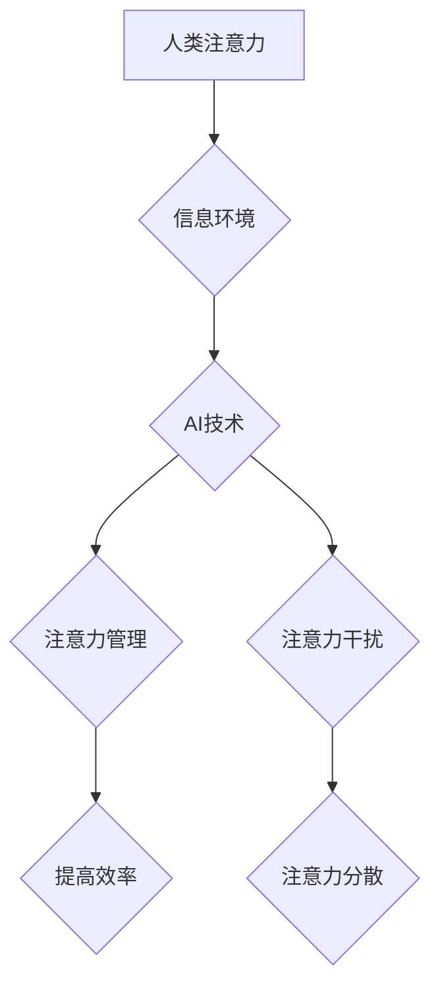

                 

## 关键词：人工智能、注意力流、注意力经济、深度学习、认知科学、用户体验、未来工作、未来生活

## 1. 背景介绍

在信息爆炸的时代，人类的注意力资源变得越来越稀缺。我们每天被来自各种渠道的信息轰炸，从社交媒体的通知到电子邮件的提醒，从新闻网站的滚动条到广告的推送，无处不在的干扰让我们难以集中精力完成任务。与此同时，人工智能（AI）技术飞速发展，其强大的计算能力和学习能力正在深刻地改变着我们的生活和工作方式。

AI技术的应用已经渗透到各个领域，从智能语音助手到自动驾驶汽车，从个性化推荐系统到医疗诊断辅助，AI正在帮助我们更高效地处理信息、完成任务和提升生活品质。然而，AI技术的快速发展也带来了新的挑战，其中之一就是如何与人类的注意力流相协调。

## 2. 核心概念与联系

### 2.1 人类注意力流

人类注意力流是指我们对信息进行选择性感知、加工和记忆的过程。它是一个复杂的心理过程，受多种因素影响，包括个体差异、环境刺激、任务要求等。注意力流的本质是有限的，我们无法同时关注所有信息，因此需要通过选择性地关注来过滤和处理信息。

### 2.2 注意力经济

注意力经济是指在信息过剩的时代，人们对注意力资源的竞争和交易。注意力成为了稀缺的资源，而那些能够有效地获取和利用注意力的人或组织，就能够获得更大的竞争优势。

### 2.3 AI与注意力流的融合

AI技术正在深刻地影响着人类的注意力流，一方面，AI可以帮助我们更有效地管理注意力，例如通过智能过滤信息、个性化推荐内容等方式，帮助我们集中精力完成重要任务。另一方面，AI也可能加剧注意力分散，例如通过推送个性化广告、制造信息茧房等方式，让我们更容易被信息干扰。

**Mermaid 流程图**



## 3. 核心算法原理 & 具体操作步骤

### 3.1 算法原理概述

注意力机制是近年来深度学习领域中一个重要的突破，它能够模拟人类的注意力机制，帮助模型更好地理解和处理信息。注意力机制的核心思想是，在处理信息时，模型应该关注那些与当前任务最相关的部分，而忽略那些无关的部分。

### 3.2 算法步骤详解

1. **输入数据:** 将输入数据（例如文本序列）转换为向量表示。
2. **计算注意力权重:** 使用注意力机制计算每个输入元素与当前输出元素之间的相关性，得到每个元素的注意力权重。
3. **加权求和:** 将每个输入元素与其注意力权重相乘，然后对所有元素进行加权求和，得到最终的输出。

### 3.3 算法优缺点

**优点:**

* 可以提高模型的准确性和效率。
* 可以帮助模型更好地理解上下文信息。
* 可以解释模型的决策过程。

**缺点:**

* 计算复杂度较高。
* 需要大量的训练数据。

### 3.4 算法应用领域

注意力机制在自然语言处理、计算机视觉、语音识别等领域都有广泛的应用，例如：

* **机器翻译:** 使用注意力机制可以帮助模型更好地理解源语言和目标语言之间的关系，从而提高翻译质量。
* **文本摘要:** 使用注意力机制可以帮助模型识别文本中最关键的信息，从而生成更准确的摘要。
* **图像识别:** 使用注意力机制可以帮助模型关注图像中最相关的区域，从而提高识别准确率。

## 4. 数学模型和公式 & 详细讲解 & 举例说明

### 4.1 数学模型构建

注意力机制的数学模型可以表示为以下公式：

$$
\text{Attention}(Q, K, V) = \text{softmax}\left(\frac{Q K^T}{\sqrt{d_k}}\right) V
$$

其中：

* $Q$：查询矩阵，表示当前需要关注的信息。
* $K$：键矩阵，表示所有输入元素的信息。
* $V$：值矩阵，表示所有输入元素的实际内容。
* $d_k$：键向量的维度。
* $\text{softmax}$：softmax函数，用于将注意力权重归一化。

### 4.2 公式推导过程

注意力机制的公式推导过程可以分为以下几个步骤：

1. 计算查询矩阵 $Q$ 与键矩阵 $K$ 的点积，得到一个得分矩阵。
2. 对得分矩阵进行归一化，得到注意力权重矩阵。
3. 将注意力权重矩阵与值矩阵 $V$ 进行加权求和，得到最终的输出。

### 4.3 案例分析与讲解

假设我们有一个文本序列 "The cat sat on the mat"，我们想要使用注意力机制来理解这句话的含义。

* $Q$：查询向量表示 "sat" 这个词。
* $K$：键向量表示每个词的信息。
* $V$：值向量表示每个词的实际内容。

通过计算 $Q$ 与 $K$ 的点积，我们可以得到每个词与 "sat" 的相关性得分。然后，通过 softmax 函数将这些得分归一化，得到每个词的注意力权重。最后，将注意力权重与 $V$ 进行加权求和，得到最终的输出，表示 "sat" 这个词在整个句子中的语义作用。

## 5. 项目实践：代码实例和详细解释说明

### 5.1 开发环境搭建

* Python 3.6+
* TensorFlow 或 PyTorch

### 5.2 源代码详细实现

```python
import tensorflow as tf

# 定义注意力机制层
class AttentionLayer(tf.keras.layers.Layer):
    def __init__(self, units):
        super(AttentionLayer, self).__init__()
        self.Wq = tf.keras.layers.Dense(units)
        self.Wk = tf.keras.layers.Dense(units)
        self.Wv = tf.keras.layers.Dense(units)
        self.fc = tf.keras.layers.Dense(units)

    def call(self, inputs):
        Q = self.Wq(inputs)
        K = self.Wk(inputs)
        V = self.Wv(inputs)
        attention_scores = tf.matmul(Q, K, transpose_b=True) / tf.math.sqrt(tf.cast(tf.shape(Q)[-1], tf.float32))
        attention_weights = tf.nn.softmax(attention_scores, axis=-1)
        output = tf.matmul(attention_weights, V)
        return self.fc(output)

# 使用注意力机制层
model = tf.keras.Sequential([
    tf.keras.layers.Embedding(input_dim=10000, output_dim=128),
    AttentionLayer(128),
    tf.keras.layers.Dense(10, activation='softmax')
])
```

### 5.3 代码解读与分析

* `AttentionLayer` 类定义了一个注意力机制层，包含三个稠密层 (`Wq`, `Wk`, `Wv`) 用于计算查询、键和值的表示，以及一个稠密层 (`fc`) 用于最终的输出。
* `call` 方法实现注意力机制的计算过程，包括计算注意力权重和加权求和。
* `model` 是一个简单的序列模型，包含嵌入层、注意力机制层和输出层。

### 5.4 运行结果展示

运行该模型可以对文本序列进行分类，例如判断句子是正面还是负面情感。

## 6. 实际应用场景

### 6.1 个性化推荐系统

注意力机制可以帮助推荐系统更好地理解用户的兴趣和偏好，从而提供更个性化的推荐结果。例如，电商平台可以使用注意力机制来分析用户的浏览历史、购买记录和评价信息，从而推荐更符合用户需求的商品。

### 6.2 智能客服系统

注意力机制可以帮助智能客服系统更好地理解用户的需求，从而提供更准确和有效的帮助。例如，聊天机器人可以使用注意力机制来分析用户的聊天记录，从而识别用户的意图和问题，并提供相应的解决方案。

### 6.3 教育领域

注意力机制可以帮助教育领域更好地理解学生的学习情况，从而提供更个性化的学习方案。例如，在线学习平台可以使用注意力机制来分析学生的学习行为，识别学生的学习难点，并提供相应的辅导和练习。

### 6.4 未来应用展望

随着人工智能技术的不断发展，注意力机制将在更多领域得到应用，例如：

* **医疗诊断:** 使用注意力机制来分析患者的病历、影像数据和基因信息，帮助医生更准确地诊断疾病。
* **金融风险管理:** 使用注意力机制来分析金融市场的数据，识别潜在的风险，并制定相应的风险控制策略。
* **自动驾驶:** 使用注意力机制来帮助自动驾驶汽车更好地感知周围环境，从而提高驾驶安全性和效率。

## 7. 工具和资源推荐

### 7.1 学习资源推荐

* **书籍:**
    * "深度学习" by Ian Goodfellow, Yoshua Bengio, and Aaron Courville
    * "Attention Is All You Need" by Vaswani et al.
* **在线课程:**
    * Coursera: Deep Learning Specialization
    * Udacity: Deep Learning Nanodegree

### 7.2 开发工具推荐

* **TensorFlow:** https://www.tensorflow.org/
* **PyTorch:** https://pytorch.org/

### 7.3 相关论文推荐

* "Attention Is All You Need"
* "BERT: Pre-training of Deep Bidirectional Transformers for Language Understanding"
* "Transformer-XL: Attentive Language Models Beyond a Fixed-Length Context"

## 8. 总结：未来发展趋势与挑战

### 8.1 研究成果总结

注意力机制是近年来深度学习领域取得的重要突破，它能够有效地模拟人类的注意力机制，并应用于各种自然语言处理、计算机视觉和语音识别等领域。

### 8.2 未来发展趋势

* **更强大的注意力机制:** 研究人员将继续探索更强大的注意力机制，例如长距离依赖的注意力机制、多模态注意力机制等。
* **注意力机制的解释性:** 如何更好地解释注意力机制的决策过程，使其更透明和可解释，是未来研究的重要方向。
* **注意力机制的应用扩展:** 注意力机制将在更多领域得到应用，例如医疗诊断、金融风险管理、自动驾驶等。

### 8.3 面临的挑战

* **计算复杂度:** 传统的注意力机制计算复杂度较高，难以处理大型数据集。
* **数据依赖性:** 注意力机制需要大量的训练数据才能达到最佳效果。
* **可解释性:** 注意力机制的决策过程相对复杂，难以解释其背后的逻辑。

### 8.4 研究展望

未来，注意力机制将继续发展和完善，并与其他人工智能技术相结合，为我们带来更多创新和应用。

## 9. 附录：常见问题与解答

### 9.1 什么是注意力机制？

注意力机制是一种模仿人类注意力机制的算法，它能够帮助模型更好地理解和处理信息。

### 9.2 注意力机制的应用场景有哪些？

注意力机制应用于自然语言处理、计算机视觉、语音识别等领域，例如机器翻译、文本摘要、图像识别等。

### 9.3 注意力机制的优缺点是什么？

**优点:**

* 可以提高模型的准确性和效率。
* 可以帮助模型更好地理解上下文信息。
* 可以解释模型的决策过程。

**缺点:**

* 计算复杂度较高。
* 需要大量的训练数据。


作者：禅与计算机程序设计艺术 / Zen and the Art of Computer Programming 
<end_of_turn>

