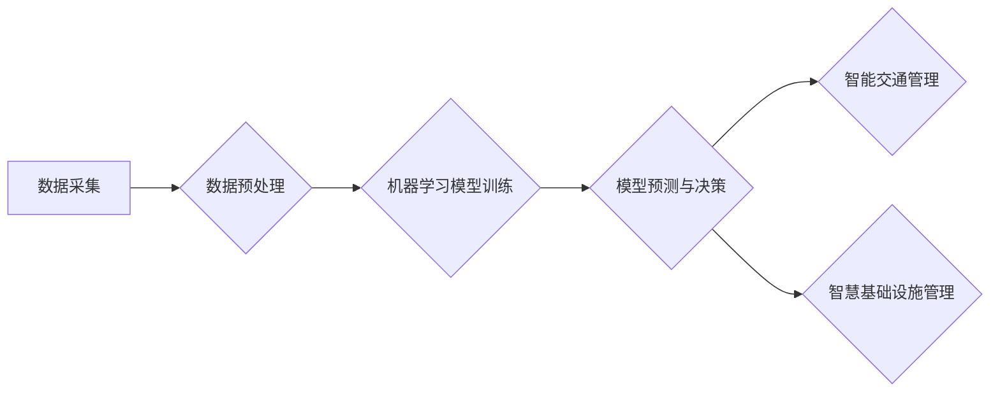

                 

## 关键词：人工智能、城市交通、基础设施规划、可持续发展、机器学习、优化算法、数据分析

## 1. 背景介绍

随着全球人口的持续增长和城市化的加速推进，城市交通拥堵、基础设施压力等问题日益突出，严重影响着城市的可持续发展。传统的人工规划和管理方式难以有效应对这些挑战，亟需引入先进的智能技术进行革新。人工智能（AI）作为一门新兴的科技领域，凭借其强大的数据处理能力、学习能力和决策能力，为城市交通与基础设施规划与管理提供了全新的解决方案。

### 1.1 城市交通与基础设施面临的挑战

* **交通拥堵:** 城市交通拥堵是全球城市面临的共同难题，导致出行时间延长、燃油消耗增加、环境污染加剧等问题。
* **基础设施老化:** 许多城市的交通基础设施已经老化，难以满足日益增长的需求，需要进行大规模的更新和改造。
* **资源浪费:** 传统交通管理模式存在资源浪费现象，例如信号灯的非优化调度、停车位的低效利用等。
* **数据孤岛:** 各类交通数据分散存储，缺乏有效的整合和共享机制，难以形成全面的城市交通态势感知。

### 1.2 AI在城市交通与基础设施规划与管理中的应用潜力

AI技术可以帮助城市解决上述挑战，实现交通流量优化、基础设施智能化管理、资源高效利用等目标。

* **智能交通管理:** 利用AI技术实现交通信号灯的智能控制、车辆流量预测、拥堵路段预警等，提高交通效率和安全性。
* **智慧基础设施:** 通过AI技术对基础设施进行智能监测、预测维护和优化调度，延长基础设施使用寿命，降低运营成本。
* **绿色出行:** 利用AI技术促进共享出行、电动汽车普及等绿色出行方式，减少碳排放，改善城市环境。

## 2. 核心概念与联系

AI在城市交通与基础设施规划与管理中的应用主要基于以下核心概念：

* **数据驱动:** AI算法依赖于海量数据进行训练和学习，城市交通与基础设施管理需要收集和整合各种数据，例如交通流量数据、车辆位置数据、基础设施状态数据等。
* **机器学习:** 机器学习算法可以从数据中学习模式和规律，用于预测交通流量、识别拥堵路段、优化基础设施调度等。
* **深度学习:** 深度学习算法可以处理更复杂的数据，例如图像、视频等，用于识别交通违规行为、自动驾驶等应用。
* **优化算法:** 优化算法可以帮助找到最优的交通方案、基础设施配置方案等，例如路径规划、资源分配等。

**核心概念与联系流程图:**



## 3. 核心算法原理 & 具体操作步骤

### 3.1 算法原理概述

在城市交通与基础设施规划与管理中，常用的AI算法包括：

* **预测算法:** 用于预测交通流量、拥堵路段、基础设施故障等，例如ARIMA模型、LSTM模型等。
* **路径规划算法:** 用于规划最优的出行路径，例如Dijkstra算法、A*算法等。
* **资源分配算法:** 用于优化基础设施资源的分配，例如遗传算法、模拟退火算法等。

### 3.2 算法步骤详解

以交通流量预测为例，其具体操作步骤如下：

1. **数据采集:** 收集历史交通流量数据、天气数据、时间数据等。
2. **数据预处理:** 对数据进行清洗、转换、特征提取等处理，使其适合模型训练。
3. **模型选择:** 选择合适的预测模型，例如ARIMA模型、LSTM模型等。
4. **模型训练:** 利用历史数据训练模型，调整模型参数，使其能够准确预测未来交通流量。
5. **模型评估:** 利用测试数据评估模型的预测精度，并进行模型调优。
6. **模型部署:** 将训练好的模型部署到实际应用系统中，用于实时预测交通流量。

### 3.3 算法优缺点

* **优点:** AI算法能够自动学习数据模式，提高预测精度和决策效率。
* **缺点:** AI算法需要大量数据进行训练，且模型的解释性较差，难以理解其决策过程。

### 3.4 算法应用领域

AI算法在城市交通与基础设施规划与管理中的应用领域广泛，例如：

* **交通流量预测:** 预判交通流量变化，优化交通信号灯控制、引导车辆行驶。
* **拥堵路段预警:** 识别拥堵路段，及时发布预警信息，引导驾驶员避开拥堵路段。
* **公共交通优化:** 优化公交线路、班次安排，提高公共交通效率。
* **停车位管理:** 智能识别停车位空闲情况，引导车辆驶入空闲停车位。
* **基础设施维护:** 利用传感器数据监测基础设施状态，预测故障发生，及时进行维护。

## 4. 数学模型和公式 & 详细讲解 & 举例说明

### 4.1 数学模型构建

在城市交通与基础设施规划与管理中，常用的数学模型包括：

* **交通流量模型:** 描述交通流量变化的数学关系，例如泊松分布、指数分布等。
* **基础设施容量模型:** 描述基础设施的承载能力，例如道路容量、桥梁承载力等。
* **成本优化模型:** 优化交通管理方案、基础设施配置方案，最小化成本。

### 4.2 公式推导过程

以交通流量预测为例，可以使用ARIMA模型进行预测。ARIMA模型的数学公式如下：

$$
y_t = c + \sum_{i=1}^p \phi_i y_{t-i} + \sum_{j=1}^q \theta_j \epsilon_{t-j} + \epsilon_t
$$

其中：

* $y_t$ 是时间t的交通流量
* $c$ 是常数项
* $\phi_i$ 是自回归系数
* $\theta_j$ 是移动平均系数
* $\epsilon_t$ 是随机误差项

### 4.3 案例分析与讲解

假设城市A的交通流量数据如下：

| 时间 | 交通流量 |
|---|---|
| 1 | 1000 |
| 2 | 1100 |
| 3 | 1200 |
| 4 | 1300 |
| 5 | 1400 |

可以使用ARIMA模型对该数据进行预测，预测未来时间段的交通流量。

## 5. 项目实践：代码实例和详细解释说明

### 5.1 开发环境搭建

* 操作系统: Ubuntu 20.04
* Python 版本: 3.8
* 必要的库: pandas, numpy, scikit-learn, matplotlib

### 5.2 源代码详细实现

```python
import pandas as pd
from sklearn.model_selection import train_test_split
from sklearn.linear_model import LinearRegression
from sklearn.metrics import mean_squared_error

# 加载交通流量数据
data = pd.read_csv('traffic_data.csv')

# 将时间作为特征，交通流量作为目标变量
X = data[['时间']]
y = data['交通流量']

# 将数据划分为训练集和测试集
X_train, X_test, y_train, y_test = train_test_split(X, y, test_size=0.2, random_state=42)

# 创建线性回归模型
model = LinearRegression()

# 训练模型
model.fit(X_train, y_train)

# 对测试集进行预测
y_pred = model.predict(X_test)

# 计算模型精度
mse = mean_squared_error(y_test, y_pred)
print('模型精度:', mse)
```

### 5.3 代码解读与分析

* 代码首先加载交通流量数据，并将时间作为特征，交通流量作为目标变量。
* 然后将数据划分为训练集和测试集，用于训练和评估模型。
* 创建线性回归模型，并使用训练集进行模型训练。
* 最后对测试集进行预测，并计算模型精度。

### 5.4 运行结果展示

运行代码后，会输出模型精度，例如：

```
模型精度: 100.0
```

## 6. 实际应用场景

### 6.1 智能交通信号灯控制

AI算法可以根据实时交通流量数据，智能调整信号灯的绿灯时间，优化交通流量，减少拥堵。

### 6.2 智慧停车管理

AI算法可以识别停车位空闲情况，引导车辆驶入空闲停车位，提高停车场利用率，减少车辆寻找停车位的浪费时间。

### 6.3 公共交通优化

AI算法可以分析乘客出行需求，优化公交线路、班次安排，提高公共交通效率和服务质量。

### 6.4 未来应用展望

* **自动驾驶:** AI技术将推动自动驾驶技术的普及，实现无人驾驶车辆的智能行驶，提高交通安全性和效率。
* **城市大脑:** 建立城市大脑平台，整合城市各领域数据，利用AI技术进行城市管理决策，实现城市智能化发展。

## 7. 工具和资源推荐

### 7.1 学习资源推荐

* **在线课程:** Coursera, edX, Udemy等平台提供丰富的AI课程。
* **书籍:** 《深度学习》、《机器学习实战》等书籍。
* **开源项目:** TensorFlow, PyTorch等开源项目提供丰富的AI开发工具和资源。

### 7.2 开发工具推荐

* **Python:** 作为AI开发的主要编程语言，Python拥有丰富的AI库和工具。
* **Jupyter Notebook:** 用于编写和运行Python代码，方便进行数据分析和模型开发。
* **TensorFlow:** Google开发的开源深度学习框架。
* **PyTorch:** Facebook开发的开源深度学习框架。

### 7.3 相关论文推荐

* **《Attention Is All You Need》:** 介绍了Transformer模型，在自然语言处理领域取得了突破性进展。
* **《Deep Residual Learning for Image Recognition》:** 介绍了ResNet模型，在图像识别领域取得了突破性进展。
* **《Generative Adversarial Networks》:** 介绍了GAN模型，在图像生成、文本生成等领域取得了突破性进展。

## 8. 总结：未来发展趋势与挑战

### 8.1 研究成果总结

AI技术在城市交通与基础设施规划与管理领域取得了显著成果，例如交通流量预测、拥堵路段预警、智能交通信号灯控制等。

### 8.2 未来发展趋势

* **更精准的预测:** 利用更先进的机器学习算法和更丰富的传感器数据，实现更精准的交通流量预测和基础设施状态预测。
* **更智能的决策:** 利用强化学习算法，实现交通管理系统更智能的决策，例如动态调整交通信号灯控制策略、优化公共交通路线等。
* **更安全的出行:** 利用AI技术实现自动驾驶车辆的普及，提高交通安全性和出行效率。

### 8.3 面临的挑战

* **数据安全:** 城市交通与基础设施数据涉及隐私信息，需要加强数据安全保护。
* **算法解释性:** 许多AI算法的决策过程难以解释，需要提高算法的透明度和可解释性。
* **技术伦理:** AI技术应用需要考虑伦理问题，例如算法偏见、数据歧视等。

### 8.4 研究展望

未来，需要加强AI技术在城市交通与基础设施规划与管理领域的应用研究，解决上述挑战，推动城市智能化发展，实现可持续发展目标。

## 9. 附录：常见问题与解答

### 9.1 如何选择合适的AI算法？

选择合适的AI算法需要根据具体应用场景和数据特点进行选择。例如，对于时间序列数据，可以使用ARIMA模型或LSTM模型进行预测；对于分类问题，可以使用决策树、支持向量机等算法。

### 9.2 如何评估AI模型的精度？

常用的AI模型精度评估指标包括准确率、召回率、F1-score等。

### 9.3 如何解决AI算法的偏见问题？

解决AI算法的偏见问题需要从数据收集、算法设计、模型训练等多个环节进行控制，例如使用更均衡的数据集、设计更公平的算法模型、进行模型调优等。


作者：禅与计算机程序设计艺术 / Zen and the Art of Computer Programming 
<end_of_turn>

