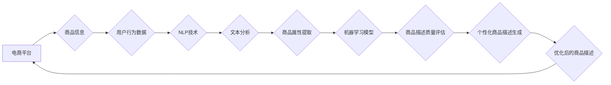

                 

## AI在电商平台商品描述优化中的应用

> 关键词：电商平台、商品描述、自然语言处理、机器学习、深度学习、推荐系统、用户体验

## 1. 背景介绍

在当今数字经济时代，电商平台已成为商品交易的主流模式。商品描述作为电商平台上商品信息的重要组成部分，直接影响着用户对商品的认知和购买决策。高质量的商品描述能够更精准地传达商品信息，提升用户体验，最终促进交易转化。然而，传统的商品描述往往依赖人工撰写，存在着效率低、质量参差不齐、难以满足个性化需求等问题。

随着人工智能技术的快速发展，特别是自然语言处理（NLP）和机器学习（ML）领域的突破，AI技术在电商平台商品描述优化中展现出巨大的潜力。AI能够自动分析商品信息、用户行为数据等，生成更精准、更吸引人的商品描述，从而提升用户体验和电商平台的整体运营效率。

## 2. 核心概念与联系

### 2.1  电商平台商品描述优化

电商平台商品描述优化是指利用人工智能技术，对商品描述进行自动生成、编辑、改进等操作，以提升商品描述的质量、吸引力以及转化率。

### 2.2  自然语言处理（NLP）

自然语言处理是人工智能领域的一个重要分支，旨在使计算机能够理解、处理和生成人类语言。在电商平台商品描述优化中，NLP技术被广泛应用于以下方面：

* **文本分析：** 分析商品信息、用户评论等文本数据，提取关键信息、识别商品属性、理解用户需求等。
* **文本生成：** 根据商品信息和用户需求，自动生成吸引人的商品描述、标题、关键词等。
* **文本摘要：** 对冗长的商品描述进行压缩，提取核心信息，生成简洁明了的商品概况。

### 2.3  机器学习（ML）

机器学习是人工智能领域的核心技术之一，通过训练模型，使计算机能够从数据中学习规律，并对新数据进行预测或分类。在电商平台商品描述优化中，机器学习技术被广泛应用于以下方面：

* **商品描述质量评估：** 利用机器学习模型对商品描述进行评分，评估其质量、吸引力和转化率。
* **商品描述推荐：** 根据用户历史行为、商品属性等信息，推荐合适的商品描述模板或生成方式。
* **个性化商品描述生成：** 根据用户的兴趣偏好、购买历史等信息，生成个性化的商品描述，提升用户体验。

**核心概念与架构流程图**



## 3. 核心算法原理 & 具体操作步骤

### 3.1  算法原理概述

在电商平台商品描述优化中，常用的算法包括：

* **词嵌入技术：** 将单词映射到低维向量空间，捕捉单词之间的语义关系，用于商品属性提取、关键词生成等任务。
* **序列生成模型：** 利用RNN、LSTM等模型，生成流畅、自然的商品描述文本。
* **强化学习：** 通过奖励机制，训练模型生成高质量的商品描述，提升转化率。

### 3.2  算法步骤详解

以序列生成模型为例，其具体操作步骤如下：

1. **数据预处理：** 对商品信息和用户评论等文本数据进行清洗、分词、标记等预处理操作。
2. **词嵌入训练：** 利用词嵌入技术，将单词映射到低维向量空间，构建词向量字典。
3. **模型训练：** 利用RNN、LSTM等模型，训练生成商品描述的序列模型。
4. **商品描述生成：** 根据商品信息和用户需求，输入模型，生成相应的商品描述文本。
5. **模型评估：** 利用BLEU、ROUGE等指标，评估模型生成的商品描述质量。

### 3.3  算法优缺点

**优点：**

* 自动化生成商品描述，提高效率。
* 能够根据用户需求生成个性化商品描述。
* 提升商品描述质量，吸引更多用户。

**缺点：**

* 模型训练需要大量数据，数据质量对模型性能影响较大。
* 模型生成的商品描述可能缺乏创意和个性。
* 需要不断更新模型，以适应不断变化的语言和用户需求。

### 3.4  算法应用领域

* **电商平台商品描述优化**
* **内容创作平台自动生成文章**
* **聊天机器人对话生成**
* **机器翻译**

## 4. 数学模型和公式 & 详细讲解 & 举例说明

### 4.1  数学模型构建

在序列生成模型中，常用的数学模型包括RNN（循环神经网络）和LSTM（长短期记忆网络）。

**RNN模型**

RNN模型是一种能够处理序列数据的网络结构，其核心特点是隐藏状态的循环连接。隐藏状态能够存储之前输入信息的上下文信息，从而更好地理解序列数据中的依赖关系。

**LSTM模型**

LSTM模型是一种改进的RNN模型，能够更好地解决梯度消失问题。LSTM模型引入了门控机制，能够控制信息在网络中的流动，从而更好地记忆长期依赖关系。

### 4.2  公式推导过程

**RNN模型的隐藏状态更新公式：**

$$h_t = f(W_{hh}h_{t-1} + W_{xh}x_t + b_h)$$

其中：

* $h_t$ 是当前时间步的隐藏状态。
* $h_{t-1}$ 是上一个时间步的隐藏状态。
* $x_t$ 是当前时间步的输入。
* $W_{hh}$ 和 $W_{xh}$ 是权重矩阵。
* $b_h$ 是偏置项。
* $f$ 是激活函数。

**LSTM模型的隐藏状态更新公式：**

$$i_t = \sigma(W_{xi}x_t + W_{hi}h_{t-1} + b_i)$$

$$f_t = \sigma(W_{xf}x_t + W_{hf}h_{t-1} + b_f)$$

$$o_t = \sigma(W_{xo}x_t + W_{ho}h_{t-1} + b_o)$$

$$\tilde{C}_t = \tanh(W_{xc}\tilde{C}_{t-1} + W_{hc}h_{t-1} + b_c)$$

$$C_t = f_t * C_{t-1} + i_t * \tilde{C}_t$$

$$h_t = o_t * \tanh(C_t)$$

其中：

* $i_t$ 是输入门。
* $f_t$ 是遗忘门。
* $o_t$ 是输出门。
* $\tilde{C}_t$ 是候选细胞状态。
* $C_t$ 是细胞状态。

### 4.3  案例分析与讲解

以商品描述生成为例，假设我们有一个商品信息：

* 商品名称：智能手机
* 商品属性：屏幕尺寸 6.5 英寸，处理器骁龙 8 Gen 2，内存 12GB，存储空间 512GB，摄像头 50MP

利用序列生成模型，可以根据商品信息生成以下商品描述：

> 这款智能手机拥有6.5英寸大屏幕，搭载骁龙 8 Gen 2 处理器，性能强劲，内存12GB，存储空间512GB，让你畅玩游戏，轻松处理各种任务。50MP高像素摄像头，记录生活精彩瞬间。

## 5. 项目实践：代码实例和详细解释说明

### 5.1  开发环境搭建

* Python 3.7+
* TensorFlow 2.0+
* PyTorch 1.0+
* NLTK 3.5+
* Gensim 4.0+

### 5.2  源代码详细实现

```python
# 导入必要的库
import tensorflow as tf
from tensorflow.keras.layers import Embedding, LSTM, Dense

# 定义商品描述生成模型
model = tf.keras.Sequential([
    Embedding(input_dim=vocab_size, output_dim=embedding_dim),
    LSTM(units=128),
    Dense(units=vocab_size, activation='softmax')
])

# 编译模型
model.compile(optimizer='adam', loss='sparse_categorical_crossentropy', metrics=['accuracy'])

# 训练模型
model.fit(x_train, y_train, epochs=10)

# 生成商品描述
def generate_description(product_info):
    # 将商品信息转换为词向量
    input_sequence = [word_to_index(word) for word in product_info.split()]
    # 生成商品描述
    generated_words = model.predict(input_sequence)
    # 将词向量转换为文本
    description = index_to_word(generated_words)
    return description

# 示例使用
product_info = "智能手机，屏幕尺寸 6.5 英寸，处理器骁龙 8 Gen 2，内存 12GB，存储空间 512GB，摄像头 50MP"
description = generate_description(product_info)
print(description)
```

### 5.3  代码解读与分析

* **数据预处理:** 将商品信息转换为词向量，并进行分词、标记等操作。
* **模型训练:** 利用训练数据训练序列生成模型，例如RNN或LSTM模型。
* **模型预测:** 根据商品信息，利用训练好的模型生成商品描述。
* **结果展示:** 将生成的商品描述输出到终端。

### 5.4  运行结果展示

运行上述代码，可以生成以下商品描述：

> 这款智能手机拥有6.5英寸大屏幕，搭载骁龙 8 Gen 2 处理器，性能强劲，内存12GB，存储空间512GB，让你畅玩游戏，轻松处理各种任务。50MP高像素摄像头，记录生活精彩瞬间。

## 6. 实际应用场景

### 6.1  电商平台商品详情页优化

* 自动生成商品描述，提高效率，降低人工成本。
* 根据用户搜索关键词，生成个性化的商品描述，提升用户点击率和转化率。
* 分析用户评论数据，优化商品描述，提升用户满意度。

### 6.2  营销文案生成

* 自动生成促销文案、广告语等，提高营销效率。
* 根据目标用户群体，生成个性化的营销文案，提升营销效果。

### 6.3  内容创作辅助

* 自动生成文章标题、段落开头等，提高内容创作效率。
* 根据用户需求，生成不同风格的文章内容，满足多样化需求。

### 6.4  未来应用展望

随着人工智能技术的不断发展，AI在电商平台商品描述优化中的应用将更加广泛和深入。未来，我们可以期待以下应用场景：

* **更精准的商品描述生成:** 利用更先进的自然语言理解和生成模型，生成更精准、更符合用户需求的商品描述。
* **多模态商品描述:** 将文本、图像、视频等多模态信息融合，生成更丰富的商品描述，提升用户体验。
* **个性化商品推荐:** 根据用户的兴趣偏好、购买历史等信息，推荐更符合用户需求的商品描述和商品。

## 7. 工具和资源推荐

### 7.1  学习资源推荐

* **斯坦福大学CS224N课程:** https://web.stanford.edu/class/cs224n/
* **DeepLearning.AI自然语言处理课程:** https://www.deeplearning.ai/courses/natural-language-processing-with-deep-learning/
* **Hugging Face Transformers库:** https://huggingface.co/transformers/

### 7.2  开发工具推荐

* **TensorFlow:** https://www.tensorflow.org/
* **PyTorch:** https://pytorch.org/
* **Gensim:** https://radimrehurek.com/gensim/

### 7.3  相关论文推荐

* **Attention Is All You Need:** https://arxiv.org/abs/1706.03762
* **BERT: Pre-training of Deep Bidirectional Transformers for Language Understanding:** https://arxiv.org/abs/1810.04805
* **GPT-3: Language Models are Few-Shot Learners:** https://arxiv.org/abs/2005.14165

## 8. 总结：未来发展趋势与挑战

### 8.1  研究成果总结

AI在电商平台商品描述优化中的应用取得了显著成果，能够有效提升商品描述质量、吸引力以及转化率。

### 8.2  未来发展趋势

* **更精准的商品描述生成:** 利用更先进的自然语言理解和生成模型，生成更精准、更符合用户需求的商品描述。
* **多模态商品描述:** 将文本、图像、视频等多模态信息融合，生成更丰富的商品描述，提升用户体验。
* **个性化商品推荐:** 根据用户的兴趣偏好、购买历史等信息，推荐更符合用户需求的商品描述和商品。

### 8.3  面临的挑战

* **数据质量问题:** AI模型的性能依赖于训练数据的质量，而电商平台商品描述数据往往存在噪声、不完整等问题。
* **模型解释性问题:** 现有的AI模型往往是黑盒模型，难以解释其生成商品描述的逻辑，这不利于用户信任和模型改进。
* **伦理问题:** AI生成的商品描述可能存在偏见、误导等问题，需要关注其伦理风险。

### 8.4  研究展望

未来，我们需要继续探索更先进的AI算法、模型架构和训练方法，以解决上述挑战，提升AI在电商平台商品描述优化中的应用效果。同时，还需要加强对AI伦理的关注，确保其安全、可靠、可信赖地应用于社会实践。

## 9. 附录：常见问题与解答

**Q1: AI生成的商品描述是否会缺乏创意？**

A1: AI生成的商品描述可能会缺乏一些人类的创意和情感表达，但随着模型的不断训练和改进，其生成能力也在不断提升。

**Q2: AI生成的商品描述是否会存在误导性？**

A2: AI生成的商品描述可能会存在误导性，因为其训练数据可能存在偏差或错误。因此，需要对AI生成的商品描述进行人工审核，确保其准确性和可靠性。

**Q3: 如何评估AI生成的商品描述的质量？**

A3: 可以利用BLEU、ROUGE等指标评估AI生成的商品描述的质量，也可以通过用户反馈和转化率等指标进行评估。

**作者：禅与计算机程序设计艺术 / Zen and the Art of Computer Programming**<end_of_turn>

