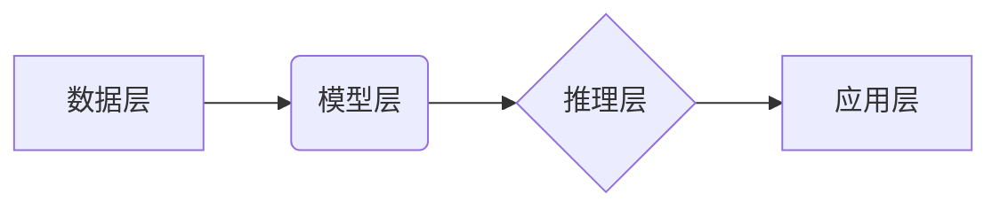

                 

## AI基础设施的全球化：Lepton AI的国际标准制定

> 关键词：人工智能基础设施、全球化、Lepton AI、国际标准、可互操作性、开源、AI伦理

## 1. 背景介绍

人工智能（AI）正以惊人的速度发展，其应用领域不断扩展，从医疗保健和金融到交通和娱乐，AI正在深刻地改变着我们的生活。然而，AI技术的蓬勃发展也面临着一些挑战，其中之一就是AI基础设施的全球化。

当前，AI基础设施呈现出碎片化、封闭的趋势，不同厂商和地区的解决方案缺乏标准化和互操作性，这阻碍了AI技术的广泛应用和创新。为了解决这一问题，Lepton AI应运而生。Lepton AI是一个致力于推动AI基础设施全球化的开源项目，其目标是制定国际标准，构建一个开放、可互操作、安全可靠的AI基础设施生态系统。

## 2. 核心概念与联系

Lepton AI的核心概念是基于开放标准的AI基础设施，它旨在通过以下几个方面实现全球化：

* **开放标准：** Lepton AI倡导采用开放的标准接口和协议，使不同厂商和地区的AI解决方案能够互联互通。
* **开源社区：** Lepton AI是一个开源项目，鼓励全球开发者参与到项目的开发和维护中，共同推动AI基础设施的进步。
* **多语言支持：** Lepton AI支持多种编程语言和数据格式，以适应全球用户的需求。
* **跨平台部署：** Lepton AI可以部署在各种平台上，包括云端、边缘设备和本地服务器。

Lepton AI的架构可以概括为以下几个层级：

* **数据层：** 负责存储和管理AI训练和推理所需的数据。
* **模型层：** 负责开发和部署AI模型。
* **推理层：** 负责对数据进行推理，并生成预测结果。
* **应用层：** 负责将AI模型的预测结果应用到实际场景中。

## 3. 核心算法原理 & 具体操作步骤

Lepton AI的核心算法原理是基于深度学习的，它采用多层神经网络来学习数据中的模式和关系。

### 3.1  算法原理概述

深度学习算法的核心思想是通过多层神经网络来模拟人类大脑的学习过程。每个神经元都接收来自其他神经元的输入信号，并根据这些信号进行计算，最终输出一个信号。神经网络的每一层都包含多个神经元，这些神经元之间通过连接权重进行信息传递。

通过训练，神经网络的连接权重会不断调整，以最小化预测误差。训练过程通常使用大量的标注数据，通过反向传播算法来更新神经网络的权重。

### 3.2  算法步骤详解

Lepton AI的深度学习算法具体操作步骤如下：

1. **数据预处理：** 将原始数据进行清洗、转换和特征提取，使其适合深度学习模型的训练。
2. **模型构建：** 根据具体的应用场景，选择合适的深度学习模型架构，例如卷积神经网络（CNN）、循环神经网络（RNN）或Transformer。
3. **模型训练：** 使用训练数据对深度学习模型进行训练，通过反向传播算法不断调整模型的权重，以最小化预测误差。
4. **模型评估：** 使用测试数据对训练好的模型进行评估，并根据评估结果进行模型调优。
5. **模型部署：** 将训练好的模型部署到实际应用场景中，用于进行预测或其他AI任务。

### 3.3  算法优缺点

Lepton AI的深度学习算法具有以下优点：

* **高精度：** 深度学习算法能够学习数据中的复杂模式，从而实现高精度的预测。
* **自动化特征提取：** 深度学习算法能够自动提取数据的特征，无需人工干预。
* **可扩展性：** 深度学习算法可以处理海量数据，并可以轻松扩展到更大的模型规模。

但也存在一些缺点：

* **数据依赖性：** 深度学习算法需要大量的标注数据进行训练，否则性能会下降。
* **训练时间长：** 深度学习模型的训练时间通常较长，需要强大的计算资源。
* **可解释性差：** 深度学习模型的决策过程比较复杂，难以解释其预测结果。

### 3.4  算法应用领域

Lepton AI的深度学习算法在各个领域都有广泛的应用，例如：

* **图像识别：** 用于识别物体、场景和人脸。
* **自然语言处理：** 用于机器翻译、文本摘要和对话系统。
* **语音识别：** 用于语音转文本和语音助手。
* **推荐系统：** 用于推荐商品、电影和音乐。
* **医疗诊断：** 用于辅助医生诊断疾病。

## 4. 数学模型和公式 & 详细讲解 & 举例说明

Lepton AI的深度学习算法基于数学模型和公式，这些模型和公式描述了神经网络的结构和学习过程。

### 4.1  数学模型构建

深度学习模型通常由多个层组成，每一层包含多个神经元。每个神经元接收来自上一层的输出信号，并通过激活函数进行处理，最终输出一个信号。

神经网络的结构可以用以下数学模型来表示：

$$
y = f(W x + b)
$$

其中：

* $y$ 是神经元的输出信号。
* $x$ 是神经元的输入信号。
* $W$ 是连接权重矩阵。
* $b$ 是偏置项。
* $f$ 是激活函数。

### 4.2  公式推导过程

反向传播算法是深度学习模型训练的核心算法，它通过计算误差梯度来更新神经网络的权重。

反向传播算法的推导过程比较复杂，涉及到微积分和线性代数的知识。

### 4.3  案例分析与讲解

例如，在图像识别任务中，深度学习模型可以学习图像中的特征，并将其映射到不同的类别。

假设我们有一个包含10个类别的图像识别模型，每个类别对应一个输出神经元。

当模型对一张图像进行预测时，每个输出神经元都会输出一个分数，表示该图像属于该类别的概率。

模型的输出结果是所有输出神经元的分数向量，其中分数最高的类别被认为是图像的预测类别。

## 5. 项目实践：代码实例和详细解释说明

Lepton AI提供了丰富的代码示例和文档，帮助开发者快速上手。

### 5.1  开发环境搭建

Lepton AI支持多种开发环境，例如Python、Java和C++。

开发者需要根据自己的需求选择合适的开发环境，并安装必要的软件包。

### 5.2  源代码详细实现

Lepton AI的源代码托管在GitHub上，开发者可以从GitHub上下载源代码并进行修改和扩展。

### 5.3  代码解读与分析

Lepton AI的代码结构清晰，注释详细，易于理解和维护。

开发者可以参考代码注释和文档，了解Lepton AI的各个模块的功能和使用方法。

### 5.4  运行结果展示

Lepton AI提供了多种工具和方法来展示运行结果，例如可视化工具和性能指标。

开发者可以根据自己的需求选择合适的工具来展示Lepton AI的运行结果。

## 6. 实际应用场景

Lepton AI的开源特性使其能够应用于各种实际场景，例如：

### 6.1  医疗诊断

Lepton AI可以用于辅助医生诊断疾病，例如识别肿瘤、分析X光片和检测病理样本。

### 6.2  金融风险控制

Lepton AI可以用于识别金融欺诈、评估信用风险和预测市场趋势。

### 6.3  智能制造

Lepton AI可以用于优化生产流程、预测设备故障和提高生产效率。

### 6.4  未来应用展望

随着AI技术的不断发展，Lepton AI的应用场景将会更加广泛，例如：

* **个性化教育：** 根据学生的学习情况提供个性化的学习方案。
* **智能交通：** 优化交通流量、预测交通拥堵和提高交通安全。
* **环境保护：** 监测环境污染、预测自然灾害和保护生物多样性。

## 7. 工具和资源推荐

### 7.1  学习资源推荐

* **Lepton AI官方文档：** https://lepton.ai/docs/
* **深度学习教程：** https://www.deeplearning.ai/
* **TensorFlow官方网站：** https://www.tensorflow.org/

### 7.2  开发工具推荐

* **Python：** https://www.python.org/
* **TensorFlow：** https://www.tensorflow.org/
* **PyTorch：** https://pytorch.org/

### 7.3  相关论文推荐

* **《ImageNet Classification with Deep Convolutional Neural Networks》**
* **《Attention Is All You Need》**
* **《BERT: Pre-training of Deep Bidirectional Transformers for Language Understanding》**

## 8. 总结：未来发展趋势与挑战

### 8.1  研究成果总结

Lepton AI的开源特性和国际标准化的目标，为全球AI基础设施的建设提供了重要的参考和借鉴。

Lepton AI的深度学习算法在各个领域都取得了显著的成果，为推动AI技术的应用提供了强大的技术支撑。

### 8.2  未来发展趋势

Lepton AI未来将继续致力于以下几个方面：

* **完善国际标准：** 与全球开发者和研究机构合作，制定更完善的AI基础设施标准。
* **扩展算法库：** 开发更多先进的深度学习算法，满足不同应用场景的需求。
* **提升平台性能：** 优化Lepton AI平台的性能和效率，使其能够处理更大的数据规模和更复杂的模型。
* **加强社区建设：** 鼓励更多开发者参与到Lepton AI的社区建设中，共同推动AI基础设施的进步。

### 8.3  面临的挑战

Lepton AI也面临着一些挑战：

* **标准化难度：** AI技术发展迅速，标准化难度较大，需要不断更新和完善标准。
* **数据安全和隐私：** AI模型的训练需要大量数据，如何保证数据安全和隐私是一个重要的挑战。
* **AI伦理问题：** AI技术的应用可能会带来一些伦理问题，例如算法偏见和就业问题，需要认真思考和解决。

### 8.4  研究展望

Lepton AI将继续致力于推动AI基础设施的全球化，为全球开发者和研究机构提供一个开放、可互操作、安全可靠的AI平台，共同构建一个更加智能、美好的未来。

## 9. 附录：常见问题与解答

### 9.1  Q1：Lepton AI是开源的吗？

A1：是的，Lepton AI是一个完全开源的项目。

### 9.2  Q2：Lepton AI支持哪些编程语言？

A2：Lepton AI支持Python、Java和C++等多种编程语言。

### 9.3  Q3：Lepton AI的文档在哪里？

A3：Lepton AI的官方文档可以在https://lepton.ai/docs/上找到。

作者：禅与计算机程序设计艺术 / Zen and the Art of Computer Programming 
<end_of_turn>

