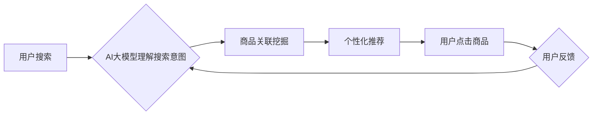

                 

## AI大模型赋能电商搜索推荐的业务创新流程再造方法

> 关键词：AI大模型、电商搜索、推荐系统、业务创新、流程再造、深度学习、Transformer

## 1. 背景介绍

随着电商行业的蓬勃发展，用户对商品搜索和推荐的需求日益增长。传统的基于关键词匹配和协同过滤的搜索推荐算法已难以满足用户个性化、精准化和多样化的需求。而近年来，深度学习技术的快速发展，特别是大规模预训练语言模型（如BERT、GPT、T5等）的出现，为电商搜索推荐带来了新的机遇。

AI大模型凭借其强大的语义理解、文本生成和知识表示能力，能够有效提升电商搜索推荐的精准度、个性化程度和用户体验。例如，AI大模型可以理解用户搜索意图，挖掘商品之间的潜在关联，并生成更精准的搜索结果和推荐列表。

## 2. 核心概念与联系

### 2.1  电商搜索推荐系统

电商搜索推荐系统是电商平台的核心功能之一，其目的是帮助用户快速找到所需商品，并提供个性化的商品推荐。传统的电商搜索推荐系统主要基于以下两种算法：

* **关键词匹配:** 根据用户输入的关键词，从商品数据库中匹配出相关的商品。
* **协同过滤:** 根据用户的历史购买行为和浏览记录，推荐与之相似的用户购买过的商品。

### 2.2  AI大模型

AI大模型是指在海量数据上进行预训练的深度学习模型，具有强大的泛化能力和语义理解能力。常见的AI大模型包括：

* **BERT:** 基于Transformer架构的预训练语言模型，擅长理解文本语义和关系。
* **GPT:** 基于Transformer架构的文本生成模型，擅长生成流畅自然的文本。
* **T5:** 基于Transformer架构的文本到文本转换模型，可以用于多种自然语言处理任务，如文本分类、问答和机器翻译。

### 2.3  AI大模型赋能电商搜索推荐

AI大模型可以有效提升电商搜索推荐系统的性能，主要体现在以下几个方面：

* **语义理解:** AI大模型可以理解用户搜索意图，即使用户输入的关键词不完全匹配商品描述，也能找到相关的商品。
* **关联挖掘:** AI大模型可以挖掘商品之间的潜在关联，例如，用户搜索“牛仔裤”时，AI大模型可以推荐“牛仔外套”、“牛仔衬衫”等相关商品。
* **个性化推荐:** AI大模型可以根据用户的历史购买行为、浏览记录和兴趣偏好，提供个性化的商品推荐。

**核心概念与联系流程图**



## 3. 核心算法原理 & 具体操作步骤

### 3.1  算法原理概述

AI大模型赋能电商搜索推荐的核心算法原理是基于深度学习的**语义嵌入**和**推荐模型**。

* **语义嵌入:** 将商品、用户和关键词等实体映射到低维向量空间，通过向量之间的相似度计算，实现语义理解和关联挖掘。
* **推荐模型:** 基于语义嵌入和用户行为数据，构建推荐模型，预测用户对商品的兴趣和点击概率。

### 3.2  算法步骤详解

1. **数据预处理:** 收集商品信息、用户行为数据和文本数据，进行清洗、格式化和特征提取。
2. **语义嵌入:** 使用预训练的AI大模型，对商品、用户和关键词进行语义嵌入，得到低维向量表示。
3. **推荐模型训练:** 基于语义嵌入和用户行为数据，选择合适的推荐模型，例如协同过滤、深度神经网络等，进行模型训练。
4. **推荐结果生成:** 将用户搜索的关键词或用户行为数据作为输入，通过训练好的推荐模型，生成个性化的商品推荐结果。
5. **结果评估:** 使用指标如点击率、转化率等，评估推荐系统的性能，并根据评估结果进行模型调优和迭代。

### 3.3  算法优缺点

**优点:**

* **语义理解能力强:** 可以理解用户搜索意图，即使关键词不完全匹配，也能找到相关的商品。
* **关联挖掘能力强:** 可以挖掘商品之间的潜在关联，提供更精准的推荐。
* **个性化推荐:** 可以根据用户的历史行为和兴趣偏好，提供个性化的商品推荐。

**缺点:**

* **数据依赖性强:** 需要海量的数据进行训练，才能获得较好的效果。
* **计算资源消耗大:** 训练和部署AI大模型需要大量的计算资源。
* **模型解释性差:** 深度学习模型的内部机制复杂，难以解释推荐结果的生成过程。

### 3.4  算法应用领域

AI大模型赋能电商搜索推荐的算法应用领域广泛，包括：

* **商品搜索:** 提升商品搜索的精准度和相关性。
* **个性化推荐:** 提供个性化的商品推荐，提高用户购物体验。
* **新品推荐:** 推荐新上市的商品，促进新品销售。
* **跨界推荐:** 推荐与用户兴趣相关的跨界商品，拓展用户消费场景。

## 4. 数学模型和公式 & 详细讲解 & 举例说明

### 4.1  数学模型构建

**语义嵌入模型:**

假设我们有商品集合 $C = \{c_1, c_2, ..., c_n\}$，用户集合 $U = \{u_1, u_2, ..., u_m\}$，关键词集合 $W = \{w_1, w_2, ..., w_l\}$。

* **商品嵌入:** 将每个商品 $c_i$ 映射到一个低维向量 $c_i \in R^d$，表示商品的语义特征。
* **用户嵌入:** 将每个用户 $u_j$ 映射到一个低维向量 $u_j \in R^d$，表示用户的兴趣偏好。
* **关键词嵌入:** 将每个关键词 $w_k$ 映射到一个低维向量 $w_k \in R^d$，表示关键词的语义特征。

**推荐模型:**

可以使用协同过滤、深度神经网络等模型，基于商品嵌入、用户嵌入和关键词嵌入，预测用户对商品的兴趣和点击概率。

### 4.2  公式推导过程

**协同过滤模型:**

假设用户 $u_j$ 对商品 $c_i$ 的评分为 $r_{ij}$，可以使用以下公式计算用户 $u_j$ 对商品 $c_i$ 的预测评分:

$$
\hat{r}_{ij} = \mu + b_j + b_i + \mathbf{u}_j^T \mathbf{c}_i
$$

其中:

* $\mu$ 是全局平均评分。
* $b_j$ 是用户 $u_j$ 的偏差。
* $b_i$ 是商品 $c_i$ 的偏差。
* $\mathbf{u}_j$ 是用户 $u_j$ 的嵌入向量。
* $\mathbf{c}_i$ 是商品 $c_i$ 的嵌入向量。

**深度神经网络模型:**

可以使用多层感知机 (MLP)、卷积神经网络 (CNN) 或循环神经网络 (RNN) 等模型，构建更复杂的推荐模型，并使用反向传播算法进行训练。

### 4.3  案例分析与讲解

**案例:**

假设用户 $u_1$ 搜索了关键词 “牛仔裤”，AI大模型将 “牛仔裤” 嵌入到向量 $w_1$，并根据用户 $u_1$ 的历史行为数据，得到用户 $u_1$ 的嵌入向量 $u_1$。

推荐模型根据 $u_1$ 和 $w_1$ 的向量表示，从商品数据库中找到与之最相似的商品，并生成推荐列表。

**讲解:**

AI大模型通过语义嵌入，理解了用户搜索的意图，并根据用户历史行为数据，个性化推荐了相关的商品。

## 5. 项目实践：代码实例和详细解释说明

### 5.1  开发环境搭建

* **操作系统:** Linux/macOS
* **编程语言:** Python
* **深度学习框架:** TensorFlow/PyTorch
* **其他工具:** Git、Jupyter Notebook

### 5.2  源代码详细实现

```python
# 导入必要的库
import tensorflow as tf

# 定义商品嵌入层
class ItemEmbedding(tf.keras.layers.Layer):
    def __init__(self, embedding_dim):
        super(ItemEmbedding, self).__init__()
        self.embedding_dim = embedding_dim
        self.embeddings = tf.Variable(tf.random.normal([num_items, embedding_dim]))

    def call(self, inputs):
        return tf.nn.embedding_lookup(self.embeddings, inputs)

# 定义用户嵌入层
class UserEmbedding(tf.keras.layers.Layer):
    def __init__(self, embedding_dim):
        super(UserEmbedding, self).__init__()
        self.embedding_dim = embedding_dim
        self.embeddings = tf.Variable(tf.random.normal([num_users, embedding_dim]))

    def call(self, inputs):
        return tf.nn.embedding_lookup(self.embeddings, inputs)

# 定义推荐模型
class RecommenderModel(tf.keras.Model):
    def __init__(self, embedding_dim):
        super(RecommenderModel, self).__init__()
        self.item_embedding = ItemEmbedding(embedding_dim)
        self.user_embedding = UserEmbedding(embedding_dim)
        self.dense = tf.keras.layers.Dense(1, activation='sigmoid')

    def call(self, user_id, item_id):
        user_embedding = self.user_embedding(user_id)
        item_embedding = self.item_embedding(item_id)
        combined_embedding = user_embedding * item_embedding
        prediction = self.dense(combined_embedding)
        return prediction

# 训练模型
model = RecommenderModel(embedding_dim=64)
model.compile(optimizer='adam', loss='binary_crossentropy', metrics=['accuracy'])
model.fit(x=[user_id, item_id], y=ratings, epochs=10)

```

### 5.3  代码解读与分析

* **商品嵌入层和用户嵌入层:** 使用 `tf.Variable` 创建可训练的嵌入矩阵，并使用 `tf.nn.embedding_lookup` 函数根据输入的商品ID或用户ID，从嵌入矩阵中查找对应的嵌入向量。
* **推荐模型:** 使用 `tf.keras.layers.Dense` 创建全连接层，将商品嵌入向量和用户嵌入向量相乘，得到组合向量，并使用 sigmoid 函数进行激活，输出商品点击概率。
* **模型训练:** 使用 `model.compile` 函数配置模型的优化器、损失函数和评价指标，使用 `model.fit` 函数训练模型。

### 5.4  运行结果展示

训练完成后，可以使用 `model.predict` 函数预测用户对商品的点击概率，并根据预测结果生成推荐列表。

## 6. 实际应用场景

### 6.1  电商平台搜索推荐

AI大模型可以提升电商平台搜索推荐的精准度和个性化程度，提高用户购物体验。

### 6.2  个性化商品推荐

AI大模型可以根据用户的兴趣偏好和购买历史，推荐个性化的商品，提高用户转化率。

### 6.3  新品推荐

AI大模型可以根据用户的兴趣偏好和市场趋势，推荐新上市的商品，促进新品销售。

### 6.4  未来应用展望

AI大模型在电商搜索推荐领域的应用前景广阔，未来可能应用于以下场景:

* **多模态推荐:** 将文本、图像、视频等多模态数据融合，提供更丰富的商品推荐。
* **实时推荐:** 基于用户的实时行为数据，提供更精准的实时推荐。
* **跨平台推荐:** 将用户在不同平台的购物行为数据整合，提供更全面的商品推荐。

## 7. 工具和资源推荐

### 7.1  学习资源推荐

* **书籍:**
    * Deep Learning by Ian Goodfellow, Yoshua Bengio, and Aaron Courville
    * Natural Language Processing with Python by Steven Bird, Ewan Klein, and Edward Loper
* **在线课程:**
    * TensorFlow Tutorials: https://www.tensorflow.org/tutorials
    * PyTorch Tutorials: https://pytorch.org/tutorials/

### 7.2  开发工具推荐

* **深度学习框架:** TensorFlow, PyTorch
* **数据处理工具:** Pandas, NumPy
* **机器学习库:** scikit-learn

### 7.3  相关论文推荐

* BERT: Pre-training of Deep Bidirectional Transformers for Language Understanding
* GPT: Generative Pre-Training
* T5: Text-to-Text Transfer Transformer


## 8. 总结：未来发展趋势与挑战

### 8.1  研究成果总结

AI大模型赋能电商搜索推荐取得了显著成果，提升了推荐系统的精准度、个性化程度和用户体验。

### 8.2  未来发展趋势

* **模型规模和能力提升:** 随着计算资源的不断发展，AI大模型的规模和能力将不断提升，能够处理更复杂的任务和数据。
* **多模态融合:** 将文本、图像、视频等多模态数据融合，提供更丰富的商品推荐。
* **个性化定制:** 基于用户的个性化需求，定制化的商品推荐方案。
* **解释性增强:** 研究更易解释的AI模型，提高用户对推荐结果的理解和信任。

### 8.3  面临的挑战

* **数据质量和隐私:** AI大模型需要海量高质量的数据进行训练，同时需要解决数据隐私保护问题。
* **模型训练成本:** 训练大型AI模型需要大量的计算资源和时间，成本较高。
* **模型解释性:** 深度学习模型的内部机制复杂，难以解释推荐结果的生成过程，这可能会影响用户的信任和接受度。

### 8.4  研究展望

未来，AI大模型在电商搜索推荐领域将继续发挥重要作用，并不断朝着更智能、更个性化、更可解释的方向发展。


## 9. 附录：常见问题与解答

**Q1: AI大模型训练需要多少数据？**

**A1:** 训练大型AI模型需要海量数据，通常需要百万甚至数百万条数据。

**Q2: 如何解决数据隐私问题？**

**A2:** 可以使用联邦学习等技术，在不泄露原始数据的情况下，训练AI模型。

**Q3: 如何评估AI大模型的推荐效果？**

**A3:** 可以使用点击率、转化率、用户满意度等指标来评估AI大模型的推荐效果。


作者：禅与计算机程序设计艺术 / Zen and the Art of Computer Programming<end_of_turn>

