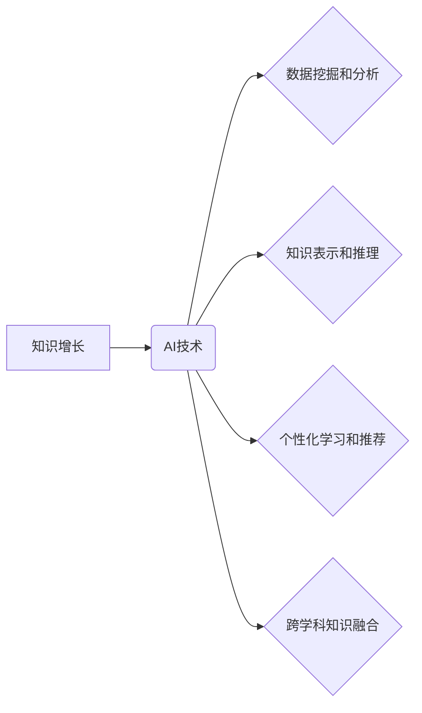

                 

## AI如何助力人类知识增长

> 关键词：人工智能、知识增长、机器学习、深度学习、自然语言处理、数据挖掘、知识图谱

## 1. 背景介绍

人类文明的发展离不开知识的积累和传播。自古以来，人类一直在探索新的知识，并通过各种方式将其传递给后代。随着科技的进步，特别是人工智能（AI）的快速发展，人类获取和利用知识的方式发生了根本性的改变。AI技术具备强大的数据处理、模式识别和知识推理能力，为人类知识增长提供了前所未有的机遇。

传统的知识获取方式主要依赖于人类的经验和观察，效率低下且容易受到主观因素的影响。而AI技术可以自动从海量数据中提取知识，并将其转化为可理解和利用的形式。例如，AI可以自动分析学术论文，识别关键概念和研究成果；可以自动翻译不同语言的文本，打破语言障碍；可以自动生成总结和报告，提高知识的提炼和传播效率。

## 2. 核心概念与联系

**2.1 知识增长**

知识增长是指人类认知能力的提升和知识库的扩展。它是一个复杂的过程，涉及到信息获取、理解、整合、应用和传播等多个环节。

**2.2 人工智能**

人工智能是指模拟人类智能行为的计算机系统。AI技术涵盖了多个领域，包括机器学习、深度学习、自然语言处理、计算机视觉等。

**2.3 AI助力知识增长**

AI技术可以从多个方面助力人类知识增长：

* **数据挖掘和分析:** AI可以从海量数据中挖掘出隐藏的知识和模式，为人类提供新的洞察和启示。
* **知识表示和推理:** AI可以将知识表示为计算机可理解的形式，并进行逻辑推理和知识推导，帮助人类更深入地理解和应用知识。
* **个性化学习和推荐:** AI可以根据个人的学习风格和兴趣，提供个性化的学习内容和推荐，提高学习效率和效果。
* **跨学科知识融合:** AI可以帮助不同学科的知识融合，促进跨学科研究和创新。

**2.4 核心概念关系图**



## 3. 核心算法原理 & 具体操作步骤

**3.1 算法原理概述**

在AI助力知识增长中，许多核心算法发挥着关键作用，例如：

* **机器学习算法:** 用于从数据中学习模式和规律，包括监督学习、无监督学习和强化学习等。
* **深度学习算法:** 基于多层神经网络，能够学习更复杂的模式和表示，例如卷积神经网络（CNN）和循环神经网络（RNN）。
* **自然语言处理算法:** 用于处理和理解自然语言文本，例如词嵌入、文本分类和机器翻译等。

**3.2 算法步骤详解**

以机器学习算法为例，其基本步骤包括：

1. **数据收集和预处理:** 收集相关数据并进行清洗、转换和特征工程等预处理操作。
2. **模型选择:** 根据任务需求选择合适的机器学习算法模型。
3. **模型训练:** 使用训练数据训练模型参数，使模型能够学习数据中的模式和规律。
4. **模型评估:** 使用测试数据评估模型的性能，并进行调参优化。
5. **模型部署:** 将训练好的模型部署到实际应用场景中。

**3.3 算法优缺点**

不同的算法具有不同的优缺点，需要根据具体任务选择合适的算法。例如，监督学习算法需要大量的标注数据，而无监督学习算法则不需要。深度学习算法能够学习更复杂的模式，但训练成本较高。

**3.4 算法应用领域**

机器学习算法广泛应用于各个领域，例如：

* **医疗诊断:** 利用患者数据预测疾病风险和辅助诊断。
* **金融风险管理:** 分析市场数据识别潜在风险并进行风险控制。
* **推荐系统:** 根据用户行为推荐个性化商品和服务。
* **自然语言理解:** 实现机器翻译、文本摘要和对话系统等功能。

## 4. 数学模型和公式 & 详细讲解 & 举例说明

**4.1 数学模型构建**

在AI领域，数学模型是描述算法和知识关系的核心工具。例如，线性回归模型可以用来预测连续变量，逻辑回归模型可以用来分类数据。

**4.2 公式推导过程**

例如，线性回归模型的目标是找到一条直线，使得该直线与数据点之间的误差最小。其损失函数为均方误差，公式如下：

$$
J(\theta) = \frac{1}{2m} \sum_{i=1}^{m} (h_\theta(x^{(i)}) - y^{(i)})^2
$$

其中：

* $J(\theta)$ 是损失函数
* $\theta$ 是模型参数
* $m$ 是训练样本数量
* $h_\theta(x^{(i)})$ 是模型预测值
* $y^{(i)}$ 是真实值

通过梯度下降算法，可以迭代更新模型参数，使得损失函数最小化。

**4.3 案例分析与讲解**

例如，假设我们想要预测房价，可以使用线性回归模型。训练数据包括房屋面积、房间数量等特征以及对应的房价。通过训练模型，我们可以得到一个预测房价的公式，例如：

$$
\text{房价} = 10000 \times \text{面积} + 50000 \times \text{房间数量} + C
$$

其中 $C$ 是截距项。

## 5. 项目实践：代码实例和详细解释说明

**5.1 开发环境搭建**

可以使用Python语言和相关的机器学习库，例如Scikit-learn，TensorFlow或PyTorch，搭建AI项目开发环境。

**5.2 源代码详细实现**

以下是一个使用Scikit-learn库实现线性回归模型的代码示例：

```python
from sklearn.linear_model import LinearRegression
from sklearn.model_selection import train_test_split
from sklearn.metrics import mean_squared_error

# 加载数据
# ...

# 将数据分为训练集和测试集
X_train, X_test, y_train, y_test = train_test_split(X, y, test_size=0.2)

# 创建线性回归模型
model = LinearRegression()

# 训练模型
model.fit(X_train, y_train)

# 预测测试集数据
y_pred = model.predict(X_test)

# 计算模型性能
mse = mean_squared_error(y_test, y_pred)
print(f"均方误差: {mse}")
```

**5.3 代码解读与分析**

代码首先加载数据，然后将数据分为训练集和测试集。接着创建线性回归模型，并使用训练集训练模型参数。最后使用测试集数据预测房价，并计算模型性能。

**5.4 运行结果展示**

运行结果会显示模型的均方误差，该值越小表示模型性能越好。

## 6. 实际应用场景

AI技术在各个领域都有着广泛的应用场景，例如：

* **教育:** 个性化学习、智能辅导、自动批改作业等。
* **医疗:** 疾病诊断、药物研发、患者管理等。
* **金融:** 风险管理、欺诈检测、投资决策等。
* **制造业:** 自动化生产、质量控制、预测维护等。

**6.4 未来应用展望**

随着AI技术的不断发展，其在助力人类知识增长方面的应用前景更加广阔。例如：

* **更智能的知识发现:** AI可以更深入地挖掘数据中的知识，发现更隐蔽的模式和关系。
* **更个性化的学习体验:** AI可以根据个人的学习风格和兴趣，提供更个性化的学习内容和推荐。
* **跨学科知识融合:** AI可以帮助不同学科的知识融合，促进跨学科研究和创新。

## 7. 工具和资源推荐

**7.1 学习资源推荐**

* **在线课程:** Coursera、edX、Udacity等平台提供丰富的AI课程。
* **书籍:** 《深度学习》、《机器学习实战》等经典书籍。
* **开源项目:** TensorFlow、PyTorch等开源项目可以帮助学习和实践AI技术。

**7.2 开发工具推荐**

* **Python:** 作为AI开发的主要语言，Python拥有丰富的库和工具。
* **Jupyter Notebook:** 用于交互式编程和数据可视化。
* **Git:** 用于版本控制和代码协作。

**7.3 相关论文推荐**

* **《ImageNet Classification with Deep Convolutional Neural Networks》**
* **《Attention Is All You Need》**
* **《BERT: Pre-training of Deep Bidirectional Transformers for Language Understanding》**

## 8. 总结：未来发展趋势与挑战

**8.1 研究成果总结**

近年来，AI技术取得了长足的进步，在知识增长方面发挥了越来越重要的作用。从数据挖掘和分析到知识表示和推理，AI技术为人类提供了新的工具和方法，加速了知识的积累和传播。

**8.2 未来发展趋势**

未来，AI技术将继续推动人类知识增长的发展，主要趋势包括：

* **更强大的计算能力:** 更强大的计算能力将支持更复杂的AI模型，使其能够学习更复杂的知识。
* **更丰富的知识表示:** 新的知识表示方法将能够更好地捕捉知识之间的关系，促进知识融合和推理。
* **更个性化的学习体验:** AI将能够提供更个性化的学习体验，帮助每个人更好地掌握知识。

**8.3 面临的挑战**

AI技术在助力知识增长方面也面临着一些挑战，例如：

* **数据质量和可用性:** AI模型的性能依赖于高质量的数据，而高质量数据的获取和处理仍然是一个挑战。
* **算法解释性和可信度:** 许多AI算法是黑箱模型，其决策过程难以解释，这限制了人们对AI技术的信任。
* **伦理和社会影响:** AI技术的发展可能带来一些伦理和社会问题，例如算法偏见和隐私泄露，需要引起重视和解决。

**8.4 研究展望**

未来，需要加强对AI技术的研发和应用，并关注其伦理和社会影响。同时，需要加强跨学科合作，促进AI技术与其他领域的融合发展，为人类知识增长提供更强大的支持。

## 9. 附录：常见问题与解答

**9.1 如何选择合适的AI算法？**

选择合适的AI算法需要根据具体任务需求和数据特点进行考虑。例如，对于分类任务，可以考虑使用逻辑回归、支持向量机或决策树等算法；对于回归任务，可以考虑使用线性回归、支持向量回归或神经网络等算法。

**9.2 如何评估AI模型的性能？**

AI模型的性能可以通过多种指标进行评估，例如准确率、召回率、F1-score、均方误差等。选择合适的评估指标需要根据具体任务需求进行考虑。

**9.3 如何解决AI算法的偏见问题？**

AI算法的偏见问题可以通过多种方法解决，例如：

* 使用更公平的数据集进行训练。
* 使用偏见检测和缓解技术。
* 提高算法的透明度和可解释性。


作者：禅与计算机程序设计艺术 / Zen and the Art of Computer Programming 
<end_of_turn>

