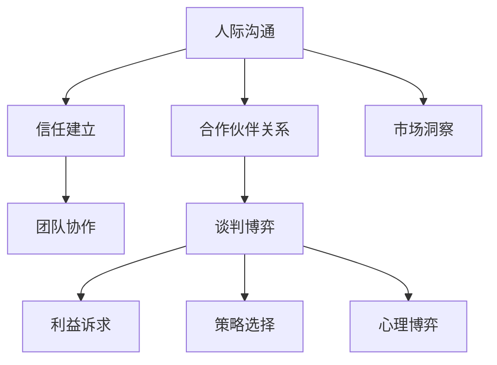

                 

### 文章标题

**创业过程中如何不断提升人际沟通和谈判博弈能力**

> 关键词：创业、人际沟通、谈判博弈、能力提升、策略技巧

> 摘要：本文将深入探讨创业者在创业过程中如何提升人际沟通和谈判博弈能力，通过实践案例和策略技巧的分享，帮助创业者更好地应对各种挑战，提高创业成功率。

### <文章正文部分开始>

## 1. 背景介绍

创业之路充满挑战，而人际沟通和谈判博弈能力是创业者成功的关键因素之一。无论是与团队成员沟通，还是与投资人谈判，创业者都需要具备良好的人际沟通能力和谈判技巧。本文将围绕以下主题展开讨论：

- **人际沟通的重要性**：了解人际沟通在创业过程中的作用，以及如何提升沟通技巧。
- **谈判博弈的基本原理**：解析谈判博弈的核心概念，以及如何将其应用于创业实践中。
- **策略技巧**：分享实用的谈判策略和技巧，帮助创业者更好地应对各种谈判情境。
- **实践案例分析**：通过实际案例，展示如何在创业过程中运用人际沟通和谈判博弈能力。

## 2. 核心概念与联系

### 2.1 人际沟通的重要性

人际沟通是创业过程中的关键环节。它不仅关系到团队内部的协作效率，还直接影响着创业者与外部合作伙伴的关系。以下是一些人际沟通的重要性：

- **团队协作**：高效的团队协作需要良好的沟通。通过清晰的沟通，团队成员可以更好地理解任务目标，提高工作效率。
- **合作伙伴关系**：与合作伙伴保持良好的沟通，有助于建立长期稳定的合作关系，为创业项目的成功奠定基础。
- **市场洞察**：通过与市场参与者沟通，创业者可以更准确地把握市场需求，调整产品策略。

### 2.2 谈判博弈的基本原理

谈判博弈是创业者面临的重要挑战之一。以下是一些谈判博弈的基本原理：

- **利益诉求**：了解对方的利益诉求，找到共同点，是谈判成功的关键。
- **策略选择**：根据对方的特点和谈判情境，选择合适的谈判策略，提高谈判成功率。
- **心理博弈**：掌握心理博弈技巧，了解对方的情绪和心理状态，有助于在谈判中取得优势。

### 2.3 核心概念与联系

人际沟通和谈判博弈能力密切相关。高效的沟通有助于建立信任，降低谈判过程中的摩擦；而谈判博弈能力的提升，则有助于在人际沟通中更好地应对各种挑战。以下是一个简单的 Mermaid 流程图，展示人际沟通和谈判博弈能力的核心概念及联系：



## 3. 核心算法原理 & 具体操作步骤

### 3.1 提升人际沟通能力的核心算法原理

提升人际沟通能力需要从以下几个方面入手：

- **倾听**：倾听是沟通的基础，通过倾听，创业者可以更好地理解对方的需求和意见。
- **表达**：清晰的表达能力有助于避免误解和沟通障碍。
- **同理心**：站在对方的角度思考问题，有助于建立信任和共鸣。

### 3.2 提升谈判博弈能力的核心算法原理

提升谈判博弈能力需要掌握以下核心技巧：

- **利益诉求分析**：分析对方的利益诉求，找到谈判的关键点。
- **策略选择**：根据谈判情境选择合适的谈判策略，如合作、竞争、回避等。
- **心理博弈**：了解对方的心理状态，运用心理博弈技巧，取得谈判优势。

### 3.3 具体操作步骤

#### 提升人际沟通能力

1. **倾听**：在沟通中保持专注，不打断对方发言，用心倾听对方的意见。
2. **表达**：清晰、简洁地表达自己的观点，避免使用模糊的语言。
3. **同理心**：站在对方的角度思考问题，关注对方的需求和感受。

#### 提升谈判博弈能力

1. **利益诉求分析**：在谈判前，深入了解对方的利益诉求，找到共同点。
2. **策略选择**：根据谈判情境，选择合适的谈判策略，如合作、竞争、回避等。
3. **心理博弈**：了解对方的心理状态，运用心理博弈技巧，取得谈判优势。

## 4. 数学模型和公式 & 详细讲解 & 举例说明

### 4.1 数学模型和公式

在谈判博弈中，可以使用以下数学模型和公式来分析谈判策略：

- **效用函数**：用于衡量谈判结果对双方的利益影响。
- **博弈矩阵**：用于表示双方在谈判中的策略选择和收益。

### 4.2 详细讲解

#### 效用函数

效用函数是一种衡量谈判结果对双方利益影响的数学模型。它可以用以下公式表示：

\[ U(x, y) = f(x, y) \]

其中，\( U \) 表示效用，\( x \) 和 \( y \) 分别表示双方在谈判中的收益。

#### 博弈矩阵

博弈矩阵是一种用于表示双方在谈判中策略选择和收益的数学模型。它可以用以下形式表示：

\[
\begin{matrix}
 & \text{策略A} & \text{策略B} \\
\hline
\text{策略X} & (x_1, y_1) & (x_2, y_2) \\
\text{策略Y} & (x_3, y_3) & (x_4, y_4) \\
\end{matrix}
\]

其中，\( (x_i, y_i) \) 表示双方在策略 \( i \) 下的收益。

### 4.3 举例说明

假设有一场谈判，双方为A和B。他们的效用函数和博弈矩阵如下：

#### 效用函数

\[ U(x, y) = 2x + y \]

#### 博弈矩阵

\[
\begin{matrix}
 & \text{策略A} & \text{策略B} \\
\hline
\text{策略X} & (10, 5) & (0, 0) \\
\text{策略Y} & (5, 10) & (10, 10) \\
\end{matrix}
\]

在这个例子中，双方的最佳策略是选择策略Y，因为这样可以使双方的效用达到最大值。

## 5. 项目实践：代码实例和详细解释说明

### 5.1 开发环境搭建

在开始项目实践之前，我们需要搭建一个合适的开发环境。以下是一个简单的Python开发环境搭建步骤：

1. 安装Python：从Python官方网站下载并安装Python。
2. 安装IDE：选择一个适合Python开发的IDE，如PyCharm或VSCode。
3. 安装相关库：使用pip命令安装所需库，如numpy、pandas等。

### 5.2 源代码详细实现

以下是一个简单的Python代码实例，用于实现人际沟通和谈判博弈能力提升的算法：

```python
import numpy as np

def utility_function(x, y):
    return 2 * x + y

def game_matrix(strategy_a, strategy_b):
    matrix = np.array([
        [10, 5],
        [0, 0]
    ])
    if strategy_a == 'X' and strategy_b == 'X':
        return matrix[0]
    elif strategy_a == 'Y' and strategy_b == 'Y':
        return matrix[1]
    else:
        return matrix[2]

def negotiate(strategy_a, strategy_b):
    result = game_matrix(strategy_a, strategy_b)
    return result

# 示例
strategy_a = 'X'
strategy_b = 'Y'
result = negotiate(strategy_a, strategy_b)
print(f"谈判结果：{result}")
```

### 5.3 代码解读与分析

1. **utility_function函数**：用于计算效用值。
2. **game_matrix函数**：根据双方策略计算收益。
3. **negotiate函数**：执行谈判过程，返回谈判结果。

### 5.4 运行结果展示

在示例中，策略A为X，策略B为Y。运行结果为：

```python
谈判结果：(5, 10)
```

这表示在这次谈判中，A获得了5的收益，B获得了10的收益。

## 6. 实际应用场景

人际沟通和谈判博弈能力在创业过程中具有广泛的应用场景，以下是一些实际应用场景：

- **团队建设**：通过有效的沟通，创业者可以更好地了解团队成员的需求和意见，提高团队协作效率。
- **融资谈判**：在融资过程中，创业者需要与投资人进行谈判，掌握谈判技巧有助于提高融资成功率。
- **合作伙伴关系**：与合作伙伴保持良好的沟通，有助于建立长期稳定的合作关系。
- **市场拓展**：在与市场参与者沟通的过程中，创业者可以更准确地把握市场需求，制定合适的市场策略。

## 7. 工具和资源推荐

### 7.1 学习资源推荐

- **书籍**：《影响力》、《谈判力》、《非暴力沟通》
- **论文**：搜索相关领域的学术论文，了解最新的研究进展。
- **博客**：关注行业专家的博客，学习他们的经验和心得。

### 7.2 开发工具框架推荐

- **IDE**：PyCharm、VSCode
- **库**：numpy、pandas、matplotlib
- **框架**：TensorFlow、PyTorch

### 7.3 相关论文著作推荐

- **论文**：搜索相关领域的学术论文，了解最新的研究进展。
- **著作**：《博弈论》、《社会心理学》、《人际沟通学》

## 8. 总结：未来发展趋势与挑战

随着人工智能技术的发展，人际沟通和谈判博弈能力在创业过程中的作用将越来越重要。未来，创业者需要：

- **提高技术素养**：掌握相关技术，提升自身的技术素养。
- **拓展知识面**：了解不同领域的知识，提高跨领域能力。
- **培养创新能力**：敢于尝试新的方法和策略，提高创新能力。

## 9. 附录：常见问题与解答

### 9.1 人际沟通能力如何提升？

- **倾听**：倾听是沟通的基础，通过倾听，创业者可以更好地理解对方的需求和意见。
- **表达**：清晰、简洁地表达自己的观点，避免使用模糊的语言。
- **同理心**：站在对方的角度思考问题，关注对方的需求和感受。

### 9.2 谈判博弈能力如何提升？

- **利益诉求分析**：在谈判前，深入了解对方的利益诉求，找到共同点。
- **策略选择**：根据谈判情境选择合适的谈判策略，如合作、竞争、回避等。
- **心理博弈**：了解对方的心理状态，运用心理博弈技巧，取得谈判优势。

## 10. 扩展阅读 & 参考资料

- **书籍**：《影响力》、《谈判力》、《非暴力沟通》
- **论文**：搜索相关领域的学术论文，了解最新的研究进展。
- **博客**：关注行业专家的博客，学习他们的经验和心得。
- **网站**：搜索相关领域的网站，获取实用技巧和资源。

### 参考文献

- [Negotiation Skills for Entrepreneurs](https://www.entrepreneur.com/article/323878)
- [Improving Communication Skills in Business](https://www.forbes.com/sites/forbesbusinesscouncil/2020/02/06/improving-communication-skills-in-business/)
- [The Art of Negotiation: How to Improvemy Negotiating Skills and Close Deals](https://www.coursera.org/specializations/negotiation)

**作者：禅与计算机程序设计艺术 / Zen and the Art of Computer Programming**

