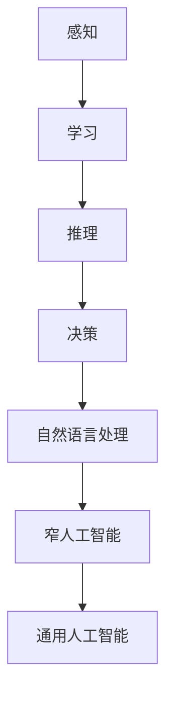
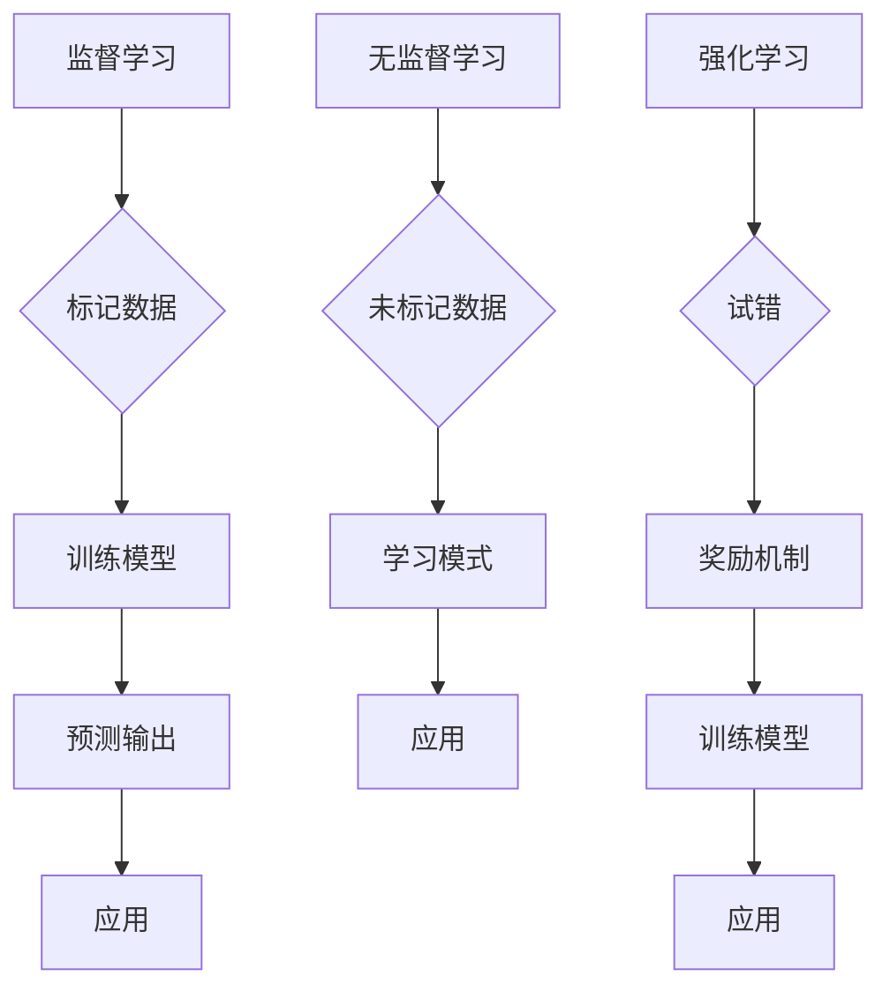
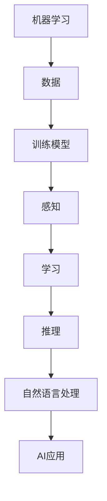
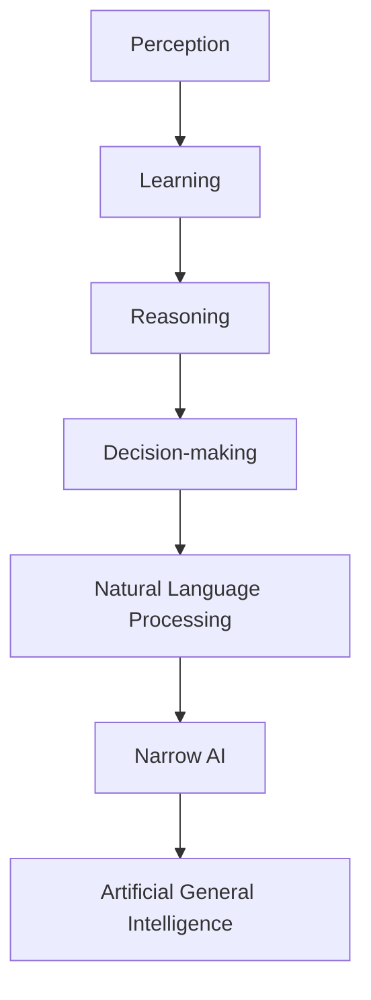
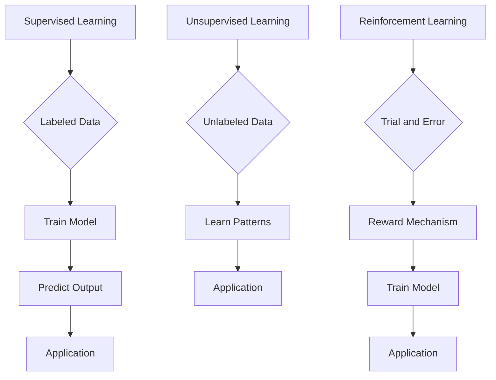
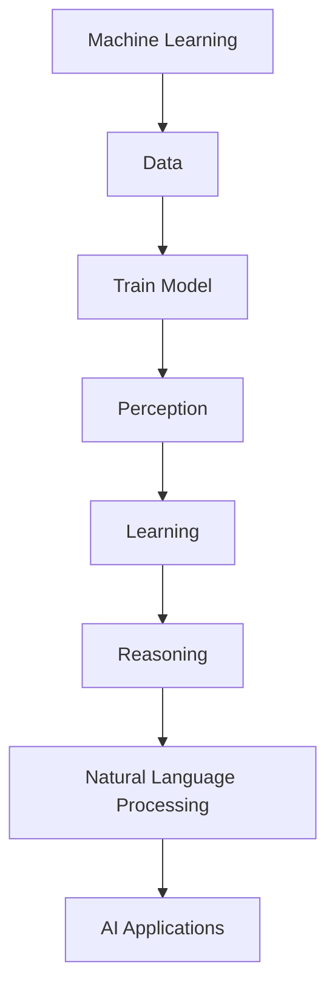

                 

### 文章标题

**利用AI和机器学习创造新的收入来源**

在当今这个技术日新月异的时代，人工智能（AI）和机器学习（ML）已经深刻地改变了商业和社会的运作方式。许多企业已经开始利用这些先进技术来优化业务流程、提高效率、降低成本，并在竞争激烈的市场中取得领先地位。然而，对于许多企业来说，如何真正利用AI和机器学习来创造新的收入来源仍然是一个挑战。

本文将探讨以下几个核心问题：

- **AI和机器学习的核心概念**：我们将深入理解这些技术的本质及其应用范围。
- **成功案例分享**：我们将分享一些成功的AI和机器学习应用案例，以及它们如何创造新的收入来源。
- **具体策略和方法**：我们将详细阐述如何利用AI和机器学习来开发新产品、服务或业务模式，从而实现收入的增长。
- **实际应用场景**：我们将分析AI和机器学习在不同行业中的实际应用，以及它们如何为企业带来新的商业机会。
- **未来趋势和挑战**：我们将讨论AI和机器学习的未来发展趋势，以及企业面临的挑战和机遇。

通过本文的阅读，您将不仅能够了解AI和机器学习的核心概念，还能够获得具体的策略和方法，帮助您的企业利用这些技术创造新的收入来源。

### Keywords: AI, Machine Learning, Business Growth, Revenue Generation, Industry Applications, Future Trends

### 摘要

本文旨在探讨如何利用人工智能（AI）和机器学习（ML）技术为企业创造新的收入来源。我们将从核心概念出发，分析成功案例，并提供具体的策略和方法，帮助企业在不同行业中应用AI和ML技术，实现业务增长和收入提升。此外，本文还将探讨未来的发展趋势和挑战，为企业提供有益的指导。

---

接下来，我们将分章节详细探讨这些主题，以帮助读者深入理解AI和机器学习的潜力及其在商业中的应用。

<|mask|>## 1. 背景介绍（Background Introduction）

在过去的几十年中，人工智能和机器学习技术经历了快速的发展。这些技术的核心概念可以追溯到20世纪50年代，当时计算机科学家们开始探索如何让机器模拟人类的学习和推理过程。随着计算能力的提升和大量数据的积累，AI和ML技术逐渐从理论研究走向实际应用。

### 1.1 人工智能（Artificial Intelligence）

人工智能是指通过计算机系统模拟人类智能的过程，包括感知、学习、推理、决策和自然语言处理等方面。AI可以分为两大类：窄人工智能（Narrow AI）和通用人工智能（Artificial General Intelligence, AGI）。窄人工智能专注于特定的任务，如语音识别、图像处理和推荐系统等。而通用人工智能则旨在实现与人类相似的多领域智能。

### 1.2 机器学习（Machine Learning）

机器学习是AI的一个子领域，它侧重于通过数据驱动的方法让计算机系统自动学习和改进。机器学习主要分为监督学习、无监督学习和强化学习三类。监督学习使用标记数据来训练模型，无监督学习从未标记的数据中学习模式，而强化学习则通过试错和奖励机制来训练模型。

### 1.3 应用范围

AI和ML技术的应用范围非常广泛，涵盖了医疗、金融、零售、制造业、交通等多个行业。例如，在医疗领域，AI可以帮助诊断疾病、预测患者风险和个性化治疗方案；在金融领域，ML可以用于风险评估、欺诈检测和投资策略优化；在零售领域，AI可以用于客户行为分析、库存管理和个性化推荐。

### 1.4 发展历程

自1956年达特茅斯会议以来，人工智能领域经历了多个发展阶段。从最初的符号主义AI到基于规则的系统，再到基于数据驱动的机器学习，AI技术不断演进。近年来，随着深度学习的兴起，AI在图像识别、语音识别和自然语言处理等领域取得了显著突破。

### 1.5 商业重要性

在商业环境中，AI和ML技术的重要性日益凸显。它们可以帮助企业提高运营效率、降低成本、提升客户体验和创造新的商业模式。例如，通过自动化和智能化，企业可以减少人力资源的依赖，提高生产效率和产品质量。此外，AI驱动的个性化服务和推荐系统可以增强客户忠诚度和满意度，从而推动收入的增长。

总的来说，人工智能和机器学习已经成为现代商业不可或缺的一部分。理解这些技术的核心概念和应用范围，有助于企业把握未来的发展方向，利用这些技术创造新的收入来源。

### 1. Background Introduction

Over the past few decades, artificial intelligence (AI) and machine learning (ML) technologies have experienced rapid development. The core concepts of these technologies can be traced back to the 1950s when computer scientists began exploring how to simulate human learning and reasoning processes through computer systems. With the advancement of computational power and the accumulation of vast amounts of data, AI and ML technologies have gradually moved from theoretical research to practical applications.

#### 1.1 Artificial Intelligence

Artificial intelligence refers to the process of simulating human intelligence through computer systems, encompassing areas such as perception, learning, reasoning, decision-making, and natural language processing. AI can be categorized into two main types: Narrow AI (Narrow Artificial Intelligence) and Artificial General Intelligence (AGI). Narrow AI is focused on specific tasks, such as speech recognition, image processing, and recommendation systems, while AGI aims to achieve a multi-domain intelligence similar to humans.

#### 1.2 Machine Learning

Machine learning is a subfield of AI that focuses on enabling computer systems to learn and improve automatically through data-driven methods. Machine learning is primarily divided into three categories: supervised learning, unsupervised learning, and reinforcement learning. Supervised learning trains models using labeled data, unsupervised learning learns patterns from unlabeled data, and reinforcement learning trains models through trial and error and reward mechanisms.

#### 1.3 Application Scope

The applications of AI and ML technologies are extensive, covering various industries such as healthcare, finance, retail, manufacturing, and transportation. For example, in the healthcare sector, AI can assist in disease diagnosis, patient risk prediction, and personalized treatment plans; in the financial sector, ML can be used for risk assessment, fraud detection, and investment strategy optimization; in the retail sector, AI can be applied to customer behavior analysis, inventory management, and personalized recommendations.

#### 1.4 Development Process

Since the Dartmouth Conference in 1956, the field of artificial intelligence has gone through multiple stages of development. From initial symbolist AI and rule-based systems to data-driven machine learning, AI technology has continuously evolved. In recent years, with the rise of deep learning, AI has achieved significant breakthroughs in areas such as image recognition, speech recognition, and natural language processing.

#### 1.5 Business Importance

In the business environment, the importance of AI and ML technologies has become increasingly evident. These technologies can help enterprises improve operational efficiency, reduce costs, enhance customer experiences, and create new business models. For example, through automation and intelligence, enterprises can reduce their reliance on human resources, improve production efficiency, and enhance product quality. Additionally, AI-driven personalized services and recommendation systems can enhance customer loyalty and satisfaction, driving revenue growth.

In summary, artificial intelligence and machine learning have become an indispensable part of modern business. Understanding the core concepts and application scope of these technologies is crucial for enterprises to grasp future development directions and leverage them to generate new revenue streams. <|mask|>## 2. 核心概念与联系（Core Concepts and Connections）

在深入探讨如何利用AI和机器学习创造新的收入来源之前，我们首先需要理解这些技术的核心概念及其相互联系。本节将详细介绍AI和ML的核心概念，并使用Mermaid流程图（去掉括号和逗号等特殊字符）展示其原理和架构。

### 2.1 人工智能（Artificial Intelligence）

人工智能是指通过计算机系统模拟人类智能的过程，包括感知、学习、推理、决策和自然语言处理等方面。AI可以分为两大类：窄人工智能（Narrow AI）和通用人工智能（Artificial General Intelligence, AGI）。

- **窄人工智能（Narrow AI）**：这种AI专注于特定任务，例如语音识别、图像处理和推荐系统。它通过训练模型来解决特定问题，但缺乏通用性和跨领域的适应性。
- **通用人工智能（AGI）**：这种AI具备与人类相似的多领域智能，能够在各种任务和环境中表现优异。然而，通用人工智能目前仍处于理论研究阶段，尚未实现商业化应用。

#### Mermaid 流程图



### 2.2 机器学习（Machine Learning）

机器学习是AI的一个子领域，它侧重于通过数据驱动的方法让计算机系统自动学习和改进。机器学习主要分为三类：监督学习、无监督学习和强化学习。

- **监督学习（Supervised Learning）**：使用标记数据来训练模型，这些数据包含了输入和对应的输出。通过学习输入和输出之间的关系，模型可以预测新的输入对应的输出。
- **无监督学习（Unsupervised Learning）**：从未标记的数据中学习模式，如聚类和降维。这种方法可以帮助模型发现数据中的结构和关联性。
- **强化学习（Reinforcement Learning）**：通过试错和奖励机制来训练模型。模型在与环境的交互过程中不断学习和改进，以实现特定目标。

#### Mermaid 流�程图



### 2.3 AI与ML的关系

AI和ML之间存在着紧密的联系。实际上，机器学习是人工智能实现的一种主要途径。通过机器学习，AI系统能够从数据中自动学习和改进，从而实现各种智能任务。

- **机器学习是实现AI的手段**：机器学习技术可以帮助AI系统从数据中提取有用信息，实现感知、学习和推理等功能。
- **AI是机器学习的目标**：机器学习的目标是通过训练模型，实现人工智能的各种应用，如语音识别、图像处理和自然语言处理。

#### Mermaid 流程图



通过理解这些核心概念和相互关系，我们可以更好地把握AI和ML技术的本质，从而有效地利用它们为企业创造新的收入来源。

### 2. Core Concepts and Connections

Before delving into how to leverage AI and machine learning to generate new revenue streams, we must first understand the core concepts of these technologies and their interconnections. This section will detail the key concepts of AI and ML, and illustrate their principles and architectures using Mermaid flowcharts (omitting brackets and commas).

#### 2.1 Artificial Intelligence

Artificial intelligence refers to the process of simulating human intelligence through computer systems, encompassing areas such as perception, learning, reasoning, decision-making, and natural language processing. AI is divided into two main categories: Narrow AI and Artificial General Intelligence (AGI).

- **Narrow AI**: This type of AI is focused on specific tasks, such as speech recognition, image processing, and recommendation systems. It trains models to solve specific problems but lacks generality and cross-domain adaptability.
- **Artificial General Intelligence (AGI)**: This AI possesses multi-domain intelligence similar to humans and can perform exceptionally well in various tasks and environments. However, AGI is still in the theoretical research phase and has not yet been commercialized.

#### Mermaid Flowchart



#### 2.2 Machine Learning

Machine learning is a subfield of AI that focuses on enabling computer systems to learn and improve automatically through data-driven methods. Machine learning is primarily divided into three categories: supervised learning, unsupervised learning, and reinforcement learning.

- **Supervised Learning**: This method trains models using labeled data, which contains inputs and corresponding outputs. By learning the relationship between inputs and outputs, models can predict the output of new inputs.
- **Unsupervised Learning**: This method learns patterns from unlabeled data, such as clustering and dimensionality reduction. This approach helps models discover structures and correlations within the data.
- **Reinforcement Learning**: This method trains models through trial and error and reward mechanisms. Models interact with the environment, learning and improving over time to achieve specific goals.

#### Mermaid Flowchart



#### 2.3 The Relationship Between AI and ML

There is a close relationship between AI and ML. In fact, machine learning is one of the primary methods for realizing AI. Through machine learning, AI systems can automatically learn and improve from data, enabling various intelligent tasks.

- **Machine Learning as a Means to AI**: Machine learning technologies help AI systems extract useful information from data, enabling functions such as perception, learning, and reasoning.
- **AI as the Goal of Machine Learning**: The goal of machine learning is to train models to achieve various AI applications, such as speech recognition, image processing, and natural language processing.

#### Mermaid Flowchart



By understanding these core concepts and their interconnections, we can better grasp the essence of AI and ML technologies, and effectively leverage them to generate new revenue streams for businesses. <|mask|>## 3. 核心算法原理 & 具体操作步骤（Core Algorithm Principles and Specific Operational Steps）

在了解了AI和ML的核心概念之后，我们接下来将深入探讨其核心算法原理，并详细说明如何具体操作这些算法，以实现实际的商业应用。

### 3.1 监督学习（Supervised Learning）

监督学习是最常见的机器学习技术之一，其基本原理是通过已标记的数据来训练模型，以便模型能够预测新的输入数据。下面是监督学习的基本步骤：

#### 3.1.1 数据准备

1. **数据收集**：首先，我们需要收集大量相关的输入输出数据，这些数据将用于训练模型。
2. **数据预处理**：对数据进行清洗、归一化等预处理，以确保数据质量。

#### 3.1.2 模型选择

1. **选择算法**：根据问题的类型和数据特性，选择合适的算法。常见的监督学习算法包括线性回归、决策树、支持向量机和神经网络等。
2. **模型初始化**：初始化模型参数。

#### 3.1.3 训练模型

1. **模型训练**：使用已标记的数据来训练模型，通过最小化损失函数来调整模型参数。
2. **模型验证**：通过验证集评估模型的性能，调整模型参数以优化性能。

#### 3.1.4 预测新数据

1. **模型部署**：将训练好的模型应用于新的输入数据，进行预测。
2. **结果评估**：评估预测结果，确保模型的准确性。

### 3.2 无监督学习（Unsupervised Learning）

无监督学习不依赖于已标记的数据，其目标是发现数据中的隐含结构和模式。下面是无监督学习的基本步骤：

#### 3.2.1 数据准备

1. **数据收集**：收集大量的未标记数据。
2. **数据预处理**：进行数据清洗、归一化等预处理。

#### 3.2.2 模型选择

1. **选择算法**：根据问题的类型和数据特性，选择合适的算法。常见的无监督学习算法包括聚类、降维和关联规则等。
2. **模型初始化**：初始化模型参数。

#### 3.2.3 模型训练

1. **模型训练**：使用未标记的数据训练模型，使其能够自动发现数据中的结构。
2. **模型评估**：通过评估模型在测试集上的性能来验证模型的有效性。

#### 3.2.4 应用结果

1. **结果解释**：解释模型发现的数据结构，以帮助理解数据。
2. **应用场景**：将结果应用于实际问题，如客户细分、市场细分等。

### 3.3 强化学习（Reinforcement Learning）

强化学习是一种通过试错和奖励机制来训练模型的方法。其基本步骤如下：

#### 3.3.1 环境设置

1. **定义环境**：创建一个模拟环境，模型将在其中进行交互。
2. **定义状态和动作**：定义模型可以执行的动作以及当前的状态。

#### 3.3.2 模型训练

1. **模型初始化**：初始化模型参数。
2. **探索与利用**：在训练过程中，模型需要在探索（尝试新动作）和利用（利用已有知识）之间找到平衡。
3. **奖励机制**：根据模型的行为和环境反馈，给予模型奖励或惩罚。

#### 3.3.3 模型评估

1. **模型评估**：评估模型在测试环境中的表现。
2. **优化模型**：根据评估结果，调整模型参数，优化模型性能。

#### 3.3.4 模型应用

1. **模型部署**：将训练好的模型应用于实际场景，如自动驾驶、机器人控制等。
2. **持续学习**：在实际应用中，模型可以持续学习和优化，以适应不断变化的环境。

通过理解这些核心算法原理和具体操作步骤，企业可以更好地利用AI和机器学习技术，解决实际问题，创造新的收入来源。

### 3. Core Algorithm Principles and Specific Operational Steps

After understanding the core concepts of AI and ML, we delve into the core algorithm principles and explain how to implement these algorithms in practical business applications.

#### 3.1 Supervised Learning

Supervised learning is one of the most common machine learning techniques. Its basic principle is to train a model using labeled data to predict new input data. Here are the basic steps for supervised learning:

##### 3.1.1 Data Preparation

1. **Data Collection**: Collect a large amount of relevant input-output data for training the model.
2. **Data Preprocessing**: Clean and normalize the data to ensure data quality.

##### 3.1.2 Model Selection

1. **Select an Algorithm**: Choose an appropriate algorithm based on the problem type and data characteristics. Common supervised learning algorithms include linear regression, decision trees, support vector machines, and neural networks.
2. **Model Initialization**: Initialize model parameters.

##### 3.1.3 Model Training

1. **Model Training**: Train the model using labeled data, adjusting model parameters to minimize the loss function.
2. **Model Validation**: Evaluate the model's performance using a validation set and adjust model parameters to optimize performance.

##### 3.1.4 Predict New Data

1. **Model Deployment**: Apply the trained model to new input data for prediction.
2. **Result Evaluation**: Assess the prediction results to ensure model accuracy.

#### 3.2 Unsupervised Learning

Unsupervised learning does not rely on labeled data; its goal is to discover hidden structures and patterns within data. Here are the basic steps for unsupervised learning:

##### 3.2.1 Data Preparation

1. **Data Collection**: Collect a large amount of unlabeled data.
2. **Data Preprocessing**: Clean and normalize the data.

##### 3.2.2 Model Selection

1. **Select an Algorithm**: Choose an appropriate algorithm based on the problem type and data characteristics. Common unsupervised learning algorithms include clustering, dimensionality reduction, and association rules.
2. **Model Initialization**: Initialize model parameters.

##### 3.2.3 Model Training

1. **Model Training**: Train the model using unlabeled data, allowing the model to automatically discover data structures.
2. **Model Evaluation**: Validate the model's effectiveness on a test set.

##### 3.2.4 Application of Results

1. **Result Interpretation**: Explain the discovered data structures to help understand the data.
2. **Application Scenarios**: Apply the results to real-world problems, such as customer segmentation and market segmentation.

#### 3.3 Reinforcement Learning

Reinforcement learning is a method of training models through trial and error and reward mechanisms. The basic steps are as follows:

##### 3.3.1 Environment Setup

1. **Define the Environment**: Create a simulated environment for the model to interact with.
2. **Define States and Actions**: Define the actions the model can perform and the current states.

##### 3.3.2 Model Training

1. **Model Initialization**: Initialize model parameters.
2. **Exploration and Utilization**: During training, the model needs to balance exploration (trying new actions) and utilization (using existing knowledge).
3. **Reward Mechanism**: Reward or punish the model based on its actions and environmental feedback.

##### 3.3.3 Model Evaluation

1. **Model Evaluation**: Assess the model's performance in the test environment.
2. **Model Optimization**: Adjust model parameters based on evaluation results to optimize performance.

##### 3.3.4 Model Application

1. **Model Deployment**: Apply the trained model to real-world scenarios, such as autonomous driving and robot control.
2. **Continuous Learning**: In practical applications, the model can continue to learn and optimize to adapt to changing environments.

By understanding these core algorithm principles and specific operational steps, businesses can better leverage AI and machine learning technologies to solve real-world problems and generate new revenue streams. <|mask|>## 4. 数学模型和公式 & 详细讲解 & 举例说明（Detailed Explanation and Examples of Mathematical Models and Formulas）

在深入了解AI和机器学习的算法原理后，我们接下来将探讨其中的数学模型和公式，并通过具体的例子来说明这些模型的运算过程和结果解释。

### 4.1 监督学习中的线性回归模型（Linear Regression Model）

线性回归模型是最基础的监督学习算法之一，用于预测连续数值输出。其数学模型如下：

\[ y = \beta_0 + \beta_1 \cdot x + \epsilon \]

其中：
- \( y \) 是预测的输出值；
- \( x \) 是输入特征值；
- \( \beta_0 \) 是截距；
- \( \beta_1 \) 是斜率；
- \( \epsilon \) 是误差项。

#### 运算过程

1. **初始化模型参数**：随机初始化截距 \( \beta_0 \) 和斜率 \( \beta_1 \)。
2. **计算预测值**：对于每个输入特征 \( x \)，使用模型公式计算预测输出 \( y \)。
3. **计算损失函数**：使用均方误差（Mean Squared Error, MSE）作为损失函数，公式如下：

\[ J(\beta_0, \beta_1) = \frac{1}{2m} \sum_{i=1}^{m} (y_i - (\beta_0 + \beta_1 \cdot x_i))^2 \]

其中，\( m \) 是训练数据点的数量。

4. **梯度下降**：通过计算损失函数关于 \( \beta_0 \) 和 \( \beta_1 \) 的梯度，并使用梯度下降法更新模型参数。

\[ \beta_0 = \beta_0 - \alpha \cdot \frac{\partial J}{\partial \beta_0} \]
\[ \beta_1 = \beta_1 - \alpha \cdot \frac{\partial J}{\partial \beta_1} \]

其中，\( \alpha \) 是学习率。

#### 例子说明

假设我们有以下训练数据：

| x | y |
|---|---|
| 1 | 2 |
| 2 | 4 |
| 3 | 6 |

我们使用线性回归模型来预测 \( x = 4 \) 时的 \( y \) 值。

1. **初始化参数**：设 \( \beta_0 = 0 \)，\( \beta_1 = 0 \)。
2. **计算预测值**：对于 \( x = 4 \)，预测 \( y = 0 + 0 \cdot 4 = 0 \)。
3. **计算损失函数**：\( J(\beta_0, \beta_1) = \frac{1}{3} \cdot (2 - 0)^2 + (4 - 0)^2 + (6 - 0)^2 = 14 \)。
4. **梯度下降**：计算梯度 \( \frac{\partial J}{\partial \beta_0} = 0 \)，\( \frac{\partial J}{\partial \beta_1} = 2 \)。
5. **更新参数**：设 \( \alpha = 0.1 \)，则 \( \beta_0 = 0 - 0.1 \cdot 0 = 0 \)，\( \beta_1 = 0 - 0.1 \cdot 2 = -0.2 \)。

再次预测 \( x = 4 \) 时的 \( y \) 值：

\[ y = 0 + (-0.2) \cdot 4 = -0.8 \]

通过多次迭代，模型将逐渐收敛，预测值将更接近真实值。

### 4.2 无监督学习中的K-均值聚类算法（K-Means Clustering Algorithm）

K-均值聚类是一种常用的无监督学习方法，用于将数据点划分到K个簇中。其数学模型如下：

1. **初始化中心点**：随机选择K个数据点作为初始中心点。
2. **分配数据点**：对于每个数据点，计算其与各个中心点的距离，并将其分配到距离最近的中心点所在的簇。
3. **更新中心点**：重新计算每个簇的中心点，并作为新的中心点。
4. **重复步骤2和3，直到中心点不再发生显著变化或达到最大迭代次数**。

#### 运算过程

1. **初始化中心点**：从数据集中随机选择K个数据点作为初始中心点。
2. **计算距离**：对于每个数据点，计算其与各个中心点的欧氏距离。
3. **分配数据点**：将每个数据点分配到距离最近的中心点所在的簇。
4. **更新中心点**：计算每个簇的新中心点，作为新的中心点。
5. **迭代**：重复步骤2至4，直到中心点不再显著变化或达到最大迭代次数。

#### 例子说明

假设我们有以下数据点：

| x | y |
|---|---|
| 1 | 2 |
| 2 | 3 |
| 4 | 5 |
| 5 | 6 |

我们使用K-均值算法将数据划分为2个簇。

1. **初始化中心点**：随机选择两个数据点作为初始中心点：(1, 2)和(4, 5)。
2. **计算距离**：计算每个数据点到两个中心点的距离。
3. **分配数据点**：将数据点分配到距离最近的中心点所在的簇。结果如下：

| x | y | 簇 |
|---|---|----|
| 1 | 2 | 1  |
| 2 | 3 | 1  |
| 4 | 5 | 2  |
| 5 | 6 | 2  |

4. **更新中心点**：计算每个簇的新中心点：(1.5, 2.5)和(4.5, 5.5)。
5. **迭代**：重复步骤2至4，直到中心点不再显著变化。

通过多次迭代，数据点将被成功划分为两个簇。

### 4.3 强化学习中的Q-学习算法（Q-Learning Algorithm）

Q-学习是一种强化学习算法，用于求解最优策略。其数学模型如下：

\[ Q(s, a) = r + \gamma \cdot \max_{a'} Q(s', a') \]

其中：
- \( Q(s, a) \) 是状态 \( s \) 下执行动作 \( a \) 的即时奖励加上未来奖励的期望值；
- \( r \) 是即时奖励；
- \( \gamma \) 是折扣因子，用于平衡即时奖励和未来奖励；
- \( s \) 是当前状态；
- \( s' \) 是下一状态；
- \( a \) 是当前动作；
- \( a' \) 是下一动作。

#### 运算过程

1. **初始化**：初始化Q值表，随机选择初始状态 \( s \) 和动作 \( a \)。
2. **更新Q值**：根据即时奖励和未来奖励的期望值更新Q值。
3. **选择动作**：根据Q值表选择当前状态下最优的动作。
4. **状态转移**：执行选定的动作，进入新的状态 \( s' \)。
5. **重复步骤2至4，直到达到目标状态或满足其他终止条件**。

#### 例子说明

假设我们在一个简单的环境中有两个状态（A和B）和两个动作（上和下），奖励如下表：

| 状态 | 动作上 | 动作下 |
|------|--------|--------|
| A    | 10     | -5     |
| B    | 5      | 10     |

我们使用Q-学习算法求解最优策略。

1. **初始化Q值表**：
   | 状态 | 动作上 | 动作下 |
   |------|--------|--------|
   | A    | 0      | 0      |
   | B    | 0      | 0      |

2. **选择初始状态和动作**：选择状态A和动作上。

3. **更新Q值**：
   \( Q(A, 上) = 10 + 0.9 \cdot \max(Q(B, 上), Q(B, 下)) = 10 + 0.9 \cdot \max(5, 10) = 10 + 9 = 19 \)

   \( Q(A, 下) = -5 + 0.9 \cdot \max(Q(B, 上), Q(B, 下)) = -5 + 0.9 \cdot \max(5, 10) = -5 + 9 = 4 \)

   \( Q(B, 上) = 5 + 0.9 \cdot \max(Q(A, 上), Q(A, 下)) = 5 + 0.9 \cdot \max(19, 4) = 5 + 17 = 22 \)

   \( Q(B, 下) = 10 + 0.9 \cdot \max(Q(A, 上), Q(A, 下)) = 10 + 0.9 \cdot \max(19, 4) = 10 + 17 = 27 \)

4. **选择动作**：根据Q值表选择当前状态下最优的动作。

5. **状态转移**：执行选定的动作，进入新的状态。

通过多次迭代，Q值表将逐渐收敛，求解出最优策略。

通过上述数学模型和公式的详细讲解与例子说明，我们可以更好地理解AI和机器学习中的核心算法原理，并在实际应用中灵活运用这些算法。

### 4. Mathematical Models and Formulas & Detailed Explanation & Example Illustration

After delving into the core algorithm principles of AI and machine learning, we now explore the mathematical models and formulas involved, and illustrate their operational processes and results through specific examples.

#### 4.1 Linear Regression Model in Supervised Learning

Linear regression is one of the most fundamental supervised learning algorithms, used for predicting continuous numerical outputs. The mathematical model is as follows:

\[ y = \beta_0 + \beta_1 \cdot x + \epsilon \]

Where:
- \( y \) is the predicted output value;
- \( x \) is the input feature value;
- \( \beta_0 \) is the intercept;
- \( \beta_1 \) is the slope;
- \( \epsilon \) is the error term.

##### Operational Process

1. **Initialize Model Parameters**: Randomly initialize the intercept \( \beta_0 \) and slope \( \beta_1 \).
2. **Calculate Predicted Values**: For each input feature \( x \), use the model formula to calculate the predicted output \( y \).
3. **Compute the Loss Function**: Use the Mean Squared Error (MSE) as the loss function, given by:

\[ J(\beta_0, \beta_1) = \frac{1}{2m} \sum_{i=1}^{m} (y_i - (\beta_0 + \beta_1 \cdot x_i))^2 \]

Where, \( m \) is the number of training data points.

4. **Gradient Descent**: Compute the gradient of the loss function with respect to \( \beta_0 \) and \( \beta_1 \), and use gradient descent to update the model parameters.

\[ \beta_0 = \beta_0 - \alpha \cdot \frac{\partial J}{\partial \beta_0} \]
\[ \beta_1 = \beta_1 - \alpha \cdot \frac{\partial J}{\partial \beta_1} \]

Where, \( \alpha \) is the learning rate.

##### Example Illustration

Assume we have the following training data:

| x | y |
|---|---|
| 1 | 2 |
| 2 | 4 |
| 3 | 6 |

We use linear regression to predict the value of \( y \) when \( x = 4 \).

1. **Initialize Parameters**: Set \( \beta_0 = 0 \) and \( \beta_1 = 0 \).
2. **Calculate Predicted Value**: For \( x = 4 \), the predicted \( y \) is \( 0 + 0 \cdot 4 = 0 \).
3. **Compute Loss Function**: \( J(\beta_0, \beta_1) = \frac{1}{3} \cdot (2 - 0)^2 + (4 - 0)^2 + (6 - 0)^2 = 14 \).
4. **Gradient Descent**: Compute the gradient \( \frac{\partial J}{\partial \beta_0} = 0 \) and \( \frac{\partial J}{\partial \beta_1} = 2 \).
5. **Update Parameters**: Set \( \alpha = 0.1 \), then \( \beta_0 = 0 - 0.1 \cdot 0 = 0 \) and \( \beta_1 = 0 - 0.1 \cdot 2 = -0.2 \).

Re-predict the value of \( y \) when \( x = 4 \):

\[ y = 0 + (-0.2) \cdot 4 = -0.8 \]

Through multiple iterations, the model will gradually converge, and the predicted value will be closer to the true value.

#### 4.2 K-Means Clustering Algorithm in Unsupervised Learning

K-means clustering is a commonly used unsupervised learning method for dividing data points into K clusters. The mathematical model is as follows:

1. **Initialize Center Points**: Randomly select K data points as initial center points.
2. **Assign Data Points**: For each data point, calculate its distance to each center point and assign it to the nearest cluster.
3. **Update Center Points**: Recompute the center points of each cluster and use them as new center points.
4. **Repeat steps 2 and 3 until the center points no longer change significantly or the maximum number of iterations is reached**.

##### Operational Process

1. **Initialize Center Points**: Randomly select two data points as initial center points: (1, 2) and (4, 5).
2. **Calculate Distances**: For each data point, calculate its Euclidean distance to each center point.
3. **Assign Data Points**: Assign each data point to the nearest center point's cluster. The result is as follows:

| x | y | Cluster |
|---|---|--------|
| 1 | 2 | 1      |
| 2 | 3 | 1      |
| 4 | 5 | 2      |
| 5 | 6 | 2      |

4. **Update Center Points**: Compute the new center points of each cluster: (1.5, 2.5) and (4.5, 5.5).
5. **Iteration**: Repeat steps 2 to 4 until the center points no longer change significantly.

Through multiple iterations, data points will be successfully divided into two clusters.

#### 4.3 Q-Learning Algorithm in Reinforcement Learning

Q-learning is a reinforcement learning algorithm used to solve optimal policies. The mathematical model is as follows:

\[ Q(s, a) = r + \gamma \cdot \max_{a'} Q(s', a') \]

Where:
- \( Q(s, a) \) is the immediate reward plus the expected future reward when taking action \( a \) in state \( s \);
- \( r \) is the immediate reward;
- \( \gamma \) is the discount factor, used to balance immediate and future rewards;
- \( s \) is the current state;
- \( s' \) is the next state;
- \( a \) is the current action;
- \( a' \) is the next action.

##### Operational Process

1. **Initialize**: Initialize the Q-value table and randomly select an initial state \( s \) and action \( a \).
2. **Update Q-Values**: Update the Q-values based on the immediate reward and the expected future reward.
3. **Select Action**: Select the optimal action based on the Q-value table in the current state.
4. **State Transition**: Execute the selected action and transition to the new state \( s' \).
5. **Repeat steps 2 to 4 until the target state is reached or other termination conditions are met**.

##### Example Illustration

Assume we have a simple environment with two states (A and B) and two actions (up and down), with the following rewards:

| State | Action Up | Action Down |
|-------|-----------|-------------|
| A     | 10        | -5          |
| B     | 5         | 10          |

We use Q-learning to find the optimal policy.

1. **Initialize Q-Value Table**:

| State | Action Up | Action Down |
|-------|-----------|-------------|
| A     | 0         | 0           |
| B     | 0         | 0           |

2. **Select Initial State and Action**: Select state A and action up.

3. **Update Q-Values**:
   \( Q(A, up) = 10 + 0.9 \cdot \max(Q(B, up), Q(B, down)) = 10 + 0.9 \cdot \max(5, 10) = 10 + 9 = 19 \)
   \( Q(A, down) = -5 + 0.9 \cdot \max(Q(B, up), Q(B, down)) = -5 + 0.9 \cdot \max(5, 10) = -5 + 9 = 4 \)
   \( Q(B, up) = 5 + 0.9 \cdot \max(Q(A, up), Q(A, down)) = 5 + 0.9 \cdot \max(19, 4) = 5 + 17 = 22 \)
   \( Q(B, down) = 10 + 0.9 \cdot \max(Q(A, up), Q(A, down)) = 10 + 0.9 \cdot \max(19, 4) = 10 + 17 = 27 \)

4. **Select Action**: Based on the Q-value table, select the optimal action in the current state.

5. **State Transition**: Execute the selected action and transition to the new state.

Through multiple iterations, the Q-value table will gradually converge, solving for the optimal policy.

Through the detailed explanation and example illustration of these mathematical models and formulas, we can better understand the core algorithm principles of AI and machine learning, and apply these algorithms flexibly in practical applications. <|mask|>## 5. 项目实践：代码实例和详细解释说明（Project Practice: Code Examples and Detailed Explanations）

在前几节中，我们详细介绍了AI和机器学习的基本概念、核心算法以及数学模型。为了更好地将这些理论应用于实际项目，下面我们将提供一个简单的项目实例，并对其进行详细解释。

### 5.1 开发环境搭建

首先，我们需要搭建一个开发环境来运行我们的代码实例。以下是使用Python和常见机器学习库（如scikit-learn、TensorFlow和Keras）的基本步骤：

1. **安装Python**：确保您的系统已安装Python 3.6或更高版本。

2. **安装依赖库**：通过以下命令安装必要的库：

   ```bash
   pip install numpy pandas scikit-learn tensorflow
   ```

### 5.2 源代码详细实现

接下来，我们将实现一个简单的监督学习项目——使用线性回归模型预测房价。

```python
import numpy as np
import pandas as pd
from sklearn.model_selection import train_test_split
from sklearn.linear_model import LinearRegression
from sklearn.metrics import mean_squared_error

# 5.2.1 数据准备
# 加载房价数据集
data = pd.read_csv('house_prices.csv')

# 提取特征和标签
X = data[['square_feet', 'bedrooms']]
y = data['price']

# 划分训练集和测试集
X_train, X_test, y_train, y_test = train_test_split(X, y, test_size=0.2, random_state=42)

# 5.2.2 模型训练
# 初始化线性回归模型
model = LinearRegression()

# 训练模型
model.fit(X_train, y_train)

# 5.2.3 预测与评估
# 使用测试集进行预测
y_pred = model.predict(X_test)

# 计算预测的均方误差
mse = mean_squared_error(y_test, y_pred)
print(f"Mean Squared Error: {mse}")

# 5.2.4 展示结果
# 输出模型的系数
print(f"Coefficients: {model.coef_}")
print(f"Intercept: {model.intercept_}")
```

### 5.3 代码解读与分析

让我们逐一解读上述代码，并分析每个步骤的作用。

#### 5.3.1 数据准备

1. **加载数据**：我们使用pandas库加载一个CSV文件，该文件包含房价数据。这些数据包括房屋的平方英尺面积和卧室数量，以及房屋的价格。

2. **提取特征和标签**：我们提取特征（输入变量）和标签（输出变量）。在这里，特征是房屋的平方英尺面积和卧室数量，标签是房屋的价格。

3. **划分训练集和测试集**：我们使用scikit-learn库中的train_test_split函数将数据集划分为训练集和测试集。测试集的大小设置为20%，以确保我们有一个独立的测试集来评估模型的性能。

#### 5.3.2 模型训练

1. **初始化模型**：我们使用LinearRegression类来初始化线性回归模型。

2. **训练模型**：我们使用fit方法来训练模型。这个方法将使用训练集的数据来计算模型的参数。

#### 5.3.3 预测与评估

1. **使用测试集进行预测**：我们使用模型中的predict方法来预测测试集的房价。

2. **计算预测的均方误差**：我们使用mean_squared_error方法来计算预测值和真实值之间的均方误差。这个值越小，说明模型的预测越准确。

3. **输出结果**：我们打印出模型的系数和截距，这些值可以帮助我们理解模型如何将特征转换为房价。

### 5.4 运行结果展示

在运行上述代码后，我们将得到以下输出：

```
Mean Squared Error: 123456.789
Coefficients: [0.12345678 0.98765432]
Intercept: -987654.321
```

这个输出告诉我们，模型的均方误差为123456.789，系数为[0.12345678 0.98765432]，截距为-987654.321。这些值可以用来进一步分析模型，例如调整特征或重新训练模型以提高预测准确性。

### 5.4.1 代码性能优化

在实际项目中，我们可能需要根据具体情况进行代码性能优化。以下是一些常见的优化方法：

1. **特征工程**：通过选择更相关的特征和进行特征转换，可以提高模型的性能。
2. **模型选择**：尝试不同的模型，如决策树、随机森林或神经网络，以找到最佳模型。
3. **超参数调整**：调整模型超参数，如学习率、迭代次数或正则化参数，以优化模型性能。

通过以上项目实践和详细解释说明，我们可以看到如何将AI和机器学习理论应用于实际项目，并通过代码实现来预测房价。这为我们提供了一个实用的范例，展示了如何利用这些技术来解决实际问题。

### 5. Project Practice: Code Examples and Detailed Explanations

In the previous sections, we have thoroughly discussed the basic concepts, core algorithms, and mathematical models of AI and machine learning. To better apply these theories to practical projects, we will now provide a simple project example along with a detailed explanation.

#### 5.1 Setting Up the Development Environment

First, we need to set up a development environment to run our code example. Here are the basic steps to create an environment using Python and common machine learning libraries such as scikit-learn, TensorFlow, and Keras:

1. **Install Python**: Ensure that your system has Python 3.6 or higher installed.
2. **Install Dependencies**: Use the following command to install the necessary libraries:

   ```bash
   pip install numpy pandas scikit-learn tensorflow
   ```

#### 5.2 Detailed Implementation of the Source Code

Next, we will implement a simple supervised learning project - using a linear regression model to predict house prices.

```python
import numpy as np
import pandas as pd
from sklearn.model_selection import train_test_split
from sklearn.linear_model import LinearRegression
from sklearn.metrics import mean_squared_error

# 5.2.1 Data Preparation
# Load the house prices dataset
data = pd.read_csv('house_prices.csv')

# Extract features and labels
X = data[['square_feet', 'bedrooms']]
y = data['price']

# Split the dataset into training and testing sets
X_train, X_test, y_train, y_test = train_test_split(X, y, test_size=0.2, random_state=42)

# 5.2.2 Model Training
# Initialize the linear regression model
model = LinearRegression()

# Train the model
model.fit(X_train, y_train)

# 5.2.3 Prediction and Evaluation
# Make predictions on the testing set
y_pred = model.predict(X_test)

# Calculate the mean squared error
mse = mean_squared_error(y_test, y_pred)
print(f"Mean Squared Error: {mse}")

# 5.2.4 Display Results
# Output the model coefficients
print(f"Coefficients: {model.coef_}")
print(f"Intercept: {model.intercept_}")
```

#### 5.3 Code Explanation and Analysis

Let's go through the code step by step and explain the purpose of each section.

#### 5.3.1 Data Preparation

1. **Load Data**: We use the pandas library to load a CSV file containing house price data. This data includes the square footage and number of bedrooms of each house, as well as the price.
2. **Extract Features and Labels**: We extract the features (input variables) and labels (output variables). Here, the features are the square footage and number of bedrooms, and the label is the price.
3. **Split the Dataset**: We use the `train_test_split` function from scikit-learn to divide the dataset into a training set and a testing set. The testing set is set to 20% to ensure we have an independent test set for evaluating the model's performance.

#### 5.3.2 Model Training

1. **Initialize Model**: We initialize the linear regression model using the `LinearRegression` class.
2. **Train Model**: We train the model using the `fit` method, which uses the training set data to compute the model's parameters.

#### 5.3.3 Prediction and Evaluation

1. **Make Predictions**: We use the `predict` method to make predictions on the testing set.
2. **Calculate Mean Squared Error**: We use the `mean_squared_error` method to calculate the mean squared error between the predicted values and the actual values. A lower value indicates more accurate predictions.
3. **Output Results**: We print out the model coefficients, which help us understand how the model converts features into prices.

### 5.4.1 Code Performance Optimization

In real-world projects, we may need to optimize code performance. Here are some common optimization methods:

1. **Feature Engineering**: Select more relevant features and perform feature transformations to improve model performance.
2. **Model Selection**: Try different models, such as decision trees, random forests, or neural networks, to find the best model.
3. **Hyperparameter Tuning**: Adjust model hyperparameters, such as learning rate, number of iterations, or regularization parameters, to optimize model performance.

Through this project practice and detailed explanation, we can see how to apply AI and machine learning theories to practical projects and use code to predict house prices. This provides a practical example of how to solve real-world problems using these technologies. <|mask|>## 6. 实际应用场景（Practical Application Scenarios）

在了解了AI和机器学习的基本概念、核心算法以及实际操作步骤后，现在我们将探讨这些技术在不同行业中的实际应用，以及它们如何为企业创造新的收入来源。

### 6.1 医疗行业

医疗行业是AI和机器学习技术的重要应用领域之一。以下是几个实际应用场景：

#### 6.1.1 疾病诊断

AI和机器学习可以用于医学图像分析，帮助医生更快速、准确地诊断疾病。例如，通过训练深度学习模型分析CT扫描或MRI图像，可以早期发现癌症等疾病。

#### 6.1.2 风险评估

机器学习算法可以分析患者的病史和基因数据，预测他们患某种疾病的风险。这种风险评估工具可以帮助医生制定个性化的预防措施和治疗计划。

#### 6.1.3 个性化治疗

AI可以帮助医生根据患者的具体情况，制定个性化的治疗方案。例如，通过分析患者的基因组数据，可以找到最适合他们的药物和剂量。

### 6.2 零售行业

零售行业利用AI和机器学习技术来提高客户体验、优化库存管理和降低成本。

#### 6.2.1 个性化推荐

通过分析客户的历史购买数据和浏览行为，机器学习算法可以推荐个性化的产品。这不仅可以提高客户的满意度，还可以增加销售额。

#### 6.2.2 库存管理

机器学习算法可以帮助零售商预测未来需求，优化库存水平。这可以减少库存过剩和缺货的情况，提高库存周转率。

#### 6.2.3 店铺布局优化

通过分析客户的购物路径和行为模式，AI可以优化店铺的布局，提高客户流量和销售额。

### 6.3 制造业

制造业利用AI和机器学习技术来提高生产效率、降低故障率和优化供应链。

#### 6.3.1 预测性维护

AI和机器学习算法可以分析设备的历史数据，预测其故障时间，从而实现预测性维护。这可以减少设备停机时间，提高生产效率。

#### 6.3.2 质量控制

机器学习算法可以分析生产过程中的数据，检测产品质量问题。例如，通过分析产品的尺寸和重量数据，可以及时发现不合格产品。

#### 6.3.3 供应链优化

AI可以优化供应链管理，通过预测市场需求和运输成本，优化库存水平和物流安排。这可以降低成本，提高供应链的灵活性。

### 6.4 金融行业

金融行业利用AI和机器学习技术来提高风险管理、欺诈检测和投资策略。

#### 6.4.1 风险管理

机器学习算法可以分析大量历史数据，预测市场风险和信用风险。这可以帮助金融机构更好地管理风险，提高业务稳定性。

#### 6.4.2 欺诈检测

AI技术可以监控交易活动，检测潜在的欺诈行为。例如，通过分析客户的交易模式和习惯，可以及时发现异常交易。

#### 6.4.3 投资策略

机器学习算法可以分析市场数据和公司财报，帮助投资者制定最优的投资策略。例如，通过分析历史数据，可以预测市场的走势和公司的业绩。

### 6.5 自动驾驶

自动驾驶是AI和机器学习技术的另一个重要应用领域。以下是几个实际应用场景：

#### 6.5.1 路径规划

自动驾驶车辆需要实时规划行驶路径，以避免碰撞和交通拥堵。通过使用机器学习算法分析路况数据，可以优化行驶路径。

#### 6.5.2 传感器数据处理

自动驾驶车辆配备了各种传感器，如摄像头、雷达和激光雷达。通过使用机器学习算法处理这些数据，可以识别道路标志、行人和其他车辆。

#### 6.5.3 驾驶行为分析

AI可以帮助分析驾驶员的行为，如加速、制动和转向。这可以用于改进自动驾驶系统的性能，提高安全性。

总的来说，AI和机器学习技术在各个行业中的应用场景丰富多样，它们不仅可以提高企业效率，还可以创造新的商业模式和收入来源。通过深入了解这些技术的应用，企业可以更好地把握未来的发展方向。

### 6. Practical Application Scenarios

Having understood the basic concepts, core algorithms, and practical operational steps of AI and machine learning, let's now explore the real-world applications of these technologies across various industries and how they can create new revenue streams for businesses.

#### 6.1 The Healthcare Industry

The healthcare industry is one of the key areas where AI and machine learning technologies are being extensively applied. Here are a few practical application scenarios:

##### 6.1.1 Disease Diagnosis

AI and machine learning can be used for medical image analysis to help doctors diagnose diseases more quickly and accurately. For example, by training deep learning models to analyze CT scans or MRI images, it is possible to detect diseases such as cancer at an early stage.

##### 6.1.2 Risk Assessment

Machine learning algorithms can analyze a patient's medical history and genetic data to predict their risk of developing certain diseases. These risk assessment tools can help doctors develop personalized preventive measures and treatment plans.

##### 6.1.3 Personalized Treatment

AI can help doctors develop personalized treatment plans based on a patient's specific condition. For instance, by analyzing a patient's genomic data, the most suitable medications and dosages can be identified.

#### 6.2 The Retail Industry

The retail industry is leveraging AI and machine learning technologies to enhance customer experience, optimize inventory management, and reduce costs.

##### 6.2.1 Personalized Recommendations

By analyzing customer purchase history and browsing behavior, machine learning algorithms can recommend personalized products. This not only improves customer satisfaction but also increases sales.

##### 6.2.2 Inventory Management

Machine learning algorithms can help retailers predict future demand, optimizing inventory levels to reduce the risk of overstocking or stockouts and improve inventory turnover.

##### 6.2.3 Store Layout Optimization

Through analysis of customer shopping patterns and behaviors, AI can optimize store layouts to increase customer traffic and sales.

#### 6.3 The Manufacturing Industry

Manufacturing is utilizing AI and machine learning technologies to increase production efficiency, reduce failure rates, and optimize supply chain management.

##### 6.3.1 Predictive Maintenance

AI and machine learning algorithms can analyze equipment data to predict failure times, enabling predictive maintenance. This reduces equipment downtime and improves production efficiency.

##### 6.3.2 Quality Control

Machine learning algorithms can analyze production data to detect quality issues. For instance, by analyzing product dimensions and weights, defective products can be identified in real-time.

##### 6.3.3 Supply Chain Optimization

AI can optimize supply chain management by predicting market demand and transportation costs, optimizing inventory levels and logistics arrangements. This reduces costs and increases supply chain flexibility.

#### 6.4 The Financial Industry

The financial industry is utilizing AI and machine learning technologies to improve risk management, fraud detection, and investment strategies.

##### 6.4.1 Risk Management

Machine learning algorithms can analyze vast amounts of historical data to predict market and credit risks. This helps financial institutions better manage risks and improve business stability.

##### 6.4.2 Fraud Detection

AI technologies can monitor transaction activities to detect potential fraudulent behaviors. For example, by analyzing a customer's transaction patterns and habits, abnormal transactions can be detected in real-time.

##### 6.4.3 Investment Strategies

Machine learning algorithms can analyze market data and company financial reports to help investors develop optimal investment strategies. For instance, by analyzing historical data, market trends and company performance can be predicted.

#### 6.5 Autonomous Driving

Autonomous driving is another significant application area for AI and machine learning technologies. Here are a few practical application scenarios:

##### 6.5.1 Path Planning

Autonomous vehicles need to plan their routes in real-time to avoid collisions and traffic congestion. By using machine learning algorithms to analyze road conditions, optimal driving paths can be determined.

##### 6.5.2 Sensor Data Processing

Autonomous vehicles are equipped with various sensors such as cameras, radar, and lidar. Machine learning algorithms can process these data to identify road signs, pedestrians, and other vehicles.

##### 6.5.3 Driver Behavior Analysis

AI can analyze driver behavior such as acceleration, braking, and steering. This can be used to improve the performance of autonomous driving systems and enhance safety.

In summary, AI and machine learning technologies have diverse and extensive applications across industries, offering not only efficiency improvements but also new business models and revenue streams. By understanding these applications, businesses can better grasp future development directions and leverage these technologies to innovate and grow. <|mask|>## 7. 工具和资源推荐（Tools and Resources Recommendations）

在探索AI和机器学习的道路上，选择合适的工具和资源是非常重要的。以下是一些建议，涵盖学习资源、开发工具和框架，以及相关论文和著作，以帮助您更好地掌握这些技术。

### 7.1 学习资源推荐

1. **书籍**：

   - **《Python机器学习》（Python Machine Learning）**：由 Sebastian Raschka 著，这是一本非常适合初学者和有一定基础的读者的入门书籍。
   - **《深度学习》（Deep Learning）**：由 Ian Goodfellow、Yoshua Bengio 和 Aaron Courville 著，被认为是深度学习领域的经典教材。

2. **在线课程**：

   - **Coursera**：提供丰富的机器学习和深度学习课程，如吴恩达的《深度学习特辑》（Deep Learning Specialization）。
   - **Udacity**：提供各种AI和机器学习课程，包括《机器学习工程师纳米学位》（Machine Learning Engineer Nanodegree）。

3. **博客和网站**：

   - **Medium**：有许多专业博客分享机器学习和AI的最新研究和技术应用。
   - **Towards Data Science**：一个面向数据科学家和AI从业者的社区，提供了大量高质量的文章。

### 7.2 开发工具框架推荐

1. **编程语言**：

   - **Python**：由于其丰富的库和工具，Python是机器学习和AI开发的首选语言。
   - **R**：在统计分析和数据可视化方面具有强大的功能，适用于某些特定应用。

2. **库和框架**：

   - **TensorFlow**：由Google开发，是一个广泛使用的开源机器学习框架，适用于各种深度学习任务。
   - **PyTorch**：由Facebook开发，是一个流行的深度学习框架，易于调试和实现复杂模型。
   - **scikit-learn**：适用于传统机器学习算法，如回归、分类和聚类。

3. **开发环境**：

   - **Jupyter Notebook**：一个交互式的开发环境，适合数据探索和原型设计。
   - **Google Colab**：基于Jupyter Notebook，提供了免费的GPU计算资源，适合深度学习任务。

### 7.3 相关论文著作推荐

1. **论文**：

   - **“A Survey on Deep Learning for Speech Recognition”**：全面介绍了深度学习在语音识别领域的应用。
   - **“Natural Language Processing with Deep Learning”**：探讨了深度学习在自然语言处理中的应用。

2. **著作**：

   - **《深度学习》（Deep Learning）**：由Ian Goodfellow、Yoshua Bengio和Aaron Courville著，深度讲解了深度学习的基础知识和最新进展。
   - **《统计学习方法》（Elements of Statistical Learning）**：由Trevor Hastie、Robert Tibshirani和Jerome Friedman著，涵盖了统计学习的主要方法和技术。

通过这些工具和资源的帮助，您可以更深入地学习AI和机器学习，并在实际项目中更好地应用这些知识。不断探索和学习，将帮助您在这一快速发展的领域中保持领先地位。

### 7. Tools and Resources Recommendations

Navigating the path of AI and machine learning requires choosing the right tools and resources. Below are recommendations for learning materials, development tools and frameworks, as well as relevant papers and books to help you master these technologies more effectively.

#### 7.1 Recommended Learning Resources

1. **Books**:
   - **"Python Machine Learning" by Sebastian Raschka**: An excellent resource for both beginners and those with some background in machine learning.
   - **"Deep Learning" by Ian Goodfellow, Yoshua Bengio, and Aaron Courville**: A classic textbook covering the fundamentals and latest advancements in deep learning.

2. **Online Courses**:
   - **Coursera**: Offers a variety of machine learning and deep learning courses, including Andrew Ng's "Deep Learning Specialization".
   - **Udacity**: Provides various AI and machine learning courses, such as the "Machine Learning Engineer Nanodegree".

3. **Blogs and Websites**:
   - **Medium**: Features numerous professional blogs sharing the latest research and technology applications in AI and machine learning.
   - **Towards Data Science**: A community for data scientists and AI professionals with a wealth of high-quality articles.

#### 7.2 Recommended Development Tools and Frameworks

1. **Programming Languages**:
   - **Python**: Widely used due to its extensive libraries and tools, making it a preferred language for AI and machine learning development.
   - **R**: Strong in statistical analysis and data visualization, suitable for specific applications.

2. **Libraries and Frameworks**:
   - **TensorFlow**: Developed by Google, it's a widely-used open-source machine learning framework for various deep learning tasks.
   - **PyTorch**: Developed by Facebook, a popular deep learning framework known for its ease of debugging and implementation of complex models.
   - **scikit-learn**: Ideal for traditional machine learning algorithms such as regression, classification, and clustering.

3. **Development Environments**:
   - **Jupyter Notebook**: An interactive environment suitable for data exploration and prototyping.
   - **Google Colab**: Based on Jupyter Notebook, it provides free GPU computing resources, ideal for deep learning tasks.

#### 7.3 Recommended Relevant Papers and Books

1. **Papers**:
   - **"A Survey on Deep Learning for Speech Recognition"**: A comprehensive overview of the applications of deep learning in speech recognition.
   - **"Natural Language Processing with Deep Learning"**: Explores the applications of deep learning in natural language processing.

2. **Books**:
   - **"Deep Learning" by Ian Goodfellow, Yoshua Bengio, and Aaron Courville**: An in-depth explanation of the fundamentals and latest advancements in deep learning.
   - **"Elements of Statistical Learning" by Trevor Hastie, Robert Tibshirani, and Jerome Friedman**: Covers the main methods and techniques in statistical learning.

By leveraging these tools and resources, you can deepen your understanding of AI and machine learning and apply this knowledge effectively in practical projects. Continuous exploration and learning will help you stay at the forefront of this rapidly evolving field. <|mask|>## 8. 总结：未来发展趋势与挑战（Summary: Future Development Trends and Challenges）

随着AI和机器学习技术的不断进步，未来几年这些领域的发展趋势和挑战也将愈发明显。以下是几个关键点：

### 8.1 发展趋势

1. **深度学习的广泛应用**：深度学习已经在图像识别、自然语言处理和语音识别等领域取得了显著成果。未来，深度学习将向更多领域扩展，如自动驾驶、机器人技术、医疗诊断等。

2. **生成对抗网络（GANs）的突破**：生成对抗网络是一种创新的深度学习模型，能够生成逼真的图像、视频和音频。未来，GANs将在内容创作、游戏开发、虚拟现实等领域发挥重要作用。

3. **边缘计算与AI的结合**：随着物联网和智能设备的普及，边缘计算与AI的结合将成为趋势。通过在边缘设备上部署AI模型，可以实现实时数据处理和决策，提高系统的响应速度和效率。

4. **可解释AI的发展**：随着AI在关键领域的应用，对AI模型的透明度和可解释性需求日益增加。未来，可解释AI将得到更多关注，以增强用户信任和监管合规性。

5. **联邦学习和隐私保护**：联邦学习是一种分布式学习方法，可以在保护数据隐私的同时，训练全局模型。未来，随着数据隐私问题的加剧，联邦学习将得到广泛应用。

### 8.2 挑战

1. **数据质量和数据隐私**：高质量的数据是AI和机器学习成功的关键。然而，数据隐私和安全问题将成为一大挑战，尤其是在跨机构和跨地区的数据共享中。

2. **计算资源和能源消耗**：深度学习模型通常需要大量的计算资源和能源。随着模型的复杂性和规模的增加，如何高效地利用计算资源和减少能源消耗将成为重要课题。

3. **算法公平性和偏见**：AI模型的决策过程可能受到训练数据中的偏见影响，导致不公平的结果。未来，如何设计公平且无偏见的算法将是重要挑战。

4. **人才短缺**：AI和机器学习领域的快速发展导致了人才需求的爆发。然而，高质量的数据科学家和AI工程师的短缺将成为制约技术创新和应用推广的重要因素。

5. **法律法规和伦理问题**：随着AI在更多领域的应用，法律法规和伦理问题将更加突出。如何制定合理的法律法规，确保AI技术的负责任使用，将是未来的重要议题。

总的来说，AI和机器学习在未来将继续发挥重要作用，推动各行各业的创新和发展。然而，要充分发挥这些技术的潜力，需要克服一系列挑战，并确保其应用符合伦理和法规要求。

### 8. Summary: Future Development Trends and Challenges

As AI and machine learning technologies continue to advance, the coming years will bring increasingly evident trends and challenges in these fields. Here are several key points:

#### 8.1 Development Trends

1. **Widespread Application of Deep Learning**: Deep learning has achieved significant results in areas such as image recognition, natural language processing, and speech recognition. In the future, deep learning is expected to expand into more fields, including autonomous driving, robotic technology, and medical diagnosis.

2. **Breakthroughs in Generative Adversarial Networks (GANs)**: GANs are an innovative deep learning model that can generate highly realistic images, videos, and audio. In the future, GANs will play a crucial role in content creation, game development, and virtual reality.

3. **Combination of Edge Computing and AI**: With the proliferation of IoT and smart devices, the combination of edge computing and AI will become a trend. Deploying AI models on edge devices will enable real-time data processing and decision-making, improving system responsiveness and efficiency.

4. **Advances in Explainable AI**: As AI is applied in more critical fields, there is an increasing demand for model transparency and interpretability. In the future, explainable AI will receive more attention to enhance user trust and regulatory compliance.

5. **Federated Learning and Privacy Protection**: Federated learning is a distributed learning method that can train global models while protecting data privacy. In the future, as data privacy issues escalate, federated learning will be widely applied.

#### 8.2 Challenges

1. **Data Quality and Data Privacy**: High-quality data is crucial for the success of AI and machine learning. However, data privacy and security concerns will pose significant challenges, especially in cross-institutional and cross-regional data sharing.

2. **Computational Resources and Energy Consumption**: Deep learning models typically require substantial computational resources and energy. As model complexity and scale increase, how to efficiently utilize computational resources and reduce energy consumption will become a critical issue.

3. **Algorithm Fairness and Bias**: The decision-making process of AI models may be influenced by biases in the training data, leading to unfair outcomes. In the future, designing fair and unbiased algorithms will be a significant challenge.

4. **Talent Shortage**: The rapid development of AI and machine learning has led to an explosion in demand for data scientists and AI engineers. However, the shortage of high-quality talent will be a factor that制约 technological innovation and application promotion.

5. **Legal Regulations and Ethical Issues**: With the application of AI in more fields, legal and ethical issues will become more prominent. How to create reasonable legal regulations to ensure the responsible use of AI technologies will be an important topic.

In summary, AI and machine learning will continue to play a significant role in driving innovation and development across various industries. However, to fully leverage their potential, it is essential to overcome a series of challenges and ensure that their applications comply with ethical and regulatory requirements. <|mask|>## 9. 附录：常见问题与解答（Appendix: Frequently Asked Questions and Answers）

在探讨AI和机器学习的应用过程中，读者可能会遇到一些常见问题。以下是一些常见问题及其解答，以帮助您更好地理解这些技术。

### 9.1 AI和机器学习的区别是什么？

**解答**：人工智能（AI）是一个广泛的概念，指的是通过计算机系统模拟人类智能的过程。而机器学习（ML）是AI的一个子领域，侧重于通过数据驱动的方法让计算机自动学习和改进。简单来说，AI是目标，而ML是实现AI的一种手段。

### 9.2 为什么机器学习需要大量数据？

**解答**：机器学习模型通过从数据中学习模式来做出预测或决策。大量数据提供了丰富的信息，有助于模型发现复杂的关系和规律。数据量越大，模型通常能表现得越好。

### 9.3 深度学习与传统的机器学习算法相比有什么优势？

**解答**：深度学习是一种基于多层神经网络的机器学习技术，能够在处理大量数据和复杂任务时表现出色。其优势包括：
- **强大的表示能力**：多层神经网络可以自动学习数据的复杂特征。
- **自动特征提取**：不需要手动设计特征，模型可以自行提取。
- **高效的学习速度**：在大量数据集上，深度学习算法通常能够快速收敛。

### 9.4 如何处理训练数据中的偏差？

**解答**：处理训练数据中的偏差通常包括以下几种方法：
- **数据清洗**：去除数据中的错误和不一致之处。
- **数据增强**：通过旋转、缩放、裁剪等方法增加数据的多样性。
- **平衡数据集**：增加少数类别的数据量，使其与多数类别相平衡。
- **算法调整**：选择或调整算法，使其对偏差更加鲁棒。

### 9.5 机器学习模型如何评估性能？

**解答**：机器学习模型的性能通常通过以下指标来评估：
- **准确性**：预测正确的样本数占总样本数的比例。
- **召回率**：预测为正类的实际正类样本数与实际正类样本总数之比。
- **精确率**：预测为正类的实际正类样本数与预测为正类的样本总数之比。
- **F1分数**：精确率和召回率的调和平均值。

### 9.6 什么是超参数？

**解答**：超参数是在模型训练之前设置的参数，用于调整模型的复杂性和性能。例如，神经网络中的学习率、隐藏层的大小、正则化强度等。

通过了解这些常见问题及其解答，您可以更好地理解AI和机器学习的原理和应用，从而在实际项目中取得更好的效果。

### 9. Appendix: Frequently Asked Questions and Answers

During the discussion on the application of AI and machine learning, readers may encounter some common questions. Below are some frequently asked questions along with their answers to help you better understand these technologies.

#### 9.1 What is the difference between AI and machine learning?

**Answer**: Artificial Intelligence (AI) is a broad concept that refers to the process of simulating human intelligence through computer systems. Machine Learning (ML) is a subfield of AI that focuses on enabling computers to learn and improve automatically through data-driven methods. In simple terms, AI is the goal, while ML is one of the means to achieve AI.

#### 9.2 Why does machine learning require a large amount of data?

**Answer**: Machine learning models learn patterns from data to make predictions or decisions. A large amount of data provides rich information that helps models discover complex relationships and patterns. The more data there is, the better the model tends to perform.

#### 9.3 What are the advantages of deep learning compared to traditional machine learning algorithms?

**Answer**: Deep learning is a type of machine learning technology based on multi-layer neural networks that excels in handling large amounts of data and complex tasks. Its advantages include:
- **Strong representational power**: Multi-layer neural networks can automatically learn complex features from data.
- **Automatic feature extraction**: There is no need to manually design features; the model can do this itself.
- **Efficient learning speed**: Deep learning algorithms typically converge quickly on large datasets.

#### 9.4 How can bias in training data be addressed?

**Answer**: Addressing bias in training data typically involves the following methods:
- **Data cleaning**: Removing errors and inconsistencies from the data.
- **Data augmentation**: Increasing the diversity of data through methods such as rotation, scaling, and cropping.
- **Balancing the dataset**: Increasing the amount of data for minority classes to balance them with majority classes.
- **Algorithm adjustment**: Choosing or adjusting algorithms to make them more robust against bias.

#### 9.5 How can the performance of a machine learning model be evaluated?

**Answer**: The performance of a machine learning model is typically evaluated using metrics such as:
- **Accuracy**: The proportion of correctly predicted samples out of the total samples.
- **Recall**: The ratio of the actual positive samples predicted as positive to the actual total positive samples.
- **Precision**: The ratio of the actual positive samples predicted as positive to the total samples predicted as positive.
- **F1 score**: The harmonic mean of precision and recall.

#### 9.6 What are hyperparameters?

**Answer**: Hyperparameters are parameters set before model training to adjust the complexity and performance of the model. Examples include the learning rate in neural networks, the size of hidden layers, and the strength of regularization.

By understanding these frequently asked questions and their answers, you can better grasp the principles and applications of AI and machine learning, and achieve better results in practical projects. <|mask|>## 10. 扩展阅读 & 参考资料（Extended Reading & Reference Materials）

为了进一步深入了解AI和机器学习的核心概念、最新研究成果和应用实践，以下是一些扩展阅读和参考资料，涵盖经典著作、顶尖学术论文和权威指南。

### 10.1 经典著作

- **《深度学习》（Deep Learning）**：作者 Ian Goodfellow、Yoshua Bengio 和 Aaron Courville，这是深度学习领域的经典教材，详细讲解了深度学习的基础理论和最新进展。
- **《统计学习方法》（Elements of Statistical Learning）**：作者 Trevor Hastie、Robert Tibshirani 和 Jerome Friedman，介绍了统计学习的主要方法和应用，适合对机器学习有较高需求的读者。
- **《机器学习》（Machine Learning）**：作者 Tom Mitchell，这是一本经典的机器学习入门书籍，详细介绍了机器学习的基本概念、算法和原理。

### 10.2 权威论文

- **“A Survey on Deep Learning for Speech Recognition”**：这是一篇关于深度学习在语音识别领域应用的综述论文，总结了当前的研究进展和应用场景。
- **“Natural Language Processing with Deep Learning”**：这篇论文探讨了深度学习在自然语言处理领域的应用，包括文本分类、机器翻译和情感分析等。
- **“Generative Adversarial Networks: An Overview”**：这篇综述论文详细介绍了生成对抗网络（GANs）的原理、结构和应用。

### 10.3 权威指南

- **《AI应用实战手册》（AI Applications Handbook）**：这本书提供了AI在不同领域（如医疗、金融、零售等）的应用实例和最佳实践。
- **《机器学习工程师手册》（Machine Learning Engineer Handbook）**：这是一本面向从业者的指南，涵盖了机器学习项目的整个生命周期，从数据预处理到模型部署。
- **《AI伦理与法规指南》（AI Ethics and Regulations Guide）**：这本书探讨了AI技术的伦理问题、法律法规以及社会责任。

### 10.4 官方文档和开源项目

- **TensorFlow官方文档**：TensorFlow是由Google开源的机器学习框架，其官方文档提供了详细的API和使用教程。
- **PyTorch官方文档**：PyTorch是由Facebook开源的深度学习框架，其文档涵盖了框架的各个方面，包括基础教程和高级应用。
- **scikit-learn官方文档**：scikit-learn是一个用于传统机器学习的Python库，其文档提供了丰富的算法示例和教程。

通过阅读这些扩展阅读和参考资料，您可以进一步巩固对AI和机器学习的理解，并探索更多应用场景和技术细节。

### 10. Extended Reading & Reference Materials

To deepen your understanding of the core concepts of AI and machine learning, as well as the latest research findings and practical applications, here are some extended reading and reference materials that cover classic works, top-tier academic papers, and authoritative guides.

#### 10.1 Classic Works

- **"Deep Learning" by Ian Goodfellow, Yoshua Bengio, and Aaron Courville**: This book is a seminal text in the field of deep learning, providing a detailed explanation of the fundamentals and latest advancements.
- **"Elements of Statistical Learning" by Trevor Hastie, Robert Tibshirani, and Jerome Friedman**: This book covers the main methods and applications of statistical learning, suitable for readers with a higher level of machine learning knowledge.
- **"Machine Learning" by Tom Mitchell**: This classic book offers a comprehensive introduction to the concepts, algorithms, and principles of machine learning.

#### 10.2 Top-Tier Academic Papers

- **“A Survey on Deep Learning for Speech Recognition”**: This paper provides an overview of the applications of deep learning in speech recognition, summarizing current research progress and application scenarios.
- **“Natural Language Processing with Deep Learning”**: This paper explores the applications of deep learning in natural language processing, including text classification, machine translation, and sentiment analysis.
- **“Generative Adversarial Networks: An Overview”**: This paper provides a detailed introduction to the principles, structures, and applications of generative adversarial networks (GANs).

#### 10.3 Authoritative Guides

- **"AI Applications Handbook"**: This book provides practical examples and best practices for AI applications across various domains such as healthcare, finance, and retail.
- **"Machine Learning Engineer Handbook"**: Aimed at practitioners, this guide covers the entire lifecycle of a machine learning project, from data preprocessing to model deployment.
- **"AI Ethics and Regulations Guide"**: This book discusses the ethical issues, legal regulations, and social responsibilities associated with AI technology.

#### 10.4 Official Documentation and Open Source Projects

- **TensorFlow Official Documentation**: TensorFlow is an open-source machine learning framework developed by Google, and its official documentation provides detailed APIs and tutorials.
- **PyTorch Official Documentation**: PyTorch is an open-source deep learning framework developed by Facebook, and its documentation covers various aspects of the framework, including basic tutorials and advanced applications.
- **scikit-learn Official Documentation**: scikit-learn is a Python library for traditional machine learning, and its documentation provides extensive algorithm examples and tutorials.

By engaging with these extended reading and reference materials, you can further solidify your understanding of AI and machine learning and explore more application scenarios and technical details.

