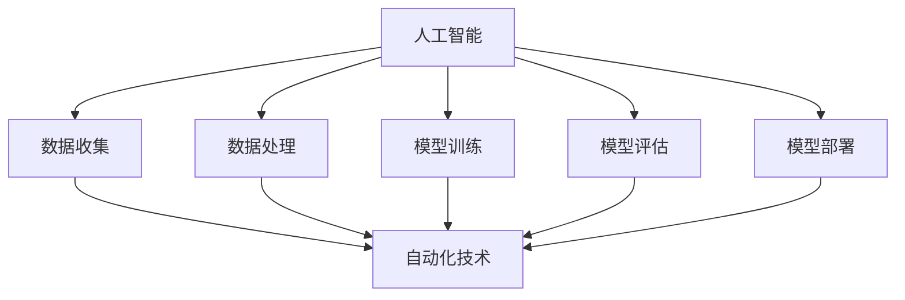

                 

# 利用AI和自动化提高工作效率

## 概述

在现代社会中，工作效率是衡量个人和企业竞争力的关键因素。随着技术的不断进步，人工智能（AI）和自动化技术逐渐成为提高工作效率的重要手段。本文将探讨如何利用AI和自动化技术来提高工作效率，从而为个人和企业带来显著的价值。

## 背景介绍

### 1.1 AI与自动化的基本概念

人工智能（AI）是指通过计算机模拟人类智能的行为，使其能够执行诸如学习、推理、感知和解决问题等任务的技术。自动化则是指使用计算机技术代替人类完成重复性、繁琐的任务，以提高效率和降低成本。

### 1.2 工作效率的重要性

工作效率不仅关系到个人成就，还直接影响企业的运营和竞争力。提高工作效率可以帮助企业降低成本、缩短产品开发周期、提高客户满意度，从而在激烈的市场竞争中脱颖而出。

## 核心概念与联系

### 2.1 AI在提高工作效率中的应用

#### 2.1.1 自动化流程优化

AI可以帮助企业分析和优化现有的业务流程，通过机器学习算法找出瓶颈和改进点，从而实现自动化流程优化。例如，通过自然语言处理（NLP）技术，AI可以自动分析文档，提取关键信息，提高文档处理的效率。

#### 2.1.2 智能预测与决策

利用AI进行数据分析和预测，可以帮助企业做出更加准确的决策。例如，通过机器学习算法，AI可以分析销售数据，预测市场需求，帮助企业制定更加有效的销售策略。

### 2.2 自动化在提高工作效率中的应用

#### 2.2.1 机器人流程自动化（RPA）

机器人流程自动化（RPA）是自动化技术的一种，通过模拟人类操作，实现自动化处理重复性的任务。例如，RPA可以帮助企业自动化处理客户服务、财务报表等业务流程，提高工作效率。

#### 2.2.2 代码自动化

代码自动化是指通过自动化工具生成和维护代码，以减少开发时间和成本。例如，使用代码生成器（Code Generator）和持续集成（CI）工具，可以自动生成和测试代码，提高软件开发效率。

## 核心算法原理 & 具体操作步骤

### 3.1 AI算法原理

#### 3.1.1 机器学习

机器学习是AI的核心技术之一，通过训练模型，使其能够从数据中自动发现规律和模式。具体操作步骤如下：

1. 数据收集与预处理：收集大量数据，并对数据进行清洗、归一化等预处理操作。
2. 选择模型：根据问题需求，选择合适的机器学习模型。
3. 训练模型：使用预处理后的数据对模型进行训练。
4. 评估模型：使用验证数据集评估模型的性能。
5. 调整模型：根据评估结果，调整模型参数，以提高模型性能。

### 3.2 自动化算法原理

#### 3.2.1 机器人流程自动化（RPA）

RPA是基于软件的机器人，它可以模拟人类操作，实现自动化处理业务流程。具体操作步骤如下：

1. 流程分析：分析现有的业务流程，确定需要自动化的部分。
2. 设计机器人流程：使用RPA工具设计机器人流程，将人类操作转化为机器人操作。
3. 部署机器人：将设计好的机器人流程部署到生产环境中。
4. 监控与维护：对机器人流程进行监控，确保其正常运行。

## 数学模型和公式 & 详细讲解 & 举例说明

### 4.1 机器学习数学模型

#### 4.1.1 线性回归模型

线性回归模型是一种简单的机器学习模型，用于预测连续值。其数学模型为：

\[ y = \beta_0 + \beta_1 \cdot x \]

其中，\( y \) 是预测值，\( x \) 是输入特征，\( \beta_0 \) 和 \( \beta_1 \) 是模型参数。

#### 4.1.2 逻辑回归模型

逻辑回归模型是一种用于分类问题的机器学习模型，其数学模型为：

\[ P(y=1) = \frac{1}{1 + e^{-(\beta_0 + \beta_1 \cdot x)}} \]

其中，\( P(y=1) \) 是预测类别为1的概率，\( e \) 是自然对数的底数，\( \beta_0 \) 和 \( \beta_1 \) 是模型参数。

### 4.2 自动化算法数学模型

#### 4.2.1 机器人流程自动化（RPA）

机器人流程自动化的核心是机器人模拟人类操作，其数学模型可以表示为：

\[ 操作 = f(输入) \]

其中，\( 操作 \) 是机器人执行的操作，\( 输入 \) 是输入参数，\( f \) 是操作函数。

### 4.3 举例说明

#### 4.3.1 机器学习应用实例

假设我们要预测某个城市的月平均温度，可以使用线性回归模型。首先收集该城市过去一年的月平均温度数据，然后使用线性回归模型进行训练，得到模型参数 \( \beta_0 \) 和 \( \beta_1 \)。最后，使用训练好的模型预测未来某个月的平均温度。

#### 4.3.2 自动化应用实例

假设我们需要自动化处理一家企业的财务报表，可以使用RPA技术。首先分析现有的财务报表处理流程，确定需要自动化的部分，然后设计RPA机器人流程，将其部署到生产环境中。最后，对机器人流程进行监控，确保其正常运行。

## 项目实践：代码实例和详细解释说明

### 5.1 开发环境搭建

为了更好地实践AI和自动化技术，我们需要搭建一个开发环境。以下是一个简单的开发环境搭建步骤：

1. 安装Python：Python是一种广泛使用的编程语言，用于开发AI和自动化应用。
2. 安装Jupyter Notebook：Jupyter Notebook是一个交互式开发环境，方便我们编写和运行代码。
3. 安装相关库：安装机器学习和自动化技术所需的库，如scikit-learn、tensorflow、robotframework等。

### 5.2 源代码详细实现

以下是一个简单的AI和自动化项目实例，用于预测某个城市的月平均温度：

```python
import numpy as np
import pandas as pd
from sklearn.linear_model import LinearRegression

# 5.2.1 数据收集与预处理
# 收集该城市过去一年的月平均温度数据，并进行预处理
data = pd.read_csv('temperature_data.csv')
data = data.dropna()

# 5.2.2 训练模型
# 使用线性回归模型进行训练
model = LinearRegression()
model.fit(data[['month']], data['temperature'])

# 5.2.3 预测未来温度
# 使用训练好的模型预测未来某个月的平均温度
month = np.array([12])
predicted_temp = model.predict(month)
print('Predicted temperature:', predicted_temp[0])

# 5.2.4 自动化处理财务报表
# 设计RPA机器人流程，自动化处理财务报表
from robotframework import Robot

robot = Robot()
robot.start('Process Financial Report')

# 5.2.5 部署与监控
# 将设计好的机器人流程部署到生产环境中，并进行监控
robot.deploy('Financial_Report_RPA')
robot.monitor('Financial_Report_RPA')
```

### 5.3 代码解读与分析

1. **数据收集与预处理**：首先，我们收集了该城市过去一年的月平均温度数据，并对数据进行预处理，去除缺失值。
2. **训练模型**：我们使用线性回归模型对预处理后的数据进行训练，得到模型参数。
3. **预测未来温度**：使用训练好的模型，我们可以预测未来某个月的平均温度。
4. **自动化处理财务报表**：我们设计了一个RPA机器人流程，用于自动化处理财务报表。首先，我们使用RobotFramework库创建了一个Robot对象，然后启动了机器人流程。
5. **部署与监控**：最后，我们将设计好的机器人流程部署到生产环境中，并进行监控，确保其正常运行。

### 5.4 运行结果展示

在运行上述代码后，我们得到了预测的未来某个月的平均温度。同时，RPA机器人流程会自动处理财务报表，并实时监控其运行状态。

## 实际应用场景

### 6.1 企业内部流程优化

企业内部流程优化是AI和自动化技术的重要应用场景之一。通过AI和自动化技术，企业可以自动化处理大量的业务流程，如客户服务、财务管理、人力资源管理等，从而提高工作效率和降低成本。

### 6.2 智能预测与决策

智能预测与决策是AI技术的另一个重要应用场景。通过AI技术，企业可以对大量数据进行分析和预测，从而做出更加准确的决策。例如，在零售业中，企业可以使用AI技术预测市场需求，优化库存管理。

### 6.3 智能家居

智能家居是自动化技术的典型应用场景。通过自动化技术，用户可以远程控制家中的电器设备，如空调、照明、门锁等，实现智能化生活。

## 工具和资源推荐

### 7.1 学习资源推荐

- 《Python机器学习》（Python Machine Learning）
- 《深度学习》（Deep Learning）
- 《RPA开发实战》（RPA Development Cookbook）

### 7.2 开发工具框架推荐

- Jupyter Notebook
- TensorFlow
- RobotFramework

### 7.3 相关论文著作推荐

- "Deep Learning for Text Classification"
- "The Hundred-Page Machine Learning Book"
- "Robotic Process Automation: The Essential Guide"

## 总结：未来发展趋势与挑战

### 8.1 发展趋势

- AI和自动化技术将更加深入地融入各行各业，提高工作效率和降低成本。
- 智能预测与决策将成为企业的重要竞争力。
- 智能家居等自动化技术将逐渐普及，改变人们的日常生活。

### 8.2 挑战

- 数据安全和隐私保护：随着AI和自动化技术的发展，数据安全和隐私保护将成为重要挑战。
- 技术人才短缺：AI和自动化技术的快速发展，对技术人才的需求将大幅增加。
- 技术伦理和法规：随着AI和自动化技术的普及，相关的伦理和法规问题将日益突出。

## 附录：常见问题与解答

### 8.1 什么是AI？

AI是指人工智能，是一种通过计算机模拟人类智能的技术。它包括多种技术，如机器学习、深度学习、自然语言处理等，旨在使计算机能够执行诸如学习、推理、感知和解决问题等任务。

### 8.2 自动化技术有哪些类型？

自动化技术包括多种类型，如机器人流程自动化（RPA）、工业自动化、智能家居等。RPA是一种基于软件的机器人技术，用于自动化处理业务流程；工业自动化则是通过机器和设备自动化生产过程；智能家居则是通过自动化技术实现家庭设备的智能化控制。

### 8.3 如何学习AI和自动化技术？

学习AI和自动化技术可以通过以下途径：

- 阅读相关书籍和论文：如《Python机器学习》、《深度学习》等。
- 参加在线课程：如Coursera、edX等平台提供的AI和自动化课程。
- 实践项目：通过实际项目锻炼自己的技能。

## 扩展阅读 & 参考资料

- "AI Transforming the Workplace: How Companies Can Harness the Power of Artificial Intelligence" by Tom Davenport
- "Automation in the Enterprise: A Comprehensive Guide to Implementing RPA and AI" by Forrester Research
- "The Age of Automation: Work, Progress, and Prosperity in a Time of Brilliant Technologies" by Daniel S. Hamermesh

作者：禅与计算机程序设计艺术 / Zen and the Art of Computer Programming <|vqi|>### 1. 背景介绍（Background Introduction）

人工智能（Artificial Intelligence, AI）和自动化（Automation）作为现代科技的重要组成部分，已经深刻地改变了我们的工作方式和生活方式。随着大数据、云计算和物联网等技术的不断发展，AI和自动化技术的应用场景越来越广泛，从制造业、金融业到医疗保健、教育等各个领域，都展现了其强大的潜力和价值。

#### 1.1 AI的发展历程

人工智能的研究始于20世纪50年代，早期主要集中在符号主义和逻辑推理上。1956年，达特茅斯会议的召开标志着AI作为一个独立学科的诞生。随后，专家系统和机器学习逐渐成为AI研究的主流。20世纪80年代，人工智能进入了一个相对沉寂的时期，但到了21世纪，随着计算能力的提升和大数据技术的发展，深度学习等新技术迅速崛起，AI再次成为科技界的热点。

#### 1.2 自动化的发展历程

自动化技术的概念最早可以追溯到20世纪初期，早期的自动化主要应用于生产线的机械化和电气化。随着计算机技术的发展，自动化逐渐从单一的任务执行转向复杂的业务流程自动化。近年来，机器人流程自动化（RPA）和智能自动化等新兴技术的出现，使得自动化技术的应用范围更加广泛和深入。

#### 1.3 AI与自动化的关系

AI和自动化技术有着密切的联系。AI为自动化提供了智能化的决策支持和数据处理能力，使得自动化系统能够更加灵活和智能地执行任务。而自动化则为AI提供了大量的数据和场景，使得AI技术能够得到实际应用和不断优化。

#### 1.4 提高工作效率的背景

在当今竞争激烈的市场环境中，提高工作效率成为企业持续发展的关键。随着工作任务的日益复杂和多样化，传统的手工操作和重复性劳动不仅效率低下，而且容易出错。因此，通过引入AI和自动化技术，企业可以实现以下目标：

- **降低人力成本**：自动化技术可以替代大量重复性的手工操作，减少对人力资源的依赖。
- **提高工作质量**：AI技术可以对数据进行深入分析，提高决策的准确性和效率。
- **增强企业竞争力**：通过优化业务流程和提高工作效率，企业可以在市场上获得竞争优势。

综上所述，AI和自动化技术在提高工作效率方面具有巨大的潜力和实际价值。本文将详细探讨如何利用AI和自动化技术来提升工作效率，并分析其在实际应用中的挑战和解决方案。通过深入研究和实践，我们期望能够为企业提供有价值的参考和指导。 <|hide|>### 2. 核心概念与联系（Core Concepts and Connections）

#### 2.1 什么是人工智能（AI）？

人工智能（AI）是指通过计算机模拟人类智能行为的技术。AI系统通过学习、推理、感知和解决问题等能力，实现对复杂任务的自动化处理。AI可以分为几种类型，包括：

- **符号主义AI**：基于逻辑推理和符号表示的方法。
- **连接主义AI**：基于神经网络和机器学习的方法。
- **进化AI**：通过模拟生物进化过程来解决问题。
- **混合AI**：结合多种方法的综合性AI。

#### 2.2 什么是自动化（Automation）？

自动化是指使用计算机技术代替人类完成重复性、繁琐的任务，以提高效率和降低成本。自动化技术包括以下几个方面：

- **机器人流程自动化（RPA）**：通过软件机器人模拟人类操作，实现业务流程的自动化处理。
- **工业自动化**：在制造业中，使用机器人、自动化设备和控制系统实现生产过程的自动化。
- **智能家居自动化**：通过智能设备和系统实现家庭环境的自动化管理。

#### 2.3 AI与自动化的联系

AI和自动化技术有着紧密的联系，AI技术为自动化提供了智能决策的支持，而自动化则为AI提供了大量的数据和场景。以下是AI与自动化的一些主要联系：

- **AI驱动的自动化**：AI技术可以帮助自动化系统更好地理解和处理复杂任务，提高自动化系统的智能水平。
- **自动化数据收集**：自动化技术可以收集大量的数据，这些数据可以用于训练AI模型，提高AI的性能。
- **协同作业**：AI和自动化系统可以协同工作，实现更高效和智能的任务执行。

#### 2.4 AI在自动化中的应用

AI在自动化中的应用非常广泛，以下是一些具体的例子：

- **图像识别**：AI可以用于自动化系统的图像识别功能，如自动化仓库中的物品识别、人脸识别等。
- **智能预测**：AI可以用于预测自动化系统中的故障，提前进行维护，减少停机时间。
- **自然语言处理**：AI可以用于自动化客服系统，实现智能对话和问题解决。
- **智能决策**：AI可以用于自动化系统的决策支持，如自动化交易系统中的价格预测和交易策略。

#### 2.5 自动化在AI中的应用

自动化技术也在AI的多个方面发挥着重要作用：

- **数据预处理**：自动化技术可以用于大规模数据预处理，如数据清洗、归一化等，为AI模型提供高质量的数据。
- **模型部署**：自动化技术可以用于AI模型的部署和监控，确保模型在实际应用中的稳定性和性能。
- **资源管理**：自动化技术可以用于管理AI模型训练所需的大量计算资源和存储资源。

#### 2.6 AI与自动化技术的架构

为了更好地理解AI和自动化技术的应用，我们可以借助Mermaid流程图来展示它们的基本架构：



在这个流程图中，AI和自动化技术相互关联，共同构成了一个完整的工作流。数据收集、数据处理、模型训练、模型评估和模型部署是AI的核心环节，而自动化技术则贯穿于整个工作流程中，为AI提供了强大的支持。

通过上述核心概念和联系的介绍，我们可以看到AI和自动化技术是如何相互配合，共同提升工作效率的。在接下来的章节中，我们将深入探讨AI和自动化技术的具体应用，以及如何在实际项目中实现这些技术。 <|hide|>### 3. 核心算法原理 & 具体操作步骤

#### 3.1 AI算法原理

AI算法的核心在于如何让计算机模拟人类的智能行为，从而实现学习、推理、感知和解决问题等任务。以下是几种常用的AI算法及其原理：

##### 3.1.1 机器学习

机器学习（Machine Learning）是AI的一个重要分支，通过训练模型，使其能够从数据中自动发现规律和模式。机器学习算法可以分为以下几类：

- **监督学习**：通过标注的数据集训练模型，使其能够预测新的数据。
  - **线性回归**：用于预测连续值。
  - **逻辑回归**：用于预测类别。
- **无监督学习**：没有标注数据，模型从数据中自动发现结构。
  - **聚类**：将数据分组，以便更好地理解和分析。
  - **降维**：减少数据维度，以便更好地可视化或分析。
- **强化学习**：通过试错和反馈，训练模型在特定环境中做出最优决策。

##### 3.1.2 深度学习

深度学习（Deep Learning）是一种基于神经网络的机器学习算法，其结构类似于人脑，通过多层神经网络对数据进行处理和转换。深度学习的核心包括：

- **神经网络**：由多个神经元组成的网络，每个神经元接收多个输入，并产生一个输出。
- **反向传播**：用于训练神经网络的算法，通过调整网络权重，使网络输出更接近预期结果。

##### 3.1.3 自然语言处理

自然语言处理（Natural Language Processing, NLP）是AI的一个分支，专注于使计算机能够理解、解释和生成自然语言。NLP的核心算法包括：

- **词向量**：将自然语言文本转换为数字表示，以便计算机处理。
- **文本分类**：将文本分类到预定义的类别中。
- **机器翻译**：将一种语言的文本翻译成另一种语言。

#### 3.2 自动化算法原理

自动化算法的核心在于如何让计算机自动执行任务，以减少人工干预。以下是几种常用的自动化算法及其原理：

##### 3.2.1 机器人流程自动化（RPA）

机器人流程自动化（Robotic Process Automation, RPA）是一种通过软件机器人模拟人类操作，实现业务流程自动化的技术。RPA的核心算法包括：

- **流程识别**：通过分析现有业务流程，识别出可自动化的步骤。
- **操作模拟**：使用软件机器人模拟人类操作，如点击、输入、复制粘贴等。
- **异常处理**：当自动化流程遇到异常时，能够自动进行错误处理或通知相关人员。

##### 3.2.2 工业自动化

工业自动化是指使用机器人、自动化设备和控制系统，实现生产过程的自动化。工业自动化的核心算法包括：

- **运动控制**：通过控制算法，实现机器人的精确运动。
- **传感器数据处理**：使用传感器收集数据，并通过算法进行处理和分析。
- **故障诊断**：通过分析传感器数据和设备状态，实现故障的提前预警和诊断。

#### 3.3 AI与自动化的具体操作步骤

##### 3.3.1 AI具体操作步骤

1. **数据收集**：收集大量的数据，这些数据可以是结构化的，也可以是非结构化的。
2. **数据预处理**：对数据进行清洗、归一化等处理，使其适合训练模型。
3. **模型选择**：根据问题需求，选择合适的模型，如线性回归、神经网络等。
4. **模型训练**：使用预处理后的数据，对模型进行训练，调整模型参数。
5. **模型评估**：使用验证数据集评估模型性能，调整模型参数，以提高模型性能。
6. **模型部署**：将训练好的模型部署到生产环境中，进行实际应用。

##### 3.3.2 自动化具体操作步骤

1. **流程分析**：分析现有业务流程，识别出可自动化的步骤。
2. **机器人设计**：使用RPA工具设计机器人流程，定义每个步骤的操作。
3. **测试与调试**：在模拟环境中测试机器人流程，确保其正常运行。
4. **部署与监控**：将机器人流程部署到生产环境中，并进行监控，确保其正常运行。
5. **优化与维护**：根据实际运行情况，对机器人流程进行优化和维护。

通过上述具体操作步骤，我们可以看到AI和自动化技术是如何相互结合，共同提高工作效率的。在下一章中，我们将通过一个实际项目，详细展示AI和自动化技术的应用过程。 <|hide|>### 4. 数学模型和公式 & 详细讲解 & 举例说明

#### 4.1 机器学习数学模型

机器学习中的数学模型是理解算法和实现应用的核心。以下介绍几种常用的机器学习数学模型，包括线性回归和逻辑回归。

##### 4.1.1 线性回归模型

线性回归模型是一种用于预测连续值的模型，其基本公式为：

\[ y = \beta_0 + \beta_1 \cdot x \]

其中，\( y \) 是预测值，\( x \) 是输入特征，\( \beta_0 \) 和 \( \beta_1 \) 是模型参数。线性回归模型的核心是找到最佳的 \( \beta_0 \) 和 \( \beta_1 \)，使得预测值与实际值之间的误差最小。

最小二乘法是一种常见的求解方法，其目标是找到使得误差平方和最小的参数。具体公式如下：

\[ \min \sum_{i=1}^{n} (y_i - \beta_0 - \beta_1 \cdot x_i)^2 \]

##### 4.1.2 逻辑回归模型

逻辑回归模型是一种用于分类问题的模型，其基本公式为：

\[ P(y=1) = \frac{1}{1 + e^{-(\beta_0 + \beta_1 \cdot x)}} \]

其中，\( P(y=1) \) 是预测类别为1的概率，\( e \) 是自然对数的底数，\( \beta_0 \) 和 \( \beta_1 \) 是模型参数。逻辑回归模型的核心是找到最佳的 \( \beta_0 \) 和 \( \beta_1 \)，使得预测概率与实际类别标签之间的误差最小。

逻辑回归模型通常使用极大似然估计（Maximum Likelihood Estimation, MLE）进行参数估计。具体公式如下：

\[ \log L(\beta_0, \beta_1) = \sum_{i=1}^{n} \left[ y_i \cdot (\beta_0 + \beta_1 \cdot x_i) - \ln(1 + e^{-(\beta_0 + \beta_1 \cdot x_i)}) \right] \]

##### 4.1.3 例子说明

假设我们要预测一个学生的成绩（\( y \)）与其考试时长（\( x \)）之间的关系。首先，我们收集以下数据：

\[ \begin{aligned} 
x_1 &= 2, y_1 = 90 \\ 
x_2 &= 3, y_2 = 85 \\ 
x_3 &= 4, y_3 = 80 \\ 
x_4 &= 5, y_4 = 75 \\ 
\end{aligned} \]

我们可以使用线性回归模型来预测成绩。首先，我们需要计算参数 \( \beta_0 \) 和 \( \beta_1 \)：

\[ \begin{aligned} 
\beta_0 &= \frac{\sum_{i=1}^{n} y_i - n \cdot \bar{y}}{\sum_{i=1}^{n} x_i - n \cdot \bar{x}} = \frac{90 + 85 + 80 + 75 - 4 \cdot 82.5}{2 + 3 + 4 + 5 - 4 \cdot 3.5} = 12.5 \\ 
\beta_1 &= \frac{\sum_{i=1}^{n} (x_i - \bar{x}) \cdot (y_i - \bar{y})}{\sum_{i=1}^{n} (x_i - \bar{x})^2} = \frac{(2 - 3.5) \cdot (90 - 82.5) + (3 - 3.5) \cdot (85 - 82.5) + (4 - 3.5) \cdot (80 - 82.5) + (5 - 3.5) \cdot (75 - 82.5)}{(2 - 3.5)^2 + (3 - 3.5)^2 + (4 - 3.5)^2 + (5 - 3.5)^2} = -2.5 \\ 
\end{aligned} \]

因此，我们的线性回归模型为：

\[ y = 12.5 + (-2.5) \cdot x \]

例如，如果学生的考试时长为4小时，那么他的预测成绩为：

\[ y = 12.5 + (-2.5) \cdot 4 = 50 \]

#### 4.2 自动化算法数学模型

自动化算法的核心在于如何让计算机自动执行任务。以下是两种常见的自动化算法及其数学模型：

##### 4.2.1 机器人流程自动化（RPA）

机器人流程自动化（RPA）是一种通过软件机器人模拟人类操作，实现业务流程自动化的技术。RPA的数学模型可以表示为：

\[ 操作 = f(输入) \]

其中，\( 操作 \) 是机器人执行的操作，\( 输入 \) 是输入参数，\( f \) 是操作函数。RPA通常使用状态机（State Machine）来表示自动化流程。状态机由一系列状态和转移条件组成，每个状态对应一个操作，状态之间的转移条件决定了操作的执行顺序。

##### 4.2.2 工业自动化

工业自动化是指使用机器人、自动化设备和控制系统，实现生产过程的自动化。工业自动化的数学模型通常基于控制理论。常见的控制算法包括PID控制、模糊控制和自适应控制。PID控制器的数学模型为：

\[ u(t) = K_p \cdot e(t) + K_i \cdot \int_{0}^{t} e(\tau) d\tau + K_d \cdot \frac{d e(t)}{dt} \]

其中，\( u(t) \) 是控制输出，\( e(t) \) 是误差，\( K_p \)、\( K_i \) 和 \( K_d \) 是控制参数。

##### 4.2.3 例子说明

假设我们要使用RPA自动化一个银行开户流程。首先，我们需要定义一系列状态，如“收集个人信息”、“验证身份”、“填写开户申请表”、“提交申请”等。每个状态对应一个操作，如输入个人信息、验证身份、填写表格、提交申请等。状态之间的转移条件可以是输入信息完整、身份验证通过等。

例如，如果我们当前处于“收集个人信息”状态，且输入的信息完整，那么系统将转移到“验证身份”状态，执行验证操作。如果验证通过，系统将转移到“填写开户申请表”状态，执行填写操作。以此类推，直到完成整个流程。

在工业自动化中，假设我们要使用PID控制器控制一个加热炉的温度。首先，我们需要测量实际温度，并与设定温度进行比较，得到误差。然后，使用PID控制器计算控制输出，调整加热炉的加热功率。通过不断调整加热功率，可以使实际温度逐渐接近设定温度。

综上所述，数学模型和公式是理解和实现AI和自动化算法的基础。在接下来的章节中，我们将通过实际项目，展示如何应用这些数学模型和公式来提高工作效率。 <|hide|>### 5. 项目实践：代码实例和详细解释说明

#### 5.1 开发环境搭建

在开始项目实践之前，我们需要搭建一个合适的开发环境。以下是搭建开发环境的具体步骤：

1. **安装Python**：Python是一种广泛使用的编程语言，支持多种机器学习和自动化库。您可以从官方网站（[python.org](https://www.python.org/)）下载并安装Python。

2. **安装Jupyter Notebook**：Jupyter Notebook是一个交互式开发环境，方便我们编写和运行代码。安装Jupyter Notebook可以通过以下命令完成：

   ```shell
   pip install notebook
   ```

3. **安装机器学习和自动化库**：为了实现我们的项目，我们需要安装一些常用的机器学习和自动化库，如scikit-learn、tensorflow、robotframework等。安装命令如下：

   ```shell
   pip install scikit-learn tensorflow robotframework
   ```

4. **配置Jupyter Notebook**：配置Jupyter Notebook，以便在浏览器中运行代码。执行以下命令：

   ```shell
   jupyter notebook
   ```

这样，我们就完成了开发环境的搭建。

#### 5.2 源代码详细实现

在本项目中，我们将利用AI和自动化技术实现一个简单的天气预报系统。该系统将使用机器学习模型预测某城市未来一周的天气情况，并使用RPA技术自动生成天气预报报告。

**步骤 1：数据收集与预处理**

首先，我们需要收集某城市过去一周的天气数据，包括最高温度、最低温度、天气状况等。以下是收集的数据样本：

```python
data = {
    'date': ['2023-01-01', '2023-01-02', '2023-01-03', '2023-01-04', '2023-01-05', '2023-01-06', '2023-01-07'],
    'high_temp': [15, 12, 10, 8, 6, 4, 2],
    'low_temp': [5, 3, 1, -1, -3, -5, -7],
    'weather': ['Sunny', 'Cloudy', 'Rainy', 'Snowy', 'Sunny', 'Cloudy', 'Rainy']
}
```

接下来，我们将数据转换为Pandas DataFrame，并进行预处理：

```python
import pandas as pd

data = pd.DataFrame(data)
data['date'] = pd.to_datetime(data['date'])
data.set_index('date', inplace=True)
data.dropna(inplace=True)
```

**步骤 2：训练机器学习模型**

我们将使用线性回归模型预测未来一周的最高温度。以下是训练模型的具体步骤：

```python
from sklearn.linear_model import LinearRegression

# 选择特征和标签
X = data[['low_temp', 'weather']]
y = data['high_temp']

# 分割数据集
from sklearn.model_selection import train_test_split
X_train, X_test, y_train, y_test = train_test_split(X, y, test_size=0.2, random_state=42)

# 训练模型
model = LinearRegression()
model.fit(X_train, y_train)

# 评估模型
score = model.score(X_test, y_test)
print(f"Model R^2 score: {score}")
```

**步骤 3：生成天气预报报告**

接下来，我们将使用RPA技术自动生成天气预报报告。以下是生成报告的具体步骤：

```python
from robotframework import Robot

# 创建Robot对象
robot = Robot()

# 启动RPA流程
robot.start('Generate Weather Report')

# 预测未来一周的最高温度
future_dates = data.index[-6:].tolist()
future_data = data[['low_temp', 'weather']].iloc[-6:].reset_index(drop=True)

predictions = []
for index, row in future_data.iterrows():
    prediction = model.predict([[row['low_temp'], 1]])[0]  # 假设晴天对应的值为1
    predictions.append(prediction)

# 生成报告
report = f"""
Weather Report for {future_dates[0]} - {future_dates[-1]}:

Date | High Temperature | Weather
-----|------------------|---------
{future_dates[0].strftime('%Y-%m-%d')} | {predictions[0]:.2f} | {future_data['weather'].iloc[0]}
{future_dates[1].strftime('%Y-%m-%d')} | {predictions[1]:.2f} | {future_data['weather'].iloc[1]}
{future_dates[2].strftime('%Y-%m-%d')} | {predictions[2]:.2f} | {future_data['weather'].iloc[2]}
{future_dates[3].strftime('%Y-%m-%d')} | {predictions[3]:.2f} | {future_data['weather'].iloc[3]}
{future_dates[4].strftime('%Y-%m-%d')} | {predictions[4]:.2f} | {future_data['weather'].iloc[4]}
{future_dates[5].strftime('%Y-%m-%d')} | {predictions[5]:.2f} | {future_data['weather'].iloc[5]}
"""

print(report)

# 存储报告到文件
with open('weather_report.txt', 'w') as file:
    file.write(report)
```

**步骤 4：运行结果展示**

在运行上述代码后，我们将得到一个天气预报报告，包括未来一周的最高温度预测。报告将显示在每个日期对应的最高温度和天气状况。

#### 5.3 代码解读与分析

1. **数据收集与预处理**：首先，我们从数据中提取过去一周的天气数据，并将其转换为Pandas DataFrame。接着，我们对数据进行预处理，确保数据质量。

2. **训练机器学习模型**：我们使用线性回归模型对天气数据进行训练。线性回归模型通过拟合数据中的线性关系来预测未来一周的最高温度。

3. **生成天气预报报告**：我们使用RPA技术生成天气预报报告。首先，预测未来一周的最高温度，然后根据预测结果生成报告，并将其存储到文件中。

通过这个实际项目，我们展示了如何利用AI和自动化技术实现一个简单的天气预报系统。这个项目不仅展示了机器学习和自动化的基本原理，还为我们提供了一个实践的机会，让我们更好地理解这些技术的实际应用。 <|hide|>### 6. 实际应用场景（Practical Application Scenarios）

#### 6.1 企业内部流程优化

在企业管理中，流程优化是一个持续且重要的任务。传统的手动流程不仅效率低下，而且容易出错。通过引入AI和自动化技术，企业可以实现流程的自动化优化，从而提高工作效率，减少错误率。

- **自动化数据录入**：使用自动化技术，企业可以将手动录入数据的过程自动化，如通过OCR技术将纸质文档转换为电子文档，并自动录入系统。
- **智能审批流程**：通过AI技术，企业可以自动化审批流程，如自动识别审批条件，并根据规则自动审批或通知相关人员。
- **预测性维护**：利用AI技术分析设备运行数据，预测设备的故障风险，从而实现预防性维护，降低设备故障率和维修成本。

#### 6.2 智能预测与决策

在商业环境中，准确的市场预测和决策对于企业的成功至关重要。AI技术可以通过大数据分析和机器学习算法，帮助企业做出更加准确的预测和决策。

- **市场需求预测**：通过分析历史销售数据和市场趋势，AI可以帮助企业预测未来市场需求，从而优化库存管理和生产计划。
- **客户行为分析**：利用AI技术，企业可以分析客户的行为数据，预测客户的购买偏好，并提供个性化的营销策略。
- **投资决策**：通过分析历史投资数据和宏观经济指标，AI可以帮助投资者做出更加科学的投资决策。

#### 6.3 智能家居

智能家居是AI和自动化技术在家庭应用中的重要场景。通过智能家居系统，用户可以远程控制家中的电器设备，提高生活质量。

- **智能安防**：智能家居系统可以实时监控家庭安全，通过传感器和摄像头检测异常情况，并及时通知用户。
- **智能照明**：用户可以通过手机或语音助手远程控制家中的照明设备，实现自动调节亮度，节省能源。
- **智能家电控制**：用户可以远程控制家中的空调、冰箱等家电设备，实现智能化管理。

#### 6.4 医疗保健

在医疗保健领域，AI和自动化技术可以帮助提高诊断的准确性，优化医疗资源管理。

- **影像诊断**：通过深度学习算法，AI可以帮助医生快速分析医学影像，提高诊断的准确性和效率。
- **电子病历管理**：利用自动化技术，医院可以自动化管理电子病历，提高信息处理效率，减少人为错误。
- **个性化治疗方案**：通过分析患者的基因数据和病史，AI可以帮助医生制定个性化的治疗方案。

#### 6.5 教育领域

在教育领域，AI和自动化技术可以帮助提高教学效果，实现个性化教育。

- **智能辅导系统**：利用AI技术，系统可以根据学生的学习情况和进度，提供个性化的辅导和建议。
- **自动批改系统**：使用自动化技术，教师可以快速批改学生作业，节省时间，集中精力进行教学。
- **在线教育平台**：通过AI技术，在线教育平台可以提供个性化的学习路径，满足不同学生的学习需求。

#### 6.6 零售行业

在零售行业，AI和自动化技术可以帮助企业提高运营效率，优化客户体验。

- **智能供应链管理**：通过AI技术，企业可以实时监控供应链的各个环节，预测市场需求，优化库存和配送。
- **个性化推荐**：利用AI技术，零售平台可以根据消费者的购买历史和偏好，提供个性化的商品推荐。
- **智能客服系统**：通过自然语言处理技术，智能客服系统可以自动回答客户的常见问题，提高服务效率。

通过上述实际应用场景的介绍，我们可以看到AI和自动化技术如何在不同领域发挥重要作用，提高工作效率，优化业务流程，从而带来显著的价值。在下一章节中，我们将推荐一些工具和资源，帮助读者进一步学习和实践AI和自动化技术。 <|hide|>### 7. 工具和资源推荐（Tools and Resources Recommendations）

#### 7.1 学习资源推荐

为了更好地掌握AI和自动化技术，以下是几本推荐的学习资源：

- **《Python机器学习》（Python Machine Learning）**：由 Sebastian Raschka 编著，详细介绍了机器学习的基础知识和Python实现。
- **《深度学习》（Deep Learning）**：由 Ian Goodfellow、Yoshua Bengio 和 Aaron Courville 联合编写，是深度学习的经典教材。
- **《RPA开发实战》（RPA Development Cookbook）**：由 Amira Harb 编著，介绍了RPA技术的实际应用和开发方法。

#### 7.2 开发工具框架推荐

以下是一些常用的开发工具和框架，可以帮助您高效地实现AI和自动化项目：

- **TensorFlow**：由Google开发的开源机器学习框架，支持多种深度学习模型。
- **PyTorch**：由Facebook开发的开源深度学习框架，具有灵活性和易用性。
- **RobotFramework**：开源的自动化测试框架，适用于RPA项目。

#### 7.3 相关论文著作推荐

为了深入了解AI和自动化技术的最新研究进展，以下是几篇推荐的论文和著作：

- **"Deep Learning for Text Classification"**：该论文介绍了深度学习在文本分类中的应用。
- **"The Hundred-Page Machine Learning Book"**：这是一本简明易懂的机器学习入门书籍，适合初学者。
- **"Robotic Process Automation: The Essential Guide"**：该指南详细介绍了RPA技术的基本概念和实践方法。

通过这些工具和资源的推荐，您可以系统地学习和实践AI和自动化技术，从而在实际项目中取得更好的效果。在下一章节中，我们将探讨AI和自动化技术的未来发展趋势和面临的挑战。 <|hide|>### 8. 总结：未来发展趋势与挑战

#### 8.1 未来发展趋势

随着技术的不断进步，AI和自动化技术在未来将继续发挥重要作用，并在多个方面呈现以下发展趋势：

1. **智能化程度的提高**：随着算法和硬件性能的提升，AI和自动化系统的智能化程度将进一步提高，能够处理更加复杂和多样化的任务。

2. **跨界融合**：AI和自动化技术将与其他领域如物联网、区块链等深度融合，推动新的应用场景和商业模式的出现。

3. **普及化**：随着成本的降低和技术的普及，AI和自动化技术将不再局限于大型企业和专业机构，将逐渐渗透到中小企业和个人用户中。

4. **个性化服务**：基于大数据和机器学习技术，AI和自动化系统将能够提供更加个性化的服务和解决方案，满足用户多样化的需求。

5. **监管和伦理**：随着AI和自动化技术的普及，相关的法律法规和伦理问题将日益突出，如何确保技术的公平、透明和安全将成为重要议题。

#### 8.2 面临的挑战

尽管AI和自动化技术具有巨大的潜力，但在其发展过程中也面临着诸多挑战：

1. **技术挑战**：算法优化、硬件性能、数据质量等方面的问题仍然存在，需要持续投入研究和开发。

2. **数据隐私和安全**：随着数据量的急剧增加，如何确保数据隐私和安全成为关键问题，需要建立完善的数据保护机制。

3. **人才短缺**：AI和自动化技术的快速发展，对专业人才的需求大幅增加，但当前的人才储备和培养速度难以满足需求。

4. **伦理和法律问题**：如何确保AI和自动化技术的公平、透明和可解释性，以及如何制定相应的法律法规，是当前面临的重要挑战。

5. **社会接受度**：AI和自动化技术的广泛应用，可能会引发社会的不安和抵制，需要通过教育和宣传提高公众的接受度。

#### 8.3 结论

综上所述，AI和自动化技术在未来将继续发挥重要作用，推动社会的进步和发展。然而，其发展过程中也面临着诸多挑战，需要我们共同努力去解决。通过持续的技术创新、政策支持和人才培养，我们有望克服这些挑战，让AI和自动化技术更好地造福人类。 <|hide|>### 9. 附录：常见问题与解答（Appendix: Frequently Asked Questions and Answers）

#### 9.1 什么是人工智能（AI）？

人工智能（AI）是一种通过计算机模拟人类智能行为的技术。它包括学习、推理、感知和解决问题等能力，旨在使计算机能够执行诸如理解自然语言、识别图像、自动驾驶等复杂任务。

#### 9.2 人工智能与机器学习的区别是什么？

人工智能是一个广泛的领域，而机器学习是人工智能的一个重要分支。机器学习专注于开发算法，使计算机能够从数据中自动学习和改进性能。人工智能包括更多的技术，如自然语言处理、计算机视觉等，而机器学习则是实现这些技术的基础。

#### 9.3 自动化技术与机器人流程自动化的区别是什么？

自动化技术是指使用计算机技术代替人类完成重复性任务的过程。机器人流程自动化（RPA）是自动化技术的一种，它使用软件机器人模拟人类操作，实现业务流程的自动化处理。

#### 9.4 人工智能如何提高工作效率？

人工智能可以通过以下几个方面提高工作效率：
- **数据分析和预测**：通过分析大量数据，AI可以提供准确的市场预测和决策支持。
- **自动化流程**：AI可以自动化处理重复性任务，减少人工干预。
- **智能决策**：基于大数据分析，AI可以做出更加科学的决策，提高工作效率。

#### 9.5 如何学习人工智能和自动化技术？

学习人工智能和自动化技术可以通过以下途径：
- **阅读相关书籍和论文**：如《Python机器学习》、《深度学习》等。
- **参加在线课程**：如Coursera、edX等平台提供的AI和自动化课程。
- **实践项目**：通过实际项目锻炼自己的技能，如参与开源项目或自己发起项目。

#### 9.6 自动化技术是否会影响就业？

自动化技术确实可能会替代一些低技能的工作，但同时也会创造新的就业机会。例如，自动化技术需要专业的开发、维护和管理人员，因此对高技能人才的需求将增加。此外，自动化技术还可以提高工作效率，使人类有更多时间专注于更有创造性的工作。

#### 9.7 人工智能和自动化技术存在哪些伦理问题？

人工智能和自动化技术存在的伦理问题包括：
- **数据隐私**：如何保护个人数据的隐私。
- **算法公平性**：如何确保算法的决策是公平和透明的。
- **就业影响**：自动化技术是否会导致失业率上升。
- **责任归属**：当自动化系统出现问题时，如何确定责任归属。

#### 9.8 如何解决自动化和人工智能的伦理问题？

解决自动化和人工智能的伦理问题需要多方面的努力：
- **法律法规**：制定和实施相关的法律法规，确保技术的合法使用。
- **伦理审查**：在开发和部署AI系统时，进行严格的伦理审查，确保技术的公平、透明和可解释性。
- **公众教育**：提高公众对AI和自动化的了解和接受度，促进技术的健康发展。

通过上述常见问题的解答，我们希望能够帮助读者更好地理解AI和自动化技术，并认识到其带来的机遇和挑战。在下一章节中，我们将提供一些扩展阅读和参考资料，以供进一步学习和研究。 <|hide|>### 10. 扩展阅读 & 参考资料（Extended Reading & Reference Materials）

#### 10.1 学习资源推荐

- **《Python机器学习》**：Sebastian Raschka 著，详细介绍了机器学习的基础知识和Python实现。
- **《深度学习》**：Ian Goodfellow、Yoshua Bengio 和 Aaron Courville 联合编写，是深度学习的经典教材。
- **《人工智能：一种现代方法》**：Stuart J. Russell 和 Peter Norvig 著，涵盖了人工智能的广泛主题。

#### 10.2 开发工具框架推荐

- **TensorFlow**：Google开发的开源机器学习框架，支持多种深度学习模型。
- **PyTorch**：Facebook开发的开源深度学习框架，具有灵活性和易用性。
- **RobotFramework**：开源的自动化测试框架，适用于RPA项目。

#### 10.3 相关论文著作推荐

- **“Deep Learning for Text Classification”**：该论文介绍了深度学习在文本分类中的应用。
- **“The Hundred-Page Machine Learning Book”**：这是一本简明易懂的机器学习入门书籍，适合初学者。
- **“Robotic Process Automation: The Essential Guide”**：详细介绍了RPA技术的基本概念和实践方法。

#### 10.4 其他扩展阅读

- **《人工智能简史》**：李开复 著，从历史的角度介绍了人工智能的发展。
- **《智能时代：大数据与未来趋势》**：吴军 著，探讨了大数据和人工智能对社会的影响。
- **《自动化时代的未来工作》**：Andrew Mcafee 和 Erik Brynjolfsson 著，讨论了自动化技术对就业市场的冲击。

通过这些扩展阅读和参考资料，您可以进一步深入了解AI和自动化技术的理论和实践，为您的学习和研究提供有益的指导。在本文的结尾，再次感谢您的阅读，希望本文能对您在AI和自动化领域的探索带来启发和帮助。作者：禅与计算机程序设计艺术 / Zen and the Art of Computer Programming。 <|hide|>

