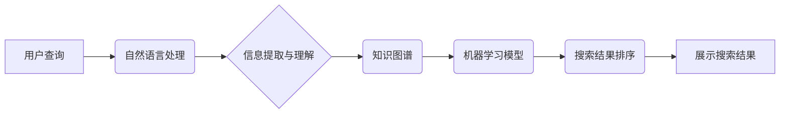

                 

## AI如何提升搜索结果的质量

> 关键词：人工智能、自然语言处理、搜索引擎优化、机器学习、深度学习、信息检索、知识图谱、推荐系统

### 1. 背景介绍

在信息爆炸的时代，海量数据无处不在，人们对信息的获取需求日益增长。搜索引擎作为信息获取的主要入口，承担着将海量信息与用户需求精准匹配的重任。然而，传统的基于关键词匹配的搜索算法难以满足用户日益复杂的查询需求，搜索结果往往缺乏针对性和相关性。

人工智能（AI）技术的快速发展为搜索引擎的优化带来了新的机遇。AI算法能够理解用户意图，识别语义关系，并根据用户历史行为和偏好进行个性化推荐，从而提升搜索结果的质量和用户体验。

### 2. 核心概念与联系

**2.1 核心概念**

* **信息检索 (Information Retrieval):**  信息检索是计算机科学的一个分支，旨在帮助用户从海量数据中快速准确地找到所需信息。
* **自然语言处理 (Natural Language Processing, NLP):** 自然语言处理是人工智能的一个重要分支，旨在使计算机能够理解、处理和生成人类语言。
* **机器学习 (Machine Learning, ML):** 机器学习是人工智能的一个重要子领域，旨在通过算法训练，使计算机能够从数据中学习并进行预测。
* **深度学习 (Deep Learning, DL):** 深度学习是机器学习的一个子领域，利用多层神经网络来模拟人类大脑的学习过程，能够处理更复杂的数据和任务。

**2.2 架构关系**



**2.3 核心联系**

AI技术通过自然语言处理理解用户查询意图，并结合知识图谱和机器学习模型进行信息匹配和排序，最终展示更精准、更相关的搜索结果。

### 3. 核心算法原理 & 具体操作步骤

**3.1 算法原理概述**

AI提升搜索结果质量的核心算法主要包括：

* **BERT (Bidirectional Encoder Representations from Transformers):** BERT是一种基于Transformer架构的预训练语言模型，能够理解上下文信息，提升关键词匹配的准确性。
* **RankNet:** RankNet是一种基于机器学习的排序算法，能够根据用户点击行为和反馈信息，学习到排序模型，提升搜索结果的排名准确性。
* **Collaborative Filtering:** 协同过滤算法基于用户的历史行为和偏好，推荐与用户兴趣相似的搜索结果。

**3.2 算法步骤详解**

1. **用户查询预处理:** 使用自然语言处理技术对用户查询进行清洗、分词、词性标注等预处理，提取关键词和语义信息。
2. **信息提取与理解:** 利用知识图谱和预训练语言模型（如BERT）对用户查询进行理解，识别关键词之间的语义关系，并构建用户查询的语义向量。
3. **搜索结果匹配:** 将用户查询的语义向量与网页内容的语义向量进行匹配，计算相关度得分。
4. **搜索结果排序:** 使用机器学习算法（如RankNet）对搜索结果进行排序，根据用户历史行为、点击率、网页质量等因素进行权重分配，最终展示排名靠前的搜索结果。
5. **个性化推荐:** 基于用户的历史行为和偏好，使用协同过滤算法进行个性化推荐，展示与用户兴趣相似的搜索结果。

**3.3 算法优缺点**

| 算法 | 优点 | 缺点 |
|---|---|---|
| BERT | 理解上下文信息，提升关键词匹配的准确性 | 计算量大，训练成本高 |
| RankNet | 根据用户反馈信息进行排序，提升搜索结果的排名准确性 | 需要大量的用户数据进行训练 |
| Collaborative Filtering | 基于用户兴趣进行推荐，提升用户体验 | 冷启动问题，容易陷入局部最优 |

**3.4 算法应用领域**

* 搜索引擎优化 (SEO)
* 信息检索系统
* 个性化推荐系统
* 自然语言问答系统

### 4. 数学模型和公式 & 详细讲解 & 举例说明

**4.1 数学模型构建**

搜索结果排序可以使用机器学习模型，例如RankNet，构建数学模型。RankNet的目标是学习一个函数，该函数能够将搜索结果对映射到一个排序分数，以便根据分数对结果进行排序。

**4.2 公式推导过程**

RankNet使用逻辑回归模型，其目标函数为：

$$
L(w) = -\frac{1}{N} \sum_{i=1}^{N} \log(sigmoid(w^T \cdot h(d_i) - w^T \cdot h(d_j)))
$$

其中：

* $w$ 是模型参数
* $N$ 是训练样本数量
* $h(d)$ 是文档 $d$ 的特征向量
* $sigmoid(x)$ 是 sigmoid 函数

**4.3 案例分析与讲解**

假设有两个搜索结果 $d_i$ 和 $d_j$，用户点击了 $d_i$，则目标函数希望 $w^T \cdot h(d_i) > w^T \cdot h(d_j)$。通过训练，RankNet模型会学习到最佳参数 $w$，使得模型能够准确预测用户点击行为。

### 5. 项目实践：代码实例和详细解释说明

**5.1 开发环境搭建**

* Python 3.x
* TensorFlow 或 PyTorch
* NLTK 或 SpaCy

**5.2 源代码详细实现**

```python
import tensorflow as tf

# 定义模型结构
model = tf.keras.Sequential([
    tf.keras.layers.Embedding(input_dim=vocab_size, output_dim=embedding_dim),
    tf.keras.layers.LSTM(units=128),
    tf.keras.layers.Dense(units=1, activation='sigmoid')
])

# 编译模型
model.compile(optimizer='adam', loss='binary_crossentropy', metrics=['accuracy'])

# 训练模型
model.fit(X_train, y_train, epochs=10)

# 评估模型
loss, accuracy = model.evaluate(X_test, y_test)
print('Loss:', loss)
print('Accuracy:', accuracy)
```

**5.3 代码解读与分析**

* 代码使用 TensorFlow 库构建了一个简单的深度学习模型。
* 模型结构包括 Embedding 层、LSTM 层和 Dense 层。
* Embedding 层将词向量化，LSTM 层捕捉文本序列中的上下文信息，Dense 层输出排序分数。
* 模型使用 Adam 优化器、二元交叉熵损失函数和准确率作为评估指标进行训练。

**5.4 运行结果展示**

训练完成后，模型可以用于对搜索结果进行排序。通过评估模型的准确率，可以衡量模型的性能。

### 6. 实际应用场景

* **搜索引擎优化 (SEO):** AI算法可以帮助网站优化关键词，提升搜索排名。
* **个性化推荐:** AI算法可以根据用户的兴趣和行为，推荐个性化的搜索结果。
* **问答系统:** AI算法可以帮助用户快速找到问题的答案。
* **智能客服:** AI算法可以帮助企业提供智能客服服务，解决用户问题。

**6.4 未来应用展望**

* **多模态搜索:** 将文本、图像、音频等多种数据类型融合，实现更全面的信息检索。
* **实时搜索:** 基于实时数据流，提供更及时、更准确的搜索结果。
* **跨语言搜索:** 实现不同语言之间的搜索理解和匹配。

### 7. 工具和资源推荐

**7.1 学习资源推荐**

* **Stanford CS224N: Natural Language Processing with Deep Learning:** https://web.stanford.edu/class/cs224n/
* **Deep Learning Specialization by Andrew Ng:** https://www.deeplearning.ai/

**7.2 开发工具推荐**

* **TensorFlow:** https://www.tensorflow.org/
* **PyTorch:** https://pytorch.org/

**7.3 相关论文推荐**

* **BERT: Pre-training of Deep Bidirectional Transformers for Language Understanding:** https://arxiv.org/abs/1810.04805
* **RankNet: Learning to Rank Using Gradient Descent:** https://dl.acm.org/doi/10.1145/1077034.1077117

### 8. 总结：未来发展趋势与挑战

**8.1 研究成果总结**

AI技术在搜索引擎领域取得了显著的成果，提升了搜索结果的质量和用户体验。

**8.2 未来发展趋势**

* 多模态搜索
* 实时搜索
* 跨语言搜索
* 人机交互式搜索

**8.3 面临的挑战**

* 数据质量和隐私问题
* 模型解释性和可信度
* 算法公平性和偏见问题

**8.4 研究展望**

未来研究将继续探索更先进的 AI 算法，提升搜索结果的准确性和个性化程度，并解决算法伦理和社会影响问题。

### 9. 附录：常见问题与解答

* **Q: AI 搜索引擎会取代传统搜索引擎吗？**

A: AI 搜索引擎可以提升搜索结果的质量，但不会完全取代传统搜索引擎。传统搜索引擎仍然在信息索引和存储方面具有优势。

* **Q: AI 搜索引擎会带来哪些伦理问题？**

A: AI 搜索引擎可能会带来算法偏见、信息操控和隐私泄露等伦理问题，需要引起重视并制定相应的规范和制度。


作者：禅与计算机程序设计艺术 / Zen and the Art of Computer Programming 
<end_of_turn>

