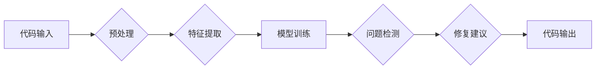

                 

## AI开发的代码审查：Lepton AI的质量控制

> 关键词：人工智能、代码审查、Lepton AI、质量控制、软件开发、自动化测试、机器学习、自然语言处理

## 1. 背景介绍

在软件开发领域，代码审查一直是确保软件质量的重要环节。传统的代码审查通常依赖于人工审阅，这不仅耗时费力，而且容易受到主观因素的影响。随着人工智能技术的快速发展，基于AI的代码审查工具逐渐涌现，为软件开发带来了新的可能性。

Lepton AI 便是其中一个代表性的例子。它是一款基于深度学习的代码审查平台，能够自动识别代码中的潜在问题，并提供可行的修复建议。Lepton AI 的出现，标志着代码审查领域迈向自动化和智能化的一大进步。

## 2. 核心概念与联系

Lepton AI 的核心概念是利用机器学习模型对代码进行分析和理解。它通过训练大量的代码数据集，学习代码的语法结构、编程规范和常见错误模式。

**Lepton AI 的工作原理可概括为以下几个步骤：**

1. **代码预处理:** 将代码转换为机器可理解的格式，例如抽象语法树 (AST)。
2. **特征提取:** 从预处理后的代码中提取各种特征，例如代码结构、变量类型、函数调用等。
3. **模型训练:** 利用机器学习算法，训练模型以识别代码中的潜在问题。
4. **问题检测:** 将待审查的代码输入到训练好的模型中，模型会识别出潜在的问题并给出相应的评分。
5. **修复建议:**  Lepton AI 可以根据识别出的问题，提供可行的修复建议。

**Lepton AI 架构图:**

## 3. 核心算法原理 & 具体操作步骤

### 3.1  算法原理概述

Lepton AI 主要采用深度学习算法，特别是循环神经网络 (RNN) 和卷积神经网络 (CNN) 来实现代码分析和问题检测。

* **循环神经网络 (RNN):** RNN 擅长处理序列数据，例如代码中的语句和代码块。它能够学习代码的上下文信息，识别代码中的语法错误和逻辑错误。
* **卷积神经网络 (CNN):** CNN 擅长提取图像中的特征，也可以应用于代码分析。它可以学习代码结构的特征，识别代码中的重复代码块和潜在的代码漏洞。

### 3.2  算法步骤详解

1. **数据预处理:** 将代码转换为机器可理解的格式，例如抽象语法树 (AST)。AST 可以将代码结构化表示，方便模型进行分析。
2. **特征提取:** 从 AST 中提取各种特征，例如代码结构、变量类型、函数调用等。这些特征可以用来描述代码的语义和行为。
3. **模型训练:** 利用 RNN 和 CNN 等深度学习算法，训练模型以识别代码中的潜在问题。训练数据通常包含大量的代码样本，以及对应的缺陷标签。
4. **模型评估:** 使用测试数据评估模型的性能，例如准确率、召回率和 F1-score。
5. **模型部署:** 将训练好的模型部署到生产环境中，用于自动检测代码中的潜在问题。

### 3.3  算法优缺点

**优点:**

* **自动化:** 可以自动识别代码中的潜在问题，提高代码审查效率。
* **智能化:** 可以识别代码中的复杂问题，例如逻辑错误和代码漏洞。
* **客观性:** 可以减少主观因素的影响，提高代码审查的客观性。

**缺点:**

* **数据依赖:** 需要大量的训练数据才能训练出准确的模型。
* **解释性:** 深度学习模型的决策过程难以解释，难以理解模型是如何识别问题的。
* **泛化能力:** 模型的泛化能力有限，可能无法识别所有类型的代码问题。

### 3.4  算法应用领域

Lepton AI 的核心算法可以应用于各种软件开发领域，例如：

* **代码质量控制:** 自动识别代码中的潜在问题，提高软件质量。
* **代码安全分析:** 识别代码中的安全漏洞，防止代码被攻击。
* **代码重构:** 识别代码中的冗余代码和重复代码块，帮助进行代码重构。
* **代码风格检查:** 检查代码是否符合指定的代码风格规范。

## 4. 数学模型和公式 & 详细讲解 & 举例说明

### 4.1  数学模型构建

Lepton AI 的核心数学模型是基于深度学习的循环神经网络 (RNN) 和卷积神经网络 (CNN)。

* **循环神经网络 (RNN):** RNN 使用隐藏状态来存储序列信息，能够学习代码的上下文信息。其核心数学公式是隐藏状态的更新公式：

$$h_t = f(W_{hh}h_{t-1} + W_{xh}x_t + b_h)$$

其中：

* $h_t$ 是时间步 t 的隐藏状态。
* $h_{t-1}$ 是时间步 t-1 的隐藏状态。
* $x_t$ 是时间步 t 的输入。
* $W_{hh}$ 和 $W_{xh}$ 是权重矩阵。
* $b_h$ 是偏置项。
* $f$ 是激活函数。

* **卷积神经网络 (CNN):** CNN 使用卷积核来提取代码结构的特征。其核心数学公式是卷积运算：

$$y(i,j) = \sum_{m=0}^{M-1} \sum_{n=0}^{N-1} x(i+m,j+n) * w(m,n)$$

其中：

* $y(i,j)$ 是卷积核输出的特征图上的值。
* $x(i+m,j+n)$ 是输入图像上的值。
* $w(m,n)$ 是卷积核的值。
* $M$ 和 $N$ 是卷积核的大小。

### 4.2  公式推导过程

RNN 和 CNN 的具体公式推导过程比较复杂，涉及到微积分、线性代数等数学知识。

### 4.3  案例分析与讲解

通过训练大量的代码数据集，Lepton AI 可以学习到代码的语法结构、编程规范和常见错误模式。例如，它可以识别出以下类型的代码问题：

* 语法错误：例如缺少分号、括号不匹配等。
* 逻辑错误：例如条件语句错误、循环错误等。
* 代码漏洞：例如 SQL 注入、跨站脚本攻击等。

## 5. 项目实践：代码实例和详细解释说明

### 5.1  开发环境搭建

Lepton AI 的开发环境搭建需要 Python、TensorFlow 或 PyTorch 等深度学习框架，以及一些代码分析工具。

### 5.2  源代码详细实现

Lepton AI 的源代码实现比较复杂，涉及到深度学习模型的训练、代码预处理、特征提取等多个模块。

### 5.3  代码解读与分析

Lepton AI 的代码可以分为以下几个模块：

* **数据预处理模块:** 将代码转换为机器可理解的格式，例如抽象语法树 (AST)。
* **特征提取模块:** 从 AST 中提取各种特征，例如代码结构、变量类型、函数调用等。
* **模型训练模块:** 利用深度学习算法，训练模型以识别代码中的潜在问题。
* **问题检测模块:** 将待审查的代码输入到训练好的模型中，模型会识别出潜在的问题并给出相应的评分。
* **修复建议模块:**  Lepton AI 可以根据识别出的问题，提供可行的修复建议。

### 5.4  运行结果展示

Lepton AI 可以将识别出的代码问题和修复建议以报告的形式展示，方便开发人员进行审查和修复。

## 6. 实际应用场景

Lepton AI 可以应用于各种软件开发场景，例如：

* **开源软件维护:** 自动识别开源软件中的潜在问题，提高软件质量。
* **企业级软件开发:** 自动检测企业级软件中的代码漏洞，提高软件安全性。
* **教育培训:** 用于教学和培训，帮助学生学习代码审查和软件开发的最佳实践。

### 6.4  未来应用展望

Lepton AI 的未来应用前景十分广阔，例如：

* **代码生成:** 利用 Lepton AI 的代码理解能力，可以辅助开发人员生成代码。
* **代码翻译:** 可以利用 Lepton AI 将代码从一种编程语言翻译成另一种编程语言。
* **代码智能化维护:** 可以利用 Lepton AI 自动进行代码维护，例如代码更新、代码重构等。

## 7. 工具和资源推荐

### 7.1  学习资源推荐

* **深度学习书籍:** 《深度学习》 (Ian Goodfellow, Yoshua Bengio, Aaron Courville)
* **机器学习课程:** Coursera 上的《机器学习》课程 (Andrew Ng)
* **代码分析工具:** SonarQube, Code Climate

### 7.2  开发工具推荐

* **Python:** Python 是深度学习的常用编程语言。
* **TensorFlow:** TensorFlow 是一个开源的深度学习框架。
* **PyTorch:** PyTorch 是另一个开源的深度学习框架。

### 7.3  相关论文推荐

* **论文:** "DeepCode: An AI-Powered Code Review Tool" (https://arxiv.org/abs/1806.05477)

## 8. 总结：未来发展趋势与挑战

### 8.1  研究成果总结

Lepton AI 的出现，标志着代码审查领域迈向自动化和智能化的一大进步。它利用深度学习算法，能够自动识别代码中的潜在问题，提高代码审查效率和质量。

### 8.2  未来发展趋势

Lepton AI 的未来发展趋势包括：

* **模型精度提升:** 通过训练更大的数据集和更复杂的模型，提高代码审查的准确率和召回率。
* **解释性增强:** 研究更易于解释的深度学习模型，帮助开发人员理解模型是如何识别问题的。
* **应用场景拓展:** 将 Lepton AI 应用到更多软件开发场景，例如代码生成、代码翻译等。

### 8.3  面临的挑战

Lepton AI 还面临着一些挑战，例如：

* **数据标注:** 训练深度学习模型需要大量的标注数据，数据标注成本较高。
* **模型泛化能力:** 模型的泛化能力有限，可能无法识别所有类型的代码问题。
* **代码复杂性:** 代码的复杂性不断增加，对代码审查的难度也越来越高。

### 8.4  研究展望

未来，Lepton AI 将继续朝着更智能化、更自动化、更易于使用的方向发展。

## 9. 附录：常见问题与解答

**Q1: Lepton AI 是否可以识别所有类型的代码问题？**

A1: Lepton AI 能够识别大部分常见的代码问题，但由于代码的复杂性和多样性，它可能无法识别所有类型的代码问题。

**Q2: Lepton AI 的使用成本如何？**

A2: Lepton AI 的使用成本取决于具体的应用场景和需求。

**Q3: Lepton AI 是否需要专业的技术人员才能使用？**

A3: Lepton AI 提供了易于使用的 API 和界面，即使是普通开发人员也可以使用。

作者：禅与计算机程序设计艺术 / Zen and the Art of Computer Programming 
<end_of_turn>

