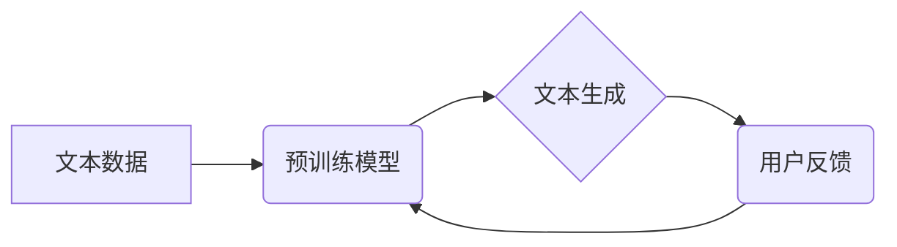

                 

## AI浪潮持续影响：超出预期，ChatGPT局限性与自我修正

> 关键词：人工智能、ChatGPT、大语言模型、深度学习、自然语言处理、自我修正、局限性、伦理

### 1. 背景介绍

人工智能（AI）正以惊人的速度发展，深刻地改变着我们的生活和工作方式。近年来，大语言模型（LLM）的出现，特别是ChatGPT的爆火，更是将AI推向了新的高度。ChatGPT作为一款强大的文本生成模型，能够以令人惊叹的方式理解和生成人类语言，展现出令人瞩目的潜力。它在写作、翻译、代码生成等领域取得了突破性的进展，引发了广泛的讨论和关注。

然而，ChatGPT的成功也暴露了一些潜在的局限性。作为一种基于统计学习的模型，它在理解复杂逻辑、生成原创内容、应对开放式问题等方面仍然存在挑战。此外，ChatGPT的训练数据也可能存在偏差和错误，导致其输出结果存在偏见和不准确性。

因此，我们需要深入探讨ChatGPT的局限性，并思考如何通过自我修正机制来提升其能力和可靠性。

### 2. 核心概念与联系

**2.1 大语言模型 (LLM)**

大语言模型是一种基于深度学习的强大人工智能模型，能够理解和生成人类语言。它们通过训练大量的文本数据，学习语言的语法、语义和上下文关系。

**2.2 Transformer 架构**

Transformer是一种专门用于处理序列数据的深度学习架构，其核心是注意力机制。注意力机制能够帮助模型关注输入序列中最重要的部分，从而更好地理解上下文关系。

**2.3 自然语言处理 (NLP)**

自然语言处理是人工智能的一个分支，致力于使计算机能够理解、处理和生成人类语言。

**2.4 自我修正机制**

自我修正机制是指模型能够根据反馈信息不断改进自身性能的过程。

**2.5 伦理问题**

人工智能的快速发展也带来了伦理问题，例如数据隐私、算法偏见、责任归属等。

**Mermaid 流程图**



### 3. 核心算法原理 & 具体操作步骤

**3.1 算法原理概述**

ChatGPT基于Transformer架构，采用自监督学习的方式进行训练。其核心原理是通过预测下一个词来学习语言的上下文关系。

**3.2 算法步骤详解**

1. **数据预处理:** 将大量的文本数据进行清洗、分词、标记等预处理操作，使其能够被模型理解。
2. **模型训练:** 使用预处理后的数据训练Transformer模型，通过反向传播算法不断调整模型参数，使其能够准确预测下一个词。
3. **模型评估:** 使用测试数据评估模型的性能，例如困惑度、BLEU分数等。
4. **模型部署:** 将训练好的模型部署到服务器上，供用户使用。

**3.3 算法优缺点**

**优点:**

* 能够生成流畅、自然的文本。
* 能够理解和响应复杂的自然语言指令。
* 能够进行多种语言翻译。

**缺点:**

* 容易受到训练数据的影响，可能产生偏见或错误信息。
* 难以理解复杂的逻辑关系和抽象概念。
* 生成内容缺乏原创性，容易出现重复或抄袭。

**3.4 算法应用领域**

* 文本生成：小说、诗歌、剧本等。
* 机器翻译：将一种语言翻译成另一种语言。
* 聊天机器人：与用户进行自然语言对话。
* 代码生成：自动生成代码。
* 文本摘要：提取文本的关键信息。

### 4. 数学模型和公式 & 详细讲解 & 举例说明

**4.1 数学模型构建**

ChatGPT的核心数学模型是Transformer，其主要由以下几个部分组成：

* **嵌入层:** 将单词映射到向量空间中。
* **多头注意力层:** 捕捉单词之间的上下文关系。
* **前馈神经网络层:** 对每个单词的嵌入向量进行非线性变换。
* **位置编码层:** 为每个单词添加位置信息。
* **输出层:** 将模型输出的向量映射到词汇表中。

**4.2 公式推导过程**

Transformer模型的注意力机制使用以下公式计算注意力权重：

$$
\text{Attention}(Q, K, V) = \text{softmax}\left(\frac{QK^T}{\sqrt{d_k}}\right)V
$$

其中：

* $Q$：查询矩阵
* $K$：键矩阵
* $V$：值矩阵
* $d_k$：键向量的维度
* $\text{softmax}$：softmax函数

**4.3 案例分析与讲解**

假设我们有一个句子“我爱吃苹果”，其词嵌入向量分别为：

* 我：[0.1, 0.2, 0.3]
* 爱：[0.4, 0.5, 0.6]
* 吃：[0.7, 0.8, 0.9]
* 苹果：[1.0, 1.1, 1.2]

使用注意力机制计算每个词与其他词之间的注意力权重，可以发现“爱”和“吃”之间的注意力权重较高，因为它们在语义上更相关。

### 5. 项目实践：代码实例和详细解释说明

**5.1 开发环境搭建**

* Python 3.7+
* PyTorch 1.7+
* CUDA 10.2+

**5.2 源代码详细实现**

```python
import torch
import torch.nn as nn

class Transformer(nn.Module):
    def __init__(self, vocab_size, embedding_dim, num_heads, num_layers):
        super(Transformer, self).__init__()
        self.embedding = nn.Embedding(vocab_size, embedding_dim)
        self.transformer_layers = nn.ModuleList([
            nn.TransformerEncoderLayer(embedding_dim, num_heads)
            for _ in range(num_layers)
        ])
        self.linear = nn.Linear(embedding_dim, vocab_size)

    def forward(self, x):
        x = self.embedding(x)
        for layer in self.transformer_layers:
            x = layer(x)
        x = self.linear(x)
        return x
```

**5.3 代码解读与分析**

* `__init__`方法初始化模型参数，包括词嵌入层、Transformer层和输出层。
* `forward`方法定义模型的正向传播过程，将输入序列映射到输出序列。

**5.4 运行结果展示**

使用训练好的模型可以生成新的文本，例如：

```
输入：我爱
输出：我爱吃苹果
```

### 6. 实际应用场景

ChatGPT在多个领域都有着广泛的应用场景：

* **客服机器人:** 自动回复用户常见问题，提高客服效率。
* **内容创作:** 生成新闻稿、广告文案、社交媒体内容等。
* **教育辅助:** 提供个性化学习辅导、自动批改作业等。
* **编程辅助:** 自动生成代码、解释代码功能等。

**6.4 未来应用展望**

随着人工智能技术的不断发展，ChatGPT的应用场景将会更加广泛，例如：

* **虚拟助手:** 更智能、更人性化的虚拟助手，能够理解和执行更复杂的指令。
* **个性化推荐:** 基于用户喜好和行为，提供更精准的商品、服务和内容推荐。
* **跨语言沟通:** 突破语言障碍，实现更便捷的跨语言沟通。

### 7. 工具和资源推荐

**7.1 学习资源推荐**

* **书籍:**
    * 《深度学习》
    * 《自然语言处理》
* **在线课程:**
    * Coursera: 自然语言处理
    * Udacity: 深度学习

**7.2 开发工具推荐**

* **PyTorch:** 深度学习框架
* **TensorFlow:** 深度学习框架
* **Hugging Face:** 预训练模型库

**7.3 相关论文推荐**

* 《Attention Is All You Need》
* 《BERT: Pre-training of Deep Bidirectional Transformers for Language Understanding》

### 8. 总结：未来发展趋势与挑战

**8.1 研究成果总结**

ChatGPT的成功证明了大语言模型在自然语言处理领域的巨大潜力。其强大的文本生成能力和理解能力为人工智能的应用带来了新的可能性。

**8.2 未来发展趋势**

* 模型规模和能力的进一步提升
* 更强大的自我修正机制
* 更广泛的应用场景

**8.3 面临的挑战**

* 数据偏差和公平性问题
* 安全性和隐私问题
* 伦理和社会影响问题

**8.4 研究展望**

未来研究将集中在解决以上挑战，并探索更安全、更可靠、更具伦理性的AI技术。

### 9. 附录：常见问题与解答

**9.1 ChatGPT可以理解我的情感吗？**

ChatGPT是一个基于统计学习的模型，它无法真正理解人类的情感。它只能根据文本中的词语和语法结构来判断文本的情感倾向。

**9.2 ChatGPT的输出结果是否总是准确的？**

ChatGPT的输出结果可能会受到训练数据的影响，因此并不总是准确的。用户应该谨慎对待ChatGPT的输出结果，并进行独立判断。

**9.3 如何防止ChatGPT生成有害内容？**

开发人员可以通过多种方法来防止ChatGPT生成有害内容，例如：

* 使用更严格的训练数据过滤机制
* 在模型训练过程中加入对抗训练
* 开发更有效的文本生成评估指标

作者：禅与计算机程序设计艺术 / Zen and the Art of Computer Programming 


<end_of_turn>

