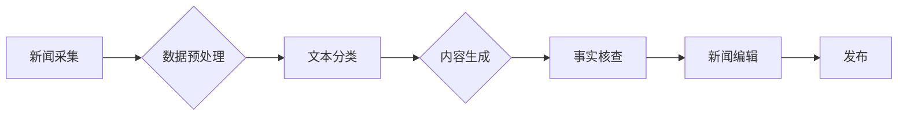

                 

## AI辅助新闻写作：提高效率与准确性

> 关键词：人工智能、新闻写作、自然语言处理、机器学习、深度学习、文本生成、事实核查、新闻自动化

## 1. 背景介绍

新闻行业正处于数字化转型时期，传统新闻制作模式面临着效率低下、信息爆炸、假新闻泛滥等挑战。人工智能（AI）技术作为新兴技术，为新闻写作带来了新的机遇。AI辅助新闻写作是指利用人工智能技术辅助新闻记者进行新闻采集、整理、撰写、编辑等工作，提高新闻制作效率，提升新闻质量。

近年来，随着深度学习技术的快速发展，AI在自然语言处理（NLP）领域的应用取得了突破性进展。例如，BERT、GPT-3等模型在文本生成、机器翻译、问答系统等方面展现出强大的能力，为AI辅助新闻写作提供了技术基础。

## 2. 核心概念与联系

**2.1 核心概念**

* **自然语言处理（NLP）：** 计算机理解、处理和生成人类语言的技术。
* **机器学习（ML）：** 计算机通过学习数据，自动发现模式并进行预测的技术。
* **深度学习（DL）：** 基于多层神经网络的机器学习方法，能够学习更复杂的模式。
* **文本生成：** 利用机器学习模型生成新的文本内容。
* **事实核查：** 通过多种手段验证新闻信息的真实性。

**2.2 架构图**



**2.3 联系**

AI辅助新闻写作系统通常由以下几个模块组成：

* **新闻采集：** 从互联网、数据库等渠道获取新闻数据。
* **数据预处理：** 对获取到的新闻数据进行清洗、格式化、标记等处理，使其能够被机器学习模型理解。
* **文本分类：** 利用机器学习模型对新闻内容进行分类，例如新闻类型、主题、情感等。
* **内容生成：** 根据新闻分类结果，利用文本生成模型生成新闻稿件。
* **事实核查：** 对生成的新闻稿件进行事实核查，确保其真实性。
* **新闻编辑：** 对经过事实核查的新闻稿件进行编辑、校对，使其更加完善。
* **发布：** 将最终编辑完成的新闻稿件发布到线上平台。

## 3. 核心算法原理 & 具体操作步骤

**3.1 算法原理概述**

AI辅助新闻写作的核心算法主要包括：

* **文本分类算法：** 常用算法包括支持向量机（SVM）、朴素贝叶斯（NB）、随机森林（RF）等。
* **文本生成算法：** 常用算法包括循环神经网络（RNN）、长短期记忆网络（LSTM）、生成对抗网络（GAN）等。
* **事实核查算法：** 常用算法包括知识图谱匹配、文本相似度计算、反向链接分析等。

**3.2 算法步骤详解**

**3.2.1 文本分类算法**

1. **数据收集和预处理：** 收集新闻数据，并进行清洗、格式化、标记等预处理。
2. **特征提取：** 从新闻文本中提取特征，例如词频、词向量、语法结构等。
3. **模型训练：** 利用训练数据训练文本分类模型。
4. **模型评估：** 使用测试数据评估模型的性能，例如准确率、召回率、F1-score等。
5. **模型部署：** 将训练好的模型部署到生产环境中，用于对新新闻进行分类。

**3.2.2 文本生成算法**

1. **数据收集和预处理：** 收集新闻数据，并进行清洗、格式化、标记等预处理。
2. **模型训练：** 利用训练数据训练文本生成模型。
3. **文本生成：** 根据新闻分类结果和模型训练参数，生成新的新闻文本。
4. **文本评估：** 使用人工评估或自动评估指标评估生成的文本质量，例如流畅度、准确性、相关性等。
5. **模型优化：** 根据评估结果，对模型参数进行调整，优化文本生成效果。

**3.2.3 事实核查算法**

1. **知识图谱构建：** 建立新闻相关的知识图谱，包含实体、关系、事件等信息。
2. **文本匹配：** 将生成的新闻文本与知识图谱进行匹配，识别其中的实体和关系。
3. **反向链接分析：** 通过分析新闻文本中实体的链接关系，验证其真实性。
4. **文本相似度计算：** 将生成的新闻文本与已知真实新闻进行比较，计算其相似度。
5. **事实验证：** 根据匹配结果、反向链接分析和文本相似度计算，判断新闻信息的真实性。

**3.3 算法优缺点**

**3.3.1 文本分类算法**

* **优点：** 算法成熟，性能稳定，能够对新闻内容进行快速分类。
* **缺点：** 对新闻内容的理解能力有限，难以处理复杂、多义的文本。

**3.3.2 文本生成算法**

* **优点：** 可以生成流畅、自然的新闻文本，提高新闻写作效率。
* **缺点：** 生成的文本可能缺乏深度和原创性，容易出现逻辑错误或事实错误。

**3.3.3 事实核查算法**

* **优点：** 可以有效地识别和过滤虚假新闻，提高新闻的真实性。
* **缺点：** 知识图谱的构建和维护需要大量人力和时间，算法的准确性还存在一定局限性。

**3.4 算法应用领域**

AI辅助新闻写作算法在新闻行业、教育行业、营销行业等领域都有广泛的应用。

* **新闻行业：** 自动生成新闻稿件、进行新闻分类和主题提取、辅助新闻编辑工作。
* **教育行业：** 自动生成学习材料、辅助学生写作、提供个性化学习建议。
* **营销行业：** 自动生成营销文案、进行客户画像分析、辅助营销策略制定。

## 4. 数学模型和公式 & 详细讲解 & 举例说明

**4.1 数学模型构建**

文本分类算法通常使用概率模型来表示文本类别之间的关系。例如，朴素贝叶斯分类器假设每个特征独立地对类别有影响，可以使用贝叶斯公式计算每个类别出现的概率。

**4.2 公式推导过程**

假设我们有一个文本分类任务，需要将文本分类为两类：体育新闻和财经新闻。

* **事件：** 文本属于体育新闻或财经新闻。
* **特征：** 文本中出现的词语。

朴素贝叶斯分类器的核心公式为：

$$P(C|X) = \frac{P(X|C)P(C)}{P(X)}$$

其中：

* $P(C|X)$ 是文本 $X$ 属于类别 $C$ 的概率。
* $P(X|C)$ 是类别 $C$ 下文本 $X$ 出现的概率。
* $P(C)$ 是类别 $C$ 出现的概率。
* $P(X)$ 是文本 $X$ 出现的概率。

**4.3 案例分析与讲解**

假设我们有一个文本：“中国男足战胜韩国队”。

* $P(体育|文本)$ 是文本属于体育新闻的概率。
* $P(文本|体育)$ 是体育新闻下文本出现的概率。
* $P(体育)$ 是体育新闻出现的概率。
* $P(文本)$ 是文本出现的概率。

我们可以根据训练数据计算以上概率，然后使用贝叶斯公式计算 $P(体育|文本)$ 的值。如果 $P(体育|文本)$ 大于 $P(财经|文本)$，则将文本分类为体育新闻。

## 5. 项目实践：代码实例和详细解释说明

**5.1 开发环境搭建**

* 操作系统：Ubuntu 20.04
* Python 版本：3.8
* 必要的库：TensorFlow、PyTorch、NLTK、spaCy等

**5.2 源代码详细实现**

```python
# 文本分类示例代码（使用朴素贝叶斯算法）

from sklearn.naive_bayes import MultinomialNB
from sklearn.feature_extraction.text import TfidfVectorizer

# 训练数据
train_texts = [
    "中国男足战胜韩国队",
    "苹果发布新款iPhone",
    "中国股市上涨",
    "中国女排夺冠",
    "美联储宣布加息"
]
train_labels = ["体育", "财经", "财经", "体育", "财经"]

# 文本向量化
vectorizer = TfidfVectorizer()
train_features = vectorizer.fit_transform(train_texts)

# 训练模型
model = MultinomialNB()
model.fit(train_features, train_labels)

# 测试数据
test_text = "中国女排获得奥运金牌"

# 文本向量化
test_features = vectorizer.transform([test_text])

# 预测类别
predicted_label = model.predict(test_features)[0]

# 输出结果
print(f"文本 '{test_text}' 属于类别：{predicted_label}")
```

**5.3 代码解读与分析**

* 该代码示例使用朴素贝叶斯算法进行文本分类。
* 首先，使用 `TfidfVectorizer` 将文本转换为词频-逆文档频率（TF-IDF）向量。
* 然后，使用 `MultinomialNB` 训练模型。
* 最后，使用训练好的模型对测试文本进行预测。

**5.4 运行结果展示**

```
文本 '中国女排获得奥运金牌' 属于类别：体育
```

## 6. 实际应用场景

**6.1 新闻自动生成**

AI可以自动生成简单的新闻稿件，例如体育比赛结果、股市走势等。

**6.2 新闻主题提取**

AI可以自动提取新闻稿件的主要主题，方便新闻编辑进行分类和排序。

**6.3 新闻事实核查**

AI可以辅助新闻编辑进行事实核查，识别虚假新闻和谣言。

**6.4 个性化新闻推荐**

AI可以根据用户的阅读偏好，推荐个性化的新闻内容。

**6.5 未来应用展望**

未来，AI辅助新闻写作将更加智能化、个性化和自动化。例如，AI可以生成更长、更复杂的新闻稿件，甚至可以进行深度分析和评论。

## 7. 工具和资源推荐

**7.1 学习资源推荐**

* **书籍：**
    * 《深度学习》
    * 《自然语言处理》
    * 《机器学习实战》
* **在线课程：**
    * Coursera
    * edX
    * Udacity

**7.2 开发工具推荐**

* **TensorFlow:** 开源深度学习框架
* **PyTorch:** 开源深度学习框架
* **NLTK:** 自然语言处理工具包
* **spaCy:** 自然语言处理库

**7.3 相关论文推荐**

* **BERT: Pre-training of Deep Bidirectional Transformers for Language Understanding**
* **GPT-3: Language Models are Few-Shot Learners**
* **Attention Is All You Need**

## 8. 总结：未来发展趋势与挑战

**8.1 研究成果总结**

AI辅助新闻写作技术取得了显著进展，能够有效提高新闻写作效率和质量。

**8.2 未来发展趋势**

* **更智能的文本生成:** AI能够生成更长、更复杂的新闻稿件，甚至可以进行深度分析和评论。
* **更精准的事实核查:** AI能够更准确地识别虚假新闻和谣言。
* **更个性化的新闻推荐:** AI能够根据用户的阅读偏好，推荐个性化的新闻内容。

**8.3 面临的挑战**

* **数据质量:** AI模型的性能依赖于高质量的数据，而新闻数据往往存在噪声和偏差。
* **伦理问题:** AI辅助新闻写作可能会带来伦理问题，例如算法偏见、信息操控等。
* **技术瓶颈:** 现有的AI技术还无法完全替代人类新闻记者，需要进一步突破技术瓶颈。

**8.4 研究展望**

未来，AI辅助新闻写作的研究将更加注重数据质量、算法公平性和伦理问题，努力构建更加智能、可靠、可信赖的新闻写作系统。

## 9. 附录：常见问题与解答

**9.1 AI辅助新闻写作会取代新闻记者吗？**

AI辅助新闻写作可以提高新闻写作效率，但它并不会完全取代新闻记者。新闻记者需要具备批判性思维、逻辑推理和人际沟通能力，这些能力是AI难以替代的。

**9.2 AI辅助新闻写作的伦理问题有哪些？**

AI辅助新闻写作可能会带来以下伦理问题：

* **算法偏见:** AI模型的训练数据可能存在偏见，导致生成的新闻内容也存在偏见。
* **信息操控:** AI可以被用于生成虚假新闻和谣言，从而操控公众舆论。
* **隐私泄露:** AI辅助新闻写作可能会收集和使用用户的个人信息，需要妥善保护用户的隐私。

**9.3 如何解决AI辅助新闻写作的伦理问题？**

解决AI辅助新闻写作的伦理问题需要多方面的努力：

* **数据治理:** 确保训练数据的质量和公平性。
* **算法透明度:** 使AI模型的决策过程更加透明可解释。
* **伦理规范:** 制定相关的伦理规范和法律法规，规范AI辅助新闻写作的应用。


作者：禅与计算机程序设计艺术 / Zen and the Art of Computer Programming<end_of_turn>

