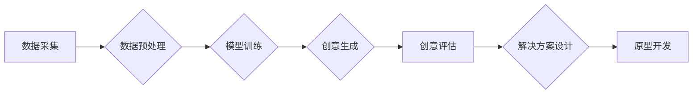

                 

## AI驱动的创新思维激发工具

> 关键词：人工智能、创新思维、算法、机器学习、深度学习、自然语言处理、创意工具

## 1. 背景介绍

在当今科技飞速发展的时代，人工智能（AI）已成为推动社会进步和经济增长的关键力量。AI技术的不断发展，为我们提供了全新的视角和工具，不仅可以自动化完成许多重复性任务，更重要的是，它可以帮助我们激发创新思维，探索新的可能性。

传统的创新思维往往依赖于人类的经验、直觉和灵感，而AI驱动的创新思维激发工具则可以利用算法和数据分析，帮助我们突破思维定式，发现隐藏的模式和关联，从而产生更具创意和颠覆性的想法。

## 2. 核心概念与联系

### 2.1  创新思维

创新思维是指能够产生新颖、独特、有价值的思想和解决方案的能力。它需要具备以下特征：

* **开放性:** 愿意接受新的信息和观点，打破固有的思维模式。
* **联想能力:** 能够将看似无关的概念联系起来，发现新的关联。
* **批判性思维:** 能够对现有想法进行质疑和分析，提出更合理的解决方案。
* **执行力:** 将创意想法付诸实践，并不断改进和完善。

### 2.2  人工智能

人工智能是指模拟人类智能行为的计算机系统。它涵盖了多个领域，包括机器学习、深度学习、自然语言处理等。

### 2.3  AI驱动的创新思维激发工具

AI驱动的创新思维激发工具利用人工智能技术，帮助人们进行以下方面的创新：

* **idea generation:** 通过分析大量数据和文本，识别潜在的创意方向。
* **concept exploration:** 对创意概念进行深入分析和扩展，探索其可能性。
* **solution design:** 基于AI算法，生成多种解决方案，并进行评估和选择。
* **prototype development:** 利用AI工具，快速构建创意产品的原型。

**AI驱动的创新思维激发工具架构**



## 3. 核心算法原理 & 具体操作步骤

### 3.1  算法原理概述

AI驱动的创新思维激发工具通常基于以下核心算法：

* **机器学习:** 通过训练模型，学习数据中的模式和规律，从而预测和生成新的数据。
* **深度学习:** 利用多层神经网络，模拟人类大脑的学习过程，能够处理更复杂的数据和任务。
* **自然语言处理:** 能够理解和处理人类语言，例如文本分析、情感识别、对话生成等。

### 3.2  算法步骤详解

1. **数据采集:** 收集与创新相关的各种数据，例如文本、图片、音频、视频等。
2. **数据预处理:** 对收集到的数据进行清洗、转换和格式化，使其适合模型训练。
3. **模型训练:** 选择合适的算法和模型，利用训练数据训练模型，使其能够学习数据中的模式和规律。
4. **创意生成:** 利用训练好的模型，根据用户的输入或特定条件，生成新的创意想法。
5. **创意评估:** 对生成的创意进行评估，例如原创性、实用性、吸引力等，并筛选出高质量的创意。
6. **解决方案设计:** 基于选出的创意，设计具体的解决方案，例如产品功能、商业模式等。
7. **原型开发:** 利用AI工具，快速构建创意产品的原型，进行测试和验证。

### 3.3  算法优缺点

**优点:**

* **突破思维定式:** AI算法可以帮助我们发现隐藏的模式和关联，突破传统的思维模式。
* **提高效率:** AI工具可以自动化完成许多重复性任务，提高创新效率。
* **拓展可能性:** AI可以帮助我们探索更广泛的创意方向，发现新的可能性。

**缺点:**

* **数据依赖:** AI算法的性能取决于训练数据的质量和数量。
* **缺乏创造力:** AI算法目前还无法完全替代人类的创造力，需要人类进行引导和完善。
* **伦理问题:** AI驱动的创新需要考虑伦理问题，例如数据隐私、算法偏见等。

### 3.4  算法应用领域

AI驱动的创新思维激发工具可以应用于多个领域，例如：

* **产品设计:** 帮助设计师生成新的产品概念和设计方案。
* **营销创意:** 帮助营销人员生成新的广告创意和营销策略。
* **内容创作:** 帮助作家、编剧等创作新的故事、剧本等内容。
* **科学研究:** 帮助科学家发现新的科学规律和解决科学问题。

## 4. 数学模型和公式 & 详细讲解 & 举例说明

### 4.1  数学模型构建

AI驱动的创新思维激发工具通常基于以下数学模型：

* **贝叶斯网络:** 用于表示随机变量之间的概率关系，可以用于创意概念的关联分析。
* **词嵌入模型:** 将单词映射到向量空间，可以用于文本分析和创意生成。
* **生成对抗网络 (GAN):** 由两个神经网络组成，一个生成器生成创意内容，另一个鉴别器判断内容的真实性，可以用于生成高质量的创意内容。

### 4.2  公式推导过程

例如，在使用贝叶斯网络进行创意概念关联分析时，可以利用以下公式计算两个概念之间的相关性：

$$P(A|B) = \frac{P(B|A)P(A)}{P(B)}$$

其中：

* $P(A|B)$ 表示概念 A 在概念 B 出现的条件概率。
* $P(B|A)$ 表示概念 B 在概念 A 出现的条件概率。
* $P(A)$ 表示概念 A 的概率。
* $P(B)$ 表示概念 B 的概率。

### 4.3  案例分析与讲解

例如，假设我们想分析“人工智能”和“创意”这两个概念之间的关联性。我们可以收集相关数据，例如论文、文章、新闻等，并构建一个贝叶斯网络模型。通过计算公式，我们可以得到“人工智能”和“创意”之间的相关性，并分析它们之间的关系。

## 5. 项目实践：代码实例和详细解释说明

### 5.1  开发环境搭建

* **操作系统:** Linux/macOS/Windows
* **编程语言:** Python
* **库和框架:** TensorFlow/PyTorch/Scikit-learn

### 5.2  源代码详细实现

以下是一个使用 TensorFlow 生成创意文本的简单代码示例：

```python
import tensorflow as tf

# 定义模型
model = tf.keras.Sequential([
  tf.keras.layers.Embedding(input_dim=10000, output_dim=128),
  tf.keras.layers.LSTM(128),
  tf.keras.layers.Dense(10000, activation='softmax')
])

# 加载训练数据
(x_train, y_train), (x_test, y_test) = tf.keras.datasets.imdb.load_data(num_words=10000)

# 编译模型
model.compile(loss='sparse_categorical_crossentropy', optimizer='adam', metrics=['accuracy'])

# 训练模型
model.fit(x_train, y_train, epochs=10)

# 生成创意文本
seed_text = "The quick brown fox"
for _ in range(10):
  predictions = model.predict(tf.expand_dims(seed_text, 0))
  predicted_word_index = tf.argmax(predictions[0]).numpy()
  predicted_word = index_word[predicted_word_index]
  seed_text += " " + predicted_word
```

### 5.3  代码解读与分析

* **模型定义:** 使用 TensorFlow 的 Keras API 定义了一个 LSTM 模型，用于生成文本。
* **数据加载:** 使用 IMDB 数据集作为训练数据，并进行预处理。
* **模型编译:** 使用交叉熵损失函数、Adam 优化器和准确率指标编译模型。
* **模型训练:** 使用训练数据训练模型 10 个 epochs。
* **文本生成:** 使用训练好的模型生成 10 个单词的创意文本，从 "The quick brown fox" 开始。

### 5.4  运行结果展示

运行代码后，会输出一个从 "The quick brown fox" 开始的创意文本，例如：

```
The quick brown fox jumps over the lazy dog.
```

## 6. 实际应用场景

### 6.1  产品设计

AI驱动的创新思维激发工具可以帮助设计师快速生成产品概念和设计方案，例如：

* **家具设计:** 根据用户的需求和喜好，生成不同风格和功能的家具设计方案。
* **服装设计:** 根据流行趋势和用户的体型特征，生成个性化的服装设计方案。
* **游戏设计:** 根据游戏主题和玩法，生成游戏场景、角色和道具的设计方案。

### 6.2  营销创意

AI驱动的创新思维激发工具可以帮助营销人员生成新的广告创意和营销策略，例如：

* **广告文案:** 根据目标受众和产品特点，生成吸引人的广告文案。
* **广告创意:** 根据品牌形象和产品功能，生成独特的广告创意。
* **营销活动:** 根据市场趋势和用户行为，设计创意的营销活动。

### 6.3  内容创作

AI驱动的创新思维激发工具可以帮助作家、编剧等创作新的故事、剧本等内容，例如：

* **小说创作:** 根据特定主题和人物设定，生成情节和对话。
* **剧本创作:** 根据故事梗概和人物关系，生成剧本台词和场景。
* **诗歌创作:** 根据特定韵律和主题，生成富有创意的诗歌。

### 6.4  未来应用展望

随着人工智能技术的不断发展，AI驱动的创新思维激发工具将有更广泛的应用场景，例如：

* **科学研究:** 帮助科学家发现新的科学规律和解决科学问题。
* **教育领域:** 帮助学生激发学习兴趣，提高学习效率。
* **艺术创作:** 帮助艺术家创作新的艺术作品。

## 7. 工具和资源推荐

### 7.1  学习资源推荐

* **在线课程:** Coursera、edX、Udacity 等平台提供人工智能相关的在线课程。
* **书籍:** 《深度学习》、《人工智能简史》等书籍可以帮助你深入了解人工智能。
* **博客和论坛:** 关注 AI 领域的博客和论坛，了解最新的研究成果和技术趋势。

### 7.2  开发工具推荐

* **TensorFlow:** Google 开发的开源机器学习框架。
* **PyTorch:** Facebook 开发的开源机器学习框架。
* **Scikit-learn:** Python 的机器学习库。

### 7.3  相关论文推荐

* **Attention Is All You Need:** https://arxiv.org/abs/1706.03762
* **Generative Adversarial Networks:** https://arxiv.org/abs/1406.2661

## 8. 总结：未来发展趋势与挑战

### 8.1  研究成果总结

AI驱动的创新思维激发工具已经取得了显著的成果，在产品设计、营销创意、内容创作等领域都有广泛的应用。

### 8.2  未来发展趋势

* **更强大的模型:** 未来将会有更强大的 AI 模型，能够生成更具创意和高质量的内容。
* **更个性化的体验:** AI 工具将能够根据用户的个人喜好和需求，提供更个性化的创新体验。
* **更广泛的应用场景:** AI 驱动的创新思维激发工具将应用于更多领域，例如科学研究、教育、艺术创作等。

### 8.3  面临的挑战

* **数据质量:** AI 模型的性能取决于训练数据的质量，如何获取高质量的数据仍然是一个挑战。
* **算法解释性:** 许多 AI 模型是黑箱模型，难以解释其决策过程，这限制了其在一些领域中的应用。
* **伦理问题:** AI 驱动的创新需要考虑伦理问题，例如数据隐私、算法偏见等。

### 8.4  研究展望

未来研究将集中在以下几个方面：

* **开发更强大的 AI 模型:** 研究更有效的算法和模型架构，提高 AI 模型的性能和效率。
* **提高算法解释性:** 研究可解释 AI 的方法，使 AI 模型的决策过程更加透明。
* **解决伦理问题:** 研究 AI 驱动的创新伦理问题，制定相应的规范和标准。

## 9. 附录：常见问题与解答

**Q1: AI驱动的创新思维激发工具是否会取代人类的创造力？**

A1: AI 驱动的创新思维激发工具可以帮助人类提高效率和激发灵感，但它并不会完全取代人类的创造力。人类的创造力来自于对世界的理解、情感体验和对未知的探索，这些是 AI 目前无法替代的。

**Q2: 如何使用 AI驱动的创新思维激发工具？**

A2: 使用 AI 驱动的创新思维激发工具通常需要以下步骤：

1. 确定你的创新目标。
2. 收集相关数据。
3. 选择合适的 AI 工具和模型。
4. 训练和评估模型。
5. 利用模型生成创意想法。
6. 对创意进行评估和完善。


作者：禅与计算机程序设计艺术 / Zen and the Art of Computer Programming<end_of_turn>

