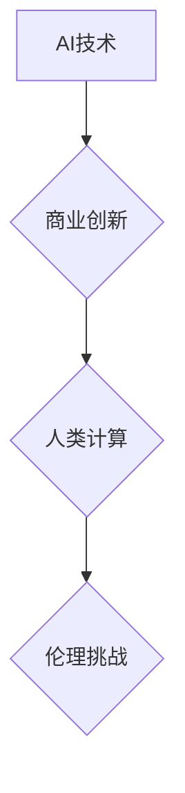

                 

## AI驱动的创新：人类计算在商业中的道德考虑因素挑战

> 关键词：人工智能、商业伦理、人类计算、算法偏见、数据隐私、透明度、可解释性、责任

### 1. 背景介绍

人工智能（AI）正以惊人的速度发展，深刻地改变着我们生活的方方面面。从自动驾驶汽车到个性化医疗，AI技术正在推动着前所未有的创新。在商业领域，AI也展现出巨大的潜力，可以提高效率、降低成本、创造新的商业模式。然而，随着AI技术的应用日益广泛，一些道德问题也逐渐浮出水面。

人类计算，即人类与计算机协同工作，在AI驱动的商业创新中扮演着至关重要的角色。人类的智慧、创造力和判断力可以弥补AI技术的局限性，而AI技术的强大计算能力和数据处理能力则可以帮助人类更高效地完成工作。然而，这种协同关系也带来了新的伦理挑战。

### 2. 核心概念与联系

**2.1 人工智能（AI）**

人工智能是指模拟人类智能行为的计算机系统。AI技术涵盖了多个领域，包括机器学习、深度学习、自然语言处理和计算机视觉等。

**2.2 商业伦理**

商业伦理是指企业在经营活动中遵循的道德准则和价值观。它涉及到诚信、公平、责任、透明度等方面。

**2.3 人类计算**

人类计算是指人类与计算机协同工作，利用各自的优势来完成复杂的任务。

**2.4 核心概念联系**

AI驱动的商业创新依赖于人类计算，而人类计算也面临着新的伦理挑战。



**2.5 伦理挑战**

AI驱动的商业创新带来的伦理挑战包括：

* **算法偏见:** AI算法的训练数据可能包含偏见，导致算法产生不公平的结果。
* **数据隐私:** AI技术需要大量的数据进行训练，这可能会侵犯用户的隐私。
* **透明度和可解释性:** 许多AI算法是“黑箱”模型，其决策过程难以理解，这可能会导致缺乏信任和责任。
* **责任归属:** 当AI系统导致负面后果时，责任应该归咎于谁？

### 3. 核心算法原理 & 具体操作步骤

**3.1 算法原理概述**

机器学习算法是AI技术的重要组成部分，它可以从数据中学习模式并做出预测。常见的机器学习算法包括：

* **监督学习:** 利用标记数据训练模型，预测新的数据标签。
* **无监督学习:** 从未标记数据中发现模式和结构。
* **强化学习:** 通过试错学习，最大化奖励。

**3.2 算法步骤详解**

以监督学习为例，其基本步骤如下：

1. **数据收集和预处理:** 收集相关数据并进行清洗、转换和特征工程。
2. **模型选择:** 根据任务需求选择合适的机器学习算法。
3. **模型训练:** 利用标记数据训练模型，调整模型参数。
4. **模型评估:** 使用测试数据评估模型性能，并进行调优。
5. **模型部署:** 将训练好的模型部署到实际应用场景中。

**3.3 算法优缺点**

**优点:**

* 自动化学习：无需人工编程，算法可以自动从数据中学习。
* 适应性强：可以适应不断变化的数据和环境。
* 预测能力强：可以对未来趋势进行预测。

**缺点:**

* 数据依赖：算法性能依赖于训练数据的质量和数量。
* 算法解释性差：许多算法是“黑箱”模型，其决策过程难以理解。
* 偏见问题：算法可能继承训练数据中的偏见。

**3.4 算法应用领域**

机器学习算法广泛应用于各个领域，例如：

* **图像识别:** 人脸识别、物体检测、图像分类。
* **自然语言处理:** 机器翻译、文本摘要、情感分析。
* **推荐系统:** 产品推荐、内容推荐、个性化服务。
* **金融领域:** 欺诈检测、风险评估、投资预测。

### 4. 数学模型和公式 & 详细讲解 & 举例说明

**4.1 数学模型构建**

机器学习算法通常基于数学模型，例如线性回归、逻辑回归、支持向量机等。这些模型可以将输入数据映射到输出结果。

**4.2 公式推导过程**

例如，线性回归模型的目标是找到一条直线，将输入特征与输出标签进行拟合。其数学公式如下：

$$y = w_0 + w_1x_1 + w_2x_2 + ... + w_nx_n$$

其中：

* $y$ 是输出标签
* $w_0, w_1, w_2, ..., w_n$ 是模型参数
* $x_1, x_2, ..., x_n$ 是输入特征

模型参数可以通过最小化损失函数来求解。

**4.3 案例分析与讲解**

假设我们有一个数据集，包含房屋面积和房屋价格的信息。我们可以使用线性回归模型来预测房屋价格。

* 输入特征：房屋面积
* 输出标签：房屋价格

通过训练模型，我们可以得到一条直线方程，例如：

$$价格 = 5000 + 100 * 面积$$

这个方程可以用来预测新房屋的价格，只要我们知道其面积。

### 5. 项目实践：代码实例和详细解释说明

**5.1 开发环境搭建**

可以使用Python语言和相关的机器学习库，例如Scikit-learn，来实现机器学习项目。

**5.2 源代码详细实现**

```python
from sklearn.linear_model import LinearRegression
from sklearn.model_selection import train_test_split
import pandas as pd

# 加载数据
data = pd.read_csv('house_data.csv')

# 分割数据
X = data[['面积']]
y = data['价格']
X_train, X_test, y_train, y_test = train_test_split(X, y, test_size=0.2)

# 创建模型
model = LinearRegression()

# 训练模型
model.fit(X_train, y_train)

# 预测结果
y_pred = model.predict(X_test)

# 评估模型性能
print('模型性能:', model.score(X_test, y_test))
```

**5.3 代码解读与分析**

这段代码首先加载数据，然后将数据分割成训练集和测试集。接着，创建线性回归模型并训练模型。最后，使用训练好的模型预测测试集的结果，并评估模型性能。

**5.4 运行结果展示**

运行代码后，会输出模型的性能指标，例如R-squared值。R-squared值表示模型对数据的拟合程度，值越高表示模型拟合越好。

### 6. 实际应用场景

AI驱动的商业创新在各个领域都有着广泛的应用场景，例如：

* **个性化营销:** 利用AI技术分析用户的行为数据，提供个性化的产品推荐和广告投放。
* **客户服务:** 利用AI技术开发智能客服机器人，自动回答客户常见问题，提高服务效率。
* **风险管理:** 利用AI技术分析金融数据，识别潜在的风险，降低损失。
* **供应链优化:** 利用AI技术预测需求变化，优化库存管理和物流配送。

**6.4 未来应用展望**

随着AI技术的不断发展，未来AI驱动的商业创新将更加广泛和深入，例如：

* **更智能的自动化:** AI技术将进一步提高自动化程度，解放人力，提高效率。
* **更精准的预测:** AI技术将能够更加精准地预测未来趋势，帮助企业做出更明智的决策。
* **更个性化的体验:** AI技术将能够提供更加个性化的产品和服务，满足用户的个性化需求。

### 7. 工具和资源推荐

**7.1 学习资源推荐**

* **在线课程:** Coursera、edX、Udacity等平台提供丰富的AI课程。
* **书籍:** 《深度学习》、《机器学习实战》等书籍是学习AI技术的经典教材。
* **开源项目:** TensorFlow、PyTorch等开源项目提供了丰富的学习资源和实践案例。

**7.2 开发工具推荐**

* **Python:** Python是AI开发最常用的编程语言。
* **Scikit-learn:** Scikit-learn是Python最流行的机器学习库。
* **TensorFlow:** TensorFlow是Google开发的开源深度学习框架。
* **PyTorch:** PyTorch是Facebook开发的开源深度学习框架。

**7.3 相关论文推荐**

* **《ImageNet Classification with Deep Convolutional Neural Networks》**
* **《Attention Is All You Need》**
* **《BERT: Pre-training of Deep Bidirectional Transformers for Language Understanding》**

### 8. 总结：未来发展趋势与挑战

**8.1 研究成果总结**

近年来，AI技术取得了长足的进步，在各个领域都展现出巨大的潜力。

**8.2 未来发展趋势**

未来AI技术将朝着更加智能、更加通用、更加安全的方向发展。

* **更智能的AI:** AI技术将更加智能，能够更好地理解和响应人类的需求。
* **更通用的AI:** AI技术将更加通用，能够应用于更多领域。
* **更安全的AI:** AI技术将更加安全，能够更好地保护用户隐私和数据安全。

**8.3 面临的挑战**

AI技术的发展也面临着一些挑战，例如：

* **算法偏见:** 算法可能继承训练数据中的偏见，导致不公平的结果。
* **数据隐私:** AI技术需要大量的数据进行训练，这可能会侵犯用户的隐私。
* **透明度和可解释性:** 许多AI算法是“黑箱”模型，其决策过程难以理解，这可能会导致缺乏信任和责任。
* **伦理问题:** AI技术的应用可能会带来一些伦理问题，例如工作岗位的替代、人工智能的控制权等。

**8.4 研究展望**

未来需要加强对AI技术的伦理研究，制定相应的规范和政策，确保AI技术安全、可控、可持续地发展。

### 9. 附录：常见问题与解答

**9.1 如何解决算法偏见问题？**

* 使用更加多样化的训练数据。
* 开发算法去偏见的方法。
* 对算法进行定期评估和监控。

**9.2 如何保护用户数据隐私？**

* 采用数据加密技术保护用户数据。
* 明确用户数据的使用目的和范围。
* 获得用户的知情同意。

**9.3 如何提高算法的透明度和可解释性？**

* 使用更加可解释的算法模型。
* 开发算法解释工具。
* 对算法决策过程进行可视化展示。


作者：禅与计算机程序设计艺术 / Zen and the Art of Computer Programming 
<end_of_turn>

