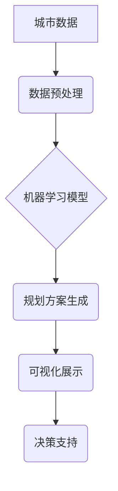

                 

## AI驱动的智能城市规划工具

> 关键词：人工智能、城市规划、机器学习、优化算法、数据分析、可视化、智能交通、可持续发展

## 1. 背景介绍

随着全球人口的快速增长和城市化的进程不断加速，城市面临着日益严峻的挑战，包括交通拥堵、环境污染、资源短缺等。传统城市规划方法往往难以有效应对这些复杂问题，需要更智能、更高效的解决方案。

人工智能（AI）技术的快速发展为城市规划领域带来了新的机遇。AI算法能够处理海量数据，识别复杂模式，并提供数据驱动的决策支持，从而帮助城市规划者做出更明智的规划决策。

## 2. 核心概念与联系

**2.1 核心概念**

* **智能城市规划:** 利用人工智能技术，结合城市数据和模型，实现城市规划的智能化、数据化和可视化，以优化城市资源配置、提升城市效率和居民生活质量。
* **机器学习:** 一种人工智能技术，通过算法学习数据中的模式和规律，从而实现预测、分类、聚类等功能。
* **优化算法:** 一种用于寻找最优解的算法，在城市规划中可以用于解决交通流量优化、土地利用优化、资源分配优化等问题。
* **数据分析:** 对城市数据进行收集、清洗、分析和挖掘，以发现城市发展趋势、问题和机遇。

**2.2 架构图**



**2.3 联系**

智能城市规划工具的核心是将城市数据与人工智能技术相结合。通过数据分析，提取城市发展趋势和问题信息；利用机器学习模型，预测未来城市发展趋势和规划方案效果；通过优化算法，寻找最优的规划方案；最后，通过可视化展示，帮助规划者直观地理解规划方案和决策结果。

## 3. 核心算法原理 & 具体操作步骤

**3.1 算法原理概述**

智能城市规划工具中常用的核心算法包括：

* **回归算法:** 用于预测连续数值，例如人口增长率、交通流量等。
* **分类算法:** 用于分类数据，例如土地利用类型、建筑类型等。
* **聚类算法:** 用于将数据分组，例如居民生活区域、交通拥堵区域等。
* **图算法:** 用于分析城市网络结构，例如交通网络、公共设施网络等。
* **遗传算法:** 用于优化规划方案，例如土地利用规划、交通规划等。

**3.2 算法步骤详解**

以交通流量预测为例，详细说明算法步骤：

1. **数据收集:** 收集历史交通流量数据、天气数据、时间数据等。
2. **数据预处理:** 清洗数据、处理缺失值、归一化数据等。
3. **模型选择:** 选择合适的回归算法，例如线性回归、支持向量回归等。
4. **模型训练:** 利用历史数据训练模型，学习交通流量与其他因素之间的关系。
5. **模型评估:** 利用测试数据评估模型的预测精度。
6. **模型部署:** 将训练好的模型部署到生产环境中，用于预测未来交通流量。

**3.3 算法优缺点**

不同的算法具有不同的优缺点，需要根据实际应用场景选择合适的算法。

* **回归算法:** 优点：易于理解和实现，计算效率高。缺点：对数据分布敏感，难以处理非线性关系。
* **分类算法:** 优点：能够处理分类问题，例如土地利用类型识别。缺点：对数据特征依赖性强，需要精心设计特征。
* **聚类算法:** 优点：能够发现数据中的隐含结构，例如居民生活区域划分。缺点：聚类结果难以解释，需要人工评估聚类效果。
* **图算法:** 优点：能够分析城市网络结构，例如交通网络优化。缺点：对数据规模敏感，计算复杂度高。
* **遗传算法:** 优点：能够找到全局最优解，适用于复杂优化问题。缺点：计算效率低，需要大量计算资源。

**3.4 算法应用领域**

* **交通规划:** 交通流量预测、交通拥堵缓解、公共交通优化。
* **土地利用规划:** 土地利用类型识别、土地资源优化配置、城市扩张规划。
* **环境规划:** 环境污染预测、资源消耗分析、绿色城市建设。
* **公共设施规划:** 公共设施布局优化、公共服务需求预测、城市基础设施建设。

## 4. 数学模型和公式 & 详细讲解 & 举例说明

**4.1 数学模型构建**

智能城市规划工具中常用的数学模型包括：

* **线性规划模型:** 用于解决资源分配、成本优化等问题。
* **非线性规划模型:** 用于解决更复杂的问题，例如交通流量优化、土地利用规划。
* **动态规划模型:** 用于解决时间序列问题，例如城市人口增长预测。

**4.2 公式推导过程**

以线性规划模型为例，其目标函数和约束条件可以表示为：

* **目标函数:**  $min \quad c^T x$
* **约束条件:** $Ax \leq b$

其中：

* $x$ 是决策变量向量。
* $c$ 是目标函数系数向量。
* $A$ 是约束矩阵。
* $b$ 是约束向量。

**4.3 案例分析与讲解**

假设城市需要规划公共交通线路，目标是最大化乘客运送量，同时满足预算限制和线路长度限制。

* **决策变量:** 线路起点、终点、线路长度等。
* **目标函数:** 最大化乘客运送量。
* **约束条件:** 预算限制、线路长度限制、人口密度限制等。

利用线性规划模型，可以求解出最优的公共交通线路方案，最大化乘客运送量，同时满足预算和线路长度限制。

## 5. 项目实践：代码实例和详细解释说明

**5.1 开发环境搭建**

* 操作系统: Ubuntu 20.04
* Python 版本: 3.8
* 必要的库: pandas, numpy, scikit-learn, matplotlib

**5.2 源代码详细实现**

```python
import pandas as pd
from sklearn.linear_model import LinearRegression

# 数据加载
data = pd.read_csv('traffic_data.csv')

# 数据预处理
X = data[['hour', 'weather', 'holiday']]
y = data['traffic_volume']

# 模型训练
model = LinearRegression()
model.fit(X, y)

# 模型预测
future_data = pd.DataFrame({'hour': [10, 12, 14], 'weather': ['晴', '阴', '雨'], 'holiday': [False, True, False]})
predicted_traffic = model.predict(future_data)

# 结果展示
print(predicted_traffic)
```

**5.3 代码解读与分析**

* 代码首先加载交通数据，并进行数据预处理，提取特征变量和目标变量。
* 然后，使用线性回归模型训练模型，学习交通流量与其他因素之间的关系。
* 最后，利用训练好的模型预测未来交通流量，并展示预测结果。

**5.4 运行结果展示**

运行代码后，将输出未来交通流量的预测值。

## 6. 实际应用场景

**6.1 交通规划**

* **交通流量预测:** 利用历史交通数据和机器学习模型，预测未来交通流量，为交通管理提供决策支持。
* **交通拥堵缓解:** 分析交通拥堵原因，并利用优化算法寻找缓解拥堵的方案，例如调整信号灯时间、引导车辆避开拥堵路段。
* **公共交通优化:** 根据乘客需求和交通流量预测，优化公共交通线路、班次和站点布局，提高公共交通效率和服务质量。

**6.2 土地利用规划**

* **土地利用类型识别:** 利用遥感影像和机器学习模型，识别土地利用类型，例如住宅区、商业区、工业区等。
* **土地资源优化配置:** 根据城市发展规划和土地利用类型，优化土地资源配置，合理规划城市空间。
* **城市扩张规划:** 分析城市人口增长趋势和土地利用变化，预测未来城市扩张范围，制定合理的城市扩张规划。

**6.3 环境规划**

* **环境污染预测:** 利用环境监测数据和机器学习模型，预测未来环境污染水平，为环境保护提供决策支持。
* **资源消耗分析:** 分析城市资源消耗情况，识别资源浪费和节约潜力，制定节约资源的措施。
* **绿色城市建设:** 利用数据分析和模型预测，规划绿色建筑、绿色交通、绿色能源等，推动城市绿色发展。

**6.4 未来应用展望**

随着人工智能技术的不断发展，智能城市规划工具将更加智能化、数据化和可视化。未来，智能城市规划工具将能够：

* 更准确地预测城市发展趋势和问题。
* 提供更个性化和精准的规划方案。
* 更好地支持城市决策和管理。
* 促进城市可持续发展。

## 7. 工具和资源推荐

**7.1 学习资源推荐**

* **书籍:**
    * 《城市规划与设计》
    * 《人工智能基础》
    * 《机器学习实战》
* **在线课程:**
    * Coursera: 城市规划与设计
    * edX: 人工智能与机器学习
* **网站:**
    * 城市规划协会网站
    * 人工智能研究机构网站

**7.2 开发工具推荐**

* **Python:** 广泛应用于数据分析、机器学习和人工智能领域。
* **R:** 统计分析和数据可视化工具。
* **GIS软件:** 用于地理信息分析和可视化。

**7.3 相关论文推荐**

* **人工智能在城市规划中的应用:** 一篇综述性论文，介绍了人工智能在城市规划中的应用现状和未来发展趋势。
* **基于机器学习的城市交通流量预测模型:** 一篇研究论文，介绍了一种基于机器学习的城市交通流量预测模型。
* **智能城市规划中的数据分析和可视化:** 一篇论文，介绍了智能城市规划中数据分析和可视化技术。

## 8. 总结：未来发展趋势与挑战

**8.1 研究成果总结**

智能城市规划工具已取得了一定的成果，例如交通流量预测、土地利用规划、环境规划等方面取得了进展。

**8.2 未来发展趋势**

* **更精准的预测:** 利用更先进的机器学习算法和更丰富的城市数据，实现更精准的城市发展趋势预测。
* **更个性化的规划:** 根据居民需求和城市特点，提供更个性化的规划方案。
* **更智能的决策支持:** 利用人工智能技术，为城市决策者提供更智能的决策支持。
* **更可持续的城市发展:** 利用智能城市规划工具，促进城市资源优化配置、环境保护和可持续发展。

**8.3 面临的挑战**

* **数据获取和质量:** 城市数据获取和质量问题仍然是智能城市规划工具面临的挑战。
* **算法模型的复杂性:** 一些人工智能算法模型过于复杂，难以理解和解释。
* **伦理和隐私问题:** 智能城市规划工具的应用需要考虑伦理和隐私问题。
* **技术成本:** 智能城市规划工具的开发和部署需要较高的技术成本。

**8.4 研究展望**

未来，需要进一步加强智能城市规划工具的研究和开发，解决上述挑战，推动智能城市规划工具的广泛应用，为建设更加智慧、更加宜居的城市做出贡献。


## 9. 附录：常见问题与解答

**9.1 如何获取城市数据？**

城市数据可以从政府部门、研究机构、商业数据提供商等渠道获取。

**9.2 如何选择合适的机器学习算法？**

选择合适的机器学习算法需要根据实际应用场景和数据特点进行选择。

**9.3 如何评估模型的预测精度？**

可以使用准确率、召回率、F1-score等指标评估模型的预测精度。

**9.4 如何解决数据隐私问题？**

在使用城市数据时，需要采取措施保护数据隐私，例如数据匿名化、数据加密等。


作者：禅与计算机程序设计艺术 / Zen and the Art of Computer Programming 
<end_of_turn>

