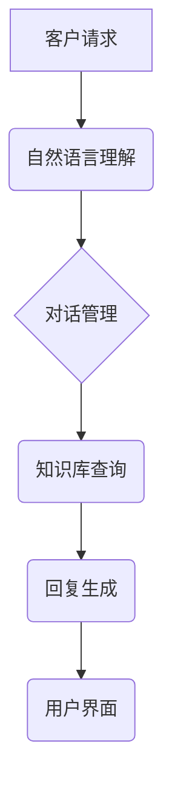

                 

## AI驱动的智能客户服务系统设计

> 关键词：人工智能、智能客服、自然语言处理、机器学习、对话系统、客户体验、自动化、知识图谱

## 1. 背景介绍

在当今数字化时代，客户服务已成为企业竞争力的关键因素。传统客服模式面临着诸多挑战，例如响应时间长、处理能力有限、成本高昂等。而人工智能（AI）技术的快速发展为智能客服系统提供了强大的技术支撑，使其能够更智能、高效、个性化地服务于客户。

智能客服系统利用自然语言处理（NLP）、机器学习（ML）等人工智能技术，能够理解和响应客户的自然语言请求，提供快速、准确、个性化的服务体验。它可以自动处理常见问题、引导客户解决问题、提供产品信息和服务建议等，从而减轻人工客服的负担，提高客户满意度。

## 2. 核心概念与联系

### 2.1 智能客服系统架构

智能客服系统通常由以下几个核心模块组成：

* **自然语言理解（NLU）模块：**负责将客户的自然语言输入转换为机器可理解的结构化数据，包括识别实体、关系和意图等。
* **对话管理模块：**负责控制对话流程，根据客户的意图和上下文，选择合适的回复，并引导对话走向。
* **知识库模块：**存储企业产品、服务、政策等相关信息，为智能客服提供知识支持。
* **机器学习（ML）模块：**用于训练和优化智能客服模型，提高其理解和响应客户的能力。
* **用户界面（UI）模块：**提供用户与智能客服交互的界面，可以是文本、语音、图文等多种形式。



### 2.2 核心概念原理

* **自然语言处理（NLP）：**NLP是人工智能领域的一个重要分支，旨在使计算机能够理解、处理和生成人类语言。它涉及到语音识别、文本分析、机器翻译等多个子领域。
* **机器学习（ML）：**ML是人工智能的一种实现方式，通过训练模型，使模型能够从数据中学习规律，并对新数据进行预测或分类。
* **对话系统：**对话系统是一种能够与人类进行自然语言交互的系统，它可以理解用户的意图，并提供相应的回复。

## 3. 核心算法原理 & 具体操作步骤

### 3.1 算法原理概述

智能客服系统中常用的算法包括：

* **词嵌入算法：**将单词映射到向量空间，使得语义相近的单词拥有相似的向量表示。常用的词嵌入算法包括Word2Vec、GloVe等。
* **序列标注算法：**用于识别文本序列中的标签，例如命名实体识别、情感分析等。常用的序列标注算法包括CRF、BERT等。
* **机器翻译算法：**用于将一种语言翻译成另一种语言。常用的机器翻译算法包括统计机器翻译、神经机器翻译等。
* **对话状态跟踪算法：**用于跟踪对话进程中的状态信息，例如用户意图、对话上下文等。常用的对话状态跟踪算法包括RNN、LSTM等。

### 3.2 算法步骤详解

以词嵌入算法为例，其具体操作步骤如下：

1. **预处理文本数据：**将文本数据进行清洗、分词、去停用词等预处理操作，以便于后续算法训练。
2. **构建词向量表示：**利用词嵌入算法，将每个单词映射到一个低维向量空间中，使得语义相近的单词拥有相似的向量表示。
3. **训练模型：**利用训练数据，训练词嵌入模型，使其能够准确地将单词映射到词向量空间中。
4. **使用词向量：**将训练好的词嵌入模型应用于实际场景中，例如自然语言理解、文本相似度计算等。

### 3.3 算法优缺点

* **优点：**能够有效地捕捉单词之间的语义关系，提高自然语言理解的准确性。
* **缺点：**需要大量的训练数据，训练时间较长，对于罕见词语的表示能力有限。

### 3.4 算法应用领域

* **自然语言理解：**用于识别实体、关系、意图等，提高机器对自然语言的理解能力。
* **文本相似度计算：**用于比较两个文本之间的相似度，例如文档检索、信息提取等。
* **机器翻译：**用于将一种语言翻译成另一种语言，提高机器翻译的准确性和流畅度。

## 4. 数学模型和公式 & 详细讲解 & 举例说明

### 4.1 数学模型构建

词嵌入算法通常使用神经网络模型进行训练，例如Word2Vec模型。Word2Vec模型的输入是一个单词序列，输出是一个词向量序列。

### 4.2 公式推导过程

Word2Vec模型的训练目标是最大化预测目标词的概率。假设给定一个上下文词序列 $C = \{w_1, w_2, ..., w_n\}$，目标词为 $w_t$，则模型的目标函数为：

$$
P(w_t | C) = \frac{exp(v_t^T \cdot v_c)}{\sum_{w \in V} exp(v_w^T \cdot v_c)}
$$

其中：

* $v_t$ 是目标词 $w_t$ 的词向量。
* $v_c$ 是上下文词序列 $C$ 的平均词向量。
* $V$ 是词典的大小。

### 4.3 案例分析与讲解

假设我们有一个词典包含单词 "king"、"queen"、"man"、"woman" 等。训练好的Word2Vec模型可以将这些单词映射到一个低维向量空间中。

如果我们计算 "king" 和 "queen" 之间的相似度，会发现它们之间的距离较小，因为它们在语义上是相似的。

## 5. 项目实践：代码实例和详细解释说明

### 5.1 开发环境搭建

* Python 3.x
* TensorFlow 或 PyTorch 等深度学习框架
* NLTK 或 SpaCy 等自然语言处理库

### 5.2 源代码详细实现

```python
# 使用 TensorFlow 实现 Word2Vec 模型

import tensorflow as tf

# 定义词嵌入层
embedding_layer = tf.keras.layers.Embedding(input_dim=vocab_size, output_dim=embedding_dim)

# 定义模型
model = tf.keras.Sequential([
    embedding_layer,
    tf.keras.layers.Flatten(),
    tf.keras.layers.Dense(units=1, activation='sigmoid')
])

# 编译模型
model.compile(optimizer='adam', loss='binary_crossentropy', metrics=['accuracy'])

# 训练模型
model.fit(x_train, y_train, epochs=10)

# 使用模型预测
predictions = model.predict(x_test)
```

### 5.3 代码解读与分析

* `embedding_layer` 是词嵌入层，用于将单词映射到词向量空间。
* `Flatten()` 层将多维词向量转换为一维向量。
* `Dense()` 层是一个全连接层，用于预测目标词的概率。
* `adam` 是优化器，用于更新模型参数。
* `binary_crossentropy` 是损失函数，用于衡量模型预测结果与真实值的差异。
* `accuracy` 是评价指标，用于衡量模型预测准确率。

### 5.4 运行结果展示

训练完成后，我们可以使用模型预测新的文本序列中的目标词概率。例如，如果输入的上下文词序列为 "The quick brown fox jumps over the"，目标词为 "lazy dog"，模型可以预测出 "lazy dog" 的概率。

## 6. 实际应用场景

### 6.1 电商客服

智能客服系统可以自动处理客户的订单查询、退换货申请、物流跟踪等常见问题，减轻人工客服的负担，提高客户服务效率。

### 6.2 金融客服

智能客服系统可以帮助银行、保险公司等金融机构自动处理客户的账户查询、转账、理财咨询等服务请求，提高客户服务体验。

### 6.3 医疗客服

智能客服系统可以帮助医院、诊所等医疗机构自动处理患者的预约挂号、问诊、缴费等服务请求，提高医疗服务效率。

### 6.4 未来应用展望

随着人工智能技术的不断发展，智能客服系统将能够提供更智能、更个性化的服务体验。例如：

* **多模态交互：**支持文本、语音、图像等多种交互方式。
* **情感识别：**能够识别客户的情感状态，并提供相应的服务。
* **个性化推荐：**根据客户的个人信息和历史行为，提供个性化的产品和服务推荐。

## 7. 工具和资源推荐

### 7.1 学习资源推荐

* **书籍：**
    * 《深度学习》
    * 《自然语言处理》
* **在线课程：**
    * Coursera
    * edX
    * Udacity

### 7.2 开发工具推荐

* **TensorFlow：**开源深度学习框架
* **PyTorch：**开源深度学习框架
* **NLTK：**自然语言处理库
* **SpaCy：**自然语言处理库

### 7.3 相关论文推荐

* **Word2Vec：**Efficient Estimation of Word Representations in Vector Space
* **BERT：**BERT: Pre-training of Deep Bidirectional Transformers for Language Understanding

## 8. 总结：未来发展趋势与挑战

### 8.1 研究成果总结

AI驱动的智能客服系统已取得了显著的进展，能够有效地处理客户服务请求，提高客户满意度。

### 8.2 未来发展趋势

* **更智能的对话系统：**能够更好地理解客户意图，提供更精准的回复。
* **更个性化的服务体验：**根据客户的个人信息和历史行为，提供个性化的产品和服务推荐。
* **更广泛的应用场景：**智能客服系统将应用于更多领域，例如教育、医疗、政府等。

### 8.3 面临的挑战

* **数据质量问题：**智能客服系统需要大量的训练数据，而数据质量问题会影响模型的性能。
* **模型解释性问题：**深度学习模型的决策过程难以解释，这可能会导致客户对智能客服的信任度降低。
* **伦理问题：**智能客服系统可能会出现偏见或歧视，需要进行伦理规范的制定和监管。

### 8.4 研究展望

未来，需要进一步研究如何提高智能客服系统的智能化、个性化和可解释性，并解决数据质量、模型解释性和伦理等挑战，使其能够更好地服务于人类社会。

## 9. 附录：常见问题与解答

* **Q：智能客服系统会取代人工客服吗？**

A：智能客服系统可以减轻人工客服的负担，提高效率，但不会完全取代人工客服。人工客服仍然需要在处理复杂问题、提供情感支持等方面发挥作用。

* **Q：如何训练一个高质量的智能客服系统？**

A：需要收集大量的训练数据，并使用合适的算法和模型进行训练。还需要进行模型评估和优化，以提高模型的性能。

* **Q：智能客服系统有哪些安全风险？**

A：智能客服系统可能会面临数据泄露、恶意攻击等安全风险。需要采取相应的安全措施，保护用户数据和系统安全。


作者：禅与计算机程序设计艺术 / Zen and the Art of Computer Programming 
<end_of_turn>

