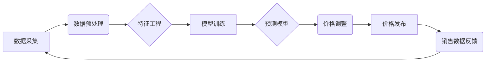

                 

## AI驱动的电商智能定价动态调整系统

> 关键词：电商智能定价、机器学习、深度学习、预测模型、动态调整、价格优化、数据分析

## 1. 背景介绍

在当今激烈的电商市场竞争中，定价策略扮演着至关重要的角色。传统的定价方法往往依赖于经验和主观判断，难以适应市场瞬息万变的需求和竞争格局。随着人工智能技术的快速发展，AI驱动的电商智能定价动态调整系统应运而生，为电商企业提供了一种更加智能、高效、精准的定价解决方案。

智能定价系统通过对海量电商数据进行分析和挖掘，利用机器学习和深度学习算法，建立预测模型，实时监测市场动态，并根据多种因素进行动态调整商品价格，从而实现以下目标：

* **提高利润率:** 通过精准定价，最大化商品销售额和利润。
* **优化库存管理:** 根据预测需求，动态调整库存水平，降低库存成本。
* **提升客户满意度:** 提供更具竞争力的价格，增强客户粘性。
* **增强市场竞争力:**  快速响应市场变化，抢占先机。

## 2. 核心概念与联系

**2.1 核心概念**

* **智能定价:** 利用人工智能技术，根据市场数据和商品特征，自动制定最优定价策略。
* **机器学习:**  一种人工智能技术，通过算法训练，从数据中学习规律，并进行预测。
* **深度学习:**  一种更高级的机器学习技术，利用多层神经网络，模拟人类大脑的学习过程。
* **预测模型:**  基于机器学习算法，对未来市场需求、竞争情况等进行预测的数学模型。
* **动态调整:**  根据实时市场数据和预测结果，动态调整商品价格。

**2.2 架构图**



**2.3 核心联系**

智能定价系统是一个闭环系统，数据采集、预处理、特征工程、模型训练、预测模型、价格调整、价格发布、销售数据反馈相互关联，共同完成智能定价的目标。

## 3. 核心算法原理 & 具体操作步骤

**3.1 算法原理概述**

智能定价系统通常采用以下几种机器学习算法：

* **线性回归:**  用于预测商品价格与相关因素之间的线性关系。
* **逻辑回归:**  用于预测商品是否会被购买，以及购买概率。
* **决策树:**  用于根据商品特征和市场数据，构建决策规则，预测最佳价格。
* **支持向量机:**  用于寻找最佳价格分割线，将购买和不购买的用户区分开来。
* **神经网络:**  用于学习更复杂的非线性关系，预测更精准的价格。

**3.2 算法步骤详解**

1. **数据采集:** 收集商品价格、销售量、库存量、市场竞争情况、用户行为数据等相关信息。
2. **数据预处理:** 清洗、转换、标准化数据，去除噪声和异常值，使数据更适合模型训练。
3. **特征工程:**  提取和构建特征变量，例如商品类别、品牌、属性、季节、促销活动等，这些特征变量可以帮助模型更好地理解商品和市场。
4. **模型训练:**  选择合适的机器学习算法，利用训练数据训练模型，并评估模型性能。
5. **预测模型:**  将训练好的模型应用于新的数据，预测未来商品价格和销售量。
6. **价格调整:**  根据预测结果和预设的策略，动态调整商品价格。
7. **价格发布:**  将调整后的价格发布到电商平台。
8. **销售数据反馈:**  收集销售数据，反馈到系统，用于模型更新和优化。

**3.3 算法优缺点**

* **优点:** 
    * 自动化定价，提高效率。
    * 数据驱动，更精准的预测。
    * 动态调整，适应市场变化。
    * 提升利润率和客户满意度。
* **缺点:** 
    * 需要大量数据进行训练。
    * 模型需要定期更新和优化。
    * 算法复杂，需要专业技术人员维护。

**3.4 算法应用领域**

* **电商平台:**  动态调整商品价格，提高销售额和利润。
* **旅游行业:**  根据市场需求和竞争情况，调整机票和酒店价格。
* **金融行业:**  预测股票价格、汇率等金融指标。
* **医疗行业:**  预测患者需求，优化医疗资源配置。

## 4. 数学模型和公式 & 详细讲解 & 举例说明

**4.1 数学模型构建**

智能定价系统通常采用回归模型来预测商品价格。一个简单的线性回归模型可以表示为：

$$P = a + bQ + cS + dC$$

其中：

* $P$：预测的商品价格
* $Q$：商品销量
* $S$：市场竞争情况（例如，竞争对手的价格）
* $C$：商品成本

$a$、$b$、$c$、$d$ 为模型参数，需要通过训练数据进行估计。

**4.2 公式推导过程**

模型参数的估计可以通过最小二乘法进行。最小二乘法旨在找到一条直线，使所有数据点到直线的距离之和最小。

**4.3 案例分析与讲解**

假设我们有一个电商平台，销售一种商品，其历史数据如下：

| 商品销量 (Q) | 市场竞争情况 (S) | 商品成本 (C) | 实际价格 (P) |
|---|---|---|---|
| 100 | 0.8 | 10 | 20 |
| 150 | 0.9 | 12 | 25 |
| 200 | 1.0 | 15 | 30 |
| 250 | 1.1 | 18 | 35 |

我们可以使用上述线性回归模型，将这些数据进行训练，得到模型参数 $a$、$b$、$c$、$d$。然后，我们可以利用这个模型预测未来商品价格。

例如，如果未来商品销量预计为 300，市场竞争情况为 1.2，商品成本为 20，我们可以将这些值代入模型公式，得到预测价格。

## 5. 项目实践：代码实例和详细解释说明

**5.1 开发环境搭建**

* **操作系统:**  Linux/macOS/Windows
* **编程语言:**  Python
* **机器学习库:**  Scikit-learn
* **数据处理库:**  Pandas
* **可视化库:**  Matplotlib/Seaborn

**5.2 源代码详细实现**

```python
import pandas as pd
from sklearn.linear_model import LinearRegression

# 数据加载
data = pd.read_csv('price_data.csv')

# 特征工程
X = data[['销量', '竞争情况', '成本']]
y = data['价格']

# 模型训练
model = LinearRegression()
model.fit(X, y)

# 模型预测
new_data = pd.DataFrame({'销量': [300], '竞争情况': [1.2], '成本': [20]})
predicted_price = model.predict(new_data)

# 结果展示
print(f'预测价格: {predicted_price[0]}')
```

**5.3 代码解读与分析**

* **数据加载:**  使用 Pandas 库加载商品价格数据。
* **特征工程:**  选择销量、竞争情况和成本作为预测价格的特征变量。
* **模型训练:**  使用 Scikit-learn 库的 LinearRegression 模型训练预测模型。
* **模型预测:**  使用训练好的模型预测未来商品价格。
* **结果展示:**  打印预测价格。

**5.4 运行结果展示**

运行上述代码，可以得到预测价格的值。

## 6. 实际应用场景

**6.1 电商平台**

* **商品定价:**  根据商品销量、市场竞争情况、成本等因素，动态调整商品价格，提高利润率。
* **促销活动:**  根据预测需求，制定精准的促销策略，例如限时折扣、满减优惠等。
* **库存管理:**  预测未来商品需求，优化库存水平，降低库存成本。

**6.2 旅游行业**

* **机票定价:**  根据航班日期、时间、目的地、市场需求等因素，动态调整机票价格。
* **酒店定价:**  根据酒店位置、设施、季节、市场需求等因素，动态调整酒店价格。
* **旅游套餐定价:**  根据旅游目的地、行程安排、市场需求等因素，动态调整旅游套餐价格。

**6.3 其他行业**

* **金融行业:**  预测股票价格、汇率等金融指标，辅助投资决策。
* **医疗行业:**  预测患者需求，优化医疗资源配置。
* **能源行业:**  预测能源价格，辅助能源交易和管理。

**6.4 未来应用展望**

随着人工智能技术的不断发展，AI驱动的电商智能定价动态调整系统将更加智能、精准、高效。未来，我们可以期待以下应用场景：

* **个性化定价:**  根据用户的购买历史、浏览记录、偏好等信息，提供个性化的价格。
* **实时动态调整:**  利用实时数据，更加快速、精准地调整商品价格。
* **多因素协同优化:**  将更多因素，例如天气、节日、新闻事件等，纳入到定价模型中，实现更加全面的优化。


## 7. 工具和资源推荐

**7.1 学习资源推荐**

* **书籍:**
    * 《Python机器学习》
    * 《深度学习》
    * 《数据挖掘：概念与技术》
* **在线课程:**
    * Coursera:  机器学习、深度学习
    * edX:  数据科学、人工智能
    * Udemy:  Python编程、数据分析

**7.2 开发工具推荐**

* **Python:**  编程语言
* **Scikit-learn:**  机器学习库
* **Pandas:**  数据处理库
* **Matplotlib/Seaborn:**  可视化库
* **Jupyter Notebook:**  交互式开发环境

**7.3 相关论文推荐**

* **《基于深度学习的电商商品价格预测模型》**
* **《机器学习在电商定价中的应用研究》**
* **《智能定价系统的设计与实现》**

## 8. 总结：未来发展趋势与挑战

**8.1 研究成果总结**

AI驱动的电商智能定价动态调整系统已经取得了显著的成果，能够有效提高电商企业的利润率、优化库存管理、提升客户满意度。

**8.2 未来发展趋势**

* **更精准的预测:**  利用更先进的机器学习算法和更丰富的预测数据，实现更加精准的商品价格预测。
* **更个性化的定价:**  根据用户的个性化需求，提供更加个性化的价格。
* **更智能的决策:**  将更多因素纳入到定价模型中，实现更加智能的定价决策。

**8.3 面临的挑战**

* **数据质量:**  智能定价系统依赖于高质量的数据，数据质量问题会影响模型的准确性。
* **算法复杂性:**  一些机器学习算法非常复杂，需要专业的技术人员进行维护和优化。
* **伦理问题:**  个性化定价可能会引发伦理问题，例如价格歧视等。

**8.4 研究展望**

未来，我们需要继续研究更先进的机器学习算法，开发更智能的定价系统，并解决数据质量、算法复杂性和伦理问题等挑战。


## 9. 附录：常见问题与解答

**9.1 如何选择合适的机器学习算法？**

选择合适的机器学习算法取决于具体应用场景和数据特点。例如，对于线性关系较强的预测问题，可以使用线性回归算法；对于非线性关系较强的预测问题，可以使用神经网络算法。

**9.2 如何处理数据质量问题？**

数据质量问题可以通过以下方法进行处理：

* 数据清洗：去除数据中的噪声、异常值和重复数据。
* 数据标准化：将数据转换为标准化格式，例如将数值数据转换为0到1之间的范围。
* 数据完整性检查：确保数据完整性，例如检查缺失值和错误值。

**9.3 如何解决算法复杂性问题？**

算法复杂性问题可以通过以下方法进行解决：

* 使用开源的机器学习库，例如Scikit-learn，简化算法实现。
* 利用云计算平台，例如AWS、Azure、GCP，进行大规模数据处理和模型训练。
* 采用模型压缩和加速技术，降低模型复杂度和训练时间。


作者：禅与计算机程序设计艺术 / Zen and the Art of Computer Programming 
<end_of_turn>

