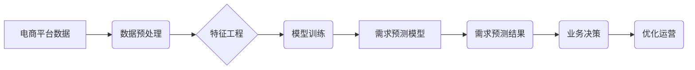

                 

## AI驱动的电商智能客户需求预测系统

> 关键词：客户需求预测、电商平台、机器学习、深度学习、时间序列分析、推荐系统、数据挖掘

## 1. 背景介绍

在当今数据爆炸的时代，电商平台面临着日益激烈的竞争压力。为了提高运营效率、优化库存管理、提升客户体验，准确预测客户需求显得尤为重要。传统的客户需求预测方法往往依赖于历史销售数据和市场调研，缺乏灵活性，难以应对快速变化的市场环境。

近年来，人工智能（AI）技术的发展为客户需求预测带来了新的机遇。AI驱动的智能客户需求预测系统能够利用海量数据和先进的机器学习算法，更精准地预测客户未来的购买行为，为电商平台提供数据驱动的决策支持。

## 2. 核心概念与联系

### 2.1 核心概念

* **客户需求预测:** 指通过分析历史数据、市场趋势和客户行为等信息，预测未来一段时间内客户对特定商品或服务的购买需求。
* **电商平台:** 提供商品展示、交易、支付等服务的在线商业平台。
* **机器学习:** 一种人工智能技术，通过算法训练，使计算机能够从数据中学习，并根据学习到的知识进行预测或决策。
* **深度学习:** 一种机器学习的子领域，利用多层神经网络模拟人类大脑的学习过程，能够处理更复杂的数据模式。
* **时间序列分析:** 一种统计方法，用于分析时间相关的数据序列，识别其中的趋势、季节性变化和异常值。
* **推荐系统:** 基于用户历史行为和商品特征，推荐用户可能感兴趣的商品或服务。

### 2.2 架构关系



## 3. 核心算法原理 & 具体操作步骤

### 3.1 算法原理概述

AI驱动的客户需求预测系统通常采用以下几种核心算法：

* **线性回归:**  一种简单易懂的回归算法，用于预测连续型变量。
* **决策树:**  一种树形结构的算法，通过一系列规则进行分类或预测。
* **支持向量机 (SVM):**  一种分类算法，通过寻找最佳的分隔超平面来分类数据。
* **随机森林:**  一种集成学习算法，通过构建多个决策树并进行投票来提高预测精度。
* **深度学习:**  利用多层神经网络，能够学习更复杂的非线性关系，适用于大规模数据场景。

### 3.2 算法步骤详解

1. **数据收集:** 收集电商平台相关的历史数据，包括销售记录、用户行为、商品信息、市场趋势等。
2. **数据预处理:** 对收集到的数据进行清洗、转换、归一化等处理，以确保数据质量和算法训练效果。
3. **特征工程:** 从原始数据中提取有价值的特征，例如商品类别、价格、用户年龄、购买频率等，这些特征将作为算法训练的输入。
4. **模型训练:** 选择合适的算法模型，并利用训练数据进行模型训练，调整模型参数以获得最佳的预测效果。
5. **模型评估:** 使用测试数据对训练好的模型进行评估，评估模型的预测精度、召回率、F1-score等指标。
6. **模型部署:** 将训练好的模型部署到线上环境，用于实时预测客户需求。
7. **结果分析:** 对预测结果进行分析，并根据分析结果进行业务决策，例如优化库存管理、调整商品价格、制定营销策略等。

### 3.3 算法优缺点

| 算法 | 优点 | 缺点 |
|---|---|---|
| 线性回归 | 简单易懂，计算效率高 | 难以处理非线性关系 |
| 决策树 | 易于理解和解释，可以处理分类和回归问题 | 容易过拟合，预测精度可能较低 |
| 支持向量机 | 能够处理高维数据，具有较好的泛化能力 | 计算复杂度高，参数选择困难 |
| 随机森林 | 鲁棒性强，预测精度高 | 训练时间长，难以解释模型决策过程 |
| 深度学习 | 能够学习复杂的非线性关系，预测精度高 | 训练数据量大，计算资源需求高，难以解释模型决策过程 |

### 3.4 算法应用领域

* **电商平台:** 预测客户对商品的需求，优化库存管理、制定营销策略。
* **金融行业:** 预测客户的贷款需求、投资行为、欺诈风险等。
* **医疗保健:** 预测患者的疾病风险、治疗效果、药物需求等。
* **制造业:** 预测产品需求、生产计划、设备故障等。

## 4. 数学模型和公式 & 详细讲解 & 举例说明

### 4.1 数学模型构建

客户需求预测模型通常采用回归模型，目标是预测未来时间段内客户对特定商品的需求量。

假设我们想要预测商品 $i$ 在时间 $t$ 的需求量 $y_{i,t}$，可以构建以下线性回归模型：

$$y_{i,t} = \beta_0 + \beta_1 x_{i,t-1} + \beta_2 x_{i,t-2} + ... + \beta_n x_{i,t-n} + \epsilon$$

其中：

* $y_{i,t}$ 是商品 $i$ 在时间 $t$ 的需求量。
* $x_{i,t-k}$ 是商品 $i$ 在时间 $t-k$ 的历史需求量，$k$ 为滞后时间。
* $\beta_0$, $\beta_1$, ..., $\beta_n$ 是模型参数，需要通过训练数据进行估计。
* $\epsilon$ 是误差项，代表模型无法解释的需求波动。

### 4.2 公式推导过程

模型参数的估计可以通过最小二乘法进行。最小二乘法旨在找到一组参数，使得模型预测值与实际值之间的误差平方和最小。

具体推导过程如下：

1. 定义误差函数：

$$E = \sum_{i=1}^{m} \sum_{t=1}^{T} (y_{i,t} - \hat{y}_{i,t})^2$$

其中：

* $m$ 是商品数量。
* $T$ 是时间步长。
* $\hat{y}_{i,t}$ 是模型预测的商品 $i$ 在时间 $t$ 的需求量。

2. 对误差函数求导，并令导数等于零，得到参数的估计值。

### 4.3 案例分析与讲解

假设我们想要预测某款商品在未来一周的需求量。我们可以收集该商品过去一周的销售数据，并将其作为训练数据。

通过训练线性回归模型，我们可以得到模型参数 $\beta_0$, $\beta_1$, ..., $\beta_n$。然后，我们可以利用这些参数和未来一周的预测输入，例如历史销售数据、市场趋势等，预测该商品未来一周的需求量。

## 5. 项目实践：代码实例和详细解释说明

### 5.1 开发环境搭建

* **操作系统:** Linux/macOS/Windows
* **编程语言:** Python
* **库依赖:** pandas, numpy, scikit-learn, matplotlib

### 5.2 源代码详细实现

```python
import pandas as pd
from sklearn.linear_model import LinearRegression
from sklearn.model_selection import train_test_split

# 加载数据
data = pd.read_csv('sales_data.csv')

# 数据预处理
# ...

# 特征工程
X = data[['previous_week_sales', 'previous_month_sales', 'seasonality']]
y = data['current_week_sales']

# 数据分割
X_train, X_test, y_train, y_test = train_test_split(X, y, test_size=0.2, random_state=42)

# 模型训练
model = LinearRegression()
model.fit(X_train, y_train)

# 模型评估
y_pred = model.predict(X_test)
# ...

# 模型部署
# ...
```

### 5.3 代码解读与分析

* **数据加载:** 使用 pandas 库加载销售数据。
* **数据预处理:** 对数据进行清洗、转换、归一化等处理。
* **特征工程:** 从原始数据中提取有价值的特征，例如历史销售数据、季节性因素等。
* **数据分割:** 将数据分为训练集和测试集，用于模型训练和评估。
* **模型训练:** 使用线性回归模型训练，并使用训练数据拟合模型参数。
* **模型评估:** 使用测试数据评估模型的预测精度，例如均方误差 (MSE)、R-squared 等指标。
* **模型部署:** 将训练好的模型部署到线上环境，用于实时预测客户需求。

### 5.4 运行结果展示

* 模型预测结果可视化，例如绘制预测值与实际值的散点图。
* 模型评估指标展示，例如 MSE、R-squared 等。

## 6. 实际应用场景

### 6.1 库存管理优化

* 通过预测未来商品需求，电商平台可以优化库存管理，避免库存积压或缺货情况。
* 例如，预测某款商品未来一周的需求量，可以帮助平台调整采购计划，确保商品供应充足。

### 6.2 营销策略制定

* 预测客户对特定商品的需求，可以帮助电商平台制定更精准的营销策略。
* 例如，预测哪些客户对某款新品感兴趣，可以帮助平台进行精准推送，提高转化率。

### 6.3 个性化推荐

* 结合客户历史行为和商品特征，AI驱动的推荐系统可以提供更个性化的商品推荐。
* 例如，根据用户的购买历史和浏览记录，推荐用户可能感兴趣的商品。

### 6.4 未来应用展望

* **更精准的预测:** 利用更先进的机器学习算法和更丰富的预测数据，实现更精准的客户需求预测。
* **多维度的预测:** 不仅预测商品需求量，还可以预测客户购买时间、购买渠道、购买金额等多维度的需求信息。
* **实时预测:** 利用实时数据流，实现对客户需求的实时预测，帮助电商平台快速响应市场变化。

## 7. 工具和资源推荐

### 7.1 学习资源推荐

* **书籍:**
    * 《Python机器学习》
    * 《深度学习》
    * 《数据挖掘：概念与技术》
* **在线课程:**
    * Coursera: 机器学习
    * edX: 深度学习
    * Udemy: 数据科学与机器学习

### 7.2 开发工具推荐

* **Python:** 
    * pandas: 数据处理
    * numpy: 数值计算
    * scikit-learn: 机器学习库
    * TensorFlow/PyTorch: 深度学习框架
* **数据可视化工具:**
    * matplotlib
    * seaborn

### 7.3 相关论文推荐

* 《Recurrent Neural Networks for Sequence Prediction》
* 《Attention Is All You Need》
* 《Deep Learning for Time Series Forecasting》

## 8. 总结：未来发展趋势与挑战

### 8.1 研究成果总结

AI驱动的电商智能客户需求预测系统已经取得了显著的成果，能够帮助电商平台提高运营效率、优化库存管理、提升客户体验。

### 8.2 未来发展趋势

* **模型精度提升:** 利用更先进的机器学习算法和更丰富的预测数据，实现更精准的客户需求预测。
* **多模态数据融合:** 将文本、图像、视频等多模态数据融合到预测模型中，提升预测精度和准确性。
* **个性化预测:** 基于用户的个性化需求和行为特征，实现更精准的个性化需求预测。

### 8.3 面临的挑战

* **数据质量问题:** 预测模型的精度依赖于数据质量，需要不断完善数据收集、清洗和预处理流程。
* **模型解释性问题:** 深度学习模型的决策过程难以解释，需要研究更可解释的模型算法。
* **计算资源需求:** 训练大型深度学习模型需要大量的计算资源，需要探索更有效的训练方法和硬件平台。

### 8.4 研究展望

未来，AI驱动的电商智能客户需求预测系统将朝着更精准、更个性化、更智能的方向发展，为电商平台提供更强大的数据驱动的决策支持。


## 9. 附录：常见问题与解答

* **Q1: 如何选择合适的预测模型？**

    A1: 选择合适的预测模型需要根据具体业务场景和数据特点进行选择。例如，对于线性关系较强的需求数据，可以使用线性回归模型；对于非线性关系较强的需求数据，可以使用决策树、随机森林或深度学习模型。

* **Q2: 如何评估模型的预测精度？**

    A2: 可以使用多种指标来评估模型的预测精度，例如均方误差 (MSE)、平均绝对误差 (MAE)、R-squared 等。

* **Q3: 如何处理缺失数据？**

    A3: 可以使用多种方法处理缺失数据，例如平均值填充、线性插值、KNN 填充等。

* **Q4: 如何避免模型过拟合？**

    A4: 可以使用正则化技术、交叉验证、Dropout 等方法来避免模型过拟合。


作者：禅与计算机程序设计艺术 / Zen and the Art of Computer Programming 
<end_of_turn>

