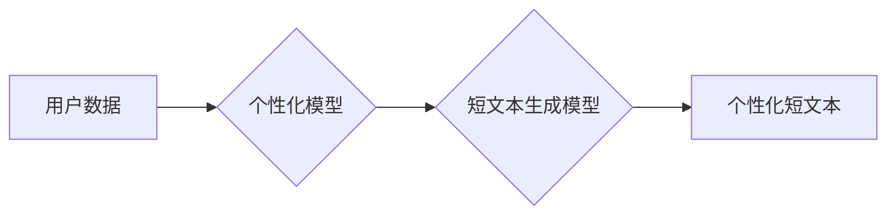

                 

## AI驱动的社交媒体内容：个性化短文本生成

> 关键词：人工智能、自然语言处理、短文本生成、个性化推荐、社交媒体、Transformer模型、BERT、GPT

## 1. 背景介绍

社交媒体平台已成为人们获取信息、交流互动和分享体验的重要场所。随着用户数量的激增和内容的爆炸式增长，如何为用户提供个性化、有价值的内容成为了平台发展的重要课题。AI驱动的短文本生成技术为解决这一问题提供了新的可能性。

个性化短文本生成是指根据用户的兴趣、偏好、行为等信息，自动生成符合其需求的短文本内容，例如推荐文章标题、撰写社交媒体帖子、生成聊天机器人回复等。这种技术能够提升用户体验，增强用户粘性，并为平台带来新的商业机会。

## 2. 核心概念与联系

### 2.1  核心概念

* **自然语言处理 (NLP):**  NLP是人工智能的一个分支，致力于使计算机能够理解、生成和处理人类语言。
* **短文本生成:** 短文本生成是指利用机器学习算法，从给定的输入信息中生成短文本内容，例如句子、段落或标题。
* **个性化推荐:** 个性化推荐是指根据用户的历史行为、偏好和兴趣等信息，推荐用户可能感兴趣的内容。

### 2.2  架构



**流程说明:**

1. **用户数据:** 收集用户的各种数据，例如浏览历史、点赞记录、评论内容、社交关系等。
2. **个性化模型:** 利用机器学习算法，分析用户数据，构建用户画像，并预测用户的兴趣偏好。
3. **短文本生成模型:** 根据用户的兴趣偏好，利用短文本生成模型生成个性化的短文本内容。
4. **个性化短文本:** 将生成的个性化短文本内容展示给用户。

## 3. 核心算法原理 & 具体操作步骤

### 3.1  算法原理概述

目前，短文本生成领域最先进的算法是基于Transformer模型的架构，例如BERT和GPT。这些模型利用自注意力机制，能够捕捉文本序列中长距离依赖关系，生成更流畅、更自然的短文本内容。

### 3.2  算法步骤详解

1. **数据预处理:** 将原始文本数据进行清洗、分词、标记等预处理操作，使其能够被模型理解。
2. **模型训练:** 利用预处理后的数据，训练Transformer模型，使其能够学习文本的语义和语法规则。
3. **文本编码:** 将输入文本信息编码成向量表示，以便模型理解。
4. **生成文本:** 根据输入文本的编码信息，利用模型的解码器生成目标短文本内容。
5. **文本解码:** 将生成的文本向量解码成可读的文本格式。

### 3.3  算法优缺点

**优点:**

* 生成质量高：基于Transformer模型的算法能够生成更流畅、更自然的短文本内容。
* 捕捉长距离依赖关系：自注意力机制能够捕捉文本序列中长距离依赖关系，生成更上下文相关的短文本。
* 可扩展性强：Transformer模型的架构具有良好的可扩展性，能够处理更长的文本序列。

**缺点:**

* 计算资源消耗大：训练Transformer模型需要大量的计算资源和时间。
* 数据依赖性强：模型的性能取决于训练数据的质量和数量。

### 3.4  算法应用领域

* **社交媒体内容生成:** 自动生成个性化的社交媒体帖子、评论和回复。
* **聊天机器人:** 为聊天机器人提供更自然、更流畅的对话体验。
* **新闻标题生成:** 根据新闻内容自动生成吸引人的标题。
* **文案创作:** 帮助用户快速生成广告文案、产品描述等。

## 4. 数学模型和公式 & 详细讲解 & 举例说明

### 4.1  数学模型构建

Transformer模型的核心是自注意力机制，它通过计算每个词与其他词之间的相关性，来捕捉文本序列中的长距离依赖关系。

**注意力机制公式:**

$$
Attention(Q, K, V) = softmax(\frac{QK^T}{\sqrt{d_k}})V
$$

其中：

* $Q$：查询矩阵
* $K$：键矩阵
* $V$：值矩阵
* $d_k$：键向量的维度
* $softmax$：softmax函数

**解释:**

注意力机制首先计算查询矩阵 $Q$ 与键矩阵 $K$ 的点积，然后进行归一化，得到每个词与其他词之间的相关性分数。最后，将这些分数与值矩阵 $V$ 相乘，得到每个词的加权和，即注意力输出。

### 4.2  公式推导过程

注意力机制的公式推导过程较为复杂，涉及到线性变换、矩阵乘法和softmax函数等操作。

**简要推导:**

1. 将输入序列 $X$ 分别映射到查询矩阵 $Q$、键矩阵 $K$ 和值矩阵 $V$。
2. 计算 $Q$ 与 $K$ 的点积，得到每个词与其他词之间的相关性分数。
3. 对相关性分数进行归一化，得到每个词与其他词的注意力权重。
4. 将注意力权重与值矩阵 $V$ 相乘，得到每个词的加权和，即注意力输出。

### 4.3  案例分析与讲解

**举例:**

假设我们有一个短文本序列 "The cat sat on the mat"，我们想要计算 "cat" 这个词与其他词之间的注意力权重。

1. 将每个词分别映射到查询矩阵 $Q$、键矩阵 $K$ 和值矩阵 $V$。
2. 计算 "cat" 的查询向量与其他词的键向量的点积，得到每个词与 "cat" 的相关性分数。
3. 对相关性分数进行归一化，得到每个词与 "cat" 的注意力权重。
4. 将注意力权重与值矩阵 $V$ 相乘，得到 "cat" 的注意力输出，即 "cat" 与其他词的加权和。

## 5. 项目实践：代码实例和详细解释说明

### 5.1  开发环境搭建

* Python 3.7+
* TensorFlow 2.0+
* PyTorch 1.0+
* CUDA Toolkit (可选)

### 5.2  源代码详细实现

```python
# 使用 TensorFlow 2.0 实现简单的短文本生成模型

import tensorflow as tf

# 定义模型架构
class TextGenerator(tf.keras.Model):
    def __init__(self, vocab_size, embedding_dim, hidden_dim):
        super(TextGenerator, self).__init__()
        self.embedding = tf.keras.layers.Embedding(vocab_size, embedding_dim)
        self.lstm = tf.keras.layers.LSTM(hidden_dim)
        self.dense = tf.keras.layers.Dense(vocab_size)

    def call(self, inputs):
        x = self.embedding(inputs)
        x = self.lstm(x)
        x = self.dense(x)
        return x

# 实例化模型
model = TextGenerator(vocab_size=10000, embedding_dim=128, hidden_dim=256)

# 编译模型
model.compile(optimizer='adam', loss='sparse_categorical_crossentropy')

# 训练模型
model.fit(x_train, y_train, epochs=10)

# 生成文本
text = model.predict(tf.constant([[1, 2, 3]]))
```

### 5.3  代码解读与分析

* **模型架构:** 该模型采用嵌入层、LSTM层和全连接层组成。嵌入层将词向量化，LSTM层捕捉文本序列中的长距离依赖关系，全连接层将隐藏状态映射到输出词的概率分布。
* **训练过程:** 模型使用Adam优化器和交叉熵损失函数进行训练。训练数据包括输入文本序列和对应的目标词。
* **文本生成:** 使用训练好的模型，可以输入一个文本序列，模型会预测下一个词的概率分布，并根据概率分布生成新的文本。

### 5.4  运行结果展示

运行代码后，模型会输出一个概率分布，表示每个词出现的可能性。根据概率分布，可以生成一个新的文本序列。

## 6. 实际应用场景

### 6.1  社交媒体内容生成

* **个性化推荐:** 根据用户的兴趣偏好，推荐相关的文章、视频和话题。
* **自动生成帖子:** 根据用户的活动和心情，自动生成个性化的社交媒体帖子。
* **聊天机器人:** 为聊天机器人提供更自然、更流畅的对话体验。

### 6.2  新闻标题生成

* **吸引眼球:** 根据新闻内容自动生成吸引人的标题，提高点击率。
* **个性化推荐:** 根据用户的兴趣偏好，推荐相关的新闻标题。

### 6.3  文案创作

* **快速生成文案:** 帮助用户快速生成广告文案、产品描述等。
* **个性化文案:** 根据目标受众，生成个性化的文案。

### 6.4  未来应用展望

* **更个性化的内容生成:** 利用更先进的机器学习算法和用户数据，生成更个性化的短文本内容。
* **跨语言文本生成:** 实现跨语言的短文本生成，打破语言障碍。
* **多模态文本生成:** 将文本与图像、音频等其他模态信息结合，生成更丰富的短文本内容。

## 7. 工具和资源推荐

### 7.1  学习资源推荐

* **书籍:**
    * "Speech and Language Processing" by Jurafsky and Martin
    * "Deep Learning" by Goodfellow, Bengio, and Courville
* **在线课程:**
    * Coursera: Natural Language Processing Specialization
    * edX: Artificial Intelligence

### 7.2  开发工具推荐

* **TensorFlow:** 开源深度学习框架
* **PyTorch:** 开源深度学习框架
* **Hugging Face Transformers:** 预训练 Transformer 模型库

### 7.3  相关论文推荐

* "Attention Is All You Need" by Vaswani et al.
* "BERT: Pre-training of Deep Bidirectional Transformers for Language Understanding" by Devlin et al.
* "GPT-3: Language Models are Few-Shot Learners" by Brown et al.

## 8. 总结：未来发展趋势与挑战

### 8.1  研究成果总结

AI驱动的短文本生成技术取得了显著进展，能够生成高质量、个性化的短文本内容。Transformer模型和自注意力机制是该领域的关键技术突破。

### 8.2  未来发展趋势

* **更强大的模型:** 研究更强大的Transformer模型，提高文本生成质量和多样性。
* **更个性化的推荐:** 利用更丰富的用户数据，实现更精准的个性化推荐。
* **跨模态文本生成:** 将文本与其他模态信息结合，生成更丰富的短文本内容。

### 8.3  面临的挑战

* **数据质量:** 模型性能依赖于高质量的训练数据，数据标注和清洗工作量大。
* **计算资源:** 训练大型Transformer模型需要大量的计算资源，成本较高。
* **伦理问题:** AI驱动的文本生成可能存在生成虚假信息、偏见和歧视等伦理问题，需要引起重视。

### 8.4  研究展望

未来，AI驱动的短文本生成技术将继续发展，在社交媒体、新闻、文案创作等领域发挥更大的作用。研究者需要关注模型的鲁棒性、安全性、可解释性和伦理问题，确保该技术能够安全、有效地应用于社会实践。

## 9. 附录：常见问题与解答

**Q1: 如何选择合适的 Transformer 模型？**

**A1:** 选择合适的 Transformer 模型取决于具体的应用场景和数据规模。对于小型数据集，可以使用预训练的BERT模型进行微调。对于大型数据集，可以考虑使用GPT-3等更强大的模型。

**Q2: 如何评估短文本生成模型的性能？**

**A2:** 常用的评估指标包括困惑度 (Perplexity)、BLEU分数和ROUGE分数。困惑度越低，BLEU分数和ROUGE分数越高，表示模型性能越好。

**Q3: 如何解决短文本生成模型的偏见问题？**

**A3:** 可以通过以下方法解决短文本生成模型的偏见问题：

* 使用更公平、更代表性的训练数据。
* 在训练过程中加入对抗训练，减少模型对敏感属性的依赖。
* 开发可解释性模型，分析模型的决策过程，识别和消除偏见。


作者：禅与计算机程序设计艺术 / Zen and the Art of Computer Programming 
<end_of_turn>

