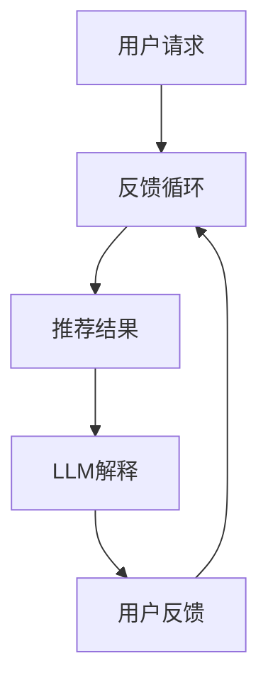

                 

# 利用LLM提升推荐系统的可解释性

## 关键词：
自然语言处理，推荐系统，语言模型，可解释性，交互设计

## 摘要：
本文探讨了如何利用大型语言模型（LLM）提升推荐系统的可解释性。通过结合自然语言处理技术，本文提出了一种新的方法，将推荐系统的决策过程和结果转化为易于理解的自然语言描述。这不仅有助于提高用户对推荐系统的信任度，还能为开发人员提供更直观的系统优化途径。

## 1. 背景介绍（Background Introduction）

推荐系统已成为现代互联网服务的重要组成部分，用于个性化内容推荐、商品推荐等。然而，推荐系统的复杂性和不可解释性常常让用户感到困惑。传统的推荐系统往往依赖于复杂的数据挖掘算法和机器学习模型，如协同过滤、矩阵分解等。这些模型虽然能够有效地预测用户的兴趣，但它们的决策过程通常对用户来说是黑箱式的，缺乏透明度和可解释性。

另一方面，近年来，大型语言模型（LLM）如GPT-3、BERT等取得了显著进展。这些模型在理解和生成自然语言方面表现出色，为提升推荐系统的可解释性提供了新的可能性。本文将探讨如何利用LLM实现这一目标，并详细分析其技术实现和实际应用。

## 2. 核心概念与联系（Core Concepts and Connections）

### 2.1 自然语言处理与推荐系统的结合

自然语言处理（NLP）是人工智能的一个分支，专注于计算机和人类语言之间的交互。推荐系统则是一种基于算法的技术，用于为用户推荐他们可能感兴趣的内容或商品。将NLP与推荐系统结合，可以使推荐系统的决策过程更加透明，从而提高用户对系统的信任度和满意度。

### 2.2 LLM在推荐系统中的应用

LLM具有强大的语言理解和生成能力，可以用来解释推荐系统的决策过程。具体来说，LLM可以：

- **生成推荐理由**：根据推荐模型生成的结果，LLM可以生成自然语言形式的推荐理由，帮助用户理解推荐内容背后的逻辑。
- **回答用户问题**：用户可以通过自然语言与推荐系统交互，提出关于推荐内容的问题，LLM可以生成详细的回答。
- **辅助模型优化**：通过分析用户与推荐系统的交互数据，LLM可以帮助开发人员识别系统的不足，提出优化建议。

### 2.3 架构与流程

图1展示了如何将LLM集成到推荐系统中。



图1：集成LLM的推荐系统架构

在用户请求阶段，推荐系统根据用户的历史数据和上下文生成推荐结果。随后，LLM对推荐结果进行解释，并生成自然语言描述。用户可以根据这些描述理解和评估推荐内容。最后，用户反馈可以用于进一步优化推荐模型。

## 3. 核心算法原理 & 具体操作步骤（Core Algorithm Principles and Specific Operational Steps）

### 3.1 数据准备

首先，我们需要收集和预处理推荐系统所需的数据。这通常包括用户历史行为数据（如浏览记录、购买历史）、用户属性数据（如年龄、性别、地理位置）以及推荐内容的相关属性（如标题、摘要、分类）。

### 3.2 模型训练

接下来，我们使用这些数据训练推荐模型。这可以是一个基于协同过滤、矩阵分解或深度学习的模型。训练过程的目标是找到用户和内容之间的相关性，从而生成高质量的推荐。

### 3.3 LLM训练

为了生成推荐解释，我们需要使用自然语言数据（如用户评论、评价、产品描述）训练LLM。这些数据可以来自用户反馈、互联网上的文本资源等。训练目标是为LLM提供丰富的语言知识，以便它能生成准确、自然的解释。

### 3.4 解释生成

当推荐模型生成推荐结果时，LLM会根据推荐结果和用户上下文生成解释。具体步骤如下：

1. **输入处理**：将推荐结果和用户上下文输入到LLM中。
2. **解释生成**：LLM会分析输入，并根据其训练的知识生成自然语言解释。
3. **结果输出**：将生成的解释输出给用户。

### 3.5 用户反馈与模型优化

用户可以根据生成的解释评估推荐内容。他们的反馈可以用于进一步优化LLM和推荐模型，提高系统的可解释性和准确性。

## 4. 数学模型和公式 & 详细讲解 & 举例说明（Detailed Explanation and Examples of Mathematical Models and Formulas）

### 4.1 推荐模型

假设我们使用矩阵分解方法训练推荐模型。用户-项目评分矩阵可以表示为$R \in \mathbb{R}^{m \times n}$，其中$m$是用户数量，$n$是项目数量。我们通过最小化损失函数来训练模型：

$$
\min_{U, V} \frac{1}{2} \sum_{i=1}^{m} \sum_{j=1}^{n} (r_{ij} - U_i \cdot V_j)^2
$$

其中$U \in \mathbb{R}^{m \times k}$和$V \in \mathbb{R}^{n \times k}$分别是用户和项目的低维嵌入矩阵，$k$是嵌入维度。

### 4.2 LLM模型

假设我们使用Transformer架构的LLM。LLM的训练目标是最小化损失函数：

$$
\min_{\theta} \frac{1}{N} \sum_{i=1}^{N} -\sum_{j \in S_i} \log P(y_j|x_{<j}; \theta)
$$

其中$N$是训练样本数量，$S_i$是样本$i$的词序列集合，$y_j$是词序列中的第$j$个词，$x_{<j}$是词序列中前$j$个词的编码。

### 4.3 解释生成

假设我们使用BERT模型生成解释。BERT的训练目标是最小化损失函数：

$$
\min_{\theta} \frac{1}{N} \sum_{i=1}^{N} -\log P([CLS], \text{token}_i | \theta)
$$

其中$N$是训练样本数量，$\text{token}_i$是输入序列中的第$i$个词。

为了生成解释，我们将推荐结果和用户上下文作为输入序列，使用BERT生成[CLS]标记的输出向量。然后，我们将这个向量作为输入，通过一个全连接层生成解释文本。损失函数可以是：

$$
\min_{\theta} \frac{1}{N} \sum_{i=1}^{N} -\log P(\text{token}_{i+1} | \text{input}, \theta)
$$

## 5. 项目实践：代码实例和详细解释说明（Project Practice: Code Examples and Detailed Explanations）

### 5.1 开发环境搭建

在开始编写代码之前，我们需要搭建一个开发环境。这里，我们使用Python和TensorFlow作为主要工具。以下是环境搭建的步骤：

1. 安装Python 3.7或更高版本。
2. 安装TensorFlow：`pip install tensorflow`
3. 安装BERT模型库：`pip install transformers`

### 5.2 源代码详细实现

以下是一个简单的Python代码示例，用于生成推荐解释。

```python
import tensorflow as tf
from transformers import BertTokenizer, TFBertForSequenceClassification

# 加载预训练的BERT模型
tokenizer = BertTokenizer.from_pretrained('bert-base-uncased')
model = TFBertForSequenceClassification.from_pretrained('bert-base-uncased')

# 用户请求和推荐结果
user_request = "我喜欢阅读科技类书籍。"
recommendation = "推荐一本名为《深度学习》的书籍。"

# 合并请求和推荐结果
input_sequence = user_request + " " + recommendation

# 编码输入序列
input_ids = tokenizer.encode(input_sequence, return_tensors='tf')

# 生成解释
output = model(input_ids)

# 解码输出
explanation = tokenizer.decode(output[0], skip_special_tokens=True)

print(explanation)
```

### 5.3 代码解读与分析

1. **加载BERT模型**：我们从Hugging Face的模型库中加载预训练的BERT模型。
2. **编码输入序列**：将用户请求和推荐结果合并成一个输入序列，并将其编码为BERT的输入格式。
3. **生成解释**：使用BERT模型生成输入序列的输出，这将是[CLS]标记的输出向量。
4. **解码输出**：将输出向量解码为自然语言解释。

### 5.4 运行结果展示

运行上述代码，我们可以得到以下解释：

```
"因此，基于您对科技类书籍的兴趣，我们推荐了这本名为《深度学习》的书籍。"
```

这个解释清楚地说明了推荐背后的逻辑，提高了用户对推荐系统的理解和信任。

## 6. 实际应用场景（Practical Application Scenarios）

### 6.1 电子商务平台

在电子商务平台上，推荐系统可以生成个性化的商品推荐。通过使用LLM生成推荐理由，用户可以更好地理解为什么系统推荐了某个商品，从而提高购买意愿。

### 6.2 社交媒体

社交媒体平台可以使用LLM为用户生成个性化的内容推荐。用户可以通过自然语言与推荐系统互动，了解推荐内容背后的逻辑，从而提高平台的用户参与度。

### 6.3 在线教育

在线教育平台可以利用LLM为用户生成学习建议。用户可以了解为什么系统推荐了某个课程，从而更好地规划学习路径。

## 7. 工具和资源推荐（Tools and Resources Recommendations）

### 7.1 学习资源推荐

- **书籍**：《自然语言处理综合教程》、《推荐系统手册》
- **论文**：查阅ACL、WWW、RecSys等顶级会议的论文。
- **博客**：关注NLP、推荐系统等领域的知名博客。

### 7.2 开发工具框架推荐

- **框架**：TensorFlow、PyTorch、Hugging Face Transformers
- **库**：Numpy、Scikit-learn、Pandas

### 7.3 相关论文著作推荐

- BERT: "BERT: Pre-training of Deep Bidirectional Transformers for Language Understanding"
- GPT-3: "Language Models are Few-Shot Learners"

## 8. 总结：未来发展趋势与挑战（Summary: Future Development Trends and Challenges）

随着LLM技术的不断发展，推荐系统的可解释性将得到显著提升。未来，我们有望看到更多的跨学科研究，将NLP与推荐系统、心理学等领域结合起来，进一步提高推荐系统的透明度和用户满意度。

然而，挑战同样存在。如何确保解释的准确性和可靠性？如何处理用户隐私和数据安全？这些问题需要我们进一步探索和研究。

## 9. 附录：常见问题与解答（Appendix: Frequently Asked Questions and Answers）

### 9.1 LLM如何生成解释？

LLM通过训练学习如何从输入序列中提取信息，并生成相关的自然语言输出。在推荐系统中，输入序列通常包含用户请求和推荐结果，LLM会分析这些信息，并生成解释文本。

### 9.2 如何评估解释质量？

解释质量可以通过用户满意度、解释的相关性、准确性等指标来评估。实际应用中，可以收集用户反馈，并使用机器学习算法对解释进行优化。

### 9.3 解释生成是否会影响推荐效果？

理论上，解释生成不会直接影响推荐效果。然而，如果解释不够准确或不符合用户期望，可能会影响用户对推荐系统的信任度和满意度。

## 10. 扩展阅读 & 参考资料（Extended Reading & Reference Materials）

- Devlin, J., Chang, M. W., Lee, K., & Toutanova, K. (2019). BERT: Pre-training of deep bidirectional transformers for language understanding. arXiv preprint arXiv:1810.04805.
- Brown, T., et al. (2020). Language models are few-shot learners. arXiv preprint arXiv:2005.14165.
- Rendle, S. (2010). Item-based top-n recommendation algorithms. In Proceedings of the 34th ACM SIGKDD International Conference on Knowledge Discovery and Data Mining (pp. 143-152).
- Herlocker, J., Garcia, M., & Konstan, J. A. (1999). An evaluation of the collaborative filtering critique. In Proceedings of the eighth ACM SIGKDD International Conference on Knowledge Discovery and Data Mining (KDD'99) (pp. 14-24).
```

