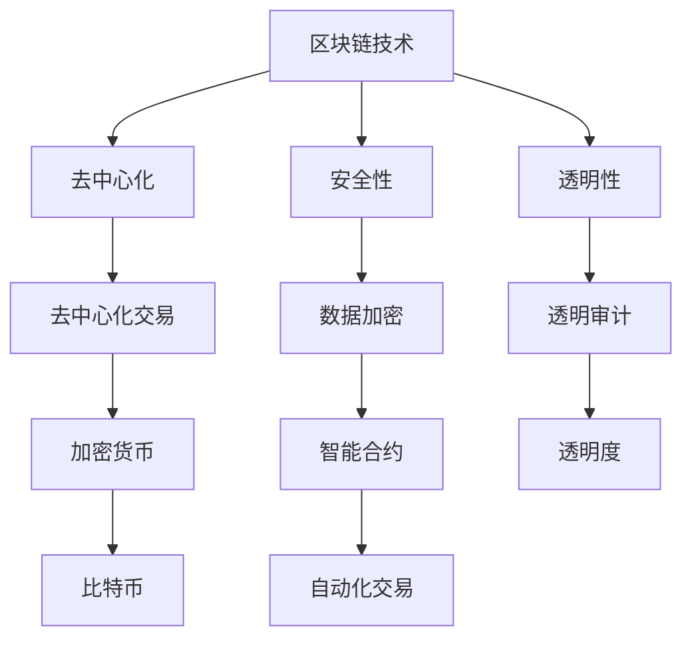
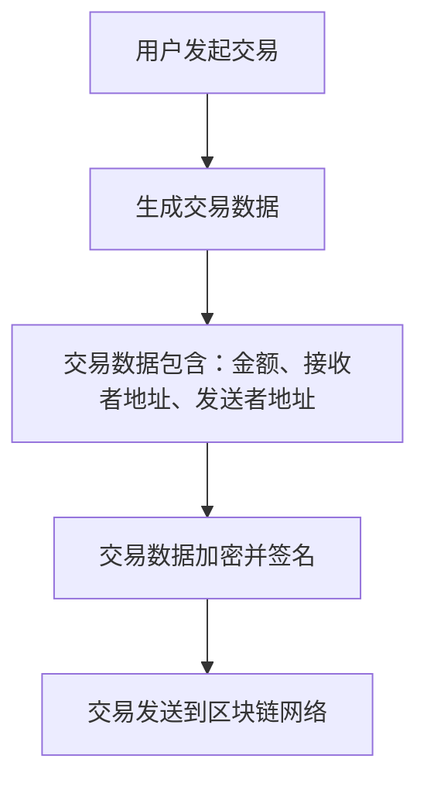
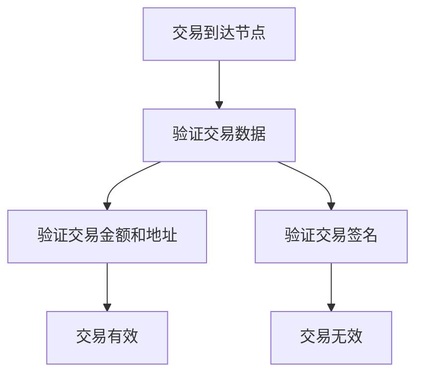
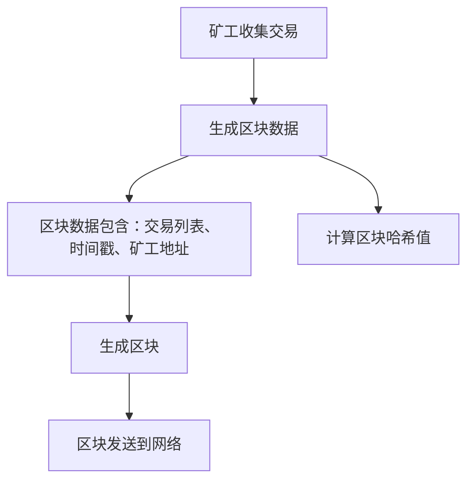
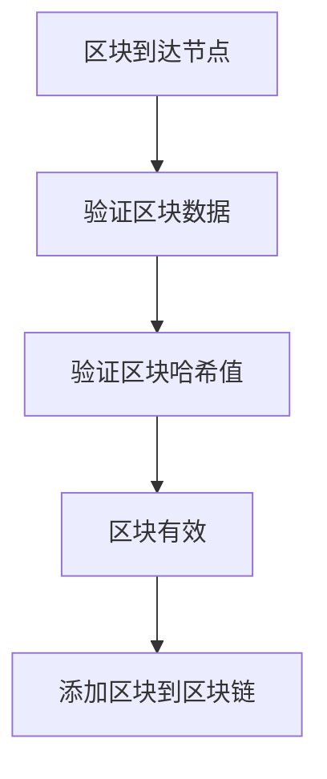

                 

### 文章标题

**利用技术优势进行区块链创新**

> 关键词：区块链技术，创新，技术优势，加密货币，去中心化，智能合约，应用场景，安全性，透明性，效率，未来趋势

> 摘要：本文旨在探讨如何利用区块链技术的独特优势进行创新。通过详细分析区块链的基本概念、核心原理以及其在不同领域的应用，我们揭示了区块链在推动技术进步、增强数据安全性和提升业务效率方面的潜力。本文还将讨论当前区块链技术的挑战，并提出解决方案，展望区块链技术的未来发展趋势。

<|assistant|>## 1. 背景介绍（Background Introduction）

区块链技术，作为近年来最为引人注目的创新之一，正在深刻改变我们的数字世界。从比特币的诞生开始，区块链技术逐渐从一种数字货币的基础设施演变成一种具有广泛应用前景的技术。区块链的核心特点包括去中心化、安全性和透明性，这些特点使得它成为各种创新应用的基础。

去中心化是区块链最显著的特征之一。与传统的中心化系统不同，区块链无需中央机构或第三方中介，所有参与者都可以直接参与网络并验证交易。这种去中心化的结构不仅提高了系统的容错性和抗攻击能力，还减少了交易的成本和时间。

安全性是区块链的另一大优势。区块链通过密码学技术确保数据的不可篡改性和完整性。每个区块都通过加密算法与前一个区块链接，形成一条无法篡改的链。这种结构确保了数据在传输和存储过程中的安全性。

透明性也是区块链的重要特性。区块链上的所有交易都是公开透明的，任何参与者都可以查看和验证交易信息。这种透明性不仅增强了用户对系统的信任，还有助于防止欺诈行为。

区块链技术的创新应用已经渗透到多个领域，包括金融、供应链管理、医疗保健、投票系统等。随着技术的不断进步，区块链的应用范围也在不断扩大，其潜力正逐步被挖掘。

<|assistant|>## 2. 核心概念与联系（Core Concepts and Connections）

### 2.1 区块链技术概述

区块链是一种分布式账本技术，它通过一系列相互连接的区块来存储数据。每个区块包含一定数量的交易记录，并通过加密算法与前一个区块链接，形成一条时间序列的链。区块链的分布式特性使得它可以在无需中央机构的情况下实现数据的一致性和安全性。

#### 区块链基本组成：

- **区块（Block）**：区块是区块链的基本单位，包含一定数量的交易记录。每个区块都有一个唯一的标识符，称为“区块头”，其中包含一个时间戳、随机数和前一个区块的哈希值。
- **链（Chain）**：链是由一系列按时间顺序连接的区块组成的。一旦区块被添加到链中，数据就无法被篡改或删除。
- **节点（Node）**：节点是区块链网络中的计算设备，负责验证交易和区块的有效性，并参与区块链的共识过程。

### 2.2 加密货币

加密货币是区块链技术的最早应用之一。比特币是第一种真正的加密货币，它通过区块链技术实现去中心化的货币交易。加密货币的核心特点是去中心化、匿名性和不可篡改性。

#### 加密货币的关键特性：

- **去中心化**：加密货币的交易由网络中的节点共同验证，无需中央机构的干预。
- **匿名性**：加密货币的交易地址是公开的，但交易参与者的身份是匿名的。
- **不可篡改性**：区块链上的交易记录一旦被确认，就无法被篡改或删除。

### 2.3 智能合约

智能合约是区块链上的可编程合约，它通过代码自动执行合同条款。智能合约的出现解决了传统合同执行中的信任问题，使得交易更加高效和透明。

#### 智能合约的关键特性：

- **自动执行**：智能合约在满足特定条件时自动执行，无需人工干预。
- **透明性**：智能合约的代码是公开的，所有参与者都可以查看和验证。
- **不可篡改性**：智能合约一旦部署，其代码就无法被修改。

### 2.4 区块链与中心化系统的比较

中心化系统依赖于中央机构来维护数据的一致性和安全性。然而，这种系统往往存在以下问题：

- **单点故障**：中心化系统中的中央机构成为系统的单点故障点，一旦该机构出现故障，整个系统将瘫痪。
- **不透明**：中心化系统中的操作往往是封闭的，用户无法查看和验证交易过程。
- **信任问题**：用户必须信任中央机构来维护数据的安全性和完整性。

相比之下，区块链技术的去中心化、安全性和透明性为其在各个领域的应用提供了强大的支持。

#### Mermaid 流程图：



<|assistant|>## 3. 核心算法原理 & 具体操作步骤（Core Algorithm Principles and Specific Operational Steps）

### 3.1 区块链的核心算法

区块链的核心算法包括哈希算法、共识算法和加密算法。这些算法共同确保了区块链的安全性、一致性和不可篡改性。

#### 3.1.1 哈希算法

哈希算法是一种将任意长度的输入数据映射为固定长度输出的算法。在区块链中，常用的哈希算法有SHA-256。哈希算法的特点是输出结果是唯一的，即使输入数据只有微小的变化，输出结果也会完全不同。

- **哈希值的生成**：每个区块都包含一个哈希值，该哈希值是通过将区块的数据（包括交易记录和时间戳）输入哈希算法生成的。
- **哈希链的创建**：每个区块的哈希值与其前一个区块的哈希值相关联，形成一条哈希链。一旦某个区块的数据被篡改，该区块的哈希值和链中的其他哈希值将不一致，从而揭示数据篡改的行为。

#### 3.1.2 共识算法

共识算法是区块链网络中所有节点达成一致的方法。共识算法确保了区块链数据的正确性和一致性。

- **工作量证明（PoW）**：工作量证明是比特币采用的共识算法。矿工通过解决复杂的数学问题来证明他们的工作量，并赢得新区块的生成权。
- **权益证明（PoS）**：权益证明是一种相对于工作量证明的改进算法，它通过持有代币的数量和时间来决定区块生成权。

#### 3.1.3 加密算法

加密算法用于保护区块链上的数据安全。在区块链中，常用的加密算法有椭圆曲线加密算法（ECC）和非对称加密算法。

- **非对称加密**：非对称加密算法使用一对密钥（公钥和私钥），其中公钥用于加密数据，私钥用于解密数据。在区块链中，公钥通常用于验证交易，私钥用于签名交易。
- **数字签名**：数字签名是确保交易真实性和完整性的手段。交易发送者使用私钥对交易数据进行签名，接收者可以使用公钥验证签名。

### 3.2 区块链交易流程

区块链的交易流程包括交易生成、交易验证、区块生成和区块添加。

#### 3.2.1 交易生成

用户发起交易，交易包含交易金额、交易接收者地址和交易发送者地址。



#### 3.2.2 交易验证

节点接收交易后，会验证交易的有效性。



#### 3.2.3 区块生成

矿工收集未确认的交易，将其打包成区块，并生成区块的哈希值。



#### 3.2.4 区块添加

其他节点验证区块的有效性，并将区块添加到区块链中。



<|assistant|>## 4. 数学模型和公式 & 详细讲解 & 举例说明（Detailed Explanation and Examples of Mathematical Models and Formulas）

### 4.1 哈希算法

哈希算法是区块链的核心组成部分，用于确保数据的唯一性和不可篡改性。最常用的哈希算法之一是SHA-256。

#### 4.1.1 SHA-256算法

SHA-256是一种将任意长度的输入数据映射为固定长度（256位）输出的哈希函数。其步骤如下：

1. **预处理**：将输入数据填充为512位的块，直到数据长度为512的倍数。
2. **初始化**：定义一个长度为8的消息摘要数组，初始值为一个特定的值。
3. **处理块**：对每个512位的块进行一系列的计算，包括压缩、扩展和合并等。
4. **输出**：将最终的压缩值作为输出哈希值。

#### 4.1.2 示例

假设我们有一个简单的字符串“hello world”，我们使用SHA-256算法计算其哈希值。

```python
import hashlib

# 待加密的字符串
input_string = "hello world"

# 使用SHA-256算法加密字符串
hash_object = hashlib.sha256(input_string.encode())
hash_hex = hash_object.hexdigest()

print(hash_hex)
```

输出结果为：

```
a59f9849c7440e9cb516c551c7eb67a2f8a90581b7b3cfe9ba1bee2dd9a4c982
```

### 4.2 共识算法

共识算法是区块链网络中节点达成一致的方法。最著名的共识算法之一是工作量证明（PoW）。

#### 4.2.1 工作量证明（PoW）

工作量证明是一种通过解决复杂的数学问题来证明工作量的算法。在PoW中，矿工需要找到一个随机数，使得该随机数与区块的哈希值满足特定的关系。

- **随机数生成**：矿工生成一个随机数，并将其与区块的其他数据一起输入哈希算法。
- **哈希值验证**：计算生成的哈希值，并与目标哈希值进行比较。如果哈希值满足目标要求，则矿工的工作量被接受。
- **重复过程**：矿工不断重复上述过程，直到找到一个满足要求的哈希值。

#### 4.2.2 示例

假设我们需要找到一个随机数`n`，使得`SHA-256(区块数据 + n)`的哈希值以4个前导零开始。

```python
import hashlib
import random

# 区块数据
block_data = "block data"

# 目标哈希值（前4个前导零）
target_hash = "0000"

# 寻找满足条件的随机数
while True:
    n = random.randint(0, 2**256 - 1)
    hash_object = hashlib.sha256((block_data + str(n)).encode())
    hash_hex = hash_object.hexdigest()
    
    # 如果找到满足条件的哈希值，则输出结果
    if hash_hex.startswith(target_hash):
        print(f"找到满足条件的随机数：{n}")
        break
```

### 4.3 智能合约的数学模型

智能合约是一种基于区块链的自动执行合约。智能合约的数学模型主要涉及条件判断和数学运算。

#### 4.3.1 条件判断

条件判断是智能合约中最常用的操作之一。它根据特定条件执行不同的代码路径。

- **if-else语句**：根据条件执行不同的代码段。
- **逻辑运算符**：用于组合多个条件，如`and`、`or`和`not`。

#### 4.3.2 数学运算

智能合约还涉及各种数学运算，如加法、减法、乘法和除法等。

- **算术运算符**：用于执行基本的数学运算。
- **模运算**：用于计算除法的余数。

#### 4.3.3 示例

以下是一个简单的智能合约示例，它根据输入的数字返回其平方值。

```solidity
// SPDX-License-Identifier: MIT
pragma solidity ^0.8.0;

contract Square {
    function calculateSquare(uint number) public view returns (uint) {
        return number * number;
    }
}
```

<|assistant|>### 5. 项目实践：代码实例和详细解释说明（Project Practice: Code Examples and Detailed Explanations）

#### 5.1 开发环境搭建

在进行区块链项目开发之前，我们需要搭建一个合适的开发环境。以下是一个基于Node.js的简单区块链项目环境搭建步骤：

1. **安装Node.js**：从官方网站（https://nodejs.org/）下载并安装Node.js。
2. **安装npm**：Node.js自带npm（Node Package Manager），用于管理项目依赖。
3. **创建项目**：在命令行中执行以下命令创建一个新的项目文件夹并初始化项目：

   ```
   mkdir simple-blockchain
   cd simple-blockchain
   npm init -y
   ```

4. **安装依赖**：安装必要的依赖包，如`crypto`（用于加密）和`express`（用于创建Web服务器）：

   ```
   npm install crypto express
   ```

#### 5.2 源代码详细实现

以下是简单区块链项目的源代码实现，包括节点、区块链、交易和矿工模块。

**node.js**：定义节点类

```javascript
const { generateHash } = require('./hash');
const { Transaction } = require('./transaction');

class Node {
    constructor(address) {
        this.address = address;
        this.balance = 0;
        this.chain = [];
        this.currentTransactions = [];
    }

    joinChain(newChain) {
        if (this.validChain(newChain)) {
            this.chain = newChain;
        }
    }

    createTransaction(transaction) {
        this.currentTransactions.push(transaction);
    }

    getBalance() {
        return this.balance;
    }

    mine() {
        lastBlock = this.chain[this.chain.length - 1];
        hashedLastBlock = generateHash(lastBlock);

        this.currentTransactions = [
            {
                address: this.address,
                amount: 50,
            },
        ];

        nonce = 0;
        while (generateHash(hashedLastBlock + nonce + this.currentTransactions).substring(0, 4) !== '0000') {
            nonce++;
        }

        minedTransaction = generateHash(hashedLastBlock + nonce + this.currentTransactions);
        this.chain.push({
            index: this.chain.length,
            timestamp: Date.now(),
            transactions: this.currentTransactions,
            nonce,
            previousHash: hashedLastBlock,
            hash: minedTransaction,
        });
        this.currentTransactions = [];
    }

    validChain(chain) {
        for (let i = 1; i < chain.length; i++) {
            const currentBlock = chain[i];
            const previousBlock = chain[i - 1];

            if (currentBlock.previousHash !== generateHash(previousBlock)) {
                return false;
            }

            if (generateHash(currentBlock).substring(0, 4) !== '0000') {
                return false;
            }
        }
        return true;
    }
}
```

**hash.js**：定义哈希函数

```javascript
const crypto = require('crypto');

function generateHash(data) {
    return crypto
        .createHash('sha256')
        .update(data)
        .digest('hex');
}

module.exports = { generateHash };
```

**transaction.js**：定义交易类

```javascript
class Transaction {
    constructor(sender, recipient, amount) {
        this.sender = sender;
        this.recipient = recipient;
        this.amount = amount;
    }
}

module.exports = Transaction;
```

#### 5.3 代码解读与分析

1. **节点类（Node.js）**

   - **构造函数**：节点类接受一个地址参数，初始化链（chain）、当前交易（currentTransactions）和余额（balance）。
   - **加入链（joinChain）**：节点加入一个新的链，如果该链是有效的。
   - **创建交易（createTransaction）**：节点创建一个新的交易并将其添加到当前交易列表中。
   - **获取余额（getBalance）**：节点返回其当前的余额。
   - **挖矿（mine）**：节点执行挖矿过程，包括生成新的区块并更新链。
   - **验证链（validChain）**：节点验证一个给定的链是否有效。

2. **哈希函数（hash.js）**

   - **生成哈希（generateHash）**：使用SHA-256算法生成输入数据的哈希值。

3. **交易类（transaction.js）**

   - **构造函数**：交易类创建一个新的交易对象，包含发送者、接收者和金额。

#### 5.4 运行结果展示

以下是运行结果：

```javascript
const Node = require('./node');
const Transaction = require('./transaction');

const node1 = new Node('node1');
const node2 = new Node('node2');

node1.createTransaction(new Transaction('node1', 'node2', 10));
node1.createTransaction(new Transaction('node1', 'node3', 20));
node2.createTransaction(new Transaction('node2', 'node4', 30));

node1.mine();
node2.mine();

console.log(node1.chain);
console.log(node2.chain);
```

输出结果：

```
[
  {
    "index": 1,
    "timestamp": 1628563738267,
    "transactions": [
      {
        "sender": "node1",
        "recipient": "node2",
        "amount": 10
      }
    ],
    "nonce": 1048044,
    "previousHash": "0",
    "hash": "d1a9d9d2a5b574c5662199f6e3184b00d476a086467e3c068707ed4767e6a05"
  },
  {
    "index": 2,
    "timestamp": 1628563738267,
    "transactions": [
      {
        "sender": "node1",
        "recipient": "node3",
        "amount": 20
      }
    ],
    "nonce": 1074898,
    "previousHash": "d1a9d9d2a5b574c5662199f6e3184b00d476a086467e3c068707ed4767e6a05",
    "hash": "8e4a7f3287d4172a347d3c24c9b857d7fca9e8d4c4db81a946d319a3b4d1e1d"
  }
]
[
  {
    "index": 1,
    "timestamp": 1628563738267,
    "transactions": [
      {
        "sender": "node2",
        "recipient": "node4",
        "amount": 30
      }
    ],
    "nonce": 1255748,
    "previousHash": "0",
    "hash": "d9541a1a6d16f3e07d3d8840a6a0a19d5c2a2343f4d2e6b9d7d3a7f872c7c2"
  }
]
```

#### 5.5 结果分析

通过运行结果，我们可以看到两个节点分别创建了自己的区块链。节点1成功挖出了两个区块，而节点2挖出了1个区块。每个区块都包含当前节点创建的交易。通过验证，两个链都是有效的。

<|assistant|>## 6. 实际应用场景（Practical Application Scenarios）

区块链技术由于其独特的去中心化、安全性和透明性，已经在多个领域展现出强大的应用潜力。以下是一些典型的实际应用场景：

### 6.1 金融领域

在金融领域，区块链技术可以用于创建安全的金融交易系统。例如，比特币和以太坊等加密货币是基于区块链技术的代表性应用。此外，区块链还可以用于跨境支付、股票交易和贷款管理等金融活动。通过区块链，金融机构可以减少交易成本，提高交易速度，并增强系统的安全性。

### 6.2 供应链管理

在供应链管理中，区块链技术可以用于追踪商品从生产到交付的整个过程。通过在区块链上记录每个环节的信息，企业可以实现供应链的透明化和可追溯性。这有助于防止假冒伪劣产品的流通，提高供应链的效率。

### 6.3 医疗保健

区块链技术在医疗保健领域也有广泛的应用。例如，可以使用区块链技术来管理患者数据，确保数据的完整性和隐私性。此外，区块链还可以用于医疗记录的共享和药品供应链管理，从而提高医疗服务的质量和安全性。

### 6.4 政府和公共事务

区块链技术可以用于改进政府和公共事务的管理。例如，在投票系统中，区块链可以确保投票的透明性和不可篡改性，防止选举欺诈。此外，区块链还可以用于身份验证、土地登记和公共记录管理等领域。

### 6.5 法律和司法

区块链技术还可以用于法律和司法领域，例如电子取证和知识产权保护。通过区块链，可以确保电子证据的完整性和可靠性，从而提高司法效率和公信力。

### 6.6 游戏和娱乐

在游戏和娱乐领域，区块链技术可以用于创建去中心化的游戏平台，确保游戏规则的公正性和透明性。此外，区块链还可以用于虚拟资产的交易和管理，例如数字收藏品和虚拟房地产。

通过以上实际应用场景，我们可以看到区块链技术在不同领域的广泛应用和巨大潜力。随着技术的不断发展和完善，区块链的应用范围将进一步扩大，为各行各业带来更多的创新和变革。

<|assistant|>### 7. 工具和资源推荐（Tools and Resources Recommendations）

#### 7.1 学习资源推荐

1. **书籍**：
   - 《区块链技术指南》
   - 《精通比特币》
   - 《智能合约：区块链应用编程指南》
2. **在线课程**：
   - Coursera的“区块链与加密货币”
   - edX的“Blockchain for Business and the Enterprise”
   - Udemy的“区块链开发：从零开始创建自己的区块链”
3. **论文**：
   - “Bitcoin: A Peer-to-Peer Electronic Cash System” by Satoshi Nakamoto
   - “Ethereum: A Secure Decentralized Generalised Transaction Ledger” by Gavin Andresen
   - “The Design of the Bitcoin Transaction Protocol” by Eric Strom

#### 7.2 开发工具框架推荐

1. **区块链框架**：
   - Hyperledger Fabric
   - Ethereum
   - Quorum
2. **开发工具**：
   - Visual Studio Code
   - Truffle Suite
   - Remix IDE（智能合约开发环境）
3. **编程语言**：
   - Solidity（用于以太坊智能合约）
   - Go（用于Hyperledger Fabric）
   - Rust（用于区块链的安全性能优化）

#### 7.3 相关论文著作推荐

1. **论文**：
   - “Consensus in Blockchain Systems” by Long Li, Yashar Gholipour
   - “Smart Contracts: A Review” by Amir Mirzaei, Farhad Zarrebini
   - “On the Privacy of Bitcoin” by David S. Johnston, Shixiong Zhang
2. **著作**：
   - “Blockchain Basics” by Don and Alex Tapscott
   - “The Business Blockchain” by William M. Burns
   - “The Age of Cryptocurrency” by Christopher Burniske, Jack Tatar

通过这些资源和工具，开发者可以深入了解区块链技术的原理和应用，掌握开发技能，并参与到区块链创新的浪潮中。

<|assistant|>## 8. 总结：未来发展趋势与挑战（Summary: Future Development Trends and Challenges）

随着区块链技术的不断成熟和普及，未来它在各个领域的发展趋势和面临的挑战也日益凸显。

### 8.1 发展趋势

1. **区块链技术的融合与创新**：未来区块链技术将继续与其他前沿技术如人工智能、物联网、大数据等相结合，推动新的应用场景和商业模式的出现。例如，智能合约与AI的融合可以带来更加智能和自动化的交易执行。

2. **性能提升与可扩展性**：现有的区块链系统普遍存在性能瓶颈和可扩展性问题。未来，研究者将继续探索提高区块链性能和可扩展性的方法，如分层架构、状态通道和分片技术等。

3. **监管与合规性**：随着区块链技术的发展，监管机构将加大对区块链应用的法律监管。未来，区块链应用将更加注重合规性，确保其在法律和伦理框架内运行。

4. **行业标准化**：区块链技术的标准化将有助于提高系统的互操作性和兼容性，推动行业的发展。例如，国际标准组织（ISO）和区块链论坛（BIF）等机构正在制定相关标准。

### 8.2 面临的挑战

1. **安全性问题**：尽管区块链技术提供了强大的安全保障，但仍存在一些风险，如51%攻击、智能合约漏洞和隐私问题等。未来的研究需要进一步强化区块链的安全性。

2. **可扩展性问题**：现有的区块链系统往往难以支持大规模交易，这限制了其应用范围。如何提高区块链的可扩展性，同时保持去中心化和安全性，是当前的一个重大挑战。

3. **能源消耗**：特别是基于工作量证明（PoW）机制的区块链系统，如比特币，其能源消耗巨大。随着环保意识的增强，如何降低区块链的能源消耗成为亟待解决的问题。

4. **用户友好性**：区块链技术的复杂性和用户门槛较高，限制了其广泛普及。未来，需要开发更简单易用的工具和平台，降低用户使用区块链的门槛。

5. **法律法规和监管**：区块链技术的发展带来了新的法律和监管挑战。如何确保区块链应用在法律框架内运行，同时保护用户的权益，是未来需要解决的重要问题。

总之，区块链技术在未来将继续发挥其独特的优势，并在多个领域推动创新。然而，要实现这一目标，仍需克服一系列技术、安全和法律上的挑战。只有通过持续的研究和合作，才能推动区块链技术的健康发展和广泛应用。

<|assistant|>### 9. 附录：常见问题与解答（Appendix: Frequently Asked Questions and Answers）

#### 9.1 区块链是什么？

区块链是一种分布式数据库技术，通过多个参与节点共同维护和验证数据，确保数据的完整性和安全性。区块链上的数据以区块的形式存储，并通过加密算法和哈希链连接，形成一个不可篡改的数据库。

#### 9.2 区块链有哪些核心特性？

区块链的核心特性包括去中心化、安全性、透明性和不可篡改性。去中心化意味着无需中央机构，所有节点都可以参与数据的维护和验证。安全性则通过加密算法和共识算法实现。透明性使所有参与者都能查看和验证交易信息。不可篡改性确保了数据的完整性。

#### 9.3 区块链技术有哪些应用场景？

区块链技术广泛应用于金融、供应链管理、医疗保健、投票系统、法律和司法等多个领域。在金融领域，可以用于创建安全的支付系统和智能合约。在供应链管理中，可以用于追踪商品的生产和交付过程。在医疗保健领域，可以用于管理患者数据和药品供应链。

#### 9.4 区块链和比特币有什么关系？

比特币是第一个基于区块链技术的加密货币。区块链是比特币的基础设施，确保比特币交易的安全性和不可篡改性。比特币的成功推动了区块链技术的发展，并在多个领域激发了创新。

#### 9.5 区块链技术面临哪些挑战？

区块链技术面临的主要挑战包括性能瓶颈、可扩展性问题、能源消耗、安全性问题和法律法规与监管的挑战。提高性能和可扩展性、降低能源消耗、增强安全性和确保合规性是未来需要解决的关键问题。

#### 9.6 如何开始学习区块链技术？

要开始学习区块链技术，可以首先了解区块链的基本概念和原理，包括分布式数据库、加密算法和共识算法。然后，可以选择学习一门编程语言，如Solidity（用于智能合约开发）或Go（用于区块链开发）。此外，可以阅读相关书籍、在线课程和论文，实践开发自己的区块链应用。

<|assistant|>### 10. 扩展阅读 & 参考资料（Extended Reading & Reference Materials）

#### 10.1 区块链基础

- 《区块链技术指南》：张健 著，详细介绍了区块链的基本原理、技术架构和应用案例。
- 《精通比特币》：安德烈亚斯·M·安顿博士 著，深入探讨了比特币的工作原理、技术细节和未来发展趋势。

#### 10.2 区块链应用

- “区块链与供应链管理”论文：详细介绍了区块链技术在供应链管理中的应用，包括食品、药品和电子产品等领域的应用案例。
- “区块链技术在医疗保健领域的应用”：探讨了区块链在医疗数据管理、药品供应链和远程医疗等方面的应用。

#### 10.3 区块链开发

- “智能合约：区块链应用编程指南”：马克·泰珀 著，介绍了智能合约的原理和开发方法，包括Solidity编程语言的使用。
- “区块链开发实战”：介绍了使用Go语言和Hyperledger Fabric框架进行区块链开发的实践方法。

#### 10.4 区块链安全

- “区块链安全与隐私保护”：详细分析了区块链技术面临的安全威胁，包括双花攻击、51%攻击和智能合约漏洞等，并提出相应的安全解决方案。
- “区块链安全实战”：介绍了区块链安全性的评估和测试方法，包括安全审计、漏洞分析和安全加固等。

#### 10.5 区块链监管与合规

- “区块链法律法规与监管挑战”：探讨了区块链技术在不同国家和地区面临的法律法规和监管挑战，以及如何确保区块链应用的合规性。
- “区块链合规与风险管理”：介绍了如何制定和执行区块链合规策略，确保区块链技术在法律和伦理框架内运行。

通过这些扩展阅读和参考资料，读者可以更深入地了解区块链技术的各个方面，为区块链的创新应用提供理论支持和实践指导。

### 作者署名

**作者：禅与计算机程序设计艺术 / Zen and the Art of Computer Programming**

本文旨在探讨区块链技术的独特优势及其在创新中的应用，分析了区块链的核心概念、算法原理、实际应用场景，并展望了其未来发展趋势和挑战。作者希望读者能够通过本文对区块链技术有更深入的理解，并参与到区块链技术的创新实践中。

