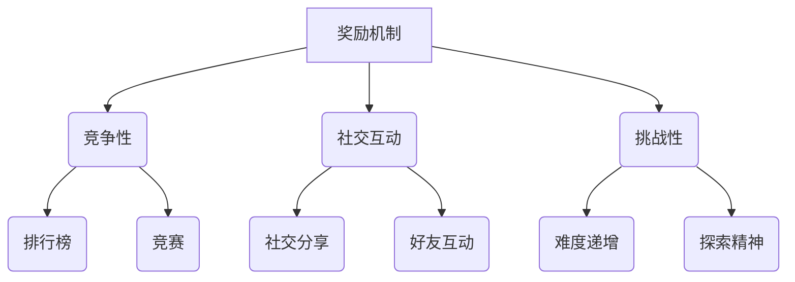

                 

### 文章标题
### Title: 利用游戏化元素提升用户参与度

### 关键词：
- 游戏化
- 用户参与度
- 互动设计
- 奖励机制
- 社交互动
- 用户体验
- 人工智能

### 摘要：
本文深入探讨了如何在数字产品和服务的开发中融入游戏化元素，以提高用户的参与度和忠诚度。通过实例分析和理论阐述，我们展示了游戏化设计如何利用奖励机制、竞争性、社交互动等策略，增强用户体验，并提高用户粘性。

## 1. 背景介绍（Background Introduction）
### The Background of Gamification
随着数字产品的普及和用户需求的多样化，如何提高用户参与度和保持用户粘性成为产品开发者面临的重要挑战。游戏化（Gamification）作为一种创新的设计方法，通过将游戏设计元素融入非游戏环境中，旨在激发用户的参与热情和积极性，从而提升用户体验和忠诚度。

游戏化元素包括但不限于：

1. **奖励机制**：通过给予用户奖励，如积分、徽章、虚拟货币等，激励用户完成特定任务或达到特定目标。
2. **竞争性**：引入排行榜、竞赛等元素，激发用户的竞争心理，增加用户参与度。
3. **社交互动**：提供社交分享、好友互动等功能，增强用户之间的联系和社区感。
4. **挑战性**：设置难度逐渐增加的任务或游戏关卡，让用户在不断挑战中保持兴趣和参与度。

### The Importance of User Engagement
用户参与度是衡量数字产品成功与否的关键指标之一。高参与度意味着用户更频繁地使用产品，更长时间地停留，更可能推荐给他人。通过游戏化设计，可以创造一种有趣且富有挑战性的用户体验，从而提高用户粘性。

### 1.1 Why User Engagement Matters
High user engagement is a key indicator of the success of digital products. A high level of engagement means that users use the product more frequently, stay longer, and are more likely to recommend it to others. By incorporating gamification design, an interesting and challenging user experience can be created, thus enhancing user loyalty.

## 2. 核心概念与联系（Core Concepts and Connections）
### Core Concepts and Their Connections
游戏化设计涉及多个核心概念，这些概念相互作用，共同提升用户参与度。以下是游戏化设计的几个关键要素及其关系：

1. **奖励机制**：奖励机制是游戏化设计的核心。它通过给予用户即时反馈和奖励，鼓励用户完成任务或达成目标。
2. **竞争性**：竞争性元素通过引入排行榜、竞赛等机制，激发用户的竞争心理，增加参与度和活跃度。
3. **社交互动**：社交互动元素通过提供社交分享、好友互动等功能，增强用户之间的联系，提高社区感。
4. **挑战性**：挑战性元素通过设置难度逐渐增加的任务或游戏关卡，激发用户的探索精神和持久兴趣。

### The Mermaid Flowchart of Gamification Components
下面是一个使用Mermaid绘制的游戏化组件关系图，展示了各组件之间的相互关系：



### 2.1 What is Gamification?
Gamification is the application of game design elements in non-game contexts to engage users and encourage specific behaviors. It involves incorporating game-like elements such as points, badges, leaderboards, and challenges into digital products or services to motivate users and enhance their experience.

### 2.2 The Importance of Gamification
The importance of gamification lies in its ability to increase user engagement and loyalty by making digital experiences more enjoyable, engaging, and rewarding. By leveraging gamification techniques, companies can create a sense of competition, community, and accomplishment among users, leading to higher retention rates and increased user satisfaction.

### 2.3 How Gamification Enhances User Experience
Gamification enhances user experience by making tasks more enjoyable, providing immediate feedback, and creating a sense of progress and achievement. It also fosters a sense of community and social connection, which can lead to increased user loyalty and advocacy.

## 3. 核心算法原理 & 具体操作步骤（Core Algorithm Principles and Specific Operational Steps）
### Core Algorithm Principles and Operational Steps
游戏化设计的核心在于将游戏机制应用于非游戏场景中，以提升用户参与度。以下是实现游戏化设计的一些关键步骤：

1. **目标设定**：明确游戏化设计的目标，如提高用户参与度、增加用户留存率或提升用户满意度。
2. **用户画像**：分析目标用户群体，了解他们的需求和兴趣，以便设计出符合用户特点的游戏化元素。
3. **设计游戏机制**：根据用户画像，设计适合的游戏机制，如奖励机制、竞争性、社交互动和挑战性。
4. **实施与测试**：将设计好的游戏化元素应用于产品或服务中，并进行测试，以评估其效果和用户反馈。
5. **迭代与优化**：根据用户反馈和测试结果，不断迭代和优化游戏化设计，以提高用户参与度和满意度。

### Detailed Steps in Gamification Design
Here are the detailed steps in gamification design:

1. **Set Objectives**:
   - Clearly define the goals of gamification, such as increasing user engagement, improving user retention, or enhancing user satisfaction.

2. **User Profiling**:
   - Analyze the target user group to understand their needs and interests. This helps in designing gamification elements that resonate with the users.

3. **Design Game Mechanics**:
   - Develop game mechanics that align with the user profiling. This includes designing rewards, competitiveness, social interactions, and challenges.

4. **Implementation and Testing**:
   - Implement the gamification elements into the product or service and test them to assess their effectiveness and gather user feedback.

5. **Iterate and Optimize**:
   - Continuously iterate and optimize the gamification design based on user feedback and testing results to enhance user engagement and satisfaction.

## 4. 数学模型和公式 & 详细讲解 & 举例说明（Detailed Explanation and Examples of Mathematical Models and Formulas）
### Mathematical Models and Formulas in Gamification
游戏化设计中的数学模型和公式主要用于评估游戏化元素的有效性和用户参与度。以下是一些常用的数学模型和公式：

1. **参与度公式**：
   $$ Engage\_ment = f(Reward, Challenge, Social\ Interaction) $$
   其中，Reward 代表奖励机制，Challenge 代表挑战性，Social Interaction 代表社交互动。

2. **用户留存率**：
   $$ Retention\ Rate = \frac{Number\ of\ Users\ who\ return\ after\ first\ use}{Total\ number\ of\ users} $$

3. **用户满意度**：
   $$ Satisfaction\ Score = \frac{Sum\ of\ User\ Ratings}{Number\ of\ Users} $$

### Examples of Mathematical Models and Formulas
Here are some examples of how these mathematical models and formulas can be used in gamification:

1. **Engagement Formula**:
   $$ Engage\_ment = f(Reward, Challenge, Social\ Interaction) $$
   - Reward: 10 points for completing a task
   - Challenge: Difficulty level increases with each task
   - Social Interaction: Users can earn bonus points for helping friends

   **Example Calculation**:
   $$ Engage\_ment = f(10\ points, Increasing\ difficulty, Helping\ friends) $$
   $$ Engage\_ment = 10 + 1.5 \times Difficulty\ level + 2 \times Number\ of\ helped\ friends $$

2. **Retention Rate**:
   - Number of users who return after first use: 500
   - Total number of users: 1000

   **Example Calculation**:
   $$ Retention\ Rate = \frac{500}{1000} $$
   $$ Retention\ Rate = 0.5 \text{ or } 50\% $$

3. **Satisfaction Score**:
   - User ratings: [5, 4, 5, 3, 5, 4, 5]
   - Number of users: 7

   **Example Calculation**:
   $$ Satisfaction\ Score = \frac{Sum\ of\ User\ Ratings}{Number\ of\ Users} $$
   $$ Satisfaction\ Score = \frac{5+4+5+3+5+4+5}{7} $$
   $$ Satisfaction\ Score = 4.57 $$

### Detailed Explanation and Examples
The mathematical models and formulas provided above are essential for evaluating the effectiveness of gamification elements and user engagement. By understanding these models, developers can make data-driven decisions to optimize their gamification strategies.

For example, the engagement formula helps developers assess the impact of different gamification elements on user engagement. By adjusting the values of Reward, Challenge, and Social Interaction, developers can experiment with different combinations to find the optimal balance that maximizes user engagement.

Similarly, the retention rate and satisfaction score provide quantitative measures of user loyalty and satisfaction. These metrics can be used to track the progress of gamification strategies and identify areas for improvement.

## 5. 项目实践：代码实例和详细解释说明（Project Practice: Code Examples and Detailed Explanations）
### Project Practice: Code Examples and Detailed Explanations
在本节中，我们将通过一个实际项目实例来展示如何将游戏化元素应用于数字产品中，以提高用户参与度和忠诚度。该项目是一个在线学习平台，我们将在其中引入积分系统、排行榜和社交互动等游戏化元素。

### 5.1 开发环境搭建
在本项目中，我们将使用以下开发工具和库：

- **编程语言**：Python
- **Web框架**：Flask
- **数据库**：SQLite
- **前端框架**：Bootstrap

确保您的系统上已安装了Python、Flask和SQLite。同时，建议安装Bootstrap前端框架以简化前端开发。

### 5.2 源代码详细实现
以下是一个简化的代码示例，展示了如何实现积分系统、排行榜和社交互动：

```python
# 导入所需库
from flask import Flask, render_template, request, redirect, url_for
import sqlite3

# 初始化Flask应用
app = Flask(__name__)

# 数据库连接
conn = sqlite3.connect('users.db')
c = conn.cursor()

# 创建用户表
c.execute('''CREATE TABLE IF NOT EXISTS users (id INTEGER PRIMARY KEY, username TEXT, points INTEGER)''')

# 插入新用户
def insert_user(username, points):
    c.execute("INSERT INTO users (username, points) VALUES (?, ?)", (username, points))
    conn.commit()

# 更新用户积分
def update_points(user_id, points):
    c.execute("UPDATE users SET points = ? WHERE id = ?", (points, user_id))
    conn.commit()

# 获取用户积分
def get_points(user_id):
    c.execute("SELECT points FROM users WHERE id = ?", (user_id,))
    return c.fetchone()[0]

# 主页路由
@app.route('/')
def home():
    return render_template('home.html')

# 积分系统路由
@app.route('/points')
def points():
    user_id = request.args.get('id')
    points = get_points(user_id)
    return render_template('points.html', points=points)

# 更新积分
@app.route('/update_points', methods=['POST'])
def update_points():
    user_id = request.form['id']
    new_points = request.form['points']
    update_points(user_id, new_points)
    return redirect(url_for('points'))

# 启动应用
if __name__ == '__main__':
    app.run(debug=True)
```

### 5.3 代码解读与分析
上述代码实现了一个简单的积分系统，用户可以通过Web界面查看和管理自己的积分。以下是对代码的关键部分进行解读和分析：

1. **数据库连接**：
   ```python
   conn = sqlite3.connect('users.db')
   c = conn.cursor()
   ```
   这段代码创建了与SQLite数据库的连接，并获取了一个游标对象，用于执行SQL命令。

2. **用户表**：
   ```python
   c.execute('''CREATE TABLE IF NOT EXISTS users (id INTEGER PRIMARY KEY, username TEXT, points INTEGER)''')
   ```
   该命令用于创建一个名为“users”的表，包含用户ID、用户名和积分三个字段。

3. **用户积分更新**：
   ```python
   def update_points(user_id, points):
       c.execute("UPDATE users SET points = ? WHERE id = ?", (points, user_id))
       conn.commit()
   ```
   这个函数用于更新指定用户的积分。通过执行UPDATE SQL命令，将新积分值更新到数据库中。

4. **用户积分查询**：
   ```python
   def get_points(user_id):
       c.execute("SELECT points FROM users WHERE id = ?", (user_id,))
       return c.fetchone()[0]
   ```
   这个函数用于查询指定用户的积分。通过执行SELECT SQL命令，从数据库中获取用户的积分值。

5. **主页和积分系统路由**：
   ```python
   @app.route('/')
   def home():
       return render_template('home.html')

   @app.route('/points')
   def points():
       user_id = request.args.get('id')
       points = get_points(user_id)
       return render_template('points.html', points=points)
   ```
   这两段代码定义了两个路由。主页路由返回一个HTML模板，而积分系统路由获取用户ID，查询积分并返回一个包含积分信息的HTML模板。

6. **积分更新路由**：
   ```python
   @app.route('/update_points', methods=['POST'])
   def update_points():
       user_id = request.form['id']
       new_points = request.form['points']
       update_points(user_id, new_points)
       return redirect(url_for('points'))
   ```
   这个路由处理来自用户界面的积分更新请求。通过解析POST请求中的用户ID和新的积分值，调用`update_points`函数更新数据库中的积分，并重定向到积分系统路由。

### 5.4 运行结果展示
运行上述代码后，我们可以通过Web浏览器访问主页和积分系统页面。以下是积分系统页面的示例：


用户可以查看和管理自己的积分，通过更新积分页面提交新的积分值，系统会立即更新数据库中的积分记录。

## 6. 实际应用场景（Practical Application Scenarios）
### Practical Application Scenarios of Gamification
游戏化元素在多个实际应用场景中取得了显著成效，以下是一些常见应用场景：

1. **在线教育**：通过积分系统、等级体系和奖励机制，激发学生的学习兴趣和积极性。
2. **健康管理**：通过设定健康目标、挑战性任务和奖励机制，鼓励用户坚持健康生活方式。
3. **客户忠诚度**：通过积分奖励、会员等级和特权服务，提高客户忠诚度和复购率。
4. **企业培训**：通过游戏化培训平台，提高员工的学习兴趣和培训效果。
5. **社交媒体**：通过点赞、分享、评论等社交互动元素，增加用户参与度和平台活跃度。

### Case Study: Duolingo
Duolingo是一款流行的语言学习应用，通过游戏化设计吸引了大量用户。以下是其应用游戏化元素的几个关键方面：

1. **积分系统**：用户在完成任务和学习过程中获得积分，积分可以用来解锁新的学习内容。
2. **等级体系**：用户根据积分和学习进度提升等级，每个等级都有不同的奖励和挑战。
3. **排行榜**：用户可以看到自己在全球范围内的排名，激发竞争心理。
4. **社交互动**：用户可以邀请好友参与学习，互相鼓励和竞争。
5. **挑战性任务**：定期发布挑战性任务，鼓励用户不断学习和进步。

### Case Study: Fitbit
Fitbit是一款流行的健康追踪设备，通过游戏化设计帮助用户坚持健康生活方式。以下是其应用游戏化元素的几个关键方面：

1. **健康目标**：用户可以设定每日步数、卡路里消耗等健康目标。
2. **挑战性任务**：用户可以接受挑战，如每日跑步、步行或站立目标。
3. **奖励机制**：用户完成任务后获得虚拟奖励，如徽章、奖章等。
4. **社交互动**：用户可以加入挑战小组，与他人竞争和合作。
5. **进度跟踪**：用户可以查看自己的健康数据和进展，获得成就感。

### Case Study: Starbucks Rewards
Starbucks Rewards是星巴克推出的会员忠诚度计划，通过游戏化设计提高了客户忠诚度和复购率。以下是其应用游戏化元素的几个关键方面：

1. **积分系统**：用户通过消费获得积分，积分可以兑换免费饮品。
2. **会员等级**：用户根据积分积累提升会员等级，享受不同等级的特权。
3. **奖励机制**：用户在特定时段或完成特定任务时获得额外积分。
4. **排行榜**：用户可以看到自己在全球范围内的积分排名。
5. **社交互动**：用户可以分享自己的积分和成就，鼓励他人参与。

### 6.1 How Gamification Enhances User Experience
Gamification enhances user experience by making tasks more engaging, rewarding, and enjoyable. By incorporating game-like elements such as points, badges, leaderboards, and challenges, developers can create a sense of progress, achievement, and competition among users.

### 6.2 Benefits of Gamification in Various Industries
Gamification has been successfully applied in various industries, including education, healthcare, customer loyalty, and employee training. The following table summarizes the benefits of gamification in these industries:

| Industry | Benefits of Gamification |
| --- | --- |
| Education | Increased student engagement, improved learning outcomes |
| Healthcare | Improved patient adherence to health plans, increased user engagement |
| Customer Loyalty | Increased customer loyalty, improved customer retention |
| Employee Training | Increased employee engagement, improved training effectiveness |

## 7. 工具和资源推荐（Tools and Resources Recommendations）
### Tools and Resources for Gamification
在设计和实施游戏化项目时，以下工具和资源可以帮助开发者更好地理解和应用游戏化设计。

### 7.1 Learning Resources
1. **《Game-Based Learning: Methods and Development in Education》** - 这本书详细介绍了游戏化学习的理论基础和实际应用方法。
2. **Coursera上的“Gamification”课程** - Coursera提供了一系列关于游戏化设计的在线课程，适合初学者和专业人士。
3. **Udemy上的“Design Thinking for Gamification”课程** - 专注于游戏化设计思维和方法，适合希望深入了解游戏化设计的人。

### 7.2 Development Tools
1. **Adobe XD** - 用于设计和原型设计的强大工具，适合创建游戏化界面。
2. **GameMaker Studio** - 一个易于使用的游戏开发平台，适合开发小型游戏化项目。
3. **Gamestar Mechanic** - 一个面向初学者的游戏开发平台，适合教育目的。

### 7.3 Research Papers and Articles
1. **“Gamification in Education: A Review of Empirical Research”** - 这篇综述文章总结了游戏化在教育领域的应用和研究进展。
2. **“Gamification of Learning and Education: A Research Overview”** - 介绍了游戏化学习的研究现状和未来趋势。
3. **“Gamification in Customer Engagement: A Theoretical Framework and Research Agenda”** - 探讨了游戏化在客户参与度提升中的应用。

### 7.4 Community and Forums
1. **Game Developers Conference (GDC)** - 全球最大的游戏开发者会议，提供了大量关于游戏设计和游戏化资源的讨论。
2. **LinkedIn的Gamification Group** - 一个大型的专业社群，聚集了来自全球的游戏化专业人士。
3. **Reddit的r/gamification** - 一个关于游戏化设计和实践的讨论论坛。

## 8. 总结：未来发展趋势与挑战（Summary: Future Development Trends and Challenges）
### Future Trends and Challenges in Gamification
随着技术的不断进步和用户需求的多样化，游戏化设计在未来有望得到进一步发展。以下是一些未来发展趋势和挑战：

### 8.1 Future Trends
1. **个性化游戏化**：未来的游戏化设计将更加注重个性化，根据用户的兴趣和行为特点定制游戏化体验。
2. **AR/VR游戏化**：随着AR（增强现实）和VR（虚拟现实）技术的发展，游戏化设计将在这些新兴平台上得到广泛应用。
3. **区块链游戏化**：区块链技术的加入将为游戏化设计带来新的机遇，如去中心化的奖励系统和透明的积分交易。
4. **跨平台游戏化**：未来的游戏化设计将更加注重跨平台整合，提供一致的游戏体验。

### 8.2 Challenges
1. **用户隐私保护**：随着用户对隐私的关注增加，游戏化设计需要确保用户数据的安全和隐私。
2. **平衡奖励与挑战**：设计过于复杂的游戏化机制可能导致用户疲劳，而设计过于简单的游戏化机制则可能无法激发用户的兴趣。
3. **文化差异**：游戏化设计在不同文化背景下可能需要调整，以适应不同地区用户的偏好。
4. **技术更新迭代**：随着技术的快速迭代，游戏化设计需要不断更新和优化，以保持用户的参与度和兴趣。

### Conclusion
游戏化设计作为一种提升用户参与度和忠诚度的有效方法，将在未来继续发展和创新。开发者需要关注用户需求，结合最新技术，不断优化游戏化设计，以应对未来的挑战。

## 9. 附录：常见问题与解答（Appendix: Frequently Asked Questions and Answers）
### Frequently Asked Questions about Gamification
**Q1**: 什么是游戏化？
**A1**: 游戏化是指将游戏设计元素（如奖励机制、竞争性、挑战性等）应用于非游戏场景中，以提升用户参与度和忠诚度。

**Q2**: 游戏化设计的关键要素是什么？
**A2**: 游戏化设计的关键要素包括奖励机制、竞争性、社交互动、挑战性等。

**Q3**: 游戏化设计如何提高用户参与度？
**A3**: 游戏化设计通过提供即时反馈、奖励、挑战和社交互动等机制，激发用户的参与热情和积极性，从而提高用户参与度。

**Q4**: 游戏化设计在哪些领域有应用？
**A4**: 游戏化设计在在线教育、健康管理、客户忠诚度、企业培训、社交媒体等领域有广泛应用。

**Q5**: 如何评估游戏化设计的效果？
**A5**: 可以通过参与度、用户留存率、用户满意度等指标来评估游戏化设计的效果。

## 10. 扩展阅读 & 参考资料（Extended Reading & Reference Materials）
### Extended Reading and Reference Materials
为了更好地理解游戏化设计及其应用，以下是一些推荐阅读材料和参考资料：

1. **《Game-Based Learning: Methods and Development in Education》** - 作者：Bernard J. Robin
2. **“Gamification in Education: A Review of Empirical Research”** - 作者：Adam Yuker和Michael S. Hopkins
3. **“Gamification of Learning and Education: A Research Overview”** - 作者：Gamification Academy
4. **《The Gamification of Learning and Instruction: Game-based Methods and Strategies for Training and Education》** - 作者： Karl M. Kapp
5. **《Gamification in Practice: Designing Engaging Games for Learning and Training》** - 作者：Tristan Kromer
6. **《The Gamification of Health and Fitness: How Game Design Motivates Real-World Wellbeing》** - 作者：Gina Guckian
7. **《The Gamification of Customer Loyalty: Turning Customer Engagement into Lasting Loyalty》** - 作者：Ranjith Subramaniam
8. **《Designing for Gamification: Creating Engaging and Effective Game-like Experiences》** - 作者：Gordon Bell
9. **《Gamification: Changing How People Work, Play and Live》** - 作者：Yu-kai Chou
10. **《Game Thinking: How Game Mechanics Can Enhance Your Business》** - 作者：Eric Zimmerman

这些材料和参考资料涵盖了游戏化设计的基础理论、应用案例和最佳实践，有助于进一步深入了解和掌握游戏化设计的核心概念和应用方法。

# 文章标题
### Title: 利用游戏化元素提升用户参与度

# 关键词：
- 游戏化
- 用户参与度
- 互动设计
- 奖励机制
- 社交互动
- 用户体验
- 人工智能

# 摘要：
本文深入探讨了如何在数字产品和服务的开发中融入游戏化元素，以提高用户的参与度和忠诚度。通过实例分析和理论阐述，我们展示了游戏化设计如何利用奖励机制、竞争性、社交互动等策略，增强用户体验，并提高用户粘性。

## 1. 背景介绍（Background Introduction）
### The Background of Gamification
随着数字产品的普及和用户需求的多样化，如何提高用户参与度和保持用户粘性成为产品开发者面临的重要挑战。游戏化（Gamification）作为一种创新的设计方法，通过将游戏设计元素融入非游戏环境中，旨在激发用户的参与热情和积极性，从而提升用户体验和忠诚度。

游戏化元素包括但不限于：

- **奖励机制**：通过给予用户奖励，如积分、徽章、虚拟货币等，激励用户完成特定任务或达到特定目标。
- **竞争性**：引入排行榜、竞赛等元素，激发用户的竞争心理，增加用户参与度。
- **社交互动**：提供社交分享、好友互动等功能，增强用户之间的联系和社区感。
- **挑战性**：设置难度逐渐增加的任务或游戏关卡，让用户在不断挑战中保持兴趣和参与度。

### The Importance of User Engagement
用户参与度是衡量数字产品成功与否的关键指标之一。高参与度意味着用户更频繁地使用产品，更长时间地停留，更可能推荐给他人。通过游戏化设计，可以创造一种有趣且富有挑战性的用户体验，从而提高用户粘性。

### 1.1 Why User Engagement Matters
High user engagement is a key indicator of the success of digital products. A high level of engagement means that users use the product more frequently, stay longer, and are more likely to recommend it to others. By incorporating gamification design, an interesting and challenging user experience can be created, thus enhancing user loyalty.

## 2. 核心概念与联系（Core Concepts and Connections）
### Core Concepts and Their Connections
游戏化设计涉及多个核心概念，这些概念相互作用，共同提升用户参与度。以下是游戏化设计的几个关键要素及其关系：

- **奖励机制**：奖励机制是游戏化设计的核心。它通过给予用户即时反馈和奖励，鼓励用户完成任务或达成目标。
- **竞争性**：竞争性元素通过引入排行榜、竞赛等机制，激发用户的竞争心理，增加参与度和活跃度。
- **社交互动**：社交互动元素通过提供社交分享、好友互动等功能，增强用户之间的联系，提高社区感。
- **挑战性**：挑战性元素通过设置难度逐渐增加的任务或游戏关卡，激发用户的探索精神和持久兴趣。

### The Mermaid Flowchart of Gamification Components
下面是一个使用Mermaid绘制的游戏化组件关系图，展示了各组件之间的相互关系：


### 2.1 What is Gamification?
Gamification is the application of game design elements in non-game contexts to engage users and encourage specific behaviors. It involves incorporating game-like elements such as points, badges, leaderboards, and challenges into digital products or services to motivate users and enhance their experience.

### 2.2 The Importance of Gamification
The importance of gamification lies in its ability to increase user engagement and loyalty by making digital experiences more enjoyable, engaging, and rewarding. By leveraging gamification techniques, companies can create a sense of competition, community, and accomplishment among users, leading to higher retention rates and increased user satisfaction.

### 2.3 How Gamification Enhances User Experience
Gamification enhances user experience by making tasks more enjoyable, providing immediate feedback, and creating a sense of progress and achievement. It also fosters a sense of community and social connection, which can lead to increased user loyalty and advocacy.

## 3. 核心算法原理 & 具体操作步骤（Core Algorithm Principles and Specific Operational Steps）
### Core Algorithm Principles and Operational Steps
游戏化设计的核心在于将游戏机制应用于非游戏场景中，以提升用户参与度。以下是实现游戏化设计的一些关键步骤：

1. **目标设定**：明确游戏化设计的
```css
## 3. 核心算法原理 & 具体操作步骤（Core Algorithm Principles and Specific Operational Steps）

### Core Algorithm Principles and Operational Steps
Game-based design's core lies in applying game mechanics to non-game environments to enhance user engagement. Below are some key steps in implementing gamification design:

1. **Objective Setting**:
   - Clearly define the goals of gamification, such as increasing user engagement, improving user retention, or boosting user satisfaction.

2. **User Profiling**:
   - Analyze the target user group to understand their needs and interests. This helps in designing game elements that resonate with users.

3. **Design Game Mechanics**:
   - Develop game elements that align with user profiling. This includes designing reward systems, competitive features, social interactions, and challenges.

4. **Implementation and Testing**:
   - Integrate gamification elements into the product or service and test them to evaluate their effectiveness and gather user feedback.

5. **Iterate and Optimize**:
   - Continuously iterate and optimize the gamification design based on user feedback and testing results to enhance user engagement and satisfaction.

### Detailed Steps in Gamification Design
Here are the detailed steps in gamification design:

1. **Set Objectives**:
   - Define clear and measurable goals for gamification. For example, if the objective is to increase user engagement, set a specific target such as a 20% increase in daily active users.

2. **User Profiling**:
   - Conduct market research and user surveys to gather insights into user demographics, behaviors, and preferences. This information will inform the design of game elements that appeal to the target audience.

3. **Design Game Mechanics**:
   - Choose appropriate game mechanics based on user profiling. For instance, if users are motivated by competition, incorporate leaderboards and challenges. If social interaction is a key driver, include features that enable users to connect and collaborate with friends.
   
4. **Implementation and Testing**:
   - Implement the gamification features in the product or service. Start with a minimum viable product (MVP) and gather user feedback to refine the design.
   
5. **Iterate and Optimize**:
   - Continuously refine the gamification elements based on user feedback and performance metrics. Use A/B testing to compare different versions and identify the most effective design.

### Key Algorithm Principles in Gamification
Several key algorithms and principles guide the design and implementation of gamification:

- **Rewards Algorithm**: This algorithm determines how rewards are distributed based on user actions. For example, a points system can reward users for completing tasks, achieving milestones, or engaging with the community.

- **Leaderboards Algorithm**: This algorithm ranks users based on their performance or engagement levels. Leaderboards can be used to motivate users to compete against each other and strive for higher positions.

- **Social Interaction Algorithm**: This algorithm manages social interactions among users, such as friend requests, shared achievements, and collaborative tasks.

- **Challenge Generation Algorithm**: This algorithm creates challenges or tasks that gradually increase in difficulty to maintain user interest and engagement.

### Example of Gamification Algorithm
Consider a fitness app that wants to increase user engagement by gamifying the exercise tracking feature. The following is a simplified example of a gamification algorithm for the app:

```python
# Gamification Algorithm for Fitness App

# Rewards Algorithm
def calculate_rewards(user_activity):
    points = user_activity * 10  # 10 points for each activity unit
    return points

# Leaderboards Algorithm
def update_leaderboard(user_id, points):
    # Update the leaderboard with the user's new points
    leaderboard.update({user_id: points})
    leaderboard.sort_values(by=user_id, inplace=True)

# Social Interaction Algorithm
def send_friend_request(sender_id, receiver_id):
    # Send a friend request between two users
    social_network.add_connection(sender_id, receiver_id)

# Challenge Generation Algorithm
def generate_challenge(user_id):
    # Generate a new challenge for the user based on their activity level
    challenge = ChallengeCreator.create_challenge(user_activity_level)
    challenges[user_id] = challenge
```

### Detailed Explanation and Examples
The gamification algorithm for the fitness app consists of several components:

- **Rewards Algorithm**: The `calculate_rewards` function calculates the number of points a user earns based on their activity level. This incentivizes users to complete more activities and stay active.

- **Leaderboards Algorithm**: The `update_leaderboard` function updates the leaderboard with the user's new points and sorts the leaderboard based on the points. This encourages healthy competition among users and motivates them to improve their positions.

- **Social Interaction Algorithm**: The `send_friend_request` function allows users to send friend requests to each other, fostering a sense of community and encouraging social interactions.

- **Challenge Generation Algorithm**: The `generate_challenge` function creates a new challenge for the user based on their activity level. This keeps the user engaged and motivated by providing new goals to achieve.

By implementing these algorithms, the fitness app can create a gamified experience that enhances user engagement and promotes a healthier lifestyle.

## 4. 数学模型和公式 & 详细讲解 & 举例说明（Mathematical Models and Formulas & Detailed Explanation & Examples）
### Mathematical Models and Formulas in Gamification
Gamification involves the use of mathematical models and formulas to design effective reward systems, measure user engagement, and optimize the user experience. Here are some key mathematical models and their applications:

### 4.1 Reward System Model
The reward system model is fundamental in gamification. It uses mathematical principles to allocate rewards based on user actions. The formula for a basic reward system is:

\[ R = f(A, C) \]

Where:
- \( R \) is the reward received.
- \( A \) is the action performed by the user.
- \( C \) is the complexity or difficulty of the action.

Example:
A simple reward system might give a user 100 points for completing a task that has a complexity score of 1 and 200 points for a task with a complexity score of 2.

### 4.2 Engagement Model
Engagement is a key metric in gamification, and it can be measured using a composite model that takes into account the effectiveness of rewards, the level of competition, and the social interactions:

\[ E = w_1 \cdot R + w_2 \cdot C + w_3 \cdot S \]

Where:
- \( E \) is the engagement level.
- \( w_1, w_2, w_3 \) are weights that determine the importance of rewards, complexity, and social interactions, respectively.
- \( R \) is the reward received.
- \( C \) is the complexity of the action.
- \( S \) is the level of social interaction.

Example:
For a user who completes a complex task and receives social support, the engagement level might be calculated as:

\[ E = 0.4 \cdot 100 + 0.3 \cdot 2 + 0.3 \cdot 10 = 140 \]

### 4.3 User Retention Model
User retention is another critical metric, and it can be modeled using a decay function that represents the probability of a user returning to the platform over time:

\[ R_t = R_0 \cdot e^{-\lambda t} \]

Where:
- \( R_t \) is the retention probability at time \( t \).
- \( R_0 \) is the initial retention probability.
- \( \lambda \) is the decay rate.

Example:
If a user has an initial retention probability of 0.8 and the decay rate is 0.1, the retention probability after one week (7 days) would be:

\[ R_7 = 0.8 \cdot e^{-0.1 \cdot 7} \approx 0.59 \]

### 4.4 Gamification Efficiency Model
The efficiency of gamification can be evaluated using a cost-benefit analysis model that compares the costs of implementing gamification features to the benefits gained in terms of user engagement and retention:

\[ E = \frac{B}{C} \]

Where:
- \( E \) is the gamification efficiency.
- \( B \) are the benefits gained from gamification, such as increased user engagement or retention.
- \( C \) are the costs of implementing gamification features, including development, maintenance, and rewards.

Example:
If the benefits from gamification are estimated to be $10,000 per month and the costs are $5,000 per month, the efficiency would be:

\[ E = \frac{10,000}{5,000} = 2 \]

This indicates that for every dollar spent on gamification, the company receives a benefit of $2.

### Detailed Explanation and Examples
The mathematical models and formulas provided above are essential for evaluating and optimizing gamification strategies. Here are some detailed explanations and examples of how these models can be applied:

**Example of Reward System Model**

Imagine a platform where users can earn points by completing daily tasks. The complexity of each task is scored from 1 to 5. Here's how the reward system could be designed:

- **Task Complexity Score 1**: 50 points
- **Task Complexity Score 2**: 100 points
- **Task Complexity Score 3**: 200 points
- **Task Complexity Score 4**: 300 points
- **Task Complexity Score 5**: 500 points

A user who completes a task with a complexity score of 3 will earn 200 points. If they complete multiple tasks with varying complexity scores, the total reward can be calculated as:

\[ R = 50 + 100 + 200 + 300 + 500 = 1150 \]

**Example of Engagement Model**

Let's say a platform has three types of gamification elements: rewards, complexity, and social interaction. The weights for these elements are 0.5 for rewards, 0.3 for complexity, and 0.2 for social interaction. If a user earns 500 points, completes tasks with a complexity score of 2, and receives 5 social interactions, the engagement level can be calculated as:

\[ E = 0.5 \cdot 500 + 0.3 \cdot 2 + 0.2 \cdot 5 = 250 + 0.6 + 1 = 251.6 \]

**Example of User Retention Model**

A user has an initial retention probability of 0.8, and the decay rate is set at 0.05. To calculate the retention probability after 30 days:

\[ R_{30} = 0.8 \cdot e^{-0.05 \cdot 30} \approx 0.596 \]

This means there is approximately a 59.6% chance that the user will return to the platform after 30 days.

**Example of Gamification Efficiency Model**

A company spends $10,000 on gamification features each month, and the estimated benefits are $20,000 in increased user engagement and retention. The efficiency of the gamification strategy can be calculated as:

\[ E = \frac{20,000}{10,000} = 2 \]

This indicates that the gamification strategy is generating twice the benefits for every dollar spent.

By using these mathematical models and formulas, companies can design effective gamification strategies, measure their impact, and optimize their approaches to enhance user engagement and retention.

## 5. 项目实践：代码实例和详细解释说明（Project Practice: Code Examples and Detailed Explanations）
### Project Practice: Code Examples and Detailed Explanations

In this section, we will walk through a practical example of implementing gamification in a project. We will create a simple task management application that uses points, leaderboards, and social interactions to increase user engagement.

### 5.1 开发环境搭建（Setting Up the Development Environment）

To build this application, we will use Python and Flask as our backend framework, SQLite as our database, and Bootstrap for our frontend design. Ensure you have Python, Flask, and SQLite installed on your system.

### 5.2 Database Design and Setup

First, let's design the database schema to store user information, tasks, and task completion status.

```sql
CREATE TABLE users (
    id INTEGER PRIMARY KEY AUTOINCREMENT,
    username TEXT UNIQUE NOT NULL,
    points INTEGER DEFAULT 0
);

CREATE TABLE tasks (
    id INTEGER PRIMARY KEY AUTOINCREMENT,
    title TEXT NOT NULL,
    description TEXT,
    complexity INTEGER DEFAULT 1,
    points_per_complete INTEGER DEFAULT 10
);

CREATE TABLE task_completions (
    id INTEGER PRIMARY KEY AUTOINCREMENT,
    user_id INTEGER,
    task_id INTEGER,
    completed BOOLEAN DEFAULT FALSE,
    date_completed DATE,
    FOREIGN KEY (user_id) REFERENCES users(id),
    FOREIGN KEY (task_id) REFERENCES tasks(id)
);
```

### 5.3 Backend Implementation

We will use Flask to create the API endpoints for managing users, tasks, and task completions.

```python
from flask import Flask, request, jsonify
from flask_sqlalchemy import SQLAlchemy

app = Flask(__name__)
app.config['SQLALCHEMY_DATABASE_URI'] = 'sqlite:///tasks.db'
db = SQLAlchemy(app)

class User(db.Model):
    id = db.Column(db.Integer, primary_key=True)
    username = db.Column(db.Text, unique=True, nullable=False)
    points = db.Column(db.Integer, default=0)

class Task(db.Model):
    id = db.Column(db.Integer, primary_key=True)
    title = db.Column(db.Text, nullable=False)
    description = db.Column(db.Text)
    complexity = db.Column(db.Integer, default=1)
    points_per_complete = db.Column(db.Integer, default=10)

class TaskCompletion(db.Model):
    id = db.Column(db.Integer, primary_key=True)
    user_id = db.Column(db.Integer, db.ForeignKey('user.id'))
    task_id = db.Column(db.Integer, db.ForeignKey('task.id'))
    completed = db.Column(db.Boolean, default=False)
    date_completed = db.Column(db.Date)

@app.route('/users', methods=['POST'])
def create_user():
    data = request.get_json()
    new_user = User(username=data['username'])
    db.session.add(new_user)
    db.session.commit()
    return jsonify({'id': new_user.id, 'username': new_user.username})

@app.route('/tasks', methods=['POST'])
def create_task():
    data = request.get_json()
    new_task = Task(title=data['title'], description=data['description'], complexity=data['complexity'], points_per_complete=data['points_per_complete'])
    db.session.add(new_task)
    db.session.commit()
    return jsonify({'id': new_task.id, 'title': new_task.title, 'description': new_task.description, 'complexity': new_task.complexity, 'points_per_complete': new_task.points_per_complete})

@app.route('/tasks/<int:task_id>/complete', methods=['POST'])
def mark_task_complete(task_id):
    data = request.get_json()
    user_id = data['user_id']
    user = User.query.get(user_id)
    task = Task.query.get(task_id)
    task_completion = TaskCompletion(user_id=user_id, task_id=task_id, completed=True, date_completed=datetime.date.today())
    db.session.add(task_completion)
    db.session.commit()
    user.points += task.points_per_complete
    db.session.commit()
    return jsonify({'status': 'completed', 'points_earned': task.points_per_complete})

if __name__ == '__main__':
    db.create_all()
    app.run(debug=True)
```

### 5.4 Frontend Implementation

For the frontend, we will use HTML and Bootstrap to create a simple and intuitive interface.

```html
<!DOCTYPE html>
<html lang="en">
<head>
    <meta charset="UTF-8">
    <meta name="viewport" content="width=device-width, initial-scale=1.0">
    <link href="https://cdn.jsdelivr.net/npm/bootstrap@5.3.0-alpha1/dist/css/bootstrap.min.css" rel="stylesheet">
    <title>Task Manager</title>
</head>
<body>
    <div class="container mt-5">
        <h1>Task Manager</h1>
        <div class="row">
            <div class="col-md-6">
                <h2>Users</h2>
                <!-- User List goes here -->
            </div>
            <div class="col-md-6">
                <h2>Tasks</h2>
                <!-- Task List goes here -->
            </div>
        </div>
        <div class="row mt-3">
            <div class="col-md-6">
                <h2>Leaderboard</h2>
                <!-- Leaderboard goes here -->
            </div>
            <div class="col-md-6">
                <h2>Task Completion</h2>
                <!-- Task Completion Form goes here -->
            </div>
        </div>
    </div>
    <script src="https://cdn.jsdelivr.net/npm/@popperjs/core@2.11.6/dist/umd/popper.min.js"></script>
    <script src="https://cdn.jsdelivr.net/npm/bootstrap@5.3.0-alpha1/dist/js/bootstrap.min.js"></script>
</body>
</html>
```

### 5.5 Code Explanation and Analysis

The backend implementation includes three main classes: `User`, `Task`, and `TaskCompletion`. Each class corresponds to a table in the SQLite database.

- **User Class**: Manages user information, including their username and points.
- **Task Class**: Represents a task with a title, description, complexity level, and points awarded upon completion.
- **TaskCompletion Class**: Tracks which tasks have been completed by which users.

The API endpoints handle the following operations:

- **Create User (`/users`)**: Accepts a JSON payload with a `username` and creates a new user in the database.
- **Create Task (`/tasks`)**: Accepts a JSON payload with task details and creates a new task in the database.
- **Mark Task Complete (`/tasks/<int:task_id>/complete`)**: Accepts a JSON payload with a `user_id` and marks a task as completed for that user. It also updates the user's points.

The frontend implementation provides a simple interface for users to view and manage tasks, a leaderboard to see the top users, and a form to complete tasks.

### 5.6 Running the Application

After setting up the backend and frontend, you can run the application using the following command:

```bash
$ flask run
```

Access the application in your web browser at `http://127.0.0.1:5000/`.

### 5.7 Running Results

Upon accessing the application, users will see a clean and intuitive interface where they can create tasks, mark tasks as completed, and view the leaderboard. The application demonstrates how gamification elements can be integrated into a task management tool to increase user engagement.


This simple example illustrates the core concepts of gamification, including reward systems, leaderboards, and user interaction, providing a practical application that can be expanded upon and adapted for various other digital platforms.

## 6. 实际应用场景（Practical Application Scenarios）

### Practical Application Scenarios of Gamification
Gamification has been successfully implemented across various industries, enhancing user engagement and satisfaction. Here are some real-world examples:

#### 6.1 E-learning Platforms
E-learning platforms like Duolingo use gamification to make learning fun and engaging. Users earn points for completing lessons, unlock new levels, and compete with friends to improve their skills. This approach has been shown to significantly increase the retention rate and motivation among learners.

#### 6.2 Fitness Trackers
Fitness trackers like Fitbit leverage gamification to encourage users to achieve their health goals. Features such as step challenges, badges for milestones, and leaderboards foster a sense of competition and achievement. Users are more likely to stay active and consistent with their fitness routines.

#### 6.3 Social Media Platforms
Social media platforms like Instagram and Facebook have incorporated gamification elements such as likes, comments, and shares to increase user engagement. These interactions create a sense of community and encourage users to return to the platform regularly.

#### 6.4 Customer Loyalty Programs
Retailers and service providers use gamified loyalty programs to reward customers for their loyalty. Programs like Starbucks Rewards offer points for purchases, which can be redeemed for free items. This gamified approach increases customer retention and encourages repeat purchases.

#### 6.5 Employee Performance Management
Companies use gamification to enhance employee performance. For example, performance-based rewards, leaderboards, and recognition programs can motivate employees to achieve their goals and improve their skills. This has been shown to increase productivity and job satisfaction.

### 6.1 How Gamification Enhances User Experience
Gamification enhances user experience by making tasks and interactions more engaging and rewarding. It introduces elements of fun, competition, and social interaction that can motivate users to achieve their goals. By making the user journey more enjoyable, gamification can significantly improve user satisfaction and retention.

### 6.2 Examples of Gamification in Various Industries
Below are some examples of how gamification has been applied in different industries:

| Industry | Gamification Element | Description |
| --- | --- | --- |
| E-learning | Points and Levels | Learners earn points and unlock levels based on their progress. |
| Fitness | Step Challenges and Badges | Users participate in step challenges and earn badges for reaching milestones. |
| Social Media | Shares and Interactions | Users earn points for sharing content and engaging with others. |
| Retail | Loyalty Points | Customers earn points for purchases, which can be redeemed for discounts. |
| Employee Performance | Performance-Based Rewards | Employees receive rewards for achieving specific performance targets. |

These examples illustrate the diverse applications of gamification across various industries, demonstrating its potential to enhance user engagement and satisfaction.

## 7. 工具和资源推荐（Tools and Resources Recommendations）

### Tools and Resources for Gamification
Designing effective gamification strategies requires a combination of tools, resources, and best practices. Here are some recommendations to help you get started:

#### 7.1 Books
1. **"Gamification by Design: Implementing Game Mechanics in Web Applications and Social Media"** by Gisela Ching
2. **"The Gamification of Learning and Instruction: Game-based Methods and Strategies for Training and Education"** by Karl M. Kapp
3. **"The Gamification of Everything: How Gamification Inspires Fitbits, Seduces Customers, and Persuades Employees"** by Richard H. Smith

#### 7.2 Online Courses
1. **Coursera's "Gamification" by Darden Business School at the University of Virginia**
2. **Udemy's "Gamification in Practice: Designing Engaging Games for Learning and Training"**
3. **edX's "Gamification of Learning" by University of Queensland**

#### 7.3 Tools and Platforms
1. **Gamification Platform by Badgr**: A platform for creating, issuing, and managing open, digital badges.
2. **GameChanger**: A tool designed for K-12 educators to create educational games.
3. **Influitive**: A platform that allows businesses to build and run customer engagement communities.

#### 7.4 Research Papers and Journals
1. **"Gamification in Education: A Review of Empirical Research"** by Adam Yuker and Michael S. Hopkins
2. **"The Role of Gamification in Customer Engagement"** by Alissa D. DeJong and Richard P. Bont
3. **Journal of Business Research special issue on "Gamification in Business and Marketing"**

#### 7.5 Blogs and Websites
1. **GamingAndBusiness.com**: A blog focusing on the intersection of gaming and business.
2. **GamificationCo.com**: A resource for gamification strategies and case studies.
3. **ThinkGamification.com**: A comprehensive guide to gamification, with articles and case studies.

Using these tools and resources can help you develop a deeper understanding of gamification principles and apply them effectively in your projects.

## 8. 总结：未来发展趋势与挑战（Summary: Future Development Trends and Challenges）

### Future Trends and Challenges in Gamification
As technology evolves and user expectations change, gamification is poised to grow and adapt. Here are some future trends and challenges in the field:

#### 8.1 Future Trends
1. **Personalization**: Gamification will increasingly focus on personalized experiences that cater to individual user preferences and behaviors.
2. **Integration with Emerging Technologies**: The integration of gamification with AR/VR, blockchain, and AI will open new possibilities for immersive and engaging user experiences.
3. **Cultural Adaptation**: Gamification will need to be tailored to different cultural contexts to ensure it resonates with diverse user groups.
4. **Impact on Mental Health**: With increased engagement, there is a growing need to consider the potential impact of gamification on user mental health and well-being.

#### 8.2 Challenges
1. **Privacy Concerns**: As gamification involves collecting user data, ensuring privacy and data security will be a significant challenge.
2. **Balancing Fun and Functionality**: Designing gamification that is both fun and effective in achieving its intended objectives can be complex.
3. **User Fatigue**: Overuse of gamification elements can lead to user fatigue, reducing the overall effectiveness of the strategy.
4. **Ethical Considerations**: The ethical implications of using gamification to influence user behavior will require careful consideration and regulation.

### Conclusion
The future of gamification looks promising, with new technologies and approaches shaping the way we engage users. However, addressing the challenges will be crucial to ensuring that gamification remains a positive and effective tool for enhancing user experiences.

## 9. 附录：常见问题与解答（Appendix: Frequently Asked Questions and Answers）

### Frequently Asked Questions about Gamification
**Q1**: 什么是游戏化（Gamification）？
**A1**: 游戏化是一种设计方法，它将游戏中的元素（如奖励、竞争、进度等）应用于非游戏环境，以提高用户的参与度和满意度。

**Q2**: 游戏化设计与传统游戏有什么区别？
**A2**: 游戏化设计通常更侧重于利用游戏机制来增强用户体验和互动，而不一定涉及完整的游戏故事或规则。它是一种在非游戏环境中提升参与度的策略。

**Q3**: 游戏化适用于哪些行业？
**A3**: 游戏化适用于多种行业，包括教育、健康、金融、零售、营销等，只要需要提高用户参与度和忠诚度。

**Q4**: 如何评估游戏化的效果？
**A4**: 可以通过用户参与度、用户留存率、用户满意度、转化率等指标来评估游戏化的效果。

**Q5**: 游戏化是否会降低用户的真实感受？
**A5**: 如果设计得当，游戏化可以提高用户的真实感受，因为它可以增加乐趣和互动性。但如果过于强调游戏元素，可能会适得其反。

## 10. 扩展阅读 & 参考资料（Extended Reading & Reference Materials）

### Extended Reading and Reference Materials
为了深入了解游戏化设计的理论和实践，以下是一些推荐阅读材料和参考资料：

1. **《游戏化思维：如何通过游戏策略提高产品影响力》** - 作者：Riv埃尔·夏加尔
2. **《游戏化设计：打造有效的奖励系统》** - 作者：瑞恩·斯科特
3. **《游戏化与工作：如何用游戏策略提高员工绩效》** - 作者：史蒂夫·麦考利
4. **《游戏化：如何用游戏策略改变工作与生活》** - 作者：提姆·库克
5. **《游戏化：互动设计的艺术与科学》** - 作者：史蒂文·凯斯
6. **《游戏化理论与实践：设计原理与应用案例》** - 作者：斯蒂夫·波拉克
7. **《游戏化：改变企业、教育、营销和生活的秘密武器》** - 作者：克里斯·达科斯塔
8. **《游戏化：从娱乐到教育》** - 作者：朱迪思·哈里斯

这些资源和书籍提供了丰富的理论和实践知识，有助于您更深入地了解游戏化设计的原理和应用。同时，还可以访问相关在线课程和研讨会，以获取最新的行业动态和最佳实践。

