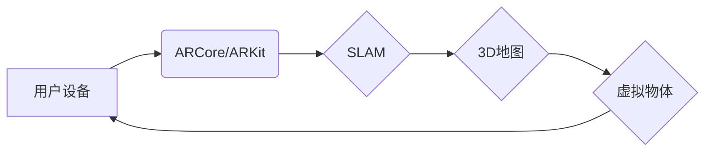

                 

## ARCore与ARKit：移动AR应用开发对比

> 关键词：ARCore, ARKit, 移动AR, 增强现实, 计算机视觉, SLAM, 3D渲染, 应用开发

## 1. 背景介绍

增强现实（AR）技术近年来发展迅速，它将虚拟内容叠加到现实世界中，为用户提供一种全新的交互体验。移动AR应用的普及，使得AR技术逐渐渗透到人们的日常生活，例如游戏、购物、教育、医疗等领域。

ARCore和ARKit是谷歌和苹果分别推出的移动AR开发平台，它们为开发者提供了丰富的工具和API，简化了AR应用的开发过程。ARCore支持Android系统，ARKit支持iOS系统。

本文将对ARCore和ARKit进行深入对比，分析它们的原理、功能、优势和劣势，帮助开发者更好地选择合适的平台进行移动AR应用开发。

## 2. 核心概念与联系

### 2.1 核心概念

* **增强现实 (AR):** 将虚拟内容叠加到现实世界中，为用户提供一种交互式体验的技术。
* **ARCore:** 谷歌推出的移动AR开发平台，支持Android系统。
* **ARKit:** 苹果推出的移动AR开发平台，支持iOS系统。
* **SLAM (Simultaneous Localization and Mapping):**  同时定位与地图构建，是AR应用的核心技术之一，用于确定设备的位置和构建周围环境的3D地图。
* **3D渲染:** 将虚拟物体以三维形式呈现到现实世界中。

### 2.2 架构关系



## 3. 核心算法原理 & 具体操作步骤

### 3.1 算法原理概述

ARCore和ARKit都基于SLAM算法实现设备的定位和环境建模。SLAM算法通过分析摄像头捕捉到的图像和传感器数据，来估计设备的位置和周围环境的3D结构。

ARCore和ARKit的SLAM算法都包含以下几个关键步骤：

1. **特征提取:** 从摄像头捕捉到的图像中提取特征点，例如角点、边缘等。
2. **特征匹配:** 将提取的特征点与之前帧的特征点进行匹配，建立特征点之间的对应关系。
3. **运动估计:** 根据特征点之间的对应关系，估计设备在当前帧与之前帧之间的运动。
4. **地图构建:** 利用设备的运动信息和特征点的位置信息，构建周围环境的3D地图。

### 3.2 算法步骤详解

1. **特征提取:** ARCore和ARKit都使用计算机视觉算法来提取图像中的特征点。例如，ARCore使用ORB特征点检测器，ARKit使用SURF特征点检测器。
2. **特征匹配:** 提取的特征点需要进行匹配，以确定它们在不同帧中的对应关系。ARCore和ARKit都使用RANSAC算法来进行特征匹配，该算法可以有效地去除匹配错误。
3. **运动估计:** 根据特征点之间的对应关系，可以使用多种方法来估计设备的运动，例如ICP算法、PnP算法等。
4. **地图构建:** 利用设备的运动信息和特征点的位置信息，可以构建周围环境的3D地图。ARCore和ARKit都使用图优化算法来构建地图，该算法可以提高地图的精度和鲁棒性。

### 3.3 算法优缺点

**优点:**

* **高精度定位:** SLAM算法可以实现高精度的设备定位。
* **环境建模:** 可以构建周围环境的3D地图，为AR应用提供更丰富的交互体验。
* **实时性:** SLAM算法可以实时地进行定位和地图构建，满足AR应用的实时性需求。

**缺点:**

* **计算复杂度高:** SLAM算法的计算复杂度较高，需要强大的计算能力。
* **环境依赖性:** SLAM算法的性能受环境光照、纹理等因素的影响。
* **数据存储:** 构建的3D地图需要占用较大的存储空间。

### 3.4 算法应用领域

* **游戏:** AR游戏可以将虚拟角色和场景叠加到现实世界中，为玩家提供更沉浸式的游戏体验。
* **购物:** AR购物可以帮助用户在购买商品之前进行虚拟试穿或虚拟摆放，提高购物体验。
* **教育:** AR教育可以将抽象的知识点转化为可视化的3D模型，帮助用户更好地理解和记忆。
* **医疗:** AR医疗可以帮助医生进行手术指导、虚拟解剖等，提高医疗诊断和治疗的效率。

## 4. 数学模型和公式 & 详细讲解 & 举例说明

### 4.1 数学模型构建

SLAM算法的核心是构建一个数学模型来描述设备的运动和环境的结构。

* **运动模型:** 描述设备在不同时间点的运动状态，例如位置、姿态等。
* **观测模型:** 描述摄像头捕捉到的图像与环境结构之间的关系。

### 4.2 公式推导过程

* **运动模型:** 

假设设备在时间t和时间t+dt之间的运动可以用一个旋转矩阵R和一个平移向量t来描述。则设备在时间t+dt的运动状态可以表示为：

$$
\begin{aligned}
R_{t+dt} &= R_t * R_{dt} \\
t_{t+dt} &= t_t + v_{t} * dt
\end{aligned}
$$

其中，$R_t$和$t_t$分别表示设备在时间t的旋转矩阵和平移向量，$R_{dt}$和$v_t$分别表示设备在时间间隔dt内的旋转和速度。

* **观测模型:**

假设摄像头捕捉到的图像中存在一个特征点，其在世界坐标系中的位置为$P_w$，在相机坐标系中的位置为$P_c$。则观测模型可以表示为：

$$
P_c = R_t * P_w + t_t
$$

其中，$R_t$和$t_t$分别表示设备在时间t的旋转矩阵和平移向量。

### 4.3 案例分析与讲解

假设一个设备在移动过程中，摄像头捕捉到一个特征点，该特征点在世界坐标系中的位置为(1, 2, 3)。

根据观测模型，我们可以计算出该特征点在相机坐标系中的位置。

假设设备在时间t的旋转矩阵为：

$$
R_t = \begin{bmatrix}
0.707 & -0.707 & 0 \\
0.707 & 0.707 & 0 \\
0 & 0 & 1
\end{bmatrix}
$$

设备在时间t的平移向量为：

$$
t_t = \begin{bmatrix}
1 \\
2 \\
0
\end{bmatrix}
$$

则该特征点在相机坐标系中的位置为：

$$
P_c = \begin{bmatrix}
0.707 & -0.707 & 0 \\
0.707 & 0.707 & 0 \\
0 & 0 & 1
\end{bmatrix} * \begin{bmatrix}
1 \\
2 \\
3
\end{bmatrix} + \begin{bmatrix}
1 \\
2 \\
0
\end{bmatrix} = \begin{bmatrix}
-0.707 \\
2.828 \\
3
\end{bmatrix}
$$


## 5. 项目实践：代码实例和详细解释说明

### 5.1 开发环境搭建

* **Android:** Android Studio, Java/Kotlin
* **iOS:** Xcode, Swift/Objective-C

### 5.2 源代码详细实现

由于篇幅限制，这里只提供一个简单的ARCore代码示例，展示如何将一个虚拟物体渲染到现实世界中。

```java
// ARCore代码示例
// 将一个虚拟物体渲染到现实世界中

import com.google.ar.core.Anchor;
import com.google.ar.core.Frame;
import com.google.ar.core.Session;
import com.google.ar.sceneform.AnchorNode;
import com.google.ar.sceneform.rendering.ModelRenderable;
import com.google.ar.sceneform.ux.ArFragment;

public class MainActivity extends AppCompatActivity {

    private ArFragment arFragment;

    @Override
    protected void onCreate(Bundle savedInstanceState) {
        super.onCreate(savedInstanceState);
        setContentView(R.layout.activity_main);

        arFragment = (ArFragment) getSupportFragmentManager().findFragmentById(R.id.ar_fragment);

        // 监听AR会话状态变化
        arFragment.getArSceneView().getSession().getScene().addOnUpdateListener(new OnUpdateListener() {
            @Override
            public void onUpdate(ArFrame frame) {
                // 获取AR会话的当前帧
                Frame currentFrame = frame.getArFrame();

                // 获取设备的位置和姿态
                Pose devicePose = currentFrame.getCamera().getPose();

                // 创建一个锚点
                Anchor anchor = arFragment.getArSceneView().getSession().createAnchor(devicePose.getPosition(), devicePose.getRotation());

                // 创建一个锚点节点
                AnchorNode anchorNode = new AnchorNode(anchor);

                // 加载一个虚拟物体模型
                ModelRenderable.builder()
                        .setSource(this, R.raw.model)
                        .build()
                        .thenAccept(renderable -> {
                            // 将虚拟物体模型添加到锚点节点中
                            ModelNode modelNode = new ModelNode(renderable);
                            anchorNode.addChild(modelNode);
                            arFragment.getArSceneView().getScene().addChild(anchorNode);
                        });
            }
        });
    }
}
```

### 5.3 代码解读与分析

* **ARCore初始化:** 代码首先初始化ARCore会话，并获取AR场景视图。
* **监听AR会话状态:** 代码监听AR会话状态变化，并在每次更新时获取当前帧数据。
* **获取设备位置和姿态:** 代码从当前帧中获取设备的位置和姿态信息。
* **创建锚点:** 代码创建一个锚点，将其与设备的位置和姿态关联。
* **加载虚拟物体模型:** 代码加载一个虚拟物体模型，并将其添加到锚点节点中。
* **渲染虚拟物体:** 代码将锚点节点添加到AR场景中，从而将虚拟物体渲染到现实世界中。

### 5.4 运行结果展示

运行该代码后，用户将看到一个虚拟物体出现在其设备的摄像头画面中，并随着设备的移动而移动。

## 6. 实际应用场景

### 6.1 游戏

AR游戏可以将虚拟角色和场景叠加到现实世界中，为玩家提供更沉浸式的游戏体验。例如，Pokémon GO就是一款成功的AR游戏，它允许玩家在现实世界中捕捉虚拟的精灵。

### 6.2 购物

AR购物可以帮助用户在购买商品之前进行虚拟试穿或虚拟摆放，提高购物体验。例如，一些服装品牌可以使用AR技术，让用户在手机上试穿虚拟的衣服，从而减少退货率。

### 6.3 教育

AR教育可以将抽象的知识点转化为可视化的3D模型，帮助用户更好地理解和记忆。例如，AR可以用于教学解剖学，让学生可以虚拟地解剖人体器官。

### 6.4 未来应用展望

AR技术的发展潜力巨大，未来将有更多新的应用场景出现。例如，AR可以用于医疗诊断、建筑设计、工业维修等领域。

## 7. 工具和资源推荐

### 7.1 学习资源推荐

* **ARCore官方文档:** https://developers.google.com/ar/develop/arcore
* **ARKit官方文档:** https://developer.apple.com/documentation/arkit
* **ARCore学习教程:** https://medium.com/google-developers/getting-started-with-arcore-for-android-development-a-beginners-guide-e8699929144c
* **ARKit学习教程:** https://www.raywenderlich.com/1621-arkit-tutorial-for-beginners

### 7.2 开发工具推荐

* **Android Studio:** https://developer.android.com/studio
* **Xcode:** https://developer.apple.com/xcode/

### 7.3 相关论文推荐

* **Simultaneous Localization and Mapping (SLAM):** https://ieeexplore.ieee.org/document/1013741
* **ARCore: A Platform for Mobile Augmented Reality:** https://arxiv.org/abs/1707.06888
* **ARKit: A Platform for Augmented Reality on iOS:** https://developer.apple.com/documentation/arkit/arkit

## 8. 总结：未来发展趋势与挑战

### 8.1 研究成果总结

ARCore和ARKit的推出，为移动AR应用开发提供了强大的工具和平台。SLAM算法的不断发展，使得AR应用的定位精度和环境建模能力不断提升。

### 8.2 未来发展趋势

* **更精准的定位和建模:** 未来AR技术将更加注重定位和建模的精度，以提供更逼真的AR体验。
* **更丰富的交互方式:** 未来AR应用将支持更丰富的交互方式，例如手势识别、语音识别等。
* **更广泛的应用场景:** 未来AR技术将应用于更多领域，例如教育、医疗、工业等。

### 8.3 面临的挑战

* **计算资源限制:** AR应用的计算需求较高，需要强大的计算能力才能实现流畅的体验。
* **环境依赖性:** AR应用的性能受环境光照、纹理等因素的影响，需要开发更鲁棒的算法来应对这些挑战。
* **隐私安全问题:** AR应用需要访问用户的摄像头和传感器数据，因此需要关注用户隐私安全问题。

### 8.4 研究展望

未来AR技术的研究方向包括：

* **开发更鲁棒的SLAM算法:** 提高SLAM算法的精度、效率和鲁棒性。
* **探索新的交互方式:** 开发更自然、更直观的AR交互方式。
* **解决隐私安全问题:** 开发更安全的AR应用，保护用户的隐私安全。


## 9. 附录：常见问题与解答

* **Q1: ARCore和ARKit有什么区别？**

A1: ARCore是谷歌推出的移动AR开发平台，支持Android系统。ARKit是苹果推出的移动AR开发平台，支持iOS系统。

* **Q2: 如何选择ARCore还是ARKit？**

A2: 选择ARCore还是ARKit取决于你的目标平台。如果你的目标平台是Android，则应该选择ARCore。如果你的目标平台是iOS，则应该选择ARKit。

* **Q3: 如何开始学习AR开发？**

A3: 

你可以参考官方文档和学习教程，例如ARCore官方文档和ARKit官方文档。

* **Q4: AR开发需要哪些技术？**

A4: AR开发需要掌握以下技术：

* 计算机视觉
* SLAM算法
* 3D建模
* 编程语言 (Java/Kotlin, Swift/Objective-C)


作者：禅与计算机程序设计艺术 / Zen and the Art of Computer Programming<end_of_turn>

