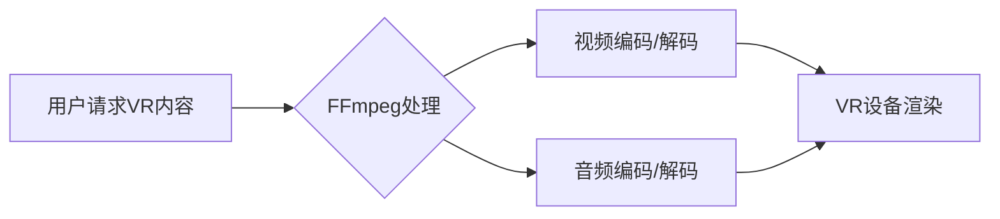

                 

## FFmpeg 在虚拟现实中的应用

> 关键词：FFmpeg, 虚拟现实, VR, 视频处理, 音频处理, 编码解码, 直播, 渲染

## 1. 背景介绍

虚拟现实 (VR) 技术近年来发展迅速，为人们提供了沉浸式体验的新途径。VR 应用场景广泛，涵盖游戏、教育、医疗、培训等领域。然而，VR 应用的成功离不开高质量的视频和音频内容。FFmpeg 作为一款强大的开源多媒体处理框架，凭借其强大的功能和灵活的架构，在 VR 应用中发挥着越来越重要的作用。

传统的视频处理和音频处理方法在 VR 应用中存在一些局限性，例如：

* **实时性要求高:** VR 应用需要实时处理视频和音频数据，以保证沉浸式的体验。
* **带宽需求大:** VR 应用通常需要传输大量的数据，例如高分辨率视频和立体声音频，这对网络带宽提出了更高的要求。
* **设备资源有限:** VR 设备通常具有有限的计算能力和存储空间，需要高效的处理算法和数据压缩技术。

FFmpeg 能够有效解决这些问题，其强大的功能和灵活的架构使其成为 VR 应用的理想选择。

## 2. 核心概念与联系

### 2.1 FFmpeg 简介

FFmpeg 是一个开源的跨平台多媒体框架，支持多种音频和视频格式的编码、解码、转换和处理。它由一系列独立的库组成，可以根据需要灵活组合使用。

### 2.2 虚拟现实 (VR) 简介

虚拟现实 (VR) 是利用计算机技术模拟真实环境或虚构环境，并通过头戴式显示器、手柄等设备提供沉浸式体验的技术。VR 应用通常需要处理大量的高分辨率视频和音频数据，以保证沉浸式的体验。

### 2.3 FFmpeg 在 VR 应用中的联系

FFmpeg 在 VR 应用中扮演着重要的角色，主要体现在以下几个方面：

* **视频处理:** FFmpeg 可以处理各种视频格式，例如 H.264、H.265、VP9 等，并支持视频编码、解码、转换、裁剪、旋转等操作。
* **音频处理:** FFmpeg 可以处理各种音频格式，例如 MP3、AAC、WAV 等，并支持音频编码、解码、转换、混音、均衡等操作。
* **实时流媒体:** FFmpeg 支持实时流媒体传输，可以将视频和音频数据实时传输到 VR 设备，实现实时互动体验。
* **数据压缩:** FFmpeg 支持多种视频和音频压缩算法，可以有效降低数据传输量，减轻网络带宽压力。

**Mermaid 流程图**



## 3. 核心算法原理 & 具体操作步骤

### 3.1 算法原理概述

FFmpeg 使用多种算法来处理视频和音频数据，这些算法包括：

* **视频编码算法:** H.264、H.265、VP9 等
* **音频编码算法:** MP3、AAC、Opus 等
* **视频解码算法:** H.264、H.265、VP9 等
* **音频解码算法:** MP3、AAC、Opus 等

这些算法通过对视频和音频数据进行压缩和解压缩，实现高效的处理和传输。

### 3.2 算法步骤详解

**视频处理步骤:**

1. **视频捕获:** 从摄像头或其他视频源获取视频数据。
2. **视频预处理:** 对视频数据进行格式转换、裁剪、旋转等操作。
3. **视频编码:** 使用视频编码算法对视频数据进行压缩，生成视频流。
4. **视频解码:** 使用视频解码算法对视频流进行解压缩，还原视频数据。
5. **视频渲染:** 将解压缩后的视频数据显示到 VR 设备上。

**音频处理步骤:**

1. **音频捕获:** 从麦克风或其他音频源获取音频数据。
2. **音频预处理:** 对音频数据进行格式转换、降噪、均衡等操作。
3. **音频编码:** 使用音频编码算法对音频数据进行压缩，生成音频流。
4. **音频解码:** 使用音频解码算法对音频流进行解压缩，还原音频数据。
5. **音频输出:** 将解压缩后的音频数据输出到 VR 设备的扬声器。

### 3.3 算法优缺点

**优点:**

* **高效:** FFmpeg 使用多种优化算法，可以实现高效的视频和音频处理。
* **灵活:** FFmpeg 的模块化设计使其非常灵活，可以根据需要定制处理流程。
* **开源:** FFmpeg 是开源软件，可以免费使用和修改。

**缺点:**

* **复杂:** FFmpeg 的功能强大，但同时也比较复杂，需要一定的学习成本。
* **资源消耗:** FFmpeg 的处理过程可能会消耗较多的 CPU 和内存资源。

### 3.4 算法应用领域

FFmpeg 的视频和音频处理算法广泛应用于各种领域，例如：

* **视频直播:** FFmpeg 可以用于直播视频和音频数据到网络平台。
* **视频会议:** FFmpeg 可以用于视频会议的音频和视频处理。
* **视频编辑:** FFmpeg 可以用于视频剪辑、拼接、特效等操作。
* **音频处理:** FFmpeg 可以用于音频压缩、混音、均衡等操作。

## 4. 数学模型和公式 & 详细讲解 & 举例说明

### 4.1 数学模型构建

FFmpeg 的视频和音频处理算法通常基于数学模型，例如：

* **DCT (离散余弦变换):** 用于视频编码的基石算法，将图像数据分解成频率成分。
* **IDCT (离散余弦变换逆):** 用于视频解码的算法，将频率成分合成图像数据。
* **MPEG-4 AVC (高级视频编码):** 基于 DCT 的视频编码标准，提供高效的视频压缩。

### 4.2 公式推导过程

例如，DCT 变换的公式如下：

$$
C_{mn} = \sqrt{\frac{2}{N}} \cdot \cos \left( \frac{(2m+1)n \pi}{2N} \right)
$$

其中：

* $C_{mn}$ 是 DCT 变换后的系数。
* $m$ 和 $n$ 是图像块中的行和列索引。
* $N$ 是图像块的大小。

### 4.3 案例分析与讲解

例如，在视频编码过程中，DCT 变换可以将图像数据分解成低频和高频成分。低频成分包含图像的主要特征，而高频成分包含图像的细节。通过对高频成分进行量化和编码，可以有效降低视频数据的大小。

## 5. 项目实践：代码实例和详细解释说明

### 5.1 开发环境搭建

* 操作系统: Linux, macOS, Windows
* 编程语言: C, C++, Python
* FFmpeg 库: 下载并安装 FFmpeg 库

### 5.2 源代码详细实现

```c
#include <stdio.h>
#include <libavformat/avformat.h>
#include <libavcodec/avcodec.h>

int main() {
    // 注册所有协议和编解码器
    av_register_all();

    // 打开输入文件
    AVFormatContext *input_format_context = avformat_alloc_context();
    if (avformat_open_input(&input_format_context, "input.mp4", NULL, NULL) != 0) {
        fprintf(stderr, "Could not open input file\n");
        return -1;
    }

    // 查找视频流
    AVStream *video_stream = NULL;
    for (unsigned int i = 0; i < input_format_context->nb_streams; i++) {
        if (input_format_context->streams[i]->codecpar->codec_type == AVMEDIA_TYPE_VIDEO) {
            video_stream = input_format_context->streams[i];
            break;
        }
    }

    // 打开输出文件
    AVFormatContext *output_format_context = avformat_alloc_context();
    if (avio_open(&output_format_context->pb, "output.mp4", AVIO_FLAG_WRITE) < 0) {
        fprintf(stderr, "Could not open output file\n");
        return -1;
    }

    // 添加视频流到输出文件
    AVStream *output_video_stream = avformat_new_stream(output_format_context, NULL);
    if (!output_video_stream) {
        fprintf(stderr, "Could not allocate stream\n");
        return -1;
    }

    // 复制视频流信息
    avcodec_parameters_copy(output_video_stream->codecpar, video_stream->codecpar);

    // 写入文件头
    if (avformat_write_header(output_format_context, NULL) < 0) {
        fprintf(stderr, "Error writing header\n");
        return -1;
    }

    // 读取输入视频帧
    AVPacket packet;
    while (av_read_frame(input_format_context, &packet) >= 0) {
        // 如果是视频帧
        if (packet.stream_index == video_stream->index) {
            // 写入输出文件
            if (av_interleaved_write_frame(output_format_context, &packet) < 0) {
                fprintf(stderr, "Error writing frame\n");
                return -1;
            }
        }
        av_packet_unref(&packet);
    }

    // 写入文件尾
    av_write_trailer(output_format_context);

    // 释放资源
    avformat_close_input(&input_format_context);
    avformat_free_context(output_format_context);

    return 0;
}
```

### 5.3 代码解读与分析

这段代码演示了如何使用 FFmpeg 将一个视频文件复制到另一个文件。

* 首先，注册所有协议和编解码器。
* 然后，打开输入文件并查找视频流。
* 接着，打开输出文件并添加视频流。
* 接下来，读取输入视频帧并写入输出文件。
* 最后，释放资源。

### 5.4 运行结果展示

运行这段代码后，将生成一个名为 "output.mp4" 的视频文件，其内容与 "input.mp4" 文件相同。

## 6. 实际应用场景

### 6.1 VR 视频直播

FFmpeg 可以用于将 VR 视频和音频数据实时直播到网络平台，例如 YouTube、Facebook 等。

### 6.2 VR 视频会议

FFmpeg 可以用于 VR 视频会议的音频和视频处理，实现多人实时互动。

### 6.3 VR 游戏开发

FFmpeg 可以用于 VR 游戏开发中处理视频和音频数据，例如游戏场景渲染、角色动画、音效播放等。

### 6.4 未来应用展望

随着 VR 技术的不断发展，FFmpeg 在 VR 应用中的作用将更加重要。未来，FFmpeg 可能在以下方面得到进一步应用：

* **更高效的视频和音频压缩算法:** 随着 VR 应用的普及，对带宽的需求越来越高，更高效的视频和音频压缩算法将成为未来发展趋势。
* **更智能的视频处理算法:** 未来，FFmpeg 可能集成更智能的视频处理算法，例如人脸识别、物体跟踪等，为 VR 应用提供更丰富的功能。
* **更强大的实时流媒体处理能力:** FFmpeg 可能进一步增强其实时流媒体处理能力，支持更高分辨率、更高帧率的 VR 视频直播。

## 7. 工具和资源推荐

### 7.1 学习资源推荐

* FFmpeg 官方网站: https://ffmpeg.org/
* FFmpeg 文档: https://ffmpeg.org/documentation.html
* FFmpeg 教程: https://www.tutorialspoint.com/ffmpeg/index.htm

### 7.2 开发工具推荐

* Git: 用于版本控制
* CMake: 用于构建工具
* Visual Studio Code: 用于代码编辑

### 7.3 相关论文推荐

* H.264/AVC Video Coding Standard
* HEVC/H.265 Video Coding Standard
* MPEG-4 Advanced Audio Coding (AAC)

## 8. 总结：未来发展趋势与挑战

### 8.1 研究成果总结

FFmpeg 在 VR 应用中发挥着越来越重要的作用，其强大的功能和灵活的架构使其成为 VR 开发者的理想选择。

### 8.2 未来发展趋势

未来，FFmpeg 将继续朝着更高效、更智能、更强大的方向发展，为 VR 应用提供更丰富的功能和更好的体验。

### 8.3 面临的挑战

FFmpeg 面临的挑战包括：

* **算法复杂性:** FFmpeg 的算法复杂，需要不断优化和改进。
* **资源消耗:** FFmpeg 的处理过程可能会消耗较多的 CPU 和内存资源，需要进一步降低资源消耗。
* **跨平台兼容性:** FFmpeg 需要支持多种操作系统和硬件平台，需要不断维护和更新。

### 8.4 研究展望

未来，研究人员将继续探索新的视频和音频处理算法，并将其集成到 FFmpeg 中，以提高 VR 应用的性能和体验。


## 9. 附录：常见问题与解答

### 9.1 如何安装 FFmpeg?

FFmpeg 的安装方法因操作系统而异，可以参考 FFmpeg 官方网站的安装指南。

### 9.2 如何使用 FFmpeg 命令行工具?

FFmpeg 提供了丰富的命令行工具，可以用于各种视频和音频处理操作。可以参考 FFmpeg 官方文档了解详细的命令行用法。

### 9.3 FFmpeg 支持哪些视频和音频格式?

FFmpeg 支持多种视频和音频格式，可以参考 FFmpeg 官方文档了解支持的格式列表。


作者：禅与计算机程序设计艺术 / Zen and the Art of Computer Programming 
<end_of_turn>

