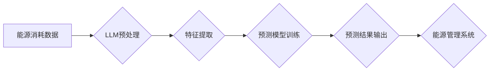

                 

## LLM在智能能源消耗预测中的潜在贡献

> 关键词：LLM, 智能能源消耗预测, 时间序列分析, 自然语言处理, 深度学习, 能源管理, 可持续发展

## 1. 背景介绍

随着全球对可持续发展目标的日益重视，能源效率和节能减排已成为全球共同关注的议题。智能能源消耗预测作为能源管理的重要组成部分，能够帮助我们更好地理解和控制能源使用模式，从而实现能源的优化配置和节约利用。传统能源消耗预测方法主要依赖于统计模型和规则引擎，但这些方法在面对复杂、非线性的能源消耗数据时往往表现不足。近年来，随着深度学习和自然语言处理技术的快速发展，大型语言模型（LLM）展现出强大的学习和推理能力，为智能能源消耗预测提供了新的思路和可能性。

## 2. 核心概念与联系

### 2.1  智能能源消耗预测

智能能源消耗预测是指利用历史能源消耗数据、天气数据、设备运行状态等多种信息，通过机器学习算法构建预测模型，预测未来一段时间内的能源消耗量。其目标是提高能源利用效率，降低能源成本，并促进可持续发展。

### 2.2  大型语言模型（LLM）

大型语言模型（LLM）是一种基于Transformer架构的深度学习模型，通过训练海量文本数据，学习语言的语法、语义和上下文关系。LLM具备强大的文本理解、生成和推理能力，能够处理复杂的任务，例如文本分类、机器翻译、问答系统等。

### 2.3  LLM在能源消耗预测中的应用

LLM可以将文本数据转化为数值数据，并与传统能源消耗预测方法相结合，提升预测精度和效率。例如，LLM可以分析天气预报文本，提取温度、湿度等关键信息，并将其作为预测模型的输入，从而更准确地预测未来能源消耗。

**核心概念与架构流程图**



## 3. 核心算法原理 & 具体操作步骤

### 3.1  算法原理概述

LLM在智能能源消耗预测中的应用主要基于以下核心算法原理：

* **文本数据预处理:** 将原始能源消耗数据和相关文本数据（如天气预报、设备运行日志等）进行清洗、格式化和编码，使其能够被LLM理解和处理。
* **特征提取:** 利用LLM的文本理解能力，从文本数据中提取关键特征，例如温度、湿度、风速、设备类型、运行时间等，并将其转化为数值数据。
* **预测模型训练:** 将提取的特征数据与历史能源消耗数据作为训练样本，利用深度学习算法（如回归模型、神经网络等）训练预测模型。
* **预测结果输出:** 将训练好的预测模型应用于新的数据，预测未来一段时间内的能源消耗量。

### 3.2  算法步骤详解

1. **数据收集:** 收集历史能源消耗数据、天气数据、设备运行状态等相关数据。
2. **数据预处理:** 对收集到的数据进行清洗、格式化和编码，例如去除噪声数据、转换数据类型、将文本数据转换为数值向量等。
3. **特征提取:** 利用LLM对文本数据进行分析，提取关键特征，例如天气预报中的温度、湿度等信息，以及设备运行日志中的设备类型、运行时间等信息。
4. **数据融合:** 将提取的特征数据与历史能源消耗数据进行融合，构建完整的训练数据集。
5. **模型选择:** 选择合适的深度学习算法，例如线性回归、支持向量机、神经网络等，构建预测模型。
6. **模型训练:** 利用训练数据集训练预测模型，并通过交叉验证等方法评估模型性能。
7. **模型优化:** 根据模型评估结果，调整模型参数，优化模型性能。
8. **预测结果输出:** 将训练好的预测模型应用于新的数据，预测未来一段时间内的能源消耗量。

### 3.3  算法优缺点

**优点:**

* **能够处理复杂、非线性的能源消耗数据:** LLM具备强大的学习能力，能够从海量数据中学习复杂的关系，并进行精准预测。
* **能够融合多种数据类型:** LLM可以处理文本数据、数值数据等多种数据类型，能够更全面地反映能源消耗的影响因素。
* **预测精度高:** LLM在能源消耗预测领域取得了显著的成果，能够提供更准确的预测结果。

**缺点:**

* **训练成本高:** LLM需要大量的训练数据和计算资源，训练成本较高。
* **解释性差:** LLM的决策过程较为复杂，难以解释其预测结果背后的逻辑。
* **数据依赖性强:** LLM的预测精度依赖于训练数据的质量和数量，如果训练数据不足或质量较差，则预测结果可能不准确。

### 3.4  算法应用领域

LLM在智能能源消耗预测领域具有广泛的应用前景，例如：

* **家庭能源管理:** 预测家庭用电量，优化用电时间，降低能源成本。
* **商业建筑能源管理:** 预测商业建筑用能量，优化空调、照明等设备运行，提高能源效率。
* **工业生产能源管理:** 预测工业生产用能量，优化生产流程，降低能源消耗。
* **城市能源管理:** 预测城市整体用能量，优化能源供应，促进城市可持续发展。

## 4. 数学模型和公式 & 详细讲解 & 举例说明

### 4.1  数学模型构建

在LLM辅助的智能能源消耗预测中，常用的数学模型包括线性回归模型、支持向量机模型、神经网络模型等。

**线性回归模型:**

线性回归模型假设能源消耗量与影响因素之间存在线性关系，可以用以下公式表示：

$$
y = \beta_0 + \beta_1x_1 + \beta_2x_2 + ... + \beta_nx_n + \epsilon
$$

其中：

* $y$ 是预测的能源消耗量
* $x_1, x_2, ..., x_n$ 是影响因素，例如温度、湿度、设备运行时间等
* $\beta_0, \beta_1, \beta_2, ..., \beta_n$ 是模型参数
* $\epsilon$ 是误差项

**支持向量机模型:**

支持向量机模型是一种分类算法，可以用于预测能源消耗量是否超过某个阈值。

**神经网络模型:**

神经网络模型是一种更复杂的模型，可以学习更复杂的非线性关系。

### 4.2  公式推导过程

线性回归模型的参数可以通过最小二乘法进行估计。最小二乘法旨在找到一组参数，使得模型预测值与实际值之间的误差平方和最小。

支持向量机模型的参数可以通过优化一个目标函数来估计，该目标函数旨在最大化分类间隔。

神经网络模型的参数可以通过反向传播算法进行训练。反向传播算法通过计算误差梯度，逐步调整模型参数，使得模型预测值与实际值之间的误差最小。

### 4.3  案例分析与讲解

假设我们想要预测某栋建筑的每日用电量。我们可以收集历史用电量数据、天气数据（例如温度、湿度）以及建筑设备运行时间等信息。

利用LLM，我们可以从天气预报文本中提取温度、湿度等关键信息，并将其转化为数值数据。然后，我们可以将这些数据与历史用电量数据进行融合，构建训练数据集。

选择合适的深度学习算法，例如线性回归模型，训练预测模型。通过交叉验证等方法评估模型性能，并根据评估结果调整模型参数，优化模型性能。

最终，我们可以使用训练好的模型预测未来某一天的用电量。

## 5. 项目实践：代码实例和详细解释说明

### 5.1  开发环境搭建

* **操作系统:** Ubuntu 20.04 LTS
* **Python版本:** 3.8.10
* **深度学习框架:** TensorFlow 2.6.0
* **自然语言处理库:** Transformers 4.18.0

### 5.2  源代码详细实现

```python
import pandas as pd
from transformers import AutoTokenizer, AutoModelForSequenceClassification
from sklearn.model_selection import train_test_split
from sklearn.metrics import mean_squared_error

# 数据加载
data = pd.read_csv("energy_consumption_data.csv")

# 文本数据预处理
tokenizer = AutoTokenizer.from_pretrained("bert-base-uncased")
text_data = data["weather_report"].values
encoded_data = tokenizer(text_data, padding=True, truncation=True)

# 特征提取
model = AutoModelForSequenceClassification.from_pretrained("bert-base-uncased")
features = model(**encoded_data).last_hidden_state[:, 0, :]

# 数据分割
X = features.numpy()
y = data["energy_consumption"].values
X_train, X_test, y_train, y_test = train_test_split(X, y, test_size=0.2, random_state=42)

# 模型训练
model = LinearRegression()
model.fit(X_train, y_train)

# 模型评估
y_pred = model.predict(X_test)
rmse = mean_squared_error(y_test, y_pred, squared=False)
print(f"RMSE: {rmse}")

```

### 5.3  代码解读与分析

* **数据加载:** 从CSV文件加载能源消耗数据。
* **文本数据预处理:** 使用BERT模型对天气预报文本进行预处理，将其转化为数值向量。
* **特征提取:** 利用BERT模型的输出特征作为模型输入。
* **数据分割:** 将数据分为训练集和测试集。
* **模型训练:** 使用线性回归模型训练预测模型。
* **模型评估:** 使用均方根误差（RMSE）评估模型性能。

### 5.4  运行结果展示

运行代码后，会输出模型的RMSE值，该值越小，模型的预测精度越高。

## 6. 实际应用场景

### 6.1  家庭能源管理

LLM可以帮助家庭用户更好地理解和控制自己的能源消耗。例如，可以根据用户的用电习惯和天气预报，预测未来一周的用电量，并提供个性化的用电建议，帮助用户降低能源成本。

### 6.2  商业建筑能源管理

LLM可以帮助商业建筑管理者优化能源使用，降低运营成本。例如，可以预测建筑的空调、照明等设备的用能量，并根据预测结果调整设备运行时间，提高能源效率。

### 6.3  工业生产能源管理

LLM可以帮助工业企业优化生产流程，降低能源消耗。例如，可以预测生产设备的用能量，并根据预测结果调整生产计划，提高能源利用效率。

### 6.4  未来应用展望

随着LLM技术的不断发展，其在智能能源消耗预测领域的应用将更加广泛和深入。例如，可以利用LLM分析能源市场数据，预测未来能源价格走势，帮助企业制定更有效的能源采购策略。

## 7. 工具和资源推荐

### 7.1  学习资源推荐

* **书籍:**
    * Deep Learning by Ian Goodfellow, Yoshua Bengio, and Aaron Courville
    * Natural Language Processing with Python by Steven Bird, Ewan Klein, and Edward Loper
* **在线课程:**
    * Deep Learning Specialization by Andrew Ng on Coursera
    * Natural Language Processing Specialization by deeplearning.ai on Coursera

### 7.2  开发工具推荐

* **Python:** 
    * TensorFlow
    * PyTorch
    * scikit-learn
* **自然语言处理库:**
    * Transformers
    * spaCy
    * NLTK

### 7.3  相关论文推荐

* **BERT: Pre-training of Deep Bidirectional Transformers for Language Understanding**
* **Attention Is All You Need**
* **Deep Learning for Energy Consumption Forecasting: A Comprehensive Review**

## 8. 总结：未来发展趋势与挑战

### 8.1  研究成果总结

LLM在智能能源消耗预测领域取得了显著的成果，能够提供更准确的预测结果，并帮助用户更好地理解和控制能源消耗。

### 8.2  未来发展趋势

* **模型复杂度提升:** 未来将开发更复杂的LLM模型，能够学习更复杂的非线性关系，提高预测精度。
* **数据融合能力增强:** 将更多类型的数据融合到预测模型中，例如地理位置数据、用户行为数据等，提高预测的全面性和准确性。
* **解释性增强:** 研究更具解释性的LLM模型，能够更好地解释其预测结果背后的逻辑，提高用户对模型的信任度。

### 8.3  面临的挑战

* **数据获取和质量:** 训练高性能的LLM模型需要海量高质量的数据，而获取和清洗这些数据仍然是一个挑战。
* **计算资源需求:** 训练大型LLM模型需要大量的计算资源，这对于个人开发者和小型企业来说是一个负担。
* **模型可解释性:** LLM模型的决策过程较为复杂，难以解释其预测结果背后的逻辑，这可能会阻碍其在实际应用中的推广。

### 8.4  研究展望

未来将继续研究LLM在智能能源消耗预测领域的应用，探索更有效的模型架构、训练方法和数据融合策略，推动智能能源管理的创新发展。

## 9. 附录：常见问题与解答

**Q1: LLM在能源消耗预测中有什么优势？**

A1: LLM能够处理复杂、非线性的能源消耗数据，并融合多种数据类型，能够提供更准确的预测结果。

**Q2: 如何评估LLM在能源消耗预测中的性能？**

A2: 常用的评估指标包括均方根误差（RMSE）、平均绝对误差（MAE）等。

**Q3: 如何选择合适的LLM模型？**

A3: 选择合适的LLM模型需要根据具体应用场景和数据特点进行选择。例如，对于简单的预测任务，可以使用BERT模型；对于更复杂的预测任务，可以使用更复杂的Transformer模型。

**Q4: 如何解决LLM模型的解释性问题？**

A4: 研究更具解释性的LLM模型，例如使用注意力机制解释模型的决策过程。

**作者：禅与计算机程序设计艺术 / Zen and the Art of Computer Programming**<end_of_turn>

