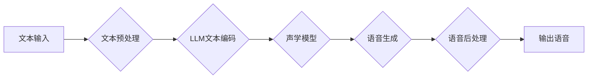

                 

## LLM在语音合成中的应用：更自然的AI语音

> 关键词：LLM, 语音合成, 自然语言处理, 文本到语音, AI语音, 说话人风格, 语音情感

## 1. 背景介绍

语音合成技术的发展历程可以追溯到上世纪50年代，从早期的机械式语音合成到如今的基于深度学习的先进模型，语音合成技术已经取得了长足的进步。然而，传统的语音合成系统仍然存在着一些问题，例如语音缺乏自然流畅度、情感表达单调、说话人风格单一等。

近年来，大语言模型（LLM）的兴起为语音合成技术带来了新的机遇。LLM拥有强大的文本理解和生成能力，能够学习和理解复杂的语言结构和语义关系，从而生成更自然、更流畅的语音。

## 2. 核心概念与联系

### 2.1 语音合成概述

语音合成是指将文本信息转换为语音信号的过程。它可以分为以下几个主要步骤：

1. **文本预处理:** 将输入的文本进行清洗、分词、标注等处理，使其能够被模型理解。
2. **声学模型训练:** 使用大量的语音数据训练声学模型，学习文本与语音之间的映射关系。
3. **语音生成:** 将预处理后的文本输入到声学模型中，生成对应的语音信号。
4. **语音后处理:** 对生成的语音信号进行增强、滤波等处理，提高语音质量。

### 2.2 LLM在语音合成中的应用

LLM可以应用于语音合成的多个环节，例如：

1. **文本增强:** LLM可以根据上下文信息，对文本进行增强，使其更符合语音表达的自然规律。
2. **说话人风格控制:** LLM可以学习不同说话人的语音特征，并将其应用于语音合成，生成具有特定说话人风格的语音。
3. **语音情感表达:** LLM可以根据文本内容，识别并表达不同的情感，生成具有情感色彩的语音。

### 2.3 架构图



## 3. 核心算法原理 & 具体操作步骤

### 3.1 算法原理概述

LLM在语音合成中的应用主要基于以下核心算法：

1. **Transformer模型:** Transformer模型是一种基于注意力机制的深度神经网络模型，能够有效地学习文本的上下文信息，并生成更自然、更流畅的文本。
2. **声学模型:** 声学模型负责将文本信息转换为语音信号。常见的声学模型包括基于循环神经网络（RNN）的模型和基于Transformer模型的模型。

### 3.2 算法步骤详解

1. **文本预处理:** 将输入的文本进行清洗、分词、标注等处理，使其能够被模型理解。
2. **文本编码:** 使用LLM将文本编码为一个向量表示，该向量包含了文本的语义信息。
3. **声学特征提取:** 将文本编码后的向量输入到声学模型中，提取相应的声学特征。
4. **语音合成:** 根据声学特征，生成对应的语音信号。
5. **语音后处理:** 对生成的语音信号进行增强、滤波等处理，提高语音质量。

### 3.3 算法优缺点

**优点:**

* 语音合成效果更自然、更流畅。
* 可以控制说话人的风格和情感表达。
* 可以生成多种语言的语音。

**缺点:**

* 训练数据量大，计算资源消耗高。
* 模型参数量大，部署成本高。
* 对于一些特殊的语音表达，例如方言或口音，仍然存在一定的挑战。

### 3.4 算法应用领域

LLM在语音合成技术领域的应用前景广阔，可以应用于以下领域：

* **虚拟助手:** 创建更自然、更智能的虚拟助手，例如Siri、Alexa等。
* **语音导航:** 提供更人性化的语音导航服务，例如Google Maps、Apple Maps等。
* **教育培训:** 开发更生动的语音学习资源，例如在线课程、语音朗读等。
* **娱乐休闲:** 创建更沉浸式的游戏体验、语音聊天机器人等。

## 4. 数学模型和公式 & 详细讲解 & 举例说明

### 4.1 数学模型构建

LLM在语音合成中的应用主要基于Transformer模型，其核心是注意力机制。注意力机制允许模型关注文本中重要的部分，并根据这些部分的权重生成相应的语音特征。

Transformer模型的结构可以分为编码器和解码器两部分。编码器负责将文本编码为一个向量表示，解码器则负责根据编码后的向量生成语音信号。

### 4.2 公式推导过程

Transformer模型的注意力机制使用以下公式计算每个词的权重：

$$
Attention(Q, K, V) = softmax(\frac{QK^T}{\sqrt{d_k}})V
$$

其中：

* $Q$：查询矩阵
* $K$：键矩阵
* $V$：值矩阵
* $d_k$：键向量的维度
* $softmax$：softmax函数

### 4.3 案例分析与讲解

假设我们有一个句子“今天天气很好”，我们需要使用Transformer模型将其转换为语音信号。

1. 首先，我们将句子“今天天气很好”进行分词和标注，得到以下词向量：

```
今天：[0.1, 0.2, 0.3, ...]
天气：[0.4, 0.5, 0.6, ...]
很好：[0.7, 0.8, 0.9, ...]
```

2. 然后，我们将这些词向量输入到Transformer模型的编码器中，编码器会学习这些词向量的语义关系，并生成一个句子向量表示。

3. 最后，我们将句子向量表示输入到Transformer模型的解码器中，解码器会根据句子向量表示，生成对应的语音信号。

## 5. 项目实践：代码实例和详细解释说明

### 5.1 开发环境搭建

为了实现LLM在语音合成中的应用，我们需要搭建一个开发环境。

* **操作系统:** Linux或macOS
* **编程语言:** Python
* **深度学习框架:** TensorFlow或PyTorch
* **语音合成库:** espnet、Tacotron2等

### 5.2 源代码详细实现

以下是一个使用Tacotron2模型进行语音合成的简单代码示例：

```python
import tensorflow as tf
from tacotron2.models import Tacotron2

# 加载预训练模型
model = Tacotron2(config)

# 输入文本
text = "今天天气很好"

# 生成语音信号
audio = model.synthesize(text)

# 保存语音文件
audio.save("output.wav")
```

### 5.3 代码解读与分析

* **加载预训练模型:** 使用Tacotron2模型的构造函数加载预训练模型。
* **输入文本:** 将需要合成的文本作为输入。
* **生成语音信号:** 使用模型的synthesize方法生成对应的语音信号。
* **保存语音文件:** 将生成的语音信号保存为WAV文件。

### 5.4 运行结果展示

运行上述代码后，将会生成一个名为“output.wav”的语音文件，该文件包含了输入文本“今天天气很好”的语音合成结果。

## 6. 实际应用场景

LLM在语音合成技术领域的应用场景非常广泛，例如：

### 6.1 语音助手

LLM可以赋予语音助手更自然的对话能力，例如更流畅的语音表达、更准确的理解用户意图、更丰富的情感表达等。

### 6.2 语音导航

LLM可以根据路况信息和用户偏好，生成更个性化的语音导航指令，例如提供更详细的路线规划、更自然的语音提示、更人性化的语气等。

### 6.3 教育培训

LLM可以用于生成更生动的语音学习资源，例如朗读课本、讲解知识点、模拟对话练习等，提高学生的学习兴趣和效果。

### 6.4 娱乐休闲

LLM可以用于创建更沉浸式的游戏体验、语音聊天机器人等，为用户提供更丰富多彩的娱乐体验。

### 6.5 未来应用展望

随着LLM技术的不断发展，其在语音合成领域的应用将会更加广泛和深入。例如：

* **更个性化的语音合成:** LLM可以根据用户的语音特征、喜好等信息，生成更个性化的语音。
* **更复杂的语音表达:** LLM可以学习和表达更复杂的语音表达，例如口音、方言、语气等。
* **跨语言语音合成:** LLM可以实现跨语言的语音合成，例如将中文文本转换为英文语音。

## 7. 工具和资源推荐

### 7.1 学习资源推荐

* **论文:**

    * Vaswani, A., Shazeer, N., Parmar, N., Uszkoreit, J., Jones, L., Gomez, A. N., ... & Polosukhin, I. (2017). Attention is all you need. In Advances in neural information processing systems (pp. 5998-6008).

* **博客:**

    * https://blog.openai.com/
    * https://ai.googleblog.com/

### 7.2 开发工具推荐

* **深度学习框架:** TensorFlow, PyTorch
* **语音合成库:** espnet, Tacotron2

### 7.3 相关论文推荐

* **Tacotron 2:** https://arxiv.org/abs/1712.05884
* **WaveNet:** https://arxiv.org/abs/1609.03499

## 8. 总结：未来发展趋势与挑战

### 8.1 研究成果总结

LLM在语音合成领域的应用取得了显著的成果，例如语音合成效果更自然、更流畅，可以控制说话人的风格和情感表达等。

### 8.2 未来发展趋势

未来，LLM在语音合成领域的应用将会更加广泛和深入，例如：

* **更个性化的语音合成:** LLM可以根据用户的语音特征、喜好等信息，生成更个性化的语音。
* **更复杂的语音表达:** LLM可以学习和表达更复杂的语音表达，例如口音、方言、语气等。
* **跨语言语音合成:** LLM可以实现跨语言的语音合成，例如将中文文本转换为英文语音。

### 8.3 面临的挑战

LLM在语音合成领域的应用仍然面临一些挑战，例如：

* **训练数据量大:** LLM需要大量的语音数据进行训练，这对于数据获取和标注提出了更高的要求。
* **计算资源消耗高:** LLM的训练和部署需要大量的计算资源，这对于硬件设施和能源消耗提出了更高的要求。
* **模型参数量大:** LLM的参数量很大，这对于模型的存储和部署提出了更高的要求。

### 8.4 研究展望

未来，研究者将继续探索LLM在语音合成领域的应用，例如：

* **开发更有效的训练方法:** 降低LLM训练所需的计算资源和数据量。
* **设计更轻量级的模型:** 降低LLM的模型参数量，使其更易于部署。
* **探索新的应用场景:** 将LLM应用于更多新的语音合成场景，例如虚拟现实、增强现实等。

## 9. 附录：常见问题与解答

### 9.1 如何选择合适的LLM模型？

选择合适的LLM模型取决于具体的应用场景和需求。例如，对于需要生成高保真语音的应用，可以选择WaveNet等模型；对于需要生成自然流畅的对话语音的应用，可以选择Tacotron2等模型。

### 9.2 如何训练LLM模型？

训练LLM模型需要大量的语音数据和计算资源。可以使用开源的深度学习框架，例如TensorFlow或PyTorch，来训练LLM模型。

### 9.3 如何部署LLM模型？

部署LLM模型可以采用云端部署或本地部署的方式。云端部署可以利用云平台的计算资源和存储资源，而本地部署则需要自行搭建硬件设施。

### 9.4 LLM语音合成与传统语音合成相比有哪些优势？

LLM语音合成相对于传统语音合成技术，具有以下优势：

* 语音合成效果更自然、更流畅。
* 可以控制说话人的风格和情感表达。
* 可以生成多种语言的语音。

### 9.5 LLM语音合成技术的发展趋势是什么？

LLM语音合成技术的发展趋势是：

* 更个性化的语音合成。
* 更复杂的语音表达。
* 跨语言语音合成。


作者：禅与计算机程序设计艺术 / Zen and the Art of Computer Programming 
<end_of_turn>

