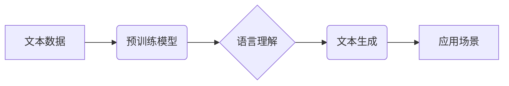

                 

## LLM技术革新对计算机科学的影响

> 关键词：大型语言模型 (LLM)、自然语言处理 (NLP)、深度学习、Transformer、计算机科学、人工智能

## 1. 背景介绍

近年来，人工智能（AI）领域取得了令人瞩目的进展，其中大型语言模型（LLM）的出现可谓是里程碑式的事件。LLM 是一种基于深度学习的强大人工智能模型，能够理解和生成人类语言，展现出令人惊叹的文本生成、翻译、问答和代码编写能力。其突破性的性能激发了人们对人工智能未来的无限憧憬，同时也对计算机科学领域产生了深远的影响。

传统计算机科学以逻辑、算法和数据结构为基础，侧重于精确计算和数据处理。而LLM的出现则为计算机科学注入了一股全新的活力，它将语言理解和生成纳入计算机科学的核心范畴，为解决更复杂、更接近人类智能的任务打开了大门。

## 2. 核心概念与联系

### 2.1  大型语言模型 (LLM)

大型语言模型是指参数量巨大、训练数据海量的人工智能模型，能够通过学习大量的文本数据，掌握语言的语法、语义和上下文关系，从而实现对语言的理解和生成。

### 2.2  深度学习

深度学习是机器学习的一个子领域，它利用多层神经网络来模拟人类大脑的学习过程。深度学习模型能够从海量数据中自动提取特征，并学习复杂的模式，从而实现更精准的预测和识别。

### 2.3  Transformer

Transformer是一种新型的神经网络架构，其核心是“注意力机制”，能够有效地捕捉文本序列中的长距离依赖关系。Transformer的出现极大地推动了LLM的发展，使其能够处理更长的文本序列，并获得更准确的理解和生成结果。

**Mermaid 流程图**

## 3. 核心算法原理 & 具体操作步骤

### 3.1  算法原理概述

LLM的核心算法原理是基于深度学习的Transformer架构，通过训练大量的文本数据，学习语言的语法、语义和上下文关系。训练过程主要包括以下步骤：

1. **数据预处理:** 将文本数据进行清洗、分词、标记等预处理操作，使其能够被模型理解。
2. **模型训练:** 使用深度学习算法，例如反向传播算法，训练Transformer模型，使其能够准确地预测下一个词。
3. **模型评估:** 使用测试数据评估模型的性能，例如准确率、困惑度等指标。
4. **模型调优:** 根据评估结果，调整模型参数，例如学习率、批处理大小等，以提高模型性能。

### 3.2  算法步骤详解

1. **词嵌入:** 将每个词映射到一个低维向量空间中，使得语义相似的词拥有相似的向量表示。
2. **注意力机制:** 允许模型关注文本序列中重要的部分，并捕捉长距离依赖关系。
3. **多头注意力:** 使用多个注意力头，从不同的角度关注文本序列，并融合信息。
4. **前馈网络:** 对每个词的嵌入向量进行非线性变换，提取更深层的语义特征。
5. **解码器:** 根据输入序列，生成目标序列，例如翻译、摘要等。

### 3.3  算法优缺点

**优点:**

* 能够处理大量文本数据，学习复杂的语言模式。
* 性能优异，在文本生成、翻译、问答等任务中取得了突破性进展。
* 可迁移性强，可以应用于多种自然语言处理任务。

**缺点:**

* 训练成本高，需要大量的计算资源和时间。
* 数据依赖性强，模型性能受训练数据质量影响较大。
* 缺乏可解释性，难以理解模型的决策过程。

### 3.4  算法应用领域

* **自然语言理解:** 文本分类、情感分析、问答系统、文本摘要等。
* **自然语言生成:** 机器翻译、对话系统、文本创作、代码生成等。
* **语音识别:** 将语音信号转换为文本。
* **图像识别:** 将图像识别为文本描述。

## 4. 数学模型和公式 & 详细讲解 & 举例说明

### 4.1  数学模型构建

LLM的数学模型主要基于Transformer架构，其核心是注意力机制和多层感知机。

**注意力机制:**

注意力机制允许模型关注文本序列中重要的部分，并捕捉长距离依赖关系。其核心思想是为每个词分配一个权重，权重越高，表示该词对模型的输出影响越大。

**公式:**

$$
\text{Attention}(Q, K, V) = \text{softmax}\left(\frac{Q K^T}{\sqrt{d_k}}\right) V
$$

其中：

* $Q$：查询矩阵
* $K$：键矩阵
* $V$：值矩阵
* $d_k$：键向量的维度
* $\text{softmax}$：softmax函数，将向量元素归一化到0到1之间

**多层感知机:**

多层感知机（MLP）是一种前馈神经网络，其结构由多个全连接层组成。

**公式:**

$$
h_l = \sigma(W_l h_{l-1} + b_l)
$$

其中：

* $h_l$：第$l$层的输出
* $W_l$：第$l$层的权重矩阵
* $b_l$：第$l$层的偏置向量
* $\sigma$：激活函数，例如ReLU函数

### 4.2  公式推导过程

注意力机制的公式推导过程较为复杂，涉及到矩阵运算、线性变换和softmax函数等。其核心思想是通过计算查询矩阵与键矩阵的点积，得到每个词对其他词的注意力权重，然后将这些权重与值矩阵相乘，得到最终的输出。

### 4.3  案例分析与讲解

例如，在机器翻译任务中，LLM可以将源语言文本序列映射到目标语言文本序列。其训练过程是通过学习大量的平行文本数据，将源语言文本与目标语言文本之间的对应关系。

## 5. 项目实践：代码实例和详细解释说明

### 5.1  开发环境搭建

LLM的开发环境通常需要安装Python、深度学习框架（例如TensorFlow、PyTorch）以及必要的库。

### 5.2  源代码详细实现

LLM的源代码通常由多个文件组成，包括模型架构定义文件、训练脚本文件、评估脚本文件等。

### 5.3  代码解读与分析

代码解读需要分析模型的架构、训练过程、评估指标等。

### 5.4  运行结果展示

运行结果展示包括模型的训练曲线、评估指标以及生成的文本输出等。

## 6. 实际应用场景

### 6.1  聊天机器人

LLM可以用于构建更智能、更自然的聊天机器人，能够理解用户的意图，并提供更精准的回复。

### 6.2  文本摘要

LLM可以自动生成文本摘要，提取文本的关键信息，节省用户阅读时间。

### 6.3  机器翻译

LLM可以实现更准确、更流畅的机器翻译，突破语言障碍，促进跨文化交流。

### 6.4  未来应用展望

LLM的应用场景还在不断扩展，未来可能应用于教育、医疗、法律等领域，为人类社会带来更多便利。

## 7. 工具和资源推荐

### 7.1  学习资源推荐

* **书籍:**

    * 《深度学习》
    * 《自然语言处理》
    * 《Transformer模型》

* **在线课程:**

    * Coursera
    * edX
    * Udacity

### 7.2  开发工具推荐

* **深度学习框架:** TensorFlow、PyTorch
* **文本处理库:** NLTK、spaCy
* **代码托管平台:** GitHub

### 7.3  相关论文推荐

* 《Attention Is All You Need》
* 《BERT: Pre-training of Deep Bidirectional Transformers for Language Understanding》
* 《GPT-3: Language Models are Few-Shot Learners》

## 8. 总结：未来发展趋势与挑战

### 8.1  研究成果总结

LLM技术取得了令人瞩目的进展，在自然语言处理领域展现出强大的能力。其核心算法原理、数学模型和应用场景都得到了深入研究和探索。

### 8.2  未来发展趋势

* **模型规模和性能提升:** 随着计算资源的不断发展，LLM模型规模将进一步扩大，性能将得到进一步提升。
* **多模态学习:** LLM将与其他模态数据（例如图像、音频）融合，实现更全面的理解和生成能力。
* **可解释性和安全性:** 研究将更加注重LLM的解释性和安全性，使其能够更好地服务于人类社会。

### 8.3  面临的挑战

* **数据获取和标注:** LLM的训练需要海量高质量的数据，数据获取和标注仍然是一个挑战。
* **计算资源消耗:** LLM的训练需要大量的计算资源，成本较高。
* **伦理和社会影响:** LLM的应用可能带来伦理和社会问题，需要谨慎考虑和应对。

### 8.4  研究展望

未来，LLM技术将继续发展，为人工智能领域带来更多突破，并为人类社会带来更多福祉。

## 9. 附录：常见问题与解答

* **什么是LLM？**

LLM是指参数量巨大、训练数据海量的人工智能模型，能够理解和生成人类语言。

* **LLM的训练过程如何？**

LLM的训练过程主要包括数据预处理、模型训练、模型评估和模型调优等步骤。

* **LLM有哪些应用场景？**

LLM的应用场景包括自然语言理解、自然语言生成、语音识别、图像识别等。

* **LLM的未来发展趋势是什么？**

LLM的未来发展趋势包括模型规模和性能提升、多模态学习、可解释性和安全性等。

作者：禅与计算机程序设计艺术 / Zen and the Art of Computer Programming 
<end_of_turn>

