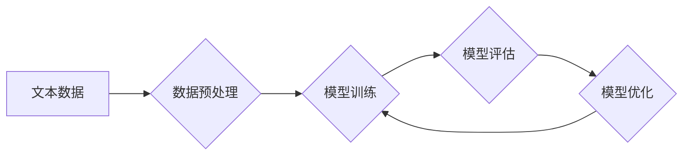

                 

## LLM的数据hungry：海量信息的价值

> 关键词：LLM, 大规模语言模型, 数据饥饿, 海量信息, 训练数据, 性能提升, 知识蒸馏, 数据质量, 伦理问题

### 1. 背景介绍

近年来，大规模语言模型（LLM）在自然语言处理领域取得了令人瞩目的成就。从文本生成、翻译到问答和代码编写，LLM展现出强大的能力，深刻地改变了我们与语言交互的方式。然而，这些模型的成功离不开海量数据的支撑。LLM 的训练过程如同一个“数据饥饿”的巨兽，需要吞噬大量的文本数据才能学习语言的复杂规律和知识结构。

### 2. 核心概念与联系

**2.1  LLM 的工作原理**

LLM 基于深度学习架构，通常采用 Transformer 网络结构。Transformer 网络通过自注意力机制捕捉文本序列中的长距离依赖关系，从而学习到更深层的语义理解。

**2.2  数据驱动学习**

LLM 的训练过程本质上是一个参数优化过程。模型通过学习大量的文本数据，调整自身的参数，以最小化预测结果与真实结果之间的差异。数据质量和数量直接影响模型的性能。

**2.3  数据饥饿现象**

随着模型规模的不断扩大，LLM 对数据的需求也越来越高。训练大型语言模型需要消耗大量的计算资源和时间，而数据是模型学习的基石。因此，LLM 的训练过程被称为“数据饥饿”。

**Mermaid 流程图**

### 3. 核心算法原理 & 具体操作步骤

**3.1  算法原理概述**

LLM 的训练主要基于监督学习和无监督学习两种方式。

* **监督学习:** 利用标注数据训练模型，例如文本分类、机器翻译等任务。
* **无监督学习:** 利用未标注数据训练模型，例如文本生成、文本摘要等任务。

**3.2  算法步骤详解**

1. **数据收集和预处理:** 收集大量文本数据，并进行清洗、分词、标记等预处理操作。
2. **模型构建:** 选择合适的深度学习架构，例如 Transformer 网络，并定义模型参数。
3. **模型训练:** 利用训练数据训练模型，通过反向传播算法调整模型参数，以最小化预测误差。
4. **模型评估:** 利用测试数据评估模型的性能，例如准确率、召回率、BLEU 等指标。
5. **模型优化:** 根据评估结果，调整模型参数、训练策略等，以提高模型性能。

**3.3  算法优缺点**

* **优点:** 能够学习到复杂的语言规律和知识结构，在自然语言处理任务中表现出色。
* **缺点:** 需要大量的训练数据和计算资源，训练过程时间长，容易出现过拟合问题。

**3.4  算法应用领域**

* 文本生成
* 机器翻译
* 问答系统
* 代码生成
* 文本摘要
* 情感分析

### 4. 数学模型和公式 & 详细讲解 & 举例说明

**4.1  数学模型构建**

LLM 的训练过程可以看作是一个概率模型的学习过程。模型的目标是学习一个概率分布，该分布能够生成与真实文本相似的文本序列。

**4.2  公式推导过程**

LLM 的训练通常使用交叉熵损失函数，该函数衡量模型预测结果与真实结果之间的差异。

$$
Loss = -\sum_{i=1}^{n} y_i \log p(y_i|x_1, x_2, ..., x_{i-1})
$$

其中：

* $n$ 是文本序列的长度
* $y_i$ 是真实标签
* $p(y_i|x_1, x_2, ..., x_{i-1})$ 是模型预测的概率

**4.3  案例分析与讲解**

例如，在文本生成任务中，LLM 需要预测下一个词的概率。模型会根据之前生成的词序列，计算每个词的概率，并选择概率最高的词作为下一个词。

### 5. 项目实践：代码实例和详细解释说明

**5.1  开发环境搭建**

LLM 的开发环境通常需要强大的计算资源，例如 GPU。可以使用 TensorFlow 或 PyTorch 等深度学习框架进行开发。

**5.2  源代码详细实现**

LLM 的源代码通常包含模型架构定义、数据预处理、模型训练、模型评估等部分。

**5.3  代码解读与分析**

代码解读需要理解模型架构、训练策略、数据处理流程等。

**5.4  运行结果展示**

运行结果可以展示模型的性能，例如文本生成质量、翻译准确率等。

### 6. 实际应用场景

**6.1  聊天机器人**

LLM 可以用于构建更智能的聊天机器人，能够进行自然流畅的对话。

**6.2  文本摘要**

LLM 可以自动生成文本摘要，提取文本的关键信息。

**6.3  代码生成**

LLM 可以根据自然语言描述生成代码，提高开发效率。

**6.4  未来应用展望**

LLM 的应用场景还在不断扩展，未来可能应用于教育、医疗、法律等领域。

### 7. 工具和资源推荐

**7.1  学习资源推荐**

* 深度学习书籍和课程
* LLM 相关论文和博客文章

**7.2  开发工具推荐**

* TensorFlow
* PyTorch
* Hugging Face Transformers

**7.3  相关论文推荐**

* BERT: Pre-training of Deep Bidirectional Transformers for Language Understanding
* GPT-3: Language Models are Few-Shot Learners
* T5: Text-to-Text Transfer Transformer

### 8. 总结：未来发展趋势与挑战

**8.1  研究成果总结**

LLM 在自然语言处理领域取得了显著进展，展现出强大的能力和潜力。

**8.2  未来发展趋势**

* 模型规模的进一步扩大
* 训练数据的多样化和高质量化
* 算法的创新和优化
* 伦理和安全问题的解决

**8.3  面临的挑战**

* 数据获取和隐私保护
* 计算资源的限制
* 模型的解释性和可控性
* 伦理和社会影响

**8.4  研究展望**

未来研究将继续探索 LLMs 的潜力，解决其面临的挑战，推动其在更多领域得到应用。

### 9. 附录：常见问题与解答

* **Q: 如何选择合适的 LLM 模型？**
* **A:** 选择合适的 LLM 模型需要考虑任务类型、数据规模、计算资源等因素。

* **Q: 如何评估 LLM 的性能？**
* **A:** 可以使用准确率、召回率、BLEU 等指标评估 LLM 的性能。

* **Q: 如何解决 LLM 的过拟合问题？**
* **A:** 可以使用正则化技术、数据增强、交叉验证等方法解决 LLM 的过拟合问题。

作者：禅与计算机程序设计艺术 / Zen and the Art of Computer Programming 
<end_of_turn>

