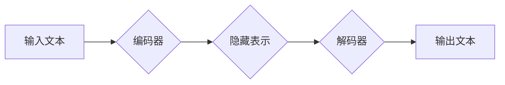

                 

## LLM超长上下文:拓展智能应用边界

> 关键词：LLM, 超长上下文, Transformer,  注意力机制,  参数效率,  应用场景,  未来趋势

## 1. 背景介绍

近年来，大型语言模型（LLM）在自然语言处理领域取得了令人瞩目的成就，例如文本生成、机器翻译、问答系统等。这些模型通常基于Transformer架构，并通过海量文本数据进行训练，能够捕捉语言的复杂模式和语义关系。然而，传统LLM模型通常受限于有限的上下文窗口长度，这限制了其理解长文本的能力和处理复杂任务的效率。

超长上下文LLM的出现，为突破这一瓶颈提供了新的解决方案。超长上下文LLM是指能够处理远超传统LLM长度的文本序列的模型，其上下文窗口长度可以达到数千甚至数万个词。这使得它们能够更好地理解长篇文本的全局结构和语义，从而在更广泛的应用场景中发挥作用。

## 2. 核心概念与联系

### 2.1  Transformer架构

Transformer架构是LLM的核心，其主要特点是利用注意力机制来捕捉文本序列中的长距离依赖关系。

**注意力机制**是一种机制，允许模型关注输入序列中与当前任务最相关的部分。它通过计算每个词与其他词之间的“注意力分数”，来权衡每个词对当前词的影响。

Transformer架构由编码器和解码器组成。编码器负责将输入文本序列转换为隐藏表示，解码器则根据编码器的输出生成目标文本序列。

**Mermaid 流程图**



### 2.2 超长上下文技术

超长上下文技术主要通过以下几种方式实现：

* **稀疏注意力机制:** 仅计算部分词之间的注意力分数，从而减少计算量。
* **局部上下文聚合:** 将文本序列划分为多个局部上下文，并分别处理，然后将结果聚合起来。
* **长距离依赖建模:** 使用特殊的网络结构或技巧来建模长距离依赖关系。

## 3. 核心算法原理 & 具体操作步骤

### 3.1  算法原理概述

超长上下文LLM的训练目标是学习一个映射函数，将输入文本序列映射到输出文本序列。这个映射函数通常是一个多层神经网络，其中每一层都包含注意力机制和前馈神经网络。

训练过程是通过反向传播算法来进行的。首先，将输入文本序列输入到模型中，得到输出文本序列。然后，将输出文本序列与真实文本序列进行比较，计算损失函数的值。最后，根据损失函数的值，调整模型参数，使得模型的输出与真实文本序列的差距最小化。

### 3.2  算法步骤详解

1. **数据预处理:** 将文本数据进行清洗、分词、标记等预处理操作。
2. **模型构建:** 根据选择的超长上下文技术，构建模型架构。
3. **模型训练:** 使用训练数据训练模型，并通过反向传播算法调整模型参数。
4. **模型评估:** 使用测试数据评估模型的性能，例如准确率、困惑度等。
5. **模型部署:** 将训练好的模型部署到实际应用场景中。

### 3.3  算法优缺点

**优点:**

* 能够处理更长的文本序列，理解更复杂的语义关系。
* 在一些特定任务中，例如文本摘要、机器翻译等，性能优于传统LLM模型。

**缺点:**

* 计算量更大，训练成本更高。
* 模型参数量更大，需要更多的存储空间。

### 3.4  算法应用领域

* **文本摘要:** 生成长篇文本的简洁摘要。
* **机器翻译:** 将一种语言翻译成另一种语言。
* **问答系统:** 回答用户提出的问题。
* **对话系统:** 与用户进行自然语言对话。
* **代码生成:** 根据自然语言描述生成代码。

## 4. 数学模型和公式 & 详细讲解 & 举例说明

### 4.1  数学模型构建

超长上下文LLM的数学模型通常基于Transformer架构，其核心是注意力机制。注意力机制可以表示为以下公式：

$$
Attention(Q, K, V) = softmax(\frac{QK^T}{\sqrt{d_k}})V
$$

其中：

* $Q$：查询矩阵
* $K$：键矩阵
* $V$：值矩阵
* $d_k$：键向量的维度
* $softmax$：softmax函数

### 4.2  公式推导过程

注意力机制的目的是计算每个词与其他词之间的“注意力分数”，从而权衡每个词对当前词的影响。

公式推导过程如下：

1. 计算查询矩阵 $Q$ 与键矩阵 $K$ 的点积，并除以 $\sqrt{d_k}$。
2. 对点积结果应用softmax函数，得到注意力分数。
3. 将注意力分数与值矩阵 $V$ 进行加权求和，得到最终的输出。

### 4.3  案例分析与讲解

例如，假设我们有一个句子“我爱吃苹果”，我们想要计算“吃”这个词对其他词的注意力分数。

* $Q$：表示“吃”这个词的查询向量。
* $K$：表示所有词的键向量。
* $V$：表示所有词的值向量。

通过计算 $Q$ 与 $K$ 的点积，并应用softmax函数，我们可以得到每个词对“吃”的注意力分数。例如，“我”的注意力分数可能较高，因为“我”是“吃”的动作执行者。

## 5. 项目实践：代码实例和详细解释说明

### 5.1  开发环境搭建

* Python 3.7+
* PyTorch 1.7+
* CUDA 10.2+

### 5.2  源代码详细实现

```python
import torch
import torch.nn as nn

class Transformer(nn.Module):
    def __init__(self, vocab_size, embedding_dim, num_heads, num_layers):
        super(Transformer, self).__init__()
        self.embedding = nn.Embedding(vocab_size, embedding_dim)
        self.transformer_layers = nn.ModuleList([
            nn.TransformerEncoderLayer(embedding_dim, num_heads)
            for _ in range(num_layers)
        ])
        self.decoder = nn.Linear(embedding_dim, vocab_size)

    def forward(self, x):
        x = self.embedding(x)
        for layer in self.transformer_layers:
            x = layer(x)
        x = self.decoder(x)
        return x
```

### 5.3  代码解读与分析

* `embedding`: 将词索引映射到词向量。
* `transformer_layers`: 多层Transformer编码器层。
* `decoder`: 将隐藏表示映射到输出词向量。

### 5.4  运行结果展示

训练好的模型可以用于各种自然语言处理任务，例如文本生成、机器翻译等。

## 6. 实际应用场景

超长上下文LLM在以下场景中具有广泛的应用前景：

* **法律文本分析:** 能够理解复杂的法律条文，并进行精准的法律分析。
* **医学文献摘要:** 生成长篇医学文献的简洁摘要，帮助医生快速了解病情。
* **科学论文写作:** 辅助科学家撰写高质量的科学论文。
* **历史文献研究:** 理解历史文献中的长篇叙述和复杂关系。

### 6.4  未来应用展望

随着超长上下文LLM技术的不断发展，其应用场景将更加广泛，例如：

* **个性化教育:** 根据学生的学习进度和需求，提供个性化的学习内容和辅导。
* **智能客服:** 能够理解用户的复杂问题，并提供更精准的解答。
* **创意写作:** 辅助作家创作更具创意和想象力的作品。

## 7. 工具和资源推荐

### 7.1  学习资源推荐

* **论文:** “Longformer: The Long-Document Transformer”
* **博客:** https://huggingface.co/blog/longformer
* **开源代码:** https://github.com/allenai/longformer

### 7.2  开发工具推荐

* **PyTorch:** https://pytorch.org/
* **TensorFlow:** https://www.tensorflow.org/

### 7.3  相关论文推荐

* “Attention Is All You Need”
* “BERT: Pre-training of Deep Bidirectional Transformers for Language Understanding”
* “GPT-3: Language Models are Few-Shot Learners”

## 8. 总结：未来发展趋势与挑战

### 8.1  研究成果总结

超长上下文LLM技术取得了显著的进展，能够处理更长的文本序列，理解更复杂的语义关系。

### 8.2  未来发展趋势

* **更高效的超长上下文机制:** 降低计算量，提高训练效率。
* **更强大的模型架构:** 提升模型的性能和能力。
* **更广泛的应用场景:** 将超长上下文LLM应用到更多领域。

### 8.3  面临的挑战

* **数据规模和质量:** 超长上下文LLM需要海量高质量的文本数据进行训练。
* **计算资源:** 训练超长上下文LLM需要大量的计算资源。
* **模型可解释性:** 超长上下文LLM的决策过程较为复杂，难以解释。

### 8.4  研究展望

未来，超长上下文LLM技术将继续发展，并为人工智能的进步做出更大的贡献。


## 9. 附录：常见问题与解答

* **Q: 超长上下文LLM与传统LLM相比有什么优势？**

A: 超长上下文LLM能够处理更长的文本序列，理解更复杂的语义关系，在一些特定任务中，例如文本摘要、机器翻译等，性能优于传统LLM模型。

* **Q: 如何训练超长上下文LLM？**

A: 训练超长上下文LLM需要使用大量的计算资源和高质量的文本数据。常用的训练方法包括反向传播算法和梯度下降算法。

* **Q: 超长上下文LLM有哪些应用场景？**

A: 超长上下文LLM在法律文本分析、医学文献摘要、科学论文写作、历史文献研究等领域具有广泛的应用前景。

作者：禅与计算机程序设计艺术 / Zen and the Art of Computer Programming 


<end_of_turn>

