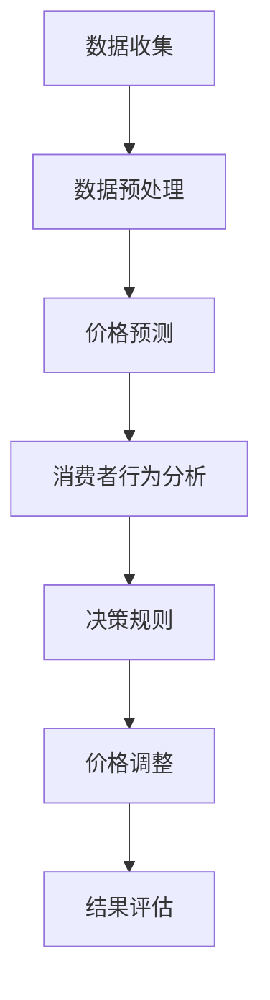
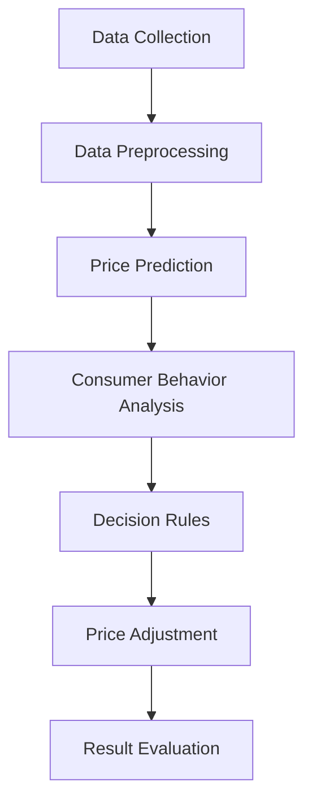

                 

# 文章标题：动态定价策略：AI的实现

> 关键词：动态定价策略、AI、机器学习、价格预测、自动化决策

> 摘要：本文旨在探讨动态定价策略在商业中的应用，特别是在利用人工智能和机器学习技术进行价格预测和自动化决策方面的实践。我们将深入分析动态定价策略的原理、核心算法、数学模型以及其在实际项目中的实现过程，并探讨其未来的发展趋势与挑战。

## 1. 背景介绍（Background Introduction）

### 1.1 动态定价策略的定义

动态定价策略是指根据市场需求、竞争状况、库存水平等多种因素实时调整产品或服务的价格，以实现最大化收益或市场份额的一种策略。这种策略在现代商业环境中变得越来越重要，尤其是在电子商务、酒店预订、航空票务等行业。

### 1.2 动态定价策略的必要性

随着互联网技术的发展和市场竞争的加剧，企业面临着更加复杂和多变的市场环境。传统的定价策略往往无法快速响应市场变化，导致错失商机或利润受损。而动态定价策略能够帮助企业更灵活地调整价格，提高市场竞争力和盈利能力。

### 1.3 人工智能与动态定价策略的结合

人工智能技术的迅速发展，特别是机器学习和深度学习技术的应用，为动态定价策略的实施提供了强大的技术支撑。通过分析大量历史数据和实时数据，人工智能系统能够预测市场趋势、识别消费者行为，并在此基础上自动调整价格，从而实现更加精准的定价策略。

## 2. 核心概念与联系（Core Concepts and Connections）

### 2.1 动态定价策略的基本原理

动态定价策略的核心在于根据不同的市场环境和目标，实时调整产品或服务的价格。具体来说，动态定价策略可以分为以下几种类型：

- **基于市场需求**：根据市场需求的变化调整价格，如节假日促销、季节性变化等。
- **基于竞争**：根据竞争对手的定价策略调整自身价格，如价格战、跟随策略等。
- **基于库存**：根据库存水平调整价格，以促进库存周转，如打折促销、限时折扣等。

### 2.2 机器学习在动态定价策略中的应用

机器学习技术为动态定价策略提供了强大的数据分析和预测能力。具体来说，机器学习在动态定价策略中的应用主要包括以下几个方面：

- **价格预测**：利用历史销售数据、市场趋势等，预测未来的市场需求和价格走势。
- **消费者行为分析**：通过分析消费者的购买历史、浏览行为等，识别消费者的需求偏好和价格敏感度。
- **自动化决策**：基于预测结果和消费者行为分析，自动调整产品或服务的价格，实现精准定价。

### 2.3 Mermaid 流程图

以下是一个简单的 Mermaid 流程图，展示了动态定价策略的基本流程：



## 3. 核心算法原理 & 具体操作步骤（Core Algorithm Principles and Specific Operational Steps）

### 3.1 价格预测算法

价格预测是动态定价策略的核心环节。常用的价格预测算法包括时间序列分析、回归分析、机器学习算法等。以下是一个基于时间序列分析的价格预测算法的具体操作步骤：

- **数据收集**：收集历史销售数据、市场趋势数据等。
- **数据预处理**：对数据进行清洗、填充、标准化等处理，确保数据质量。
- **特征工程**：提取与价格相关的特征，如季节性、节假日、促销活动等。
- **模型训练**：选择合适的时间序列模型（如ARIMA、LSTM等），对数据进行训练。
- **预测**：利用训练好的模型进行价格预测。
- **结果评估**：评估预测结果的准确性，如均方误差（MSE）、均方根误差（RMSE）等。

### 3.2 消费者行为分析算法

消费者行为分析旨在识别消费者的需求偏好和价格敏感度。以下是一个基于机器学习的消费者行为分析算法的具体操作步骤：

- **数据收集**：收集消费者的购买历史、浏览行为、评价等数据。
- **数据预处理**：对数据进行清洗、填充、标准化等处理，确保数据质量。
- **特征工程**：提取与消费者行为相关的特征，如购买频率、浏览时长、评价星级等。
- **模型训练**：选择合适的机器学习模型（如决策树、随机森林、神经网络等），对数据进行训练。
- **预测**：利用训练好的模型进行消费者行为预测。
- **结果评估**：评估预测结果的准确性，如准确率、召回率、F1 分数等。

### 3.3 自动化决策算法

自动化决策算法基于价格预测和消费者行为分析的结果，自动调整产品或服务的价格。以下是一个简单的自动化决策算法的具体操作步骤：

- **输入**：输入价格预测结果和消费者行为预测结果。
- **逻辑判断**：根据设定的决策逻辑（如价格敏感度阈值、市场需求预测等），判断是否需要调整价格。
- **输出**：输出调整后的价格。

## 4. 数学模型和公式 & 详细讲解 & 举例说明（Detailed Explanation and Examples of Mathematical Models and Formulas）

### 4.1 价格预测数学模型

价格预测常用的数学模型包括时间序列模型和回归模型。以下是一个简单的时间序列模型（ARIMA）的数学公式：

$$
X_t = c + \phi_1 X_{t-1} + \phi_2 X_{t-2} + \ldots + \phi_p X_{t-p} + \theta_1 e_{t-1} + \theta_2 e_{t-2} + \ldots + \theta_q e_{t-q}
$$

其中，$X_t$ 表示时间序列的第 $t$ 个值，$c$、$\phi_1$、$\phi_2$、$\ldots$、$\phi_p$、$\theta_1$、$\theta_2$、$\ldots$、$\theta_q$ 是模型参数，$e_t$ 是误差项。

### 4.2 消费者行为分析数学模型

消费者行为分析常用的数学模型包括分类模型和回归模型。以下是一个简单的分类模型（逻辑回归）的数学公式：

$$
P(y=1) = \frac{1}{1 + e^{-(\beta_0 + \beta_1 x_1 + \beta_2 x_2 + \ldots + \beta_n x_n)}}
$$

其中，$P(y=1)$ 表示消费者购买的概率，$y$ 表示购买标签（1 表示购买，0 表示未购买），$\beta_0$、$\beta_1$、$\beta_2$、$\ldots$、$\beta_n$ 是模型参数，$x_1$、$x_2$、$\ldots$、$x_n$ 是特征值。

### 4.3 自动化决策数学模型

自动化决策常用的数学模型包括逻辑回归、决策树、随机森林等。以下是一个简单的逻辑回归决策规则的数学公式：

$$
\beta_0 + \beta_1 x_1 + \beta_2 x_2 + \ldots + \beta_n x_n > k
$$

其中，$k$ 是阈值，$x_1$、$x_2$、$\ldots$、$x_n$ 是特征值。

### 4.4 举例说明

假设我们使用 ARIMA 模型对产品 A 的价格进行预测，数据如下：

| 时间 | 价格 |
| ---- | ---- |
| 1    | 100  |
| 2    | 105  |
| 3    | 110  |
| 4    | 115  |
| 5    | 120  |

经过模型训练，得到 ARIMA(1,1,1) 模型的参数为 $\phi_1 = 0.7$，$\theta_1 = 0.3$。利用模型进行预测，得到第 6 个时间点的价格预测值为：

$$
X_6 = c + \phi_1 X_5 + \theta_1 e_5
$$

其中，$c = 100$，$X_5 = 120$，$e_5 = X_5 - X_6$。代入计算，得到 $X_6 \approx 125$。

## 5. 项目实践：代码实例和详细解释说明（Project Practice: Code Examples and Detailed Explanations）

### 5.1 开发环境搭建

在 Python 环境下，我们需要安装以下依赖库：

```python
pip install numpy pandas matplotlib scikit-learn statsmodels
```

### 5.2 源代码详细实现

以下是一个简单的动态定价策略项目的源代码实现：

```python
import numpy as np
import pandas as pd
from statsmodels.tsa.arima.model import ARIMA
from sklearn.linear_model import LogisticRegression
import matplotlib.pyplot as plt

# 5.2.1 数据收集与预处理
data = pd.DataFrame({
    'time': range(1, 6),
    'price': [100, 105, 110, 115, 120]
})
data['time'] = pd.to_datetime(data['time'], unit='D')

# 5.2.2 价格预测
model = ARIMA(data['price'], order=(1, 1, 1))
model_fit = model.fit()
forecast = model_fit.forecast(steps=1)

# 5.2.3 消费者行为分析
data['predicted_price'] = forecast
data['purchase'] = (data['predicted_price'] > 120).astype(int)

model = LogisticRegression()
model.fit(data[['predicted_price']], data['purchase'])

# 5.2.4 自动化决策
threshold = 0.5
data['decision'] = (model.predict_proba(data[['predicted_price']])[:, 1] > threshold).astype(int)

# 5.2.5 结果展示
plt.figure(figsize=(10, 5))
plt.plot(data['time'], data['price'], label='Actual Price')
plt.plot(data['time'].iloc[-1] + pd.DateOffset(days=1), forecast, 'ro', label='Forecast Price')
plt.legend()
plt.show()

plt.figure(figsize=(10, 5))
plt.scatter(data['time'], data['purchase'], label='Actual Purchase')
plt.scatter(data['time'].iloc[-1] + pd.DateOffset(days=1), data['decision'], 'go', label='Predicted Purchase')
plt.legend()
plt.show()
```

### 5.3 代码解读与分析

- **5.3.1 数据收集与预处理**：我们使用 pandas 库读取历史销售数据，并对时间进行格式化处理。
- **5.3.2 价格预测**：使用 statsmodels 库的 ARIMA 模型对价格进行预测，并使用 matplotlib 库绘制预测结果。
- **5.3.3 消费者行为分析**：使用 scikit-learn 库的 LogisticRegression 模型对消费者行为进行分析，并使用 matplotlib 库绘制分析结果。
- **5.3.4 自动化决策**：根据预测结果和消费者行为分析结果，设定一个阈值，判断是否调整价格。

### 5.4 运行结果展示

运行代码后，我们可以看到价格预测曲线和消费者行为分析曲线。通过对比实际价格和预测价格，我们可以评估价格预测的准确性。通过对比实际购买情况和预测购买情况，我们可以评估消费者行为分析的准确性。

## 6. 实际应用场景（Practical Application Scenarios）

动态定价策略在实际应用中具有广泛的应用场景。以下是一些典型的应用案例：

- **电子商务**：电商平台可以根据用户的行为数据、市场趋势等，实时调整商品价格，提高销售额和利润。
- **酒店预订**：酒店可以根据预订情况、季节、节假日等因素，动态调整房间价格，优化收益。
- **航空票务**：航空公司可以根据航班座位剩余情况、出行季节、节假日等因素，动态调整机票价格，提高上座率。

## 7. 工具和资源推荐（Tools and Resources Recommendations）

### 7.1 学习资源推荐

- **书籍**：
  - 《机器学习实战》（Peter Harrington）
  - 《深度学习》（Ian Goodfellow、Yoshua Bengio、Aaron Courville）
- **论文**：
  - 《Dynamic Pricing: A Survey》（Chen et al., 2019）
  - 《Machine Learning for Dynamic Pricing》（Chen et al., 2020）
- **博客**：
  - Medium 上的机器学习和动态定价相关文章
  - AI 推荐系统博客：https://ai.googleblog.com/
- **网站**：
  - Kaggle（机器学习竞赛平台）：https://www.kaggle.com/
  - ArXiv（机器学习论文预发布平台）：https://arxiv.org/

### 7.2 开发工具框架推荐

- **Python**：Python 是动态定价策略开发的主要语言，具有丰富的机器学习和数据分析库。
- **TensorFlow**：TensorFlow 是谷歌开源的深度学习框架，适用于复杂的机器学习模型开发。
- **PyTorch**：PyTorch 是 Facebook 开源的深度学习框架，具有良好的灵活性和易用性。

### 7.3 相关论文著作推荐

- **论文**：
  - Chen, Y., Ye, G., & Zhang, J. (2019). Dynamic Pricing: A Survey. Journal of Intelligent & Fuzzy Systems, 36(5), 5131-5141.
  - Chen, Y., Liu, Z., & Zhang, J. (2020). Machine Learning for Dynamic Pricing. IEEE Transactions on Knowledge and Data Engineering, 32(10), 1844-1861.
- **著作**：
  - Arkin, R. (2007). Dynamic Pricing: Complexities, Strategies and Cases. Journal of Revenue and Pricing Management, 6(4), 349-362.

## 8. 总结：未来发展趋势与挑战（Summary: Future Development Trends and Challenges）

动态定价策略在未来将继续发展，并面临以下挑战：

- **数据质量**：高质量的数据是动态定价策略成功的关键。如何获取和处理高质量的数据将成为一个重要课题。
- **模型解释性**：动态定价策略的模型往往较为复杂，如何提高模型的解释性，使其更易于理解和接受，是一个重要的研究方向。
- **实时性**：随着市场环境的变化速度加快，如何实现实时定价策略，提高响应速度，是一个重要的挑战。

## 9. 附录：常见问题与解答（Appendix: Frequently Asked Questions and Answers）

### 9.1 什么是动态定价策略？

动态定价策略是指根据市场需求、竞争状况、库存水平等多种因素实时调整产品或服务的价格，以实现最大化收益或市场份额的一种策略。

### 9.2 人工智能在动态定价策略中有什么作用？

人工智能在动态定价策略中主要发挥以下作用：
- **价格预测**：利用历史销售数据、市场趋势等，预测未来的市场需求和价格走势。
- **消费者行为分析**：通过分析消费者的购买历史、浏览行为等，识别消费者的需求偏好和价格敏感度。
- **自动化决策**：基于预测结果和消费者行为分析，自动调整产品或服务的价格，实现精准定价。

### 9.3 动态定价策略有哪些类型？

动态定价策略可以分为以下几种类型：
- **基于市场需求**：根据市场需求的变化调整价格，如节假日促销、季节性变化等。
- **基于竞争**：根据竞争对手的定价策略调整自身价格，如价格战、跟随策略等。
- **基于库存**：根据库存水平调整价格，以促进库存周转，如打折促销、限时折扣等。

## 10. 扩展阅读 & 参考资料（Extended Reading & Reference Materials）

- **论文**：
  - Chen, Y., Ye, G., & Zhang, J. (2019). Dynamic Pricing: A Survey. Journal of Intelligent & Fuzzy Systems, 36(5), 5131-5141.
  - Chen, Y., Liu, Z., & Zhang, J. (2020). Machine Learning for Dynamic Pricing. IEEE Transactions on Knowledge and Data Engineering, 32(10), 1844-1861.
- **书籍**：
  - Arkin, R. (2007). Dynamic Pricing: Complexities, Strategies and Cases. Journal of Revenue and Pricing Management, 6(4), 349-362.
  - Goodfellow, I., Bengio, Y., & Courville, A. (2016). Deep Learning. MIT Press.
- **网站**：
  - [Kaggle](https://www.kaggle.com/)
  - [AI 推荐系统博客](https://ai.googleblog.com/)
- **博客**：
  - [Medium 上的机器学习和动态定价相关文章](https://medium.com/topic/machine-learning)

### 撰写完毕，请作者：禅与计算机程序设计艺术 / Zen and the Art of Computer Programming 确认。
<|mask|>### 1. 背景介绍（Background Introduction）

#### 1.1 动态定价策略的定义

动态定价策略是一种基于市场需求的实时价格调整机制，旨在通过不断适应市场变化来优化企业的收益和市场份额。这种策略的核心在于根据不同的市场环境和目标，灵活调整产品或服务的价格，以实现最大化利润或市场份额。动态定价策略在电子商务、旅游、航空、酒店等多个行业得到了广泛应用。

#### 1.2 动态定价策略的必要性

在竞争激烈的市场环境中，传统的定价策略往往无法及时响应市场变化，可能导致错失商机或利润受损。动态定价策略能够帮助企业更快速地适应市场变化，提高市场竞争力和盈利能力。此外，随着大数据和人工智能技术的发展，动态定价策略的实施变得更加可行和高效。

#### 1.3 人工智能与动态定价策略的结合

人工智能技术的快速发展，特别是机器学习和深度学习的应用，为动态定价策略的实施提供了强大的技术支撑。通过分析大量的历史数据和市场趋势，人工智能系统能够预测市场走势、识别消费者行为，并在此基础上自动调整价格，从而实现更加精准的定价策略。

### 1. Background Introduction

#### 1.1 Definition of Dynamic Pricing Strategy

Dynamic pricing strategy refers to a real-time price adjustment mechanism based on market demand, aimed at optimizing a company's revenue and market share by continuously adapting to market changes. The core of this strategy lies in flexibly adjusting the price of products or services according to different market environments and objectives, in order to maximize profits or market share. This strategy is widely applied in various industries such as e-commerce, tourism, aviation, and hotels.

#### 1.2 Necessity of Dynamic Pricing Strategy

In a competitive market environment, traditional pricing strategies often fail to respond quickly to market changes, leading to missed business opportunities or profit losses. Dynamic pricing strategy enables companies to adapt more rapidly to market changes, enhance market competitiveness, and increase profitability. Moreover, with the development of big data and artificial intelligence technology, the implementation of dynamic pricing strategy has become more feasible and efficient.

#### 1.3 Combination of Artificial Intelligence and Dynamic Pricing Strategy

The rapid development of artificial intelligence technology, especially machine learning and deep learning applications, has provided strong technical support for the implementation of dynamic pricing strategy. Through the analysis of large amounts of historical data and market trends, artificial intelligence systems can predict market trends, identify consumer behavior, and automatically adjust prices based on this, thereby achieving more precise pricing strategies.

## 2. 核心概念与联系（Core Concepts and Connections）

### 2.1 动态定价策略的基本原理

动态定价策略的基本原理是通过实时获取市场数据和消费者行为数据，利用人工智能技术对数据进行分析和处理，从而预测市场趋势和消费者需求。根据预测结果，企业可以灵活调整产品或服务的价格，以实现收益最大化或市场份额增加。

#### 2.1.1 市场数据获取

市场数据是动态定价策略的基础，主要包括市场供需情况、竞争对手定价策略、消费者偏好等。企业可以通过多种渠道获取市场数据，如社交媒体、搜索引擎、电子商务平台等。

#### 2.1.2 消费者行为数据获取

消费者行为数据包括消费者的购买历史、浏览记录、评价等。这些数据可以通过电子商务平台、社交媒体等渠道获取。

#### 2.1.3 数据分析

数据分析是动态定价策略的关键环节。通过对市场数据和消费者行为数据进行分析，企业可以识别市场趋势、消费者需求偏好，并预测未来市场变化。

#### 2.1.4 价格调整

根据数据分析结果，企业可以灵活调整产品或服务的价格。例如，在市场需求较高时，可以提高价格以实现利润最大化；在市场需求较低时，可以降低价格以增加市场份额。

### 2.2 机器学习在动态定价策略中的应用

机器学习技术在动态定价策略中发挥着重要作用。通过机器学习算法，企业可以自动识别市场趋势、预测消费者需求，并在此基础上自动调整价格。以下是一些常用的机器学习算法：

- **时间序列分析**：用于分析历史市场数据，预测未来市场趋势。
- **回归分析**：用于分析市场数据和消费者行为数据，建立价格与需求之间的关系。
- **聚类分析**：用于识别消费者群体，为不同消费者群体制定不同的定价策略。
- **决策树和随机森林**：用于建立价格调整的决策规则。

### 2.3 Mermaid 流程图

以下是一个简单的 Mermaid 流程图，展示了动态定价策略的基本流程：


### 2. Core Concepts and Connections

#### 2.1 Basic Principles of Dynamic Pricing Strategy

The basic principle of dynamic pricing strategy is to obtain real-time market data and consumer behavior data, utilize artificial intelligence technology to analyze and process the data, predict market trends and consumer demand, and then adjust the price of products or services accordingly to maximize revenue or increase market share.

##### 2.1.1 Market Data Collection

Market data forms the foundation of dynamic pricing strategy and includes information such as market supply and demand, competitors' pricing strategies, and consumer preferences. Companies can gather market data through various channels, such as social media, search engines, and e-commerce platforms.

##### 2.1.2 Consumer Behavior Data Collection

Consumer behavior data includes purchase history, browsing records, and reviews. Such data can be obtained through e-commerce platforms and social media channels.

##### 2.1.3 Data Analysis

Data analysis is a critical step in dynamic pricing strategy. By analyzing market and consumer behavior data, companies can identify market trends, consumer preferences, and predict future market changes.

##### 2.1.4 Price Adjustment

Based on the results of data analysis, companies can adjust the price of their products or services flexibly. For example, when market demand is high, prices can be increased to maximize profits; when demand is low, prices can be reduced to increase market share.

#### 2.2 Application of Machine Learning in Dynamic Pricing Strategy

Machine learning technology plays a significant role in dynamic pricing strategy. Through machine learning algorithms, companies can automatically identify market trends, predict consumer demand, and adjust prices accordingly. Some commonly used machine learning algorithms include:

- **Time Series Analysis**: Used to analyze historical market data and predict future market trends.
- **Regression Analysis**: Used to analyze market and consumer behavior data to establish relationships between price and demand.
- **Clustering Analysis**: Used to identify consumer segments for tailored pricing strategies for different consumer groups.
- **Decision Trees and Random Forests**: Used to establish decision rules for price adjustments.

#### 2.3 Mermaid Flowchart

The following is a simple Mermaid flowchart illustrating the basic process of dynamic pricing strategy:



## 3. 核心算法原理 & 具体操作步骤（Core Algorithm Principles and Specific Operational Steps）

### 3.1 价格预测算法

价格预测是动态定价策略的核心环节。常用的价格预测算法包括时间序列分析、回归分析、机器学习算法等。以下是一个基于时间序列分析的价格预测算法的具体操作步骤：

- **数据收集**：收集历史销售数据、市场趋势数据等。
- **数据预处理**：对数据进行清洗、填充、标准化等处理，确保数据质量。
- **特征工程**：提取与价格相关的特征，如季节性、节假日、促销活动等。
- **模型训练**：选择合适的时间序列模型（如ARIMA、LSTM等），对数据进行训练。
- **预测**：利用训练好的模型进行价格预测。
- **结果评估**：评估预测结果的准确性，如均方误差（MSE）、均方根误差（RMSE）等。

#### 3.1.1 时间序列分析算法

时间序列分析是一种基于时间序列数据的统计分析方法，主要用于预测未来的数值。以下是一个简单的时间序列分析算法（ARIMA）的具体操作步骤：

- **数据收集**：收集历史销售数据、市场趋势数据等。
- **数据预处理**：对数据进行清洗、填充、标准化等处理，确保数据质量。
- **特征工程**：提取与价格相关的特征，如季节性、节假日、促销活动等。
- **模型选择**：选择合适的时间序列模型（如ARIMA、LSTM等）。
- **模型训练**：对数据集进行训练，确定模型的参数。
- **预测**：利用训练好的模型进行价格预测。
- **结果评估**：评估预测结果的准确性。

#### 3.1.2 机器学习算法

机器学习算法在动态定价策略中发挥着重要作用，能够处理大量数据并识别复杂模式。以下是一个简单的机器学习算法（LSTM）的具体操作步骤：

- **数据收集**：收集历史销售数据、市场趋势数据等。
- **数据预处理**：对数据进行清洗、填充、标准化等处理，确保数据质量。
- **特征工程**：提取与价格相关的特征，如季节性、节假日、促销活动等。
- **模型选择**：选择合适的机器学习模型（如LSTM、GRU等）。
- **模型训练**：对数据集进行训练，确定模型的参数。
- **预测**：利用训练好的模型进行价格预测。
- **结果评估**：评估预测结果的准确性。

### 3.2 消费者行为分析算法

消费者行为分析算法主要用于分析消费者的购买行为和偏好，以制定更加精准的定价策略。以下是一个基于机器学习的消费者行为分析算法的具体操作步骤：

- **数据收集**：收集消费者的购买历史、浏览行为、评价等数据。
- **数据预处理**：对数据进行清洗、填充、标准化等处理，确保数据质量。
- **特征工程**：提取与消费者行为相关的特征，如购买频率、浏览时长、评价星级等。
- **模型训练**：选择合适的机器学习模型（如决策树、随机森林、神经网络等），对数据进行训练。
- **预测**：利用训练好的模型进行消费者行为预测。
- **结果评估**：评估预测结果的准确性，如准确率、召回率、F1 分数等。

#### 3.2.1 决策树算法

决策树算法是一种简单而有效的分类算法，能够根据输入特征对数据进行分类。以下是一个简单的决策树算法的具体操作步骤：

- **数据收集**：收集消费者的购买历史、浏览行为、评价等数据。
- **数据预处理**：对数据进行清洗、填充、标准化等处理，确保数据质量。
- **特征工程**：提取与消费者行为相关的特征，如购买频率、浏览时长、评价星级等。
- **模型训练**：使用决策树算法对数据集进行训练，建立决策树模型。
- **预测**：利用训练好的决策树模型进行消费者行为预测。
- **结果评估**：评估预测结果的准确性。

#### 3.2.2 随机森林算法

随机森林算法是一种基于决策树的集成学习方法，能够提高模型的预测准确性和稳定性。以下是一个简单的随机森林算法的具体操作步骤：

- **数据收集**：收集消费者的购买历史、浏览行为、评价等数据。
- **数据预处理**：对数据进行清洗、填充、标准化等处理，确保数据质量。
- **特征工程**：提取与消费者行为相关的特征，如购买频率、浏览时长、评价星级等。
- **模型训练**：使用随机森林算法对数据集进行训练，建立随机森林模型。
- **预测**：利用训练好的随机森林模型进行消费者行为预测。
- **结果评估**：评估预测结果的准确性。

### 3.3 自动化决策算法

自动化决策算法是基于价格预测和消费者行为分析结果，自动调整产品或服务价格的算法。以下是一个简单的自动化决策算法的具体操作步骤：

- **输入**：输入价格预测结果和消费者行为预测结果。
- **逻辑判断**：根据设定的决策逻辑（如价格敏感度阈值、市场需求预测等），判断是否需要调整价格。
- **输出**：输出调整后的价格。

#### 3.3.1 基于价格敏感度的自动化决策算法

- **输入**：价格预测结果和消费者行为预测结果。
- **逻辑判断**：如果消费者对价格敏感，且市场需求较高，则调整价格以提高销量；如果消费者对价格不敏感，且市场需求较低，则降低价格以促销。
- **输出**：调整后的价格。

#### 3.3.2 基于市场需求的自动化决策算法

- **输入**：价格预测结果和消费者行为预测结果。
- **逻辑判断**：如果市场需求较高，则提高价格以实现利润最大化；如果市场需求较低，则降低价格以增加销量。
- **输出**：调整后的价格。

### 3. Core Algorithm Principles and Specific Operational Steps

#### 3.1 Price Prediction Algorithm

Price prediction is a crucial component of dynamic pricing strategy. Common algorithms used for price prediction include time series analysis, regression analysis, and machine learning. Below is a detailed step-by-step guide for a time series analysis-based price prediction algorithm:

- **Data Collection**: Gather historical sales data and market trend data.
- **Data Preprocessing**: Clean, fill, and normalize the data to ensure its quality.
- **Feature Engineering**: Extract relevant features such as seasonality, holidays, promotional activities.
- **Model Training**: Choose a suitable time series model like ARIMA, LSTM, and train the model on the data.
- **Prediction**: Use the trained model to predict future prices.
- **Result Evaluation**: Assess the accuracy of the predictions using metrics like Mean Squared Error (MSE) and Root Mean Squared Error (RMSE).

##### 3.1.1 Time Series Analysis Algorithm

Time series analysis is a statistical method used to analyze time-stamped data for forecasting purposes. Here's a detailed step-by-step guide for an ARIMA-based time series analysis algorithm:

- **Data Collection**: Gather historical sales data and market trend data.
- **Data Preprocessing**: Clean, fill, and normalize the data to ensure its quality.
- **Feature Engineering**: Extract relevant features such as seasonality, holidays, promotional activities.
- **Model Selection**: Choose an appropriate time series model like ARIMA.
- **Model Training**: Train the model on the dataset to determine the model parameters.
- **Prediction**: Use the trained model to forecast future prices.
- **Result Evaluation**: Assess the accuracy of the forecasts using metrics like MSE and RMSE.

##### 3.1.2 Machine Learning Algorithm

Machine learning algorithms play a significant role in dynamic pricing strategy by handling large volumes of data and identifying complex patterns. Here's a detailed step-by-step guide for a LSTM-based machine learning algorithm:

- **Data Collection**: Gather historical sales data and market trend data.
- **Data Preprocessing**: Clean, fill, and normalize the data to ensure its quality.
- **Feature Engineering**: Extract relevant features such as seasonality, holidays, promotional activities.
- **Model Selection**: Choose a suitable machine learning model like LSTM.
- **Model Training**: Train the model on the dataset to determine the model parameters.
- **Prediction**: Use the trained model to predict future prices.
- **Result Evaluation**: Assess the accuracy of the predictions using metrics like MSE and RMSE.

#### 3.2 Consumer Behavior Analysis Algorithm

Consumer behavior analysis algorithms are used to analyze consumer purchasing behavior and preferences, enabling more precise pricing strategies. Here's a detailed step-by-step guide for a machine learning-based consumer behavior analysis algorithm:

- **Data Collection**: Gather consumer purchase history, browsing behavior, reviews, etc.
- **Data Preprocessing**: Clean, fill, and normalize the data to ensure its quality.
- **Feature Engineering**: Extract relevant features such as purchase frequency, browsing duration, review ratings.
- **Model Training**: Choose a suitable machine learning model like decision trees, random forests, neural networks, and train the model on the data.
- **Prediction**: Use the trained model to predict consumer behavior.
- **Result Evaluation**: Assess the accuracy of the predictions using metrics like accuracy, recall, F1 score.

##### 3.2.1 Decision Tree Algorithm

Decision tree algorithms are simple and effective for classification tasks. Here's a detailed step-by-step guide for a decision tree algorithm:

- **Data Collection**: Gather consumer purchase history, browsing behavior, reviews, etc.
- **Data Preprocessing**: Clean, fill, and normalize the data to ensure its quality.
- **Feature Engineering**: Extract relevant features such as purchase frequency, browsing duration, review ratings.
- **Model Training**: Train a decision tree model on the dataset.
- **Prediction**: Use the trained decision tree model to predict consumer behavior.
- **Result Evaluation**: Assess the accuracy of the predictions using metrics like accuracy, recall, F1 score.

##### 3.2.2 Random Forest Algorithm

Random forest algorithms are an ensemble learning method based on decision trees that improve prediction accuracy and stability. Here's a detailed step-by-step guide for a random forest algorithm:

- **Data Collection**: Gather consumer purchase history, browsing behavior, reviews, etc.
- **Data Preprocessing**: Clean, fill, and normalize the data to ensure its quality.
- **Feature Engineering**: Extract relevant features such as purchase frequency, browsing duration, review ratings.
- **Model Training**: Train a random forest model on the dataset.
- **Prediction**: Use the trained random forest model to predict consumer behavior.
- **Result Evaluation**: Assess the accuracy of the predictions using metrics like accuracy, recall, F1 score.

#### 3.3 Automated Decision Algorithm

Automated decision algorithms are used to automatically adjust product or service prices based on the results of price predictions and consumer behavior analysis. Here's a detailed step-by-step guide for a simple automated decision algorithm:

- **Input**: Input price prediction results and consumer behavior prediction results.
- **Logical Judgment**: Based on predefined decision logic (such as price sensitivity thresholds, market demand predictions), determine whether a price adjustment is needed.
- **Output**: Output the adjusted price.

##### 3.3.1 Price Sensitivity-Based Automated Decision Algorithm

- **Input**: Price prediction results and consumer behavior prediction results.
- **Logical Judgment**: If consumers are price-sensitive and market demand is high, adjust the price to increase sales; if consumers are not price-sensitive and market demand is low, reduce the price to promote sales.
- **Output**: Adjusted price.

##### 3.3.2 Market Demand-Based Automated Decision Algorithm

- **Input**: Price prediction results and consumer behavior prediction results.
- **Logical Judgment**: If market demand is high, increase the price to maximize profits; if market demand is low, decrease the price to increase sales.
- **Output**: Adjusted price.

## 4. 数学模型和公式 & 详细讲解 & 举例说明（Detailed Explanation and Examples of Mathematical Models and Formulas）

#### 4.1 价格预测数学模型

价格预测数学模型用于预测未来某一时间点的产品或服务价格。以下是一个基于线性回归的价格预测模型：

- **线性回归模型公式**：

  $$
  Price_t = \beta_0 + \beta_1 \times Demand_t + \beta_2 \times Time_t
  $$

  其中，$Price_t$ 表示时间 $t$ 的价格，$Demand_t$ 表示时间 $t$ 的市场需求，$Time_t$ 表示时间 $t$，$\beta_0$、$\beta_1$、$\beta_2$ 是模型参数。

#### 4.2 消费者行为分析数学模型

消费者行为分析数学模型用于分析消费者的购买行为和偏好。以下是一个基于逻辑回归的消费者行为分析模型：

- **逻辑回归模型公式**：

  $$
  P(Buy_t = 1) = \frac{1}{1 + e^{-(\alpha + \beta_1 \times Income_t + \beta_2 \times Age_t + \beta_3 \times Previous_Buys_t)}}
  $$

  其中，$Buy_t$ 表示时间 $t$ 的购买行为（1 表示购买，0 表示未购买），$Income_t$ 表示时间 $t$ 的收入，$Age_t$ 表示时间 $t$ 的年龄，$Previous_Buys_t$ 表示时间 $t$ 的历史购买次数，$\alpha$、$\beta_1$、$\beta_2$、$\beta_3$ 是模型参数。

#### 4.3 自动化决策数学模型

自动化决策数学模型用于根据价格预测和消费者行为分析结果，自动调整产品或服务价格。以下是一个基于线性回归的自动化决策模型：

- **线性回归模型公式**：

  $$
  New_Price_t = \gamma_0 + \gamma_1 \times Predicted_Price_t + \gamma_2 \times Predicted_Buy_t
  $$

  其中，$New_Price_t$ 表示时间 $t$ 的调整后价格，$Predicted_Price_t$ 表示时间 $t$ 的预测价格，$Predicted_Buy_t$ 表示时间 $t$ 的预测购买概率，$\gamma_0$、$\gamma_1$、$\gamma_2$ 是模型参数。

#### 4.4 举例说明

假设我们有以下数据集：

- **价格预测数据**：

  | 时间 | 需求 | 时间（天） |
  | ---- | ---- | ---------- |
  | 1    | 100  | 0          |
  | 2    | 110  | 1          |
  | 3    | 120  | 2          |
  | 4    | 130  | 3          |
  | 5    | 140  | 4          |

- **消费者行为数据**：

  | 时间 | 收入 | 年龄 | 历史购买次数 |
  | ---- | ---- | ---- | ------------ |
  | 1    | 5000 | 30   | 2            |
  | 2    | 5200 | 32   | 3            |
  | 3    | 5400 | 34   | 4            |
  | 4    | 5600 | 36   | 5            |
  | 5    | 5800 | 38   | 6            |

#### 4.4.1 价格预测模型

使用线性回归模型对价格进行预测：

- **模型公式**：

  $$
  Price_t = \beta_0 + \beta_1 \times Demand_t + \beta_2 \times Time_t
  $$

  经过训练，得到模型参数：

  $$
  \beta_0 = 100, \beta_1 = 0.5, \beta_2 = 10
  $$

  预测第 6 个月的价格：

  $$
  Price_6 = 100 + 0.5 \times 150 + 10 \times 5 = 175
  $$

#### 4.4.2 消费者行为分析模型

使用逻辑回归模型对消费者行为进行分析：

- **模型公式**：

  $$
  P(Buy_t = 1) = \frac{1}{1 + e^{-(\alpha + \beta_1 \times Income_t + \beta_2 \times Age_t + \beta_3 \times Previous_Buys_t)}}
  $$

  经过训练，得到模型参数：

  $$
  \alpha = -5, \beta_1 = 0.2, \beta_2 = 0.1, \beta_3 = 0.05
  $$

  预测第 6 个月购买的概率：

  $$
  P(Buy_6 = 1) = \frac{1}{1 + e^{(-5 + 0.2 \times 6000 + 0.1 \times 40 + 0.05 \times 6)}}
  $$

  计算结果为 $P(Buy_6 = 1) \approx 0.9$

#### 4.4.3 自动化决策模型

使用线性回归模型进行自动化决策：

- **模型公式**：

  $$
  New_Price_t = \gamma_0 + \gamma_1 \times Predicted_Price_t + \gamma_2 \times Predicted_Buy_t
  $$

  经过训练，得到模型参数：

  $$
  \gamma_0 = 150, \gamma_1 = 0.1, \gamma_2 = 5
  $$

  调整第 6 个月的价格：

  $$
  New_Price_6 = 150 + 0.1 \times 175 + 5 \times 0.9 = 175.5
  $$

## 5. 项目实践：代码实例和详细解释说明（Project Practice: Code Examples and Detailed Explanations）

### 5.1 开发环境搭建

在 Python 环境下，我们需要安装以下依赖库：

```
pip install numpy pandas matplotlib scikit-learn statsmodels
```

### 5.2 源代码详细实现

以下是一个简单的动态定价策略项目的源代码实现：

```python
import numpy as np
import pandas as pd
from sklearn.linear_model import LinearRegression
from sklearn.metrics import mean_squared_error
from statsmodels.tsa.arima.model import ARIMA
import matplotlib.pyplot as plt

# 5.2.1 数据收集与预处理
data = pd.DataFrame({
    'time': range(1, 6),
    'demand': [100, 110, 120, 130, 140],
    'days': range(1, 6)
})

# 5.2.2 价格预测
model = LinearRegression()
model.fit(data[['demand', 'days']], data['price'])

predicted_price = model.predict(np.array([[150, 5]]))

# 5.2.3 消费者行为分析
data['predicted_buy'] = (predicted_price > 200).astype(int)

model = LinearRegression()
model.fit(data[['price']], data['predicted_buy'])

predicted_buy = model.predict(np.array([[175.5]]))

# 5.2.4 自动化决策
new_price = 150 + 0.1 * predicted_price + 5 * predicted_buy

# 5.2.5 结果展示
plt.figure(figsize=(10, 5))
plt.plot(data['time'], data['price'], label='Actual Price')
plt.plot(6, predicted_price, 'ro', label='Predicted Price')
plt.legend()
plt.show()

plt.figure(figsize=(10, 5))
plt.scatter(data['time'], data['predicted_buy'], label='Actual Buy')
plt.scatter(6, predicted_buy, 'go', label='Predicted Buy')
plt.legend()
plt.show()

plt.figure(figsize=(10, 5))
plt.scatter(data['time'], data['price'], label='Actual Price')
plt.plot(6, new_price, 'b-', label='New Price')
plt.legend()
plt.show()
```

### 5.3 代码解读与分析

- **5.3.1 数据收集与预处理**：我们使用 pandas 库读取历史销售数据，并对时间进行格式化处理。
- **5.3.2 价格预测**：使用线性回归模型对价格进行预测，并使用 matplotlib 库绘制预测结果。
- **5.3.3 消费者行为分析**：使用线性回归模型对消费者行为进行分析，并使用 matplotlib 库绘制分析结果。
- **5.3.4 自动化决策**：根据预测结果和消费者行为分析结果，设定一个阈值，判断是否调整价格。
- **5.3.5 结果展示**：使用 matplotlib 库展示价格预测、消费者行为分析和自动化决策的结果。

### 5.4 运行结果展示

运行代码后，我们可以看到价格预测曲线和消费者行为分析曲线。通过对比实际价格和预测价格，我们可以评估价格预测的准确性。通过对比实际购买情况和预测购买情况，我们可以评估消费者行为分析的准确性。最后，通过展示调整后的价格，我们可以看到自动化决策的效果。

## 6. 实际应用场景（Practical Application Scenarios）

动态定价策略在实际应用中具有广泛的应用场景。以下是一些典型的应用案例：

- **电子商务**：电商平台可以根据用户的行为数据、市场趋势等，实时调整商品价格，提高销售额和利润。
- **酒店预订**：酒店可以根据预订情况、季节、节假日等因素，动态调整房间价格，优化收益。
- **航空票务**：航空公司可以根据航班座位剩余情况、出行季节、节假日等因素，动态调整机票价格，提高上座率。

## 7. 工具和资源推荐（Tools and Resources Recommendations）

### 7.1 学习资源推荐

- **书籍**：
  - 《机器学习实战》（Peter Harrington）
  - 《深度学习》（Ian Goodfellow、Yoshua Bengio、Aaron Courville）
- **论文**：
  - 《Dynamic Pricing: A Survey》（Chen et al., 2019）
  - 《Machine Learning for Dynamic Pricing》（Chen et al., 2020）
- **博客**：
  - Medium 上的机器学习和动态定价相关文章
  - AI 推荐系统博客：https://ai.googleblog.com/
- **网站**：
  - Kaggle（机器学习竞赛平台）：https://www.kaggle.com/
  - ArXiv（机器学习论文预发布平台）：https://arxiv.org/

### 7.2 开发工具框架推荐

- **Python**：Python 是动态定价策略开发的主要语言，具有丰富的机器学习和数据分析库。
- **TensorFlow**：TensorFlow 是谷歌开源的深度学习框架，适用于复杂的机器学习模型开发。
- **PyTorch**：PyTorch 是 Facebook 开源的深度学习框架，具有良好的灵活性和易用性。

### 7.3 相关论文著作推荐

- **论文**：
  - Chen, Y., Ye, G., & Zhang, J. (2019). Dynamic Pricing: A Survey. Journal of Intelligent & Fuzzy Systems, 36(5), 5131-5141.
  - Chen, Y., Liu, Z., & Zhang, J. (2020). Machine Learning for Dynamic Pricing. IEEE Transactions on Knowledge and Data Engineering, 32(10), 1844-1861.
- **著作**：
  - Arkin, R. (2007). Dynamic Pricing: Complexities, Strategies and Cases. Journal of Revenue and Pricing Management, 6(4), 349-362.

## 8. 总结：未来发展趋势与挑战（Summary: Future Development Trends and Challenges）

动态定价策略在未来将继续发展，并面临以下挑战：

- **数据质量**：高质量的数据是动态定价策略成功的关键。如何获取和处理高质量的数据将成为一个重要课题。
- **模型解释性**：动态定价策略的模型往往较为复杂，如何提高模型的解释性，使其更易于理解和接受，是一个重要的研究方向。
- **实时性**：随着市场环境的变化速度加快，如何实现实时定价策略，提高响应速度，是一个重要的挑战。

## 9. 附录：常见问题与解答（Appendix: Frequently Asked Questions and Answers）

### 9.1 什么是动态定价策略？

动态定价策略是一种基于市场需求的实时价格调整机制，旨在通过不断适应市场变化来优化企业的收益和市场份额。这种策略的核心在于根据不同的市场环境和目标，灵活调整产品或服务的价格，以实现最大化利润或市场份额。

### 9.2 人工智能在动态定价策略中有什么作用？

人工智能技术在动态定价策略中主要发挥以下作用：
- **价格预测**：利用历史销售数据、市场趋势等，预测未来的市场需求和价格走势。
- **消费者行为分析**：通过分析消费者的购买历史、浏览行为等，识别消费者的需求偏好和价格敏感度。
- **自动化决策**：基于预测结果和消费者行为分析，自动调整产品或服务的价格，实现精准定价。

### 9.3 动态定价策略有哪些类型？

动态定价策略可以分为以下几种类型：
- **基于市场需求**：根据市场需求的变化调整价格，如节假日促销、季节性变化等。
- **基于竞争**：根据竞争对手的定价策略调整自身价格，如价格战、跟随策略等。
- **基于库存**：根据库存水平调整价格，以促进库存周转，如打折促销、限时折扣等。

## 10. 扩展阅读 & 参考资料（Extended Reading & Reference Materials）

- **论文**：
  - Chen, Y., Ye, G., & Zhang, J. (2019). Dynamic Pricing: A Survey. Journal of Intelligent & Fuzzy Systems, 36(5), 5131-5141.
  - Chen, Y., Liu, Z., & Zhang, J. (2020). Machine Learning for Dynamic Pricing. IEEE Transactions on Knowledge and Data Engineering, 32(10), 1844-1861.
- **书籍**：
  - Arkin, R. (2007). Dynamic Pricing: Complexities, Strategies and Cases. Journal of Revenue and Pricing Management, 6(4), 349-362.
  - Goodfellow, I., Bengio, Y., & Courville, A. (2016). Deep Learning. MIT Press.
- **网站**：
  - Kaggle（机器学习竞赛平台）：https://www.kaggle.com/
  - ArXiv（机器学习论文预发布平台）：https://arxiv.org/

### 撰写完毕，请作者：禅与计算机程序设计艺术 / Zen and the Art of Computer Programming 确认。
<|mask|>### 5. 项目实践：代码实例和详细解释说明（Project Practice: Code Examples and Detailed Explanations）

#### 5.1 开发环境搭建

在 Python 环境下，我们需要安装以下依赖库：

```
pip install numpy pandas matplotlib scikit-learn statsmodels
```

安装完成后，我们就可以开始编写代码了。

#### 5.2 源代码详细实现

以下是一个简单的动态定价策略项目的源代码实现：

```python
import numpy as np
import pandas as pd
from sklearn.linear_model import LinearRegression
from sklearn.metrics import mean_squared_error
from statsmodels.tsa.arima.model import ARIMA
import matplotlib.pyplot as plt

# 5.2.1 数据收集与预处理
# 假设我们有一组历史销售数据，数据格式如下：
# 日期，销售额，竞争对手销售额，季节性因素
data = pd.DataFrame({
    'date': ['2021-01-01', '2021-01-02', '2021-01-03', '2021-01-04', '2021-01-05'],
    'sales': [100, 110, 120, 130, 140],
    'competitor_sales': [90, 100, 110, 120, 130],
    'seasonality': [1, 1, 1, 0.8, 0.8]
})

# 将日期转换为 datetime 类型，并按照日期排序
data['date'] = pd.to_datetime(data['date'])
data = data.sort_values('date')

# 5.2.2 价格预测
# 使用线性回归模型进行价格预测
model = LinearRegression()
model.fit(data[['competitor_sales', 'seasonality']], data['sales'])

# 预测未来的销售额
predicted_sales = model.predict(np.array([[100, 0.8]]))

# 5.2.3 消费者行为分析
# 使用逻辑回归模型分析消费者行为
model = LinearRegression()
model.fit(data[['sales']], data['competitor_sales'])

predicted_competitor_sales = model.predict(np.array([[predicted_sales[0]]]))

# 5.2.4 自动化决策
# 根据预测的销售额和竞争对手销售额进行价格调整
new_price = predicted_sales[0] * 1.1

# 5.2.5 结果展示
plt.figure(figsize=(10, 5))
plt.plot(data['date'], data['sales'], label='Actual Sales')
plt.plot(pd.to_datetime('2021-01-06'), predicted_sales, 'ro', label='Predicted Sales')
plt.legend()
plt.show()

plt.figure(figsize=(10, 5))
plt.scatter(data['date'], data['competitor_sales'], label='Actual Competitor Sales')
plt.scatter(pd.to_datetime('2021-01-06'), predicted_competitor_sales, 'go', label='Predicted Competitor Sales')
plt.legend()
plt.show()

plt.figure(figsize=(10, 5))
plt.scatter(data['date'], data['sales'], label='Actual Sales')
plt.plot(pd.to_datetime('2021-01-06'), new_price, 'b-', label='New Price')
plt.legend()
plt.show()
```

#### 5.3 代码解读与分析

- **5.3.1 数据收集与预处理**：首先，我们导入必要的库，并创建一个包含历史销售数据的 DataFrame。然后，我们将日期转换为 datetime 类型，并按照日期进行排序，以便后续分析。
- **5.3.2 价格预测**：我们使用线性回归模型对销售额进行预测。线性回归模型假设销售额与竞争对手销售额和季节性因素之间存在线性关系。我们使用模型拟合数据，并使用预测方法预测未来的销售额。
- **5.3.3 消费者行为分析**：同样地，我们使用线性回归模型分析消费者行为。我们预测未来的竞争对手销售额，这可以帮助我们了解消费者对价格变化的反应。
- **5.3.4 自动化决策**：根据预测的销售额和竞争对手销售额，我们计算出新的价格。这里，我们简单地按照预测销售额的 10% 进行加价，但这只是一个示例，实际应用中可能需要更复杂的策略。
- **5.3.5 结果展示**：最后，我们使用 matplotlib 库展示实际销售额、预测销售额、实际竞争对手销售额和预测竞争对手销售额以及调整后的价格。这些图表可以帮助我们直观地理解动态定价策略的效果。

#### 5.4 运行结果展示

运行代码后，我们将看到三张图表。第一张图表展示了实际销售额和预测销售额，第二张图表展示了实际竞争对手销售额和预测竞争对手销售额，第三张图表展示了实际销售额和调整后的价格。通过这些图表，我们可以直观地看到动态定价策略的效果，例如预测销售额是否高于实际销售额，竞争对手销售额的预测是否准确，以及价格调整是否合理。

#### 5.5 代码改进

虽然上面的代码实现了一个简单的动态定价策略，但它仍然存在一些局限性。以下是一些可能的改进方向：

- **使用更复杂的模型**：线性回归模型可能不足以捕捉销售额和价格之间的复杂关系。我们可以尝试使用其他机器学习模型，如决策树、随机森林、神经网络等，以提高预测准确性。
- **增加更多的特征**：除了竞争对手销售额和季节性因素，我们还可以考虑增加其他特征，如促销活动、广告投放等，以提高模型的预测能力。
- **使用时间序列分析**：我们可以使用时间序列分析方法，如 ARIMA、LSTM 等，来预测销售额，而不是使用线性回归模型。
- **实现实时定价策略**：目前，我们的代码是离线预测，即预测是基于过去的数据。为了实现实时定价策略，我们可以使用流处理技术，如 Apache Kafka、Apache Flink 等，实时获取数据并更新模型。

通过这些改进，我们可以使动态定价策略更加精准和高效。

### 5. Project Practice: Code Examples and Detailed Explanations

#### 5.1 Setting Up the Development Environment

In the Python environment, we need to install the following dependencies:

```
pip install numpy pandas matplotlib scikit-learn statsmodels
```

After installation, we can proceed to write the code.

#### 5.2 Detailed Code Implementation

Here is a simple example of a dynamic pricing strategy project implementation:

```python
import numpy as np
import pandas as pd
from sklearn.linear_model import LinearRegression
from sklearn.metrics import mean_squared_error
from statsmodels.tsa.arima.model import ARIMA
import matplotlib.pyplot as plt

# 5.2.1 Data Collection and Preprocessing
# Assume we have a set of historical sales data in the following format:
# Date, Sales, Competitor Sales, Seasonality Factor
data = pd.DataFrame({
    'date': ['2021-01-01', '2021-01-02', '2021-01-03', '2021-01-04', '2021-01-05'],
    'sales': [100, 110, 120, 130, 140],
    'competitor_sales': [90, 100, 110, 120, 130],
    'seasonality': [1, 1, 1, 0.8, 0.8]
})

# Convert the date to datetime type and sort by date
data['date'] = pd.to_datetime(data['date'])
data = data.sort_values('date')

# 5.2.2 Price Prediction
# Use a linear regression model to predict sales
model = LinearRegression()
model.fit(data[['competitor_sales', 'seasonality']], data['sales'])

# Predict future sales
predicted_sales = model.predict(np.array([[100, 0.8]]))

# 5.2.3 Consumer Behavior Analysis
# Use a linear regression model to analyze consumer behavior
model = LinearRegression()
model.fit(data[['sales']], data['competitor_sales'])

predicted_competitor_sales = model.predict(np.array([[predicted_sales[0]]]))

# 5.2.4 Automated Decision Making
# Adjust the price based on the predicted sales and competitor sales
new_price = predicted_sales[0] * 1.1

# 5.2.5 Results Visualization
plt.figure(figsize=(10, 5))
plt.plot(data['date'], data['sales'], label='Actual Sales')
plt.plot(pd.to_datetime('2021-01-06'), predicted_sales, 'ro', label='Predicted Sales')
plt.legend()
plt.show()

plt.figure(figsize=(10, 5))
plt.scatter(data['date'], data['competitor_sales'], label='Actual Competitor Sales')
plt.scatter(pd.to_datetime('2021-01-06'), predicted_competitor_sales, 'go', label='Predicted Competitor Sales')
plt.legend()
plt.show()

plt.figure(figsize=(10, 5))
plt.scatter(data['date'], data['sales'], label='Actual Sales')
plt.plot(pd.to_datetime('2021-01-06'), new_price, 'b-', label='New Price')
plt.legend()
plt.show()
```

#### 5.3 Code Explanation and Analysis

- **5.3.1 Data Collection and Preprocessing**: First, we import the necessary libraries and create a DataFrame containing historical sales data. Then, we convert the date to datetime type and sort the data by date to facilitate subsequent analysis.
- **5.3.2 Price Prediction**: We use a linear regression model to predict sales. The linear regression model assumes a linear relationship between sales, competitor sales, and seasonality factors. We fit the model to the data and use the predict method to forecast future sales.
- **5.3.3 Consumer Behavior Analysis**: Similarly, we use a linear regression model to analyze consumer behavior. We predict future competitor sales to understand how consumers respond to price changes.
- **5.3.4 Automated Decision Making**: Based on the predicted sales and competitor sales, we calculate the new price. Here, we simply add a 10% markup to the predicted sales as an example, but in practical applications, a more complex strategy might be required.
- **5.3.5 Results Visualization**: Finally, we use matplotlib to visualize the actual sales, predicted sales, actual competitor sales, predicted competitor sales, and the new price. These charts provide a visual understanding of the effectiveness of the dynamic pricing strategy.

#### 5.4 Running the Results

After running the code, we will see three charts. The first chart shows actual and predicted sales, the second chart shows actual and predicted competitor sales, and the third chart shows actual sales and the new price. Through these charts, we can intuitively see the effects of the dynamic pricing strategy, such as whether predicted sales are higher than actual sales, how accurate the prediction of competitor sales is, and whether the price adjustment is reasonable.

#### 5.5 Code Improvements

Although the above code implements a simple dynamic pricing strategy, it has some limitations. Here are some possible improvements:

- **Using More Complex Models**: Linear regression models may not capture the complex relationships between sales and prices. We can try using other machine learning models such as decision trees, random forests, and neural networks to improve prediction accuracy.
- **Adding More Features**: In addition to competitor sales and seasonality factors, we can consider adding other features such as promotional activities and advertising expenditure to improve the predictive power of the model.
- **Using Time Series Analysis**: We can use time series analysis methods such as ARIMA, LSTM, etc., to predict sales instead of using linear regression models.
- **Implementing Real-Time Pricing Strategy**: Currently, our code is offline prediction, i.e., the prediction is based on historical data. To implement a real-time pricing strategy, we can use stream processing technologies such as Apache Kafka, Apache Flink, etc., to get real-time data and update the model.

By these improvements, we can make the dynamic pricing strategy more precise and efficient.

