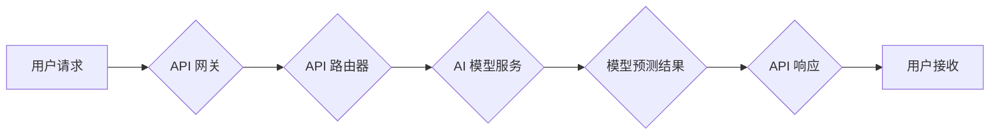

                 

## RESTful API设计：AI模型服务化的最佳实践

> 关键词：RESTful API, AI模型服务化, 微服务架构, API设计原则, 模型部署, 性能优化, 安全性

### 1. 背景介绍

随着人工智能技术的飞速发展，AI模型在各个领域得到广泛应用，从图像识别、自然语言处理到推荐系统，AI模型正在改变着我们的生活。然而，将训练好的AI模型部署到生产环境并提供服务，是一个复杂且充满挑战的任务。

传统的软件开发模式难以满足AI模型服务化的需求。AI模型通常具有以下特点：

* **复杂性:** AI模型的结构和参数通常非常复杂，难以直接集成到传统应用程序中。
* **实时性:** 一些AI应用需要实时响应用户请求，例如语音识别和机器翻译。
* **可扩展性:** 随着用户数量的增加，AI模型的服务需要能够自动扩展以满足需求。
* **安全性:** AI模型的数据和服务需要受到保护，防止恶意攻击和数据泄露。

为了解决这些问题，RESTful API设计成为AI模型服务化的最佳实践。RESTful API是一种基于互联网协议的架构风格，它以资源为中心，使用HTTP方法进行操作，并遵循一系列设计原则，例如可缓存性、可扩展性和层次性。

### 2. 核心概念与联系

**2.1 RESTful API 核心概念**

RESTful API基于以下核心概念：

* **资源:**  API中的所有数据和功能都以资源的形式表示，每个资源都有一个唯一的标识符（URI）。
* **HTTP 方法:**  使用HTTP方法（GET、POST、PUT、DELETE等）对资源进行操作。
* **状态码:**  HTTP状态码用于指示请求的处理结果，例如200表示成功，404表示资源不存在。
* **媒体类型:**  API使用媒体类型（例如JSON、XML）来定义数据格式。

**2.2 RESTful API 与 AI 模型服务化的联系**

RESTful API为AI模型服务化提供了以下优势：

* **易于集成:**  RESTful API可以与各种应用程序和平台轻松集成，例如移动应用程序、Web应用程序和云服务。
* **可扩展性:**  RESTful API可以轻松扩展以满足不断增长的需求，例如使用负载均衡器和缓存机制。
* **可维护性:**  RESTful API的设计原则使得API更容易维护和更新。
* **安全性:**  RESTful API可以使用多种安全机制，例如身份验证和授权，来保护数据和服务。

**2.3  RESTful API 架构流程图**



### 3. 核心算法原理 & 具体操作步骤

**3.1 算法原理概述**

RESTful API的设计遵循一系列原则，这些原则旨在确保API易于使用、可维护和可扩展。

* **客户端-服务器架构:**  API采用客户端-服务器架构，客户端发送请求，服务器处理请求并返回响应。
* **Statelessness:**  每个请求都是独立的，服务器不会存储客户端状态信息。
* **缓存:**  API可以利用缓存机制来提高性能。
* **层次性:**  API可以组织成层次结构，方便管理和维护。
* **代码上层抽象:**  API使用抽象层来隐藏底层复杂性，方便开发人员使用。

**3.2 算法步骤详解**

1. **定义 API 资源:**  确定API将提供哪些资源，并为每个资源定义一个唯一的URI。
2. **设计 API 操作:**  为每个资源定义相应的HTTP方法，例如GET用于获取资源，POST用于创建资源，PUT用于更新资源，DELETE用于删除资源。
3. **定义数据格式:**  选择合适的媒体类型，例如JSON或XML，来定义API数据格式。
4. **编写 API 文档:**  为API编写详细的文档，包括API接口定义、请求参数、响应格式和错误处理。
5. **部署 API:**  将API部署到服务器上，并配置负载均衡器和缓存机制以提高性能。
6. **测试和监控 API:**  对API进行测试，并监控API性能和错误日志。

**3.3 算法优缺点**

**优点:**

* 易于使用和集成
* 可扩展性强
* 可维护性好
* 安全性高

**缺点:**

* 对于复杂业务场景，RESTful API可能需要大量的代码和配置
* 跨域请求可能会带来安全风险

**3.4 算法应用领域**

RESTful API广泛应用于各种领域，例如：

* **移动应用程序开发:**  RESTful API可以用于提供移动应用程序所需的后台服务。
* **Web 应用程序开发:**  RESTful API可以用于构建Web应用程序的API接口。
* **云计算:**  RESTful API是云计算服务的核心组成部分。
* **物联网:**  RESTful API可以用于连接和管理物联网设备。

### 4. 数学模型和公式 & 详细讲解 & 举例说明

**4.1 数学模型构建**

在RESTful API设计中，数学模型主要用于分析API性能和资源利用率。例如，可以使用队列理论来建模API请求的处理过程，并计算API的吞吐量和延迟。

**4.2 公式推导过程**

假设API有N个并发请求，每个请求的处理时间服从指数分布，平均处理时间为T。则API的平均响应时间可以表示为：

$$
R = T + \frac{T}{N}
$$

其中：

* R表示API的平均响应时间
* T表示每个请求的平均处理时间
* N表示并发请求的数量

**4.3 案例分析与讲解**

假设一个API的平均处理时间为100毫秒，并发请求数量为1000。则API的平均响应时间为：

$$
R = 100 + \frac{100}{1000} = 100.1 \text{ 毫秒}
$$

从公式可以看出，随着并发请求数量的增加，API的平均响应时间会逐渐降低。

### 5. 项目实践：代码实例和详细解释说明

**5.1 开发环境搭建**

* Python 3.x
* Flask 或 FastAPI 框架
* TensorFlow 或 PyTorch 深度学习框架
* Docker 和 Kubernetes

**5.2 源代码详细实现**

```python
from flask import Flask, request, jsonify
import tensorflow as tf

app = Flask(__name__)

# 加载模型
model = tf.keras.models.load_model('model.h5')

@app.route('/predict', methods=['POST'])
def predict():
    data = request.get_json()
    # 进行数据预处理
    processed_data = preprocess(data)
    # 进行模型预测
    prediction = model.predict(processed_data)
    # 返回预测结果
    return jsonify({'prediction': prediction.tolist()})

if __name__ == '__main__':
    app.run(debug=True)
```

**5.3 代码解读与分析**

* 使用Flask框架构建API
* 定义`/predict`路由，接收POST请求
* 从请求中获取数据并进行预处理
* 使用加载的模型进行预测
* 返回预测结果

**5.4 运行结果展示**

通过发送POST请求到`/predict`路由，可以获取模型的预测结果。

### 6. 实际应用场景

**6.1 图像识别**

RESTful API可以用于提供图像识别服务，例如识别物体、场景和人脸。

**6.2 自然语言处理**

RESTful API可以用于提供自然语言处理服务，例如文本分类、情感分析和机器翻译。

**6.3 推荐系统**

RESTful API可以用于提供推荐系统服务，例如推荐商品、电影和音乐。

**6.4 未来应用展望**

随着人工智能技术的不断发展，RESTful API在AI模型服务化中的应用场景将更加广泛，例如：

* **个性化医疗:**  提供基于患者数据的个性化医疗诊断和治疗建议。
* **智能制造:**  实现智能工厂的自动化生产和质量控制。
* **自动驾驶:**  提供自动驾驶汽车所需的感知和决策服务。

### 7. 工具和资源推荐

**7.1 学习资源推荐**

* RESTful API 设计指南: https://restfulapi.net/
* API 设计最佳实践: https://martinfowler.com/articles/rest-apis.html

**7.2 开发工具推荐**

* Postman: https://www.postman.com/
* Swagger: https://swagger.io/

**7.3 相关论文推荐**

* Fielding, R. T. (2000). Architectural styles and the design of network-based software architectures. Doctoral dissertation, University of California, Irvine.

### 8. 总结：未来发展趋势与挑战

**8.1 研究成果总结**

RESTful API设计为AI模型服务化提供了有效的解决方案，其易于使用、可扩展性和安全性使其成为广泛应用的架构风格。

**8.2 未来发展趋势**

* **微服务架构:**  将AI模型服务拆分成多个独立的服务，提高系统的可维护性和扩展性。
* **Serverless 架构:**  使用无服务器计算平台部署AI模型服务，降低运营成本和提高弹性。
* **边缘计算:**  将AI模型部署到边缘设备上，降低延迟和提高实时性。

**8.3 面临的挑战**

* **模型部署和管理:**  如何高效地部署和管理大量的AI模型服务是一个挑战。
* **模型性能优化:**  如何提高AI模型的服务性能和效率是一个持续的研究方向。
* **安全性:**  如何保护AI模型的数据和服务免受恶意攻击是一个重要的安全问题。

**8.4 研究展望**

未来，AI模型服务化将朝着更加智能、高效和安全的方向发展。研究者将继续探索新的技术和方法，以解决AI模型服务化的挑战，并推动人工智能技术的广泛应用。

### 9. 附录：常见问题与解答

**9.1 如何选择合适的 API 设计原则？**

选择合适的 API 设计原则取决于具体的应用场景和需求。例如，对于需要高性能的应用，可以采用缓存和异步处理等技术；对于需要高安全性的应用，可以采用身份验证和授权等机制。

**9.2 如何进行 API 测试和监控？**

可以使用 Postman 等工具进行 API 测试，并使用监控工具监控 API 的性能和错误日志。

**9.3 如何提高 AI 模型的服务性能？**

可以采用模型压缩、模型量化和模型并行等技术来提高 AI 模型的服务性能。


作者：禅与计算机程序设计艺术 / Zen and the Art of Computer Programming 
<end_of_turn>

