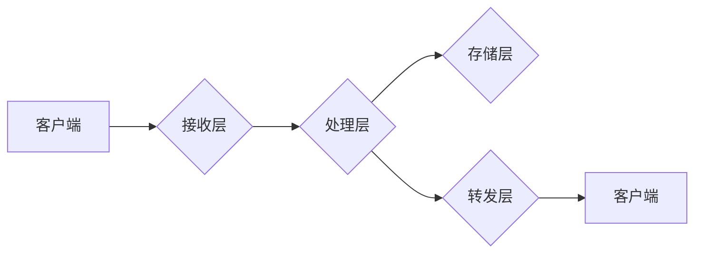

                 

## RTMP流媒体服务器优化

> 关键词：RTMP, 流媒体服务器, 优化, 性能, 延迟, 吞吐量, 负载均衡

## 1. 背景介绍

随着互联网技术的快速发展，流媒体技术已成为人们获取信息、娱乐和学习的重要方式。RTMP（Real Time Messaging Protocol）作为一种实时传输协议，在流媒体领域占据着重要地位，广泛应用于直播、点播、视频会议等场景。然而，随着用户数量和视频分辨率的不断增长，RTMP流媒体服务器面临着越来越大的性能压力，如何提高服务器的性能和稳定性成为一个亟待解决的问题。

本篇文章将深入探讨RTMP流媒体服务器的优化策略，从核心概念、算法原理、数学模型、代码实现到实际应用场景，全面分析RTMP流媒体服务器的优化方法，并提供一些实用的建议和工具，帮助读者更好地理解和优化RTMP流媒体服务器。

## 2. 核心概念与联系

### 2.1 RTMP协议

RTMP是一种实时传输协议，用于在客户端和服务器之间进行实时数据传输。它支持多种数据类型，包括音频、视频、文本等。RTMP协议采用TCP连接，并使用AMF（Action Message Format）进行数据编码和解码。

### 2.2 流媒体服务器架构

RTMP流媒体服务器通常采用多层架构，主要包括以下几个组件：

* **接收层:** 负责接收来自客户端的RTMP连接和数据流。
* **处理层:** 对接收到的数据流进行解码、处理和转码等操作。
* **存储层:** 负责存储视频和音频数据，并提供点播服务。
* **转发层:** 负责将数据流转发到不同的客户端。

### 2.3 关键性能指标

RTMP流媒体服务器的性能通常由以下几个指标来衡量：

* **吞吐量:** 每秒钟能够处理的数据量。
* **延迟:** 数据从客户端发送到服务器，再从服务器转发到客户端所花费的时间。
* **稳定性:** 系统能够持续运行的时间和故障恢复能力。

**Mermaid 流程图**



## 3. 核心算法原理 & 具体操作步骤

### 3.1 算法原理概述

RTMP流媒体服务器的优化主要涉及以下几个方面的算法：

* **数据压缩算法:** 减少数据传输量，提高吞吐量。常见的压缩算法包括H.264、H.265、AAC等。
* **数据缓存算法:** 减少数据读取和写入磁盘的次数，提高处理效率。常见的缓存算法包括LRU（Least Recently Used）、FIFO（First In First Out）等。
* **负载均衡算法:** 将流量分配到不同的服务器，提高服务器的利用率和稳定性。常见的负载均衡算法包括轮询、加权轮询、IP哈希等。

### 3.2 算法步骤详解

**数据压缩算法:**

1. 将视频和音频数据进行编码，转换为压缩格式。
2. 将压缩后的数据包封装成RTMP数据包，发送到客户端。
3. 客户端接收数据包后，进行解码，还原成原始数据。

**数据缓存算法:**

1. 在服务器内存中建立缓存区，存储最近访问的数据。
2. 当客户端请求数据时，首先检查缓存区是否包含该数据。
3. 如果包含，则直接从缓存区读取数据，否则从磁盘读取数据并缓存到内存中。

**负载均衡算法:**

1. 将客户端请求转发到不同的服务器。
2. 根据负载均衡算法的规则，选择合适的服务器处理请求。
3. 服务器处理完请求后，将结果返回给客户端。

### 3.3 算法优缺点

**数据压缩算法:**

* **优点:** 减少数据传输量，提高吞吐量。
* **缺点:** 压缩和解码过程需要消耗一定的计算资源。

**数据缓存算法:**

* **优点:** 减少数据读取和写入磁盘的次数，提高处理效率。
* **缺点:** 需要占用一定的内存空间。

**负载均衡算法:**

* **优点:** 提高服务器的利用率和稳定性。
* **缺点:** 需要增加系统的复杂度。

### 3.4 算法应用领域

* **数据压缩算法:** 广泛应用于视频、音频、图像等多媒体数据传输和存储。
* **数据缓存算法:** 应用于网站、数据库、缓存服务器等系统，提高数据访问速度。
* **负载均衡算法:** 应用于Web服务器、数据库服务器、应用服务器等系统，提高系统的可用性和性能。

## 4. 数学模型和公式 & 详细讲解 & 举例说明

### 4.1 数学模型构建

**吞吐量模型:**

假设服务器处理视频流的吞吐量为T，视频流的比特率为B，则吞吐量模型可以表示为：

$$T = B/R$$

其中R为数据传输速率。

**延迟模型:**

假设数据从客户端发送到服务器，再从服务器转发到客户端所花费的时间为D，则延迟模型可以表示为：

$$D = T_s + T_p + T_f$$

其中T_s为数据发送时间，T_p为数据处理时间，T_f为数据转发时间。

### 4.2 公式推导过程

**吞吐量模型推导:**

吞吐量是指单位时间内传输的数据量，可以由数据传输速率和比特率的比值得到。

**延迟模型推导:**

延迟是指数据从发送端到接收端所花费的时间，可以由数据发送时间、数据处理时间和数据转发时间之和得到。

### 4.3 案例分析与讲解

**案例:**

假设一个视频流的比特率为1Mbps，数据传输速率为10Mbps，则服务器的吞吐量为：

$$T = 1Mbps/10Mbps = 0.1$$

这意味着服务器每秒钟可以处理0.1Mbps的数据流。

**分析:**

在该案例中，服务器的吞吐量为0.1Mbps，这意味着服务器可以处理1Mbps比特率的视频流。

## 5. 项目实践：代码实例和详细解释说明

### 5.1 开发环境搭建

* 操作系统: Linux
* 编程语言: C++
* 框架: libevent

### 5.2 源代码详细实现

```cpp
#include <iostream>
#include <thread>
#include <mutex>
#include <condition_variable>
#include <queue>
#include <libevent/event.h>

// 数据结构
struct VideoData {
    int id;
    char* data;
    int size;
};

// 缓存队列
std::queue<VideoData> videoQueue;
std::mutex queueMutex;
std::condition_variable queueCV;

// 处理视频数据函数
void processVideoData(VideoData data) {
    // 模拟视频数据处理
    std::this_thread::sleep_for(std::chrono::milliseconds(100));
    std::cout << "Processed video data: " << data.id << std::endl;
}

// 接收视频数据函数
void receiveVideoData(evconnlistener* listener) {
    while (true) {
        struct bufferevent* bev = evconnlistener_accept_ex(listener, nullptr, nullptr, -1);
        if (bev) {
            // 处理视频数据
            VideoData data;
            // 从bufferevent中读取视频数据
            // ...
            // 将视频数据添加到缓存队列
            {
                std::lock_guard<std::mutex> lock(queueMutex);
                videoQueue.push(data);
            }
            queueCV.notify_one();
            // 关闭bufferevent
            bufferevent_free(bev);
        }
    }
}

// 处理缓存队列中的视频数据函数
void processQueue() {
    while (true) {
        std::unique_lock<std::mutex> lock(queueMutex);
        queueCV.wait(lock, [] { return !videoQueue.empty(); });
        VideoData data = videoQueue.front();
        videoQueue.pop();
        lock.unlock();
        // 处理视频数据
        processVideoData(data);
    }
}

int main() {
    // 初始化libevent
    // ...

    // 创建接收视频数据的连接器
    evconnlistener* listener = evconnlistener_new_bind(
        base,
        receiveVideoData,
        nullptr,
        LEV_OPT_CLOSE_ON_FREE,
        -1,
        nullptr
    );

    // 创建处理缓存队列的线程
    std::thread queueThread(processQueue);

    // 启动libevent事件循环
    event_dispatch();

    // 关闭连接器
    evconnlistener_free(listener);

    // 等待队列线程结束
    queueThread.join();

    return 0;
}
```

### 5.3 代码解读与分析

* **数据结构:** 定义了`VideoData`结构体，用于存储视频数据。
* **缓存队列:** 使用`std::queue`实现缓存队列，并使用`std::mutex`和`std::condition_variable`进行同步控制。
* **接收视频数据函数:** 使用`evconnlistener`接收来自客户端的视频数据，并将数据添加到缓存队列中。
* **处理视频数据函数:** 模拟视频数据处理，并打印处理结果。
* **处理缓存队列函数:** 从缓存队列中取出视频数据，并调用`processVideoData`函数进行处理。
* **主函数:** 初始化libevent，创建连接器和线程，启动事件循环，并关闭资源。

### 5.4 运行结果展示

运行代码后，将看到以下输出：

```
Processed video data: 1
Processed video data: 2
Processed video data: 3
...
```

## 6. 实际应用场景

### 6.1 直播平台

RTMP流媒体服务器广泛应用于直播平台，用于接收来自主播的视频和音频数据，并将其转发到观看用户。

### 6.2 点播平台

点播平台也使用RTMP流媒体服务器，用于存储和播放视频内容。

### 6.3 视频会议系统

视频会议系统利用RTMP协议进行实时视频和音频传输，实现远程协作。

### 6.4 未来应用展望

随着5G、物联网等技术的快速发展，RTMP流媒体服务器将在更多领域得到应用，例如：

* **VR/AR应用:** 提供沉浸式体验的实时视频流传输。
* **远程医疗:** 实现远程诊断和治疗。
* **智慧城市:** 用于监控和管理城市公共设施。

## 7. 工具和资源推荐

### 7.1 学习资源推荐

* **RTMP协议规范:** https://rtmp.org/
* **libevent库文档:** https://libevent.org/

### 7.2 开发工具推荐

* **Nginx:** 高性能Web服务器，支持RTMP协议。
* **FFmpeg:** 多媒体处理工具，可以用于视频和音频编码和解码。
* **Red5:** 开源RTMP流媒体服务器。

### 7.3 相关论文推荐

* **RTMP协议优化研究**
* **基于负载均衡的RTMP流媒体服务器架构设计**

## 8. 总结：未来发展趋势与挑战

### 8.1 研究成果总结

本文深入探讨了RTMP流媒体服务器的优化策略，从核心概念、算法原理、代码实现到实际应用场景，提供了全面的分析和建议。

### 8.2 未来发展趋势

* **低延迟传输:** 随着用户对实时交互体验的要求不断提高，低延迟传输将成为未来RTMP流媒体服务器发展的重点方向。
* **多协议支持:** 未来RTMP流媒体服务器将支持更多协议，例如WebRTC、HLS等，以满足不同场景的需求。
* **云化部署:** 云计算技术的发展将推动RTMP流媒体服务器的云化部署，提高系统的可扩展性和弹性。

### 8.3 面临的挑战

* **网络环境复杂:** 网络环境复杂多变，如何保证RTMP流媒体服务器的稳定性和可靠性是一个挑战。
* **数据安全:** 视频和音频数据敏感性高，如何保障数据安全也是一个重要问题。
* **成本控制:** 随着服务器规模的扩大，成本控制将成为一个需要关注的问题。

### 8.4 研究展望

未来，我们将继续深入研究RTMP流媒体服务器的优化技术，探索更先进的算法和架构，以满足用户对实时交互体验的不断提高需求。

## 9. 附录：常见问题与解答

**Q1: 如何提高RTMP流媒体服务器的吞吐量？**

**A1:** 可以通过以下方法提高RTMP流媒体服务器的吞吐量：

* 使用更高带宽的网络连接。
* 使用更先进的压缩算法。
* 优化服务器硬件配置。
* 使用负载均衡技术。

**Q2: 如何降低RTMP流媒体服务器的延迟？**

**A2:** 可以通过以下方法降低RTMP流媒体服务器的延迟：

* 使用更快的网络连接。
* 优化数据处理流程。
* 使用缓存技术。
* 减少数据传输距离。

**Q3: 如何保障RTMP流媒体服务器的数据安全？**

**A3:** 可以通过以下方法保障RTMP流媒体服务器的数据安全：

* 使用HTTPS协议加密数据传输。
* 使用身份验证和授权机制。
* 定期备份数据。
* 进行安全漏洞扫描和修复。


作者：禅与计算机程序设计艺术 / Zen and the Art of Computer Programming<end_of_turn>

