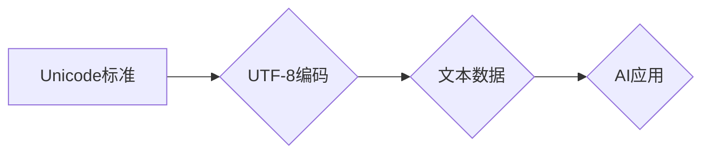

                 

## UTF-8编码：国际化AI应用的文本基础

> 关键词：UTF-8, 编码, 国际化, AI, 文本处理, 字符集, 计算机科学

## 1. 背景介绍

在当今全球化的信息时代，人工智能（AI）技术蓬勃发展，其应用领域不断拓展。然而，AI应用的成功离不开高质量的文本数据作为基础。文本数据的多样性，特别是不同语言和字符集的复杂性，对AI模型的训练和部署提出了严峻挑战。

传统的ASCII编码体系仅能表示英文字母、数字和一些常用符号，无法涵盖全球范围内广泛使用的各种语言和字符。为了解决这一问题，Unicode标准应运而生，它定义了一个庞大的字符集，能够表示几乎所有已知语言和符号。

UTF-8作为Unicode标准的变体，凭借其灵活、高效和广泛兼容性，成为了现代互联网和AI应用中最为流行的文本编码方案。本文将深入探讨UTF-8编码的原理、应用以及在国际化AI应用中的重要意义。

## 2. 核心概念与联系

### 2.1 Unicode标准

Unicode标准是一个国际化的字符编码标准，旨在统一所有语言和符号的表示方式。它定义了一个庞大的字符集，每个字符都拥有一个唯一的编码值。Unicode标准的优势在于：

* **涵盖广泛的字符集:** Unicode能够表示几乎所有已知语言和符号，包括汉字、日文、韩文、希腊文、阿拉伯文等。
* **统一的字符表示:** Unicode为每个字符提供了一个唯一的编码值，避免了不同编码方案之间字符映射的混乱。
* **可扩展性:** Unicode标准不断更新，以适应新语言和符号的出现。

### 2.2 UTF-8编码

UTF-8是Unicode标准的一种变体，它采用变长编码方案，每个字符的编码长度根据其字符值而定。

* **ASCII兼容性:** UTF-8与ASCII编码兼容，这意味着ASCII字符在UTF-8编码中仍然使用原来的单字节编码。
* **变长编码:** UTF-8使用1到4个字节来编码Unicode字符，对于ASCII字符使用1个字节，对于其他字符使用2、3或4个字节。
* **灵活性和高效性:** UTF-8的变长编码方案使得它在存储和传输文本数据时更加灵活和高效。

**Mermaid 流程图**



## 3. 核心算法原理 & 具体操作步骤

### 3.1 算法原理概述

UTF-8编码的原理基于变长编码方案。每个Unicode字符都对应一个唯一的编码值，而UTF-8编码则根据这个编码值决定使用多少个字节来表示该字符。

* **1字节编码:** 用于表示ASCII字符（0x00 - 0x7F）。
* **2字节编码:** 用于表示Unicode字符范围U+0080 - U+07FF。
* **3字节编码:** 用于表示Unicode字符范围U+0800 - U+FFFF。
* **4字节编码:** 用于表示Unicode字符范围U+10000 - U+10FFFF。

### 3.2 算法步骤详解

1. **确定字符编码:** 根据Unicode字符集，确定该字符对应的编码值。
2. **计算字节数:** 根据编码值的范围，计算需要使用多少个字节来表示该字符。
3. **生成字节序列:** 根据UTF-8编码规则，将编码值转换为相应的字节序列。

### 3.3 算法优缺点

**优点:**

* **ASCII兼容性:** UTF-8与ASCII编码兼容，可以避免数据转换问题。
* **灵活性和高效性:** UTF-8的变长编码方案使得它在存储和传输文本数据时更加灵活和高效。
* **广泛兼容性:** UTF-8是目前互联网和AI应用中最为流行的文本编码方案，几乎所有软件和系统都支持UTF-8编码。

**缺点:**

* **编码复杂性:** UTF-8的编码规则相对复杂，需要一定的理解才能正确处理。
* **内存占用:** 对于一些包含大量非ASCII字符的文本数据，UTF-8编码可能会占用更多的内存空间。

### 3.4 算法应用领域

UTF-8编码广泛应用于各种领域，包括：

* **互联网:** 用于网页编码、电子邮件、HTTP协议等。
* **软件开发:** 用于存储和处理文本数据。
* **数据库:** 用于存储和检索文本数据。
* **人工智能:** 用于训练和部署AI模型，特别是处理多语言文本数据。

## 4. 数学模型和公式 & 详细讲解 & 举例说明

### 4.1 数学模型构建

UTF-8编码的数学模型可以描述为一个映射关系，将Unicode字符集中的每个字符映射到一个唯一的字节序列。

**公式:**

```latex
f(c) = b_1 b_2 ... b_n
```

其中：

* $f(c)$ 表示Unicode字符 $c$ 的UTF-8编码。
* $b_1, b_2, ..., b_n$ 表示编码序列中的字节。
* $n$ 表示编码序列的长度。

### 4.2 公式推导过程

UTF-8编码的具体规则可以通过以下公式推导：

* **1字节编码:** 如果 $c$ 的Unicode值在 $0x00 - 0x7F$ 之间，则 $n = 1$，$b_1 = c$。
* **2字节编码:** 如果 $c$ 的Unicode值在 $0x080 - 0x7FF$ 之间，则 $n = 2$，$b_1 = 0xC0 | (c >> 6)$，$b_2 = 0x80 | (c & 0x3F)$。
* **3字节编码:** 如果 $c$ 的Unicode值在 $0x0800 - 0xFFFF$ 之间，则 $n = 3$，$b_1 = 0xE0 | (c >> 12)$，$b_2 = 0x80 | ((c >> 6) & 0x3F)$，$b_3 = 0x80 | (c & 0x3F)$。
* **4字节编码:** 如果 $c$ 的Unicode值在 $0x10000 - 0x10FFFF$ 之间，则 $n = 4$，$b_1 = 0xF0 | (c >> 18)$，$b_2 = 0x80 | ((c >> 12) & 0x3F)$，$b_3 = 0x80 | ((c >> 6) & 0x3F)$，$b_4 = 0x80 | (c & 0x3F)$。

### 4.3 案例分析与讲解

**示例:**

将Unicode字符“你好” (U+4F60, U+597D) 编码为UTF-8。

* “你好”的Unicode值分别为U+4F60和U+597D。
* 由于这两个Unicode值都在0x0800-0xFFFF范围内，因此需要使用3字节编码。
* 按照公式推导，可以得到以下UTF-8编码序列:

```
你好 = E4 BD A0 E5 A5 BD
```

## 5. 项目实践：代码实例和详细解释说明

### 5.1 开发环境搭建

本示例使用Python语言进行UTF-8编码的演示。

**依赖:**

* Python 3.x

**安装:**

```bash
pip install
```

### 5.2 源代码详细实现

```python
import codecs

# 字符串
text = "你好世界"

# 使用utf-8编码
encoded_text = text.encode('utf-8')

# 解码为字符串
decoded_text = codecs.decode(encoded_text, 'utf-8')

# 打印结果
print(f"原始字符串: {text}")
print(f"UTF-8编码: {encoded_text}")
print(f"解码后的字符串: {decoded_text}")
```

### 5.3 代码解读与分析

1. **导入codecs模块:** 该模块提供编码和解码功能。
2. **定义字符串:** 设定需要编码的字符串为“你好世界”。
3. **使用utf-8编码:** 使用`encode('utf-8')`方法将字符串编码为UTF-8字节序列。
4. **解码为字符串:** 使用`codecs.decode(encoded_text, 'utf-8')`方法将UTF-8字节序列解码回字符串。
5. **打印结果:** 打印原始字符串、UTF-8编码和解码后的字符串。

### 5.4 运行结果展示

```
原始字符串: 你好世界
UTF-8编码: b'\xe4\xbd\xa0\xe7\x95\x8c\xe7\x95\x8c'
解码后的字符串: 你好世界
```

## 6. 实际应用场景

### 6.1 国际化网站和应用程序

在全球化的互联网时代，网站和应用程序需要支持多种语言和字符集。UTF-8编码能够有效地处理不同语言的文本数据，确保网站和应用程序能够在不同地区和文化背景下正常运行。

### 6.2 多语言文本处理

在自然语言处理（NLP）领域，许多任务需要处理多语言文本数据，例如机器翻译、文本分类、情感分析等。UTF-8编码能够确保不同语言的文本数据能够被正确识别和处理。

### 6.3 数据存储和检索

在数据库系统中，UTF-8编码可以用于存储和检索文本数据，支持多种语言和字符集。

### 6.4 AI模型训练和部署

在训练和部署AI模型时，需要使用高质量的文本数据作为训练样本。UTF-8编码能够确保文本数据能够被正确处理和理解，从而提高AI模型的性能。

### 6.5 未来应用展望

随着人工智能技术的不断发展，UTF-8编码在AI应用中的作用将更加重要。例如，在跨语言对话系统、多模态AI应用等领域，UTF-8编码将成为确保文本数据正确处理和理解的关键技术。

## 7. 工具和资源推荐

### 7.1 学习资源推荐

* **Unicode Consortium:** https://www.unicode.org/
* **UTF-8编码介绍:** https://en.wikipedia.org/wiki/UTF-8

### 7.2 开发工具推荐

* **Python:** https://www.python.org/
* **Java:** https://www.oracle.com/java/technologies/javase-downloads.html

### 7.3 相关论文推荐

* **The UTF-8 Transformation Format:** https://www.unicode.org/reports/tr15/

## 8. 总结：未来发展趋势与挑战

### 8.1 研究成果总结

本文深入探讨了UTF-8编码的原理、应用以及在国际化AI应用中的重要意义。UTF-8编码凭借其ASCII兼容性、灵活性和广泛兼容性，成为了现代互联网和AI应用中最为流行的文本编码方案。

### 8.2 未来发展趋势

随着人工智能技术的不断发展，UTF-8编码将面临新的挑战和机遇。例如，在处理更复杂的多语言文本数据、支持更多新语言和字符集等方面，UTF-8编码需要不断改进和完善。

### 8.3 面临的挑战

* **编码复杂性:** UTF-8编码规则相对复杂，需要一定的理解才能正确处理。
* **内存占用:** 对于一些包含大量非ASCII字符的文本数据，UTF-8编码可能会占用更多的内存空间。
* **跨平台兼容性:** 虽然UTF-8编码具有广泛兼容性，但仍然存在一些跨平台兼容性问题。

### 8.4 研究展望

未来研究方向包括：

* **开发更高效的UTF-8编码算法:** 降低编码和解码的复杂度和时间消耗。
* **提高UTF-8编码的内存利用率:** 减少对内存空间的占用。
* **解决跨平台兼容性问题:** 确保UTF-8编码在不同平台和系统下能够正常工作。


## 9. 附录：常见问题与解答

**问题:** 为什么需要使用UTF-8编码？

**答案:** 因为UTF-8编码能够支持几乎所有已知语言和字符集，而传统的ASCII编码只能表示英文字母、数字和一些常用符号。

**问题:** UTF-8编码和ASCII编码有什么区别？

**答案:** UTF-8编码是一种变长编码方案，可以表示Unicode字符集中的所有字符，而ASCII编码是一种固定长度编码方案，只能表示ASCII字符集中的字符。

**问题:** 如何判断文本数据是否使用UTF-8编码？

**答案:** 可以使用文本编辑器或编程语言中的函数来查看文本数据的编码方式。

**问题:** 如何转换文本数据编码？

**答案:** 可以使用文本编辑器或编程语言中的函数来转换文本数据的编码方式。


作者：禅与计算机程序设计艺术 / Zen and the Art of Computer Programming 
<end_of_turn>

