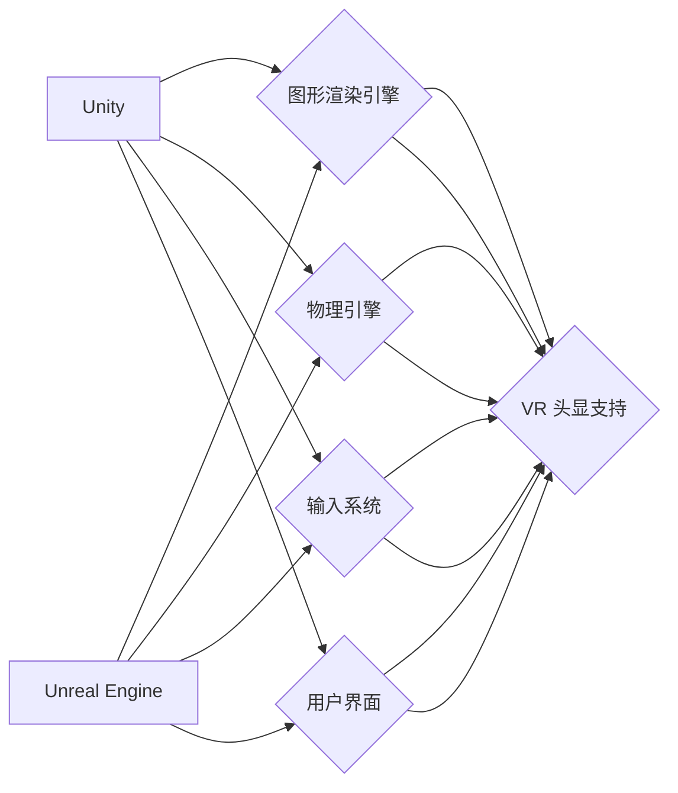

                 

## VR 内容开发框架对比：Unity VR 和 Unreal VR 的选择

> 关键词：VR开发, Unity, Unreal Engine, VR内容, 游戏开发, 虚拟现实

## 1. 背景介绍

虚拟现实 (VR) 技术近年来发展迅速，其沉浸式体验和交互性为游戏、教育、医疗等领域带来了革命性的改变。作为构建 VR 内容的基石，VR 开发框架扮演着至关重要的角色。Unity 和 Unreal Engine 是业界两大主流的 VR 开发框架，各自拥有独特的优势和特点。本文将深入对比 Unity VR 和 Unreal VR，帮助开发者选择最适合自身项目的框架。

## 2. 核心概念与联系

### 2.1 VR 开发框架概述

VR 开发框架提供了一套完整的工具和资源，用于构建 VR 应用。它包含了图形渲染引擎、物理引擎、输入系统、用户界面等模块，简化了开发流程，提高了开发效率。

### 2.2 Unity VR 和 Unreal VR 的架构

Unity VR 和 Unreal VR 都是基于图形渲染引擎构建的 VR 开发框架。它们都支持主流 VR 头显设备，并提供丰富的插件和工具，方便开发者实现 VR 特定的功能。

**Mermaid 流程图:**



## 3. 核心算法原理 & 具体操作步骤

### 3.1 算法原理概述

Unity VR 和 Unreal VR 都基于图形渲染引擎，利用三角形网格和纹理贴图构建虚拟场景。它们采用类似的算法原理，包括：

* **投影变换:** 将 3D 场景转换为 2D 画面，以便显示在 VR 头显上。
* **纹理贴图:** 使用纹理贴图为物体赋予颜色、材质和细节。
* **光照计算:** 模拟光线照射物体，产生阴影、反射和折射等效果。
* **物理模拟:** 模拟物体的运动、碰撞和物理交互。

### 3.2 算法步骤详解

1. **场景构建:** 使用 3D 建模软件创建虚拟场景，并将其导入 Unity 或 Unreal Engine。
2. **材质设置:** 为物体赋予材质，包括颜色、纹理、反射率等属性。
3. **灯光设置:** 设置虚拟场景中的灯光，包括光源类型、颜色、强度等参数。
4. **脚本编写:** 使用脚本语言（如 C# 或 C++）编写游戏逻辑和交互行为。
5. **渲染和显示:** VR 框架将场景信息渲染成图像，并通过 VR 头显显示给用户。

### 3.3 算法优缺点

* **优点:** 
    * 能够实现逼真的虚拟场景和交互体验。
    * 提供丰富的工具和资源，简化开发流程。
    * 支持主流 VR 头显设备。
* **缺点:** 
    * 算法复杂，需要较高的技术门槛。
    * 渲染性能要求高，需要强大的硬件支持。

### 3.4 算法应用领域

* **游戏开发:** 构建沉浸式的 VR 游戏体验。
* **教育培训:** 创建虚拟实验室和模拟环境，进行互动式学习。
* **医疗保健:** 提供虚拟手术模拟和患者康复训练。
* **建筑设计:** 构建虚拟建筑模型，进行空间体验和设计优化。

## 4. 数学模型和公式 & 详细讲解 & 举例说明

### 4.1 数学模型构建

VR 开发框架利用数学模型来描述虚拟场景中的物体、光线和用户交互。常见的数学模型包括：

* **3D 坐标系:** 用于描述物体的空间位置和方向。
* **矩阵变换:** 用于实现物体旋转、缩放和平移等操作。
* **向量运算:** 用于计算物体之间的距离、方向和速度。
* **投影变换:** 将 3D 场景转换为 2D 画面，以便显示在 VR 头显上。

### 4.2 公式推导过程

投影变换公式的推导过程较为复杂，涉及线性代数和几何学知识。

**举例说明:**

假设一个 3D 点 P(x, y, z) 在世界坐标系中，需要将其投影到屏幕坐标系中。投影变换公式可以表示为：

$$
P' = P * M
$$

其中，P' 是投影后的屏幕坐标，P 是世界坐标，M 是投影矩阵。投影矩阵的具体形式取决于 VR 头显设备和场景设置。

### 4.3 案例分析与讲解

在 VR 游戏开发中，需要计算玩家视角下的物体位置和方向。可以使用矩阵变换和向量运算来实现。

**案例分析:**

假设玩家视角位于世界坐标系中的 (0, 0, 0) 点，目标物体位于 (1, 2, 3) 点。

**讲解:**

1. 将目标物体的 3D 坐标转换为玩家视角下的坐标系。
2. 使用矩阵变换将目标物体的坐标转换为屏幕坐标系。
3. 根据屏幕坐标系中的位置和方向，绘制目标物体在屏幕上的图像。

## 5. 项目实践：代码实例和详细解释说明

### 5.1 开发环境搭建

Unity 和 Unreal Engine 都提供免费的个人版开发环境。开发者需要根据自身需求选择合适的版本进行下载和安装。

### 5.2 源代码详细实现

由于篇幅限制，这里只提供简单的代码示例，详细的源代码实现请参考 Unity 和 Unreal Engine 官方文档和示例项目。

**Unity VR 代码示例:**

```csharp
using UnityEngine;

public class VRMovement : MonoBehaviour
{
    public float speed = 5f;

    void Update()
    {
        float horizontalInput = Input.GetAxis("Horizontal");
        float verticalInput = Input.GetAxis("Vertical");

        Vector3 movement = new Vector3(horizontalInput, 0, verticalInput);
        transform.Translate(movement * speed * Time.deltaTime);
    }
}
```

**Unreal Engine VR 代码示例:**

```cpp
// VRMovement.cpp

#include "GameFramework/Character.h"
#include "Components/InputComponent.h"

// ...

void AYourCharacter::SetupPlayerInputComponent(UInputComponent* PlayerInputComponent)
{
    // ...

    PlayerInputComponent->BindAxis("MoveForward", this, &AYourCharacter::MoveForward);
    PlayerInputComponent->BindAxis("MoveRight", this, &AYourCharacter::MoveRight);
}

void AYourCharacter::MoveForward(float Value)
{
    // ...
}

void AYourCharacter::MoveRight(float Value)
{
    // ...
}
```

### 5.3 代码解读与分析

* **Unity VR 代码示例:**
    * 该代码实现了一个简单的 VR 移动功能。
    * `Input.GetAxis("Horizontal")` 和 `Input.GetAxis("Vertical")` 获取玩家左右和前后移动的输入值。
    * `transform.Translate()` 函数将玩家移动到指定方向。
* **Unreal Engine VR 代码示例:**
    * 该代码实现了一个类似的 VR 移动功能，但使用 Unreal Engine 的 API。
    * `SetupPlayerInputComponent()` 函数绑定了玩家输入轴。
    * `MoveForward()` 和 `MoveRight()` 函数处理玩家的移动输入。

### 5.4 运行结果展示

运行上述代码后，玩家可以使用 VR 手柄控制角色在虚拟场景中移动。

## 6. 实际应用场景

### 6.1 游戏开发

Unity 和 Unreal Engine 都广泛应用于 VR 游戏开发。

* **Unity VR:** 
    * 优势: 易于学习，社区活跃，资源丰富。
    * 应用场景: 独立游戏开发、教育游戏、休闲游戏。
* **Unreal Engine VR:** 
    * 优势: 强大的图形渲染能力，逼真的视觉效果。
    * 应用场景: 大型游戏开发、动作冒险游戏、模拟游戏。

### 6.2 教育培训

VR 技术可以为教育培训提供沉浸式和互动式的学习体验。

* **Unity VR:** 
    * 优势: 开发成本相对较低，易于定制。
    * 应用场景: 虚拟实验室、模拟手术、历史场景还原。
* **Unreal Engine VR:** 
    * 优势: 逼真的视觉效果，可以模拟复杂的场景。
    * 应用场景: 虚拟博物馆、沉浸式教学、职业技能培训。

### 6.3 医疗保健

VR 技术可以用于医疗诊断、治疗和康复训练。

* **Unity VR:** 
    * 优势: 开发速度快，可以快速迭代原型。
    * 应用场景: 虚拟手术模拟、疼痛管理、心理治疗。
* **Unreal Engine VR:** 
    * 优势: 高质量的图形渲染，可以模拟真实的生理环境。
    * 应用场景: 虚拟现实康复训练、神经科学研究、医学教育。

### 6.4 未来应用展望

VR 技术的应用场景还在不断扩展，未来将有更多创新应用出现。

* **元宇宙:** VR 将成为构建元宇宙的重要基础设施。
* **远程协作:** VR 可以实现远程协作，例如虚拟会议和远程手术。
* **增强现实 (AR):** VR 和 AR 将融合，带来更丰富的交互体验。

## 7. 工具和资源推荐

### 7.1 学习资源推荐

* **Unity Learn:** https://learn.unity.com/
* **Unreal Engine Learning:** https://www.unrealengine.com/en-US/learn
* **VR开发书籍:** 《Unity VR 开发指南》、《Unreal Engine VR 开发指南》

### 7.2 开发工具推荐

* **Unity Hub:** https://unity3d.com/unity/download
* **Unreal Engine Launcher:** https://www.unrealengine.com/en-US/download

### 7.3 相关论文推荐

* **VR 技术发展趋势:** https://ieeexplore.ieee.org/document/9078464
* **VR 应用案例研究:** https://dl.acm.org/doi/10.1145/3442188.3445930

## 8. 总结：未来发展趋势与挑战

### 8.1 研究成果总结

Unity VR 和 Unreal VR 都是强大的 VR 开发框架，各自拥有独特的优势和特点。Unity VR 易于学习，资源丰富，适合独立游戏开发和教育培训；Unreal Engine VR 拥有强大的图形渲染能力，适合大型游戏开发和医疗保健应用。

### 8.2 未来发展趋势

VR 技术将继续发展，未来将出现以下趋势:

* **更逼真的视觉效果:** 随着硬件性能的提升，VR 视觉效果将更加逼真。
* **更自然的交互体验:** 随着手势识别和眼动追踪技术的进步，VR 交互体验将更加自然。
* **更广泛的应用场景:** VR 将应用于更多领域，例如教育、医疗、商业和娱乐。

### 8.3 面临的挑战

VR 技术还面临一些挑战:

* **成本高昂:** VR 头显设备和开发成本仍然较高。
* **内容匮乏:** 目前 VR 内容相对匮乏，需要更多优质内容的开发。
* **技术难题:** 

VR 技术还面临一些技术难题，例如眩晕症、延迟问题和隐私问题。

### 8.4 研究展望

未来研究方向包括:

* **降低 VR 开发成本:** 开发更易于使用的 VR 开发工具和平台。
* **提升 VR 内容质量:** 开发更多优质的 VR 内容，吸引更多用户。
* **解决 VR 技术难题:** 研究解决 VR 眩晕症、延迟问题和隐私问题的解决方案。

## 9. 附录：常见问题与解答

* **Q: Unity VR 和 Unreal Engine VR 哪个更好？**

A: 这个问题没有绝对的答案，取决于具体的项目需求和开发者的经验。Unity VR 易于学习，资源丰富，适合独立游戏开发和教育培训；Unreal Engine VR 拥有强大的图形渲染能力，适合大型游戏开发和医疗保健应用。

* **Q: 如何选择合适的 VR 头显设备？**

A: 选择 VR 头显设备需要考虑以下因素:

* **价格:** VR 头显设备价格差异较大，需要根据预算选择。
* **分辨率:** 更高的分辨率可以带来更清晰的画面。
* **视野:** 更广的视野可以带来更沉浸式的体验。
* **舒适度:** 选择舒适度高的 VR 头显设备可以避免长时间使用带来的疲劳。

* **Q: 如何学习 VR 开发？**

A: 可以通过以下方式学习 VR 开发:

* **在线课程:** Unity Learn 和 Unreal Engine Learning 提供丰富的 VR 开发课程。
* **书籍:** 《Unity VR 开发指南》、《Unreal Engine VR 开发指南》等书籍可以帮助你入门 VR 开发。
* **社区:** 加入 VR 开发社区，可以与其他开发者交流学习。


作者：禅与计算机程序设计艺术 / Zen and the Art of Computer Programming 
<end_of_turn>

