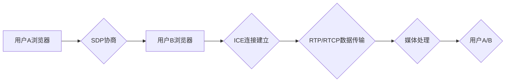

                 

## webrtc实时音视频通信

> 关键词：WebRTC, 音视频通信, 实时传输, 网络协议, 浏览器API, 媒体处理

## 1. 背景介绍

随着互联网技术的飞速发展，实时音视频通信技术已成为现代应用的重要组成部分。从视频会议、在线教育到远程医疗和游戏直播，实时音视频通信为人们提供了更加便捷、高效的交互方式。WebRTC（Web Real-Time Communication）作为一种开源的实时通信协议，为浏览器直接进行音视频通信提供了强大的支持，彻底改变了传统基于插件的实时通信模式。

传统的实时通信技术通常依赖于第三方平台或插件，例如Adobe Flash或Java，这些技术存在着诸多局限性，例如：

* **平台依赖性强:**  不同平台的插件兼容性差，用户体验不佳。
* **安全隐患:** 插件容易被攻击，存在安全风险。
* **部署复杂:**  需要安装和配置复杂的插件，用户体验差。

WebRTC 则通过标准化的 Web API，直接在浏览器中进行音视频通信，无需任何插件，具有以下优势：

* **跨平台兼容性:**  WebRTC 基于标准协议，支持所有主流浏览器，跨平台兼容性强。
* **安全性高:**  WebRTC 使用加密技术保护通信数据，安全性高。
* **部署简单:**  WebRTC 只需使用 HTML、CSS 和 JavaScript，部署简单方便。

## 2. 核心概念与联系

WebRTC 的核心概念包括：

* **SDP (Session Description Protocol):** 用于描述媒体会话的协议，包含媒体类型、编码格式、带宽等信息。
* **ICE (Interactive Connectivity Establishment):** 用于建立连接的协议，通过 NAT 穿透和 STUN/TURN 服务器，实现不同网络环境下的连接。
* **RTP (Real-Time Transport Protocol):** 用于传输实时媒体数据的协议，支持音频、视频和数据传输。
* **RTCP (Real-Time Control Protocol):** 用于控制和管理媒体会话的协议，例如带宽管理、丢包率统计等。

**WebRTC 架构流程图:**



## 3. 核心算法原理 & 具体操作步骤

### 3.1  算法原理概述

WebRTC 的核心算法主要围绕着媒体数据编码、传输和解码。

* **媒体数据编码:** 将音频和视频数据转换为数字格式，并进行压缩以降低传输带宽。常用的编码算法包括 VP8、VP9、H.264 和 Opus。
* **媒体数据传输:** 使用 RTP 协议将编码后的媒体数据传输到对方浏览器。
* **媒体数据解码:** 接收方浏览器使用相应的解码算法将接收到的媒体数据解码成原始音频和视频数据，并将其显示或播放。

### 3.2  算法步骤详解

1. **媒体采集:** 用户浏览器使用麦克风和摄像头采集音频和视频数据。
2. **媒体编码:** 采集到的媒体数据被编码成数字格式，并进行压缩。
3. **SDP 协商:** 浏览器使用 SDP 协议交换媒体会话描述信息，包括媒体类型、编码格式、带宽等。
4. **ICE 连接建立:** 浏览器使用 ICE 协议建立连接，通过 NAT 穿透和 STUN/TURN 服务器，实现不同网络环境下的连接。
5. **RTP/RTCP 数据传输:** 编码后的媒体数据通过 RTP 协议传输到对方浏览器，RTCP 协议用于控制和管理媒体会话。
6. **媒体解码:** 接收方浏览器使用相应的解码算法将接收到的媒体数据解码成原始音频和视频数据，并将其显示或播放。

### 3.3  算法优缺点

**优点:**

* **实时性强:** RTP 协议支持低延迟的实时数据传输。
* **跨平台兼容性:** 基于标准协议，支持所有主流浏览器。
* **安全性高:** 使用加密技术保护通信数据。

**缺点:**

* **网络环境依赖:** 网络质量对实时通信体验影响较大。
* **资源消耗:** 媒体编码和解码需要消耗一定的 CPU 和内存资源。

### 3.4  算法应用领域

WebRTC 的应用领域非常广泛，包括：

* **视频会议:** 在线会议、远程协作、远程教育等。
* **直播:** 游戏直播、音乐直播、体育赛事直播等。
* **即时聊天:** 语音和视频聊天、群组聊天等。
* **远程医疗:** 在线诊断、远程手术指导等。

## 4. 数学模型和公式 & 详细讲解 & 举例说明

### 4.1  数学模型构建

WebRTC 的核心算法涉及到许多数学模型，例如：

* **数据压缩模型:** 使用数学算法对媒体数据进行压缩，例如 DCT 变换、量化和熵编码。
* **网络传输模型:** 使用数学模型描述网络传输过程，例如 TCP/IP 模型、丢包率模型等。
* **音频/视频质量模型:** 使用数学模型评估音频/视频质量，例如 PSNR、SSIM 等。

### 4.2  公式推导过程

例如，VP9 编码器使用 DCT 变换对视频数据进行压缩。DCT 变换的公式如下：

$$
X(u,v) = \frac{1}{MN} \sum_{m=0}^{M-1} \sum_{n=0}^{N-1} x(m,n) \cos \left( \frac{(2m+1)u \pi}{2M} \right) \cos \left( \frac{(2n+1)v \pi}{2N} \right)
$$

其中：

* $X(u,v)$ 是 DCT 变换后的系数。
* $x(m,n)$ 是原始视频数据。
* $M$ 和 $N$ 是视频数据的大小。
* $u$ 和 $v$ 是 DCT 变换的频率系数。

### 4.3  案例分析与讲解

通过 DCT 变换，可以将视频数据分解成不同频率成分，并对高频率成分进行量化压缩，从而降低视频数据的大小。

## 5. 项目实践：代码实例和详细解释说明

### 5.1  开发环境搭建

* **浏览器:** 支持 WebRTC 的主流浏览器，例如 Chrome、Firefox、Edge 等。
* **开发工具:** 使用 HTML、CSS 和 JavaScript 进行开发。
* **WebRTC 库:** 可以使用一些 WebRTC 库，例如 SimpleWebRTC、PeerJS 等，简化开发过程。

### 5.2  源代码详细实现

以下是一个简单的 WebRTC 音视频通话示例代码：

```html
<!DOCTYPE html>
<html>
<head>
  <title>WebRTC 音视频通话</title>
</head>
<body>
  <video id="localVideo" autoplay></video>
  <video id="remoteVideo" autoplay></video>
  <button id="startButton">开始通话</button>

  <script src="script.js"></script>
</body>
</html>
```

```javascript
// script.js
const localVideo = document.getElementById('localVideo');
const remoteVideo = document.getElementById('remoteVideo');
const startButton = document.getElementById('startButton');

startButton.addEventListener('click', () => {
  // 初始化 WebRTC 连接
  // ...
});
```

### 5.3  代码解读与分析

* **HTML 代码:** 创建了两个视频元素，用于显示本地和远程视频流，以及一个按钮用于启动通话。
* **JavaScript 代码:** 使用 WebRTC API 初始化连接，并处理媒体流的采集、传输和渲染。

### 5.4  运行结果展示

点击“开始通话”按钮后，用户将看到自己的视频流在本地视频元素中显示，并可以与其他用户进行实时音视频通话。

## 6. 实际应用场景

WebRTC 的应用场景非常广泛，例如：

* **视频会议:** Zoom、Google Meet 等视频会议平台都使用 WebRTC 技术进行实时音视频通信。
* **在线教育:** 在线课程平台、远程教学等都使用 WebRTC 技术进行实时互动。
* **游戏直播:** Twitch、YouTube Gaming 等游戏直播平台都使用 WebRTC 技术进行实时视频和音频传输。

### 6.4  未来应用展望

WebRTC 技术还在不断发展，未来应用场景将会更加广泛，例如：

* **虚拟现实 (VR) 和增强现实 (AR):** WebRTC 可以用于在 VR/AR 环境中进行实时多人互动。
* **物联网 (IoT):** WebRTC 可以用于连接和控制 IoT 设备，实现实时数据传输和控制。
* **边缘计算:** WebRTC 可以用于在边缘设备上进行实时数据处理和通信。

## 7. 工具和资源推荐

### 7.1  学习资源推荐

* **WebRTC 官方网站:** https://webrtc.org/
* **WebRTC 文档:** https://developer.mozilla.org/en-US/docs/Web/API/WebRTC_API
* **WebRTC 入门教程:** https://www.w3schools.com/html/html5_webRTC.asp

### 7.2  开发工具推荐

* **SimpleWebRTC:** https://github.com/muaz-khan/SimpleWebRTC
* **PeerJS:** https://peerjs.com/
* **Jitsi Meet:** https://jitsi.org/

### 7.3  相关论文推荐

* **WebRTC: Real-Time Communication for the Web:** https://www.usenix.org/system/files/conference/usenixsecurity12/sec12-paper-martensson.pdf
* **A Survey of WebRTC Technologies and Applications:** https://ieeexplore.ieee.org/document/8849807

## 8. 总结：未来发展趋势与挑战

### 8.1  研究成果总结

WebRTC 技术已经取得了显著的成果，为实时通信提供了更加便捷、高效、安全的解决方案。

### 8.2  未来发展趋势

WebRTC 技术未来将朝着以下方向发展：

* **更低的延迟:** 通过优化网络传输协议和算法，降低实时通信的延迟。
* **更高的安全性:** 使用更先进的加密技术和身份验证机制，保障实时通信的安全性。
* **更广泛的应用场景:** 将 WebRTC 应用于更多领域，例如 VR/AR、IoT、边缘计算等。

### 8.3  面临的挑战

WebRTC 技术也面临着一些挑战，例如：

* **网络环境依赖:** 网络质量对实时通信体验影响较大，需要进一步优化网络传输机制。
* **资源消耗:** 媒体编码和解码需要消耗一定的 CPU 和内存资源，需要进一步优化算法和硬件支持。
* **标准化和兼容性:** WebRTC 标准还在不断发展，需要加强标准化和兼容性工作。

### 8.4  研究展望

未来，WebRTC 技术将继续发展，为人们提供更加便捷、高效、安全的实时通信体验。

## 9. 附录：常见问题与解答

* **WebRTC 是否需要插件？**

WebRTC 不需要任何插件，直接在浏览器中进行实时通信。

* **WebRTC 支持哪些浏览器？**

WebRTC 支持所有主流浏览器，例如 Chrome、Firefox、Edge 等。

* **WebRTC 的安全性如何？**

WebRTC 使用加密技术保护通信数据，安全性高。

* **WebRTC 的延迟是多少？**

WebRTC 的延迟取决于网络环境，一般在 100 毫秒以内。

* **WebRTC 的应用场景有哪些？**

WebRTC 的应用场景非常广泛，例如视频会议、在线教育、游戏直播等。


作者：禅与计算机程序设计艺术 / Zen and the Art of Computer Programming 
<end_of_turn>

