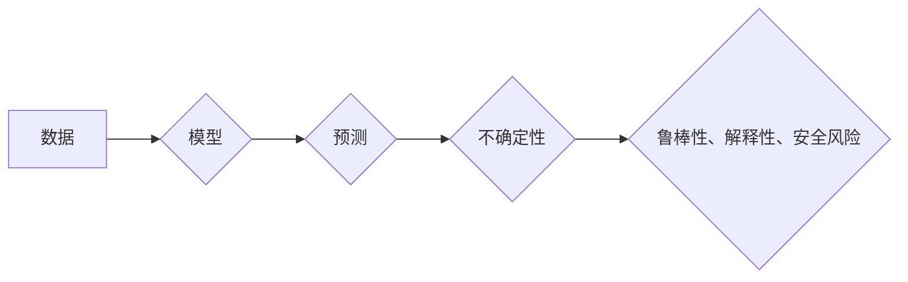

                 

## 不确定性:机器学习面临的普遍挑战

> 关键词：机器学习、不确定性、概率论、贝叶斯推理、深度学习、鲁棒性、解释性

## 1. 背景介绍

机器学习近年来取得了令人瞩目的成就，在图像识别、自然语言处理、语音识别等领域展现出强大的能力。然而，机器学习模型的成功依赖于大量数据和精心设计的算法，而现实世界充满了不确定性。

不确定性是指在面对未知情况时，无法完全确定事件的发生概率或结果。它可以来自数据本身的噪声、样本的有限性、模型本身的局限性以及外部环境的不可预测性。

对于机器学习模型来说，不确定性是一个普遍的挑战。它可能导致模型的预测结果不准确、鲁棒性差、解释性不足，甚至引发安全风险。

## 2. 核心概念与联系

### 2.1 不确定性类型

不确定性可以分为以下几种类型：

* ** aleatoric uncertainty**:  源于数据本身的随机性，例如测量误差、样本偏差等。这种不确定性可以通过增加训练数据量和提高模型复杂度来减小。
* ** epistemic uncertainty**: 源于模型对未知数据的理解不足，例如模型无法捕捉到所有重要的特征或存在模型结构的局限性。这种不确定性可以通过改进模型架构、增加训练数据的多样性以及使用正则化技术来减小。

### 2.2 核心概念

* **概率论**: 提供了量化不确定性的数学框架，通过概率分布来描述事件发生的可能性。
* **贝叶斯推理**:  一种基于概率论的推理方法，通过更新先验知识来获得后验概率，从而对不确定性进行建模和处理。
* **深度学习**: 一种强大的机器学习方法，能够学习复杂的特征表示，但同时也更容易受到数据噪声和模型结构限制的影响。

### 2.3  架构图



## 3. 核心算法原理 & 具体操作步骤

### 3.1  算法原理概述

针对机器学习中的不确定性，许多算法和技术被开发出来，例如：

* **贝叶斯网络**:  一种概率图模型，用于表示变量之间的依赖关系，并通过贝叶斯推理来计算不确定性。
* **Dropout**:  一种正则化技术，在训练过程中随机丢弃神经网络中的某些节点，从而提高模型的泛化能力和对噪声的鲁棒性。
* **Ensemble methods**:  通过训练多个模型并结合它们的预测结果来降低不确定性。

### 3.2  算法步骤详解

以贝叶斯网络为例，其具体操作步骤如下：

1. **构建贝叶斯网络**:  根据领域知识和数据，构建一个包含所有相关变量的贝叶斯网络图。
2. **学习网络参数**:  使用训练数据来学习每个变量的条件概率分布。
3. **进行推理**:  根据新的输入数据，使用贝叶斯推理算法计算目标变量的条件概率分布。

### 3.3  算法优缺点

**贝叶斯网络**

* **优点**:  能够明确表示变量之间的依赖关系，并提供概率性的预测结果，易于解释。
* **缺点**:  构建贝叶斯网络需要大量的领域知识，学习过程可能比较复杂。

**Dropout**

* **优点**:  简单易行，能够有效提高模型的泛化能力和鲁棒性。
* **缺点**:  可能会导致模型训练速度变慢。

**Ensemble methods**

* **优点**:  能够显著降低不确定性，提高模型的预测精度。
* **缺点**:  训练和部署成本较高。

### 3.4  算法应用领域

* **医疗诊断**:  利用贝叶斯网络对患者症状进行分析，预测疾病的可能性。
* **金融风险管理**:  使用贝叶斯网络和Ensemble methods来评估投资风险和预测市场波动。
* **自动驾驶**:  利用Dropout和Ensemble methods来提高自动驾驶系统的鲁棒性和安全性。

## 4. 数学模型和公式 & 详细讲解 & 举例说明

### 4.1  数学模型构建

贝叶斯网络可以用一个有向无环图来表示，其中每个节点代表一个变量，每个边代表变量之间的依赖关系。

### 4.2  公式推导过程

贝叶斯定理是贝叶斯推理的基础，其公式如下：

$$P(A|B) = \frac{P(B|A)P(A)}{P(B)}$$

其中：

* $P(A|B)$ 是事件 A 在事件 B 发生条件下的概率。
* $P(B|A)$ 是事件 B 在事件 A 发生条件下的概率。
* $P(A)$ 是事件 A 的先验概率。
* $P(B)$ 是事件 B 的概率。

### 4.3  案例分析与讲解

假设我们有一个贝叶斯网络，用来预测明天是否会下雨。

* 节点：天气（晴天/雨天）、湿度、温度
* 边：湿度->天气，温度->天气

如果我们知道今天湿度高，温度低，那么我们可以使用贝叶斯定理来计算明天下雨的概率。

* $P(雨天|湿度高,温度低)$ 是我们想要计算的概率。
* $P(湿度高,温度低|雨天)$ 是湿度高和温度低在雨天发生的概率。
* $P(雨天)$ 是雨天的先验概率。
* $P(湿度高,温度低)$ 是湿度高和温度低的概率。

通过收集相关数据，我们可以估计这些概率，然后使用贝叶斯定理计算出明天下雨的概率。

## 5. 项目实践：代码实例和详细解释说明

### 5.1  开发环境搭建

* Python 3.x
* TensorFlow 或 PyTorch

### 5.2  源代码详细实现

```python
# 使用 TensorFlow 实现一个简单的贝叶斯网络
import tensorflow as tf

# 定义贝叶斯网络的结构
model = tf.keras.Sequential([
    tf.keras.layers.Input(shape=(2,)),  # 输入层，两个特征
    tf.keras.layers.Dense(1, activation='sigmoid')  # 输出层，预测概率
])

# 编译模型
model.compile(optimizer='adam', loss='binary_crossentropy', metrics=['accuracy'])

# 训练模型
model.fit(x_train, y_train, epochs=10)

# 预测
predictions = model.predict(x_test)
```

### 5.3  代码解读与分析

* 我们使用 TensorFlow 的 Keras API 来构建一个简单的贝叶斯网络。
* 输入层接收两个特征，输出层是一个 sigmoid 层，用于预测概率。
* 我们使用 Adam 优化器、二元交叉熵损失函数和准确率指标来训练模型。
* 训练完成后，我们可以使用模型对新的数据进行预测。

### 5.4  运行结果展示

* 训练结果可以包括模型的损失函数值、准确率等指标。
* 预测结果可以是一个概率值，表示模型预测事件发生的可能性。

## 6. 实际应用场景

### 6.1  医疗诊断

* 预测疾病的风险
* 辅助医生做出诊断决策

### 6.2  金融风险管理

* 评估投资风险
* 预测市场波动

### 6.3  自动驾驶

* 识别道路障碍物
* 预测其他车辆的行为

### 6.4  未来应用展望

* 更广泛的应用场景
* 更准确的预测结果
* 更强的解释性

## 7. 工具和资源推荐

### 7.1  学习资源推荐

* **书籍**:
    * Probabilistic Graphical Models: Principles and Techniques by Daphne Koller and Nir Friedman
    * Deep Learning by Ian Goodfellow, Yoshua Bengio, and Aaron Courville
* **在线课程**:
    * Stanford CS229: Machine Learning
    * Coursera: Machine Learning by Andrew Ng

### 7.2  开发工具推荐

* **TensorFlow**:  开源机器学习框架
* **PyTorch**:  开源机器学习框架
* **Scikit-learn**:  机器学习库

### 7.3  相关论文推荐

* **Dropout: A Simple Way to Prevent Neural Networks from Overfitting** by Geoffrey Hinton, Nitish Srivastava, Alex Krizhevsky, Ilya Sutskever, and Ruslan Salakhutdinov
* **Probabilistic Graphical Models: Principles and Techniques** by Daphne Koller and Nir Friedman

## 8. 总结：未来发展趋势与挑战

### 8.1  研究成果总结

* 针对机器学习中的不确定性，已经开发出许多算法和技术，例如贝叶斯网络、Dropout、Ensemble methods等。
* 这些技术能够有效降低不确定性，提高模型的鲁棒性和解释性。

### 8.2  未来发展趋势

* 更有效的算法和技术
* 更强的解释性
* 更广泛的应用场景

### 8.3  面临的挑战

* 复杂的数据分布
* 模型的解释性
* 算法的效率

### 8.4  研究展望

* 研究更有效的算法和技术来处理复杂的数据分布。
* 开发更强大的解释性模型，使机器学习更加透明和可信赖。
* 探索新的应用场景，将机器学习技术应用于更多领域。

## 9. 附录：常见问题与解答

* **如何评估模型的不确定性？**

可以使用各种方法来评估模型的不确定性，例如：

* **预测区间**:  计算模型预测结果的置信区间。
* **概率分布**:  使用概率分布来表示模型对事件发生的可能性。
* **不确定性度量**:  使用专门的不确定性度量指标来评估模型的不确定性。

* **如何降低模型的不确定性？**

可以通过以下方法来降低模型的不确定性：

* **增加训练数据量**:  更多的训练数据可以帮助模型更好地学习数据分布。
* **改进模型架构**:  使用更复杂的模型架构可以帮助模型捕捉更多的特征。
* **使用正则化技术**:  正则化技术可以防止模型过拟合，从而提高模型的泛化能力。
* **使用Ensemble methods**:  通过训练多个模型并结合它们的预测结果可以降低不确定性。


作者：禅与计算机程序设计艺术 / Zen and the Art of Computer Programming 
<end_of_turn>

