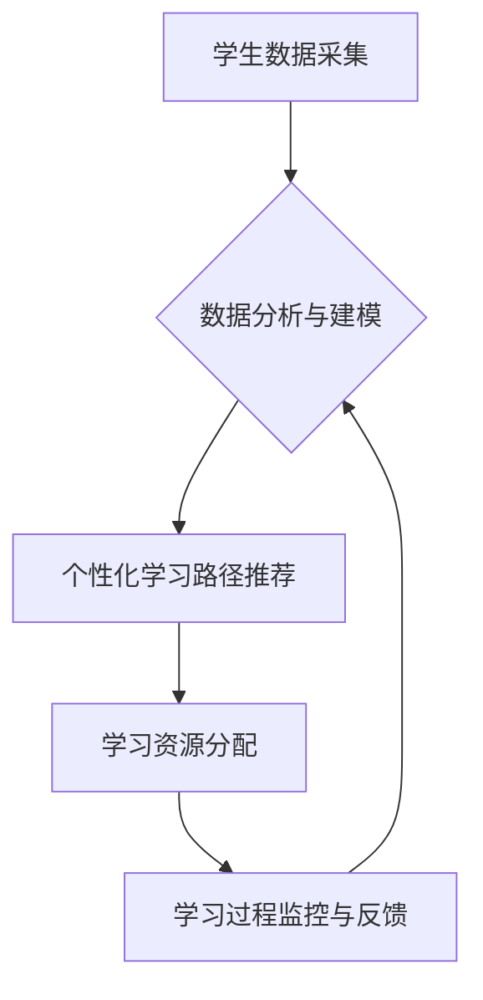

                 

## 个性化教育：定制化学习的未来趋势

> 关键词：个性化教育、定制化学习、人工智能、机器学习、数据分析、学习路径、教育科技

### 1. 背景介绍

教育，作为人类文明的基石，一直致力于培养人才，传递知识和价值观。然而，传统教育模式往往采用“一刀切”的教学方法，难以满足每个学生个性化的学习需求。随着人工智能、机器学习等技术的快速发展，个性化教育逐渐成为教育领域的新趋势，旨在通过定制化的学习路径和教学方式，帮助每个学生充分发挥潜能，实现个性化发展。

近年来，教育科技（EdTech）蓬勃发展，为个性化教育提供了强大的技术支撑。在线学习平台、智能辅导系统、个性化学习软件等工具层出不穷，为学生提供更加灵活、便捷、个性化的学习体验。

### 2. 核心概念与联系

**2.1 个性化教育的概念**

个性化教育是指根据学生的个体差异，如学习风格、兴趣爱好、知识水平、学习目标等，定制化的学习计划、教学内容和学习方式。其核心目标是帮助每个学生实现个性化发展，激发学习兴趣，提高学习效率。

**2.2 定制化学习的原理**

定制化学习的核心在于对学生的学习数据进行分析，识别学生的学习特点和需求，并根据这些信息，构建个性化的学习路径和教学内容。

**2.3 个性化教育与人工智能的结合**

人工智能技术为个性化教育提供了强大的工具和手段。例如：

* **机器学习算法**可以分析学生的学习数据，识别学生的学习模式和知识掌握情况，并根据这些信息，推荐个性化的学习资源和练习题。
* **自然语言处理技术**可以帮助学生与智能辅导系统进行自然语言交互，获得更加个性化的学习指导和帮助。
* **计算机视觉技术**可以分析学生的学习行为，例如学生的肢体语言、面部表情等，识别学生的学习状态和情绪，并根据这些信息，调整教学方式和学习内容。

**2.4 个性化教育的架构**



### 3. 核心算法原理 & 具体操作步骤

**3.1 算法原理概述**

个性化教育的核心算法通常基于机器学习，包括监督学习、无监督学习和强化学习等。

* **监督学习**：利用已标记的数据训练模型，预测学生的学习行为和学习效果。例如，根据学生的学习历史数据，预测学生对特定知识点的掌握情况。
* **无监督学习**：利用未标记的数据发现数据的内在结构和模式。例如，根据学生的学习行为数据，发现不同学习风格的学生群体。
* **强化学习**：通过奖励和惩罚机制，训练模型学习最优的学习策略。例如，根据学生的学习反馈，调整学习内容和学习节奏。

**3.2 算法步骤详解**

1. **数据收集和预处理**: 收集学生的学习数据，包括学习记录、考试成绩、学习行为等，并进行清洗、转换和特征提取。
2. **模型选择和训练**: 根据学习任务和数据特点，选择合适的机器学习算法，并利用训练数据训练模型。
3. **模型评估和优化**: 利用测试数据评估模型的性能，并根据评估结果调整模型参数，优化模型性能。
4. **个性化学习路径推荐**: 利用训练好的模型，根据学生的学习数据，预测学生的学习需求和学习效果，并推荐个性化的学习路径和学习资源。
5. **学习过程监控和反馈**: 持续监控学生的学习过程，收集学生的学习反馈，并根据反馈信息，动态调整学习路径和学习内容。

**3.3 算法优缺点**

* **优点**:
    * 可以根据学生的个性化需求，定制化的学习路径和教学方式。
    * 可以提高学生的学习效率和学习兴趣。
    * 可以帮助教师更好地了解学生的学习情况，提供更加精准的教学指导。
* **缺点**:
    * 需要大量的学习数据进行训练，数据质量对模型性能有重要影响。
    * 模型训练和部署需要一定的技术成本。
    * 个性化学习路径的推荐需要考虑学生的学习目标、学习风格、兴趣爱好等多方面因素，算法设计难度较大。

**3.4 算法应用领域**

个性化教育算法广泛应用于以下领域：

* **在线学习平台**: 为学生提供个性化的学习路径、学习资源和学习辅导。
* **智能辅导系统**: 为学生提供个性化的学习指导和帮助。
* **教育游戏**: 通过游戏化的学习方式，激发学生的学习兴趣，并根据学生的学习情况，动态调整游戏难度和内容。
* **学习管理系统**: 为教师提供学生学习情况的分析和反馈，帮助教师制定更加有效的教学策略。

### 4. 数学模型和公式 & 详细讲解 & 举例说明

**4.1 数学模型构建**

个性化学习路径推荐可以构建为一个推荐系统模型，其目标是根据学生的学习数据，预测学生对特定学习资源的兴趣和学习效果。

一个常见的推荐系统模型是协同过滤模型，其核心思想是基于用户的相似性或物品的相似性进行推荐。

**4.2 公式推导过程**

协同过滤模型的评分预测公式可以表示为：

$$
r_{u,i} = \bar{r}_u + \frac{\sum_{j \in N(u)} (r_{u,j} - \bar{r}_u) \cdot (r_{j,i} - \bar{r}_j)}{\sum_{j \in N(u)} (r_{u,j} - \bar{r}_u)^2}
$$

其中：

* $r_{u,i}$ 表示用户 $u$ 对物品 $i$ 的评分。
* $\bar{r}_u$ 表示用户 $u$ 的平均评分。
* $N(u)$ 表示与用户 $u$ 相似的用户集合。
* $r_{u,j}$ 表示用户 $u$ 对物品 $j$ 的评分。
* $r_{j,i}$ 表示用户 $j$ 对物品 $i$ 的评分。

**4.3 案例分析与讲解**

假设有一个在线学习平台，包含多个课程和学生。

* 学生 $A$ 对课程 $X$ 和课程 $Y$ 都评分很高。
* 学生 $B$ 对课程 $Y$ 和课程 $Z$ 都评分很高。

根据协同过滤模型，如果用户 $C$ 对课程 $X$ 和课程 $Y$ 都感兴趣，那么模型可以预测用户 $C$ 对课程 $Z$ 的评分也会较高。

### 5. 项目实践：代码实例和详细解释说明

**5.1 开发环境搭建**

* 操作系统：Linux/macOS/Windows
* 编程语言：Python
* 框架：TensorFlow/PyTorch
* 工具：Jupyter Notebook/VS Code

**5.2 源代码详细实现**

```python
# 导入必要的库
import tensorflow as tf

# 定义模型结构
model = tf.keras.Sequential([
    tf.keras.layers.Dense(64, activation='relu', input_shape=(10,)),
    tf.keras.layers.Dense(32, activation='relu'),
    tf.keras.layers.Dense(1)
])

# 编译模型
model.compile(optimizer='adam', loss='mse')

# 训练模型
model.fit(X_train, y_train, epochs=10)

# 预测
predictions = model.predict(X_test)
```

**5.3 代码解读与分析**

* 代码首先导入必要的库，包括 TensorFlow 库。
* 然后定义一个简单的深度学习模型，包含三个全连接层。
* 模型使用 Adam 优化器和均方误差损失函数进行训练。
* 训练完成后，可以使用模型预测新的数据。

**5.4 运行结果展示**

训练结果可以展示在 Jupyter Notebook 或 VS Code 中，包括训练损失、验证损失等指标。

### 6. 实际应用场景

个性化教育已经开始在一些教育机构和在线学习平台中得到应用。例如：

* **Khan Academy**: 提供个性化的学习路径和练习题，帮助学生掌握不同的知识点。
* **Coursera**: 提供个性化的学习推荐，帮助学生找到适合自己的课程。
* **Duolingo**: 利用游戏化的学习方式，根据学生的学习情况，动态调整游戏难度和内容。

**6.4 未来应用展望**

随着人工智能技术的不断发展，个性化教育将更加深入地融入教育体系，为学生提供更加个性化、高效、便捷的学习体验。

* **更精准的学习推荐**: 利用更先进的机器学习算法，更加精准地推荐适合学生的学习资源和学习路径。
* **更智能的学习辅导**: 利用自然语言处理和计算机视觉技术，开发更加智能的学习辅导系统，为学生提供更加个性化的学习指导和帮助。
* **更沉浸式的学习体验**: 利用虚拟现实和增强现实技术，打造更加沉浸式的学习体验，激发学生的学习兴趣和学习主动性。

### 7. 工具和资源推荐

**7.1 学习资源推荐**

* **书籍**:
    * 《深度学习》
    * 《机器学习实战》
    * 《人工智能：一种现代方法》
* **在线课程**:
    * Coursera: 人工智能课程
    * edX: 机器学习课程
    * Udacity: 深度学习课程

**7.2 开发工具推荐**

* **编程语言**: Python
* **机器学习框架**: TensorFlow, PyTorch
* **数据分析工具**: Pandas, NumPy

**7.3 相关论文推荐**

* **个性化学习路径推荐**:
    * "Collaborative Filtering for Recommender Systems"
    * "A Survey on Recommender Systems"
* **人工智能在教育领域的应用**:
    * "Artificial Intelligence in Education: A Review"
    * "The Impact of Artificial Intelligence on Education"

### 8. 总结：未来发展趋势与挑战

**8.1 研究成果总结**

个性化教育是教育领域的重要发展趋势，人工智能技术为其提供了强大的技术支撑。个性化学习路径推荐、智能辅导系统等应用已经取得了一定的成果，为学生提供了更加个性化的学习体验。

**8.2 未来发展趋势**

未来，个性化教育将更加深入地融入教育体系，并朝着以下方向发展：

* **更加精准的学习推荐**: 利用更先进的机器学习算法，更加精准地推荐适合学生的学习资源和学习路径。
* **更加智能的学习辅导**: 利用自然语言处理和计算机视觉技术，开发更加智能的学习辅导系统，为学生提供更加个性化的学习指导和帮助。
* **更加沉浸式的学习体验**: 利用虚拟现实和增强现实技术，打造更加沉浸式的学习体验，激发学生的学习兴趣和学习主动性。

**8.3 面临的挑战**

个性化教育的发展也面临着一些挑战：

* **数据隐私和安全**: 个性化教育需要收集和分析学生的学习数据，因此数据隐私和安全问题需要得到充分重视。
* **算法公平性**: 个性化学习路径推荐算法需要避免歧视和偏见，确保所有学生都能获得公平的教育机会。
* **教师的角色转变**: 个性化教育的发展需要教师的角色转变，从传统的知识传授者转变为学生的学习指导者和学习伙伴。

**8.4 研究展望**

未来，个性化教育的研究将继续深入，探索更加有效的个性化学习方法和技术，为学生提供更加个性化、高效、便捷的学习体验。


### 9. 附录：常见问题与解答

**9.1 Q: 个性化教育会取代传统教育吗？**

**A:** 个性化教育不会取代传统教育，而是作为一种补充和改进传统教育的方式。传统教育仍然具有其独特的价值，例如培养学生的社会交往能力和团队合作能力。个性化教育可以帮助学生更好地理解和掌握知识，提高学习效率，但它不能完全替代传统教育。

**9.2 Q: 个性化教育需要哪些资源？**

**A:** 个性化教育需要以下资源：

* **数据**: 学生的学习数据，包括学习记录、考试成绩、学习行为等。
* **算法**: 个性化学习路径推荐算法、智能辅导系统算法等。
* **技术**: 在线学习平台、智能辅导系统、虚拟现实和增强现实技术等。
* **教师**: 能够根据学生的个性化需求提供学习指导和帮助的教师。

**9.3 Q: 个性化教育的成本高吗？**

**A:** 个性化教育的成本取决于具体的实施方案。一些简单的个性化学习工具，例如在线学习平台的个性化推荐功能，成本相对较低。而一些复杂的个性化学习系统，例如智能辅导系统，成本相对较高。

**9.4 Q: 个性化教育对学生的学习效果有什么影响？**

**A:** 研究表明，个性化教育可以提高学生的学习效果。个性化学习路径可以帮助学生更好地理解和掌握知识，提高学习效率。智能辅导系统可以为学生提供个性化的学习指导和帮助，帮助学生克服学习困难。


作者：禅与计算机程序设计艺术 / Zen and the Art of Computer Programming 
<end_of_turn>

