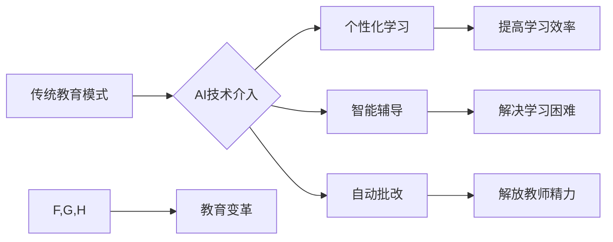

                 

## 人工智能：教育变革的催化剂

> 关键词：人工智能、教育变革、机器学习、个性化学习、智能辅导系统、教育公平、未来教育

## 1. 背景介绍

教育，作为人类文明进步的基石，一直以来都致力于培养人才、传承知识、促进社会发展。然而，传统的教育模式面临着诸多挑战：

* **教学内容的单一化:**  传统的教学模式往往采用“一刀切”的方式，难以满足不同学生个性化的学习需求。
* **教师资源的不足:**  优质的教育资源往往集中在发达地区，而许多发展中国家和偏远地区面临着教师短缺的问题。
* **学习效率的低下:**  传统的教学方式难以有效激发学生的学习兴趣，导致学习效率低下。

人工智能（AI）技术的快速发展为教育领域带来了前所未有的机遇。AI能够通过分析海量数据，识别学习模式，提供个性化学习方案，从而有效解决上述问题，推动教育变革。

## 2. 核心概念与联系

**2.1  人工智能在教育中的应用**

人工智能在教育领域的应用主要集中在以下几个方面：

* **智能辅导系统:**  利用AI技术，为学生提供个性化的学习辅导，帮助学生克服学习困难，提高学习效率。
* **自动批改系统:**  利用AI技术自动批改作业，解放教师的精力，提高教学效率。
* **个性化学习平台:**  根据学生的学习进度、兴趣和能力，为学生提供个性化的学习内容和学习路径。
* **虚拟现实（VR）和增强现实（AR）教学:**  利用VR和AR技术，创造沉浸式的学习环境，提高学生的学习兴趣和参与度。

**2.2  AI技术与教育模式的融合**

AI技术与教育模式的融合，将形成新的教育生态系统：



## 3. 核心算法原理 & 具体操作步骤

**3.1  算法原理概述**

在AI驱动的教育系统中，机器学习算法是核心技术之一。机器学习算法能够通过分析数据，学习模式，并根据学习到的模式进行预测或决策。常见的机器学习算法包括：

* **监督学习:**  利用标记数据训练模型，例如分类和回归问题。
* **无监督学习:**  利用未标记数据发现模式，例如聚类和降维问题。
* **强化学习:**  通过试错学习，优化策略，例如游戏和机器人控制问题。

**3.2  算法步骤详解**

以监督学习为例，其基本步骤如下：

1. **数据收集和预处理:**  收集相关数据，并进行清洗、转换、特征工程等预处理工作。
2. **模型选择:**  根据具体问题选择合适的机器学习模型，例如决策树、支持向量机、神经网络等。
3. **模型训练:**  利用标记数据训练模型，调整模型参数，使模型能够准确预测或分类。
4. **模型评估:**  利用测试数据评估模型的性能，例如准确率、召回率、F1-score等。
5. **模型部署:**  将训练好的模型部署到实际应用场景中，例如智能辅导系统、自动批改系统等。

**3.3  算法优缺点**

* **优点:**  能够自动学习模式，提高预测精度，并适应不断变化的数据。
* **缺点:**  需要大量数据进行训练，训练过程耗时，模型解释性较差。

**3.4  算法应用领域**

* **智能推荐系统:**  根据用户的历史行为，推荐个性化的学习内容。
* **学习进度预测:**  预测学生的学习进度，及时提供帮助。
* **学习风格识别:**  识别学生的学习风格，提供个性化的学习策略。

## 4. 数学模型和公式 & 详细讲解 & 举例说明

**4.1  数学模型构建**

在机器学习中，常用的数学模型包括线性回归、逻辑回归、支持向量机等。

**4.1.1 线性回归模型**

线性回归模型假设数据之间存在线性关系，可以用以下公式表示：

$$y = w_0 + w_1x_1 + w_2x_2 + ... + w_nx_n + \epsilon$$

其中：

* $y$ 是预测值
* $x_1, x_2, ..., x_n$ 是输入特征
* $w_0, w_1, w_2, ..., w_n$ 是模型参数
* $\epsilon$ 是误差项

**4.1.2 逻辑回归模型**

逻辑回归模型用于二分类问题，将线性回归模型的输出映射到0到1之间，表示预测结果的概率。其公式如下：

$$p(y=1|x) = \frac{1}{1 + e^{-(w_0 + w_1x_1 + w_2x_2 + ... + w_nx_n)}}$$

其中：

* $p(y=1|x)$ 是预测结果为1的概率
* $x_1, x_2, ..., x_n$ 是输入特征
* $w_0, w_1, w_2, ..., w_n$ 是模型参数

**4.2  公式推导过程**

模型参数的学习过程通常使用梯度下降算法，通过不断调整参数，使模型的预测结果与真实值之间的误差最小化。

**4.3  案例分析与讲解**

例如，在智能辅导系统中，可以使用线性回归模型预测学生的学习成绩，并根据预测结果提供个性化的学习建议。

## 5. 项目实践：代码实例和详细解释说明

**5.1  开发环境搭建**

* Python 3.x
* TensorFlow 或 PyTorch 等深度学习框架
* Jupyter Notebook 或 VS Code 等开发工具

**5.2  源代码详细实现**

```python
# 使用 TensorFlow 实现线性回归模型
import tensorflow as tf

# 定义模型
model = tf.keras.Sequential([
    tf.keras.layers.Dense(units=1, input_shape=[1])
])

# 编译模型
model.compile(optimizer='sgd', loss='mean_squared_error')

# 训练模型
model.fit(x_train, y_train, epochs=100)

# 预测结果
predictions = model.predict(x_test)
```

**5.3  代码解读与分析**

* 首先，导入 TensorFlow 库。
* 然后，定义一个线性回归模型，包含一个全连接层。
* 接着，编译模型，选择优化器和损失函数。
* 接下来，训练模型，使用训练数据进行训练。
* 最后，使用测试数据预测结果。

**5.4  运行结果展示**

训练完成后，可以评估模型的性能，例如使用均方误差（MSE）来衡量预测结果与真实值的差异。

## 6. 实际应用场景

**6.1  个性化学习平台**

AI驱动的个性化学习平台可以根据学生的学习进度、兴趣和能力，提供个性化的学习内容和学习路径。例如，Khan Academy 和 Coursera 等平台已经开始利用 AI 技术提供个性化学习体验。

**6.2  智能辅导系统**

智能辅导系统可以为学生提供个性化的学习辅导，帮助学生克服学习困难，提高学习效率。例如，Duolingo 和 Wolfram Alpha 等平台已经开发了智能辅导功能。

**6.3  自动批改系统**

自动批改系统可以自动批改作业，解放教师的精力，提高教学效率。例如，Gradescope 和 Google Classroom 等平台已经开始提供自动批改功能。

**6.4  未来应用展望**

未来，AI技术将在教育领域发挥更重要的作用，例如：

* **更智能的学习助手:**  AI学习助手将能够更深入地理解学生的学习需求，提供更精准的学习建议和辅导。
* **沉浸式学习体验:**  VR和AR技术将为学生提供更沉浸式的学习体验，提高学生的学习兴趣和参与度。
* **个性化教育评估:**  AI技术将能够更全面地评估学生的学习能力，提供更个性化的教育建议。

## 7. 工具和资源推荐

**7.1  学习资源推荐**

* **在线课程:**  Coursera、edX、Udacity 等平台提供丰富的AI课程。
* **书籍:**  《深度学习》、《机器学习实战》等书籍是学习AI的基础。
* **开源项目:**  TensorFlow、PyTorch 等开源项目可以帮助你实践AI技术。

**7.2  开发工具推荐**

* **Python:**  Python 是AI开发的常用语言。
* **Jupyter Notebook:**  Jupyter Notebook 是Python交互式开发环境。
* **VS Code:**  VS Code 是功能强大的代码编辑器。

**7.3  相关论文推荐**

* **Attention Is All You Need:**  Transformer模型的开创性论文。
* **BERT: Pre-training of Deep Bidirectional Transformers for Language Understanding:**  BERT模型的开创性论文。
* **Generative Pre-trained Transformer 3 (GPT-3):**  GPT-3模型的开创性论文。

## 8. 总结：未来发展趋势与挑战

**8.1  研究成果总结**

近年来，AI技术在教育领域的应用取得了显著进展，例如个性化学习平台、智能辅导系统、自动批改系统等已经开始应用于实际场景。

**8.2  未来发展趋势**

未来，AI技术将在教育领域发挥更重要的作用，例如：

* **更智能的学习助手:**  AI学习助手将能够更深入地理解学生的学习需求，提供更精准的学习建议和辅导。
* **沉浸式学习体验:**  VR和AR技术将为学生提供更沉浸式的学习体验，提高学生的学习兴趣和参与度。
* **个性化教育评估:**  AI技术将能够更全面地评估学生的学习能力，提供更个性化的教育建议。

**8.3  面临的挑战**

* **数据隐私和安全:**  AI技术需要大量数据进行训练，如何保护学生数据隐私和安全是一个重要的挑战。
* **算法偏见:**  AI算法可能会存在偏见，导致教育资源分配不公平。
* **教师的角色转变:**  AI技术将改变教师的角色，教师需要学习新的技能，适应新的教学模式。

**8.4  研究展望**

未来，需要进一步研究AI技术在教育领域的应用，解决上述挑战，推动AI技术更好地服务于教育事业。

## 9. 附录：常见问题与解答

**9.1  AI是否会取代教师？**

AI技术可以辅助教师，提高教学效率，但不会取代教师。教师的角色将更加注重学生的个性化辅导、情感支持和批判性思维培养。

**9.2  如何确保AI算法的公平性？**

需要采用公平的算法设计原则，并对算法进行定期评估，以确保AI算法不产生偏见。

**9.3  如何保护学生数据隐私？**

需要采用严格的数据安全措施，例如数据加密、匿名化等，保护学生数据的隐私安全。


作者：禅与计算机程序设计艺术 / Zen and the Art of Computer Programming 
<end_of_turn>

