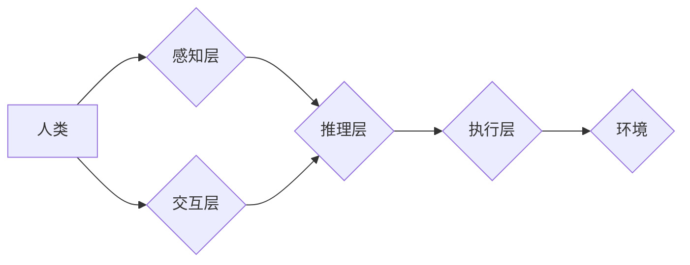

                 

## 人机协作新篇章：共创智能未来新时代

> 关键词： 人机协作、人工智能、协同智能、智能未来、算法、机器学习、深度学习、自然语言处理、计算机视觉

### 1. 背景介绍

人工智能（AI）技术近年来发展迅速，从语音识别、图像识别到自然语言处理等领域取得了突破性进展。然而，现阶段的 AI 仍然局限于特定的任务和领域，难以应对复杂、多变的现实世界问题。 人机协作，即人类与人工智能系统共同完成任务，成为解决这一问题的关键路径。

人机协作的本质是将人类的智慧和创造力与 AI 的计算能力和数据处理能力相结合，形成一个协同智能系统。人类擅长理解复杂的情境、做出基于经验和直觉的判断，以及进行创造性思考；而 AI 擅长处理海量数据、识别模式、进行快速计算和自动化执行。通过将两者优势互补，可以实现更高效、更智能的决策和行动。

### 2. 核心概念与联系

**2.1 人机协作模式**

人机协作模式多种多样，常见的有：

* **监督式协作:** 人类提供明确的指令和反馈，指导 AI 完成任务。
* **自主式协作:** AI 独立完成任务，并在必要时向人类请求帮助或建议。
* **协同式协作:** 人类和 AI 共同参与任务，相互补充，共同完成目标。

**2.2 协同智能架构**

协同智能架构通常由以下几个关键组件组成：

* **感知层:** 收集和处理来自环境的信息，例如图像、文本、音频等。
* **推理层:** 对感知到的信息进行分析和理解，生成决策和行动建议。
* **执行层:** 将决策和行动建议转化为实际操作，控制机器人、设备或软件系统。
* **交互层:** 负责人类与 AI 系统之间的交互，例如语音、文本、图形等。

**2.3 Mermaid 流程图**



### 3. 核心算法原理 & 具体操作步骤

**3.1 算法原理概述**

人机协作的核心算法通常基于机器学习和深度学习技术，例如：

* **强化学习:** 通过奖励机制训练 AI 算法，使其在与环境交互的过程中不断学习和优化策略。
* **迁移学习:** 利用已训练好的模型，将知识迁移到新的任务或领域，提高学习效率。
* **生成对抗网络 (GAN):** 通过两个神经网络对抗训练，生成逼真的合成数据，用于数据增强和模型训练。

**3.2 算法步骤详解**

以强化学习为例，其基本步骤如下：

1. **环境建模:** 建立一个模拟真实世界的环境模型，定义状态、动作、奖励等要素。
2. **策略网络训练:** 使用强化学习算法训练一个策略网络，该网络能够根据当前状态预测最优动作。
3. **环境交互:** AI 算法与环境交互，执行动作并获得奖励。
4. **策略更新:** 根据获得的奖励，更新策略网络的参数，使其在未来能够做出更优的决策。
5. **重复步骤3-4:** 持续与环境交互和策略更新，直到 AI 算法达到预设的目标。

**3.3 算法优缺点**

* **优点:** 能够学习复杂的任务，适应动态变化的环境，并不断优化策略。
* **缺点:** 训练过程需要大量数据和计算资源，并且可能存在局部最优解的问题。

**3.4 算法应用领域**

* **机器人控制:** 训练机器人完成复杂的任务，例如导航、抓取、组装等。
* **游戏 AI:** 开发更智能的游戏对手，提供更具挑战性和趣味性的游戏体验。
* **自动驾驶:** 训练自动驾驶系统，使其能够安全、高效地驾驶车辆。

### 4. 数学模型和公式 & 详细讲解 & 举例说明

**4.1 数学模型构建**

强化学习的数学模型通常基于马尔可夫决策过程 (MDP)。 MDP 由以下几个要素组成：

* **状态空间 (S):** 环境可能存在的各种状态。
* **动作空间 (A):** AI 可以在每个状态下可以执行的动作。
* **转移概率 (P):** 从一个状态执行一个动作后转移到另一个状态的概率。
* **奖励函数 (R):** 在每个状态执行一个动作后获得的奖励值。

**4.2 公式推导过程**

强化学习的目标是找到一个最优策略 π，使得在执行该策略时，获得的总奖励最大化。

最优策略可以通过 Bellman 方程来推导：

$$
V^*(s) = \max_a \sum_{s'} P(s'|s,a) [R(s,a,s') + \gamma V^*(s')]
$$

其中：

* $V^*(s)$ 是状态 $s$ 的最优价值函数。
* $a$ 是在状态 $s$ 下执行的动作。
* $s'$ 是从状态 $s$ 执行动作 $a$ 后转移到的下一个状态。
* $R(s,a,s')$ 是在状态 $s$ 执行动作 $a$ 后转移到状态 $s'$ 获得的奖励。
* $\gamma$ 是折扣因子，控制未来奖励的权重。

**4.3 案例分析与讲解**

例如，训练一个 AI 算法玩游戏，我们可以将游戏状态定义为游戏画面，动作定义为游戏玩家可以执行的操作，奖励函数定义为获得分数或完成任务的奖励。通过 Bellman 方程，我们可以迭代地更新 AI 算法的策略，使其在游戏中获得更高的分数。

### 5. 项目实践：代码实例和详细解释说明

**5.1 开发环境搭建**

* Python 3.x
* TensorFlow 或 PyTorch 深度学习框架
* OpenAI Gym 游戏环境

**5.2 源代码详细实现**

```python
import gym
import tensorflow as tf

# 定义强化学习模型
class QNetwork(tf.keras.Model):
    def __init__(self):
        super(QNetwork, self).__init__()
        self.dense1 = tf.keras.layers.Dense(64, activation='relu')
        self.dense2 = tf.keras.layers.Dense(64, activation='relu')
        self.output = tf.keras.layers.Dense(num_actions)

    def call(self, state):
        x = self.dense1(state)
        x = self.dense2(x)
        return self.output(x)

# 创建强化学习环境
env = gym.make('CartPole-v1')

# 初始化模型参数
model = QNetwork()
optimizer = tf.keras.optimizers.Adam(learning_rate=0.001)

# 训练循环
for episode in range(num_episodes):
    state = env.reset()
    done = False
    total_reward = 0

    while not done:
        # 选择动作
        action = tf.argmax(model(state)).numpy()

        # 执行动作
        next_state, reward, done, _ = env.step(action)

        # 更新模型参数
        with tf.GradientTape() as tape:
            q_values = model(state)
            target_q_value = reward + gamma * tf.reduce_max(model(next_state))
            loss = tf.keras.losses.MSE(target_q_value, q_values[0, action])

        gradients = tape.gradient(loss, model.trainable_variables)
        optimizer.apply_gradients(zip(gradients, model.trainable_variables))

        # 更新状态
        state = next_state
        total_reward += reward

    print(f'Episode {episode+1}, Total Reward: {total_reward}')

# 保存模型
model.save('cartpole_model.h5')
```

**5.3 代码解读与分析**

这段代码实现了基于深度学习的强化学习算法，用于训练一个 AI 算法玩 CartPole 游戏。

* 首先，定义了一个 QNetwork 模型，用于估计在每个状态下执行每个动作的价值。
* 然后，创建了一个 CartPole 游戏环境。
* 接着，使用 Adam 优化器训练模型，通过最小化预测 Q 值与实际奖励之间的误差来更新模型参数。
* 最后，保存训练好的模型。

**5.4 运行结果展示**

训练完成后，AI 算法能够在 CartPole 游戏中保持平衡杆的时间越来越长。

### 6. 实际应用场景

**6.1 自动化生产线**

人机协作可以提高自动化生产线的效率和灵活性。例如，机器人可以执行重复性任务，而人类可以负责更复杂的任务，例如故障诊断和产品调整。

**6.2 智能客服**

人机协作可以提供更智能、更个性化的客服服务。例如，聊天机器人可以处理简单的客户问题，而人类客服可以接管更复杂的问题，例如投诉和退货。

**6.3 医疗诊断**

人机协作可以辅助医生进行诊断和治疗。例如，AI 算法可以分析患者的影像数据，帮助医生识别疾病，而医生可以根据 AI 的建议进行最终诊断和治疗方案制定。

**6.4 未来应用展望**

人机协作的应用场景还在不断扩展，未来将更加广泛地应用于各个领域，例如：

* **教育:** 人工智能可以个性化教学，提供更有效的学习体验。
* **金融:** 人工智能可以辅助金融分析，提高投资决策的准确性。
* **艺术创作:** 人工智能可以与艺术家合作，创作出更具创意的作品。

### 7. 工具和资源推荐

**7.1 学习资源推荐**

* **书籍:**
    * 《深度学习》 by Ian Goodfellow, Yoshua Bengio, and Aaron Courville
    * 《强化学习：原理、算法和应用》 by Richard S. Sutton and Andrew G. Barto
* **在线课程:**
    * Coursera: Machine Learning by Andrew Ng
    * Udacity: Deep Learning Nanodegree
* **开源项目:**
    * TensorFlow: https://www.tensorflow.org/
    * PyTorch: https://pytorch.org/

**7.2 开发工具推荐**

* **Python:** https://www.python.org/
* **Jupyter Notebook:** https://jupyter.org/
* **Visual Studio Code:** https://code.visualstudio.com/

**7.3 相关论文推荐**

* **Deep Reinforcement Learning: An Overview** by Volodymyr Mnih et al.
* **Human-Level Control Through Deep Reinforcement Learning** by DeepMind
* **Generative Adversarial Networks** by Ian Goodfellow et al.

### 8. 总结：未来发展趋势与挑战

**8.1 研究成果总结**

近年来，人机协作领域取得了显著进展，例如：

* 深度学习算法的不断发展，使得 AI 能够学习更复杂的任务。
* 人机交互技术的进步，使得人类与 AI 系统的交互更加自然和直观。
* 协同智能架构的不断完善，使得人机协作系统更加高效和智能。

**8.2 未来发展趋势**

* **更智能的 AI 算法:** 未来 AI 算法将更加智能，能够更好地理解人类意图，并提供更个性化的服务。
* **更自然的交互方式:** 人机交互方式将更加自然，例如语音、手势、表情识别等。
* **更广泛的应用场景:** 人机协作将应用于更多领域，例如医疗、教育、金融等。

**8.3 面临的挑战**

* **数据安全和隐私保护:** 人机协作需要处理大量数据，因此数据安全和隐私保护是一个重要的挑战。
* **算法可解释性和信任度:** AI 算法的决策过程往往难以理解，这可能会导致人类对 AI 的信任度降低。
* **伦理问题:** 人机协作可能会带来一些伦理问题，例如责任归属、偏见等。

**8.4 研究展望**

未来研究将重点关注以下几个方面：

* **开发更安全、更可靠的 AI 算法。**
* **提高 AI 算法的可解释性和透明度。**
* **解决人机协作中的伦理问题。**


### 9. 附录：常见问题与解答

**9.1 如何选择合适的 AI 算法？**

选择合适的 AI 算法取决于具体的应用场景和任务需求。例如，对于预测问题，可以使用回归算法；对于分类问题，可以使用分类算法；对于控制问题，可以使用强化学习算法。

**9.2 如何保证 AI 算法的安全性？**

保证 AI 算法的安全性需要从多个方面考虑，例如：

* 使用安全的训练数据。
* 设计安全的算法模型。
* 进行严格的测试和评估。
* 监控 AI 算法的运行状态。

**9.3 如何提高 AI 算法的可解释性？**

提高 AI 算法的可解释性可以通过以下几种方法：

* 使用可解释的机器学习模型，例如决策树、规则模型等。
* 使用可视化技术，例如决策边界可视化、特征重要性分析等，帮助人类理解 AI 算法的决策过程。
* 开发解释性 AI 工具，例如 LIME、SHAP 等，可以解释 AI 算法对特定输入的预测结果。


作者：禅与计算机程序设计艺术 / Zen and the Art of Computer Programming 
<end_of_turn>

