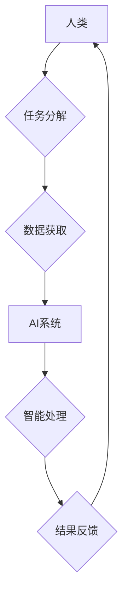

                 

## 人机协同：共谱智能时代新篇章

> 关键词： 人机协同、人工智能、协作学习、智能增强、未来工作

### 1. 背景介绍

人工智能（AI）技术近年来突飞猛进，从语音识别、图像识别到自然语言处理，AI已经渗透到我们生活的方方面面。然而，AI技术的发展也引发了人们对未来工作模式和人机关系的思考。如何将AI技术与人类智慧相结合，共同创造更大的价值，成为一个重要的议题。

人机协同，即人类与人工智能系统共同完成任务，是未来智能时代的重要发展方向。它强调的是人与机器的互补性，发挥各自优势，实现协同共赢。

### 2. 核心概念与联系

**2.1 人机协同的本质**

人机协同的核心在于将人类的创造力、决策能力和情感智能与人工智能的计算能力、数据处理能力和自动化执行能力相结合。

**2.2 人机协同的类型**

人机协同可以分为不同的类型，例如：

* **监督式协同:** 人类提供明确的指令和反馈，引导AI系统完成任务。
* **自主式协同:** AI系统能够根据预先设定的规则和目标，自主完成任务，并根据情况进行调整。
* **协作式协同:** 人类和AI系统共同参与任务，互相补充，共同完成目标。

**2.3 人机协同的架构**



**2.4 人机协同的优势**

* **提高效率:** AI系统可以自动化执行重复性任务，释放人类精力，专注于更复杂和创造性的工作。
* **增强决策:** AI系统可以提供数据分析和预测，帮助人类做出更明智的决策。
* **提升创新:** 人机协同可以激发新的创意和解决方案，推动创新发展。

### 3. 核心算法原理 & 具体操作步骤

**3.1 算法原理概述**

协作学习算法是人机协同的重要基础，它允许人类和AI系统共同学习，不断提升各自的能力。

**3.2 算法步骤详解**

1. **数据收集:** 收集人类和AI系统完成任务的数据。
2. **特征提取:** 从数据中提取关键特征，用于训练模型。
3. **模型训练:** 使用协作学习算法训练模型，让人类和AI系统共同学习。
4. **模型评估:** 评估模型的性能，并根据评估结果进行调整。
5. **任务执行:** 人类和AI系统根据训练好的模型，共同完成任务。

**3.3 算法优缺点**

* **优点:** 能够有效利用人类和AI系统的优势，提升整体性能。
* **缺点:** 需要大量的训练数据，训练过程复杂，需要强大的计算能力。

**3.4 算法应用领域**

* **医疗诊断:** 人类医生和AI系统共同诊断疾病，提高诊断准确率。
* **金融风险管理:** 人类专家和AI系统共同评估风险，降低金融风险。
* **自动驾驶:** 人类驾驶员和AI系统共同控制车辆，提高驾驶安全性和效率。

### 4. 数学模型和公式 & 详细讲解 & 举例说明

**4.1 数学模型构建**

协作学习算法可以建模为一个优化问题，目标是找到一个最佳的模型参数，使得人类和AI系统共同完成任务的性能达到最大化。

**4.2 公式推导过程**

假设人类的决策为 $h(x)$，AI系统的预测为 $a(x)$，目标函数为 $f(h(x),a(x))$，则协作学习的目标函数可以表示为：

$$
\max_{h(x),a(x)} f(h(x),a(x))
$$

其中，$f(h(x),a(x))$ 可以是准确率、召回率、F1-score等指标。

**4.3 案例分析与讲解**

例如，在医疗诊断领域，假设人类医生对病人的诊断结果为 $h(x)$，AI系统对病人的诊断结果为 $a(x)$，目标函数为准确率 $f(h(x),a(x))$。

通过协作学习算法，可以训练一个模型，使得人类医生和AI系统共同学习，最终提高诊断准确率。

### 5. 项目实践：代码实例和详细解释说明

**5.1 开发环境搭建**

* Python 3.x
* TensorFlow 或 PyTorch 等深度学习框架
* Jupyter Notebook 或 VS Code 等开发工具

**5.2 源代码详细实现**

```python
import tensorflow as tf

# 定义模型
model = tf.keras.models.Sequential([
    tf.keras.layers.Dense(64, activation='relu', input_shape=(10,)),
    tf.keras.layers.Dense(32, activation='relu'),
    tf.keras.layers.Dense(1, activation='sigmoid')
])

# 定义损失函数和优化器
loss_fn = tf.keras.losses.BinaryCrossentropy()
optimizer = tf.keras.optimizers.Adam()

# 训练模型
model.compile(loss=loss_fn, optimizer=optimizer)
model.fit(x_train, y_train, epochs=10)

# 评估模型
loss, accuracy = model.evaluate(x_test, y_test)
print('Loss:', loss)
print('Accuracy:', accuracy)
```

**5.3 代码解读与分析**

* 代码定义了一个简单的深度学习模型，用于分类任务。
* 模型使用ReLU激活函数，并包含两层全连接层。
* 训练模型时，使用BinaryCrossentropy损失函数和Adam优化器。
* 训练完成后，使用测试数据评估模型的性能。

**5.4 运行结果展示**

运行代码后，可以得到模型的训练损失和测试准确率。

### 6. 实际应用场景

**6.1 智能客服**

人机协同可以构建智能客服系统，AI系统可以处理简单的客户问题，而人类客服可以处理更复杂的问题，提供更个性化的服务。

**6.2 智能教育**

人机协同可以构建智能教育平台，AI系统可以提供个性化的学习内容和辅导，而人类教师可以提供更深入的指导和帮助。

**6.3 智能医疗**

人机协同可以构建智能医疗系统，AI系统可以辅助医生诊断疾病，而人类医生可以根据AI系统的建议，做出最终的诊断和治疗方案。

**6.4 未来应用展望**

人机协同技术将应用于越来越多的领域，例如：

* **智能制造:** 人机协同可以提高生产效率和产品质量。
* **智能交通:** 人机协同可以提高交通安全和效率。
* **智能城市:** 人机协同可以提高城市管理效率和居民生活质量。

### 7. 工具和资源推荐

**7.1 学习资源推荐**

* **书籍:**
    * 人机协同：智能时代的新篇章
    * 人工智能：一种现代方法
* **在线课程:**
    * Coursera: 人工智能
    * edX: 深度学习
* **开源项目:**
    * TensorFlow
    * PyTorch

**7.2 开发工具推荐**

* **Python:** 
* **Jupyter Notebook:** 
* **VS Code:** 

**7.3 相关论文推荐**

* **Human-in-the-Loop Machine Learning**
* **Collaborative Learning for Human-AI Interaction**

### 8. 总结：未来发展趋势与挑战

**8.1 研究成果总结**

人机协同技术取得了显著进展，在多个领域取得了成功应用。

**8.2 未来发展趋势**

* **更智能的AI系统:** AI系统的智能水平将不断提高，能够更好地理解人类需求和意图。
* **更自然的交互方式:** 人机交互方式将更加自然，例如语音、图像、情感等。
* **更广泛的应用场景:** 人机协同技术将应用于更多领域，例如医疗、教育、金融等。

**8.3 面临的挑战**

* **数据安全和隐私保护:** 人机协同需要处理大量数据，如何保证数据安全和隐私保护是一个重要挑战。
* **算法公平性和可解释性:** AI算法的公平性和可解释性需要得到进一步研究和改进。
* **伦理问题:** 人机协同技术的发展也带来了一些伦理问题，例如工作岗位替代、算法偏见等。

**8.4 研究展望**

未来，人机协同技术将继续发展，并与其他新兴技术融合，例如区块链、量子计算等，为人类社会带来更多福祉。

### 9. 附录：常见问题与解答

**9.1 如何选择合适的协作学习算法？**

选择合适的协作学习算法需要根据具体任务和数据特点进行选择。

**9.2 如何保证人机协同系统的安全性？**

需要采取多种措施保证人机协同系统的安全性，例如数据加密、身份验证、安全审计等。

**9.3 人机协同会取代人类工作吗？**

人机协同不会完全取代人类工作，而是会改变工作模式，提高工作效率和质量。

作者：禅与计算机程序设计艺术 / Zen and the Art of Computer Programming 


<end_of_turn>

