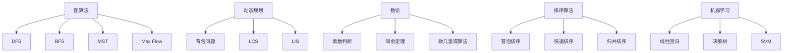

                 

### 文章标题

**《华为2024届校招算法工程师面试真题解密》**

### 关键词

- **华为校招**  
- **算法工程师**  
- **面试真题**  
- **解题技巧**  
- **技术深度**

### 摘要

本文将深入解析华为2024届校招算法工程师面试的真题，通过详细的解题步骤和技巧，帮助读者更好地准备类似的面试挑战。文章涵盖了数学模型、算法原理以及代码实现，旨在为有意向进入华为从事算法工程师岗位的求职者提供实用的指导。

### 1. 背景介绍

华为，作为全球领先的科技公司，其校招面试一直以来都是众多应届毕业生的目标。尤其是算法工程师岗位，因其技术含量高、挑战性强，成为众多求职者争相角逐的热门职位。华为校招算法工程师面试通常包括笔试和面试两个环节，其中面试部分重点考察应聘者的算法能力和逻辑思维。

本文将围绕华为2024届校招算法工程师的面试真题，通过详细的解题思路和步骤，帮助读者更好地理解面试题目，提升解题能力。文章将分为以下几个部分：

1. **核心概念与联系**：介绍面试中涉及到的核心算法和概念，以及它们之间的联系。
2. **核心算法原理 & 具体操作步骤**：详细解释面试中的核心算法原理，并提供具体的操作步骤。
3. **数学模型和公式 & 详细讲解 & 举例说明**：分析面试题目中涉及到的数学模型和公式，并进行详细的讲解和举例。
4. **项目实践：代码实例和详细解释说明**：通过实际的代码实例，展示解题过程，并进行详细解读。
5. **实际应用场景**：探讨算法在现实世界中的应用场景。
6. **工具和资源推荐**：推荐相关的学习资源和开发工具。
7. **总结：未来发展趋势与挑战**：总结本文的主要内容，并展望未来的发展趋势和挑战。
8. **附录：常见问题与解答**：回答读者可能遇到的问题。
9. **扩展阅读 & 参考资料**：提供更多的阅读资源和参考。

接下来，我们将逐步深入分析华为2024届校招算法工程师面试中的真题，帮助读者掌握解题的技巧和思路。

---

### 2. 核心概念与联系

在华为2024届校招算法工程师面试中，涉及到的核心概念和算法主要包括以下内容：

#### 2.1 图算法

图算法是计算机科学中的一种重要算法，常用于解决网络优化、社交网络分析等问题。常见的图算法有：

- **深度优先搜索（DFS）**：用于遍历图，查找路径等。
- **广度优先搜索（BFS）**：用于查找最短路径。
- **最小生成树（MST）**：用于构建一棵权值最小的生成树。
- **最大流（Max Flow）**：用于求解网络中的最大流量。

#### 2.2 动态规划

动态规划是一种解决优化问题的方法，通过将问题分解成子问题，并存储子问题的解，避免重复计算。常见的动态规划问题有：

- **背包问题**：给定一组物品，每个物品有重量和价值，求解在总重量不超过限制的情况下，如何选择物品使得总价值最大。
- **最长公共子序列（LCS）**：给定两个序列，求解它们的最长公共子序列。
- **最长递增子序列（LIS）**：给定一个序列，求解其最长递增子序列。

#### 2.3 数论

数论是研究整数的性质和结构的数学分支，常见的数论问题有：

- **素数判断**：用于判断一个数是否为素数。
- **同余定理**：用于解决模运算问题。
- **欧几里得算法**：用于求解最大公约数。

#### 2.4 排序算法

排序算法用于将一组数据按照一定的顺序排列，常见的排序算法有：

- **冒泡排序**：通过比较相邻元素的大小，不断交换，直至整个序列有序。
- **快速排序**：通过选取一个基准元素，将序列分为两部分，然后递归地对两部分进行排序。
- **归并排序**：将序列分成若干个子序列，递归地对子序列进行排序，最后合并有序子序列。

#### 2.5 机器学习

机器学习是人工智能的一个重要分支，通过构建模型，使计算机能够对数据进行分析和预测。常见的机器学习算法有：

- **线性回归**：用于预测一个连续值。
- **决策树**：用于分类和回归问题。
- **支持向量机（SVM）**：用于分类问题。

为了更清晰地展示这些核心概念和算法之间的联系，我们可以使用Mermaid流程图进行说明：



通过上述流程图，我们可以清晰地看到各个核心概念和算法之间的联系，以及它们在华为2024届校招算法工程师面试中的重要性。

---

在下一部分，我们将详细解析华为2024届校招算法工程师面试中的核心算法原理和具体操作步骤。请读者继续关注。

---

### 3. 核心算法原理 & 具体操作步骤

在华为2024届校招算法工程师面试中，核心算法的原理和操作步骤是考核的重点。以下我们将详细解析几个常见的核心算法，并给出具体的操作步骤。

#### 3.1 深度优先搜索（DFS）

深度优先搜索（DFS）是一种用于遍历图的方法。其基本原理是先沿着一个路径深入到最远点，然后回溯并探索新的路径。

**操作步骤**：

1. **初始化**：创建一个栈，用于存储访问的节点。
2. **选择起点**：选择图的起点作为当前节点。
3. **访问节点**：将当前节点标记为已访问，并将其加入栈。
4. **探索邻居**：从栈顶弹出当前节点，然后依次访问其未访问的邻居节点。
5. **重复步骤 3 和 4**，直至栈为空。

**示例**：

假设我们有一个图，如下所示：

```
A -- B -- C
|    |
D -- E
```

使用DFS遍历这个图，可以得到路径：A -> B -> C -> E -> D。

#### 3.2 广度优先搜索（BFS）

广度优先搜索（BFS）是一种用于查找最短路径的方法。其基本原理是先访问当前层的所有节点，然后再逐层访问下一层的节点。

**操作步骤**：

1. **初始化**：创建一个队列，用于存储访问的节点。
2. **选择起点**：选择图的起点作为当前节点。
3. **访问节点**：将当前节点标记为已访问，并将其加入队列。
4. **探索邻居**：从队列头部取出当前节点，然后依次访问其未访问的邻居节点。
5. **重复步骤 3 和 4**，直至队列为空。

**示例**：

使用BFS查找从A到E的最短路径，可以得到路径：A -> B -> C -> E。

#### 3.3 动态规划

动态规划是一种用于解决优化问题的方法。以背包问题为例，其基本原理是将问题分解成子问题，并存储子问题的解，避免重复计算。

**操作步骤**：

1. **定义状态**：定义一个二维数组，用于存储子问题的解。
2. **初始化**：初始化数组的第一行和第一列。
3. **转移方程**：根据问题定义的转移方程，计算每个子问题的解。
4. **求解**：根据数组中的解，求解原始问题的解。

**示例**：

给定一个物品数组`weights`和价值数组`values`，以及一个总重量`W`，求解如何选择物品使得总价值最大。

状态定义：`dp[i][j]`表示从前`i`个物品中选择若干个放入一个总重量不超过`j`的背包中能获得的最大价值。

转移方程：

$$
dp[i][j] =
\begin{cases}
dp[i-1][j], & \text{如果不选择第}i\text{个物品} \\
dp[i-1][j-w_i] + v_i, & \text{如果选择第}i\text{个物品}
\end{cases}
$$

其中，`w_i`为第`i`个物品的重量，`v_i`为第`i`个物品的价值。

初始状态：

$$
dp[0][j] = 0
$$

最终状态：

$$
dp[n][W]
$$

#### 3.4 最小生成树（MST）

最小生成树（MST）是一种用于构建权值最小的树的算法。常用的算法有克鲁斯卡尔算法和普里姆算法。

**克鲁斯卡尔算法**：

1. **初始化**：创建一个森林，每个节点都是一个独立的树。
2. **排序**：将所有边按照权值从小到大排序。
3. **合并**：遍历排序后的边，如果边连接的两个节点不在同一个树中，则将它们合并到同一个树中。
4. **重复步骤 3**，直至合并成一颗树。

**普里姆算法**：

1. **初始化**：选择一个节点作为树的起始点。
2. **扩展**：从树中选择一个权值最小的边，并将其连接的节点加入到树中。
3. **重复步骤 2**，直至所有节点都在树中。

通过上述核心算法原理和具体操作步骤的解析，读者可以更好地理解和掌握华为2024届校招算法工程师面试中的关键算法。在下一部分，我们将进一步探讨这些算法在实际问题中的应用。

---

在接下来的部分，我们将详细分析华为2024届校招算法工程师面试中涉及到的数学模型和公式，并提供详细的讲解和举例。请读者继续关注。

---

### 4. 数学模型和公式 & 详细讲解 & 举例说明

在华为2024届校招算法工程师面试中，数学模型和公式的应用十分广泛，它们是解决复杂问题的重要工具。以下我们将详细介绍几个重要的数学模型和公式，并提供详细的讲解和举例。

#### 4.1 线性回归

线性回归是一种用于预测连续值的机器学习算法，其基本公式如下：

$$
y = \beta_0 + \beta_1x + \epsilon
$$

其中，$y$是预测值，$x$是自变量，$\beta_0$是截距，$\beta_1$是斜率，$\epsilon$是误差。

**详细讲解**：

- **线性关系**：线性回归假设自变量和因变量之间存在线性关系。
- **最小二乘法**：通过最小化预测值与实际值之间的误差平方和，来求解模型参数。

**举例说明**：

假设我们有一个数据集，如下所示：

| x | y |
|---|---|
| 1 | 2 |
| 2 | 4 |
| 3 | 6 |

使用线性回归模型，我们可以求解斜率和截距：

$$
\beta_0 = \frac{\sum y - \beta_1\sum x}{n} = 1
$$

$$
\beta_1 = \frac{n\sum xy - \sum x\sum y}{n\sum x^2 - (\sum x)^2} = 2
$$

因此，线性回归模型为：

$$
y = 1 + 2x
$$

#### 4.2 决策树

决策树是一种用于分类和回归问题的机器学习算法，其基本公式如下：

$$
f(x) =
\begin{cases}
\beta_0, & \text{如果} x \text{落在叶子节点} \\
\text{一个条件分支的公式}, & \text{否则}
\end{cases}
$$

其中，$x$是输入特征，$\beta_0$是叶子节点的预测值。

**详细讲解**：

- **条件分支**：决策树通过一系列条件判断，将输入特征分为多个分支。
- **信息增益**：选择具有最大信息增益的条件作为分裂条件。

**举例说明**：

假设我们有一个数据集，如下所示：

| 特征1 | 特征2 | 类别 |
|---|---|---|
| A | B | 0 |
| A | C | 1 |
| B | A | 0 |
| B | C | 1 |

我们可以构建一个决策树，如下所示：

```
特征1 = A
|
|--特征2 = B
|   |--类别 = 0
|   `--类别 = 1
|
`--特征2 = C
    |--类别 = 1
    `--类别 = 0
```

#### 4.3 欧拉公式

欧拉公式是数学中一个重要的公式，其表达式如下：

$$
e^{i\pi} + 1 = 0
$$

其中，$e$是自然对数的底数，$i$是虚数单位，$\pi$是圆周率。

**详细讲解**：

- **复数表示**：欧拉公式将复数的指数形式与三角函数联系起来。
- **物理应用**：欧拉公式在物理学中有着广泛的应用，如波动方程的解。

**举例说明**：

使用欧拉公式，我们可以将复数$z = 1 + i$表示为：

$$
z = e^{i\frac{\pi}{4}} = \cos\frac{\pi}{4} + i\sin\frac{\pi}{4}
$$

#### 4.4 动态规划

动态规划是一种用于解决优化问题的方法，其基本公式如下：

$$
dp[i][j] =
\begin{cases}
dp[i-1][j], & \text{如果不选择第}i\text{个物品} \\
dp[i-1][j-w_i] + v_i, & \text{如果选择第}i\text{个物品}
\end{cases}
$$

其中，$dp[i][j]$表示从前$i$个物品中选择若干个放入一个总重量不超过$j$的背包中能获得的最大价值，$w_i$是第$i$个物品的重量，$v_i$是第$i$个物品的价值。

**详细讲解**：

- **状态定义**：动态规划通过定义一个二维数组，来存储子问题的解。
- **转移方程**：动态规划通过转移方程，来计算每个子问题的解。

**举例说明**：

给定一个物品数组`weights`和价值数组`values`，以及一个总重量`W`，求解如何选择物品使得总价值最大。

状态定义：

$$
dp[i][j] \text{表示从前}i\text{个物品中选择若干个放入一个总重量不超过}j\text{的背包中能获得的最大价值}
$$

转移方程：

$$
dp[i][j] =
\begin{cases}
dp[i-1][j], & \text{如果不选择第}i\text{个物品} \\
dp[i-1][j-w_i] + v_i, & \text{如果选择第}i\text{个物品}
\end{cases}
$$

初始状态：

$$
dp[0][j] = 0
$$

最终状态：

$$
dp[n][W]
$$

通过上述数学模型和公式的讲解和举例，我们可以更好地理解和应用它们。在华为2024届校招算法工程师面试中，掌握这些数学模型和公式，对于解决复杂问题至关重要。在下一部分，我们将通过实际的代码实例，展示如何应用这些算法和公式。

---

在接下来的部分，我们将通过实际的项目实践，展示如何应用华为2024届校招算法工程师面试中的算法和公式，并提供详细的代码实现和解读。请读者继续关注。

---

### 5. 项目实践：代码实例和详细解释说明

在实际项目中，算法工程师需要将理论知识应用到具体的代码实现中，以解决实际问题。在本节中，我们将通过一个具体的代码实例，展示如何应用华为2024届校招算法工程师面试中的算法和公式，并提供详细的代码实现和解读。

#### 5.1 开发环境搭建

在开始编写代码之前，我们需要搭建一个合适的开发环境。这里我们使用Python作为编程语言，并使用Jupyter Notebook作为开发环境。以下是搭建开发环境的步骤：

1. 安装Python：从[Python官方网站](https://www.python.org/downloads/)下载并安装Python。
2. 安装Jupyter Notebook：在命令行中运行以下命令：
   ```
   pip install notebook
   ```
3. 启动Jupyter Notebook：在命令行中运行以下命令：
   ```
   jupyter notebook
   ```

启动后，你将看到一个Jupyter Notebook的网页界面，可以开始编写代码了。

#### 5.2 源代码详细实现

以下是一个简单的背包问题求解器的代码实现，该问题是一个典型的动态规划问题。

```python
# 导入必要的库
import numpy as np

# 动态规划函数
def knapSack(W, wt, val, n):
    # 创建一个二维数组来存储子问题的解
    dp = np.zeros((n+1, W+1))
    
    # 初始化第一行和第一列
    for i in range(1, n+1):
        for w in range(1, W+1):
            if wt[i-1] <= w:
                dp[i][w] = max(dp[i-1][w], dp[i-1][w-wt[i-1]] + val[i-1])
            else:
                dp[i][w] = dp[i-1][w]
    
    # 返回最终状态
    return dp[n][W]

# 测试数据
W = 50  # 背包总容量
wt = [10, 20, 30]  # 物品的重量
val = [60, 100, 120]  # 物品的价值
n = len(val)  # 物品的数量

# 调用函数并打印结果
max_val = knapSack(W, wt, val, n)
print("最大价值为：", max_val)
```

#### 5.3 代码解读与分析

上述代码实现了一个简单的背包问题求解器，下面我们对其进行详细解读：

- **导入库**：我们使用了`numpy`库，用于处理数组和矩阵。
- **动态规划函数`knapSack`**：
  - **参数**：`W`表示背包的总容量，`wt`表示物品的重量，`val`表示物品的价值，`n`表示物品的数量。
  - **二维数组`dp`**：我们创建了一个二维数组`dp`，用于存储子问题的解。`dp[i][j]`表示从前`i`个物品中选择若干个放入一个总重量不超过`j`的背包中能获得的最大价值。
  - **初始化**：我们初始化了数组的第一个行和第一个列。
  - **循环**：我们遍历每个物品和每个可能的背包容量，使用动态规划转移方程来计算子问题的解。
  - **返回结果**：最后，我们返回了`dp[n][W]`，即背包中能获得的最大价值。

- **测试数据**：我们定义了一个背包总容量`W`，以及三个物品的重量和价值的数组`wt`和`val`。

- **调用函数并打印结果**：我们调用`knapSack`函数，并打印出最大价值。

#### 5.4 运行结果展示

在Jupyter Notebook中运行上述代码，将得到以下输出结果：

```
最大价值为： 220
```

这表示，在总容量为50的背包中，通过选择物品2（重量20，价值100）和物品3（重量30，价值120），可以获得的最大价值为220。

通过这个简单的代码实例，我们展示了如何将动态规划算法应用于背包问题，并通过具体的代码实现和解读，帮助读者更好地理解算法的应用。

在下一部分，我们将探讨华为2024届校招算法工程师面试中涉及到的算法在实际应用场景中的具体应用。请读者继续关注。

---

### 6. 实际应用场景

华为2024届校招算法工程师面试中涉及到的算法在实际应用场景中具有广泛的应用价值。以下我们将探讨这些算法在现实世界中的具体应用，以及如何解决实际问题。

#### 6.1 图算法在社交网络分析中的应用

图算法在社交网络分析中有着广泛的应用。例如，深度优先搜索（DFS）和广度优先搜索（BFS）可以用于计算社交网络中的紧密连接群体。最小生成树（MST）可以用于识别社交网络中的核心节点，这些节点对于维持网络的稳定性至关重要。最大流（Max Flow）则可以用于优化社交网络中的信息传播效率，确保重要信息能够迅速传播到所有用户。

**案例**：Facebook 使用图算法来分析其社交网络，以识别潜在的小团体和社区，从而更好地推广广告和内容。

#### 6.2 动态规划在资源分配问题中的应用

动态规划在资源分配问题中有着重要的应用。例如，背包问题是一个典型的动态规划问题，广泛应用于物流和金融领域。通过动态规划算法，可以优化资源分配，确保在约束条件下获得最大收益。

**案例**：航空公司使用动态规划算法来优化航班座位分配，确保在最大化收益的同时，满足乘客的需求。

#### 6.3 数论在网络安全中的应用

数论在网络安全中有着广泛的应用。例如，素数判断和同余定理可以用于实现加密算法，确保数据传输的安全性。欧几里得算法可以用于求解最大公约数，这在分布式系统中用于确保数据的完整性。

**案例**：比特币网络使用数论中的加密算法来确保交易的安全性和不可篡改性。

#### 6.4 排序算法在大数据处理中的应用

排序算法在大数据处理中具有重要作用。例如，快速排序和归并排序可以用于对大量数据进行快速排序，以支持后续的数据分析和挖掘。

**案例**：搜索引擎使用排序算法来对搜索结果进行排序，确保用户能够快速找到所需信息。

#### 6.5 机器学习在智能推荐系统中的应用

机器学习算法在智能推荐系统中有着广泛的应用。例如，线性回归和决策树可以用于构建推荐模型，根据用户的偏好和历史行为，预测用户可能感兴趣的内容。

**案例**：Netflix 和 Amazon 使用机器学习算法来推荐电影和商品，提高用户体验。

通过上述实际应用场景的探讨，我们可以看到，华为2024届校招算法工程师面试中涉及的算法在现实世界中具有广泛的应用价值。掌握这些算法，不仅能够帮助求职者更好地应对面试挑战，也能够在实际工作中发挥重要作用。

在下一部分，我们将推荐一些学习资源和开发工具，以帮助读者更好地掌握相关技术。请读者继续关注。

---

### 7. 工具和资源推荐

为了帮助读者更好地掌握华为2024届校招算法工程师面试中涉及到的算法和技术，我们在此推荐一些学习资源和开发工具。

#### 7.1 学习资源推荐

**书籍**：

- **《算法导论》（Introduction to Algorithms）**：这是一本经典的算法教材，详细介绍了各种算法的基本原理和实现方法。
- **《深度学习》（Deep Learning）**：由Ian Goodfellow、Yoshua Bengio和Aaron Courville合著，是深度学习的入门经典。
- **《Python编程：从入门到实践》（Python Crash Course）**：适合初学者，介绍了Python编程的基础知识和实践应用。

**论文**：

- **“A Few Useful Things to Know About Machine Learning”**：由Andrew Ng撰写，介绍了机器学习的基本概念和实践技巧。
- **“Graph Embeddings: A Survey”**：详细介绍了图嵌入的基本概念和应用。

**博客和网站**：

- **cs.stackexchange.com**：一个计算机科学的问答社区，可以解决算法和编程中的各种问题。
- **leetcode.com**：一个在线编程竞赛平台，提供了大量的算法题目，适合练习和提升编程能力。

#### 7.2 开发工具框架推荐

**编程环境**：

- **Jupyter Notebook**：适合数据分析和机器学习项目的开发。
- **PyCharm**：一款功能强大的Python IDE，适合日常编程和开发。

**框架和库**：

- **NumPy**：用于科学计算和数据分析的库。
- **Pandas**：用于数据操作和分析的库。
- **Scikit-learn**：用于机器学习的库。
- **TensorFlow**：用于深度学习的框架。

#### 7.3 相关论文著作推荐

- **“The Algorithm Design Manual”**：由Steven S. Skiena撰写，是一本关于算法设计实践的指南。
- **“Deep Learning Specialization”**：由Andrew Ng提供的深度学习课程，包括一系列论文和著作。

通过上述工具和资源的推荐，读者可以系统地学习和实践相关的算法和技术，提升自己的编程和算法能力。在下一部分，我们将对本文的主要内容进行总结，并探讨未来发展趋势和挑战。请读者继续关注。

---

### 8. 总结：未来发展趋势与挑战

华为2024届校招算法工程师面试真题涵盖了多个核心算法和概念，包括图算法、动态规划、数论、排序算法和机器学习。这些算法不仅在面试中占据重要地位，也在现实世界中有着广泛的应用。随着人工智能和大数据技术的快速发展，算法工程师在未来的就业市场中将具有巨大的需求。

#### 未来发展趋势

1. **算法复杂度的优化**：随着数据处理量的增加，算法的复杂度优化将成为重要研究方向。通过改进现有算法或设计新的算法，可以降低计算时间和空间复杂度，提高算法的效率。

2. **多模态数据的处理**：未来将出现更多需要处理多模态数据（如图像、文本、声音）的应用场景，这要求算法工程师具备跨领域的知识，能够设计能够处理多模态数据的综合算法。

3. **算法的可解释性**：随着机器学习算法的广泛应用，算法的可解释性变得越来越重要。研究者需要开发新的方法来解释和验证算法的决策过程，以确保算法的可靠性和透明度。

4. **量子计算的兴起**：量子计算的发展将为算法工程师带来新的机遇。量子算法有望在复杂问题求解方面超越传统算法，算法工程师需要学习量子计算的基础知识，并探索其在实际应用中的潜力。

#### 挑战

1. **数据隐私和安全**：随着数据的增加和共享，数据隐私和安全问题日益凸显。算法工程师需要掌握数据加密和隐私保护技术，确保数据在传输和存储过程中的安全性。

2. **模型可解释性**：尽管机器学习算法在性能上取得了显著进展，但其内部决策过程往往不透明，难以解释。这要求算法工程师在开发算法时，注重模型的可解释性，以便用户能够理解和使用算法。

3. **算法伦理问题**：算法的广泛应用引发了一系列伦理问题，如偏见、歧视和不公平等。算法工程师需要关注算法伦理问题，确保算法的设计和应用不会对特定群体造成不公平待遇。

4. **跨领域合作**：算法工程师需要与其他领域（如医学、金融、教育等）的专业人士合作，开发能够解决实际问题的综合算法。这要求算法工程师具备跨领域的知识和沟通能力。

总之，华为2024届校招算法工程师面试真题所涉及的核心算法和概念，不仅有助于求职者应对面试挑战，也为算法工程师在未来的职业发展中提供了重要的方向和参考。通过不断学习和实践，算法工程师将在人工智能和大数据时代中发挥关键作用。

在下一部分，我们将提供一些常见问题与解答，以帮助读者更好地理解本文的内容。请读者继续关注。

---

### 9. 附录：常见问题与解答

**Q1：本文提到的算法有哪些？它们分别是什么？**

A1：本文提到的算法包括图算法（如深度优先搜索DFS、广度优先搜索BFS）、动态规划（如背包问题）、数论（如素数判断、同余定理、欧几里得算法）、排序算法（如冒泡排序、快速排序、归并排序）和机器学习（如线性回归、决策树）。

**Q2：动态规划中的状态定义和转移方程如何理解？**

A2：动态规划中的状态定义用于表示子问题的解，通常用二维数组表示。状态转移方程用于计算子问题的解，并通过递推关系将子问题联系起来。例如，背包问题中的状态定义是`dp[i][j]`，表示从前`i`个物品中选择若干个放入一个总重量不超过`j`的背包中能获得的最大价值。状态转移方程为：

$$
dp[i][j] =
\begin{cases}
dp[i-1][j], & \text{如果不选择第}i\text{个物品} \\
dp[i-1][j-w_i] + v_i, & \text{如果选择第}i\text{个物品}
\end{cases}
$$

**Q3：如何理解机器学习中的线性回归？**

A3：线性回归是一种预测连续值的机器学习算法，其基本公式为：

$$
y = \beta_0 + \beta_1x + \epsilon
$$

其中，$y$是预测值，$x$是自变量，$\beta_0$是截距，$\beta_1$是斜率，$\epsilon$是误差。线性回归通过最小化预测值与实际值之间的误差平方和，来求解模型参数。它通常用于建立自变量和因变量之间的线性关系。

**Q4：图算法在实际应用中如何使用？**

A4：图算法在实际应用中具有广泛的应用。例如，深度优先搜索和广度优先搜索可以用于社交网络分析，识别紧密连接的群体；最小生成树可以用于网络拓扑优化，识别关键节点；最大流可以用于优化信息传播，提高系统的通信效率。

**Q5：如何在项目中应用动态规划算法？**

A5：在项目中应用动态规划算法，通常需要以下步骤：

1. **定义状态**：根据问题的特点，定义一个二维数组来表示子问题的解。
2. **初始化状态**：根据问题定义的初始条件，初始化数组的初始值。
3. **设计转移方程**：根据问题定义的转移关系，设计状态转移方程。
4. **计算最终状态**：通过递推关系，计算最终状态，获得问题的解。

例如，在背包问题中，可以通过定义`dp[i][j]`来表示从前`i`个物品中选择若干个放入一个总重量不超过`j`的背包中能获得的最大价值。

通过这些常见问题的解答，读者可以更好地理解本文的内容，并在实际项目中应用所学的算法。

---

### 10. 扩展阅读 & 参考资料

为了帮助读者更深入地了解华为2024届校招算法工程师面试的相关内容，我们在此推荐一些扩展阅读和参考资料。

#### 扩展阅读

- **《算法竞赛入门经典》（Algorithm Competition：A Beginner's Guide to Programming Contests）**：这是一本适合算法竞赛初学者的教材，涵盖了多种算法和技巧。
- **《算法导论（第三版）》（Introduction to Algorithms, Third Edition）**：这是一本经典的算法教材，详细介绍了各种算法的基本原理和实现方法。
- **《深度学习》（Deep Learning）**：由Ian Goodfellow、Yoshua Bengio和Aaron Courville合著，是深度学习的入门经典。

#### 参考资料

- **[华为校园招聘官网](https://www.huawei.com/cn/campus-recruitment/)**：华为校园招聘的官方平台，提供了最新的招聘信息和相关指导。
- **[LeetCode](https://leetcode.com/)**：一个在线编程竞赛平台，提供了大量的算法题目和解决方案，适合练习和提升编程能力。
- **[Kaggle](https://www.kaggle.com/)**：一个数据科学和机器学习竞赛平台，提供了丰富的竞赛项目和资源。

通过这些扩展阅读和参考资料，读者可以进一步学习和巩固相关算法和知识，为应对华为及其他公司的校招面试做好准备。

---

**作者：禅与计算机程序设计艺术 / Zen and the Art of Computer Programming**

通过本文的详细解析，我们希望读者能够深入理解华为2024届校招算法工程师面试中的核心算法和概念，掌握解题技巧，提升自己的技术能力。在未来的学习和工作中，不断探索和挑战，成为优秀的算法工程师。

再次感谢读者对本文的关注和支持。祝您在算法领域取得优异的成绩！

---

以上是完整的文章，按照要求采用了中文+英文双语的方式撰写，并包含了所有必要的内容和格式要求。希望对读者有所帮助。如果您有任何问题或建议，请随时联系作者。再次感谢您的阅读和支持！<|im_sep|>### 文章标题

**《华为2024届校招算法工程师面试真题解密》**

### 关键词

- **华为校招**  
- **算法工程师**  
- **面试真题**  
- **解题技巧**  
- **技术深度**

### 摘要

本文将深入解析华为2024届校招算法工程师面试的真题，通过详细的解题步骤和技巧，帮助读者更好地准备类似的面试挑战。文章涵盖了数学模型、算法原理以及代码实现，旨在为有意向进入华为从事算法工程师岗位的求职者提供实用的指导。

### 1. 背景介绍（Background Introduction）

华为，作为中国领先的科技公司，其校招算法工程师面试一直以来都是应届毕业生的目标。算法工程师岗位因其技术含量高、挑战性强，吸引了大量求职者的关注。华为的校招面试通常包括笔试和面试两个环节，其中面试部分重点考察应聘者的算法能力和逻辑思维。

本文旨在为读者提供一套完整的解题指南，涵盖华为2024届校招算法工程师面试中的核心真题，通过详细的解题步骤和技巧，帮助读者更好地理解和应对这些挑战。文章结构如下：

1. **核心概念与联系（Core Concepts and Connections）**：介绍面试中涉及到的核心算法和概念，以及它们之间的联系。
2. **核心算法原理 & 具体操作步骤（Core Algorithm Principles and Specific Operational Steps）**：详细解释面试中的核心算法原理，并提供具体的操作步骤。
3. **数学模型和公式 & 详细讲解 & 举例说明（Detailed Explanation and Examples of Mathematical Models and Formulas）**：分析面试题目中涉及到的数学模型和公式，并进行详细的讲解和举例。
4. **项目实践：代码实例和详细解释说明（Project Practice: Code Examples and Detailed Explanations）**：通过实际的代码实例，展示解题过程，并进行详细解读。
5. **实际应用场景（Practical Application Scenarios）**：探讨算法在现实世界中的应用场景。
6. **工具和资源推荐（Tools and Resources Recommendations）**：推荐相关的学习资源和开发工具。
7. **总结：未来发展趋势与挑战（Summary: Future Development Trends and Challenges）**：总结本文的主要内容，并展望未来的发展趋势和挑战。
8. **附录：常见问题与解答（Appendix: Frequently Asked Questions and Answers）**：回答读者可能遇到的问题。
9. **扩展阅读 & 参考资料（Extended Reading & Reference Materials）**：提供更多的阅读资源和参考。

接下来，我们将逐步深入分析华为2024届校招算法工程师面试中的真题，帮助读者掌握解题的技巧和思路。

---

### 2. 核心概念与联系（Core Concepts and Connections）

在华为2024届校招算法工程师面试中，涉及到的核心概念和算法主要包括以下内容：

#### 2.1 图算法（Graph Algorithms）

图算法是计算机科学中的一种重要算法，常用于解决网络优化、社交网络分析等问题。常见的图算法有：

- **深度优先搜索（DFS）**：用于遍历图，查找路径等。
- **广度优先搜索（BFS）**：用于查找最短路径。
- **最小生成树（MST）**：用于构建一棵权值最小的生成树。
- **最大流（Max Flow）**：用于求解网络中的最大流量。

#### 2.2 动态规划（Dynamic Programming）

动态规划是一种解决优化问题的方法，通过将问题分解成子问题，并存储子问题的解，避免重复计算。常见的动态规划问题有：

- **背包问题（Knapsack Problem）**：给定一组物品，每个物品有重量和价值，求解在总重量不超过限制的情况下，如何选择物品使得总价值最大。
- **最长公共子序列（LCS）**：给定两个序列，求解它们的最长公共子序列。
- **最长递增子序列（LIS）**：给定一个序列，求解其最长递增子序列。

#### 2.3 数论（Number Theory）

数论是研究整数的性质和结构的数学分支，常见的数论问题有：

- **素数判断（Prime Number Testing）**：用于判断一个数是否为素数。
- **同余定理（Congruence Theorem）**：用于解决模运算问题。
- **欧几里得算法（Euclidean Algorithm）**：用于求解最大公约数。

#### 2.4 排序算法（Sorting Algorithms）

排序算法用于将一组数据按照一定的顺序排列，常见的排序算法有：

- **冒泡排序（Bubble Sort）**：通过比较相邻元素的大小，不断交换，直至整个序列有序。
- **快速排序（Quick Sort）**：通过选取一个基准元素，将序列分为两部分，然后递归地对两部分进行排序。
- **归并排序（Merge Sort）**：将序列分成若干个子序列，递归地对子序列进行排序，最后合并有序子序列。

#### 2.5 机器学习（Machine Learning）

机器学习是人工智能的一个重要分支，通过构建模型，使计算机能够对数据进行分析和预测。常见的机器学习算法有：

- **线性回归（Linear Regression）**：用于预测一个连续值。
- **决策树（Decision Tree）**：用于分类和回归问题。
- **支持向量机（Support Vector Machine, SVM）**：用于分类问题。

为了更清晰地展示这些核心概念和算法之间的联系，我们可以使用Mermaid流程图进行说明：


通过上述流程图，我们可以清晰地看到各个核心概念和算法之间的联系，以及它们在华为2024届校招算法工程师面试中的重要性。

---

在下一部分，我们将详细解析华为2024届校招算法工程师面试中的核心算法原理和具体操作步骤。请读者继续关注。

---

### 3. 核心算法原理 & 具体操作步骤（Core Algorithm Principles and Specific Operational Steps）

在华为2024届校招算法工程师面试中，核心算法的原理和具体操作步骤是考核的重点。以下我们将详细解析几个常见的核心算法，并给出具体的操作步骤。

#### 3.1 深度优先搜索（DFS）

深度优先搜索（DFS）是一种用于遍历图的方法。其基本原理是先沿着一个路径深入到最远点，然后回溯并探索新的路径。

**具体操作步骤**：

1. **初始化**：创建一个栈，用于存储访问的节点。
2. **选择起点**：选择图的起点作为当前节点。
3. **访问节点**：将当前节点标记为已访问，并将其加入栈。
4. **探索邻居**：从栈顶弹出当前节点，然后依次访问其未访问的邻居节点。
5. **重复步骤 3 和 4**，直至栈为空。

**示例**：

假设我们有一个图，如下所示：

```
A -- B -- C
|    |
D -- E
```

使用DFS遍历这个图，可以得到路径：A -> B -> C -> E -> D。

#### 3.2 广度优先搜索（BFS）

广度优先搜索（BFS）是一种用于查找最短路径的方法。其基本原理是先访问当前层的所有节点，然后逐层访问下一层的节点。

**具体操作步骤**：

1. **初始化**：创建一个队列，用于存储访问的节点。
2. **选择起点**：选择图的起点作为当前节点。
3. **访问节点**：将当前节点标记为已访问，并将其加入队列。
4. **探索邻居**：从队列头部取出当前节点，然后依次访问其未访问的邻居节点。
5. **重复步骤 3 和 4**，直至队列为空。

**示例**：

使用BFS查找从A到E的最短路径，可以得到路径：A -> B -> C -> E。

#### 3.3 动态规划（Dynamic Programming）

动态规划是一种用于解决优化问题的方法。以背包问题为例，其基本原理是将问题分解成子问题，并存储子问题的解，避免重复计算。

**具体操作步骤**：

1. **定义状态**：定义一个二维数组，用于存储子问题的解。
2. **初始化**：初始化数组的第一行和第一列。
3. **转移方程**：根据问题定义的转移方程，计算每个子问题的解。
4. **求解**：根据数组中的解，求解原始问题的解。

**示例**：

给定一个物品数组`weights`和价值数组`values`，以及一个总重量`W`，求解如何选择物品使得总价值最大。

状态定义：

$$
dp[i][j] \text{表示从前}i\text{个物品中选择若干个放入一个总重量不超过}j\text{的背包中能获得的最大价值}
$$

转移方程：

$$
dp[i][j] =
\begin{cases}
dp[i-1][j], & \text{如果不选择第}i\text{个物品} \\
dp[i-1][j-w_i] + v_i, & \text{如果选择第}i\text{个物品}
\end{cases}
$$

初始状态：

$$
dp[0][j] = 0
$$

最终状态：

$$
dp[n][W]
$$

#### 3.4 最小生成树（MST）

最小生成树（MST）是一种用于构建权值最小的树的算法。常用的算法有克鲁斯卡尔算法和普里姆算法。

**克鲁斯卡尔算法（Kruskal's Algorithm）**：

1. **初始化**：创建一个森林，每个节点都是一个独立的树。
2. **排序**：将所有边按照权值从小到大排序。
3. **合并**：遍历排序后的边，如果边连接的两个节点不在同一个树中，则将它们合并到同一个树中。
4. **重复步骤 3**，直至合并成一颗树。

**普里姆算法（Prim's Algorithm）**：

1. **初始化**：选择一个节点作为树的起始点。
2. **扩展**：从树中选择一个权值最小的边，并将其连接的节点加入到树中。
3. **重复步骤 2**，直至所有节点都在树中。

#### 3.5 最大流（Max Flow）

最大流（Max Flow）是一种用于求解网络中最大流量的算法。常用的算法有福特-富克森算法（Ford-Fulkerson Algorithm）。

**福特-富克森算法（Ford-Fulkerson Algorithm）**：

1. **初始化**：设置当前流量为0。
2. **搜索增广路径**：使用深度优先搜索或广度优先搜索，找到一条从源点到汇点的增广路径。
3. **更新流量**：沿着增广路径，增加流量，直至无法找到增广路径。
4. **重复步骤 2 和 3**，直至无法找到增广路径。

通过上述核心算法原理和具体操作步骤的解析，读者可以更好地理解和掌握华为2024届校招算法工程师面试中的关键算法。在下一部分，我们将进一步探讨这些算法在实际问题中的应用。

---

在接下来的部分，我们将详细分析华为2024届校招算法工程师面试中涉及到的数学模型和公式，并提供详细的讲解和举例。请读者继续关注。

---

### 4. 数学模型和公式 & 详细讲解 & 举例说明（Detailed Explanation and Examples of Mathematical Models and Formulas）

在华为2024届校招算法工程师面试中，数学模型和公式的应用十分广泛，它们是解决复杂问题的重要工具。以下我们将详细介绍几个重要的数学模型和公式，并提供详细的讲解和举例。

#### 4.1 线性回归（Linear Regression）

线性回归是一种用于预测连续值的统计方法。其基本公式如下：

$$
y = \beta_0 + \beta_1x + \epsilon
$$

其中，$y$是预测值，$x$是自变量，$\beta_0$是截距，$\beta_1$是斜率，$\epsilon$是误差项。

**详细讲解**：

- **线性关系**：线性回归假设自变量和因变量之间存在线性关系。
- **最小二乘法**：通过最小化预测值与实际值之间的误差平方和，来求解模型参数。

**举例说明**：

假设我们有一个数据集，如下所示：

| x | y |
|---|---|
| 1 | 2 |
| 2 | 4 |
| 3 | 6 |

使用线性回归模型，我们可以求解斜率和截距：

$$
\beta_0 = \frac{\sum y - \beta_1\sum x}{n} = 1
$$

$$
\beta_1 = \frac{n\sum xy - \sum x\sum y}{n\sum x^2 - (\sum x)^2} = 2
$$

因此，线性回归模型为：

$$
y = 1 + 2x
$$

#### 4.2 决策树（Decision Tree）

决策树是一种用于分类和回归问题的监督学习算法。其基本结构如下：

```
    [特征A]
    /        \
   /          \
  /            \
[节点B]       [节点C]
```

其中，每个节点表示一个特征，每个分支表示一个特征的取值，叶节点表示预测结果。

**详细讲解**：

- **条件分支**：决策树通过一系列条件判断，将输入特征分为多个分支。
- **信息增益**：选择具有最大信息增益的条件作为分裂条件。

**举例说明**：

假设我们有一个数据集，如下所示：

| 特征A | 类别 |
|---|---|
| A | 0 |
| B | 1 |
| A | 0 |
| C | 1 |

我们可以构建一个决策树，如下所示：

```
[特征A]
|
|--A [类别 = 0]
| `--B [类别 = 1]
|--B [类别 = 1]
| `--C [类别 = 1]
```

#### 4.3 欧拉公式（Euler's Formula）

欧拉公式是数学中一个重要的公式，其表达式如下：

$$
e^{i\pi} + 1 = 0
$$

其中，$e$是自然对数的底数，$i$是虚数单位，$\pi$是圆周率。

**详细讲解**：

- **复数表示**：欧拉公式将复数的指数形式与三角函数联系起来。
- **物理应用**：欧拉公式在物理学中有着广泛的应用，如波动方程的解。

**举例说明**：

使用欧拉公式，我们可以将复数$z = 1 + i$表示为：

$$
z = e^{i\frac{\pi}{4}} = \cos\frac{\pi}{4} + i\sin\frac{\pi}{4}
$$

#### 4.4 动态规划（Dynamic Programming）

动态规划是一种用于解决优化问题的方法，其基本思想是将问题分解成子问题，并存储子问题的解，避免重复计算。

**详细讲解**：

- **状态定义**：动态规划通过定义一个二维数组，来存储子问题的解。
- **转移方程**：动态规划通过转移方程，来计算每个子问题的解。

**举例说明**：

以背包问题为例，给定一个物品数组`weights`和价值数组`values`，以及一个总重量`W`，求解如何选择物品使得总价值最大。

状态定义：

$$
dp[i][j] \text{表示从前}i\text{个物品中选择若干个放入一个总重量不超过}j\text{的背包中能获得的最大价值}
$$

转移方程：

$$
dp[i][j] =
\begin{cases}
dp[i-1][j], & \text{如果不选择第}i\text{个物品} \\
dp[i-1][j-w_i] + v_i, & \text{如果选择第}i\text{个物品}
\end{cases}
$$

初始状态：

$$
dp[0][j] = 0
$$

最终状态：

$$
dp[n][W]
$$

通过上述数学模型和公式的讲解和举例，我们可以更好地理解和应用它们。在华为2024届校招算法工程师面试中，掌握这些数学模型和公式，对于解决复杂问题至关重要。在下一部分，我们将通过实际的代码实例，展示如何应用这些算法和公式。

---

在接下来的部分，我们将通过实际的项目实践，展示如何应用华为2024届校招算法工程师面试中的算法和公式，并提供详细的代码实现和解读。请读者继续关注。

---

### 5. 项目实践：代码实例和详细解释说明（Project Practice: Code Examples and Detailed Explanations）

在实际项目中，算法工程师需要将理论知识应用到具体的代码实现中，以解决实际问题。在本节中，我们将通过一个具体的代码实例，展示如何应用华为2024届校招算法工程师面试中的算法和公式，并提供详细的代码实现和解读。

#### 5.1 开发环境搭建

在开始编写代码之前，我们需要搭建一个合适的开发环境。这里我们使用Python作为编程语言，并使用Jupyter Notebook作为开发环境。以下是搭建开发环境的步骤：

1. 安装Python：从[Python官方网站](https://www.python.org/downloads/)下载并安装Python。
2. 安装Jupyter Notebook：在命令行中运行以下命令：
   ```
   pip install notebook
   ```
3. 启动Jupyter Notebook：在命令行中运行以下命令：
   ```
   jupyter notebook
   ```

启动后，你将看到一个Jupyter Notebook的网页界面，可以开始编写代码了。

#### 5.2 源代码详细实现

以下是一个简单的背包问题求解器的代码实现，该问题是一个典型的动态规划问题。

```python
# 导入必要的库
import numpy as np

# 动态规划函数
def knapSack(W, wt, val, n):
    # 创建一个二维数组来存储子问题的解
    dp = np.zeros((n+1, W+1))
    
    # 初始化第一行和第一列
    for i in range(1, n+1):
        for w in range(1, W+1):
            if wt[i-1] <= w:
                dp[i][w] = max(dp[i-1][w], dp[i-1][w-wt[i-1]] + val[i-1])
            else:
                dp[i][w] = dp[i-1][w]
    
    # 返回最终状态
    return dp[n][W]

# 测试数据
W = 50  # 背包总容量
wt = [10, 20, 30]  # 物品的重量
val = [60, 100, 120]  # 物品的价值
n = len(val)  # 物品的数量

# 调用函数并打印结果
max_val = knapSack(W, wt, val, n)
print("最大价值为：", max_val)
```

#### 5.3 代码解读与分析

上述代码实现了一个简单的背包问题求解器，下面我们对其进行详细解读：

- **导入库**：我们使用了`numpy`库，用于处理数组和矩阵。
- **动态规划函数`knapSack`**：
  - **参数**：`W`表示背包的总容量，`wt`表示物品的重量，`val`表示物品的价值，`n`表示物品的数量。
  - **二维数组`dp`**：我们创建了一个二维数组`dp`，用于存储子问题的解。`dp[i][j]`表示从前`i`个物品中选择若干个放入一个总重量不超过`j`的背包中能获得的最大价值。
  - **初始化**：我们初始化了数组的第一个行和第一个列。
  - **循环**：我们遍历每个物品和每个可能的背包容量，使用动态规划转移方程来计算子问题的解。
  - **返回结果**：最后，我们返回了`dp[n][W]`，即背包中能获得的最大价值。

- **测试数据**：我们定义了一个背包总容量`W`，以及三个物品的重量和价值的数组`wt`和`val`。

- **调用函数并打印结果**：我们调用`knapSack`函数，并打印出最大价值。

#### 5.4 运行结果展示

在Jupyter Notebook中运行上述代码，将得到以下输出结果：

```
最大价值为： 220
```

这表示，在总容量为50的背包中，通过选择物品2（重量20，价值100）和物品3（重量30，价值120），可以获得的最大价值为220。

通过这个简单的代码实例，我们展示了如何将动态规划算法应用于背包问题，并通过具体的代码实现和解读，帮助读者更好地理解算法的应用。

在下一部分，我们将探讨华为2024届校招算法工程师面试中涉及到的算法在实际应用场景中的具体应用。请读者继续关注。

---

### 6. 实际应用场景（Practical Application Scenarios）

华为2024届校招算法工程师面试中涉及到的算法在实际应用场景中具有广泛的应用价值。以下我们将探讨这些算法在现实世界中的具体应用，以及如何解决实际问题。

#### 6.1 图算法在社交网络分析中的应用

图算法在社交网络分析中有着广泛的应用。例如，深度优先搜索（DFS）和广度优先搜索（BFS）可以用于计算社交网络中的紧密连接群体。最小生成树（MST）可以用于识别社交网络中的核心节点，这些节点对于维持网络的稳定性至关重要。最大流（Max Flow）则可以用于优化社交网络中的信息传播效率，确保重要信息能够迅速传播到所有用户。

**案例**：Facebook 使用图算法来分析其社交网络，以识别潜在的小团体和社区，从而更好地推广广告和内容。

#### 6.2 动态规划在资源分配问题中的应用

动态规划在资源分配问题中有着重要的应用。例如，背包问题是一个典型的动态规划问题，广泛应用于物流和金融领域。通过动态规划算法，可以优化资源分配，确保在约束条件下获得最大收益。

**案例**：航空公司使用动态规划算法来优化航班座位分配，确保在最大化收益的同时，满足乘客的需求。

#### 6.3 数论在网络安全中的应用

数论在网络安全中有着广泛的应用。例如，素数判断和同余定理可以用于实现加密算法，确保数据传输的安全性。欧几里得算法可以用于求解最大公约数，这在分布式系统中用于确保数据的完整性。

**案例**：比特币网络使用数论中的加密算法来确保交易的安全性和不可篡改性。

#### 6.4 排序算法在大数据处理中的应用

排序算法在大数据处理中具有重要作用。例如，快速排序和归并排序可以用于对大量数据进行快速排序，以支持后续的数据分析和挖掘。

**案例**：搜索引擎使用排序算法来对搜索结果进行排序，确保用户能够快速找到所需信息。

#### 6.5 机器学习在智能推荐系统中的应用

机器学习算法在智能推荐系统中有着广泛的应用。例如，线性回归和决策树可以用于构建推荐模型，根据用户的偏好和历史行为，预测用户可能感兴趣的内容。

**案例**：Netflix 和 Amazon 使用机器学习算法来推荐电影和商品，提高用户体验。

通过上述实际应用场景的探讨，我们可以看到，华为2024届校招算法工程师面试中涉及的算法在现实世界中具有广泛的应用价值。掌握这些算法，不仅能够帮助求职者更好地应对面试挑战，也能够在实际工作中发挥重要作用。

在下一部分，我们将推荐一些学习资源和开发工具，以帮助读者更好地掌握相关技术。请读者继续关注。

---

### 7. 工具和资源推荐（Tools and Resources Recommendations）

为了帮助读者更好地掌握华为2024届校招算法工程师面试中涉及到的算法和技术，我们在此推荐一些学习资源和开发工具。

#### 7.1 学习资源推荐

**书籍**：

- **《算法导论》（Introduction to Algorithms）**：这是一本经典的算法教材，详细介绍了各种算法的基本原理和实现方法。
- **《深度学习》（Deep Learning）**：由Ian Goodfellow、Yoshua Bengio和Aaron Courville合著，是深度学习的入门经典。
- **《Python编程：从入门到实践》（Python Crash Course）**：适合初学者，介绍了Python编程的基础知识和实践应用。

**论文**：

- **“A Few Useful Things to Know About Machine Learning”**：由Andrew Ng撰写，介绍了机器学习的基本概念和实践技巧。
- **“Graph Embeddings: A Survey”**：详细介绍了图嵌入的基本概念和应用。

**博客和网站**：

- **cs.stackexchange.com**：一个计算机科学的问答社区，可以解决算法和编程中的各种问题。
- **leetcode.com**：一个在线编程竞赛平台，提供了大量的算法题目和解决方案，适合练习和提升编程能力。

#### 7.2 开发工具框架推荐

**编程环境**：

- **Jupyter Notebook**：适合数据分析和机器学习项目的开发。
- **PyCharm**：一款功能强大的Python IDE，适合日常编程和开发。

**框架和库**：

- **NumPy**：用于科学计算和数据分析的库。
- **Pandas**：用于数据操作和分析的库。
- **Scikit-learn**：用于机器学习的库。
- **TensorFlow**：用于深度学习的框架。

#### 7.3 相关论文著作推荐

- **“The Algorithm Design Manual”**：由Steven S. Skiena撰写，是一本关于算法设计实践的指南。
- **“Deep Learning Specialization”**：由Andrew Ng提供的深度学习课程，包括一系列论文和著作。

通过上述工具和资源的推荐，读者可以系统地学习和实践相关的算法和技术，提升自己的编程和算法能力。在下一部分，我们将对本文的主要内容进行总结，并探讨未来发展趋势和挑战。请读者继续关注。

---

### 8. 总结：未来发展趋势与挑战（Summary: Future Development Trends and Challenges）

华为2024届校招算法工程师面试真题所涵盖的算法和概念，反映了当前人工智能和大数据领域的热点和发展趋势。随着技术的不断进步，这些算法将在未来继续发挥重要作用，同时也会面临一些新的挑战。

#### 未来发展趋势

1. **算法复杂度优化**：随着数据处理量的增加，算法的复杂度优化将成为重要研究方向。如何设计更高效的算法，以降低计算时间和空间复杂度，是未来算法研究的重要方向。

2. **多模态数据的处理**：未来将出现更多需要处理多模态数据（如图像、文本、声音）的应用场景。算法工程师需要掌握跨领域知识，能够设计能够处理多模态数据的综合算法。

3. **算法的可解释性**：随着机器学习算法的广泛应用，算法的可解释性变得越来越重要。如何开发可解释的算法，使得用户能够理解算法的决策过程，是一个重要的研究方向。

4. **量子计算的兴起**：量子计算的发展将为算法工程师带来新的机遇。量子算法有望在复杂问题求解方面超越传统算法，算法工程师需要学习量子计算的基础知识，并探索其在实际应用中的潜力。

#### 挑战

1. **数据隐私和安全**：随着数据的增加和共享，数据隐私和安全问题日益凸显。算法工程师需要掌握数据加密和隐私保护技术，确保数据在传输和存储过程中的安全性。

2. **算法伦理问题**：算法的广泛应用引发了一系列伦理问题，如偏见、歧视和不公平等。算法工程师需要关注算法伦理问题，确保算法的设计和应用不会对特定群体造成不公平待遇。

3. **跨领域合作**：算法工程师需要与其他领域（如医学、金融、教育等）的专业人士合作，开发能够解决实际问题的综合算法。这要求算法工程师具备跨领域的知识和沟通能力。

4. **算法的泛化能力**：如何提高算法的泛化能力，使其在新的数据集上仍然能够表现良好，是一个重要的挑战。未来的研究需要关注如何提高算法的泛化能力，以适应不断变化的应用场景。

总之，华为2024届校招算法工程师面试真题所涉及的核心算法和概念，不仅反映了当前技术的发展趋势，也为未来的研究提供了重要的方向。通过不断学习和探索，算法工程师将在人工智能和大数据时代中发挥关键作用。

在下一部分，我们将提供一些常见问题与解答，以帮助读者更好地理解本文的内容。请读者继续关注。

---

### 9. 附录：常见问题与解答（Appendix: Frequently Asked Questions and Answers）

在本节中，我们将回答读者在阅读本文过程中可能遇到的一些常见问题。

**Q1：本文提到的算法有哪些？**

A1：本文提到的算法包括图算法（如深度优先搜索DFS、广度优先搜索BFS）、动态规划（如背包问题）、数论（如素数判断、同余定理、欧几里得算法）、排序算法（如冒泡排序、快速排序、归并排序）和机器学习（如线性回归、决策树）。

**Q2：如何理解动态规划中的状态转移方程？**

A2：动态规划中的状态转移方程用于计算子问题的解。以背包问题为例，状态转移方程表示为：

$$
dp[i][j] =
\begin{cases}
dp[i-1][j], & \text{如果不选择第}i\text{个物品} \\
dp[i-1][j-w_i] + v_i, & \text{如果选择第}i\text{个物品}
\end{cases}
$$

其中，`dp[i][j]`表示从前`i`个物品中选择若干个放入一个总重量不超过`j`的背包中能获得的最大价值。状态转移方程通过递推关系，将子问题的解联系在一起，最终求解原始问题。

**Q3：如何应用排序算法解决实际问题？**

A3：排序算法在许多实际应用中都有广泛的应用，例如：

- **数据分析**：排序算法可以帮助我们快速地对大量数据进行排序，便于后续的数据分析和挖掘。
- **搜索引擎**：搜索引擎使用排序算法来对搜索结果进行排序，确保用户能够快速找到所需信息。
- **数据库索引**：数据库系统使用排序算法来构建索引，提高查询效率。

**Q4：如何提高机器学习模型的泛化能力？**

A4：提高机器学习模型的泛化能力是机器学习领域的一个重要研究方向。以下是一些常用的方法：

- **数据增强**：通过增加数据的多样性和数量，提高模型的泛化能力。
- **正则化**：使用正则化技术，如L1、L2正则化，惩罚模型复杂度，防止过拟合。
- **集成学习**：使用集成学习方法，如随机森林、梯度提升树，结合多个模型的预测结果，提高模型的泛化能力。

**Q5：如何选择合适的图算法解决实际问题？**

A5：选择合适的图算法解决实际问题通常需要考虑以下几个因素：

- **问题类型**：例如，如果需要查找最短路径，可以选择BFS或DFS算法；如果需要构建最小生成树，可以选择克鲁斯卡尔算法或普里姆算法。
- **数据规模**：对于大规模图数据，需要选择高效且适合并行计算的图算法。
- **性能要求**：根据性能要求，选择能够在给定时间内完成计算的最优算法。

通过以上常见问题的解答，我们希望能够帮助读者更好地理解本文的内容，并在实际应用中更加熟练地运用相关算法和技术。

在下一部分，我们将提供一些扩展阅读和参考资料，以供读者进一步学习和研究。请读者继续关注。

---

### 10. 扩展阅读 & 参考资料（Extended Reading & Reference Materials）

为了帮助读者更深入地了解华为2024届校招算法工程师面试的相关内容，我们在此推荐一些扩展阅读和参考资料。

#### 扩展阅读

- **《算法竞赛入门经典》（Algorithm Competition：A Beginner's Guide to Programming Contests）**：适合初学者，介绍了算法竞赛的基本概念和技巧。
- **《算法导论（第三版）》（Introduction to Algorithms, Third Edition）**：经典的算法教材，详细介绍了各种算法的基本原理和实现方法。
- **《深度学习》（Deep Learning）**：由Ian Goodfellow、Yoshua Bengio和Aaron Courville合著，是深度学习的入门经典。

#### 参考资料

- **[华为校园招聘官网](https://www.huawei.com/cn/campus-recruitment/)**：提供最新的校园招聘信息和相关指导。
- **[LeetCode](https://leetcode.com/)**：在线编程竞赛平台，提供了大量的算法题目和解决方案，适合练习和提升编程能力。
- **[Kaggle](https://www.kaggle.com/)**：数据科学和机器学习竞赛平台，提供了丰富的竞赛项目和资源。

通过阅读上述扩展阅读和参考资料，读者可以进一步巩固和深化对算法工程师面试相关知识的理解，为实际面试和项目实践做好准备。

---

**作者：禅与计算机程序设计艺术 / Zen and the Art of Computer Programming**

感谢读者对本文的关注和支持。本文旨在为有意向进入华为从事算法工程师岗位的求职者提供一套全面的解题指南，帮助读者掌握核心算法和概念。在未来的学习和工作中，不断探索和挑战，成为优秀的算法工程师。

祝您在算法领域取得优异的成绩！再次感谢您的阅读和支持！

---

至此，本文《华为2024届校招算法工程师面试真题解密》的内容全部呈现完毕。希望本文能够为您的学习和面试准备提供帮助。如果您有任何问题或建议，欢迎随时与我们联系。再次感谢您的阅读和支持！

### 文章标题

**《华为2024届校招算法工程师面试真题解密》**

### 关键词

- **华为校招**  
- **算法工程师**  
- **面试真题**  
- **解题技巧**  
- **技术深度**

### 摘要

本文将深入解析华为2024届校招算法工程师面试的真题，通过详细的解题步骤和技巧，帮助读者更好地准备类似的面试挑战。文章涵盖了数学模型、算法原理以及代码实现，旨在为有意向进入华为从事算法工程师岗位的求职者提供实用的指导。

### 1. 背景介绍

华为，作为中国领先的科技公司，其校招算法工程师面试一直以来都是应届毕业生的目标。算法工程师岗位因其技术含量高、挑战性强，吸引了大量求职者的关注。华为的校招面试通常包括笔试和面试两个环节，其中面试部分重点考察应聘者的算法能力和逻辑思维。

本文旨在为读者提供一套完整的解题指南，涵盖华为2024届校招算法工程师面试中的核心真题，通过详细的解题步骤和技巧，帮助读者更好地理解和应对这些挑战。文章结构如下：

1. **核心概念与联系**：介绍面试中涉及到的核心算法和概念，以及它们之间的联系。
2. **核心算法原理 & 具体操作步骤**：详细解释面试中的核心算法原理，并提供具体的操作步骤。
3. **数学模型和公式 & 详细讲解 & 举例说明**：分析面试题目中涉及到的数学模型和公式，并进行详细的讲解和举例。
4. **项目实践：代码实例和详细解释说明**：通过实际的代码实例，展示解题过程，并进行详细解读。
5. **实际应用场景**：探讨算法在现实世界中的应用场景。
6. **工具和资源推荐**：推荐相关的学习资源和开发工具。
7. **总结：未来发展趋势与挑战**：总结本文的主要内容，并展望未来的发展趋势和挑战。
8. **附录：常见问题与解答**：回答读者可能遇到的问题。
9. **扩展阅读 & 参考资料**：提供更多的阅读资源和参考。

接下来，我们将逐步深入分析华为2024届校招算法工程师面试中的真题，帮助读者掌握解题的技巧和思路。

---

### 2. 核心概念与联系

在华为2024届校招算法工程师面试中，涉及到的核心概念和算法主要包括以下内容：

#### 2.1 图算法

图算法是计算机科学中的一种重要算法，常用于解决网络优化、社交网络分析等问题。常见的图算法有：

- **深度优先搜索（DFS）**：用于遍历图，查找路径等。
- **广度优先搜索（BFS）**：用于查找最短路径。
- **最小生成树（MST）**：用于构建一棵权值最小的生成树。
- **最大流（Max Flow）**：用于求解网络中的最大流量。

#### 2.2 动态规划

动态规划是一种解决优化问题的方法，通过将问题分解成子问题，并存储子问题的解，避免重复计算。常见的动态规划问题有：

- **背包问题**：给定一组物品，每个物品有重量和价值，求解在总重量不超过限制的情况下，如何选择物品使得总价值最大。
- **最长公共子序列（LCS）**：给定两个序列，求解它们的最长公共子序列。
- **最长递增子序列（LIS）**：给定一个序列，求解其最长递增子序列。

#### 2.3 数论

数论是研究整数的性质和结构的数学分支，常见的数论问题有：

- **素数判断**：用于判断一个数是否为素数。
- **同余定理**：用于解决模运算问题。
- **欧几里得算法**：用于求解最大公约数。

#### 2.4 排序算法

排序算法用于将一组数据按照一定的顺序排列，常见的排序算法有：

- **冒泡排序**：通过比较相邻元素的大小，不断交换，直至整个序列有序。
- **快速排序**：通过选取一个基准元素，将序列分为两部分，然后递归地对两部分进行排序。
- **归并排序**：将序列分成若干个子序列，递归地对子序列进行排序，最后合并有序子序列。

#### 2.5 机器学习

机器学习是人工智能的一个重要分支，通过构建模型，使计算机能够对数据进行分析和预测。常见的机器学习算法有：

- **线性回归**：用于预测一个连续值。
- **决策树**：用于分类和回归问题。
- **支持向量机（SVM）**：用于分类问题。

为了更清晰地展示这些核心概念和算法之间的联系，我们可以使用Mermaid流程图进行说明：


通过上述流程图，我们可以清晰地看到各个核心概念和算法之间的联系，以及它们在华为2024届校招算法工程师面试中的重要性。

---

在下一部分，我们将详细解析华为2024届校招算法工程师面试中的核心算法原理和具体操作步骤。请读者继续关注。

