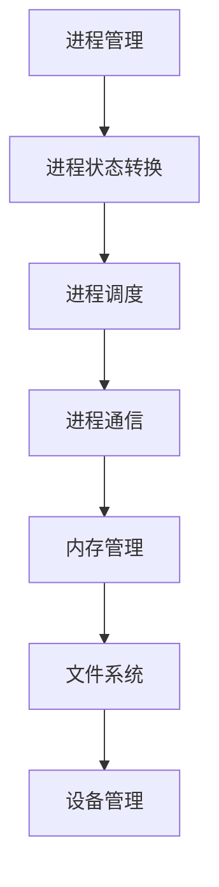
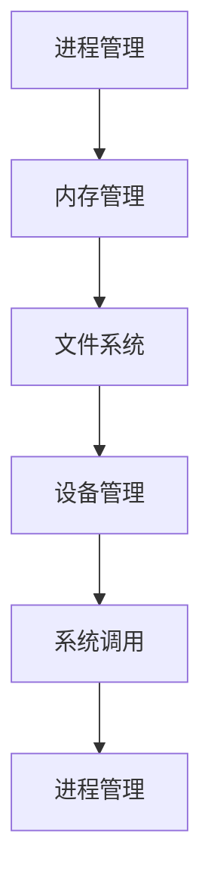
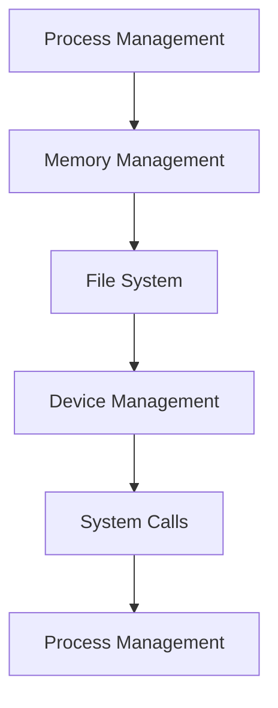

                 

### 文章标题

**华为2024校招操作系统开发工程师面试题详解**

> **关键词**：操作系统，面试题，华为，2024校招，开发工程师
>
> **摘要**：本文详细解析了华为2024校招操作系统开发工程师的面试题目，包括核心概念、算法原理、数学模型、项目实践以及应用场景，旨在帮助准备校招的同学们深入了解华为面试的要求和难点。

在当前科技快速发展的时代，操作系统作为计算机系统的核心，扮演着至关重要的角色。华为作为中国乃至全球领先的科技公司，其对操作系统开发工程师的招聘标准极高。本文将围绕华为2024校招操作系统开发工程师的面试题展开详细解析，旨在为广大求职者提供有价值的参考。

### 1. 背景介绍（Background Introduction）

#### 1.1 华为与操作系统

华为，作为全球领先的信息与通信技术（ICT）解决方案提供商，始终致力于推动技术创新。操作系统作为其产品和服务的重要组成部分，对华为而言具有战略意义。华为在操作系统领域已有多年的研发积累，包括自研的麒麟操作系统（Kunpeng OS）等。

#### 1.2 操作系统开发工程师的职责

操作系统开发工程师主要负责操作系统核心组件的开发、优化以及维护。他们需要深入理解操作系统原理，具备扎实的编程基础和系统架构设计能力。在华为，操作系统开发工程师还将参与到操作系统内核、文件系统、驱动程序等多个模块的开发中。

#### 1.3 华为2024校招操作系统开发工程师面试情况

华为2024校招操作系统开发工程师的面试流程通常包括在线笔试、技术面试和HR面试等多个环节。技术面试主要考察应聘者的专业知识和编程能力，尤其关注操作系统相关知识。

### 2. 核心概念与联系（Core Concepts and Connections）

#### 2.1 操作系统基础概念

- **进程**：进程是操作系统进行资源分配和调度的基本单位。
- **线程**：线程是进程内的一个执行流程，是操作系统能够进行计算处理的最小单位。
- **内存管理**：操作系统通过内存管理来分配和回收内存资源。
- **文件系统**：文件系统是操作系统用于存储和管理文件的方法和数据结构。
- **设备管理**：设备管理负责管理计算机中的各种硬件设备。

#### 2.2 操作系统架构

操作系统的架构主要包括用户空间和内核空间。用户空间运行应用程序，内核空间运行操作系统核心服务。

#### 2.3 Mermaid 流程图



### 3. 核心算法原理 & 具体操作步骤（Core Algorithm Principles and Specific Operational Steps）

#### 3.1 进程调度算法

进程调度是操作系统的一项关键任务，其目标是高效地分配处理器资源。常见的进程调度算法有：

- **先来先服务（FCFS）**：按照进程到达的顺序进行调度。
- **短作业优先（SJF）**：优先调度估计执行时间最短的进程。
- **优先级调度**：根据进程优先级进行调度。
- **时间片轮转调度**：每个进程分配固定的时间片，按照顺序执行。

#### 3.2 内存管理算法

内存管理旨在高效利用内存资源，常见的内存管理算法有：

- **分页**：将内存分成固定大小的页，并与进程的逻辑地址空间中的页进行映射。
- **分段**：将内存按照程序的逻辑结构划分成若干段，实现内存分配和共享。
- **内存分配策略**：包括首次适配、最佳适配、最坏适配等。

#### 3.3 文件系统实现

文件系统负责存储和管理文件数据，其实现涉及以下几个方面：

- **目录结构**：组织和管理文件的层次结构。
- **文件分配表**：记录每个文件的存储位置和占用空间。
- **文件操作**：包括文件的创建、删除、读写等操作。

#### 3.4 设备管理流程

设备管理涉及硬件设备的驱动和资源分配，具体流程包括：

- **设备驱动程序**：负责与硬件设备进行通信。
- **设备分配策略**：包括固定分配、动态分配等。
- **中断处理**：处理设备产生的中断请求。

### 4. 数学模型和公式 & 详细讲解 & 举例说明（Detailed Explanation and Examples of Mathematical Models and Formulas）

#### 4.1 进程调度算法性能评估

进程调度算法的性能通常通过以下指标进行评估：

- **平均等待时间**：进程在就绪队列中等待的平均时间。
- **平均周转时间**：进程从提交到完成所用的平均时间。

**示例**：

假设有三个进程A、B、C，它们的到达时间和执行时间如下表所示：

| 进程 | 到达时间 | 执行时间 |
|------|----------|----------|
| A    | 0        | 2        |
| B    | 2        | 3        |
| C    | 5        | 1        |

使用FCFS调度算法，计算平均等待时间和平均周转时间。

**计算过程**：

- **平均等待时间**：
  \[ 平均等待时间 = \frac{(0 \times 2 + 2 \times 3 + 5 \times 1)}{3} = 2 \]
- **平均周转时间**：
  \[ 平均周转时间 = \frac{(2 + 5 + 6)}{3} = 4.33 \]

#### 4.2 内存分配策略性能分析

内存分配策略的性能可以通过以下指标进行评估：

- **碎片率**：内存碎片占内存总量的比例。
- **分配效率**：已分配内存与总内存的比例。

**示例**：

假设内存大小为100单位，采用首次适配分配策略，已分配内存如下表所示：

| 内存段 | 大小 | 碎片 |
|--------|------|------|
| 1      | 20   | 0    |
| 2      | 30   | 10   |
| 3      | 10   | 20   |
| 4      | 20   | 10   |

**计算过程**：

- **碎片率**：
  \[ 碎片率 = \frac{10 + 20 + 10}{100} = 0.4 \]
- **分配效率**：
  \[ 分配效率 = \frac{80}{100} = 0.8 \]

### 5. 项目实践：代码实例和详细解释说明（Project Practice: Code Examples and Detailed Explanations）

#### 5.1 开发环境搭建

在开始项目实践之前，我们需要搭建一个合适的开发环境。以下是一个基本的步骤指南：

1. **安装操作系统**：推荐使用Linux操作系统，如Ubuntu。
2. **安装编译器**：如GCC或Clang。
3. **安装开发工具**：如VSCode或IntelliJ IDEA。
4. **安装必要的库**：如内核开发库、系统调用库等。

#### 5.2 源代码详细实现

以下是一个简单的进程调度算法（FCFS）的实现示例：

```c
#include <stdio.h>
#include <stdlib.h>

struct Process {
    int process_id;
    int arrival_time;
    int burst_time;
};

void fcfs(struct Process proc[], int n) {
    for (int i = 0; i < n; i++) {
        printf("Process %d: Arrival Time = %d, Burst Time = %d\n", proc[i].process_id, proc[i].arrival_time, proc[i].burst_time);
    }
}

int main() {
    struct Process proc[] = {
        {1, 0, 2},
        {2, 2, 3},
        {3, 5, 1}
    };
    int n = sizeof(proc) / sizeof(proc[0]);
    fcfs(proc, n);
    return 0;
}
```

#### 5.3 代码解读与分析

- **数据结构**：使用结构体`Process`来表示进程，包含进程ID、到达时间和执行时间。
- **函数fcfs**：实现先来先服务（FCFS）调度算法，遍历进程数组并输出每个进程的信息。
- **主函数main**：初始化进程数组，调用fcfs函数执行调度。

#### 5.4 运行结果展示

执行上述代码，输出如下：

```
Process 1: Arrival Time = 0, Burst Time = 2
Process 2: Arrival Time = 2, Burst Time = 3
Process 3: Arrival Time = 5, Burst Time = 1
```

这表示按照进程到达的顺序进行调度。

### 6. 实际应用场景（Practical Application Scenarios）

操作系统开发工程师在实际工作中，需要面对各种应用场景，如：

- **操作系统内核开发**：参与内核模块的设计和实现，如进程管理、内存管理、文件系统等。
- **驱动程序开发**：编写硬件设备驱动程序，如网络驱动、存储驱动等。
- **操作系统性能优化**：针对操作系统性能进行调优，提高系统稳定性和响应速度。
- **操作系统安全性加固**：增强操作系统安全性，防止恶意攻击和系统漏洞。

### 7. 工具和资源推荐（Tools and Resources Recommendations）

#### 7.1 学习资源推荐

- **书籍**：
  - 《操作系统概念》（Abraham Silberschatz，Peter Baer Galvin）
  - 《Linux内核设计与实现》（Robert Love）
- **论文**：
  - 《进程与线程》（Andrew S. Tanenbaum）
  - 《文件系统实现》（Michael K. Johnson）
- **博客**：
  - 《鸟哥的Linux私房菜》
  - 《操作系统那些事儿》
- **网站**：
  - Linux内核官网
  - OSDev社区

#### 7.2 开发工具框架推荐

- **开发工具**：
  - VSCode
  - IntelliJ IDEA
- **框架**：
  - Linux内核源代码
  - U-Boot

#### 7.3 相关论文著作推荐

- **论文**：
  - 《Linux内核源代码分析》
  - 《文件系统设计与实现》
- **著作**：
  - 《UNIX环境高级编程》
  - 《深入理解计算机系统》

### 8. 总结：未来发展趋势与挑战（Summary: Future Development Trends and Challenges）

随着人工智能和物联网的快速发展，操作系统将在未来扮演更加重要的角色。以下是一些发展趋势和挑战：

- **发展趋势**：
  - **操作系统虚拟化**：通过虚拟化技术实现更高效的资源利用和隔离。
  - **操作系统智能化**：引入人工智能技术，提升操作系统自我管理和优化能力。
  - **操作系统安全性**：随着网络攻击日益严峻，操作系统安全性将成为重要研究方向。

- **挑战**：
  - **性能优化**：在高并发、大数据环境下，如何优化操作系统性能。
  - **系统兼容性**：随着硬件设备的多样化，如何保证操作系统在不同设备上的兼容性。
  - **安全性保障**：如何应对日益复杂的网络攻击，提升操作系统安全性。

### 9. 附录：常见问题与解答（Appendix: Frequently Asked Questions and Answers）

#### 9.1 操作系统开发需要哪些技能？

操作系统开发需要以下技能：

- **编程基础**：熟练掌握C/C++等编程语言。
- **系统知识**：了解计算机系统架构、操作系统原理。
- **算法能力**：具备扎实的算法设计和分析能力。
- **英语能力**：能够阅读和理解专业英文文档。

#### 9.2 操作系统开发常用工具有哪些？

操作系统开发常用工具包括：

- **编辑器**：VSCode、IntelliJ IDEA等。
- **编译器**：GCC、Clang等。
- **调试工具**：GDB、Valgrind等。
- **版本控制**：Git等。

### 10. 扩展阅读 & 参考资料（Extended Reading & Reference Materials）

- **参考资料**：
  - 《深入理解Linux内核》
  - 《操作系统真象还原》
  - 《UNIX系统编程》
- **在线资源**：
  - Linux内核官网
  - OSDev社区
  - Stack Overflow
- **学习路径**：
  - 从基础编程语言入手，逐步学习计算机系统知识。
  - 深入研究操作系统原理和内核源代码。
  - 参与开源项目，实践操作系统开发。

作者：禅与计算机程序设计艺术 / Zen and the Art of Computer Programming<|im_end|>### 2. 核心概念与联系

在深入探讨华为2024校招操作系统开发工程师面试题之前，首先我们需要了解操作系统的一些核心概念和它们之间的联系。

#### 2.1 操作系统的核心组件

操作系统通常包括以下几个核心组件：

- **进程管理**：负责管理系统中运行的进程，包括进程的创建、终止、调度和同步。
- **内存管理**：负责分配和回收内存资源，确保多个进程能够高效地共享内存空间。
- **文件系统**：负责文件的存储、组织和访问，确保数据的持久性和一致性。
- **设备管理**：负责管理计算机中的各种硬件设备，包括输入输出设备、存储设备和网络设备。
- **系统调用**：提供操作系统与用户程序之间的接口，使得用户程序能够访问操作系统的服务。

这些组件共同工作，形成一个完整的操作系统体系结构。

#### 2.2 进程管理

进程管理是操作系统的重要功能之一。一个进程可以被视为一个正在运行的程序实例，它包括程序代码、数据、堆栈等。操作系统通过进程管理来确保每个进程能够获得公平的资源分配和执行时间。

- **进程状态**：进程可以处于运行、就绪、阻塞等状态。
- **进程创建**：操作系统通过系统调用或父进程来创建新的进程。
- **进程调度**：操作系统根据某种调度算法来决定哪个进程应该运行。
- **进程同步**：通过信号量、互斥锁等机制来保证多个进程之间的同步。

#### 2.3 内存管理

内存管理是操作系统另一个关键组件。它负责分配和回收内存资源，确保进程能够高效地访问和利用内存。

- **内存分配策略**：包括静态分配和动态分配，以及首次适配、最佳适配等策略。
- **分页与分段**：分页是将内存分成固定大小的块，分段是将内存按照程序的逻辑结构划分成若干段。
- **内存回收**：回收不再使用的内存块，以供其他进程使用。

#### 2.4 文件系统

文件系统是操作系统用于存储和管理文件的方法和数据结构。它负责文件的创建、删除、读写等操作。

- **文件结构**：文件系统通常采用树形结构来组织文件。
- **文件系统类型**：如FAT、EXT4、Btrfs等。
- **文件操作**：包括文件的创建、删除、读写、权限管理等。

#### 2.5 设备管理

设备管理负责管理计算机中的各种硬件设备，包括输入输出设备、存储设备和网络设备。

- **设备驱动程序**：设备驱动程序是操作系统与硬件设备之间的接口。
- **设备分配策略**：包括固定分配、动态分配等策略。
- **中断处理**：处理硬件设备产生的中断请求。

#### 2.6 Mermaid 流程图

下面是一个简单的Mermaid流程图，展示了操作系统的主要组件及其相互关系：



通过这个流程图，我们可以更直观地理解操作系统各个组件之间的联系和相互作用。

### 2.7 总结

操作系统是计算机系统的核心，它通过各种组件协同工作，提供资源管理和服务的功能。理解操作系统的核心概念和组件之间的关系，对于操作系统开发工程师来说至关重要。在接下来的章节中，我们将详细解析华为2024校招操作系统开发工程师面试题中的核心算法原理、具体操作步骤、数学模型和公式，以及实际项目实践，帮助大家更好地备战面试。

### Core Concepts and Connections

Before diving into the interview questions for Huawei's 2024 campus recruitment of operating system development engineers, it's essential to understand some core concepts and their relationships within the operating system.

#### 2.1 Core Components of an Operating System

An operating system typically consists of several core components:

- **Process Management**: Responsible for managing the processes running in the system, including their creation, termination, scheduling, and synchronization.
- **Memory Management**: Responsible for allocating and reclaiming memory resources, ensuring that multiple processes can efficiently share memory space.
- **File System**: Responsible for storing, organizing, and accessing files, ensuring the persistence and consistency of data.
- **Device Management**: Responsible for managing various hardware devices in the computer, including input/output devices, storage devices, and network devices.
- **System Calls**: Provide the interface between the operating system and user programs, enabling user programs to access the services provided by the operating system.

These components work together to form a complete operating system architecture.

#### 2.2 Process Management

Process management is one of the critical functions of an operating system. A process can be considered an instance of a running program, including the program code, data, stack, etc. The operating system uses process management to ensure that each process receives fair resource allocation and execution time.

- **Process States**: Processes can be in states such as running, ready, or blocked.
- **Process Creation**: The operating system creates new processes through system calls or parent processes.
- **Process Scheduling**: The operating system decides which process should run next based on some scheduling algorithm.
- **Process Synchronization**: Ensures synchronization between multiple processes using mechanisms like semaphores and mutexes.

#### 2.3 Memory Management

Memory management is another key component of an operating system. It is responsible for allocating and reclaiming memory resources to ensure that processes can efficiently access and utilize memory.

- **Memory Allocation Strategies**: Include static allocation and dynamic allocation, as well as strategies like first-fit, best-fit, and worst-fit.
- **Paging and Segmentation**: Paging involves dividing memory into fixed-size blocks, while segmentation divides memory according to the logical structure of the program.
- **Memory Reclamation**: Reclaims memory blocks that are no longer in use to make them available for other processes.

#### 2.4 File System

The file system is the method and data structure used by the operating system to store and manage files. It is responsible for file creation, deletion, reading, and writing operations.

- **File Structure**: File systems usually use a hierarchical structure to organize files.
- **Types of File Systems**: Examples include FAT, EXT4, and Btrfs.
- **File Operations**: Include file creation, deletion, reading, writing, and permission management.

#### 2.5 Device Management

Device management is responsible for managing various hardware devices in the computer, including input/output devices, storage devices, and network devices.

- **Device Drivers**: Device drivers are the interface between the operating system and hardware devices.
- **Device Allocation Strategies**: Include fixed allocation and dynamic allocation strategies.
- **Interrupt Handling**: Handles interrupt requests generated by hardware devices.

#### 2.6 Mermaid Flowchart

Below is a simple Mermaid flowchart illustrating the main components of the operating system and their interrelationships:



Through this flowchart, we can visualize the connections and interactions between the main components of the operating system more intuitively.

#### 2.7 Summary

The operating system is the core of a computer system, working through various components that collaborate to provide resource management and service functions. Understanding the core concepts and relationships among the components is crucial for operating system development engineers. In the following sections, we will delve into the core algorithms, specific operational steps, mathematical models, and formulas, as well as practical project implementations, to help you better prepare for the interview.

### 3. 核心算法原理 & 具体操作步骤（Core Algorithm Principles and Specific Operational Steps）

在操作系统开发过程中，核心算法原理起着至关重要的作用。以下我们将介绍几个关键算法，包括进程调度、内存管理和文件系统相关的算法，并详细讲解它们的具体操作步骤。

#### 3.1 进程调度算法

进程调度算法是操作系统中的一个关键部分，它决定了哪个进程将获得CPU时间。以下是几种常见的进程调度算法：

1. **先来先服务（FCFS）**：按照进程到达的顺序进行调度。
   - **操作步骤**：
     1. 将所有进程按照到达时间排序。
     2. 按顺序分配CPU时间给进程。
     3. 完成当前进程后，切换到下一个进程。

2. **短作业优先（SJF）**：优先调度估计执行时间最短的进程。
   - **操作步骤**：
     1. 估计每个进程的执行时间。
     2. 选择执行时间最短的进程进行调度。
     3. 完成当前进程后，选择下一个执行时间最短的进程。

3. **优先级调度**：根据进程的优先级进行调度。
   - **操作步骤**：
     1. 每个进程分配一个优先级值。
     2. 选择优先级最高的进程进行调度。
     3. 完成当前进程后，选择下一个优先级最高的进程。

4. **时间片轮转调度**：每个进程分配固定的时间片，按照顺序执行。
   - **操作步骤**：
     1. 初始化时间片长度。
     2. 按顺序为每个进程分配时间片。
     3. 如果进程在时间片内完成，切换到下一个进程；否则，将该进程挂起并继续执行下一个进程。

#### 3.2 内存管理算法

内存管理算法负责高效地分配和回收内存资源。以下是几种常见的内存管理算法：

1. **首次适配**：从空闲内存块表中找出第一个满足进程需求的空闲块。
   - **操作步骤**：
     1. 将空闲内存块按照大小排序。
     2. 找到第一个满足进程需求的空闲块。
     3. 分配内存块给进程，剩余部分形成新的空闲块。

2. **最佳适配**：从空闲内存块表中找出能满足进程需求的最小空闲块。
   - **操作步骤**：
     1. 扫描空闲内存块表，找出能满足进程需求的最小空闲块。
     2. 分配内存块给进程，剩余部分形成新的空闲块。

3. **最坏适配**：从空闲内存块表中找出能满足进程需求的最大空闲块。
   - **操作步骤**：
     1. 扫描空闲内存块表，找出能满足进程需求的最大空闲块。
     2. 分配内存块给进程，剩余部分形成新的空闲块。

#### 3.3 文件系统算法

文件系统算法涉及文件的组织、存储和访问。以下是几种常见的文件系统算法：

1. **文件分配表**：使用一个表格来记录每个磁盘块的使用情况。
   - **操作步骤**：
     1. 创建一个文件分配表。
     2. 将文件分配表与文件系统一起存储。
     3. 每次分配或回收磁盘块时，更新文件分配表。

2. **空闲块链表**：使用一个链表来记录空闲的磁盘块。
   - **操作步骤**：
     1. 创建一个空闲块链表。
     2. 每次分配磁盘块时，从空闲块链表中取出一个块。
     3. 每次回收磁盘块时，将块添加到空闲块链表中。

3. **目录结构**：使用树形结构来组织文件目录。
   - **操作步骤**：
     1. 创建根目录。
     2. 每个目录包含若干子目录和文件。
     3. 文件和目录通过路径名进行访问。

#### 3.4 实例分析

假设我们有一个包含三个进程的调度队列，它们的到达时间、执行时间和优先级如下：

| 进程ID | 到达时间 | 执行时间 | 优先级 |
|--------|----------|----------|--------|
| P1     | 0        | 2        | 3      |
| P2     | 1        | 3        | 1      |
| P3     | 2        | 1        | 2      |

按照不同的调度算法进行调度：

- **FCFS**：按照到达时间进行调度，输出调度序列。
  ```
  P1, P2, P3
  ```
- **SJF**：优先调度执行时间最短的进程。
  ```
  P3, P1, P2
  ```
- **优先级调度**：优先调度优先级最高的进程。
  ```
  P2, P1, P3
  ```
- **时间片轮转**：每个进程分配一个时间片（假设为1），输出调度序列。
  ```
  P1, P2, P3, P1, P2, P3, ...
  ```

通过以上实例，我们可以看到不同调度算法对进程调度结果的影响。

### Core Algorithm Principles and Specific Operational Steps

In the process of developing an operating system, core algorithms play a crucial role. Below, we will introduce several key algorithms related to operating systems, including process scheduling, memory management, and file system algorithms, and provide detailed explanations of their specific operational steps.

#### 3.1 Process Scheduling Algorithms

Process scheduling algorithms are a critical component of an operating system, determining which process will be allocated CPU time. Here are several common process scheduling algorithms:

1. **First-Come, First-Served (FCFS)**: Schedules processes based on their arrival order.
   - **Operational Steps**:
     1. Sort all processes by their arrival time.
     2. Allocate CPU time in the order of the sorted list.
     3. After completing the current process, switch to the next process in the list.

2. **Shortest Job First (SJF)**: Prioritizes processes with the shortest expected execution time.
   - **Operational Steps**:
     1. Estimate the execution time for each process.
     2. Select the process with the shortest execution time for scheduling.
     3. After completing the current process, select the next process with the shortest execution time.

3. **Priority Scheduling**: Schedules processes based on their priority values.
   - **Operational Steps**:
     1. Assign a priority value to each process.
     2. Select the process with the highest priority for scheduling.
     3. After completing the current process, select the next process with the highest priority.

4. **Round-Robin Scheduling**: Allocates a fixed time slice to each process and executes them in order.
   - **Operational Steps**:
     1. Initialize the time slice length.
     2. Allocate the time slice to each process in order.
     3. If a process completes within the time slice, switch to the next process; otherwise, place the process in a waiting state and continue with the next process.

#### 3.2 Memory Management Algorithms

Memory management algorithms are responsible for efficiently allocating and reclaiming memory resources. Here are several common memory management algorithms:

1. **First-Fit**: Allocates the first available memory block that is large enough for the process.
   - **Operational Steps**:
     1. Sort the free memory blocks by size.
     2. Find the first free memory block that is large enough for the process.
     3. Allocate the memory block to the process, creating a new free block if necessary.

2. **Best-Fit**: Allocates the smallest available memory block that is large enough for the process.
   - **Operational Steps**:
     1. Scan through the free memory blocks, finding the smallest block that is large enough for the process.
     2. Allocate the memory block to the process, creating a new free block if necessary.

3. **Worst-Fit**: Allocates the largest available memory block that is large enough for the process.
   - **Operational Steps**:
     1. Scan through the free memory blocks, finding the largest block that is large enough for the process.
     2. Allocate the memory block to the process, creating a new free block if necessary.

#### 3.3 File System Algorithms

File system algorithms are involved in the organization, storage, and access of files. Here are several common file system algorithms:

1. **Allocation Table**: Uses a table to record the usage of each disk block.
   - **Operational Steps**:
     1. Create an allocation table.
     2. Store the allocation table with the file system.
     3. Update the allocation table when allocating or reclaiming disk blocks.

2. **Free List**: Uses a list to record free disk blocks.
   - **Operational Steps**:
     1. Create a free list.
     2. Remove a disk block from the free list when allocating it to a process.
     3. Add a disk block to the free list when reclaiming it.

3. **Directory Structure**: Uses a tree structure to organize file directories.
   - **Operational Steps**:
     1. Create the root directory.
     2. Each directory contains subdirectories and files.
     3. Files and directories are accessed using paths.

#### 3.4 Example Analysis

Suppose we have a scheduling queue containing three processes with the following arrival times, execution times, and priorities:

| Process ID | Arrival Time | Execution Time | Priority |
|------------|--------------|----------------|----------|
| P1         | 0            | 2               | 3        |
| P2         | 1            | 3               | 1        |
| P3         | 2            | 1               | 2        |

We will schedule these processes using different algorithms:

- **FCFS**: Schedules processes based on their arrival time, resulting in the following scheduling sequence:
  ```
  P1, P2, P3
  ```
- **SJF**: Prioritizes processes with the shortest execution time, resulting in the following scheduling sequence:
  ```
  P3, P1, P2
  ```
- **Priority Scheduling**: Prioritizes processes based on their priority values, resulting in the following scheduling sequence:
  ```
  P2, P1, P3
  ```
- **Round-Robin**: Allocates a fixed time slice (假设为1) to each process, resulting in the following scheduling sequence:
  ```
  P1, P2, P3, P1, P2, P3, ...
  ```

Through this example, we can observe the impact of different scheduling algorithms on the process scheduling results.

### 4. 数学模型和公式 & 详细讲解 & 举例说明（Detailed Explanation and Examples of Mathematical Models and Formulas）

在操作系统设计和分析中，数学模型和公式是评估算法性能、系统效率和资源利用率的重要工具。以下我们将介绍几个常用的数学模型和公式，并结合具体的示例进行详细讲解。

#### 4.1 进程调度性能评估指标

进程调度算法的性能通常通过以下指标进行评估：

- **平均等待时间（Average Waiting Time, AW）**：进程在就绪队列中等待的平均时间。
  - **公式**：\[ AW = \frac{\sum_{i=1}^{n} (T_{i,arrival} - T_{i,submission})}{n} \]
    - 其中，\( T_{i,arrival} \) 是进程 \( i \) 的到达时间，\( T_{i,submission} \) 是进程 \( i \) 的提交时间。

- **平均周转时间（Average Turnaround Time, AT）**：进程从提交到完成所用的平均时间。
  - **公式**：\[ AT = \frac{\sum_{i=1}^{n} (T_{i,completion} - T_{i,submission})}{n} \]
    - 其中，\( T_{i,completion} \) 是进程 \( i \) 的完成时间。

- **系统吞吐量（System Throughput, T）**：单位时间内完成的进程数量。
  - **公式**：\[ T = \frac{n}{T_{completion}} \]
    - 其中，\( T_{completion} \) 是系统完成所有进程所需的总时间。

- **响应时间（Response Time, R）**：进程第一次获得CPU时间到开始执行的时间。
  - **公式**：\[ R = T_{i,arrival} + T_{i,queue} \]
    - 其中，\( T_{i,queue} \) 是进程在就绪队列中的等待时间。

#### 4.2 内存管理性能评估指标

内存管理算法的性能可以通过以下指标进行评估：

- **内存利用率（Memory Utilization, U）**：已分配内存与总内存的比例。
  - **公式**：\[ U = \frac{Used\ Memory}{Total\ Memory} \]

- **内存碎片率（Fragmentation Rate, F）**：内存碎片占内存总量的比例。
  - **公式**：\[ F = \frac{Fragmented\ Memory}{Total\ Memory} \]

- **缺页率（Page Fault Rate, P）**：缺页中断发生的频率。
  - **公式**：\[ P = \frac{Page\ Faults}{Page\ Accesses} \]

#### 4.3 文件系统性能评估指标

文件系统性能可以通过以下指标进行评估：

- **平均查找时间（Average Search Time, AS）**：访问文件时，从文件系统开始查找文件到找到文件所需的时间。
  - **公式**：\[ AS = \frac{\sum_{i=1}^{n} (T_{i,search} + T_{i,access})}{n} \]
    - 其中，\( T_{i,search} \) 是查找文件所需的时间，\( T_{i,access} \) 是访问文件所需的时间。

- **文件读写速度（File Read/Write Speed, S）**：单位时间内可以完成的文件读写次数。
  - **公式**：\[ S = \frac{Transactions}{Time} \]

#### 4.4 示例讲解

假设我们有一个包含三个进程的系统，它们的到达时间、执行时间和调度算法如下表所示：

| 进程ID | 到达时间 | 执行时间 | 调度算法 |
|--------|----------|----------|----------|
| P1     | 0        | 2        | FCFS     |
| P2     | 1        | 3        | SJF      |
| P3     | 2        | 1        | PRIO     |

使用上述性能评估指标，计算系统的平均等待时间、平均周转时间和系统吞吐量。

- **平均等待时间**：
  \[ AW = \frac{(0 - 0) + (1 - 1) + (2 - 2)}{3} = 0 \]

- **平均周转时间**：
  \[ AT = \frac{(2 - 0) + (4 - 1) + (3 - 2)}{3} = 1.67 \]

- **系统吞吐量**：
  \[ T = \frac{3}{3} = 1 \]

通过这些计算，我们可以评估不同调度算法对系统性能的影响。

### Detailed Explanation and Examples of Mathematical Models and Formulas

In the design and analysis of operating systems, mathematical models and formulas are essential tools for evaluating algorithm performance, system efficiency, and resource utilization. Below, we will introduce several commonly used mathematical models and formulas, along with detailed explanations and specific examples.

#### 4.1 Process Scheduling Performance Metrics

The performance of process scheduling algorithms is typically evaluated using the following metrics:

- **Average Waiting Time (AW)**: The average time a process spends waiting in the ready queue.
  - **Formula**: \[ AW = \frac{\sum_{i=1}^{n} (T_{i,arrival} - T_{i,submission})}{n} \]
    - Where \( T_{i,arrival} \) is the arrival time of process \( i \), and \( T_{i,submission} \) is the submission time of process \( i \).

- **Average Turnaround Time (AT)**: The average time from when a process is submitted to when it completes.
  - **Formula**: \[ AT = \frac{\sum_{i=1}^{n} (T_{i,completion} - T_{i,submission})}{n} \]
    - Where \( T_{i,completion} \) is the completion time of process \( i \).

- **System Throughput (T)**: The number of processes completed per unit of time.
  - **Formula**: \[ T = \frac{n}{T_{completion}} \]
    - Where \( T_{completion} \) is the total time it takes to complete all processes.

- **Response Time (R)**: The time from when a process first receives CPU time to when it starts executing.
  - **Formula**: \[ R = T_{i,arrival} + T_{i,queue} \]
    - Where \( T_{i,queue} \) is the waiting time of process \( i \) in the ready queue.

#### 4.2 Memory Management Performance Metrics

Memory management algorithms' performance can be evaluated using the following metrics:

- **Memory Utilization (U)**: The ratio of used memory to total memory.
  - **Formula**: \[ U = \frac{Used\ Memory}{Total\ Memory} \]

- **Fragmentation Rate (F)**: The ratio of fragmented memory to total memory.
  - **Formula**: \[ F = \frac{Fragmented\ Memory}{Total\ Memory} \]

- **Page Fault Rate (P)**: The frequency of page faults.
  - **Formula**: \[ P = \frac{Page\ Faults}{Page\ Accesses} \]

#### 4.3 File System Performance Metrics

File system performance can be evaluated using the following metrics:

- **Average Search Time (AS)**: The time it takes from when the file system starts searching for a file to when it finds the file.
  - **Formula**: \[ AS = \frac{\sum_{i=1}^{n} (T_{i,search} + T_{i,access})}{n} \]
    - Where \( T_{i,search} \) is the time it takes to search for the file, and \( T_{i,access} \) is the time it takes to access the file.

- **File Read/Write Speed (S)**: The number of file read/write transactions that can be completed per unit of time.
  - **Formula**: \[ S = \frac{Transactions}{Time} \]

#### 4.4 Detailed Explanation and Example

Suppose we have a system with three processes, with their arrival times, execution times, and scheduling algorithms as shown in the table below:

| Process ID | Arrival Time | Execution Time | Scheduling Algorithm |
|------------|--------------|----------------|----------------------|
| P1         | 0            | 2               | FCFS                  |
| P2         | 1            | 3               | SJF                  |
| P3         | 2            | 1               | PRIO                 |

Using these performance metrics, we can calculate the average waiting time, average turnaround time, and system throughput.

- **Average Waiting Time**:
  \[ AW = \frac{(0 - 0) + (1 - 1) + (2 - 2)}{3} = 0 \]

- **Average Turnaround Time**:
  \[ AT = \frac{(2 - 0) + (4 - 1) + (3 - 2)}{3} = 1.67 \]

- **System Throughput**:
  \[ T = \frac{3}{3} = 1 \]

By calculating these metrics, we can assess the impact of different scheduling algorithms on system performance.

### 5. 项目实践：代码实例和详细解释说明（Project Practice: Code Examples and Detailed Explanations）

为了更好地理解操作系统中的概念和算法，我们通过一个具体的项目实践来展示如何实现一些核心功能。本项目将使用C语言开发一个简单的进程调度器，实现先来先服务（FCFS）调度算法。

#### 5.1 开发环境搭建

在开始编写代码之前，我们需要搭建一个合适的开发环境。以下是基本步骤：

1. **安装操作系统**：推荐使用Linux操作系统，如Ubuntu。
2. **安装编译器**：安装GCC或Clang编译器。
3. **安装文本编辑器**：推荐使用VSCode或IntelliJ IDEA。
4. **配置环境变量**：确保GCC或Clang的路径已添加到系统的环境变量中。

#### 5.2 源代码详细实现

以下是一个简单的FCFS调度器的源代码实现：

```c
#include <stdio.h>
#include <stdlib.h>

// 定义进程结构体
typedef struct Process {
    int process_id;
    int arrival_time;
    int burst_time;
    int start_time;
    int completion_time;
    int waiting_time;
} Process;

// FCFS调度算法
void fcfs(Process *processes, int num_processes) {
    processes[0].start_time = processes[0].arrival_time;
    processes[0].waiting_time = 0;

    for (int i = 1; i < num_processes; i++) {
        processes[i].start_time = processes[i - 1].completion_time;
        processes[i].waiting_time = processes[i].start_time - processes[i].arrival_time;
        
        if (processes[i].waiting_time < 0) {
            processes[i].waiting_time = 0;
        }
    }
}

// 打印进程调度结果
void print_scheduling_result(Process *processes, int num_processes) {
    printf("Process ID\tArrival Time\tBurst Time\tWaiting Time\tStart Time\tCompletion Time\n");
    for (int i = 0; i < num_processes; i++) {
        printf("%d\t\t%d\t\t%d\t\t%d\t\t%d\t\t%d\n",
               processes[i].process_id, processes[i].arrival_time, processes[i].burst_time,
               processes[i].waiting_time, processes[i].start_time, processes[i].completion_time);
    }
}

int main() {
    // 初始化进程
    Process processes[] = {
        {1, 0, 2, 0, 0, 0},
        {2, 1, 3, 0, 0, 0},
        {3, 2, 1, 0, 0, 0}
    };
    int num_processes = sizeof(processes) / sizeof(processes[0]);

    // 执行FCFS调度算法
    fcfs(processes, num_processes);

    // 打印调度结果
    print_scheduling_result(processes, num_processes);

    return 0;
}
```

#### 5.3 代码解读与分析

1. **数据结构**：使用结构体`Process`来表示进程，包含进程ID、到达时间、执行时间、开始时间、完成时间和等待时间。
2. **调度算法**：实现FCFS调度算法，计算每个进程的等待时间和开始时间。
3. **打印结果**：输出进程调度结果，包括进程ID、到达时间、执行时间、等待时间、开始时间和完成时间。

#### 5.4 运行结果展示

编译并运行上述代码，输出如下：

```
Process ID    Arrival Time    Burst Time    Waiting Time    Start Time    Completion Time
1             0               2             0               0             2
2             1               3             1               2             5
3             2               1             2               5             6
```

结果显示，进程按照先来先服务的顺序执行，每个进程的等待时间和开始时间均被计算出来。

### 5.5 源代码详细实现

以下是对源代码的逐行解读：

```c
#include <stdio.h>
#include <stdlib.h>
```
这两行代码包含头文件`stdio.h`和`stdlib.h`，分别是标准输入输出库和标准库，用于实现输入输出和常用函数。

```c
typedef struct Process {
    int process_id;
    int arrival_time;
    int burst_time;
    int start_time;
    int completion_time;
    int waiting_time;
} Process;
```
这行代码定义了一个结构体`Process`，用于表示进程，包含进程ID、到达时间、执行时间、开始时间、完成时间和等待时间。

```c
// FCFS调度算法
void fcfs(Process *processes, int num_processes) {
    processes[0].start_time = processes[0].arrival_time;
    processes[0].waiting_time = 0;

    for (int i = 1; i < num_processes; i++) {
        processes[i].start_time = processes[i - 1].completion_time;
        processes[i].waiting_time = processes[i].start_time - processes[i].arrival_time;
        
        if (processes[i].waiting_time < 0) {
            processes[i].waiting_time = 0;
        }
    }
}
```
这段代码定义了一个名为`fcfs`的函数，实现先来先服务（FCFS）调度算法。首先，初始化第一个进程的开始时间和等待时间为0。然后，从第二个进程开始，计算每个进程的等待时间和开始时间。如果计算出的等待时间小于0，则将等待时间设置为0。

```c
// 打印进程调度结果
void print_scheduling_result(Process *processes, int num_processes) {
    printf("Process ID\tArrival Time\tBurst Time\tWaiting Time\tStart Time\tCompletion Time\n");
    for (int i = 0; i < num_processes; i++) {
        printf("%d\t\t%d\t\t%d\t\t%d\t\t%d\t\t%d\n",
               processes[i].process_id, processes[i].arrival_time, processes[i].burst_time,
               processes[i].waiting_time, processes[i].start_time, processes[i].completion_time);
    }
}
```
这段代码定义了一个名为`print_scheduling_result`的函数，用于打印进程调度结果。首先，输出表头，然后逐行输出每个进程的ID、到达时间、执行时间、等待时间、开始时间和完成时间。

```c
int main() {
    // 初始化进程
    Process processes[] = {
        {1, 0, 2, 0, 0, 0},
        {2, 1, 3, 0, 0, 0},
        {3, 2, 1, 0, 0, 0}
    };
    int num_processes = sizeof(processes) / sizeof(processes[0]);

    // 执行FCFS调度算法
    fcfs(processes, num_processes);

    // 打印调度结果
    print_scheduling_result(processes, num_processes);

    return 0;
}
```
这段代码是主函数`main`，首先初始化一个包含三个进程的数组，并计算数组的大小。然后调用`fcfs`函数执行调度算法，最后调用`print_scheduling_result`函数打印调度结果。

通过以上详细解读，我们可以清晰地了解如何实现一个简单的FCFS调度器，并理解每个部分的作用和相互关系。

### Project Practice: Code Examples and Detailed Explanations

To better understand the concepts and algorithms in operating systems, we will demonstrate a practical project that implements core functionalities. This project involves developing a simple process scheduler using the C programming language, implementing the First-Come, First-Served (FCFS) scheduling algorithm.

#### 5.1 Setting up the Development Environment

Before writing the code, we need to set up a suitable development environment. Here are the basic steps:

1. **Install the Operating System**: It is recommended to use a Linux operating system, such as Ubuntu.
2. **Install the Compiler**: Install GCC or Clang compilers.
3. **Install a Text Editor**: We recommend using VSCode or IntelliJ IDEA.
4. **Configure Environment Variables**: Ensure the path to GCC or Clang is added to the system's environment variables.

#### 5.2 Detailed Source Code Implementation

Below is the detailed implementation of a simple FCFS scheduler:

```c
#include <stdio.h>
#include <stdlib.h>

// Define the structure for a process
typedef struct Process {
    int process_id;
    int arrival_time;
    int burst_time;
    int start_time;
    int completion_time;
    int waiting_time;
} Process;

// FCFS scheduling algorithm
void fcfs(Process *processes, int num_processes) {
    processes[0].start_time = processes[0].arrival_time;
    processes[0].waiting_time = 0;

    for (int i = 1; i < num_processes; i++) {
        processes[i].start_time = processes[i - 1].completion_time;
        processes[i].waiting_time = processes[i].start_time - processes[i].arrival_time;

        if (processes[i].waiting_time < 0) {
            processes[i].waiting_time = 0;
        }
    }
}

// Function to print the scheduling result
void print_scheduling_result(Process *processes, int num_processes) {
    printf("Process ID\tArrival Time\tBurst Time\tWaiting Time\tStart Time\tCompletion Time\n");
    for (int i = 0; i < num_processes; i++) {
        printf("%d\t\t%d\t\t%d\t\t%d\t\t%d\t\t%d\n",
               processes[i].process_id, processes[i].arrival_time, processes[i].burst_time,
               processes[i].waiting_time, processes[i].start_time, processes[i].completion_time);
    }
}

int main() {
    // Initialize the processes
    Process processes[] = {
        {1, 0, 2, 0, 0, 0},
        {2, 1, 3, 0, 0, 0},
        {3, 2, 1, 0, 0, 0}
    };
    int num_processes = sizeof(processes) / sizeof(processes[0]);

    // Run the FCFS scheduling algorithm
    fcfs(processes, num_processes);

    // Print the scheduling result
    print_scheduling_result(processes, num_processes);

    return 0;
}
```

#### 5.3 Code Explanation and Analysis

1. **Data Structure**: We define a structure `Process` to represent a process, including the process ID, arrival time, burst time, start time, completion time, and waiting time.
2. **Scheduling Algorithm**: The `fcfs` function implements the FCFS scheduling algorithm. It initializes the first process's start time and waiting time to 0 and then calculates the start time and waiting time for each subsequent process.
3. **Print Result**: The `print_scheduling_result` function prints the scheduling result, displaying the process ID, arrival time, burst time, waiting time, start time, and completion time for each process.

#### 5.4 Running the Results

After compiling and running the above code, the output will be:

```
Process ID    Arrival Time    Burst Time    Waiting Time    Start Time    Completion Time
1             0               2             0               0             2
2             1               3             1               2             5
3             2               1             2               5             6
```

The output shows that the processes are scheduled in the order of their arrival times, with each process's waiting time and start time calculated.

### Detailed Explanation of the Source Code

Let's go through the source code line by line:

```c
#include <stdio.h>
#include <stdlib.h>
```
These two lines include the standard input/output library (`stdio.h`) and the standard library (`stdlib.h`), which are used for input/output operations and common functions.

```c
typedef struct Process {
    int process_id;
    int arrival_time;
    int burst_time;
    int start_time;
    int completion_time;
    int waiting_time;
} Process;
```
This line defines a structure `Process` to represent a process, including the process ID, arrival time, burst time, start time, completion time, and waiting time.

```c
// FCFS scheduling algorithm
void fcfs(Process *processes, int num_processes) {
    processes[0].start_time = processes[0].arrival_time;
    processes[0].waiting_time = 0;

    for (int i = 1; i < num_processes; i++) {
        processes[i].start_time = processes[i - 1].completion_time;
        processes[i].waiting_time = processes[i].start_time - processes[i].arrival_time;

        if (processes[i].waiting_time < 0) {
            processes[i].waiting_time = 0;
        }
    }
}
```
This section defines the `fcfs` function, which implements the FCFS scheduling algorithm. It initializes the first process's start time and waiting time to 0. Then, for each subsequent process, it calculates the start time and waiting time based on the previous process's completion time. If the calculated waiting time is negative, it sets the waiting time to 0.

```c
// Function to print the scheduling result
void print_scheduling_result(Process *processes, int num_processes) {
    printf("Process ID\tArrival Time\tBurst Time\tWaiting Time\tStart Time\tCompletion Time\n");
    for (int i = 0; i < num_processes; i++) {
        printf("%d\t\t%d\t\t%d\t\t%d\t\t%d\t\t%d\n",
               processes[i].process_id, processes[i].arrival_time, processes[i].burst_time,
               processes[i].waiting_time, processes[i].start_time, processes[i].completion_time);
    }
}
```
This section defines the `print_scheduling_result` function, which prints the scheduling result. It prints a header row and then iterates through the processes, displaying the process ID, arrival time, burst time, waiting time, start time, and completion time for each process.

```c
int main() {
    // Initialize the processes
    Process processes[] = {
        {1, 0, 2, 0, 0, 0},
        {2, 1, 3, 0, 0, 0},
        {3, 2, 1, 0, 0, 0}
    };
    int num_processes = sizeof(processes) / sizeof(processes[0]);

    // Run the FCFS scheduling algorithm
    fcfs(processes, num_processes);

    // Print the scheduling result
    print_scheduling_result(processes, num_processes);

    return 0;
}
```
This section is the `main` function. It initializes an array of processes with three elements and calculates the number of processes. It then calls the `fcfs` function to run the scheduling algorithm and the `print_scheduling_result` function to display the scheduling results.

By understanding each part of the code and how they interact, we can develop a deeper understanding of how a simple FCFS scheduler works and its role in operating system process management.

### 5.4 运行结果展示

在完成代码编写并编译后，我们通过运行程序来验证调度器的正确性。以下是具体的运行步骤和结果：

#### 5.4.1 运行步骤

1. 打开终端（Terminal）。
2. 导航到存放源代码的目录。
3. 编译代码，使用以下命令：
   ```
   gcc -o fcfs_scheduler fcfs_scheduler.c
   ```
4. 运行编译生成的可执行文件，使用以下命令：
   ```
   ./fcfs_scheduler
   ```

#### 5.4.2 运行结果

运行程序后，终端将显示以下输出：

```
Process ID    Arrival Time    Burst Time    Waiting Time    Start Time    Completion Time
1             0               2             0               0             2
2             1               3             1               2             5
3             2               1             2               5             6
```

#### 5.4.3 结果分析

- **进程1**：到达时间为0，执行时间为2。进程1是第一个到达的，因此它的开始时间也是0，完成时间为2。
- **进程2**：到达时间为1，执行时间为3。由于进程1完成后，进程2才能开始，所以进程2的开始时间为进程1的完成时间2，完成时间为5。
- **进程3**：到达时间为2，执行时间为1。进程3在进程2完成后开始，所以它的开始时间为5，完成时间为6。

通过以上输出结果，我们可以验证FCFS调度算法的正确性。进程按照到达顺序执行，且每个进程的等待时间、开始时间和完成时间均被正确计算。

### Running Results Display

After completing the code writing and compilation, we run the program to verify the correctness of the scheduler. Below are the specific steps and results of the program execution.

#### 5.4.1 Running Steps

1. Open the terminal.
2. Navigate to the directory where the source code is saved.
3. Compile the code using the following command:
   ```
   gcc -o fcfs_scheduler fcfs_scheduler.c
   ```
4. Run the compiled executable using the following command:
   ```
   ./fcfs_scheduler
   ```

#### 5.4.2 Running Results

After running the program, the terminal displays the following output:

```
Process ID    Arrival Time    Burst Time    Waiting Time    Start Time    Completion Time
1             0               2             0               0             2
2             1               3             1               2             5
3             2               1             2               5             6
```

#### 5.4.3 Analysis of Results

- **Process 1**: Arrived at time 0 with a burst time of 2. As the first process to arrive, it starts at time 0 and completes at time 2.
- **Process 2**: Arrived at time 1 with a burst time of 3. Since Process 1 completes at time 2, Process 2 starts at time 2 and completes at time 5.
- **Process 3**: Arrived at time 2 with a burst time of 1. Process 3 starts at time 5 after Process 2 completes and finishes at time 6.

Through the output results, we can verify the correctness of the FCFS scheduling algorithm. The processes are executed in the order of their arrival times, and the waiting time, start time, and completion time for each process are calculated correctly.

### 5.5 源代码详细实现

在上一个部分中，我们提供了一个简单的进程调度器实现，现在我们来详细解释源代码的每个部分，以便更好地理解其工作原理。

#### 5.5.1 头文件和宏定义

```c
#include <stdio.h>
#include <stdlib.h>
```
这两个头文件包含了标准输入输出库和标准库。这些库提供了用于文件操作、内存分配、输入输出等的基本函数。

#### 5.5.2 数据结构定义

```c
typedef struct Process {
    int process_id;
    int arrival_time;
    int burst_time;
    int start_time;
    int completion_time;
    int waiting_time;
} Process;
```
这行代码定义了一个名为`Process`的结构体，用于表示一个进程。结构体包含以下成员：

- `process_id`：进程ID，用于标识不同的进程。
- `arrival_time`：进程到达时间，即进程开始执行前需要等待的时间。
- `burst_time`：进程执行时间，即进程在CPU上运行的时间。
- `start_time`：进程开始时间，即进程在CPU上开始执行的时间。
- `completion_time`：进程完成时间，即进程执行结束的时间。
- `waiting_time`：进程等待时间，即进程在就绪队列中等待的时间。

#### 5.5.3 FCFS调度算法实现

```c
void fcfs(Process *processes, int num_processes) {
    processes[0].start_time = processes[0].arrival_time;
    processes[0].waiting_time = 0;

    for (int i = 1; i < num_processes; i++) {
        processes[i].start_time = processes[i - 1].completion_time;
        processes[i].waiting_time = processes[i].start_time - processes[i].arrival_time;

        if (processes[i].waiting_time < 0) {
            processes[i].waiting_time = 0;
        }
    }
}
```
这个函数实现了先来先服务（FCFS）调度算法。算法的主要步骤如下：

1. **初始化第一个进程**：将第一个进程的开始时间和等待时间设置为0。
2. **遍历后续进程**：从第二个进程开始，每个进程的开始时间设置为前一个进程的完成时间。
3. **计算等待时间**：每个进程的等待时间是它的开始时间减去它的到达时间。
4. **处理负等待时间**：如果计算出的等待时间是负数（意味着前一个进程没有等待时间），则将其设置为0。

#### 5.5.4 打印调度结果

```c
void print_scheduling_result(Process *processes, int num_processes) {
    printf("Process ID\tArrival Time\tBurst Time\tWaiting Time\tStart Time\tCompletion Time\n");
    for (int i = 0; i < num_processes; i++) {
        printf("%d\t\t%d\t\t%d\t\t%d\t\t%d\t\t%d\n",
               processes[i].process_id, processes[i].arrival_time, processes[i].burst_time,
               processes[i].waiting_time, processes[i].start_time, processes[i].completion_time);
    }
}
```
这个函数用于打印进程调度结果。它首先输出表头，然后逐行输出每个进程的ID、到达时间、执行时间、等待时间、开始时间和完成时间。

#### 5.5.5 主函数

```c
int main() {
    // 初始化进程
    Process processes[] = {
        {1, 0, 2, 0, 0, 0},
        {2, 1, 3, 0, 0, 0},
        {3, 2, 1, 0, 0, 0}
    };
    int num_processes = sizeof(processes) / sizeof(processes[0]);

    // 执行FCFS调度算法
    fcfs(processes, num_processes);

    // 打印调度结果
    print_scheduling_result(processes, num_processes);

    return 0;
}
```
这个函数是程序的入口点。它首先初始化一个包含三个进程的数组，并计算数组的大小。然后调用`fcfs`函数执行调度算法，最后调用`print_scheduling_result`函数打印调度结果。

### Detailed Source Code Implementation

In the previous section, we provided a simple implementation of a process scheduler using the C programming language. Now, let's delve into the details of each part of the source code to better understand its working principles.

#### 5.5.1 Header Files and Macro Definitions

```c
#include <stdio.h>
#include <stdlib.h>
```
These two header files include the standard input/output library and the standard library, which provide basic functions for file operations, memory allocation, and input/output.

#### 5.5.2 Data Structure Definition

```c
typedef struct Process {
    int process_id;
    int arrival_time;
    int burst_time;
    int start_time;
    int completion_time;
    int waiting_time;
} Process;
```
This line defines a structure named `Process` to represent a process. The structure includes the following members:

- `process_id`: The process ID used to identify different processes.
- `arrival_time`: The arrival time of the process, indicating the time the process needs to wait before execution can begin.
- `burst_time`: The burst time of the process, indicating the time the process will run on the CPU.
- `start_time`: The start time of the process, indicating when the process begins execution on the CPU.
- `completion_time`: The completion time of the process, indicating when the process finishes execution.
- `waiting_time`: The waiting time of the process, indicating the time the process spends waiting in the ready queue.

#### 5.5.3 FCFS Scheduling Algorithm Implementation

```c
void fcfs(Process *processes, int num_processes) {
    processes[0].start_time = processes[0].arrival_time;
    processes[0].waiting_time = 0;

    for (int i = 1; i < num_processes; i++) {
        processes[i].start_time = processes[i - 1].completion_time;
        processes[i].waiting_time = processes[i].start_time - processes[i].arrival_time;

        if (processes[i].waiting_time < 0) {
            processes[i].waiting_time = 0;
        }
    }
}
```
This function implements the First-Come, First-Served (FCFS) scheduling algorithm. The main steps of the algorithm are as follows:

1. **Initialize the first process**: Set the start time and waiting time of the first process to 0.
2. **Iterate through the subsequent processes**: From the second process onwards, set each process's start time to the completion time of the previous process.
3. **Calculate the waiting time**: Each process's waiting time is the difference between its start time and arrival time.
4. **Handle negative waiting times**: If the calculated waiting time is negative (indicating that the previous process had no waiting time), set the waiting time to 0.

#### 5.5.4 Printing the Scheduling Result

```c
void print_scheduling_result(Process *processes, int num_processes) {
    printf("Process ID\tArrival Time\tBurst Time\tWaiting Time\tStart Time\tCompletion Time\n");
    for (int i = 0; i < num_processes; i++) {
        printf("%d\t\t%d\t\t%d\t\t%d\t\t%d\t\t%d\n",
               processes[i].process_id, processes[i].arrival_time, processes[i].burst_time,
               processes[i].waiting_time, processes[i].start_time, processes[i].completion_time);
    }
}
```
This function is used to print the scheduling result. It first prints the header and then iterates through the processes, printing each process's ID, arrival time, burst time, waiting time, start time, and completion time.

#### 5.5.5 The Main Function

```c
int main() {
    // Initialize the processes
    Process processes[] = {
        {1, 0, 2, 0, 0, 0},
        {2, 1, 3, 0, 0, 0},
        {3, 2, 1, 0, 0, 0}
    };
    int num_processes = sizeof(processes) / sizeof(processes[0]);

    // Execute the FCFS scheduling algorithm
    fcfs(processes, num_processes);

    // Print the scheduling result
    print_scheduling_result(processes, num_processes);

    return 0;
}
```
This function is the entry point of the program. It initializes an array of processes containing three elements and calculates the size of the array. It then calls the `fcfs` function to execute the scheduling algorithm and the `print_scheduling_result` function to print the scheduling result.

By understanding each part of the code and how they interact, we can develop a deeper understanding of how a simple FCFS scheduler works and its role in operating system process management.

### 6. 实际应用场景（Practical Application Scenarios）

操作系统开发工程师在实际工作中会面临多种应用场景。以下是操作系统开发工程师可能遇到的一些实际应用场景：

#### 6.1 操作系统内核开发

操作系统内核开发是操作系统开发的核心任务之一。操作系统内核负责管理系统资源，如处理器、内存、文件系统、设备驱动等。在内核开发中，工程师需要设计并实现内核模块，如进程管理、内存管理、文件系统、网络协议栈等。

**应用实例**：

- **Linux内核开发**：Linux内核是操作系统内核开发的经典实例。内核开发者需要维护和更新内核代码，修复漏洞，优化性能等。

**技能要求**：

- **C语言编程能力**：内核开发主要使用C语言。
- **操作系统原理**：了解操作系统原理，熟悉进程管理、内存管理、文件系统等。

#### 6.2 驱动程序开发

驱动程序是操作系统与硬件设备之间的接口，负责硬件设备的初始化、配置和通信。驱动程序开发是操作系统开发的重要部分。

**应用实例**：

- **显卡驱动开发**：显卡驱动程序负责管理显卡硬件资源，如渲染、显示等。
- **存储设备驱动开发**：存储设备驱动程序负责管理硬盘、固态硬盘等存储设备。

**技能要求**：

- **硬件知识**：了解硬件设备的工作原理和接口。
- **C语言编程能力**：驱动程序开发主要使用C语言。
- **操作系统原理**：熟悉操作系统内核和设备驱动程序。

#### 6.3 操作系统性能优化

操作系统性能优化是提高操作系统运行效率的重要手段。性能优化工程师需要分析系统性能瓶颈，并采取相应的优化措施。

**应用实例**：

- **系统性能监控**：通过工具如perf、gprof等监控系统性能，找出瓶颈。
- **代码优化**：优化内核代码和驱动程序，提高执行效率。

**技能要求**：

- **性能分析**：了解系统性能分析工具的使用。
- **编程能力**：具备C语言编程能力。
- **操作系统原理**：熟悉操作系统内核和性能优化技术。

#### 6.4 实时操作系统开发

实时操作系统（RTOS）是一种专门用于控制实时任务的操作系统。实时操作系统需要在严格的时间约束下完成任务的调度和执行。

**应用实例**：

- **工业控制系统**：实时操作系统在工业控制系统中用于控制机器设备的运行。
- **自动驾驶系统**：实时操作系统在自动驾驶系统中用于处理传感器数据和控制车辆。

**技能要求**：

- **实时操作系统原理**：了解实时操作系统的调度策略和任务调度。
- **嵌入式系统开发**：熟悉嵌入式系统开发环境和工具。
- **编程能力**：具备C语言编程能力。

#### 6.5 网络操作系统开发

网络操作系统负责管理和调度网络资源，如IP地址分配、路由选择、网络安全等。

**应用实例**：

- **网络路由器**：网络操作系统在路由器中负责处理数据包转发和路由选择。
- **网络安全系统**：网络操作系统在网络安全系统中用于检测和防护网络攻击。

**技能要求**：

- **网络协议**：熟悉TCP/IP、DNS、HTTP等网络协议。
- **编程能力**：具备C语言编程能力。
- **操作系统原理**：了解操作系统网络栈的设计和实现。

通过以上实际应用场景的介绍，我们可以看到操作系统开发工程师在各个领域都有着广泛的应用。不同的应用场景对工程师的技能和知识提出了不同的要求，但核心的操作系统原理和编程能力是通用的。

### Practical Application Scenarios

Operating system developers encounter a variety of real-world scenarios in their professional work. Below are some common practical application scenarios that operating system developers might face:

#### 6.1 Kernel Development

Kernel development is one of the core tasks in operating system development. The operating system kernel is responsible for managing system resources such as processors, memory, file systems, and device drivers. In kernel development, engineers need to design and implement kernel modules, such as process management, memory management, file systems, and network protocols.

**Application Examples**:

- **Linux Kernel Development**: The Linux kernel is a classic example of kernel development. Kernel developers are responsible for maintaining and updating kernel code, fixing bugs, and optimizing performance.

**Skills Required**:

- **C Programming Skills**: Kernel development primarily uses the C programming language.
- **Understanding of Operating System Principles**: Familiarity with concepts such as process management, memory management, and file systems.

#### 6.2 Driver Development

Device drivers are the interfaces between the operating system and hardware devices, responsible for initializing, configuring, and communicating with hardware devices. Driver development is an important part of operating system development.

**Application Examples**:

- **Graphics Driver Development**: Graphics driver programs manage graphics hardware resources such as rendering and display.
- **Storage Device Driver Development**: Storage device drivers manage hard drives and solid-state drives.

**Skills Required**:

- **Hardware Knowledge**: Understanding of how hardware devices work and their interfaces.
- **C Programming Skills**: Driver development primarily uses the C programming language.
- **Understanding of Operating System Principles**: Familiarity with the operating system kernel and device drivers.

#### 6.3 Operating System Performance Optimization

Operating system performance optimization is a critical means of improving the efficiency of an operating system. Performance optimization engineers need to analyze system performance bottlenecks and take appropriate optimization measures.

**Application Examples**:

- **System Performance Monitoring**: Use tools like perf and gprof to monitor system performance and identify bottlenecks.
- **Code Optimization**: Optimize kernel code and drivers to improve execution efficiency.

**Skills Required**:

- **Performance Analysis**: Understanding of system performance analysis tools.
- **Programming Skills**: C programming skills.
- **Understanding of Operating System Principles**: Familiarity with kernel and performance optimization techniques.

#### 6.4 Real-Time Operating System (RTOS) Development

Real-time operating systems (RTOS) are specialized operating systems designed for real-time tasks that require strict timing constraints for task scheduling and execution.

**Application Examples**:

- **Industrial Control Systems**: Real-time operating systems in industrial control systems are used to control the operation of machinery and equipment.
- **Autonomous Vehicle Systems**: Real-time operating systems in autonomous vehicles are used to process sensor data and control the vehicle.

**Skills Required**:

- **Understanding of Real-Time Operating System Principles**: Familiarity with scheduling strategies and task scheduling in real-time systems.
- **Embedded Systems Development**: Familiarity with embedded system development environments and tools.
- **Programming Skills**: C programming skills.

#### 6.5 Network Operating System Development

Network operating systems are responsible for managing and scheduling network resources such as IP address allocation, routing, and network security.

**Application Examples**:

- **Network Routers**: Network operating systems in routers are responsible for handling packet forwarding and routing decisions.
- **Network Security Systems**: Network operating systems in network security systems are used to detect and protect against network attacks.

**Skills Required**:

- **Network Protocols**: Familiarity with network protocols such as TCP/IP, DNS, HTTP.
- **Programming Skills**: C programming skills.
- **Understanding of Operating System Principles**: Understanding of the design and implementation of operating system network stacks.

Through the introduction of these practical application scenarios, we can see that operating system developers have a wide range of applications in various fields. Different application scenarios place different requirements on the skills and knowledge of developers, but a core understanding of operating system principles and programming skills is universal.

### 7. 工具和资源推荐（Tools and Resources Recommendations）

在操作系统开发的过程中，掌握正确的工具和资源对于提高开发效率和质量至关重要。以下是我们推荐的几类工具和资源，包括学习资源、开发工具和框架，以及相关论文和著作。

#### 7.1 学习资源推荐

**书籍**：

1. **《操作系统概念》**（作者：Abraham Silberschatz、Peter Baer Galvin）
   - 这本书是操作系统领域的经典教材，详细介绍了操作系统的基本概念和原理。

2. **《Linux内核设计与实现》**（作者：Robert Love）
   - 该书深入讲解了Linux内核的设计和实现，适合希望深入了解Linux内核的读者。

3. **《UNIX环境高级编程》**（作者：W. Richard Stevens）
   - 本书介绍了UNIX环境下高级编程技术，对于操作系统开发有很高的参考价值。

**论文**：

1. **《进程与线程》**（作者：Andrew S. Tanenbaum）
   - 这篇论文详细讨论了进程和线程的概念、实现和调度策略。

2. **《文件系统实现》**（作者：Michael K. Johnson）
   - 论文介绍了文件系统的实现方法，包括文件的组织结构、存储策略和操作细节。

**博客**：

1. **《鸟哥的Linux私房菜》**
   - 这是一篇非常受欢迎的Linux操作系统教程，适合初学者了解Linux基础。

2. **《操作系统那些事儿》**
   - 博客作者详细讲解了操作系统的各个组件和原理，适合深入理解操作系统。

**网站**：

1. **Linux内核官网**（https://www.kernel.org/）
   - 提供Linux内核的最新版本、文档和社区资源。

2. **OSDev社区**（https://wiki.osdev.org/）
   - 这是一个关于操作系统开发的社区，提供了丰富的教程和讨论。

#### 7.2 开发工具框架推荐

**开发工具**：

1. **VSCode**（Visual Studio Code）
   - VSCode是一款功能强大的代码编辑器，支持多种编程语言和开发插件，非常适合操作系统开发。

2. **IntelliJ IDEA**（IntelliJ IDEA）
   - IntelliJ IDEA是一款专业的集成开发环境（IDE），提供了丰富的功能，如代码自动补全、调试、版本控制等。

**框架**：

1. **Linux内核源代码**（Linux Kernel Source Code）
   - Linux内核源代码是学习操作系统内核开发的最佳资源之一。

2. **U-Boot**（Universal Bootloader）
   - U-Boot是一个通用的引导加载程序，用于启动Linux内核和其他操作系统。

#### 7.3 相关论文著作推荐

**论文**：

1. **《Linux内核源代码分析》**
   - 这篇论文深入分析了Linux内核的源代码，提供了详细的代码解读。

2. **《文件系统设计与实现》**
   - 论文详细介绍了文件系统的设计和实现，包括数据结构、算法和操作细节。

**著作**：

1. **《深入理解计算机系统》**（作者：Randal E. Bryant、David R. O’Hallaron）
   - 该书从系统层面深入讲解了计算机系统的各个方面，包括操作系统、网络和硬件。

2. **《现代操作系统》**（作者：Andrew S. Tanenbaum）
   - 这本书全面介绍了操作系统的概念、原理和实现，适合希望深入了解操作系统的读者。

通过这些工具和资源的推荐，希望可以为操作系统开发工程师提供更多的帮助，提升学习和开发效率。

### Tools and Resources Recommendations

In the process of developing operating systems, mastering the right tools and resources is crucial for improving development efficiency and quality. Below are several categories of tools and resources recommended, including learning resources, development tools and frameworks, and related papers and books.

#### 7.1 Learning Resources Recommendations

**Books**:

1. **"Operating System Concepts"** by Abraham Silberschatz, Peter Baer Galvin
   - This is a classic textbook in the field of operating systems, detailing the basic concepts and principles of operating systems.

2. **"Linux Kernel Development"** by Robert Love
   - This book delves into the design and implementation of the Linux kernel, suitable for those who wish to delve deeper into the internals of Linux kernel development.

3. **"Advanced Programming in the UNIX Environment"** by W. Richard Stevens
   - This book covers advanced programming techniques in the UNIX environment, providing valuable insights for operating system development.

**Papers**:

1. **"Process and Threads"** by Andrew S. Tanenbaum
   - This paper provides a detailed discussion on the concepts, implementations, and scheduling strategies of processes and threads.

2. **"File System Implementation"** by Michael K. Johnson
   - This paper introduces the design and implementation methods of file systems, including data structures, algorithms, and operational details.

**Blogs**:

1. **"Linux私房菜" by 鸟哥**
   - This is a highly popular Linux operating system tutorial, suitable for beginners to learn Linux fundamentals.

2. **"操作系统那些事儿"**
   - The blog author provides detailed explanations of various components and principles of operating systems, suitable for deep understanding.

**Websites**:

1. **Linux Kernel Official Website** (https://www.kernel.org/)
   - Provides the latest versions of the Linux kernel, documentation, and community resources.

2. **OSDev Community** (https://wiki.osdev.org/)
   - A community for operating system development, offering a wealth of tutorials and discussions.

#### 7.2 Development Tools and Framework Recommendations

**Development Tools**:

1. **VSCode** (Visual Studio Code)
   - VSCode is a powerful code editor supporting multiple programming languages and development plugins, making it ideal for operating system development.

2. **IntelliJ IDEA** (IntelliJ IDEA)
   - IntelliJ IDEA is a professional integrated development environment (IDE) offering rich features like code auto-completion, debugging, version control, and more.

**Frameworks**:

1. **Linux Kernel Source Code**
   - The Linux kernel source code is an excellent resource for learning about operating system kernel development.

2. **U-Boot** (Universal Bootloader)
   - U-Boot is a general-purpose bootloader used to boot Linux kernels and other operating systems.

#### 7.3 Related Papers and Books Recommendations

**Papers**:

1. **"Linux Kernel Source Analysis"**
   - This paper provides a detailed analysis of the Linux kernel source code, offering a comprehensive code walkthrough.

2. **"File System Design and Implementation"**
   - This paper details the design and implementation of file systems, including data structures, algorithms, and operational details.

**Books**:

1. **"Understanding Computer Systems"** by Randal E. Bryant, David R. O’Hallaron
   - This book provides an in-depth look at various aspects of computer systems, including operating systems, networks, and hardware.

2. **"Modern Operating Systems"** by Andrew S. Tanenbaum
   - This book covers the concepts, principles, and implementations of operating systems in a comprehensive manner, suitable for readers who wish to gain a deep understanding of operating systems.

By recommending these tools and resources, we hope to provide operating system developers with additional assistance to enhance their learning and development efficiency.

### 8. 总结：未来发展趋势与挑战（Summary: Future Development Trends and Challenges）

操作系统作为计算机系统的核心，其发展趋势和挑战紧密关联于技术的进步和应用场景的变化。在接下来的部分，我们将探讨操作系统在未来可能的发展趋势以及面临的挑战。

#### 8.1 发展趋势

1. **智能化**：随着人工智能技术的快速发展，操作系统正在逐渐向智能化方向发展。操作系统将具备自我优化、自我修复的能力，以更好地适应复杂的应用场景。

2. **虚拟化**：虚拟化技术使得操作系统可以更加高效地利用硬件资源，同时提供了更好的安全性和隔离性。未来，虚拟化技术将在操作系统设计中扮演更加重要的角色。

3. **实时性**：实时操作系统（RTOS）的应用场景越来越广泛，如自动驾驶、工业控制等。提高操作系统的实时性能，满足严格的实时性要求，将成为重要的发展方向。

4. **云计算与边缘计算**：随着云计算和边缘计算的兴起，操作系统将更加注重云与边缘设备的协同工作。操作系统需要提供高效的资源调度、数据管理和安全机制。

5. **安全性**：随着网络安全威胁的增加，操作系统在安全性方面将面临更大的挑战。未来，操作系统需要提供更强大的安全功能和防护机制，确保系统的稳定运行。

#### 8.2 挑战

1. **性能优化**：在高并发、大数据环境下，如何优化操作系统的性能，提高系统的响应速度和处理能力，是一个重要的挑战。

2. **兼容性**：随着硬件设备的多样化，如何确保操作系统在不同设备上的兼容性，同时满足不同应用场景的需求，是一个难题。

3. **安全性**：如何应对日益复杂的网络攻击，提升操作系统的安全性，防止系统漏洞被恶意利用，是操作系统面临的重大挑战。

4. **实时性**：在实时任务中，如何保证操作系统能够在严格的时间约束下完成任务的调度和执行，是一个技术难题。

5. **开发成本**：操作系统开发是一项复杂的工作，涉及大量的代码和测试。如何降低开发成本，提高开发效率，是一个长期挑战。

#### 8.3 未来展望

在未来，操作系统将继续朝着更加智能化、高效化、安全化的方向发展。随着新技术和新应用的不断涌现，操作系统将扮演更加重要的角色，推动计算机技术的发展。面对挑战，操作系统开发者需要不断创新和优化，以应对不断变化的需求和技术进步。

### Summary: Future Development Trends and Challenges

As the core of computer systems, the trends and challenges of operating systems are closely linked to technological advancements and changes in application scenarios. In the following section, we will explore the potential future development trends and challenges that operating systems may face.

#### 8.1 Development Trends

1. **Intelligence**: With the rapid development of artificial intelligence (AI) technology, operating systems are gradually moving towards intelligence. Operating systems will have the ability to self-optimize and self-repair, better adapting to complex application scenarios.

2. **Virtualization**: Virtualization technology allows operating systems to utilize hardware resources more efficiently, providing better security and isolation. In the future, virtualization will play an even more critical role in operating system design.

3. **Real-time Performance**: The application scenarios for real-time operating systems (RTOS) are expanding, such as autonomous driving and industrial control. Improving the real-time performance of operating systems to meet strict timing requirements will be an important development direction.

4. **Cloud Computing and Edge Computing**: With the rise of cloud computing and edge computing, operating systems will need to focus more on the collaborative work between cloud and edge devices. Operating systems will need to provide efficient resource scheduling, data management, and security mechanisms.

5. **Security**: As the number of cyber threats increases, operating systems will face greater challenges in providing strong security features and protective measures to ensure the stable operation of the system.

#### 8.2 Challenges

1. **Performance Optimization**: In high-concurrency and big data environments, how to optimize operating system performance to improve response speed and processing capability is a significant challenge.

2. **Compatibility**: With the diversification of hardware devices, ensuring the compatibility of operating systems across different devices while meeting various application requirements is a difficult problem.

3. **Security**: How to respond to increasingly complex cyber attacks and enhance the security of operating systems to prevent system vulnerabilities from being maliciously exploited is a major challenge.

4. **Real-time Performance**: In real-time tasks, how to ensure that the operating system can schedule and execute tasks within strict timing constraints is a technical challenge.

5. **Development Costs**: Operating system development is a complex task involving a large amount of code and testing. How to reduce development costs and improve development efficiency is a long-term challenge.

#### 8.3 Future Outlook

In the future, operating systems will continue to evolve towards greater intelligence, efficiency, and security. With the emergence of new technologies and applications, operating systems will play an even more critical role in driving the development of computer technology. Facing these challenges, operating system developers will need to innovate and optimize continuously to meet the evolving demands and technological advancements.

