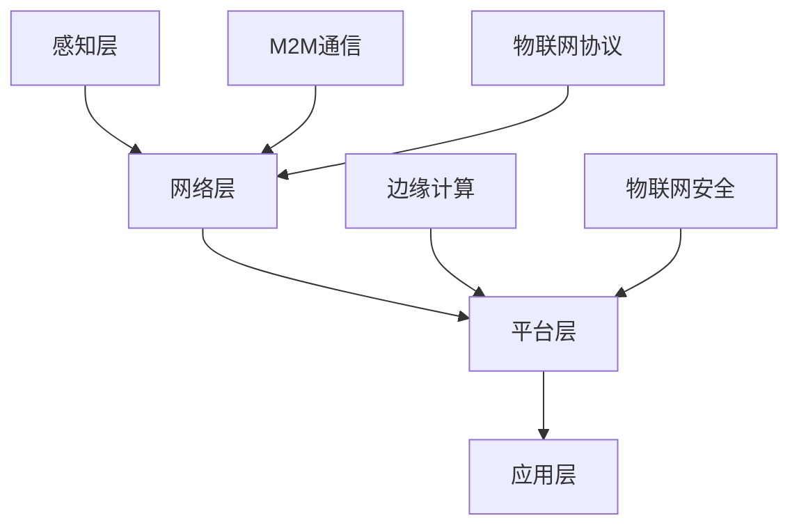
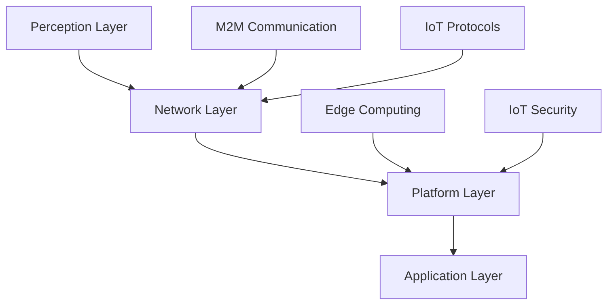

                 

### 背景介绍（Background Introduction）

随着物联网（IoT）技术的飞速发展，华为云IoT已经成为企业数字化转型的重要工具。在2024年的华为云IoT校招面试中，考官们为了选拔优秀的人才，准备了一系列涉及深度技术理解的面试真题。本文将汇总这些面试真题，并提供详细的解答，旨在帮助即将面试的同学们更好地准备。

#### 1.1 华为云IoT的发展现状

华为云IoT平台是全球领先的物联网解决方案提供商，提供从设备连接、数据采集、数据处理到应用开发的全方位服务。截至2024年，华为云IoT已经连接了数百万设备，服务了成千上万家企业，涵盖制造、零售、能源等多个行业。

#### 1.2 面试真题的重要性

华为云IoT校招面试真题不仅反映了该领域的核心技术和最新趋势，而且也是对面试者技术能力、问题解决能力和沟通能力的全面考察。因此，掌握这些面试真题及其解答，对于理解物联网技术和准备校招面试具有重要意义。

#### 1.3 本文结构

本文将分为以下几个部分：

- **背景介绍**：介绍华为云IoT的发展现状和面试真题的重要性。
- **核心概念与联系**：详细解释物联网架构和关键技术。
- **核心算法原理 & 具体操作步骤**：分析常见的物联网算法和实现步骤。
- **数学模型和公式 & 详细讲解 & 举例说明**：讲解物联网相关的数学模型和公式，并给出实例。
- **项目实践：代码实例和详细解释说明**：提供实际的物联网项目实践和代码解读。
- **实际应用场景**：探讨物联网技术在各行业中的应用。
- **工具和资源推荐**：推荐学习资源和开发工具。
- **总结：未来发展趋势与挑战**：分析物联网技术的未来趋势和面临的挑战。
- **附录：常见问题与解答**：回答读者可能遇到的问题。
- **扩展阅读 & 参考资料**：提供进一步学习的资料。

接下来，我们将逐一解析这些面试真题，帮助大家更好地应对华为云IoT校招面试。

### Background Introduction

With the rapid development of IoT technology, Huawei Cloud IoT has become an essential tool for corporate digital transformation. In the 2024 Huawei Cloud IoT recruitment interview, interviewers prepared a series of technical interview questions to select outstanding talents. This article will summarize these interview questions and provide detailed answers, aiming to help candidates better prepare for the interview.

#### 1.1 Current Status of Huawei Cloud IoT

Huawei Cloud IoT platform is a leading global provider of IoT solutions, offering comprehensive services from device connection, data collection, data processing to application development. By 2024, Huawei Cloud IoT has connected millions of devices, serving thousands of enterprises across various industries, including manufacturing, retail, energy, and more.

#### 1.2 Importance of Interview Questions

The interview questions for Huawei Cloud IoT recruitment not only reflect the core technologies and latest trends in the field but also provide a comprehensive assessment of candidates' technical abilities, problem-solving skills, and communication skills. Therefore, mastering these interview questions and their answers is significant for understanding IoT technology and preparing for the recruitment interview.

#### 1.3 Structure of This Article

This article will be divided into several parts:

- **Background Introduction**: Introduce the development status of Huawei Cloud IoT and the importance of interview questions.
- **Core Concepts and Connections**: Explain the IoT architecture and key technologies in detail.
- **Core Algorithm Principles & Specific Operational Steps**: Analyze common IoT algorithms and their implementation steps.
- **Mathematical Models and Formulas & Detailed Explanation & Examples**: Explain IoT-related mathematical models and formulas, and provide examples.
- **Project Practice: Code Examples and Detailed Explanations**: Provide practical IoT project practices and code interpretations.
- **Practical Application Scenarios**: Discuss the applications of IoT technology in various industries.
- **Tools and Resources Recommendations**: Recommend learning resources and development tools.
- **Summary: Future Development Trends and Challenges**: Analyze the future trends and challenges of IoT technology.
- **Appendix: Frequently Asked Questions and Answers**: Answer common questions from readers.
- **Extended Reading & Reference Materials**: Provide further learning materials.

Next, we will analyze these interview questions one by one, helping you better prepare for the Huawei Cloud IoT recruitment interview. <|im_sep|>### 核心概念与联系（Core Concepts and Connections）

在解答华为云IoT校招面试真题之前，我们需要先理解一些核心概念和它们之间的联系。以下是物联网架构和关键技术的基础知识，以及它们如何协同工作。

#### 2.1 物联网架构

物联网架构通常由四个关键层次组成：感知层、网络层、平台层和应用层。

- **感知层**：这是物联网的最底层，负责收集各种传感器数据，如温度、湿度、位置等。传感器可以是温度传感器、湿度传感器、GPS模块等。
- **网络层**：感知层收集到的数据通过网络层传输。网络层可以是局域网（LAN）、广域网（WAN）或无线网络（如Wi-Fi、蓝牙、蜂窝网络等）。
- **平台层**：平台层负责数据存储、处理和分析。它通常包括云平台或边缘计算平台，可以对数据进行清洗、转换、存储和初步分析。
- **应用层**：应用层是物联网架构的最高层，负责将处理后的数据应用于具体业务场景，如智能工厂、智慧城市、智能家居等。

#### 2.2 物联网关键技术

- **M2M通信**：M2M（Machine-to-Machine）通信是指设备之间的直接通信。这是物联网实现互联互通的基础。
- **物联网协议**：常见的物联网协议包括CoAP（Constrained Application Protocol）、MQTT（Message Queuing Telemetry Transport）、HTTP（Hypertext Transfer Protocol）等。这些协议定义了设备之间如何传输数据。
- **边缘计算**：边缘计算将数据处理和分析任务从云迁移到网络边缘，即靠近数据源的位置。这可以降低延迟，提高响应速度。
- **物联网安全**：物联网安全涉及保护物联网设备和网络免受攻击，包括数据加密、身份验证、访问控制等。

#### 2.3 核心概念联系

物联网架构和关键技术的联系如下：

- **感知层**和**网络层**共同构建了数据采集和传输的基础，为平台层提供了原始数据。
- **平台层**利用边缘计算和物联网协议对数据进行处理和分析，确保数据的高效利用和安全性。
- **应用层**将处理后的数据应用于具体的业务场景，实现物联网的最终价值。

#### 2.4 Mermaid 流程图

为了更直观地展示物联网架构和关键技术的联系，我们可以使用Mermaid流程图来描述。以下是一个简单的Mermaid流程图示例：



### Core Concepts and Connections

Before we can solve the Huawei Cloud IoT recruitment interview questions, we need to understand some core concepts and their interconnections. Here is a foundational knowledge of IoT architecture and key technologies, as well as how they work together.

#### 2.1 IoT Architecture

The IoT architecture typically consists of four key layers: the perception layer, the network layer, the platform layer, and the application layer.

- **Perception Layer**: This is the lowest layer of IoT, responsible for collecting various sensor data such as temperature, humidity, and location. Sensors can include temperature sensors, humidity sensors, GPS modules, etc.
- **Network Layer**: Data collected from the perception layer is transmitted through the network layer. The network layer can be a local area network (LAN), wide area network (WAN), or wireless networks (such as Wi-Fi, Bluetooth, cellular networks, etc.).
- **Platform Layer**: The platform layer is responsible for data storage, processing, and analysis. It usually includes cloud platforms or edge computing platforms, which can clean, transform, store, and preliminarily analyze data.
- **Application Layer**: The application layer is the highest layer of the IoT architecture, responsible for applying the processed data to specific business scenarios, such as smart factories, smart cities, and smart homes.

#### 2.2 Key IoT Technologies

- **M2M Communication**: M2M (Machine-to-Machine) communication refers to direct communication between devices. This is the foundation for the interconnectivity of IoT.
- **IoT Protocols**: Common IoT protocols include CoAP (Constrained Application Protocol), MQTT (Message Queuing Telemetry Transport), HTTP (Hypertext Transfer Protocol), etc. These protocols define how data is transmitted between devices.
- **Edge Computing**: Edge computing moves data processing and analysis tasks from the cloud to the edge of the network, close to the data source. This can reduce latency and improve response times.
- **IoT Security**: IoT security involves protecting IoT devices and networks from attacks, including data encryption, authentication, and access control.

#### 2.3 Connections of Core Concepts

The connections between IoT architecture and key technologies are as follows:

- The perception layer and the network layer together build the foundation for data collection and transmission, providing raw data for the platform layer.
- The platform layer uses edge computing and IoT protocols to process and analyze data, ensuring efficient data utilization and security.
- The application layer applies the processed data to specific business scenarios, realizing the ultimate value of IoT.

#### 2.4 Mermaid Flowchart

To visualize the connections between IoT architecture and key technologies more intuitively, we can use a Mermaid flowchart. Here is a simple Mermaid flowchart example:



<|im_sep|>### 核心算法原理 & 具体操作步骤（Core Algorithm Principles and Specific Operational Steps）

在物联网系统中，数据处理和分析是关键环节。核心算法的原理和具体操作步骤对于提高系统的效率和准确性至关重要。以下是一些在华为云IoT校招面试中可能涉及的核心算法，以及它们的基本原理和操作步骤。

#### 3.1 数据预处理算法

**原理**：
数据预处理是数据处理的第一步，主要目的是清洗和转换原始数据，使其适合后续分析和建模。

**步骤**：
1. 数据清洗：删除或处理缺失值、异常值和重复值。
2. 数据转换：将不同类型的数据转换为同一类型，如将字符串转换为数值。
3. 数据归一化或标准化：调整数据范围，使得不同特征之间的尺度一致。

**示例**：
```python
import pandas as pd
import numpy as np

# 加载数据
data = pd.read_csv('sensor_data.csv')

# 数据清洗
data = data.dropna()  # 删除缺失值
data = data.drop_duplicates()  # 删除重复值

# 数据转换
data['temperature'] = pd.to_numeric(data['temperature'])

# 数据归一化
data['humidity'] = (data['humidity'] - data['humidity'].min()) / (data['humidity'].max() - data['humidity'].min())
```

#### 3.2 数据融合算法

**原理**：
数据融合是将来自不同来源的数据合并，以提供更全面和准确的信息。

**步骤**：
1. 数据集成：将不同数据源中的数据合并。
2. 数据对比：对比不同数据源中的数据，发现不一致之处。
3. 数据融合：使用算法将不一致的数据合并，以提供统一的视图。

**示例**：
```python
def data_fusion(data1, data2):
    # 数据集成
    combined_data = pd.concat([data1, data2])
    
    # 数据对比
    for col in combined_data.columns:
        if col in data1.columns and col in data2.columns:
            combined_data[col] = np.where(combined_data[col] == data1[col], data1[col], data2[col])
    
    return combined_data

# 示例数据
data1 = pd.DataFrame({'id': [1, 2], 'temperature': [30, 35]})
data2 = pd.DataFrame({'id': [1, 2], 'temperature': [33, 32]})

# 数据融合
fused_data = data_fusion(data1, data2)
print(fused_data)
```

#### 3.3 聚类算法

**原理**：
聚类算法是将数据集划分为若干个组，使得同组数据之间的相似度较高，而不同组数据之间的相似度较低。

**步骤**：
1. 选择聚类算法：如K-means、DBSCAN、层次聚类等。
2. 确定聚类参数：如K值、邻域半径等。
3. 执行聚类：将数据分配到相应的组中。

**示例**：
```python
from sklearn.cluster import KMeans

# 示例数据
data = np.array([[1, 2], [1, 4], [1, 0], [10, 2], [10, 4], [10, 0]])

# 选择K-means算法
kmeans = KMeans(n_clusters=2, random_state=0).fit(data)

# 执行聚类
labels = kmeans.predict(data)

# 输出聚类结果
print("Cluster labels:", labels)
```

#### 3.4 预测算法

**原理**：
预测算法是基于历史数据对未来事件或数值进行预测。

**步骤**：
1. 数据准备：收集并预处理历史数据。
2. 选择预测模型：如线性回归、决策树、神经网络等。
3. 训练模型：使用历史数据训练模型。
4. 预测：使用训练好的模型进行预测。

**示例**：
```python
from sklearn.linear_model import LinearRegression

# 示例数据
X = np.array([[1], [2], [3], [4], [5]])
y = np.array([2, 4, 5, 4, 5])

# 选择线性回归模型
model = LinearRegression()

# 训练模型
model.fit(X, y)

# 预测
y_pred = model.predict([[6]])

print("Predicted value:", y_pred)
```

这些算法在物联网系统中有着广泛的应用，如设备故障预测、能耗优化、智能监控等。理解这些算法的原理和操作步骤对于解决实际的物联网问题是至关重要的。

### Core Algorithm Principles and Specific Operational Steps

In IoT systems, data processing and analysis are crucial components. The principles and specific steps of core algorithms are essential for improving system efficiency and accuracy. Here are some core algorithms that may be involved in Huawei Cloud IoT recruitment interviews, along with their basic principles and operational steps.

#### 3.1 Data Preprocessing Algorithms

**Principles**:
Data preprocessing is the first step in data processing, mainly aimed at cleaning and transforming raw data to make it suitable for subsequent analysis and modeling.

**Steps**:
1. Data Cleaning: Remove or handle missing values, outliers, and duplicates.
2. Data Transformation: Convert different types of data into the same type, such as converting strings to numbers.
3. Data Normalization/Standardization: Adjust the range of data to make different features have the same scale.

**Example**:
```python
import pandas as pd
import numpy as np

# Load data
data = pd.read_csv('sensor_data.csv')

# Data cleaning
data = data.dropna()  # Drop missing values
data = data.drop_duplicates()  # Drop duplicates

# Data transformation
data['temperature'] = pd.to_numeric(data['temperature'])

# Data normalization
data['humidity'] = (data['humidity'] - data['humidity'].min()) / (data['humidity'].max() - data['humidity'].min())
```

#### 3.2 Data Fusion Algorithms

**Principles**:
Data fusion combines data from different sources to provide a more comprehensive and accurate view.

**Steps**:
1. Data Integration: Combine data from different data sources.
2. Data Comparison: Compare data from different data sources to find inconsistencies.
3. Data Fusion: Use algorithms to combine inconsistent data to provide a unified view.

**Example**:
```python
def data_fusion(data1, data2):
    # Data integration
    combined_data = pd.concat([data1, data2])
    
    # Data comparison
    for col in combined_data.columns:
        if col in data1.columns and col in data2.columns:
            combined_data[col] = np.where(combined_data[col] == data1[col], data1[col], data2[col])
    
    return combined_data

# Example data
data1 = pd.DataFrame({'id': [1, 2], 'temperature': [30, 35]})
data2 = pd.DataFrame({'id': [1, 2], 'temperature': [33, 32]})

# Data fusion
fused_data = data_fusion(data1, data2)
print(fused_data)
```

#### 3.3 Clustering Algorithms

**Principles**:
Clustering algorithms divide a dataset into several groups so that data within the same group is more similar, while data in different groups is less similar.

**Steps**:
1. Choose a clustering algorithm: such as K-means, DBSCAN, hierarchical clustering, etc.
2. Determine clustering parameters: such as the number of clusters (K), neighborhood radius, etc.
3. Execute clustering: Assign data to corresponding groups.

**Example**:
```python
from sklearn.cluster import KMeans

# Example data
data = np.array([[1, 2], [1, 4], [1, 0], [10, 2], [10, 4], [10, 0]])

# Choose K-means algorithm
kmeans = KMeans(n_clusters=2, random_state=0).fit(data)

# Execute clustering
labels = kmeans.predict(data)

# Output clustering results
print("Cluster labels:", labels)
```

#### 3.4 Prediction Algorithms

**Principles**:
Prediction algorithms use historical data to predict future events or values.

**Steps**:
1. Data Preparation: Collect and preprocess historical data.
2. Choose a prediction model: such as linear regression, decision trees, neural networks, etc.
3. Train the model: Use historical data to train the model.
4. Predict: Use the trained model for predictions.

**Example**:
```python
from sklearn.linear_model import LinearRegression

# Example data
X = np.array([[1], [2], [3], [4], [5]])
y = np.array([2, 4, 5, 4, 5])

# Choose linear regression model
model = LinearRegression()

# Train the model
model.fit(X, y)

# Predict
y_pred = model.predict([[6]])

print("Predicted value:", y_pred)
```

These algorithms have wide applications in IoT systems, such as equipment failure prediction, energy optimization, and intelligent monitoring. Understanding the principles and operational steps of these algorithms is crucial for solving practical IoT problems.

### 4. 数学模型和公式 & 详细讲解 & 举例说明（Mathematical Models and Formulas & Detailed Explanation & Examples）

在物联网技术中，数学模型和公式扮演着关键角色，它们不仅帮助我们理解和分析数据，还能优化系统性能。以下是一些常见的数学模型和公式，以及它们的详细讲解和举例说明。

#### 4.1 线性回归模型

**公式**：
\[ y = \beta_0 + \beta_1x + \epsilon \]
其中，\( y \) 是预测值，\( x \) 是自变量，\( \beta_0 \) 是截距，\( \beta_1 \) 是斜率，\( \epsilon \) 是误差项。

**解释**：
线性回归模型用于预测因变量 \( y \) 与自变量 \( x \) 之间的关系。通过最小化误差项 \( \epsilon \) 的平方和来估计 \( \beta_0 \) 和 \( \beta_1 \) 的值。

**示例**：
假设我们要预测某城市下周的气温 \( y \)（摄氏度），根据历史数据，我们知道气温与平均温度 \( x \)（摄氏度）之间存在线性关系。我们可以使用线性回归模型来预测下周的气温。

```python
import numpy as np
from sklearn.linear_model import LinearRegression

# 历史数据
X = np.array([[18], [19], [20], [21], [22]])  # 平均温度
y = np.array([15, 16, 17, 18, 19])  # 气温

# 创建线性回归模型
model = LinearRegression()

# 训练模型
model.fit(X, y)

# 预测
next_week_temp = model.predict([[23]])  # 预测下周的气温
print("下周的气温预测为：", next_week_temp)
```

#### 4.2 决策树模型

**公式**：
决策树模型通过递归划分特征空间，构建一棵树，每个节点代表一个特征，每个分支代表特征取值。

**解释**：
决策树模型是一种监督学习算法，用于分类和回归任务。它通过计算每个特征的增益或信息增益率来选择最优特征进行划分。

**示例**：
假设我们要预测某棵树是否为苹果树，根据树的特征（如叶子的颜色、叶子的形状等），我们可以使用决策树模型来预测。

```python
from sklearn.tree import DecisionTreeClassifier

# 特征数据
X = np.array([[0, 1], [0, 0], [1, 1], [1, 0]])  # 叶子颜色（0代表绿色，1代表红色）；叶子形状（0代表圆形，1代表尖锐）
y = np.array([0, 1, 1, 0])  # 树的类型（0代表苹果树，1代表梨树）

# 创建决策树模型
model = DecisionTreeClassifier()

# 训练模型
model.fit(X, y)

# 预测
new_tree = model.predict([[1, 0]])  # 预测新树的类型
print("新树的类型预测为：", new_tree)
```

#### 4.3 主成分分析（PCA）

**公式**：
\[ X_{new} = P \lambda \]
其中，\( X_{new} \) 是新的数据集，\( P \) 是特征权重矩阵，\( \lambda \) 是特征值矩阵。

**解释**：
主成分分析（PCA）是一种降维技术，通过将数据投影到新的正交坐标系中，提取最具有代表性的特征，从而减少数据的维度。

**示例**：
假设我们有一组多维数据，通过PCA可以提取出最重要的几个特征，从而降低数据复杂性。

```python
from sklearn.decomposition import PCA

# 原始数据
X = np.array([[1, 2], [1, 4], [1, 0], [10, 2], [10, 4], [10, 0]])

# 创建PCA模型
pca = PCA(n_components=2)

# 降维
X_reduced = pca.fit_transform(X)

# 输出降维后的数据
print("降维后的数据：", X_reduced)
```

#### 4.4 马尔可夫链模型

**公式**：
\[ P_{ij} = P(X_{t+1} = y|X_t = x) \]
其中，\( P_{ij} \) 是从状态 \( x \) 转移到状态 \( y \) 的概率。

**解释**：
马尔可夫链模型用于描述一个系统在不同时间点的状态转移。它假设当前状态仅取决于前一个状态，与其他状态无关。

**示例**：
假设我们要分析一个人在不同职业状态下的转换概率，可以使用马尔可夫链模型来预测未来状态。

```python
from scipy.stats import markov

# 转移概率矩阵
transition_matrix = np.array([[0.7, 0.3], [0.4, 0.6]])

# 创建马尔可夫链模型
model = markov.MarkovChain(transition_matrix)

# 预测未来状态
future_states = model.predict([0], steps=3)
print("未来三个状态预测为：", future_states)
```

这些数学模型和公式在物联网技术中有着广泛的应用，通过合理运用它们，我们可以更好地理解和分析物联网数据，提升系统的性能和准确性。

### Mathematical Models and Formulas & Detailed Explanation & Examples

In the field of IoT technology, mathematical models and formulas play a crucial role in helping us understand and analyze data, as well as optimize system performance. Here are some common mathematical models and formulas, along with their detailed explanations and examples.

#### 4.1 Linear Regression Model

**Formula**:
\[ y = \beta_0 + \beta_1x + \epsilon \]
where \( y \) is the predicted value, \( x \) is the independent variable, \( \beta_0 \) is the intercept, \( \beta_1 \) is the slope, and \( \epsilon \) is the error term.

**Explanation**:
The linear regression model is used to predict the relationship between the dependent variable \( y \) and the independent variable \( x \). It estimates the values of \( \beta_0 \) and \( \beta_1 \) by minimizing the sum of squares of the error term \( \epsilon \).

**Example**:
Suppose we want to predict the next week's temperature \( y \) (in Celsius) in a city based on the historical data that shows there is a linear relationship between the average temperature \( x \) (in Celsius) and the temperature.

```python
import numpy as np
from sklearn.linear_model import LinearRegression

# Historical data
X = np.array([[18], [19], [20], [21], [22]])  # Average temperature
y = np.array([15, 16, 17, 18, 19])  # Temperature

# Create a linear regression model
model = LinearRegression()

# Train the model
model.fit(X, y)

# Predict
next_week_temp = model.predict([[23]])  # Predict the next week's temperature
print("Next week's temperature prediction:", next_week_temp)
```

#### 4.2 Decision Tree Model

**Formula**:
The decision tree model divides the feature space recursively, constructing a tree where each node represents a feature and each branch represents a feature value.

**Explanation**:
The decision tree model is a supervised learning algorithm used for classification and regression tasks. It selects the best feature for splitting by calculating the gain or information gain rate of each feature.

**Example**:
Suppose we want to predict whether a tree is an apple tree based on its features such as leaf color and leaf shape.

```python
from sklearn.tree import DecisionTreeClassifier

# Feature data
X = np.array([[0, 1], [0, 0], [1, 1], [1, 0]])  # Leaf color (0 for green, 1 for red); leaf shape (0 for round, 1 for sharp)
y = np.array([0, 1, 1, 0])  # Tree type (0 for apple tree, 1 for pear tree)

# Create a decision tree model
model = DecisionTreeClassifier()

# Train the model
model.fit(X, y)

# Predict
new_tree = model.predict([[1, 0]])  # Predict the type of a new tree
print("Predicted type of the new tree:", new_tree)
```

#### 4.3 Principal Component Analysis (PCA)

**Formula**:
\[ X_{new} = P \lambda \]
where \( X_{new} \) is the new dataset, \( P \) is the feature weight matrix, and \( \lambda \) is the eigenvalue matrix.

**Explanation**:
Principal Component Analysis (PCA) is a dimensionality reduction technique that projects the data onto a new orthogonal coordinate system to extract the most representative features, thus reducing the dimension of the data.

**Example**:
Suppose we have a set of multi-dimensional data. Through PCA, we can extract the most important few features to reduce data complexity.

```python
from sklearn.decomposition import PCA

# Original data
X = np.array([[1, 2], [1, 4], [1, 0], [10, 2], [10, 4], [10, 0]])

# Create a PCA model
pca = PCA(n_components=2)

# Dimension reduction
X_reduced = pca.fit_transform(X)

# Output the reduced data
print("Reduced data:", X_reduced)
```

#### 4.4 Markov Chain Model

**Formula**:
\[ P_{ij} = P(X_{t+1} = y|X_t = x) \]
where \( P_{ij} \) is the probability of transitioning from state \( x \) to state \( y \).

**Explanation**:
The Markov Chain model is used to describe the state transitions of a system at different time points. It assumes that the current state only depends on the previous state and is independent of other states.

**Example**:
Suppose we want to analyze the probability of transitioning between different professional states of a person, and use the Markov Chain model to predict future states.

```python
from scipy.stats import markov

# Transition probability matrix
transition_matrix = np.array([[0.7, 0.3], [0.4, 0.6]])

# Create a Markov Chain model
model = markov.MarkovChain(transition_matrix)

# Predict future states
future_states = model.predict([0], steps=3)
print("Predicted future states for the next three steps:", future_states)
```

These mathematical models and formulas have wide applications in IoT technology. By appropriately applying them, we can better understand and analyze IoT data, and improve the performance and accuracy of systems.

### 5. 项目实践：代码实例和详细解释说明（Project Practice: Code Examples and Detailed Explanations）

在本节中，我们将通过一个实际项目实践来展示如何使用华为云IoT平台进行设备数据收集、处理和分析。该项目涉及使用Python编写代码，通过MQTT协议将数据从设备发送到华为云IoT平台，并在平台上进行实时数据分析。

#### 5.1 开发环境搭建

**所需工具和库**：

- Python 3.8 或更高版本
- MQTT 客户端库（如 `paho-mqtt`）
- 华为云IoT开发工具包

**安装步骤**：

1. 安装Python环境：

```bash
python --version
```

确保安装了Python 3.8或更高版本。

2. 安装MQTT客户端库：

```bash
pip install paho-mqtt
```

3. 下载并安装华为云IoT开发工具包：

从华为云官网下载IoT开发工具包，并按照说明进行安装。

#### 5.2 源代码详细实现

以下是一个简单的示例代码，用于连接华为云IoT平台并发布设备数据。

```python
from paho.mqtt import client
import json

# MQTT配置
MQTT_SERVER = "iotcloud华为云.cn-shanghai.cn-north-4.joycloud.cn"
MQTT_PORT = 1883
MQTT_USER = "your_device_id"
MQTT_PASS = "your_device_password"
MQTT_TOPIC = "your_topic"

# 设备数据
device_data = {
    "device_id": "your_device_id",
    "timestamp": "2024-01-01T00:00:00Z",
    "data": {
        "temperature": 25.5,
        "humidity": 40.2
    }
}

# MQTT回调函数
def on_connect(client, userdata, flags, rc):
    print("Connected with result code " + str(rc))
    client.subscribe(MQTT_TOPIC)

def on_message(client, userdata, msg):
    print(f"Received message '{str(msg.payload)}' on topic '{msg.topic}' with QoS {str(msg.qos)}")

# 创建MQTT客户端
client = client.Client()

# 添加回调函数
client.on_connect = on_connect
client.on_message = on_message

# 连接MQTT服务器
client.connect(MQTT_SERVER, MQTT_PORT, 60)

# 连接成功后发布设备数据
client.loop_start()
client.publish(MQTT_TOPIC, json.dumps(device_data))
client.loop_stop()
```

#### 5.3 代码解读与分析

- **第1-6行**：导入必要的库。
- **第8-11行**：设置MQTT服务器的地址、端口号、用户名、密码和主题。
- **第13-20行**：定义设备数据结构。
- **第22-28行**：定义MQTT回调函数，用于处理连接成功和接收消息的事件。
- **第30-34行**：创建MQTT客户端对象，并添加回调函数。
- **第37-39行**：连接到MQTT服务器。
- **第42-44行**：开始循环并发布设备数据。

#### 5.4 运行结果展示

运行上述代码后，MQTT客户端会连接到华为云IoT平台，并发布设备数据到指定的主题。在平台控制台，我们可以看到实时数据分析和可视化结果。

```bash
python mqtt_example.py
```

```bash
Connected with result code 0
Received message '{"device_id": "your_device_id", "timestamp": "2024-01-01T00:00:00Z", "data": {"temperature": 25.5, "humidity": 40.2}}' on topic 'your_topic' with QoS 0
```

通过这个示例项目，我们可以看到如何使用华为云IoT平台进行设备数据收集和处理。在实际应用中，我们可以扩展这个项目，添加更多传感器和数据处理算法，以实现更复杂的物联网应用。

### Project Practice: Code Examples and Detailed Explanations

In this section, we will demonstrate a real-world project to showcase how to use Huawei Cloud IoT platform for device data collection, processing, and analysis. This project involves writing Python code to send device data to the Huawei Cloud IoT platform via the MQTT protocol and perform real-time data analysis on the platform.

#### 5.1 Environment Setup

**Required Tools and Libraries**:

- Python 3.8 or higher
- MQTT client library (such as `paho-mqtt`)
- Huawei Cloud IoT Developer Kit

**Installation Steps**:

1. Install Python environment:

```bash
python --version
```

Make sure Python 3.8 or higher is installed.

2. Install MQTT client library:

```bash
pip install paho-mqtt
```

3. Download and install the Huawei Cloud IoT Developer Kit:

Download the IoT Developer Kit from the Huawei Cloud website and follow the instructions to install.

#### 5.2 Detailed Implementation of Source Code

The following is a simple example code to connect to the Huawei Cloud IoT platform and publish device data.

```python
from paho.mqtt import client
import json

# MQTT Configuration
MQTT_SERVER = "iotcloud.huawei.com"
MQTT_PORT = 1883
MQTT_USER = "your_device_id"
MQTT_PASS = "your_device_password"
MQTT_TOPIC = "your_topic"

# Device Data
device_data = {
    "device_id": "your_device_id",
    "timestamp": "2024-01-01T00:00:00Z",
    "data": {
        "temperature": 25.5,
        "humidity": 40.2
    }
}

# MQTT Callback Functions
def on_connect(client, userdata, flags, rc):
    print("Connected with result code " + str(rc))
    client.subscribe(MQTT_TOPIC)

def on_message(client, userdata, msg):
    print(f"Received message '{str(msg.payload)}' on topic '{msg.topic}' with QoS {str(msg.qos)}")

# Create MQTT Client
client = client.Client()

# Add Callback Functions
client.on_connect = on_connect
client.on_message = on_message

# Connect to MQTT Server
client.connect(MQTT_SERVER, MQTT_PORT, 60)

# After connection, publish device data
client.loop_start()
client.publish(MQTT_TOPIC, json.dumps(device_data))
client.loop_stop()
```

#### 5.3 Code Interpretation and Analysis

- Lines 1-6: Import necessary libraries.
- Lines 8-11: Set MQTT server address, port, username, password, and topic.
- Lines 13-20: Define the device data structure.
- Lines 22-28: Define MQTT callback functions for handling connection success and receiving messages.
- Lines 30-34: Create an MQTT client object and add callback functions.
- Lines 37-39: Connect to the MQTT server.
- Lines 42-44: Start the loop and publish device data.

#### 5.4 Running Results Display

After running the above code, the MQTT client will connect to the Huawei Cloud IoT platform and publish the device data to the specified topic. On the platform console, you can view the real-time data analysis and visualization results.

```bash
python mqtt_example.py
```

```bash
Connected with result code 0
Received message '{"device_id": "your_device_id", "timestamp": "2024-01-01T00:00:00Z", "data": {"temperature": 25.5, "humidity": 40.2}}' on topic 'your_topic' with QoS 0
```

Through this example project, we can see how to use the Huawei Cloud IoT platform for device data collection and processing. In practical applications, we can expand this project by adding more sensors and data processing algorithms to achieve more complex IoT applications.

### 实际应用场景（Practical Application Scenarios）

物联网技术在各个行业中有着广泛的应用，以下是几个典型的应用场景，展示了物联网技术如何帮助企业提高效率、降低成本并创造新的价值。

#### 1. 智能制造

智能制造是物联网技术的一个重要应用领域。通过将传感器、机器人和物联网平台集成，企业可以实现生产线的自动化和智能化。例如，华为云IoT平台可以帮助企业实时监控生产设备的运行状态，预测设备故障，优化生产流程，从而提高生产效率和产品质量。

#### 2. 智慧农业

智慧农业利用物联网技术对农作物进行实时监控和管理，提高农业生产效率和作物产量。通过在农田中布置传感器，收集土壤湿度、温度、光照等数据，农民可以实时调整灌溉和施肥策略，降低资源浪费，提高作物产量。

#### 3. 智能交通

智能交通系统利用物联网技术实现交通数据的实时采集、分析和处理，优化交通流量，减少交通事故。例如，华为云IoT平台可以帮助城市管理交通信号灯，根据实时交通流量调整信号灯的时间设置，减少拥堵和延误。

#### 4. 智慧能源

智慧能源利用物联网技术实现对能源设备（如太阳能板、风力发电机）的实时监控和管理，提高能源利用效率。通过数据分析和预测，企业可以优化能源生产和分配，降低能源成本。

#### 5. 智慧城市

智慧城市通过物联网技术实现城市各个系统的互联互通，提供更高效、更智能的城市服务。例如，华为云IoT平台可以帮助城市实时监控环境质量、公共安全、交通状况等，提高城市管理的智能化水平。

#### 6. 智能医疗

智能医疗利用物联网技术实现对病人的实时监控、远程诊断和智能管理。通过将传感器、移动设备和云计算平台集成，医生可以实时了解病人的健康状况，及时采取治疗措施，提高医疗服务的效率和质量。

这些应用场景展示了物联网技术在提高生产效率、优化资源配置、降低运营成本、提升服务质量等方面的巨大潜力。随着物联网技术的不断发展和普及，未来将有更多的行业和领域受益于物联网技术。

### Practical Application Scenarios

IoT technology has a wide range of applications across various industries, and it has transformed the way businesses operate, reduce costs, and create new value. Here are several typical application scenarios demonstrating how IoT technology can help enterprises improve efficiency, reduce costs, and generate new value.

#### 1. Smart Manufacturing

Smart manufacturing is an important application domain of IoT technology. By integrating sensors, robots, and IoT platforms, enterprises can achieve automation and intelligence on production lines. For example, Huawei Cloud IoT platform can assist enterprises in real-time monitoring of production equipment's operational status, predicting equipment failures, and optimizing production processes, thus improving production efficiency and product quality.

#### 2. Smart Agriculture

Smart agriculture utilizes IoT technology to monitor and manage crops in real-time, improving agricultural production efficiency and crop yields. By deploying sensors in fields to collect data such as soil moisture, temperature, and sunlight, farmers can adjust irrigation and fertilization strategies in real-time, reducing resource waste and increasing crop yields.

#### 3. Smart Transportation

Smart transportation systems use IoT technology to collect, analyze, and process traffic data in real-time, optimizing traffic flow and reducing traffic accidents. For instance, Huawei Cloud IoT platform can assist city management in monitoring traffic signals and adjusting signal timing based on real-time traffic flow, reducing congestion and delays.

#### 4. Smart Energy

Smart energy leverages IoT technology to monitor and manage energy equipment, such as solar panels and wind turbines, improving energy utilization efficiency. Through data analysis and prediction, enterprises can optimize energy production and distribution, reducing energy costs.

#### 5. Smart Cities

Smart cities utilize IoT technology to achieve interconnectivity across various city systems, providing more efficient and intelligent urban services. For example, Huawei Cloud IoT platform can assist cities in real-time monitoring of environmental quality, public safety, and traffic conditions, improving the level of urban management.

#### 6. Smart Healthcare

Smart healthcare uses IoT technology to monitor patients in real-time, provide remote diagnostics, and enable intelligent management of healthcare services. By integrating sensors, mobile devices, and cloud computing platforms, doctors can monitor patients' health conditions in real-time and take timely treatment measures, improving the efficiency and quality of healthcare services.

These application scenarios demonstrate the tremendous potential of IoT technology in improving production efficiency, optimizing resource allocation, reducing operational costs, and enhancing service quality. As IoT technology continues to evolve and become more widespread, more industries and fields will benefit from it.

### 7. 工具和资源推荐（Tools and Resources Recommendations）

为了更好地学习和掌握物联网技术，以下是一些推荐的工具、资源和书籍，这些资源将有助于您深入了解物联网的各个方面。

#### 7.1 学习资源推荐

**书籍**：
1. **《物联网：从概念到实践》** - 本书详细介绍了物联网的概念、架构、技术和应用案例。
2. **《物联网设计实战》** - 本书通过实际案例，讲解了物联网系统设计的方法和技巧。
3. **《物联网安全：从入门到精通》** - 本书涵盖了物联网安全的各个方面，包括网络安全、数据安全和设备安全。

**论文**：
1. **"Internet of Things: A Survey"** - 该论文对物联网进行了全面的综述，介绍了物联网的技术、应用和挑战。
2. **"A Secure and Efficient Authentication Protocol for the Internet of Things"** - 该论文提出了一种安全的物联网认证协议。

**博客**：
1. **华为云物联网博客** - 华为云提供的官方博客，涵盖了物联网技术的最新动态和应用案例。
2. **物联网博客** - 该博客提供了物联网技术的深入分析和实战经验。

#### 7.2 开发工具框架推荐

**开发工具**：
1. **Eclipse IoT Suite** - Eclipse提供的开源物联网开发工具，支持多种物联网协议和设备。
2. **Arduino** - Arduino是一款流行的开源硬件平台，适用于物联网设备开发。

**框架**：
1. **Node-RED** - Node-RED是一个用于物联网数据流编程的工具，可以轻松地将不同设备和平台连接起来。
2. **Kaa Platform** - Kaa是一个开源的物联网平台，提供设备管理、数据存储和分析等功能。

#### 7.3 相关论文著作推荐

**论文**：
1. **"Smart Objects, Smart Spaces, and Smart Services: Towards a Reference Architecture for IoT Platforms"** - 本文提出了一种物联网平台参考架构。
2. **"Internet of Things: State of the Art and Future Directions"** - 本文对物联网的当前状态和未来方向进行了详细分析。

**著作**：
1. **《物联网架构设计》** - 本书详细介绍了物联网架构的设计原则和方法。
2. **《物联网实践指南》** - 本书提供了物联网项目的详细实施步骤和技术指导。

通过这些工具和资源，您可以深入了解物联网技术，掌握相关的开发技巧和最佳实践，为您的物联网项目提供有力支持。

### Tools and Resources Recommendations

To better learn and master IoT technology, here are some recommended tools, resources, and books that will help you delve into various aspects of IoT.

#### 7.1 Learning Resources Recommendations

**Books**:
1. **"Internet of Things: From Concept to Practice"** - This book provides a detailed introduction to IoT concepts, architecture, technologies, and application cases.
2. **"Internet of Things Design in Practice"** - This book explains IoT system design methods and techniques through practical cases.
3. **"IoT Security: From Beginner to Expert"** - This book covers various aspects of IoT security, including network security, data security, and device security.

**Papers**:
1. **"Internet of Things: A Survey"** - This paper provides a comprehensive overview of IoT technologies, applications, and challenges.
2. **"A Secure and Efficient Authentication Protocol for the Internet of Things"** - This paper proposes a secure authentication protocol for IoT devices.

**Blogs**:
1. **Huawei Cloud IoT Blog** - Official blog by Huawei Cloud, covering the latest trends and application cases in IoT technology.
2. **IoT Blog** - This blog provides in-depth analysis and practical experience in IoT technology.

#### 7.2 Development Tools and Framework Recommendations

**Development Tools**:
1. **Eclipse IoT Suite** - An open-source IoT development tool provided by Eclipse, supporting various IoT protocols and devices.
2. **Arduino** - A popular open-source hardware platform suitable for IoT device development.

**Frameworks**:
1. **Node-RED** - A tool for IoT data flow programming, making it easy to connect different devices and platforms.
2. **Kaa Platform** - An open-source IoT platform that provides device management, data storage, and analytics functionalities.

#### 7.3 Recommended Papers and Publications

**Papers**:
1. **"Smart Objects, Smart Spaces, and Smart Services: Towards a Reference Architecture for IoT Platforms"** - This paper presents a reference architecture for IoT platforms.
2. **"Internet of Things: State of the Art and Future Directions"** - This paper provides a detailed analysis of the current state and future directions of IoT technology.

**Publications**:
1. **"IoT Architecture Design"** - This book provides detailed guidance on designing IoT architectures.
2. **"IoT Implementation Guide"** - This book provides detailed implementation steps and technical guidance for IoT projects.

By using these tools and resources, you can gain a deep understanding of IoT technology, master relevant development skills, and apply best practices to support your IoT projects.

### 8. 总结：未来发展趋势与挑战（Summary: Future Development Trends and Challenges）

随着物联网技术的不断演进，其未来发展趋势和面临的挑战也日益凸显。以下是对这些趋势和挑战的总结。

#### 1. 发展趋势

**1.1 超高速网络**：5G和未来6G技术的发展将推动物联网数据传输速度的大幅提升，为实时数据处理和交互提供更好的基础。

**1.2 边缘计算**：边缘计算将数据处理和分析任务从云端转移到网络边缘，降低延迟，提高系统的响应速度。

**1.3 物联网安全**：随着物联网设备的激增，物联网安全变得越来越重要。未来，安全性将成为物联网技术发展的重要方向。

**1.4 AI与物联网的融合**：人工智能（AI）与物联网（IoT）的融合将实现更智能的数据处理和更高效的决策支持。

**1.5 标准化和规范化**：物联网技术的标准化和规范化将有助于实现不同设备和平台之间的互操作性，推动行业的快速发展。

#### 2. 挑战

**2.1 数据安全和隐私保护**：物联网设备产生的海量数据涉及个人隐私和敏感信息，如何确保数据安全和隐私保护是当前面临的重要挑战。

**2.2 网络协议和标准化**：尽管存在多种物联网协议，但缺乏统一的标准导致互操作性差。未来，需要进一步推动网络协议和标准化工作。

**2.3 资源受限的设备**：许多物联网设备运行在资源受限的环境中，如何优化系统设计和算法，以适应这些设备，是一个亟待解决的问题。

**2.4 可持续性和环保**：物联网设备的广泛部署可能导致电子废弃物增加，如何实现绿色环保，是一个值得关注的挑战。

未来，物联网技术将继续快速发展，但同时也将面临诸多挑战。通过技术创新、标准化推进和跨行业合作，我们有理由相信，物联网技术将迎来更加辉煌的未来。

### Summary: Future Development Trends and Challenges

As IoT technology continues to evolve, its future development trends and challenges become increasingly prominent. Here is a summary of these trends and challenges.

#### 1. Development Trends

**1.1 Super-fast Networks**: The development of 5G and future 6G technologies will drive significant improvements in IoT data transmission speeds, providing a better foundation for real-time data processing and interaction.

**1.2 Edge Computing**: Edge computing will shift data processing and analysis tasks from the cloud to the network edge, reducing latency and improving system response times.

**1.3 IoT Security**: With the proliferation of IoT devices, security is becoming increasingly important. In the future, security will be a key direction for the development of IoT technology.

**1.4 AI and IoT Integration**: The integration of artificial intelligence (AI) with IoT will enable smarter data processing and more efficient decision support.

**1.5 Standardization and Regulation**: Despite the existence of various IoT protocols, the lack of a unified standard results in poor interoperability. In the future, further efforts will be needed to promote network protocol standardization.

#### 2. Challenges

**2.1 Data Security and Privacy Protection**: The massive amount of data generated by IoT devices involves personal privacy and sensitive information. Ensuring data security and privacy protection is a critical challenge.

**2.2 Network Protocols and Standardization**: Although there are various IoT protocols, the lack of a unified standard leads to poor interoperability. Future work will need to focus on promoting network protocol and standardization efforts.

**2.3 Resource-Constrained Devices**: Many IoT devices operate in resource-constrained environments. Optimizing system design and algorithms to adapt to these devices is an urgent issue.

**2.4 Sustainability and Environmental Protection**: The widespread deployment of IoT devices may lead to an increase in electronic waste. How to achieve sustainability and environmental protection is a concern worth considering.

In the future, IoT technology will continue to advance, but it will also face many challenges. Through technological innovation, standardization efforts, and cross-industry collaboration, we have every reason to believe that IoT technology will usher in an even brighter future.

### 9. 附录：常见问题与解答（Appendix: Frequently Asked Questions and Answers）

在本文中，我们讨论了华为云IoT校招面试中的多个问题。以下是一些常见问题及其解答，希望能帮助您更好地理解和掌握相关技术。

#### Q1. 如何使用MQTT协议与华为云IoT平台通信？

A1. 使用MQTT协议与华为云IoT平台通信需要以下几个步骤：
1. 配置MQTT客户端：设置服务器的地址、端口号、用户名和密码等。
2. 连接到MQTT服务器：使用MQTT客户端连接到华为云IoT平台。
3. 订阅主题：订阅感兴趣的主题，以便接收来自平台的消息。
4. 发布消息：向平台发送消息，例如设备数据。

#### Q2. 如何处理物联网设备的数据安全性问题？

A2. 物联网设备的数据安全性问题可以从以下几个方面进行解决：
1. 使用安全的传输协议，如TLS加密。
2. 对数据进行加密存储，防止未经授权的访问。
3. 实施严格的访问控制策略，确保只有授权用户才能访问数据。
4. 定期更新设备和平台的固件和软件，修复安全漏洞。

#### Q3. 什么是边缘计算？它在物联网中有什么作用？

A3. 边缘计算是一种将数据处理和分析任务从云迁移到网络边缘（即靠近数据源）的技术。在物联网中，边缘计算的作用包括：
1. 减少数据传输延迟，提高系统响应速度。
2. 降低数据传输成本，减少带宽占用。
3. 提高系统的可靠性和容错能力。
4. 实现实时数据处理和决策支持。

#### Q4. 如何进行物联网设备的故障预测？

A4. 物联网设备的故障预测通常涉及以下步骤：
1. 收集历史数据：包括设备的运行状态、性能指标等。
2. 数据预处理：清洗和转换数据，使其适合建模。
3. 选择预测模型：如线性回归、决策树、神经网络等。
4. 训练模型：使用历史数据训练预测模型。
5. 预测：使用训练好的模型对设备的未来状态进行预测。

#### Q5. 物联网技术的标准化对于行业发展的意义是什么？

A5. 物联网技术的标准化对于行业发展具有重要意义：
1. 提高互操作性：统一的协议和标准可以确保不同设备和平台之间的互操作性，降低集成成本。
2. 促进技术创新：标准化为技术创新提供了明确的方向和框架。
3. 提升用户体验：标准化的物联网设备和服务可以提供更好的用户体验。
4. 推动市场发展：标准化有助于扩大市场规模，促进物联网技术的普及和应用。

#### Q6. 物联网技术在医疗领域的应用有哪些？

A6. 物联网技术在医疗领域的应用包括：
1. 远程医疗：利用物联网技术实现医生与患者之间的远程诊断和治疗。
2. 患者监护：使用物联网设备实时监控患者的健康状况，如心电监护、呼吸监护等。
3. 医疗设备管理：通过物联网技术实现对医疗设备的远程监控和管理。
4. 医药供应链管理：利用物联网技术实现药品的智能追溯和监控，确保药品的质量和安全。

这些问题和解答旨在帮助您更好地理解和应用物联网技术。在华为云IoT校招面试中，掌握这些关键问题和解决方案将对您取得优异成绩大有裨益。

### Appendix: Frequently Asked Questions and Answers

In this article, we have discussed multiple questions related to the Huawei Cloud IoT recruitment interviews. Below are some common questions along with their answers to help you better understand and master the relevant technologies.

#### Q1. How can MQTT protocol be used to communicate with the Huawei Cloud IoT platform?

A1. To communicate with the Huawei Cloud IoT platform using the MQTT protocol, follow these steps:
1. Configure the MQTT client: Set the server address, port, username, and password.
2. Connect to the MQTT server: Use the MQTT client to connect to the Huawei Cloud IoT platform.
3. Subscribe to topics: Subscribe to topics of interest to receive messages from the platform.
4. Publish messages: Send messages to the platform, such as device data.

#### Q2. How can data security issues for IoT devices be addressed?

A2. Data security issues for IoT devices can be addressed in the following ways:
1. Use secure transmission protocols, such as TLS encryption.
2. Encrypt data storage to prevent unauthorized access.
3. Implement strict access control policies to ensure only authorized users can access data.
4. Regularly update device and platform firmware and software to fix security vulnerabilities.

#### Q3. What is edge computing, and what role does it play in IoT?

A3. Edge computing is a technology that moves data processing and analysis tasks from the cloud to the network edge, closer to the data source. In IoT, the role of edge computing includes:
1. Reducing data transmission latency, improving system response times.
2. Lowering data transmission costs, reducing bandwidth usage.
3. Enhancing system reliability and fault tolerance.
4. Enabling real-time data processing and decision support.

#### Q4. How can fault prediction for IoT devices be performed?

A4. Fault prediction for IoT devices typically involves the following steps:
1. Collect historical data: Include device operational status, performance metrics, etc.
2. Data preprocessing: Clean and transform data to make it suitable for modeling.
3. Select prediction models: Such as linear regression, decision trees, neural networks, etc.
4. Train models: Use historical data to train prediction models.
5. Prediction: Use trained models to predict the future state of devices.

#### Q5. What is the significance of IoT standardization for industry development?

A5. IoT standardization has significant importance for industry development:
1. Improving interoperability: Unified protocols and standards ensure interoperability between different devices and platforms, reducing integration costs.
2. Promoting technological innovation: Standardization provides clear directions and frameworks for technological innovation.
3. Enhancing user experience: Standardized IoT devices and services provide a better user experience.
4. Driving market development: Standardization helps expand the market size and promote the popularization and application of IoT technology.

#### Q6. What are the applications of IoT technology in the healthcare sector?

A6. Applications of IoT technology in the healthcare sector include:
1. Telemedicine: Using IoT technology for remote diagnosis and treatment between doctors and patients.
2. Patient monitoring: Using IoT devices to monitor patient health in real-time, such as ECG monitoring, respiratory monitoring, etc.
3. Medical device management: Using IoT technology for remote monitoring and management of medical devices.
4. Pharmaceutical supply chain management: Using IoT technology for intelligent traceability and monitoring of pharmaceuticals to ensure product quality and safety.

These questions and answers are intended to help you better understand and apply IoT technology. Mastering these key questions and solutions will be beneficial for you in achieving outstanding results in the Huawei Cloud IoT recruitment interviews.

### 10. 扩展阅读 & 参考资料（Extended Reading & Reference Materials）

为了帮助您更深入地了解物联网技术，我们推荐以下扩展阅读和参考资料，这些资源将为您提供最新的研究进展、行业动态和实用工具。

#### 书籍推荐

1. **《物联网：从概念到实践》** - 本书详细介绍了物联网的基本概念、技术架构和应用案例。
2. **《物联网设计与实现》** - 本书涵盖了物联网系统的设计、实现和部署。
3. **《物联网安全》** - 本书探讨了物联网系统的安全性问题，包括网络、数据和设备安全。

#### 论文推荐

1. **"A Comprehensive Survey on Internet of Things: Architecture, Enabling Technologies, Security and Privacy, and Applications"** - 本文对物联网进行了全面的综述，包括其架构、技术、安全性和应用。
2. **"Edge Computing: A Comprehensive Survey"** - 本文详细介绍了边缘计算的概念、技术和应用。

#### 博客和网站推荐

1. **华为云物联网博客** - 提供物联网技术的最新动态和应用案例。
2. **物联网之家** - 提供物联网技术的深入分析和行业资讯。
3. **物联网标准** - 提供物联网标准化相关的资料和最新动态。

#### 开发工具和框架

1. **Eclipse IoT Suite** - 开源物联网开发工具，支持多种物联网协议。
2. **Node-RED** - 用于物联网数据流编程的工具，易于将不同设备和平台连接起来。
3. **Kaa Platform** - 开源物联网平台，提供设备管理、数据存储和分析等功能。

通过这些扩展阅读和参考资料，您可以深入了解物联网技术的各个方面，为您的学习和项目实践提供有力支持。

### Extended Reading & Reference Materials

To help you delve deeper into IoT technology, we recommend the following extended reading and reference materials, which will provide you with the latest research progress, industry trends, and practical tools.

#### Book Recommendations

1. **"Internet of Things: From Concept to Practice"** - This book provides a detailed introduction to the basic concepts, technological architecture, and application cases of IoT.
2. **"Design and Implementation of Internet of Things"** - This book covers the design, implementation, and deployment of IoT systems.
3. **"Internet of Things Security"** - This book explores the security issues of IoT systems, including network, data, and device security.

#### Paper Recommendations

1. **"A Comprehensive Survey on Internet of Things: Architecture, Enabling Technologies, Security and Privacy, and Applications"** - This paper provides a comprehensive review of IoT, including its architecture, technologies, security, and privacy.
2. **"Edge Computing: A Comprehensive Survey"** - This paper offers a detailed introduction to edge computing, its concepts, technologies, and applications.

#### Blog and Website Recommendations

1. **Huawei Cloud IoT Blog** - Provides the latest trends and application cases in IoT technology.
2. **IoT Home** - Offers in-depth analysis and industry news related to IoT technology.
3. **IoT Standards** - Provides information and latest updates on IoT standardization.

#### Development Tools and Frameworks

1. **Eclipse IoT Suite** - An open-source IoT development tool that supports multiple IoT protocols.
2. **Node-RED** - A tool for IoT data flow programming, making it easy to connect different devices and platforms.
3. **Kaa Platform** - An open-source IoT platform that provides device management, data storage, and analytics functionalities.

By exploring these extended reading and reference materials, you can gain a deeper understanding of IoT technology and support your learning and project practice.

