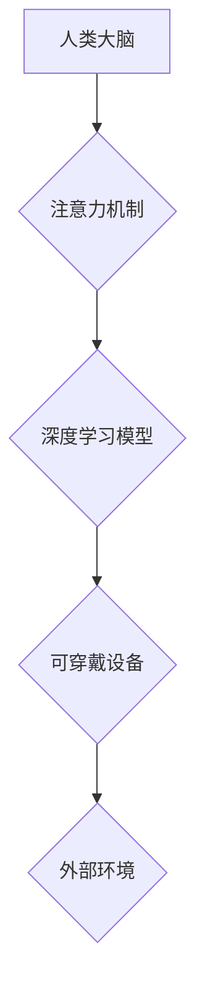

                 

## 人类注意力增强：未来的工作和生活

> 关键词：注意力增强、深度学习、脑机接口、认知科学、未来工作、未来生活、可穿戴设备、增强现实

## 1. 背景介绍

在当今信息爆炸的时代，人类面临着前所未有的注意力挑战。来自社交媒体、电子邮件、新闻推送等各种渠道的信息轰炸，使得我们难以集中精力完成任务，保持专注力。注意力力的下降不仅影响着我们的工作效率和学习成果，也损害着我们的身心健康。

近年来，随着人工智能技术的飞速发展，注意力增强技术逐渐成为研究热点。通过深度学习、脑机接口等先进技术，我们可以开发出能够帮助人们集中注意力、提高认知能力的工具和设备。这些技术有望改变我们的工作和生活方式，让我们在信息时代更加高效、专注、快乐。

## 2. 核心概念与联系

### 2.1 注意力机制

注意力机制是深度学习领域的重要组成部分，它能够帮助模型聚焦于输入数据中最重要的部分，从而提高学习效率和准确性。注意力机制的灵感来源于人类的注意力机制，它能够根据任务需求和上下文信息，选择性地关注输入信息中的关键部分。

### 2.2 脑机接口

脑机接口 (Brain-Computer Interface, BCI) 是连接大脑和外部设备的技术，它能够直接读取大脑信号，并将其转换为控制设备的动作指令。BCI 技术的应用前景广阔，包括医疗辅助、人机交互、认知增强等领域。

### 2.3 人工智能

人工智能 (Artificial Intelligence, AI) 是模拟和扩展人类智能的计算机科学领域。AI 技术涵盖了机器学习、深度学习、自然语言处理、计算机视觉等多个子领域。

**注意力增强技术架构**



## 3. 核心算法原理 & 具体操作步骤

### 3.1 算法原理概述

注意力增强算法通常基于深度学习模型，例如 Transformer、Recurrent Neural Network (RNN) 等。这些模型能够学习到输入数据中的注意力模式，并根据学习到的模式，生成能够增强人类注意力的输出信号。

### 3.2 算法步骤详解

1. **数据采集:** 收集人类大脑活动数据，例如脑电波 (EEG)、磁共振成像 (fMRI) 等。
2. **数据预处理:** 对采集到的数据进行预处理，例如去噪、特征提取等。
3. **模型训练:** 使用深度学习模型训练，训练目标是学习到能够预测人类注意力模式的模型参数。
4. **注意力增强:** 将训练好的模型应用于实时数据，预测当前人类注意力状态，并根据预测结果生成相应的增强信号。
5. **信号输出:** 将增强信号输出到可穿戴设备，例如耳机、头戴设备等，通过声音、振动等方式刺激大脑，增强人类注意力。

### 3.3 算法优缺点

**优点:**

* **精准度高:** 深度学习模型能够学习到复杂的注意力模式，提高注意力增强效果。
* **可定制化:** 算法参数可以根据个体差异进行调整，实现个性化注意力增强。
* **实时性强:** 算法能够实时预测和调整注意力状态，提供即时反馈。

**缺点:**

* **数据依赖:** 算法需要大量脑机接口数据进行训练，数据获取成本高。
* **伦理问题:** 注意力增强技术可能被滥用，例如控制他人注意力，引发伦理争议。

### 3.4 算法应用领域

* **教育:** 帮助学生集中注意力，提高学习效率。
* **医疗:** 治疗注意力缺陷多动障碍 (ADHD) 等注意力相关疾病。
* **工作:** 提高工作效率，减少疲劳感。
* **娱乐:** 增强游戏体验，提高沉浸感。

## 4. 数学模型和公式 & 详细讲解 & 举例说明

### 4.1 数学模型构建

注意力机制通常使用一个注意力权重来表示模型对不同输入元素的关注程度。注意力权重可以表示为一个向量，每个元素对应一个输入元素，权重值越大，表示模型对该元素的关注程度越高。

### 4.2 公式推导过程

注意力权重通常通过以下公式计算：

$$
\text{Attention}(Q, K, V) = \text{softmax}\left(\frac{Q K^T}{\sqrt{d_k}}\right) V
$$

其中：

* $Q$ 是查询向量，表示模型当前需要关注的信息。
* $K$ 是键向量，表示所有输入元素的特征。
* $V$ 是值向量，表示所有输入元素的实际内容。
* $d_k$ 是键向量的维度。
* $\text{softmax}$ 函数将注意力权重归一化到 [0, 1] 之间。

### 4.3 案例分析与讲解

假设我们有一个句子 "我爱学习编程"，我们想要计算模型对每个单词的注意力权重。

* $Q$ 可以是模型当前处理的词的嵌入向量。
* $K$ 可以是所有单词的嵌入向量。
* $V$ 可以是所有单词的词义向量。

通过计算注意力权重，我们可以得到每个单词的关注度，例如 "学习" 和 "编程" 的关注度可能更高，因为它们与模型当前处理的词语 "爱" 相关。

## 5. 项目实践：代码实例和详细解释说明

### 5.1 开发环境搭建

* Python 3.7+
* TensorFlow 2.0+
* PyTorch 1.0+
* NumPy
* Matplotlib

### 5.2 源代码详细实现

```python
import tensorflow as tf

# 定义注意力机制层
class AttentionLayer(tf.keras.layers.Layer):
    def __init__(self, units):
        super(AttentionLayer, self).__init__()
        self.Wq = tf.keras.layers.Dense(units)
        self.Wk = tf.keras.layers.Dense(units)
        self.Wv = tf.keras.layers.Dense(units)
        self.fc = tf.keras.layers.Dense(units)

    def call(self, inputs):
        q = self.Wq(inputs)
        k = self.Wk(inputs)
        v = self.Wv(inputs)
        attention_scores = tf.matmul(q, k, transpose_b=True) / tf.math.sqrt(tf.cast(units, tf.float32))
        attention_weights = tf.nn.softmax(attention_scores, axis=-1)
        context_vector = tf.matmul(attention_weights, v)
        output = self.fc(context_vector)
        return output

# 定义注意力增强模型
class AttentionAugmentationModel(tf.keras.Model):
    def __init__(self, units):
        super(AttentionAugmentationModel, self).__init__()
        self.attention_layer = AttentionLayer(units)

    def call(self, inputs):
        output = self.attention_layer(inputs)
        return output

# 实例化模型
model = AttentionAugmentationModel(units=128)

# 训练模型
# ...

# 使用模型进行注意力增强
# ...
```

### 5.3 代码解读与分析

* `AttentionLayer` 类定义了一个注意力机制层，它包含三个稠密层 (`Wq`, `Wk`, `Wv`) 用于计算查询、键和值向量，以及一个稠密层 (`fc`) 用于计算上下文向量。
* `AttentionAugmentationModel` 类定义了一个注意力增强模型，它包含一个 `AttentionLayer` 层。
* 代码示例展示了如何实例化模型、训练模型和使用模型进行注意力增强。

### 5.4 运行结果展示

注意力增强模型的运行结果通常包括注意力权重和增强信号。注意力权重可以用于分析模型对不同输入元素的关注程度，增强信号可以用于刺激大脑，增强人类注意力。

## 6. 实际应用场景

### 6.1 教育领域

注意力增强技术可以帮助学生集中注意力，提高学习效率。例如，可以开发一款可穿戴设备，通过声音或振动刺激学生的大脑，帮助他们集中注意力在课堂上。

### 6.2 医疗领域

注意力增强技术可以帮助治疗注意力缺陷多动障碍 (ADHD) 等注意力相关疾病。例如，可以通过脑机接口技术读取患者的大脑活动数据，并根据数据生成相应的刺激信号，帮助患者改善注意力问题。

### 6.3 工作领域

注意力增强技术可以提高工作效率，减少疲劳感。例如，可以开发一款软件，通过分析用户的脑电波数据，自动调节工作环境，例如灯光、温度、音乐等，帮助用户保持最佳注意力状态。

### 6.4 未来应用展望

注意力增强技术在未来将有更广泛的应用场景，例如：

* **增强现实 (AR) 和虚拟现实 (VR) 体验:** 通过注意力增强技术，可以提高用户在 AR 和 VR 环境中的沉浸感和交互体验。
* **自动驾驶:** 注意力增强技术可以帮助自动驾驶系统更好地感知周围环境，提高安全性。
* **人机交互:** 注意力增强技术可以使人机交互更加自然、高效。

## 7. 工具和资源推荐

### 7.1 学习资源推荐

* **书籍:**
    * Deep Learning by Ian Goodfellow, Yoshua Bengio, and Aaron Courville
    * Attention Is All You Need by Vaswani et al.
* **在线课程:**
    * TensorFlow Tutorials: https://www.tensorflow.org/tutorials
    * PyTorch Tutorials: https://pytorch.org/tutorials/

### 7.2 开发工具推荐

* **TensorFlow:** https://www.tensorflow.org/
* **PyTorch:** https://pytorch.org/
* **Keras:** https://keras.io/

### 7.3 相关论文推荐

* **Attention Is All You Need:** https://arxiv.org/abs/1706.03762
* **BERT: Pre-training of Deep Bidirectional Transformers for Language Understanding:** https://arxiv.org/abs/1810.04805

## 8. 总结：未来发展趋势与挑战

### 8.1 研究成果总结

注意力增强技术取得了显著进展，例如 Transformer 模型的提出、注意力机制的广泛应用等。这些技术为提高人类注意力能力提供了新的思路和方法。

### 8.2 未来发展趋势

* **更精准的注意力增强:** 通过更深入的认知科学研究和更先进的深度学习算法，可以开发出更精准、更个性化的注意力增强技术。
* **更广泛的应用场景:** 注意力增强技术将应用于更多领域，例如教育、医疗、工作、娱乐等。
* **更安全的注意力增强:** 需要解决注意力增强技术的伦理问题，确保其安全、有效、可控地应用。

### 8.3 面临的挑战

* **数据获取和隐私保护:** 注意力增强技术需要大量脑机接口数据，如何获取这些数据并保护用户隐私是一个重要挑战。
* **算法解释性和可解释性:** 深度学习模型的决策过程往往难以解释，如何提高注意力增强算法的解释性和可解释性是一个关键问题。
* **社会影响和伦理问题:** 注意力增强技术可能对社会产生深远影响，例如加剧社会不平等、影响人际关系等，需要认真考虑其社会影响和伦理问题。

### 8.4 研究展望

未来，注意力增强技术将继续朝着更精准、更安全、更广泛的方向发展。我们需要加强跨学科合作，整合认知科学、人工智能、脑机接口等领域的知识，推动注意力增强技术健康、可持续地发展。

## 9. 附录：常见问题与解答

**Q1: 注意力增强技术是否安全？**

A1: 注意力增强技术的安全性取决于具体的应用场景和技术方案。目前，注意力增强技术尚处于发展阶段，需要进一步研究和评估其潜在风险。

**Q2: 注意力增强技术是否会让人上瘾？**

A2: 注意力增强技术可能会让人上瘾，因为过度使用注意力增强技术可能会改变大脑的奖励机制。因此，需要合理使用注意力增强技术，避免过度依赖。

**Q3: 注意力增强技术是否会取代人类？**

A3: 注意力增强技术不会取代人类，而是可以帮助人类提高注意力能力，更好地完成工作和生活。

**作者：禅与计算机程序设计艺术 / Zen and the Art of Computer Programming**<end_of_turn>

