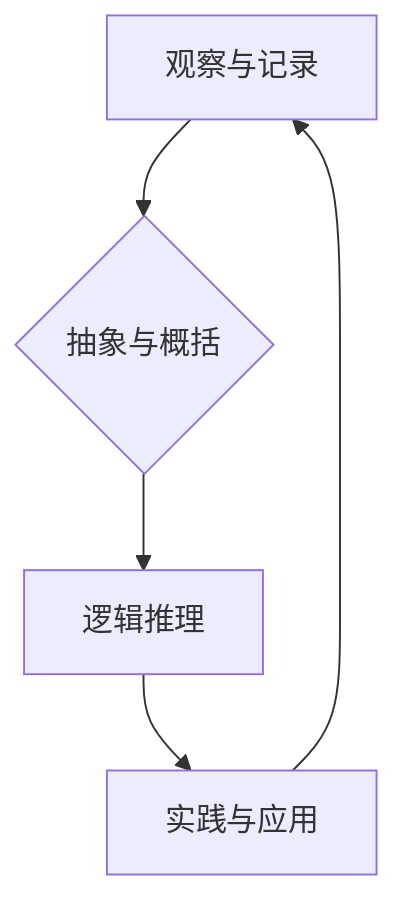

                 

## 人类知识的传承之美：古文明的启示

> 关键词：古文明、知识传承、算法、数学模型、软件架构、人工智能、历史启示

### 1. 背景介绍

在瞬息万变的科技时代，我们常常被新兴技术和概念所震撼。然而，当我们回望历史长河，不难发现，人类文明的进步并非偶然，而是在古文明智慧的传承和积淀之上。古文明，以其独特的文化和科技成就，为后世留下了宝贵的遗产，其中蕴含着深刻的知识传承智慧，值得我们认真探究和借鉴。

从古代埃及的象形文字到古希腊的数学几何，从古罗马的工程建筑到中国古代的算盘和天文学，这些文明都留下了令人惊叹的科技成果。这些成果并非凭空而来，而是基于对自然规律的观察、思考和探索，并通过代代相传的方式不断完善和发展。

现代科技的飞速发展，也离不开对古文明智慧的汲取和借鉴。例如，人工智能领域的许多算法和模型，都受到了古希腊逻辑学和中国古代哲学的启发。软件架构设计中的一些原则，也源于古罗马工程建筑的经验和教训。

### 2. 核心概念与联系

古文明的知识传承，本质上是一种信息传递和积累的过程。它涉及到以下几个核心概念：

* **观察与记录:** 古代人通过对自然现象和社会生活的观察，记录下自己的发现和理解。
* **抽象与概括:**  人们将观察到的现象进行抽象和概括，形成概念和理论。
* **逻辑推理:** 古代人运用逻辑推理的方法，推导新的知识和规律。
* **实践与应用:**  知识的最终目的是应用于实践，解决实际问题。

这些概念相互关联，共同构成了古文明知识传承的体系。

**Mermaid 流程图:**



### 3. 核心算法原理 & 具体操作步骤

古文明虽然没有现代计算机和算法的概念，但他们也发展了各种各样的算法和计算方法，例如：

* **埃及分数算法:** 古埃及人使用分数来表示数量，并发展了加减乘除分数的算法。
* **巴比伦乘法算法:** 巴比伦人使用一种类似于现代的乘法算法，通过反复加法来计算乘积。
* **中国古代算盘算法:** 中国古代的算盘是一种独特的计算工具，通过珠子的移动来进行加减乘除运算。

这些算法虽然简单，但它们体现了古人对数学和逻辑的深刻理解，为后世算法的发展奠定了基础。

#### 3.1 算法原理概述

古文明的算法原理主要基于以下几个方面：

* **观察和经验:** 古代人通过对自然现象和社会生活的观察，积累了大量的经验，并将其转化为算法。
* **逻辑推理:** 古代人运用逻辑推理的方法，推导新的算法和计算方法。
* **反复实践:** 古代人通过反复实践，不断完善和改进算法。

#### 3.2 算法步骤详解

以埃及分数算法为例，其步骤如下：

1. 将一个分数表示为两个整数的比值。
2. 将分子和分母分别分解成质因数。
3. 将分子和分母的质因数进行组合，得到新的分数。
4. 重复步骤2和3，直到得到最简分数。

#### 3.3 算法优缺点

古文明的算法虽然在当时具有很高的实用价值，但它们也存在一些局限性：

* **效率低:** 古代算法的计算效率相对较低，需要大量的重复计算。
* **适用范围窄:** 古代算法主要适用于简单的计算，难以处理复杂的数学问题。
* **缺乏抽象性:** 古代算法缺乏抽象性，难以推广到其他领域。

#### 3.4 算法应用领域

古文明的算法在当时广泛应用于以下领域：

* **农业:** 计算播种时间、收成量等。
* **贸易:** 计算商品价格、利润等。
* **建筑:** 计算建筑材料、尺寸等。
* **天文:** 计算日历、星体位置等。

### 4. 数学模型和公式 & 详细讲解 & 举例说明

古文明对数学的探索和发展，为后世留下了许多重要的数学模型和公式。例如：

#### 4.1 数学模型构建

古希腊数学家毕达哥拉斯发现了著名的毕达哥拉斯定理，它描述了直角三角形的边长之间的关系。

$$a^2 + b^2 = c^2$$

其中，a和b是直角三角形的两条直角边，c是斜边。

#### 4.2 公式推导过程

毕达哥拉斯定理的推导过程可以利用几何图形和逻辑推理来完成。

#### 4.3 案例分析与讲解

毕达哥拉斯定理在建筑、工程、导航等领域都有广泛的应用。例如，在建造高楼大厦时，工程师可以使用毕达哥拉斯定理来计算斜梁的长度和角度。

### 5. 项目实践：代码实例和详细解释说明

现代编程语言可以用来实现古文明的算法，例如，我们可以用Python语言实现埃及分数算法：

#### 5.1 开发环境搭建

可以使用任何支持Python语言的开发环境，例如PyCharm、VS Code等。

#### 5.2 源代码详细实现

```python
def simplify_fraction(numerator, denominator):
  """
  简化分数
  """
  gcd = find_gcd(numerator, denominator)
  return numerator // gcd, denominator // gcd

def find_gcd(a, b):
  """
  使用欧几里德算法求最大公约数
  """
  while b:
    a, b = b, a % b
  return a

# 示例用法
numerator = 12
denominator = 18
simplified_numerator, simplified_denominator = simplify_fraction(numerator, denominator)
print(f"{numerator}/{denominator} 简化为 {simplified_numerator}/{simplified_denominator}")
```

#### 5.3 代码解读与分析

这段代码首先定义了一个`simplify_fraction`函数，用于简化分数。该函数使用`find_gcd`函数计算分子和分母的最大公约数，然后将分子和分母分别除以最大公约数，得到最简分数。

`find_gcd`函数使用欧几里德算法来计算最大公约数。欧几里德算法是一种迭代算法，通过不断求余，最终得到两个数的最大公约数。

#### 5.4 运行结果展示

运行这段代码，输出结果为：

```
12/18 简化为 2/3
```

### 6. 实际应用场景

古文明的知识传承对现代科技发展具有深远的影响。例如：

* **人工智能:** 人工智能领域的许多算法和模型，都受到了古希腊逻辑学和中国古代哲学的启发。
* **软件架构:** 软件架构设计中的一些原则，也源于古罗马工程建筑的经验和教训。
* **数据科学:** 古代人对数据的收集、整理和分析，为现代数据科学的发展奠定了基础。

### 6.4 未来应用展望

随着科技的不断发展，古文明的知识传承将继续为我们提供新的启示和灵感。例如：

* **跨学科融合:** 古文明的知识体系跨越了多个学科，我们可以借鉴这种跨学科融合的模式，促进科技创新。
* **文化传承:** 古文明的文化遗产是人类宝贵的财富，我们可以通过技术手段，更好地传承和弘扬这些文化。
* **可持续发展:** 古文明对自然环境的认识和利用，为我们提供了可持续发展的启示。

### 7. 工具和资源推荐

#### 7.1 学习资源推荐

* **书籍:** 《人类知识的传承》、《古希腊数学史》、《中国古代数学史》
* **网站:** Khan Academy、MIT OpenCourseWare、Coursera

#### 7.2 开发工具推荐

* **Python:** PyCharm、VS Code
* **数据分析工具:** Pandas、NumPy、Scikit-learn

#### 7.3 相关论文推荐

* **人工智能:** 《深度学习》、《强化学习》
* **软件架构:** 《设计模式》、《软件工程》

### 8. 总结：未来发展趋势与挑战

古文明的知识传承为人类文明的发展做出了巨大贡献。现代科技的发展离不开对古文明智慧的汲取和借鉴。

#### 8.1 研究成果总结

* 古文明的算法和数学模型为现代科技发展奠定了基础。
* 古文明的知识体系跨越了多个学科，为跨学科融合提供了启示。
* 古文明的文化遗产是人类宝贵的财富，值得我们传承和弘扬。

#### 8.2 未来发展趋势

* 随着科技的不断发展，古文明的知识传承将继续为我们提供新的启示和灵感。
* 跨学科融合将成为未来科技发展的趋势，古文明的知识体系为这种融合提供了借鉴。
* 文化传承将更加注重科技手段的应用，更好地弘扬古文明的文化遗产。

#### 8.3 面临的挑战

* 如何更好地挖掘和整理古文明的知识遗产？
* 如何将古文明的智慧与现代科技相结合？
* 如何更好地传承和弘扬古文明的文化遗产？

#### 8.4 研究展望

未来，我们将继续深入研究古文明的知识传承，探索其对现代科技发展的启示，并将其应用于实际问题，为人类文明的进步做出新的贡献。

### 9. 附录：常见问题与解答

* **Q1: 古文明的知识传承与现代科技发展有什么关系？**

**A1:** 古文明的知识传承为现代科技发展奠定了基础，许多现代科技成果都受到了古文明智慧的启发。

* **Q2: 如何更好地学习古文明的知识？**

**A2:** 可以阅读相关书籍、网站和论文，并参加相关的课程和讲座。

* **Q3: 古文明的知识传承有哪些挑战？**

**A3:** 挑战包括如何更好地挖掘和整理古文明的知识遗产，如何将古文明的智慧与现代科技相结合，以及如何更好地传承和弘扬古文明的文化遗产。


作者：禅与计算机程序设计艺术 / Zen and the Art of Computer Programming 
<end_of_turn>

