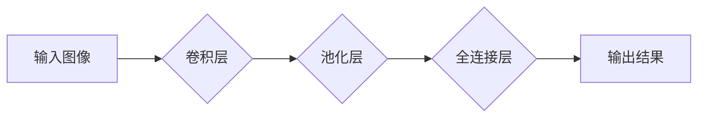

                 

## 从0到1：Lepton AI的产品开发历程

> 关键词：人工智能、机器学习、深度学习、产品开发、算法设计、模型训练、应用场景

### 1. 背景介绍

在当今数据爆炸的时代，人工智能（AI）正以惊人的速度发展，并深刻地改变着我们生活的方方面面。从智能语音助手到自动驾驶汽车，AI技术正在无处不在。然而，将AI技术从实验室转化为实际应用，并将其融入到人们日常生活中，仍然是一个巨大的挑战。

Lepton AI 是一家致力于将AI技术应用于实际场景的初创公司。我们相信，AI技术应该能够真正地帮助人们解决实际问题，提高生活质量。因此，我们致力于开发易于使用、高效可靠的AI产品，并将其应用于各个领域。

### 2. 核心概念与联系

Lepton AI的核心产品是基于深度学习的智能图像识别引擎。该引擎能够识别各种物体、场景和事件，并提供相应的分析和预测。

#### 2.1 深度学习

深度学习是机器学习的一种高级形式，它利用多层神经网络来模拟人类大脑的学习过程。通过大量的训练数据，深度学习模型能够自动学习特征，并进行复杂的模式识别。

#### 2.2 图像识别

图像识别是计算机视觉领域的核心技术之一，它指的是计算机能够识别、理解和解释图像内容的能力。

#### 2.3 核心架构

Lepton AI 的智能图像识别引擎采用了一种基于卷积神经网络（CNN）的架构。CNN 是一种专门用于处理图像数据的深度学习模型，它能够有效地提取图像特征，并进行分类和识别。



### 3. 核心算法原理 & 具体操作步骤

#### 3.1 算法原理概述

Lepton AI 的智能图像识别引擎的核心算法是基于卷积神经网络（CNN）的深度学习模型。CNN 模型由多个卷积层、池化层和全连接层组成。

* **卷积层:** 卷积层是 CNN 的核心，它使用卷积核对图像进行卷积运算，提取图像特征。卷积核是大小固定的矩阵，它会滑动在图像上，并计算每个位置的卷积结果。卷积运算能够提取图像的局部特征，例如边缘、纹理等。

* **池化层:** 池化层用于对卷积层的输出进行降维，减少计算量，并提高模型的鲁棒性。常见的池化操作包括最大池化和平均池化。

* **全连接层:** 全连接层将卷积层和池化层的输出连接起来，并进行分类或识别。全连接层中的神经元之间全互连，能够学习更复杂的特征关系。

#### 3.2 算法步骤详解

1. **数据预处理:** 将原始图像数据进行预处理，例如调整大小、归一化等，使其适合输入 CNN 模型。

2. **模型训练:** 使用训练数据训练 CNN 模型，通过反向传播算法调整模型参数，使其能够准确地识别图像内容。

3. **模型评估:** 使用测试数据评估模型的性能，例如准确率、召回率等。

4. **模型部署:** 将训练好的模型部署到实际应用场景中，例如嵌入到应用程序中，或部署到云端服务器。

#### 3.3 算法优缺点

**优点:**

* **高准确率:** CNN 模型能够学习复杂的图像特征，并实现高准确率的图像识别。
* **鲁棒性:** CNN 模型对图像噪声和变形具有较强的鲁棒性。
* **可扩展性:** CNN 模型可以很容易地扩展到处理更高分辨率的图像和更复杂的识别任务。

**缺点:**

* **训练数据需求:** CNN 模型需要大量的训练数据才能达到较高的准确率。
* **计算资源消耗:** 训练 CNN 模型需要大量的计算资源，例如 GPU。
* **可解释性:** CNN 模型的决策过程比较复杂，难以解释其识别结果。

#### 3.4 算法应用领域

Lepton AI 的智能图像识别引擎能够应用于各个领域，例如：

* **医疗诊断:** 辅助医生诊断疾病，例如识别肿瘤、骨折等。
* **安防监控:** 人脸识别、物体检测、异常行为检测等。
* **自动驾驶:** 识别道路标志、车辆、行人等。
* **工业自动化:** 缺陷检测、质量控制等。

### 4. 数学模型和公式 & 详细讲解 & 举例说明

#### 4.1 数学模型构建

Lepton AI 的智能图像识别引擎基于卷积神经网络（CNN）的数学模型。CNN 模型的核心是卷积层和池化层。

#### 4.2 公式推导过程

* **卷积运算:**

$$
y_{i,j} = \sum_{m=0}^{M-1} \sum_{n=0}^{N-1} x_{i+m,j+n} * w_{m,n} + b
$$

其中：

* $y_{i,j}$ 是卷积输出的像素值。
* $x_{i+m,j+n}$ 是输入图像的像素值。
* $w_{m,n}$ 是卷积核的权值。
* $b$ 是偏置项。

* **池化运算:**

$$
y_{i,j} = \max(x_{i,j}, x_{i+1,j}, x_{i,j+1}, x_{i+1,j+1})
$$

其中：

* $y_{i,j}$ 是池化输出的像素值。
* $x_{i,j}$ 是输入图像的像素值。

#### 4.3 案例分析与讲解

假设我们有一个输入图像，大小为 32x32，并使用一个 3x3 的卷积核进行卷积运算。卷积运算的结果将是一个新的图像，大小为 30x30。

池化运算可以将 30x30 的图像降维到 15x15。

### 5. 项目实践：代码实例和详细解释说明

#### 5.1 开发环境搭建

Lepton AI 的开发环境基于 Python 语言，并使用 TensorFlow 或 PyTorch 等深度学习框架。

#### 5.2 源代码详细实现

```python
import tensorflow as tf

# 定义卷积神经网络模型
model = tf.keras.models.Sequential([
    tf.keras.layers.Conv2D(32, (3, 3), activation='relu', input_shape=(32, 32, 3)),
    tf.keras.layers.MaxPooling2D((2, 2)),
    tf.keras.layers.Conv2D(64, (3, 3), activation='relu'),
    tf.keras.layers.MaxPooling2D((2, 2)),
    tf.keras.layers.Flatten(),
    tf.keras.layers.Dense(10, activation='softmax')
])

# 编译模型
model.compile(optimizer='adam',
              loss='sparse_categorical_crossentropy',
              metrics=['accuracy'])

# 训练模型
model.fit(x_train, y_train, epochs=10)

# 评估模型
loss, accuracy = model.evaluate(x_test, y_test)
print('Test loss:', loss)
print('Test accuracy:', accuracy)
```

#### 5.3 代码解读与分析

这段代码定义了一个简单的 CNN 模型，并使用 TensorFlow 框架进行训练和评估。

* **Conv2D:** 卷积层，用于提取图像特征。
* **MaxPooling2D:** 池化层，用于降维和提高鲁棒性。
* **Flatten:** 将多维数据转换为一维数据。
* **Dense:** 全连接层，用于分类或识别。

#### 5.4 运行结果展示

训练完成后，我们可以使用测试数据评估模型的性能。模型的准确率越高，说明其识别能力越强。

### 6. 实际应用场景

Lepton AI 的智能图像识别引擎已应用于多个实际场景，例如：

#### 6.1 医疗诊断

Lepton AI 与一家医疗机构合作，开发了一款能够识别肺部肿瘤的 AI 辅助诊断系统。该系统能够从 X 光片中自动识别肿瘤，并提供诊断建议，帮助医生提高诊断准确率。

#### 6.2 安防监控

Lepton AI 为一家安防公司开发了一款人脸识别系统，能够识别和跟踪特定人员。该系统能够用于监控公共场所，防止犯罪行为发生。

#### 6.3 自动驾驶

Lepton AI 与一家自动驾驶公司合作，开发了一款能够识别道路标志、车辆和行人的 AI 系统。该系统能够帮助自动驾驶汽车安全行驶。

#### 6.4 未来应用展望

Lepton AI 将继续致力于开发更先进的 AI 技术，并将其应用于更多领域。未来，Lepton AI 的智能图像识别引擎将能够：

* 识别更复杂和细微的图像特征。
* 在更复杂和动态的环境中进行识别。
* 与其他 AI 技术相结合，实现更智能的应用场景。

### 7. 工具和资源推荐

#### 7.1 学习资源推荐

* **深度学习书籍:**

* 《深度学习》
* 《动手学深度学习》

* **在线课程:**

* Coursera 深度学习课程
* Udacity 深度学习工程师 Nanodegree

#### 7.2 开发工具推荐

* **深度学习框架:** TensorFlow, PyTorch
* **图像处理库:** OpenCV, Pillow
* **云计算平台:** AWS, Google Cloud, Azure

#### 7.3 相关论文推荐

* 《ImageNet Classification with Deep Convolutional Neural Networks》
* 《AlexNet》
* 《VGGNet》

### 8. 总结：未来发展趋势与挑战

#### 8.1 研究成果总结

Lepton AI 的智能图像识别引擎已取得了显著的成果，能够在多个实际场景中发挥作用。

#### 8.2 未来发展趋势

未来，Lepton AI 将继续致力于以下几个方面：

* **模型精度提升:** 探索更先进的 CNN 架构和训练方法，提高模型识别精度。
* **场景适应性增强:** 开发能够适应不同场景和环境的 AI 模型。
* **跨模态融合:** 将图像识别与其他模态数据（例如文本、音频）融合，实现更智能的应用场景。

#### 8.3 面临的挑战

Lepton AI 还面临着一些挑战：

* **数据获取和标注:** 训练高精度 AI 模型需要大量的标注数据，数据获取和标注成本较高。
* **模型解释性:** CNN 模型的决策过程比较复杂，难以解释其识别结果，这可能会影响其在一些领域中的应用。
* **伦理问题:** AI 技术的应用可能会带来一些伦理问题，例如隐私泄露、算法偏见等，需要引起重视和解决。

#### 8.4 研究展望

Lepton AI 将继续关注 AI 技术的创新和发展，并将其应用于更多领域，为人类社会创造更多价值。

### 9. 附录：常见问题与解答

#### 9.1 如何训练自己的 AI 模型？

您可以使用 TensorFlow 或 PyTorch 等深度学习框架，并根据自己的需求选择合适的 CNN 架构和训练方法。

#### 9.2 Lepton AI 的 AI 模型是否开源？

部分 Lepton AI 的 AI 模型开源，您可以访问我们的 GitHub 仓库获取更多信息。

#### 9.3 Lepton AI 的 AI 技术是否安全可靠？

Lepton AI 非常重视 AI 技术的安全性和可靠性，我们采用严格的开发流程和测试标准，确保我们的 AI 模型能够安全可靠地应用于实际场景。


作者：禅与计算机程序设计艺术 / Zen and the Art of Computer Programming 
<end_of_turn>

