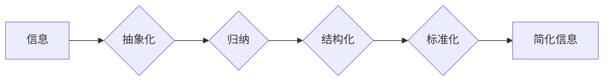

                 

## 信息简化的原则与实践：在混乱中建立秩序与简化

> 关键词：信息简化、复杂系统、算法设计、数据结构、软件架构、代码优化、可读性、可维护性

### 1. 背景介绍

在当今信息爆炸的时代，我们每天都面临着海量的信息冲击。从新闻资讯到社交媒体，从学术论文到代码库，信息无处不在，却并非都具有价值。如何有效地从信息洪流中筛选出真正有用的信息，并将其简化成易于理解和操作的形式，已成为一个至关重要的挑战。

对于软件开发人员而言，信息简化更是至关重要。复杂的软件系统往往由数百万行代码组成，涉及到各种各样的模块、组件和接口。如果代码结构混乱、逻辑冗余，将会导致难以维护、难以扩展、难以理解，最终影响软件的质量和效率。

因此，掌握信息简化的原则和实践，对于软件开发人员来说至关重要。它不仅可以帮助我们编写更简洁、更易于理解的代码，还可以提高软件的可靠性和可维护性，最终提升软件开发的效率和质量。

### 2. 核心概念与联系

信息简化本质上是一种将复杂的信息转化为简单易懂形式的过程，它涉及到多个方面，包括：

* **抽象化**: 将复杂系统中的细节隐藏起来，只保留必要的关键信息。
* **归纳**: 从大量数据中提取出规律和模式，形成简洁的总结。
* **结构化**: 将信息按照一定的逻辑顺序排列，使其更加清晰易懂。
* **标准化**: 使用统一的格式和规范来表示信息，提高信息的互操作性和可读性。

这些概念相互关联，共同构成了信息简化的框架。

**Mermaid 流程图**



### 3. 核心算法原理 & 具体操作步骤

信息简化算法的核心在于如何高效地提取和组织信息，并将其转化为简洁易懂的形式。以下是一些常用的信息简化算法：

#### 3.1  算法原理概述

* **数据压缩算法**: 

通过利用数据冗余性，将数据以更紧凑的形式存储和传输。常见的压缩算法包括Huffman编码、Lempel-Ziv算法和DEFLATE算法。

* **聚类算法**: 

将具有相似特征的数据点分组在一起，从而将复杂的数据集简化成多个类别。常见的聚类算法包括K-means算法、层次聚类算法和DBSCAN算法。

* **主题模型**: 

通过统计文本中的词语共现关系，识别出文本中的潜在主题，并将其作为信息简化的基础。常见的主题模型包括Latent Dirichlet Allocation (LDA)模型和Non-negative Matrix Factorization (NMF)模型。

#### 3.2  算法步骤详解

以数据压缩算法为例，其基本步骤如下：

1. **数据分析**: 对待压缩的数据进行分析，识别出数据中的冗余性和模式。
2. **符号分配**: 为数据中的常见元素分配更短的符号，而对于不常见的元素分配更长的符号。
3. **编码**: 使用分配好的符号对数据进行编码，形成压缩后的数据流。
4. **解码**: 在接收端使用相同的符号表对压缩数据进行解码，恢复原始数据。

#### 3.3  算法优缺点

* **数据压缩算法**: 优点是能够显著减少数据存储空间和传输带宽，缺点是压缩和解压缩过程需要一定的计算资源。
* **聚类算法**: 优点是能够将复杂的数据集简化成多个类别，方便进行分析和处理，缺点是聚类结果的准确性依赖于算法的选择和参数设置。
* **主题模型**: 优点是能够识别出文本中的潜在主题，为信息提取和分类提供新的思路，缺点是需要大量的训练数据，并且主题模型的解释性相对较弱。

#### 3.4  算法应用领域

信息简化算法广泛应用于各个领域，例如：

* **数据存储和传输**: 数据压缩算法用于压缩文件、图像、视频等数据，减少存储空间和传输带宽。
* **机器学习**: 聚类算法和主题模型用于数据分析、模式识别和信息提取。
* **自然语言处理**: 主题模型和文本摘要算法用于文本分类、信息抽取和机器翻译。
* **软件开发**: 代码压缩和代码重构技术用于简化代码结构，提高代码可读性和可维护性。

### 4. 数学模型和公式 & 详细讲解 & 举例说明

信息简化算法的原理和实现往往基于一定的数学模型和公式。以下是一些常见的数学模型和公式：

#### 4.1  数学模型构建

* **信息熵**: 信息熵是衡量信息不确定性的度量，其公式为：

$$H(X) = - \sum_{i=1}^{n} p(x_i) \log_2 p(x_i)$$

其中，$X$ 是随机变量，$x_i$ 是 $X$ 的取值，$p(x_i)$ 是 $x_i$ 的概率。

* **互信息**: 互信息度量两个随机变量之间的相关性，其公式为：

$$I(X;Y) = H(X) - H(X|Y)$$

其中，$H(X|Y)$ 是给定 $Y$ 的条件下 $X$ 的信息熵。

#### 4.2  公式推导过程

* **Huffman编码**: Huffman编码是一种基于信息熵的压缩算法，其原理是为出现频率较高的符号分配更短的编码，而为出现频率较低的符号分配更长的编码。

Huffman编码的推导过程涉及到构建Huffman树和分配编码的过程。

* **K-means聚类**: K-means聚类是一种基于距离的聚类算法，其原理是将数据点划分为 $K$ 个簇，使得每个簇内的点尽可能接近，而不同簇之间的点尽可能远离。

K-means聚类的推导过程涉及到选择初始的聚类中心、计算每个点到各个聚类中心的距离、将每个点分配到距离最近的聚类中心、更新聚类中心的坐标等步骤。

#### 4.3  案例分析与讲解

* **文本压缩**: 使用Huffman编码对文本进行压缩，可以显著减少文本的大小，例如，压缩后的文本文件大小可以减少到原始文件大小的50%甚至更少。
* **图像识别**: 使用K-means聚类对图像进行分割，可以将图像划分为不同的区域，例如，将图像中的前景和背景进行分离。

### 5. 项目实践：代码实例和详细解释说明

以下是一个使用Python语言实现的简单数据压缩算法的代码实例：

#### 5.1  开发环境搭建

* Python 3.x 环境

#### 5.2  源代码详细实现

```python
from collections import Counter

def huffman_encode(text):
    # 统计字符频率
    char_counts = Counter(text)
    # 根据频率构建Huffman树
    # ...
    # 生成编码表
    # ...
    # 对文本进行编码
    encoded_text = ""
    for char in text:
        encoded_text += code[char]
    return encoded_text

def huffman_decode(encoded_text, tree):
    # 根据Huffman树解码文本
    # ...

# 示例使用
text = "hello world"
encoded_text = huffman_encode(text)
decoded_text = huffman_decode(encoded_text, tree)
print(f"原始文本: {text}")
print(f"压缩文本: {encoded_text}")
print(f"解码文本: {decoded_text}")
```

#### 5.3  代码解读与分析

* `huffman_encode(text)` 函数实现文本压缩功能，首先统计字符频率，然后构建Huffman树，生成编码表，最后对文本进行编码。
* `huffman_decode(encoded_text, tree)` 函数实现文本解码功能，根据Huffman树对编码文本进行解码。

#### 5.4  运行结果展示

运行上述代码，可以得到原始文本、压缩文本和解码文本的输出结果。

### 6. 实际应用场景

信息简化技术在各个领域都有着广泛的应用场景：

* **软件开发**: 代码简化、数据结构优化、算法设计等，可以提高软件的效率、可读性和可维护性。
* **数据分析**: 数据压缩、聚类分析、主题模型等，可以帮助我们从海量数据中提取出有价值的信息。
* **网络通信**: 数据压缩、路由优化等，可以提高网络传输效率和可靠性。
* **人机交互**: 自然语言处理、语音识别等，可以使人与计算机的交互更加自然流畅。

### 6.4  未来应用展望

随着信息技术的不断发展，信息简化技术将发挥越来越重要的作用。未来，信息简化技术可能会在以下方面得到进一步发展：

* **人工智能**: 利用人工智能技术，实现更加智能的信息简化算法，例如，自动生成代码注释、自动进行数据归纳和总结等。
* **边缘计算**: 将信息简化技术应用于边缘计算场景，例如，对传感器数据进行实时简化，降低数据传输量和处理负担。
* **可穿戴设备**: 将信息简化技术应用于可穿戴设备，例如，对健康数据进行简化，提供更加直观的健康信息展示。

### 7. 工具和资源推荐

#### 7.1  学习资源推荐

* **书籍**:
    * 《信息简化》
    * 《算法导论》
    * 《数据结构与算法分析》
* **在线课程**:
    * Coursera: 数据结构与算法
    * edX: 算法设计与分析
    * Udacity: 机器学习工程师

#### 7.2  开发工具推荐

* **编程语言**: Python, Java, C++
* **数据结构与算法库**: NumPy, Pandas, Scikit-learn
* **版本控制系统**: Git

#### 7.3  相关论文推荐

* **信息熵**: Shannon, C. E. (1948). A mathematical theory of communication. Bell System Technical Journal, 27(3), 379-423.
* **互信息**: Cover, T. M., & Thomas, J. A. (2006). Elements of information theory. John Wiley & Sons.
* **Huffman编码**: Huffman, D. A. (1952). A method for the construction of minimum redundancy codes. Proceedings of the IRE, 40(9), 1098-1101.
* **K-means聚类**: Lloyd, S. (1982). Least squares quantization in PCM. IEEE Transactions on Information Theory, 28(4), 49-60.

### 8. 总结：未来发展趋势与挑战

信息简化技术在信息时代具有重要的意义，它可以帮助我们更好地理解和处理信息，提高信息利用效率。未来，信息简化技术将继续发展，并应用于更多领域。

#### 8.1  研究成果总结

* 算法效率的提升
* 算法的自动化和智能化
* 跨领域的信息简化方法

#### 8.2  未来发展趋势

* **深度学习**: 利用深度学习技术，实现更加智能的信息简化算法，例如，自动生成代码注释、自动进行数据归纳和总结等。
* **联邦学习**: 将信息简化技术应用于联邦学习场景，例如，对用户隐私数据进行简化，保护用户隐私安全。
* **可解释性**: 提高信息简化算法的可解释性，使算法的决策过程更加透明和可理解。

#### 8.3  面临的挑战

* **数据质量**: 信息简化算法的性能依赖于数据质量，如何处理噪声数据和不完整数据是一个挑战。
* **算法复杂度**: 一些信息简化算法的复杂度较高，需要更高效的算法设计和实现。
* **伦理问题**: 信息简化技术可能会带来一些伦理问题，例如，信息失真、隐私泄露等，需要谨慎考虑和解决。

#### 8.4  研究展望

未来，信息简化技术将继续朝着更加智能、高效、可解释的方向发展，并应用于更多领域，为人类社会带来更多价值。

### 9. 附录：常见问题与解答

* **Q1**: 信息简化算法有哪些？
* **A1**: 常见的算法包括数据压缩算法、聚类算法、主题模型等。
* **Q2**: 信息简化算法的应用场景有哪些？
* **A2**: 信息简化算法广泛应用于软件开发、数据分析、网络通信、人机交互等领域。
* **Q3**: 如何选择合适的算法？
* **A3**: 选择算法需要根据具体应用场景和数据特点进行考虑。


作者：禅与计算机程序设计艺术 / Zen and the Art of Computer Programming<end_of_turn>

