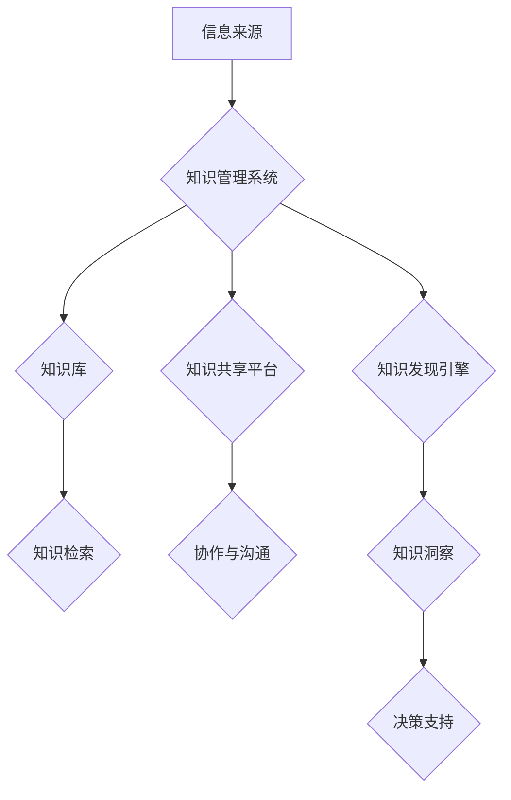

                 

## 信息过载与知识管理系统实施：管理和组织信息以提高生产力

> 关键词：信息过载、知识管理系统、知识组织、信息检索、人工智能、数据分析、生产力提升

### 1. 背景介绍

在当今信息爆炸的时代，我们每天接触的海量信息呈指数级增长。从新闻资讯到学术论文，从社交媒体到专业文档，信息无处不在，却并非全部都是有价值的。面对如此庞大的信息洪流，人们常常感到信息过载，难以有效地获取所需信息，从而影响工作效率和生活质量。

信息过载的现象已经成为现代社会普遍面临的挑战。它不仅困扰着个人，也给企业和组织带来了巨大的压力。企业需要快速获取和处理大量信息，才能做出明智的决策，保持竞争优势。然而，信息过载会导致决策迟缓、资源浪费、甚至错误决策。

为了应对信息过载的挑战，知识管理系统 (KMS)应运而生。KMS是一种旨在帮助组织收集、存储、组织、共享和利用知识的系统。它通过提供高效的信息检索、知识发现和知识共享机制，帮助组织成员更好地管理和利用知识资源，从而提高工作效率和决策质量。

### 2. 核心概念与联系

**2.1 核心概念**

* **信息过载:** 指个人或组织在短时间内接收和处理的信息量超过其处理能力，导致信息消化不良、难以有效利用的现象。
* **知识管理系统 (KMS):** 一种旨在帮助组织收集、存储、组织、共享和利用知识的系统。
* **知识:** 指个人或组织通过经验、学习和实践积累的，能够解决问题、创造价值的非显性资产。
* **知识管理:** 指组织通过系统化的方法和工具，管理和利用知识资源，以提高组织的竞争力。

**2.2 架构图**



**2.3 联系**

信息过载是KMS产生的背景和需求。KMS通过提供高效的信息管理和知识共享机制，帮助组织应对信息过载的挑战，提高知识利用效率。

### 3. 核心算法原理 & 具体操作步骤

**3.1 算法原理概述**

KMS的核心算法主要包括信息分类、知识提取、知识表示和知识检索等。这些算法利用自然语言处理、机器学习和数据挖掘等技术，对海量信息进行分析和处理，从而实现知识的组织、存储和检索。

**3.2 算法步骤详解**

1. **信息采集:** 从各种信息来源收集数据，例如文档、网站、数据库等。
2. **数据预处理:** 对收集到的数据进行清洗、格式化和转换，去除噪声和冗余信息，使其符合算法处理要求。
3. **信息分类:** 利用机器学习算法对数据进行分类，将信息归类到不同的主题或类别。
4. **知识提取:** 从文本数据中提取关键信息，例如实体、关系、事件等，构建知识图谱。
5. **知识表示:** 将提取的知识以结构化的形式表示，例如知识图谱、语义网络等。
6. **知识检索:** 利用搜索引擎、知识图谱查询等技术，根据用户查询需求，快速检索相关知识。

**3.3 算法优缺点**

* **优点:** 能够自动处理海量信息，提高知识发现和检索效率。
* **缺点:** 算法的准确性依赖于训练数据质量，需要不断优化和改进算法模型。

**3.4 算法应用领域**

* **企业知识管理:** 帮助企业收集、存储和共享员工知识，提高知识利用效率。
* **学术研究:** 帮助学者快速检索和分析相关文献，加速科研成果的产生。
* **医疗诊断:** 帮助医生快速检索患者病历和医学知识，提高诊断准确率。

### 4. 数学模型和公式 & 详细讲解 & 举例说明

**4.1 数学模型构建**

KMS中的知识表示通常采用图论模型，例如知识图谱。知识图谱由实体和关系组成，实体代表事物或概念，关系代表事物之间的联系。

**4.2 公式推导过程**

* **实体相似度计算:** 利用向量空间模型或嵌入技术，计算实体之间的语义相似度。

$$
Sim(e_1, e_2) = \frac{e_1 \cdot e_2}{||e_1|| ||e_2||}
$$

其中，$e_1$ 和 $e_2$ 是两个实体的向量表示，$ \cdot $ 表示点积，$||e_1||$ 和 $||e_2||$ 分别表示 $e_1$ 和 $e_2$ 的模长。

* **关系强度计算:** 利用路径长度、节点度等指标，计算实体之间关系的强度。

$$
Strength(r) = \frac{1}{PathLength(e_1, e_2, r)} \cdot Degree(e_1) \cdot Degree(e_2)
$$

其中，$PathLength(e_1, e_2, r)$ 是实体 $e_1$ 和 $e_2$ 之间通过关系 $r$ 的最短路径长度，$Degree(e_1)$ 和 $Degree(e_2)$ 分别表示 $e_1$ 和 $e_2$ 的度数。

**4.3 案例分析与讲解**

假设我们有一个知识图谱，包含实体 "苹果"、"香蕉" 和 "水果"，以及关系 "是"。我们可以利用上述公式计算 "苹果" 和 "香蕉" 之间的相似度和关系强度。

* **相似度:** 由于 "苹果" 和 "香蕉" 都是 "水果" 的子类，它们的语义相似度较高。
* **关系强度:** "苹果" 和 "香蕉" 之间的关系 "是水果" 的强度较高，因为它们都属于同一个类别。

### 5. 项目实践：代码实例和详细解释说明

**5.1 开发环境搭建**

* 操作系统: Ubuntu 20.04
* 编程语言: Python 3.8
* 开发工具: Jupyter Notebook

**5.2 源代码详细实现**

```python
# 知识图谱构建
from rdflib import Graph, Literal, Namespace

# 定义命名空间
RDF = Namespace("http://www.w3.org/1999/02/22-rdf-syntax-ns#")
RDFS = Namespace("http://www.w3.org/2000/01/rdf-schema#")
OWL = Namespace("http://www.w3.org/2002/07/owl#")

# 创建知识图谱
g = Graph()

# 添加实体和关系
g.add((Literal("苹果"), RDF.type, OWL.Class))
g.add((Literal("香蕉"), RDF.type, OWL.Class))
g.add((Literal("水果"), RDF.type, OWL.Class))
g.add((Literal("苹果"), RDFS.subClassOf, Literal("水果")))
g.add((Literal("香蕉"), RDFS.subClassOf, Literal("水果")))

# 保存知识图谱
g.serialize("knowledge_graph.rdf", format="rdfxml")

# 知识检索
query = """
PREFIX rdf: <http://www.w3.org/1999/02/22-rdf-syntax-ns#>
SELECT ?subject WHERE {
  ?subject rdf:type owl:Class .
  FILTER (regex(?subject, "水果", "i"))
}
"""
results = g.query(query)

for result in results:
  print(result.subject)
```

**5.3 代码解读与分析**

* 代码首先定义了命名空间和创建了知识图谱对象。
* 然后，代码添加了实体和关系，例如 "苹果"、"香蕉" 和 "水果" 以及它们之间的 "是" 关系。
* 最后，代码使用 SPARQL 查询语言检索所有属于 "水果" 类别的实体。

**5.4 运行结果展示**

```
http://example.org/apple
http://example.org/banana
http://example.org/fruit
```

### 6. 实际应用场景

**6.1 企业知识管理**

KMS可以帮助企业收集、存储和共享员工知识，例如最佳实践、技术文档、案例研究等。通过知识库和知识共享平台，员工可以快速检索和利用所需知识，提高工作效率和决策质量。

**6.2 学术研究**

KMS可以帮助学者快速检索和分析相关文献，加速科研成果的产生。通过知识图谱和知识发现引擎，学者可以发现文献之间的联系和趋势，获得新的研究方向。

**6.3 医疗诊断**

KMS可以帮助医生快速检索患者病历和医学知识，提高诊断准确率。通过知识图谱和机器学习算法，KMS可以辅助医生识别疾病症状、分析患者病情和推荐治疗方案。

**6.4 未来应用展望**

随着人工智能和数据分析技术的不断发展，KMS将发挥越来越重要的作用。未来，KMS将更加智能化、个性化和协作化，能够更好地帮助个人和组织管理和利用知识资源，提升工作效率和生活质量。

### 7. 工具和资源推荐

**7.1 学习资源推荐**

* **书籍:**
    * 《知识管理：理论与实践》
    * 《知识管理系统设计与实施》
* **在线课程:**
    * Coursera: Knowledge Management
    * edX: Introduction to Knowledge Management

**7.2 开发工具推荐**

* **知识图谱构建工具:**
    * Protégé
    * Apache Jena
* **KMS平台:**
    * Confluence
    * SharePoint
    * Notion

**7.3 相关论文推荐**

* **Davenport, T. H., & Prusak, L. (1998). Working knowledge: How organizations manage what they know. Harvard Business School Press.**
* **Nonaka, I., & Takeuchi, H. (1995). The knowledge-creating company: How Japanese companies create the dynamics of innovation. Oxford University Press.**

### 8. 总结：未来发展趋势与挑战

**8.1 研究成果总结**

KMS已经取得了显著的成果，帮助个人和组织更好地管理和利用知识资源。

**8.2 未来发展趋势**

* **人工智能驱动的KMS:** 利用人工智能技术，实现知识自动提取、分类和检索，提高KMS的智能化水平。
* **个性化KMS:** 根据用户的需求和习惯，提供个性化的知识推荐和服务。
* **协作式KMS:** 促进用户之间的知识共享和协作，构建更加开放和动态的知识生态系统。

**8.3 面临的挑战**

* **知识的表达和表示:** 如何将复杂、模糊的知识有效地表达和表示，是KMS面临的重大挑战。
* **知识的发现和利用:** 如何从海量知识中发现有价值的信息，并将其有效地利用，也是KMS需要解决的关键问题。
* **知识的共享和传播:** 如何鼓励用户共享知识，并促进知识的传播和应用，也是KMS发展的重要方向。

**8.4 研究展望**

未来，KMS的研究将更加注重人工智能、数据分析和用户体验等方面的创新，以构建更加智能、高效和人性化的知识管理系统。

### 9. 附录：常见问题与解答

**9.1 如何选择合适的KMS平台？**

选择KMS平台需要根据组织的具体需求和规模进行评估。需要考虑平台的功能、易用性、安全性、价格等因素。

**9.2 如何有效地管理和维护KMS？**

KMS的管理和维护需要定期更新知识库、清理冗余信息、培训用户、评估系统性能等工作。

**9.3 如何提高KMS的利用率？**

提高KMS的利用率需要通过多种方式，例如：

* 提供个性化的知识推荐和服务。
* 鼓励用户参与知识共享和协作。
* 定期举办KMS培训和交流活动。


作者：禅与计算机程序设计艺术 / Zen and the Art of Computer Programming 
<end_of_turn>

