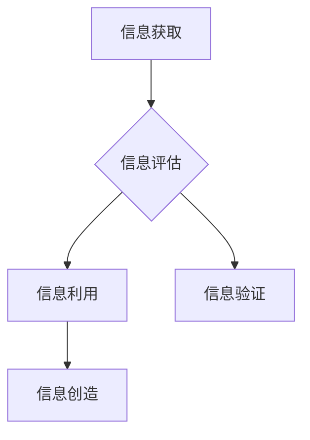

                 

## 信息验证和信息素养教育：为数字时代培养批判性思维和信息素养能力

> 关键词：信息验证、信息素养、批判性思维、数字时代、网络安全、媒体素养、人工智能

### 1. 背景介绍

我们生活在一个信息爆炸的时代，海量信息每天以惊人的速度涌入我们的视野。从社交媒体到新闻网站，从搜索引擎到在线课程，信息无处不在，也无处不在。然而，信息的真伪良莠不齐，如何有效地辨别真假信息，成为了当今社会面临的重大挑战。

传统的教育模式难以适应这个快速变化的信息环境。学生们需要具备更强的批判性思维能力，能够独立思考、分析和判断信息，才能在信息洪流中不被淹没，不被误导。因此，信息验证和信息素养教育成为培养21世纪公民必不可少的技能。

### 2. 核心概念与联系

**2.1 信息验证**

信息验证是指通过多种手段和方法，对信息的真实性、准确性、完整性和可靠性进行评估和确认的过程。它涉及到对信息来源、信息内容、信息结构和信息传播路径的分析和判断。

**2.2 信息素养**

信息素养是指在信息时代能够有效地获取、评估、利用和创造信息的能力。它包括以下几个方面：

* **信息获取能力:** 能够通过各种渠道和工具获取所需的信息。
* **信息评估能力:** 能够判断信息的真实性、准确性、完整性和可靠性。
* **信息利用能力:** 能够将获取的信息有效地应用于学习、工作和生活。
* **信息创造能力:** 能够生成新的信息，并将其以有效的方式传播。

**2.3 核心概念联系**

信息验证是信息素养的重要组成部分。只有具备了信息验证的能力，才能有效地评估信息的价值，做出明智的判断。



### 3. 核心算法原理 & 具体操作步骤

**3.1 算法原理概述**

信息验证算法通常基于以下几个核心原理：

* **来源分析:** 评估信息的来源可靠性，包括网站域名、作者身份、出版机构等。
* **内容分析:** 分析信息的真实性、准确性、完整性和客观性，例如识别虚假信息、谣言和偏见。
* **结构分析:** 分析信息的结构和格式，例如识别伪造的网页、文档和图像。
* **传播路径分析:** 跟踪信息的传播路径，识别信息来源和传播渠道。

**3.2 算法步骤详解**

1. **信息收集:** 收集待验证的信息，包括文本、图像、视频等多种形式。
2. **来源识别:** 利用机器学习算法识别信息的来源，例如网站域名、作者身份、出版机构等。
3. **内容分析:** 利用自然语言处理技术分析信息的文本内容，识别虚假信息、谣言和偏见。
4. **结构分析:** 利用计算机视觉技术分析信息的图像结构，识别伪造的网页、文档和图像。
5. **传播路径分析:** 利用网络分析技术跟踪信息的传播路径，识别信息来源和传播渠道。
6. **结果评估:** 根据以上分析结果，对信息的真实性、准确性和可靠性进行评估，并给出相应的评分或标签。

**3.3 算法优缺点**

* **优点:**

    * 自动化信息验证，提高效率。
    * 能够处理海量信息，识别难以察觉的虚假信息。
    * 提供客观、数据化的验证结果。

* **缺点:**

    * 算法本身存在局限性，无法识别所有类型的虚假信息。
    * 需要大量的数据进行训练，才能达到较高的准确率。
    * 算法结果可能存在偏差，需要人工进行最终判断。

**3.4 算法应用领域**

* **新闻媒体:** 验证新闻信息的真实性，防止谣言传播。
* **社交媒体:** 识别虚假账户和恶意内容，维护平台安全。
* **搜索引擎:** 排序搜索结果，提高用户体验。
* **教育领域:** 帮助学生辨别真假信息，培养信息素养。

### 4. 数学模型和公式 & 详细讲解 & 举例说明

**4.1 数学模型构建**

信息验证算法通常基于概率模型，例如贝叶斯网络和马尔可夫链。这些模型可以用来计算信息真实性的概率，并根据不同的特征进行权重分配。

**4.2 公式推导过程**

例如，可以使用贝叶斯定理来计算信息的真实性概率：

$$P(真|证据) = \frac{P(证据|真) * P(真)}{P(证据)}$$

其中：

* $P(真|证据)$ 是信息真实性的概率，给定证据的情况下。
* $P(证据|真)$ 是给定信息真实的情况下，观察到证据的概率。
* $P(真)$ 是信息真实性的先验概率。
* $P(证据)$ 是观察到证据的概率。

**4.3 案例分析与讲解**

假设我们想要验证一条新闻消息的真实性。我们可以收集以下证据：

* 新闻来源是知名媒体。
* 新闻内容与其他可靠来源一致。
* 新闻发布的时间和地点合理。

我们可以根据这些证据，计算新闻消息真实性的概率。例如，如果知名媒体发布虚假新闻的概率很低，那么给定该消息来自知名媒体的证据，其真实性概率会相应提高。

### 5. 项目实践：代码实例和详细解释说明

**5.1 开发环境搭建**

* Python 3.x
* NLTK 自然语言处理库
* Scikit-learn 机器学习库
* BeautifulSoup 网页解析库

**5.2 源代码详细实现**

```python
import nltk
from sklearn.feature_extraction.text import TfidfVectorizer
from sklearn.naive_bayes import MultinomialNB

# 下载 NLTK 数据集
nltk.download('punkt')
nltk.download('stopwords')

# 加载训练数据
train_data = [
    ("This is a fake news.", "fake"),
    ("This is a real news.", "real"),
    # ...
]

# 预处理文本数据
def preprocess_text(text):
    # 分词、去除停用词、转换小写等
    # ...

# 创建 TF-IDF 向量化器
vectorizer = TfidfVectorizer()

# 将训练数据转换为向量
train_vectors = vectorizer.fit_transform([preprocess_text(text) for text, label in train_data])
train_labels = [label for text, label in train_data]

# 训练 Naive Bayes 分类器
classifier = MultinomialNB()
classifier.fit(train_vectors, train_labels)

# 测试数据
test_text = "This is a news about a recent event."

# 将测试数据转换为向量
test_vector = vectorizer.transform([preprocess_text(test_text)])

# 预测测试数据的类别
prediction = classifier.predict(test_vector)[0]

# 输出预测结果
print(f"预测结果: {prediction}")
```

**5.3 代码解读与分析**

* 代码首先使用 NLTK 库对文本数据进行预处理，例如分词、去除停用词、转换小写等。
* 然后使用 Scikit-learn 库中的 TF-IDF 向量化器将文本数据转换为向量表示。
* 接着使用 Naive Bayes 分类器对训练数据进行训练。
* 最后，将测试数据转换为向量，并使用训练好的分类器进行预测。

**5.4 运行结果展示**

运行代码后，会输出预测结果，例如 "fake" 或 "real"。

### 6. 实际应用场景

**6.1 新闻媒体**

新闻媒体可以使用信息验证算法来验证新闻信息的真实性，防止谣言传播。例如，可以利用算法识别虚假新闻网站、识别伪造的图片和视频，并对新闻内容进行事实核查。

**6.2 社交媒体**

社交媒体平台可以使用信息验证算法来识别虚假账户和恶意内容，维护平台安全。例如，可以利用算法识别机器人账号、识别网络攻击和垃圾信息，并对违规内容进行封禁或删除。

**6.3 搜索引擎**

搜索引擎可以使用信息验证算法来提高搜索结果的准确性和可靠性。例如，可以利用算法识别虚假网站、识别垃圾链接，并对高质量的网站进行优先排序。

**6.4 教育领域**

教育机构可以使用信息验证算法来帮助学生辨别真假信息，培养信息素养。例如，可以利用算法设计信息验证游戏、开发信息素养教育软件，并引导学生学习批判性思维和信息评估技能。

**6.5 未来应用展望**

随着人工智能技术的不断发展，信息验证算法将更加智能化、自动化和精准化。未来，信息验证技术将应用于更广泛的领域，例如医疗、金融、法律等，帮助人们更好地应对信息爆炸时代带来的挑战。

### 7. 工具和资源推荐

**7.1 学习资源推荐**

* **书籍:**

    * 《信息素养：在数字时代生存的指南》
    * 《批判性思维：如何有效地思考和解决问题》

* **在线课程:**

    * Coursera: 信息素养
    * edX: 媒体素养

**7.2 开发工具推荐**

* **Python:** 强大的编程语言，广泛应用于信息验证领域。
* **NLTK:** 自然语言处理库，提供文本预处理、词性标注、语义分析等功能。
* **Scikit-learn:** 机器学习库，提供各种分类算法、聚类算法和回归算法。
* **BeautifulSoup:** 网页解析库，用于提取网页中的文本内容和结构信息。

**7.3 相关论文推荐**

* **Detecting Fake News with Deep Learning**
* **A Survey of Information Verification Techniques**
* **Towards a Framework for Evaluating Information Verification Systems**

### 8. 总结：未来发展趋势与挑战

**8.1 研究成果总结**

近年来，信息验证技术取得了显著进展，特别是深度学习技术的应用，使得信息验证算法更加准确、高效。

**8.2 未来发展趋势**

* **更智能化的信息验证算法:** 利用人工智能技术，开发更加智能化的信息验证算法，能够识别更加复杂的虚假信息。
* **跨语言信息验证:** 开发能够跨语言进行信息验证的算法，解决语言障碍带来的信息验证难题。
* **多模态信息验证:** 将文本、图像、音频等多种模态信息融合起来进行验证，提高验证的准确性和可靠性。

**8.3 面临的挑战**

* **虚假信息生成技术的不断发展:** 随着人工智能技术的进步，虚假信息生成技术也更加 sophisticated，信息验证算法需要不断更新和改进。
* **数据标注的困难:** 训练信息验证算法需要大量的标注数据，而标注虚假信息是一个耗时费力的工作。
* **伦理问题:** 信息验证技术可能会被滥用，例如用于审查言论自由或监控个人隐私，需要谨慎考虑伦理问题。

**8.4 研究展望**

未来，信息验证技术将继续朝着更加智能化、自动化和精准化的方向发展，为人们提供更加可靠的信息服务。同时，需要加强对信息验证技术的伦理规范和监管，确保其健康发展。

### 9. 附录：常见问题与解答

**9.1 如何判断一条信息是否真实？**

* 来源可靠吗？
* 内容客观吗？
* 有其他可靠来源证实吗？
* 信息结构是否合理？
* 发布者是否有利益冲突？

**9.2 如何保护自己免受虚假信息的影响？**

* 多方核实信息来源。
* 培养批判性思维，学会质疑信息。
* 关注信息来源的真实性。
* 避免在社交媒体上盲目转发信息。

**9.3 如何培养孩子的信息素养？**

* 引导孩子思考信息来源和内容。
* 帮助孩子识别虚假信息。
* 鼓励孩子多方求证信息。
* 营造良好的信息环境。


作者：禅与计算机程序设计艺术 / Zen and the Art of Computer Programming 
<end_of_turn>

